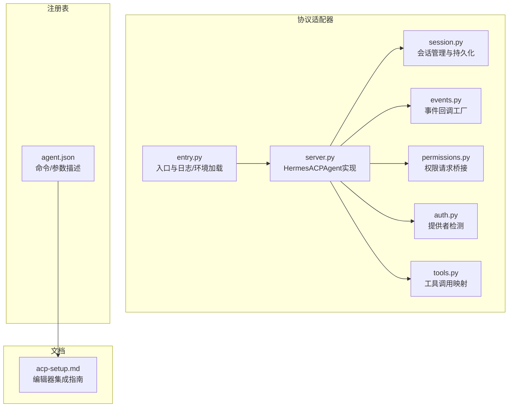
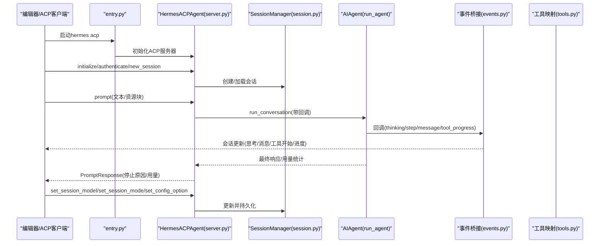
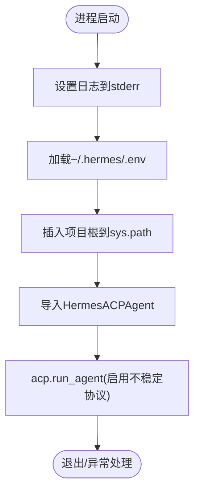
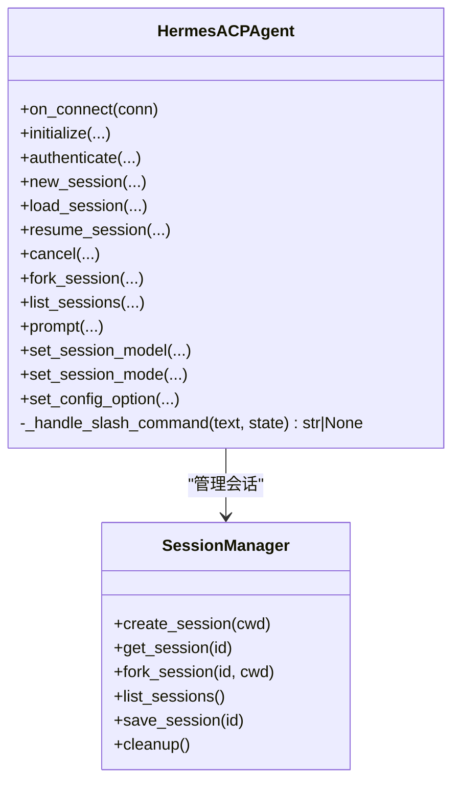
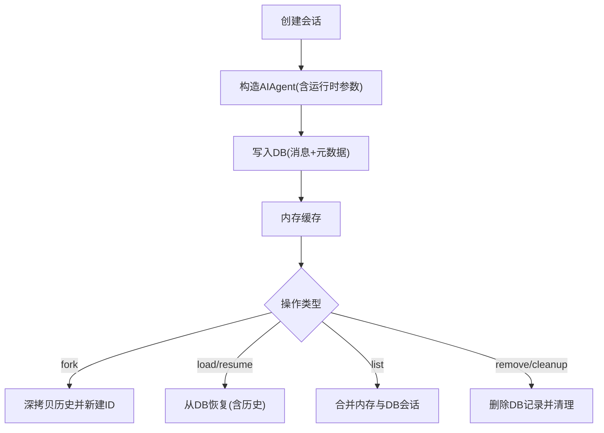
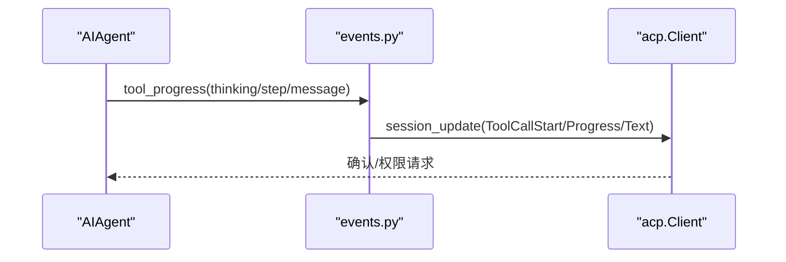
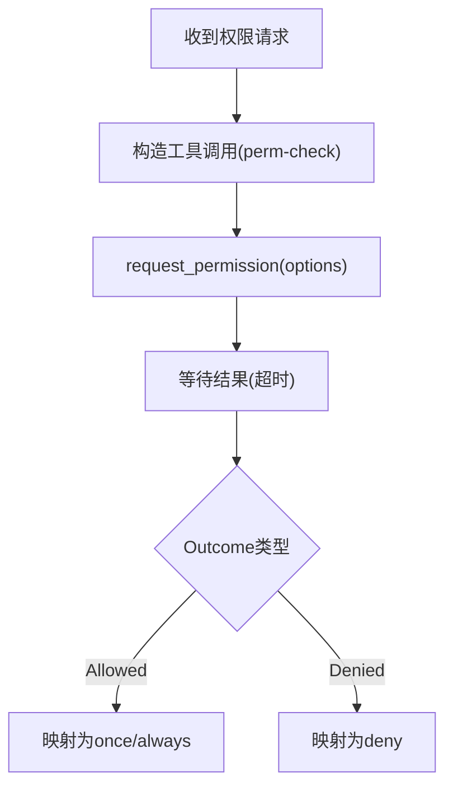
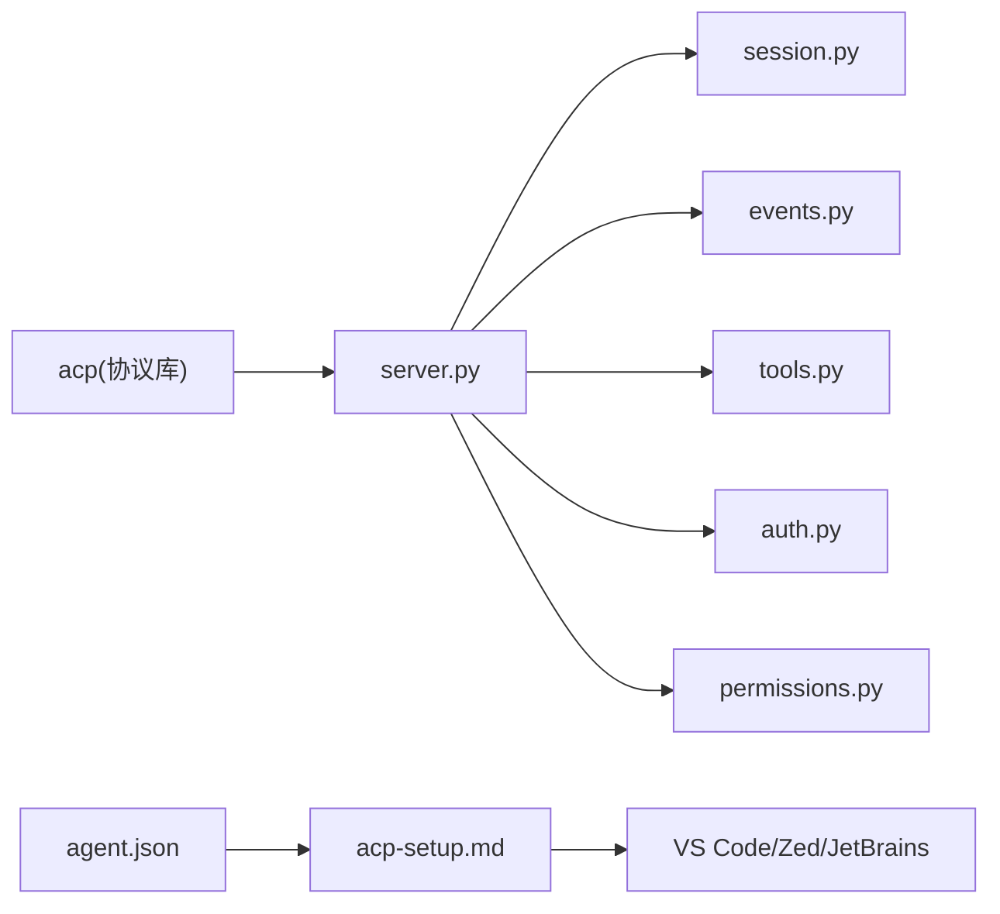

# ACPI协议支持

<cite>
**本文引用的文件**
- [acp_adapter/__init__.py](file://acp_adapter/__init__.py)
- [acp_adapter/entry.py](file://acp_adapter/entry.py)
- [acp_adapter/server.py](file://acp_adapter/server.py)
- [acp_adapter/auth.py](file://acp_adapter/auth.py)
- [acp_adapter/session.py](file://acp_adapter/session.py)
- [acp_adapter/events.py](file://acp_adapter/events.py)
- [acp_adapter/permissions.py](file://acp_adapter/permissions.py)
- [acp_adapter/tools.py](file://acp_adapter/tools.py)
- [acp_registry/agent.json](file://acp_registry/agent.json)
- [docs/acp-setup.md](file://docs/acp-setup.md)
- [tests/acp/test_server.py](file://tests/acp/test_server.py)
- [tests/acp/test_auth.py](file://tests/acp/test_auth.py)
- [tests/acp/test_session.py](file://tests/acp/test_session.py)
</cite>

## 目录
1. [简介](#简介)
2. [项目结构](#项目结构)
3. [核心组件](#核心组件)
4. [架构总览](#架构总览)
5. [详细组件分析](#详细组件分析)
6. [依赖关系分析](#依赖关系分析)
7. [性能考虑](#性能考虑)
8. [故障排除指南](#故障排除指南)
9. [结论](#结论)
10. [附录](#附录)

## 简介
本文件面向Hermes Agent的ACPI（Agent Client Protocol）协议支持，系统性阐述协议规范与编辑器集成原理，详解协议适配器的实现与配置方法，并覆盖与VS Code、Zed、JetBrains系列等主流编辑器的集成步骤。同时提供协议适配器开发指南（接口实现、认证机制、通信协议）、在代码生成、智能提示与开发辅助中的应用场景、具体集成示例与配置步骤、以及故障排除与性能优化建议。

## 项目结构
围绕ACPI协议支持的核心目录与文件如下：
- 协议适配器：acp_adapter
  - 入口与运行时：entry.py、server.py
  - 认证与权限：auth.py、permissions.py
  - 会话管理：session.py
  - 事件桥接与工具映射：events.py、tools.py
- 注册表：acp_registry/agent.json
- 文档：docs/acp-setup.md
- 测试：tests/acp/*（覆盖server、auth、session）

**图表来源**
- [acp_adapter/entry.py:1-86](file://acp_adapter/entry.py#L1-L86)
- [acp_adapter/server.py:1-729](file://acp_adapter/server.py#L1-L729)
- [acp_adapter/session.py:1-476](file://acp_adapter/session.py#L1-L476)
- [acp_adapter/events.py:1-176](file://acp_adapter/events.py#L1-L176)
- [acp_adapter/permissions.py:1-78](file://acp_adapter/permissions.py#L1-L78)
- [acp_adapter/auth.py:1-25](file://acp_adapter/auth.py#L1-L25)
- [acp_adapter/tools.py:1-215](file://acp_adapter/tools.py#L1-L215)
- [acp_registry/agent.json:1-13](file://acp_registry/agent.json#L1-L13)
- [docs/acp-setup.md:1-229](file://docs/acp-setup.md#L1-L229)

**章节来源**
- [acp_adapter/__init__.py:1-2](file://acp_adapter/__init__.py#L1-L2)
- [acp_adapter/entry.py:1-86](file://acp_adapter/entry.py#L1-L86)
- [acp_adapter/server.py:1-729](file://acp_adapter/server.py#L1-L729)
- [acp_adapter/session.py:1-476](file://acp_adapter/session.py#L1-L476)
- [acp_adapter/events.py:1-176](file://acp_adapter/events.py#L1-L176)
- [acp_adapter/permissions.py:1-78](file://acp_adapter/permissions.py#L1-L78)
- [acp_adapter/auth.py:1-25](file://acp_adapter/auth.py#L1-L25)
- [acp_adapter/tools.py:1-215](file://acp_adapter/tools.py#L1-L215)
- [acp_registry/agent.json:1-13](file://acp_registry/agent.json#L1-L13)
- [docs/acp-setup.md:1-229](file://docs/acp-setup.md#L1-L229)

## 核心组件
- 协议适配器入口与运行时
  - 负责从用户环境加载配置、设置日志输出到stderr、启动异步ACP服务器。
- ACP代理实现（HermesACPAgent）
  - 实现initialize/authenticate/new_session/load_session/resume_session/prompt等ACP协议方法。
  - 提供slash命令（如/help、/model、/tools、/context、/reset、/compact、/version）。
  - 将Hermes AIAgent的回调事件映射为ACP通知（思考、步骤、消息、工具调用）。
- 会话管理（SessionManager）
  - 维护内存中会话状态，持久化至共享数据库（state.db），支持fork/list/load/resume/cancel。
- 权限桥接（make_approval_callback）
  - 将ACP客户端的权限请求映射为Hermes内部审批流程。
- 事件桥接（回调工厂）
  - 将AIAgent的thinking/step/message/tool_progress事件转换为ACP会话更新。
- 工具映射（tools）
  - 将Hermes工具名映射为ACP ToolKind，构建工具调用标题与内容块。
- 认证辅助（auth）
  - 检测当前已配置的运行时提供者，用于ACP authenticate阶段。

**章节来源**
- [acp_adapter/entry.py:58-86](file://acp_adapter/entry.py#L58-L86)
- [acp_adapter/server.py:93-729](file://acp_adapter/server.py#L93-L729)
- [acp_adapter/session.py:70-476](file://acp_adapter/session.py#L70-L476)
- [acp_adapter/permissions.py:26-78](file://acp_adapter/permissions.py#L26-L78)
- [acp_adapter/events.py:47-176](file://acp_adapter/events.py#L47-L176)
- [acp_adapter/tools.py:20-215](file://acp_adapter/tools.py#L20-L215)
- [acp_adapter/auth.py:8-25](file://acp_adapter/auth.py#L8-L25)

## 架构总览
下图展示从编辑器发起ACP请求到Hermes执行任务并返回结果的端到端流程。

**图表来源**
- [acp_adapter/entry.py:58-86](file://acp_adapter/entry.py#L58-L86)
- [acp_adapter/server.py:217-729](file://acp_adapter/server.py#L217-L729)
- [acp_adapter/session.py:94-476](file://acp_adapter/session.py#L94-L476)
- [acp_adapter/events.py:27-176](file://acp_adapter/events.py#L27-L176)
- [acp_adapter/tools.py:104-215](file://acp_adapter/tools.py#L104-L215)

## 详细组件分析

### 协议适配器入口与运行时（entry.py）
- 日志重定向：将日志输出到stderr，保证stdout仅用于ACP JSON-RPC传输。
- 环境加载：从用户家目录加载.env配置，便于提供API密钥与运行时参数。
- 进程启动：动态插入项目根路径，导入并运行HermesACPAgent。

**图表来源**
- [acp_adapter/entry.py:23-86](file://acp_adapter/entry.py#L23-L86)

**章节来源**
- [acp_adapter/entry.py:1-86](file://acp_adapter/entry.py#L1-L86)

### ACP代理实现（HermesACPAgent，server.py）
- 生命周期与能力
  - initialize：返回协议版本、代理信息与会话能力（fork/list/resume）。
  - authenticate：若已检测到有效提供者则允许认证。
- 会话管理
  - new_session/load_session/resume_session/fork_session/list_sessions/cancel。
  - 通过SessionManager维护会话状态与工作目录。
- 核心对话
  - prompt：解析内容块为纯文本；拦截slash命令本地处理；否则调用AIAgent执行并流式回传事件。
  - slash命令：help/model/tools/context/reset/compact/version。
- 配置与模式
  - set_session_model：切换会话模型。
  - set_session_mode：记录编辑器请求的模式。
  - set_config_option：接受ACP配置项更新（暂存于会话）。

**图表来源**
- [acp_adapter/server.py:93-729](file://acp_adapter/server.py#L93-L729)
- [acp_adapter/session.py:70-476](file://acp_adapter/session.py#L70-L476)

**章节来源**
- [acp_adapter/server.py:93-729](file://acp_adapter/server.py#L93-L729)

### 会话管理与持久化（session.py）
- 内存+持久化双层存储：会话在内存中快速访问，并持久化至~/.hermes/state.db。
- 任务工作目录绑定：为工具执行提供cwd上下文。
- 会话生命周期：创建、fork（深拷贝历史）、load/resume（从DB恢复）、list、remove、cleanup。
- Agent重建：根据会话元数据（provider/base_url/api_mode/cwd）重建AIAgent实例。

**图表来源**
- [acp_adapter/session.py:94-476](file://acp_adapter/session.py#L94-L476)

**章节来源**
- [acp_adapter/session.py:1-476](file://acp_adapter/session.py#L1-L476)

### 事件桥接与工具映射（events.py、tools.py）
- 事件桥接
  - tool_progress/thinking/step/message：将AIAgent回调转换为ACP会话更新，使用线程安全队列确保跨线程事件顺序。
- 工具映射
  - 将Hermes工具名映射为ACP ToolKind（read/edit/search/execute/fetch/think/other），并生成人类可读标题与内容块。
  - 支持diff/文本/位置等工具内容构建。

**图表来源**
- [acp_adapter/events.py:27-176](file://acp_adapter/events.py#L27-L176)
- [acp_adapter/tools.py:104-215](file://acp_adapter/tools.py#L104-L215)

**章节来源**
- [acp_adapter/events.py:1-176](file://acp_adapter/events.py#L1-L176)
- [acp_adapter/tools.py:1-215](file://acp_adapter/tools.py#L1-L215)

### 权限桥接（permissions.py）
- 将ACP request_permission映射为Hermes审批回调，支持“允许一次/总是”、“拒绝一次/总是”，并设定超时自动拒绝。

**图表来源**
- [acp_adapter/permissions.py:43-78](file://acp_adapter/permissions.py#L43-L78)

**章节来源**
- [acp_adapter/permissions.py:1-78](file://acp_adapter/permissions.py#L1-L78)

### 认证辅助（auth.py）
- detect_provider：解析当前运行时提供者与API Key，仅当两者均有效时才认为可用。
- has_provider：布尔判断。

**章节来源**
- [acp_adapter/auth.py:1-25](file://acp_adapter/auth.py#L1-L25)

## 依赖关系分析
- 外部协议库：acp（Agent Client Protocol）。
- 运行时集成：hermes_cli（配置、运行时提供者解析）、hermes_state（SessionDB）。
- 工具系统：model_tools（工具定义）、tools.*（终端/浏览器/网络等工具）。
- 编辑器注册：acp_registry/agent.json声明命令与参数，供编辑器发现与启动。

**图表来源**
- [acp_adapter/server.py:11-60](file://acp_adapter/server.py#L11-L60)
- [acp_registry/agent.json:7-12](file://acp_registry/agent.json#L7-L12)
- [docs/acp-setup.md:24-229](file://docs/acp-setup.md#L24-L229)

**章节来源**
- [acp_adapter/server.py:1-729](file://acp_adapter/server.py#L1-L729)
- [acp_registry/agent.json:1-13](file://acp_registry/agent.json#L1-L13)
- [docs/acp-setup.md:1-229](file://docs/acp-setup.md#L1-L229)

## 性能考虑
- 异步与线程池：ACP事件循环与AIAgent同步执行通过线程池隔离，避免阻塞。
- 事件流式传输：增量推送思考、消息与工具进度，降低感知延迟。
- 上下文压缩：在ACP会话中可调用上下文压缩以控制token占用。
- 日志级别：默认INFO，必要时提升DEBUG以诊断性能瓶颈。
- 网络与速率限制：关注上游提供商的速率限制与网络状况。

[本节为通用指导，无需特定文件引用]

## 故障排除指南
- 编辑器未发现Agent
  - 检查acp_registry路径与agent.json存在性；确认hermes在PATH中；重启编辑器。
- 启动后立即报错
  - 使用hermes doctor检查配置；确认hermes status显示有效API Key；直接运行hermes acp查看stderr日志。
- “模块未找到”
  - 安装ACP额外依赖：pip install -e ".[acp]"。
- 响应缓慢
  - 检查网络与提供商状态；尝试切换模型/提供者；观察是否被限流。
- 终端命令被拒绝
  - 在编辑器ACP客户端设置中调整自动/手动批准策略。
- 查看日志
  - ACP模式下日志输出到stderr；可在编辑器输出面板或终端查看；可通过环境变量提高日志级别。

**章节来源**
- [docs/acp-setup.md:174-229](file://docs/acp-setup.md#L174-L229)

## 结论
Hermes Agent通过ACPI协议实现了与多种编辑器的深度集成，借助会话管理、事件桥接与工具映射，提供了近原生的开发体验。其设计强调可扩展性（MCP服务器注册）、安全性（权限桥接）、可观测性（流式事件与日志）与持久化（跨进程会话恢复）。按照本文档的配置与开发指南，可快速完成协议适配器的部署与二次开发。

[本节为总结，无需特定文件引用]

## 附录

### 编辑器集成步骤（VS Code、Zed、JetBrains）
- VS Code
  - 安装ACP Client扩展；在settings.json中配置agents.registryDir指向acp_registry；重启VS Code。
- Zed
  - 在settings.json中添加agent_servers配置，指定hermes命令与参数；重启Zed。
- JetBrains系列
  - 安装ACP插件；在设置中添加新Agent，注册acp_registry目录；打开ACP面板选择Hermes Agent。

**章节来源**
- [docs/acp-setup.md:24-115](file://docs/acp-setup.md#L24-L115)

### 协议适配器开发指南
- 接口实现
  - 继承并实现initialize/authenticate/new_session/load_session/resume_session/prompt/set_session_model/set_session_mode/set_config_option等方法。
- 认证机制
  - 使用detect_provider/has_provider检测运行时提供者；authenticate返回认证响应。
- 通信协议
  - 使用acp.Client进行会话更新与权限请求；事件通过events.py桥接到ACP通知。
- 工具与权限
  - 通过tools.py映射工具调用；通过permissions.py桥接权限请求。
- 配置与持久化
  - 会话状态保存至SessionDB；工作目录通过session.py绑定到工具执行环境。

**章节来源**
- [acp_adapter/server.py:217-729](file://acp_adapter/server.py#L217-L729)
- [acp_adapter/auth.py:8-25](file://acp_adapter/auth.py#L8-L25)
- [acp_adapter/events.py:27-176](file://acp_adapter/events.py#L27-L176)
- [acp_adapter/permissions.py:26-78](file://acp_adapter/permissions.py#L26-L78)
- [acp_adapter/tools.py:20-215](file://acp_adapter/tools.py#L20-L215)
- [acp_adapter/session.py:238-476](file://acp_adapter/session.py#L238-L476)

### 应用场景
- 代码生成：通过prompt接收自然语言任务，AIAgent生成/编辑文件，编辑器以diff形式呈现。
- 智能提示：在会话中逐步输出思考与中间结果，辅助开发者理解与决策。
- 开发辅助：执行终端命令、浏览网页、图像识别等，统一在编辑器界面内完成并可审批。

**章节来源**
- [acp_adapter/server.py:352-467](file://acp_adapter/server.py#L352-L467)
- [acp_adapter/events.py:97-176](file://acp_adapter/events.py#L97-L176)
- [acp_adapter/tools.py:104-215](file://acp_adapter/tools.py#L104-L215)

### 测试参考
- server：覆盖initialize/capabilities/authenticate/new_session/available_commands等。
- auth：覆盖detect_provider/has_provider行为。
- session：覆盖create/fork/list/save/remove/cleanup与DB持久化。

**章节来源**
- [tests/acp/test_server.py:51-200](file://tests/acp/test_server.py#L51-L200)
- [tests/acp/test_auth.py:6-57](file://tests/acp/test_auth.py#L6-L57)
- [tests/acp/test_session.py:29-200](file://tests/acp/test_session.py#L29-L200)