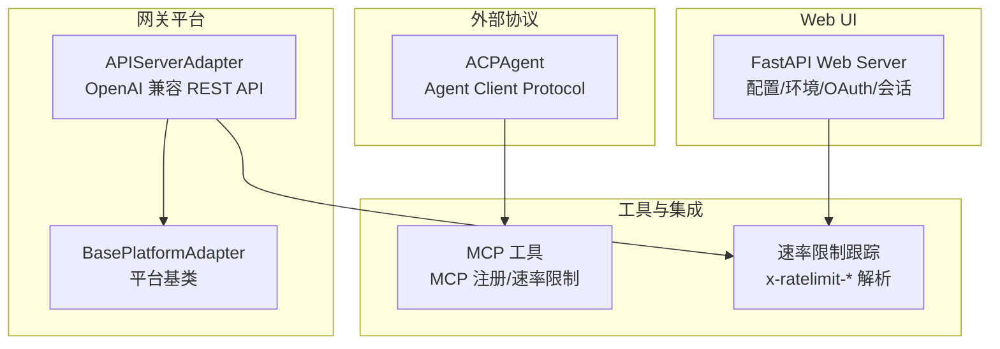
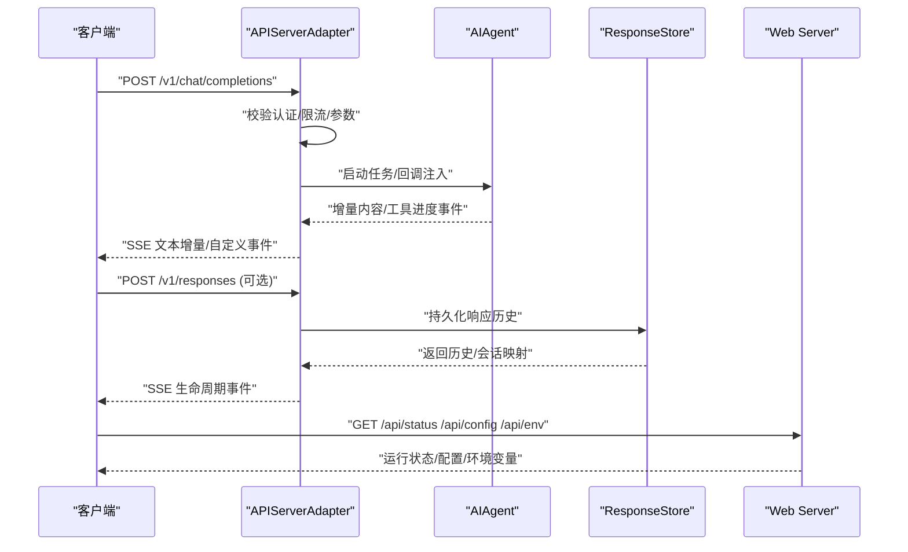
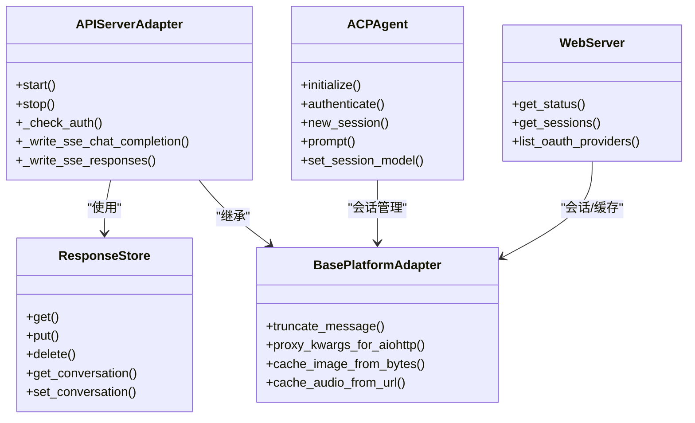

# API参考

<cite>
**本文档引用的文件**
- [gateway/platforms/api_server.py](file://gateway/platforms/api_server.py)
- [hermes_cli/web_server.py](file://hermes_cli/web_server.py)
- [acp_adapter/server.py](file://acp_adapter/server.py)
- [gateway/platforms/base.py](file://gateway/platforms/base.py)
- [hermes_cli/main.py](file://hermes_cli/main.py)
- [agent/rate_limit_tracker.py](file://agent/rate_limit_tracker.py)
- [tools/mcp_tool.py](file://tools/mcp_tool.py)
- [tests/gateway/test_api_server.py](file://tests/gateway/test_api_server.py)
</cite>

## 目录
1. [简介](#简介)
2. [项目结构](#项目结构)
3. [核心组件](#核心组件)
4. [架构总览](#架构总览)
5. [详细组件分析](#详细组件分析)
6. [依赖关系分析](#依赖关系分析)
7. [性能考量](#性能考量)
8. [故障排查指南](#故障排查指南)
9. [结论](#结论)
10. [附录](#附录)

## 简介
本文件为 Hermes Agent 的全面 API 参考，覆盖以下能力：
- REST API：HTTP 方法、URL 模式、请求/响应模式与认证方式
- SDK 使用指南与集成示例
- WebSocket API：连接处理、消息格式与实时交互模式
- Socket API：连接协议、数据帧与状态管理
- IPC/Pipe 通信：数据流、消息传递与进程同步
- 具体 API 使用示例与错误处理策略
- 安全考虑、速率限制与版本管理
- 迁移指南与向后兼容性说明

## 项目结构
Hermes Agent 的 API 能力主要由以下模块提供：
- 网关平台适配器：提供 OpenAI 兼容的 REST API（聊天补全、Responses API、运行流等）
- Web UI 服务器：FastAPI 后端，提供配置、环境变量、会话管理与 OAuth 状态查询
- ACP 适配器：通过 Agent Client Protocol 暴露 Hermes Agent
- 平台基类：统一的消息类型、发送结果与缓存工具
- CLI 入口：命令入口与容器执行路由
- 速率限制跟踪：解析与展示提供商返回的速率限制头
- MCP 工具：MCP 服务注册与速率限制

图表来源
- [gateway/platforms/api_server.py:1-2437](file://gateway/platforms/api_server.py#L1-L2437)
- [hermes_cli/web_server.py:1-2351](file://hermes_cli/web_server.py#L1-L2351)
- [acp_adapter/server.py:1-729](file://acp_adapter/server.py#L1-L729)
- [gateway/platforms/base.py:1-2165](file://gateway/platforms/base.py#L1-L2165)
- [agent/rate_limit_tracker.py:1-32](file://agent/rate_limit_tracker.py#L1-L32)
- [tools/mcp_tool.py:416-439](file://tools/mcp_tool.py#L416-L439)

章节来源
- [gateway/platforms/api_server.py:1-2437](file://gateway/platforms/api_server.py#L1-L2437)
- [hermes_cli/web_server.py:1-2351](file://hermes_cli/web_server.py#L1-L2351)
- [acp_adapter/server.py:1-729](file://acp_adapter/server.py#L1-L729)
- [gateway/platforms/base.py:1-2165](file://gateway/platforms/base.py#L1-L2165)
- [hermes_cli/main.py:1-6528](file://hermes_cli/main.py#L1-L6528)
- [agent/rate_limit_tracker.py:1-32](file://agent/rate_limit_tracker.py#L1-L32)
- [tools/mcp_tool.py:416-439](file://tools/mcp_tool.py#L416-L439)

## 核心组件
- OpenAI 兼容 REST API 服务器：提供 /v1/chat/completions、/v1/responses、/v1/models、/v1/runs/events、/health 等端点，支持 SSE 流式输出与会话续传
- Web UI 服务器：提供 /api/* 端点用于配置、环境变量、OAuth 状态与会话检索
- ACP 适配器：实现 ACP 协议的 Initialize/Authenticate/NewSession/Prompt 等生命周期方法
- 平台基类：定义消息类型、发送结果、媒体缓存与代理设置等通用能力
- CLI 入口：hermes 命令入口，支持容器内执行与会话浏览
- 速率限制跟踪：解析 x-ratelimit-* 头并提供使用率与剩余时间统计
- MCP 工具：MCP 服务注册、速率限制与指标收集

章节来源
- [gateway/platforms/api_server.py:1-2437](file://gateway/platforms/api_server.py#L1-L2437)
- [hermes_cli/web_server.py:1-2351](file://hermes_cli/web_server.py#L1-L2351)
- [acp_adapter/server.py:1-729](file://acp_adapter/server.py#L1-L729)
- [gateway/platforms/base.py:1-2165](file://gateway/platforms/base.py#L1-L2165)
- [agent/rate_limit_tracker.py:1-32](file://agent/rate_limit_tracker.py#L1-L32)
- [tools/mcp_tool.py:416-439](file://tools/mcp_tool.py#L416-L439)

## 架构总览
下图展示了 Hermes Agent 的 API 层与外部系统的交互关系。

图表来源
- [gateway/platforms/api_server.py:569-1599](file://gateway/platforms/api_server.py#L569-L1599)
- [hermes_cli/web_server.py:373-804](file://hermes_cli/web_server.py#L373-L804)

章节来源
- [gateway/platforms/api_server.py:569-1599](file://gateway/platforms/api_server.py#L569-L1599)
- [hermes_cli/web_server.py:373-804](file://hermes_cli/web_server.py#L373-L804)

## 详细组件分析

### REST API（OpenAI 兼容）
- 基础地址：默认 http://127.0.0.1:8642/v1
- 认证方式：Bearer Token（可选），未配置时允许本地访问
- 主要端点：
  - POST /v1/chat/completions
    - 支持 stream 参数进行 SSE 实时流式输出
    - 支持 X-Hermes-Session-Id 头以续传会话历史
    - 支持 Idempotency-Key 请求去重
  - POST /v1/responses
    - 支持 SSE 生命周期事件（response.created/response.completed/response.failed 等）
    - 支持 previous_response_id/conversation 进行状态链式调用
    - 支持 store 控制是否持久化
  - GET /v1/responses/{response_id}
    - 获取已存储的响应
  - DELETE /v1/responses/{response_id}
    - 删除已存储的响应
  - GET /v1/models
    - 返回可用模型列表（基于当前配置推断）
  - POST /v1/runs
    - 启动一次运行，立即返回 run_id
  - GET /v1/runs/{run_id}/events
    - SSE 事件流，返回运行生命周期事件
  - GET /health
    - 健康检查
  - GET /health/detailed
    - 详细运行状态（含网关状态、平台、活跃代理数等）

认证与安全
- Authorization: Bearer {API_KEY}（当配置了密钥时）
- CORS 支持按 Origin 白名单控制
- 请求体大小限制（默认 1MB）
- 防重放：Idempotency-Key + 内存指纹缓存
- 会话续传：需配置 API_KEY，否则拒绝

SSE 事件类型（Responses API）
- response.created：初始封装，status=in_progress
- response.output_text.delta/done：文本增量与完成
- response.output_item.added/done：函数调用项开始/结束与结果项
- response.completed：终端事件，包含完整输出与用量
- response.failed：终端事件，包含错误信息

章节来源
- [gateway/platforms/api_server.py:1-2437](file://gateway/platforms/api_server.py#L1-L2437)
- [tests/gateway/test_api_server.py:158-189](file://tests/gateway/test_api_server.py#L158-L189)

### Web UI REST API
- 基础地址：http://127.0.0.1:9119（默认）
- 认证方式：会话令牌 Bearer，仅对 /api/ 路径生效（公开端点例外）
- 主要端点：
  - GET /api/status：返回版本、运行状态、网关健康、活动会话数等
  - GET /api/sessions：分页列出会话
  - GET /api/sessions/search：全文搜索会话消息
  - GET/PUT /api/config：读取/更新配置
  - GET /api/config/defaults：默认配置结构
  - GET /api/config/schema：配置字段元数据
  - GET /api/model/info：当前模型上下文窗口与能力
  - GET/PUT/DELETE /api/env：环境变量读取/设置/删除
  - POST /api/env/reveal：显示敏感值（带速率限制）
  - GET /api/providers/oauth：OAuth 提供商状态
  - POST /api/providers/oauth/{provider}/start：开始 OAuth 登录流程
  - POST /api/providers/oauth/{provider}/submit：提交授权码
  - GET /api/providers/oauth/{provider}/poll/{session_id}：轮询设备码状态

章节来源
- [hermes_cli/web_server.py:1-2351](file://hermes_cli/web_server.py#L1-L2351)

### ACP（Agent Client Protocol）API
- 协议版本：遵循 acp.schema
- 关键方法：
  - initialize：返回协议版本、代理能力与认证方法
  - authenticate：基于当前运行时凭据进行认证
  - new_session/load_session/resume_session：会话生命周期管理
  - prompt：用户提示词执行，支持工具调用与消息更新
  - set_session_model/set_session_mode/set_config_option：会话配置更新
- 会话管理：SessionManager 维护会话历史与工具表面刷新
- 事件推送：通过 acp.Client 发送消息更新与可用命令更新

章节来源
- [acp_adapter/server.py:1-729](file://acp_adapter/server.py#L1-L729)

### WebSocket API（平台适配器）
- 适用平台：如 Mattermost、QQBot、WeCom 等
- 连接处理：
  - 建立 WebSocket 连接（ws/wss）
  - 认证阶段：发送挑战/接收验证结果
  - 订阅事件：确认订阅并进入事件循环
- 消息格式：JSON 文本帧
- 实时交互：按平台协议分发事件（如心跳、回调、消息）
- 状态管理：断线重连（指数退避）、会话失效处理、连接标记

章节来源
- [gateway/platforms/mattermost.py:530-558](file://gateway/platforms/mattermost.py#L530-L558)
- [gateway/platforms/qqbot.py:452-480](file://gateway/platforms/qqbot.py#L452-L480)
- [gateway/platforms/wecom.py:354-389](file://gateway/platforms/wecom.py#L354-L389)
- [tests/fakes/fake_ha_server.py:174-213](file://tests/fakes/fake_ha_server.py#L174-L213)

### Socket API（套接字）
- 适用场景：平台内部或第三方桥接（如 WhatsApp 桥接）
- 连接协议：HTTP/HTTPS + WebSocket（ws/wss）
- 数据帧：文本 JSON 帧
- 状态管理：鉴权、订阅、心跳、错误码处理与重连

章节来源
- [scripts/whatsapp-bridge/bridge.js:484-540](file://scripts/whatsapp-bridge/bridge.js#L484-L540)

### IPC/Pipe 通信
- 进程同步：通过子进程与管道进行命令执行与输出捕获
- 数据流：stdin/stdout/stderr 管道，避免阻塞死锁
- 共享常量：沙箱目录、缓存目录等路径约定

章节来源
- [tools/environments/base.py:86-87](file://tools/environments/base.py#L86-L87)

### SDK 使用指南与集成示例
- OpenAI 兼容 SDK：直接使用 OpenAI SDK 客户端指向 http://127.0.0.1:8642/v1
- 认证：在 SDK 中设置 Authorization: Bearer {API_KEY}
- 流式输出：启用 stream=true，监听增量内容
- 会话续传：在请求头中添加 X-Hermes-Session-Id
- 去重：使用 Idempotency-Key 避免重复请求
- Web UI：通过 /api/* 端点进行配置与状态查询

章节来源
- [gateway/platforms/api_server.py:569-1599](file://gateway/platforms/api_server.py#L569-L1599)
- [hermes_cli/web_server.py:373-804](file://hermes_cli/web_server.py#L373-L804)

## 依赖关系分析

图表来源
- [gateway/platforms/api_server.py:369-789](file://gateway/platforms/api_server.py#L369-L789)
- [gateway/platforms/base.py:1-2165](file://gateway/platforms/base.py#L1-L2165)
- [acp_adapter/server.py:93-729](file://acp_adapter/server.py#L93-L729)
- [hermes_cli/web_server.py:373-1051](file://hermes_cli/web_server.py#L373-L1051)

章节来源
- [gateway/platforms/api_server.py:369-789](file://gateway/platforms/api_server.py#L369-L789)
- [gateway/platforms/base.py:1-2165](file://gateway/platforms/base.py#L1-L2165)
- [acp_adapter/server.py:93-729](file://acp_adapter/server.py#L93-L729)
- [hermes_cli/web_server.py:373-1051](file://hermes_cli/web_server.py#L373-L1051)

## 性能考量
- SSE 流式输出：保持长连接，合理的心跳与保活机制
- 去重缓存：基于 Idempotency-Key 的内存指纹缓存，降低重复计算
- 会话续传：通过数据库持久化会话历史，减少重复上下文传输
- 代理与网络：支持 HTTP/HTTPS/SOCKS 代理，自动检测系统代理
- 速率限制：解析 x-ratelimit-* 头，提供使用率与剩余时间统计

章节来源
- [gateway/platforms/api_server.py:281-342](file://gateway/platforms/api_server.py#L281-L342)
- [agent/rate_limit_tracker.py:1-32](file://agent/rate_limit_tracker.py#L1-L32)
- [gateway/platforms/base.py:148-230](file://gateway/platforms/base.py#L148-L230)

## 故障排查指南
常见问题与处理建议：
- 认证失败（401）
  - 检查 Authorization: Bearer {API_KEY} 是否正确
  - 若未配置密钥，本地访问可能被允许；远程访问需配置密钥
- 请求体过大（413）
  - 检查 Content-Length 与 MAX_REQUEST_BYTES 限制
- 会话续传被拒绝（403）
  - 需配置 API_SERVER_KEY 才能通过 X-Hermes-Session-Id 续传
- SSE 客户端断开
  - 服务端会中断任务并取消异步任务，确保资源回收
- OAuth 登录失败
  - 检查 provider 状态与会话有效性，必要时重新发起登录流程

章节来源
- [tests/gateway/test_api_server.py:158-189](file://tests/gateway/test_api_server.py#L158-L189)
- [gateway/platforms/api_server.py:840-970](file://gateway/platforms/api_server.py#L840-L970)
- [hermes_cli/web_server.py:1022-1683](file://hermes_cli/web_server.py#L1022-L1683)

## 结论
Hermes Agent 提供了完整的 API 生态：从 OpenAI 兼容的 REST API 到 Web UI、ACP 协议、WebSocket 与 Socket 通信，以及 IPC/Pipe 的进程间协作。通过认证、CORS、限流与去重等机制保障安全性与稳定性，并提供详细的速率限制与会话管理能力，满足多场景集成需求。

## 附录

### 版本管理与迁移
- 版本信息：Web UI 返回版本与发布日期
- 配置版本：/api/config 与 /api/config/defaults 支持版本检查
- 迁移指南：CLI 提供迁移命令与步骤说明

章节来源
- [hermes_cli/web_server.py:373-476](file://hermes_cli/web_server.py#L373-L476)
- [hermes_cli/main.py:1-6528](file://hermes_cli/main.py#L1-L6528)