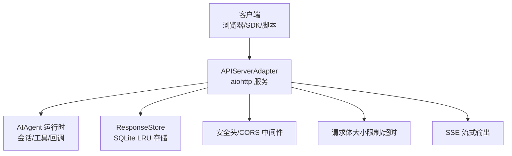
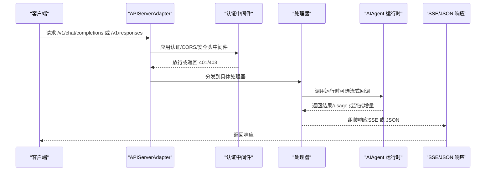
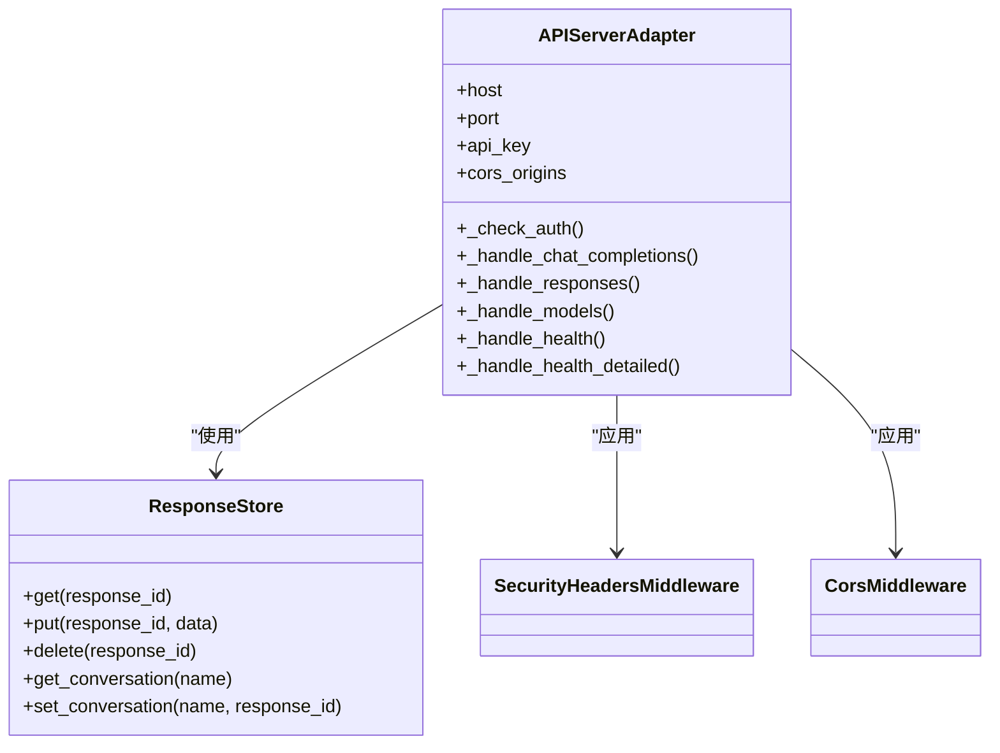

# REST API

<cite>
**本文引用的文件**
- [gateway/platforms/api_server.py](file://gateway/platforms/api_server.py)
- [tests/gateway/test_api_server.py](file://tests/gateway/test_api_server.py)
- [gateway/config.py](file://gateway/config.py)
- [hermes_cli/web_server.py](file://hermes_cli/web_server.py)
- [gateway/platforms/base.py](file://gateway/platforms/base.py)
</cite>

## 目录
1. [简介](#简介)
2. [项目结构](#项目结构)
3. [核心组件](#核心组件)
4. [架构总览](#架构总览)
5. [详细组件分析](#详细组件分析)
6. [依赖关系分析](#依赖关系分析)
7. [性能与容量特性](#性能与容量特性)
8. [故障排查指南](#故障排查指南)
9. [结论](#结论)
10. [附录：端点规范与示例](#附录端点规范与示例)

## 简介
本文件为 Hermes Agent 的 REST API 文档，聚焦于 OpenAI 兼容的 HTTP 接口（/v1 路由），涵盖以下能力：
- 对话补全（/v1/chat/completions）
- 响应流式接口（/v1/responses）
- 模型列表查询（/v1/models）
- 健康检查（/health、/health/detailed）
- 响应存储与链式调用（/v1/responses/{response_id} 的获取与删除）

同时，文档说明认证方式（Bearer Token）、请求头、查询参数、路径参数、请求体字段、成功与错误响应格式、错误码与处理策略，并给出速率限制、缓存策略、版本管理与安全建议。

## 项目结构
与 REST API 直接相关的核心文件与职责如下：
- gateway/platforms/api_server.py：实现 OpenAI 兼容的 aiohttp 服务端适配器，提供 /v1/* 端点、认证、CORS、安全头、SSE 流、响应存储等。
- tests/gateway/test_api_server.py：覆盖端点行为、认证、错误处理、SSE 行为等测试。
- gateway/config.py：平台配置定义，包含平台枚举、平台配置数据类等，用于理解 API Server 的运行环境与可选配置项。
- hermes_cli/web_server.py：本地 Web UI 后端（非 /v1 API），但展示了会话令牌与中间件鉴权模式，有助于理解系统整体的安全策略。
- gateway/platforms/base.py：平台基类与通用工具，包含网络可达性判断、代理解析、媒体缓存等辅助能力，间接影响 API Server 的网络与安全边界。

图表来源
- [gateway/platforms/api_server.py:369-970](file://gateway/platforms/api_server.py#L369-L970)
- [gateway/platforms/base.py:77-110](file://gateway/platforms/base.py#L77-L110)

章节来源
- [gateway/platforms/api_server.py:1-120](file://gateway/platforms/api_server.py#L1-L120)
- [gateway/config.py:48-70](file://gateway/config.py#L48-L70)

## 核心组件
- APIServerAdapter：基于 aiohttp 的 HTTP 服务器适配器，负责路由注册、认证校验、CORS、安全头、SSE 流、响应存储、会话派生与运行时代理等。
- ResponseStore：基于 SQLite 的 LRU 响应存储，支持按 response_id 获取/删除，按会话名映射最新 response_id。
- 安全中间件：CORS 中间件与安全头中间件，分别控制跨域与响应头安全策略。
- 认证：Bearer Token 校验；当未配置密钥时，默认允许本地访问（仅限本地使用）。
- SSE 写入器：将流式增量输出写为标准 SSE，支持自定义事件类型（如工具进度）。

章节来源
- [gateway/platforms/api_server.py:369-563](file://gateway/platforms/api_server.py#L369-L563)
- [gateway/platforms/api_server.py:125-230](file://gateway/platforms/api_server.py#L125-L230)
- [gateway/platforms/api_server.py:232-311](file://gateway/platforms/api_server.py#L232-L311)
- [gateway/platforms/api_server.py:468-489](file://gateway/platforms/api_server.py#L468-L489)

## 架构总览
下图展示 /v1 路由到内部运行时的交互流程，以及关键中间件与存储组件：

图表来源
- [gateway/platforms/api_server.py:569-970](file://gateway/platforms/api_server.py#L569-L970)
- [gateway/platforms/api_server.py:1393-1599](file://gateway/platforms/api_server.py#L1393-L1599)

## 详细组件分析

### 认证与安全
- 认证方式
  - Bearer Token：通过请求头 Authorization: Bearer <token> 提供。若配置了 API_SERVER_KEY，则必须匹配；否则返回 401。
  - 无密钥配置：当未设置 API_SERVER_KEY 时，默认允许访问（仅限本地使用场景）。该行为在测试中得到验证。
- 安全头
  - 默认添加 X-Content-Type-Options: nosniff 与 Referrer-Policy: no-referrer。
- CORS
  - 支持 Origin 白名单或通配符；OPTIONS 预检需明确允许。
- 会话续期
  - 通过请求头 X-Hermes-Session-Id 可续接历史会话；但要求已配置 API_SERVER_KEY，否则拒绝并返回 403。

章节来源
- [gateway/platforms/api_server.py:468-489](file://gateway/platforms/api_server.py#L468-L489)
- [gateway/platforms/api_server.py:236-298](file://gateway/platforms/api_server.py#L236-L298)
- [tests/gateway/test_api_server.py:158-200](file://tests/gateway/test_api_server.py#L158-L200)
- [tests/gateway/test_api_server.py:248-331](file://tests/gateway/test_api_server.py#L248-L331)

### /v1/chat/completions（对话补全）
- 方法与路径
  - POST /v1/chat/completions
- 请求头
  - Authorization: Bearer <token>（需配置 API_SERVER_KEY）
  - Content-Type: application/json
  - 可选：Idempotency-Key（幂等键）
  - 可选：X-Hermes-Session-Id（续会话）
- 查询参数：无
- 路径参数：无
- 请求体字段
  - model: 字符串（可选，默认模型名）
  - messages: 数组（必填，至少包含一个用户消息）
  - stream: 布尔（可选，true 则返回 SSE）
  - 其他 OpenAI 兼容字段（如 tools、tool_choice 等）在幂等指纹计算中被纳入考虑
- 成功响应
  - 非流式：返回 OpenAI 兼容的 chat.completion 结构，包含 choices[].message.content、usage 等。
  - 流式：SSE，事件类型为 chat.completion.chunk，最后发送 [DONE]。
  - 响应头：X-Hermes-Session-Id（标识会话）
- 错误响应
  - 400：无效 JSON、缺失 messages、messages 格式错误、无用户消息等
  - 401：无效或缺失 Bearer Token
  - 403：续会话需要 API_KEY（未配置时）
  - 500：运行时异常
- 示例
  - 成功（非流式）：见测试用例中的断言与响应结构
  - 成功（流式）：SSE 输出包含 role chunk、内容增量、usage chunk 与 [DONE]
  - 错误（400/401/500）：见测试用例对错误路径的断言

章节来源
- [gateway/platforms/api_server.py:615-838](file://gateway/platforms/api_server.py#L615-L838)
- [gateway/platforms/api_server.py:840-970](file://gateway/platforms/api_server.py#L840-L970)
- [tests/gateway/test_api_server.py:408-774](file://tests/gateway/test_api_server.py#L408-L774)

### /v1/responses（响应流式接口）
- 方法与路径
  - POST /v1/responses
  - GET /v1/responses/{response_id}
  - DELETE /v1/responses/{response_id}
- 请求头
  - Authorization: Bearer <token>（需配置 API_SERVER_KEY）
  - Content-Type: application/json
  - 可选：Idempotency-Key（幂等键）
- 查询参数
  - GET /v1/responses/{response_id}：无
- 路径参数
  - response_id：响应 ID
- 请求体字段（POST）
  - input: 字符串或字符串数组（必填）
  - instructions: 字符串（可选，作为临时系统提示）
  - previous_response_id: 字符串（可选，与 conversation 互斥）
  - conversation: 字符串（可选，与 previous_response_id 互斥；将解析为最新 response_id）
  - conversation_history: 数组（可选，显式传入历史）
  - store: 布尔（可选，默认 true；是否持久化）
  - model: 字符串（可选）
  - truncation: 字符串（可选，值为 "auto" 时自动截断历史长度）
  - stream: 布尔（可选，true 则返回 SSE）
- 成功响应
  - 非流式：返回 OpenAI Responses 兼容结构（包含 output、usage 等）
  - 流式：SSE，事件类型包括 response.created、response.output_text.delta/done、response.output_item.added/done、response.completed/response.failed
  - GET /v1/responses/{response_id}：返回之前保存的完整响应
  - DELETE /v1/responses/{response_id}：删除指定响应，返回布尔结果
- 错误响应
  - 400：input 缺失或格式错误、conversation 与 previous_response_id 同时提供、conversation_history 格式错误、无用户消息等
  - 401：无效或缺失 Bearer Token
  - 404：previous_response_id 不存在
  - 500：运行时异常
- 示例
  - 成功（流式）：SSE 包含多个事件类型，最终完成事件携带完整 output 与 usage
  - 成功（非流式）：返回包含 output 与 usage 的响应
  - 删除：返回删除成功标志

章节来源
- [gateway/platforms/api_server.py:1393-1599](file://gateway/platforms/api_server.py#L1393-L1599)
- [gateway/platforms/api_server.py:972-1391](file://gateway/platforms/api_server.py#L972-L1391)

### /v1/models（模型列表）
- 方法与路径
  - GET /v1/models
- 请求头
  - Authorization: Bearer <token>（需配置 API_SERVER_KEY）
- 查询参数：无
- 路径参数：无
- 成功响应
  - 返回 OpenAI 兼容的 models 列表，其中包含一个 Hermes 模型条目（id、owned_by 等）
- 错误响应
  - 401：无效或缺失 Bearer Token

章节来源
- [gateway/platforms/api_server.py:594-613](file://gateway/platforms/api_server.py#L594-L613)
- [tests/gateway/test_api_server.py:338-401](file://tests/gateway/test_api_server.py#L338-L401)

### /health 与 /health/detailed（健康检查）
- 方法与路径
  - GET /health
  - GET /health/detailed
- 请求头：无需认证
- 查询参数：无
- 路径参数：无
- 成功响应
  - /health：返回状态与平台信息
  - /health/detailed：返回更丰富的运行时状态（网关状态、平台列表、活跃代理数、进程 ID 等）
- 错误响应：无（不需认证）

章节来源
- [gateway/platforms/api_server.py:569-593](file://gateway/platforms/api_server.py#L569-L593)
- [tests/gateway/test_api_server.py:248-331](file://tests/gateway/test_api_server.py#L248-L331)

## 依赖关系分析
- 组件耦合
  - APIServerAdapter 依赖运行时配置解析、会话数据库、工具集加载、AIAgent 执行器。
  - SSE 写入器与运行时回调解耦，通过队列传递增量。
  - ResponseStore 与会话数据库解耦，仅通过 response_id 与会话名进行映射。
- 外部依赖
  - aiohttp（HTTP 与 SSE）
  - sqlite3（响应存储）
  - hermes_state.SessionDB（会话历史续期）
- 可能的循环依赖
  - 未发现直接循环导入；模块间通过函数与类进行协作。

图表来源
- [gateway/platforms/api_server.py:369-563](file://gateway/platforms/api_server.py#L369-L563)
- [gateway/platforms/api_server.py:125-230](file://gateway/platforms/api_server.py#L125-L230)
- [gateway/platforms/api_server.py:232-311](file://gateway/platforms/api_server.py#L232-L311)

章节来源
- [gateway/platforms/api_server.py:369-563](file://gateway/platforms/api_server.py#L369-L563)

## 性能与容量特性
- 请求体大小限制
  - 默认最大请求体为 1 MB；超过将返回 413。
- SSE 保活
  - 在长时间无增量时发送 keepalive 注释，避免代理/浏览器超时。
- 幂等性
  - 支持 Idempotency-Key，对相同请求指纹进行缓存，减少重复计算。
- 响应存储
  - 基于 SQLite 的 LRU 存储，超出容量时按最近最少使用淘汰。
- 会话派生
  - 基于首次用户消息与系统提示生成稳定会话 ID，便于跨轮次复用同一容器沙箱目录。

章节来源
- [gateway/platforms/api_server.py:52-60](file://gateway/platforms/api_server.py#L52-L60)
- [gateway/platforms/api_server.py:281-293](file://gateway/platforms/api_server.py#L281-L293)
- [gateway/platforms/api_server.py:313-342](file://gateway/platforms/api_server.py#L313-L342)
- [gateway/platforms/api_server.py:125-230](file://gateway/platforms/api_server.py#L125-L230)
- [gateway/platforms/api_server.py:351-367](file://gateway/platforms/api_server.py#L351-L367)

## 故障排查指南
- 400 错误
  - 检查请求体 JSON 是否有效，messages 字段是否存在且为数组，最后一个元素是否为用户消息。
- 401/403 错误
  - 确认 Authorization 头是否为 Bearer Token，且与 API_SERVER_KEY 匹配。
  - 若使用 X-Hermes-Session-Id 续会话，请确保已配置 API_SERVER_KEY。
- 413 错误
  - 减小请求体大小或调整 Content-Length。
- 500 错误
  - 查看后端日志，确认运行时异常原因。
- SSE 断开
  - 客户端断开时，服务端会中断运行时任务并取消异步任务；检查网络稳定性与代理设置。

章节来源
- [tests/gateway/test_api_server.py:408-774](file://tests/gateway/test_api_server.py#L408-L774)
- [gateway/platforms/api_server.py:281-293](file://gateway/platforms/api_server.py#L281-L293)
- [gateway/platforms/api_server.py:952-970](file://gateway/platforms/api_server.py#L952-L970)

## 结论
Hermes Agent 的 /v1 REST API 提供了与 OpenAI 兼容的对话补全与响应流式接口，具备完善的认证、CORS、安全头、SSE 流与响应存储能力。通过 Bearer Token 保障访问安全，结合幂等键与 LRU 存储提升可用性与性能。建议在生产环境中始终启用 API 密钥，并合理配置 CORS 与安全头，以满足多端接入与安全合规需求。

## 附录：端点规范与示例

### 端点一览
- GET /health
  - 用途：健康检查
  - 认证：否
  - 响应：状态与平台信息
- GET /health/detailed
  - 用途：详细运行时状态
  - 认证：否
  - 响应：网关状态、平台列表、活跃代理数、进程 ID 等
- GET /v1/models
  - 用途：列出可用模型
  - 认证：是（Bearer Token）
  - 响应：OpenAI 兼容 models 列表
- POST /v1/chat/completions
  - 用途：对话补全
  - 认证：是（Bearer Token）
  - 请求体：messages、model、stream、tools、tool_choice 等
  - 响应：非流式返回 chat.completion；流式返回 SSE（chat.completion.chunk）
- POST /v1/responses
  - 用途：响应流式接口
  - 认证：是（Bearer Token）
  - 请求体：input、instructions、previous_response_id、conversation、conversation_history、store、model、truncation、stream
  - 响应：非流式返回 Responses 兼容结构；流式返回 SSE（多种事件类型）
- GET /v1/responses/{response_id}
  - 用途：获取指定响应
  - 认证：是（Bearer Token）
  - 响应：保存的完整响应
- DELETE /v1/responses/{response_id}
  - 用途：删除指定响应
  - 认证：是（Bearer Token）
  - 响应：布尔删除结果

### 请求头与认证
- Authorization: Bearer <token>（Bearer Token）
- Content-Type: application/json
- Idempotency-Key（可选，用于幂等）
- X-Hermes-Session-Id（可选，续会话）

### 错误码与处理策略
- 400：请求体格式错误、缺少必要字段、历史格式错误等
- 401：无效或缺失 Bearer Token
- 403：续会话需要 API_KEY（未配置时）
- 404：previous_response_id 不存在
- 413：请求体过大
- 500：运行时异常

### 速率限制、缓存与版本
- 速率限制：未内置全局限速策略；建议在网关层或反向代理处配置限速与熔断。
- 缓存策略：幂等键缓存（Idempotency-Key）；响应存储采用 LRU。
- 版本管理：/v1 路由遵循 OpenAI 兼容语义；模型名称可通过配置覆盖。

### 安全考虑与最佳实践
- 始终启用 API 密钥（API_SERVER_KEY），避免明文暴露。
- 严格限制 CORS Origins，避免通配符滥用。
- 使用安全头（X-Content-Type-Options、Referrer-Policy）增强防护。
- 对外暴露时建议置于反向代理之后，统一做 TLS 终止与访问审计。
- SSE 客户端断开时会中断任务，注意前端重连与错误恢复逻辑。