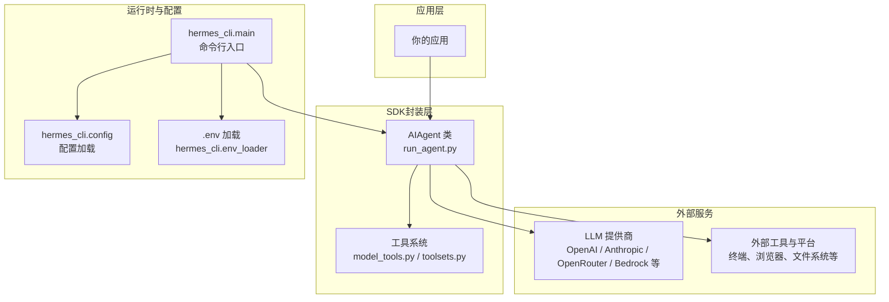
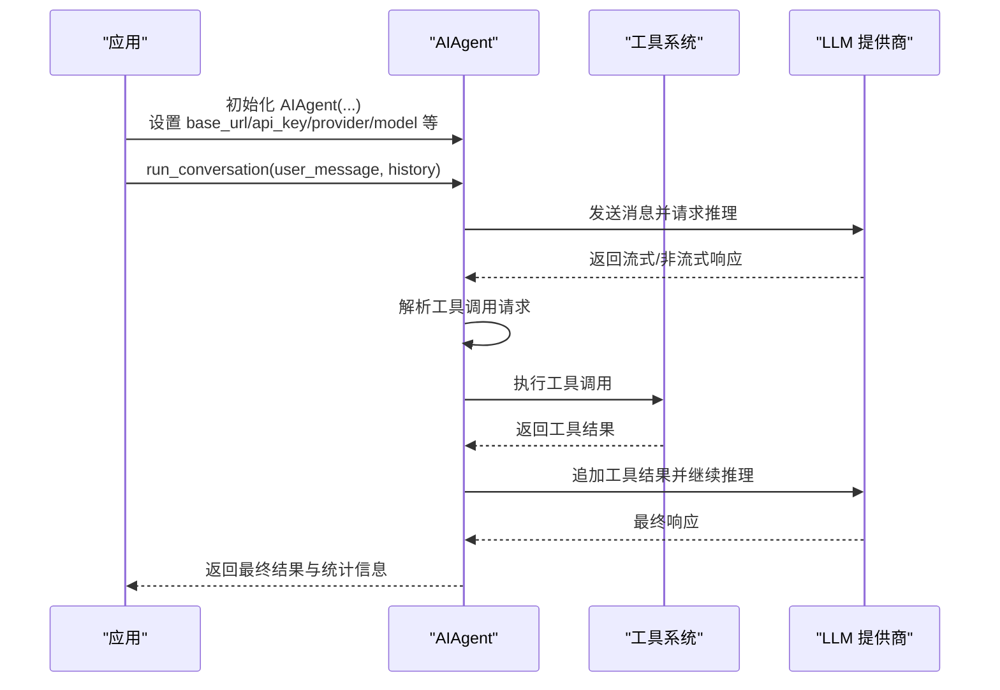

# SDK接口

<cite>
**本文引用的文件**
- [README.md](file://README.md)
- [pyproject.toml](file://pyproject.toml)
- [run_agent.py](file://run_agent.py)
- [hermes_cli/main.py](file://hermes_cli/main.py)
- [hermes_cli/__init__.py](file://hermes_cli/__init__.py)
- [agent/__init__.py](file://agent/__init__.py)
- [AGENTS.md](file://AGENTS.md)
</cite>

## 目录
1. [简介](#简介)
2. [项目结构](#项目结构)
3. [核心组件](#核心组件)
4. [架构总览](#架构总览)
5. [详细组件分析](#详细组件分析)
6. [依赖分析](#依赖分析)
7. [性能考虑](#性能考虑)
8. [故障排查指南](#故障排查指南)
9. [结论](#结论)
10. [附录](#附录)

## 简介
本指南面向希望在应用中集成 Hermes Agent 的开发者，提供 Python SDK 的安装、初始化、类与方法说明、常见使用场景、配置与环境变量、错误处理与异常管理、性能优化与调试技巧，以及版本更新与迁移参考。SDK 的核心能力由 run_agent.py 中的 AIAgent 类提供，支持多模型提供商、工具调用、流式输出、会话管理与上下文压缩等。

## 项目结构
Hermes Agent 采用模块化设计，核心入口与运行逻辑集中在 run_agent.py，CLI 与网关入口位于 hermes_cli/main.py。SDK 的对外使用主要围绕 AIAgent 类展开，同时通过 hermes_cli 提供命令行与配置加载能力。

图表来源
- [run_agent.py](file://run_agent.py)
- [hermes_cli/main.py](file://hermes_cli/main.py)

章节来源
- [AGENTS.md](file://AGENTS.md)
- [run_agent.py](file://run_agent.py)
- [hermes_cli/main.py](file://hermes_cli/main.py)

## 核心组件
- AIAgent：核心对话与工具调用编排器，负责模型客户端初始化、工具发现与执行、消息历史管理、流式回调、会话持久化与上下文压缩。
- 工具系统：通过 model_tools.py 与 toolsets.py 提供工具定义、工具集过滤与工具执行桥接。
- CLI 与配置：hermes_cli.main 负责命令解析、环境变量加载、配置读取与初始化；支持按需加载 .env 并设置网络偏好。

章节来源
- [run_agent.py](file://run_agent.py)
- [hermes_cli/main.py](file://hermes_cli/main.py)

## 架构总览
SDK 的典型调用路径如下：应用创建 AIAgent 实例，传入 base_url、api_key、provider、模型名等参数；随后调用 run_conversation 发起一次或多轮对话；在工具调用阶段，AIAgent 通过工具系统执行具体动作，并将结果回填到对话历史，直至达到终止条件。

图表来源
- [run_agent.py](file://run_agent.py)

## 详细组件分析

### AIAgent 类
AIAgent 是 SDK 的核心类，封装了模型客户端初始化、工具发现与执行、消息历史管理、回调机制、会话持久化与上下文压缩等功能。

- 构造函数参数（节选）
  - base_url：模型 API 基础地址（可选）
  - api_key：认证密钥（可选，优先使用环境变量）
  - provider：提供商标识（用于遥测与路由提示）
  - api_mode：API 模式覆盖（chat_completions / codex_responses / anthropic_messages / bedrock_converse）
  - model：模型名称（默认值参见源码注释）
  - max_iterations：最大工具调用迭代次数（默认 90）
  - tool_delay：工具调用间隔秒数（默认 1.0）
  - enabled_toolsets/disabled_toolsets：启用/禁用工具集（可选）
  - save_trajectories：是否保存轨迹到 JSONL（默认 False）
  - verbose_logging/quiet_mode：日志级别控制（默认 False）
  - ephemeral_system_prompt：仅本次执行使用的系统提示（不保存到轨迹）
  - log_prefix_chars/log_prefix：日志前缀长度与前缀字符串
  - providers_allowed/providers_ignored/providers_order/provider_sort：OpenRouter 提供商筛选与排序
  - provider_require_parameters/provider_data_collection：提供商参数与数据收集策略
  - session_id：预设会话 ID（可选，自动生成）
  - 各类回调：tool_progress_callback/tool_start_callback/tool_complete_callback/thinking_callback/reasoning_callback/clarify_callback/step_callback/stream_delta_callback/interim_assistant_callback/tool_gen_callback/status_callback
  - max_tokens：最大输出 token 数（可选）
  - reasoning_config：OpenRouter 推理配置覆盖（例如 effort:none 禁用思考）
  - prefill_messages：前置消息列表（可选）
  - platform：平台标识（如 cli/telegram/discord 等）
  - skip_context_files：跳过自动注入上下文文件（批量处理时使用）
  - 其他内部状态：中断机制、子代理委托、速率限制跟踪、活动时间戳等

- 方法与职责
  - run_conversation(user_message, conversation_history, stream_callback=None, task_id=None, persist_user_message=None)：发起一次或多轮对话，返回包含最终响应、消息列表、API 调用次数与完成状态的结果字典。
  - 其他内部方法：工具执行、消息清理与转义、客户端重建、会话持久化、上下文压缩、轨迹保存等。

- 返回值类型
  - run_conversation 返回 dict，包含 final_response、messages、api_calls、completed、failed、error 等键，便于上层应用处理。

- 回调机制
  - 支持多种回调以实现进度通知、流式增量输出、思考过程展示、工具执行状态等。回调在工具执行与流式响应阶段触发，便于集成 UI 或日志系统。

- 异常与错误处理
  - 初始化阶段若未配置提供商且显式指定非 OpenRouter 提供商，将抛出明确错误，提示设置对应环境变量或切换提供商。
  - run_conversation 内部捕获异常并生成摘要，返回包含 error 字段的结果字典，确保上层不会因单次调用失败而崩溃。

- 性能特性
  - 提供提示缓存（Anthropic）、细粒度工具流式（OpenRouter + Claude）、迭代预算控制、工具并行执行策略（安全集合与路径隔离）等。

- 配置与环境变量
  - 支持从 ~/.hermes/.env 与项目根目录 .env 加载环境变量，优先级后者覆盖前者。
  - CLI 层面支持 IPv4 优先、日志集中写入 agent.log 与 errors.log。

章节来源
- [run_agent.py](file://run_agent.py)
- [hermes_cli/main.py](file://hermes_cli/main.py)

### 工具系统
- 工具定义与发现：通过 get_tool_definitions 获取可用工具列表，并支持 enabled_toolsets/disabled_toolsets 过滤。
- 工具执行：handle_function_call 将工具调用映射到具体实现，结合 check_toolset_requirements 检查运行时依赖。
- 工具集：_HERMES_CORE_TOOLS 列表定义核心工具集，便于按需启用/禁用。

章节来源
- [run_agent.py](file://run_agent.py)

### CLI 与配置加载
- hermes_cli.main 负责：
  - 解析命令行参数与子命令
  - 应用配置覆盖（如 --profile/-p 设置 HERMES_HOME）
  - 加载 .env（用户目录优先于项目根目录）
  - 初始化集中式日志与 IPv4 优先策略
  - 分发到各子命令（chat、gateway、setup 等）

章节来源
- [hermes_cli/main.py](file://hermes_cli/main.py)
- [hermes_cli/__init__.py](file://hermes_cli/__init__.py)

## 依赖分析
- Python 版本：要求 Python >= 3.11
- 核心依赖：openai、anthropic、httpx、pyyaml、requests、jinja2、pydantic、prompt_toolkit、rich、tenacity、fire 等
- 可选依赖：messaging（Telegram/Discord/Slack）、cron、voice（本地语音）、pty、honcho、mcp、homeassistant、sms、acp、mistral、bedrock、web、rl 等
- extras：可按平台与功能选择安装，如 [all]、[messaging]、[voice]、[web] 等

章节来源
- [pyproject.toml](file://pyproject.toml)

## 性能考虑
- 工具并行执行：对只读与独立路径工具采用并行策略，避免竞态与覆盖风险；交互型工具（如 clarify）强制串行。
- 上下文压缩：在长对话中自动压缩上下文，降低 token 消耗与延迟。
- 提示缓存：对 Claude 模型启用提示缓存，显著降低多轮对话输入成本。
- 细粒度工具流式：针对 OpenRouter + Claude 场景开启细粒度工具流式，保持连接活跃，减少超时与静默等待。
- 迭代预算：统一的迭代预算控制，防止无限循环与资源耗尽。
- 会话持久化：SQLite 会话存储与 FTS5 搜索，兼顾并发与查询效率。

## 故障排查指南
- 未配置提供商
  - 现象：初始化时报错，提示未配置提供商或缺少 API Key。
  - 处理：运行 hermes model 或 hermes setup 完成配置；或设置对应 PROVIDER_API_KEY 环境变量。
- 认证失败或无效 API Key
  - 现象：客户端初始化成功但后续调用报错。
  - 处理：检查 API Key 是否正确、是否被提供商封禁；在 quiet 模式下可通过日志前缀识别会话 ID 并定位问题。
- 工具不可用或缺失依赖
  - 现象：工具列表为空或部分工具不可用。
  - 处理：确认 enabled_toolsets/disabled_toolsets 配置；检查 check_toolset_requirements 输出的缺失依赖。
- 会话持久化失败
  - 现象：会话创建或写入失败（SQLite 锁竞争）。
  - 处理：日志会记录警告但仍保持功能可用；稍后重试或避免 CLI 与网关并发写入。
- 网络与 DNS 问题
  - 处理：CLI 层支持 IPv4 优先策略；必要时在 .env 中设置代理或调整网络配置。

章节来源
- [run_agent.py](file://run_agent.py)
- [hermes_cli/main.py](file://hermes_cli/main.py)

## 结论
Hermes Agent 的 Python SDK 以 AIAgent 为核心，提供了完善的模型接入、工具调用、会话管理与可观测性能力。通过合理的配置与回调机制，开发者可以快速构建从 CLI 到网关、从本地到多平台的消息系统的智能代理应用。建议在生产环境中启用提示缓存、工具并行与上下文压缩，并结合回调与日志体系完善监控与排障。

## 附录

### 安装与初始化
- 安装
  - 使用 uv 或 pip 安装项目（推荐使用 extras 按需安装），确保 Python >= 3.11。
- 初始化
  - CLI：hermes setup 完成首次配置；hermes model 选择提供商与模型。
  - 程序化：直接实例化 AIAgent，传入 base_url、api_key、provider、model 等参数。

章节来源
- [README.md](file://README.md)
- [pyproject.toml](file://pyproject.toml)
- [hermes_cli/main.py](file://hermes_cli/main.py)

### 常见使用场景
- 创建会话并发送消息
  - 步骤：实例化 AIAgent → 调用 run_conversation(user_message, conversation_history) → 处理返回结果。
- 流式输出
  - 步骤：注册 stream_delta_callback → 在 run_conversation 中传入 stream_callback → 实时接收增量文本。
- 工具调用
  - 步骤：启用所需工具集 → run_conversation 自动解析并执行工具 → 获取工具结果并继续推理。
- 会话管理
  - 步骤：设置 session_id 或让 SDK 自动生成 → 通过 session_db 持久化 → 后续恢复或检索。

章节来源
- [run_agent.py](file://run_agent.py)

### 配置选项与环境变量
- 环境变量
  - OPENROUTER_API_KEY、OPENAI_API_KEY、ANTHROPIC_API_KEY、ANTHROPIC_TOKEN、OPENAI_BASE_URL 等。
  - 各提供商特定的 API Key 环境变量（由 PROVIDER_REGISTRY 映射）。
- 配置文件
  - ~/.hermes/config.yaml（模型、提供商、工具集、网关等配置）
  - ~/.hermes/.env（密钥与敏感配置）
- CLI 行为
  - hermes_cli.main 会在启动时加载 .env 并设置日志与网络偏好。

章节来源
- [hermes_cli/main.py](file://hermes_cli/main.py)

### 错误处理与异常管理最佳实践
- 显式处理初始化错误：当显式指定提供商但未找到 API Key 时，应引导用户设置环境变量或切换提供商。
- run_conversation 返回字典：上层应用应检查 completed/failed/error 字段，决定是否重试或提示用户。
- 回调中捕获异常：工具执行与流式回调可能抛出异常，应在回调中妥善处理并记录。

章节来源
- [run_agent.py](file://run_agent.py)

### 性能优化建议
- 启用提示缓存：对 Claude 模型（含 OpenRouter）自动启用。
- 使用工具并行：对只读与独立路径工具启用并行执行，提升吞吐。
- 控制迭代预算：合理设置 max_iterations，避免长尾任务占用资源。
- 减少上下文长度：在长对话中启用上下文压缩与记忆裁剪。
- 选择合适 API 模式：根据提供商与模型特性选择 chat_completions / codex_responses / anthropic_messages / bedrock_converse。

章节来源
- [run_agent.py](file://run_agent.py)

### 调试技巧
- 启用详细日志：verbose_logging 打印第三方库日志；quiet_mode 抑制控制台噪声，保留文件日志。
- 使用会话 ID：通过日志前缀与 session_id 定位问题。
- 观察回调：利用 tool_progress_callback、thinking_callback、stream_delta_callback 等回调观察执行细节。
- 检查工具依赖：通过 check_toolset_requirements 输出缺失依赖并补齐。

章节来源
- [run_agent.py](file://run_agent.py)

### 版本更新与迁移指南
- 版本号与发布信息：参考 hermes_cli/__init__.py 中的版本与发布日期。
- 迁移参考：README.md 提供从 OpenClaw 迁移的步骤与选项。
- 依赖变更：pyproject.toml 中列出核心与可选依赖，升级时注意版本范围与兼容性。

章节来源
- [hermes_cli/__init__.py](file://hermes_cli/__init__.py)
- [README.md](file://README.md)
- [pyproject.toml](file://pyproject.toml)