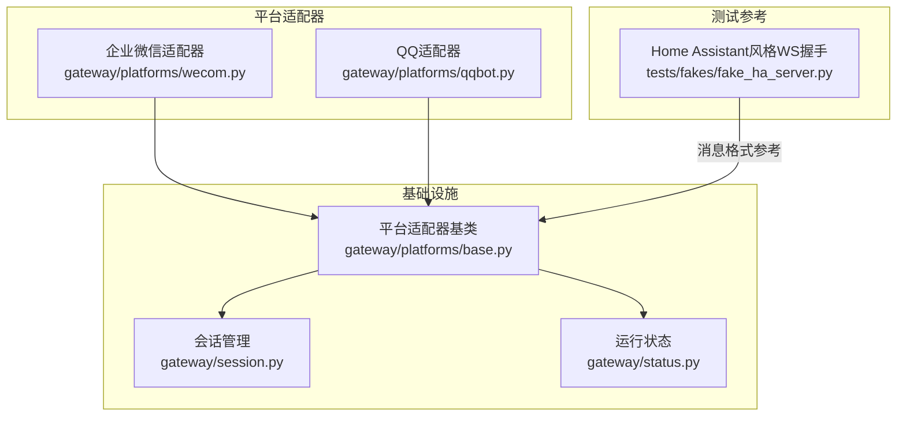
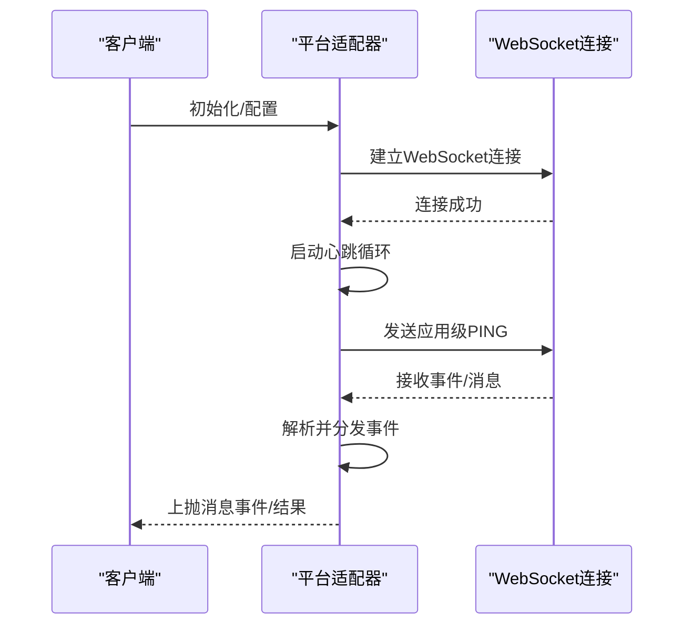
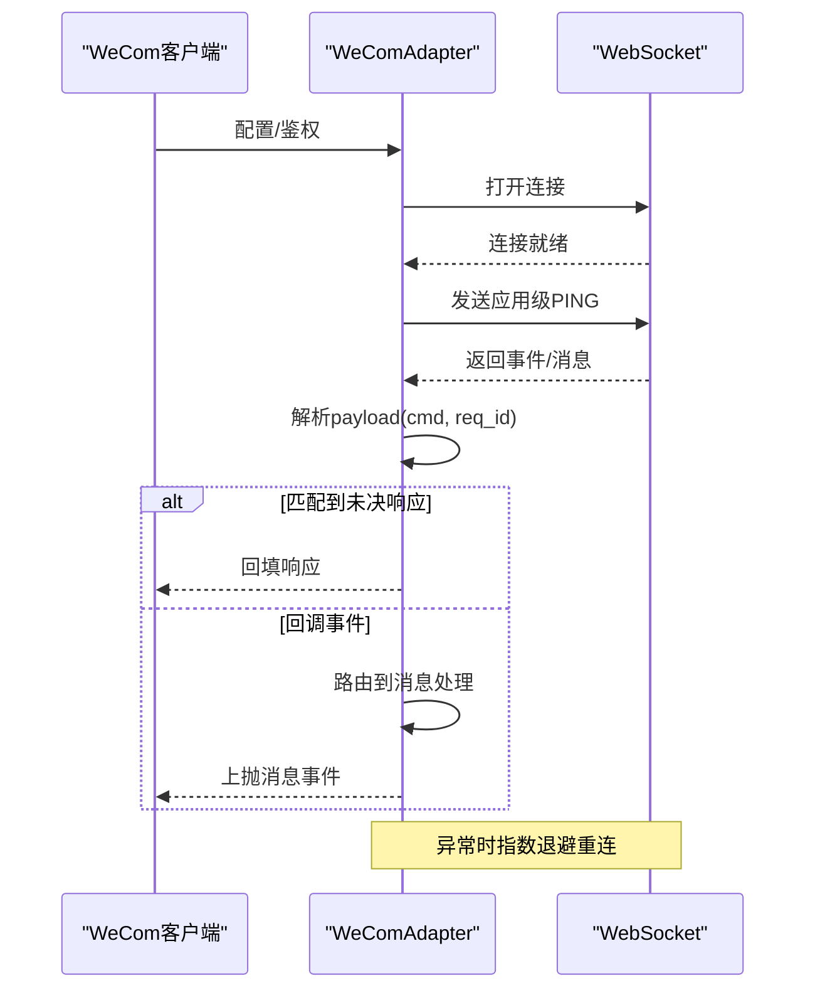
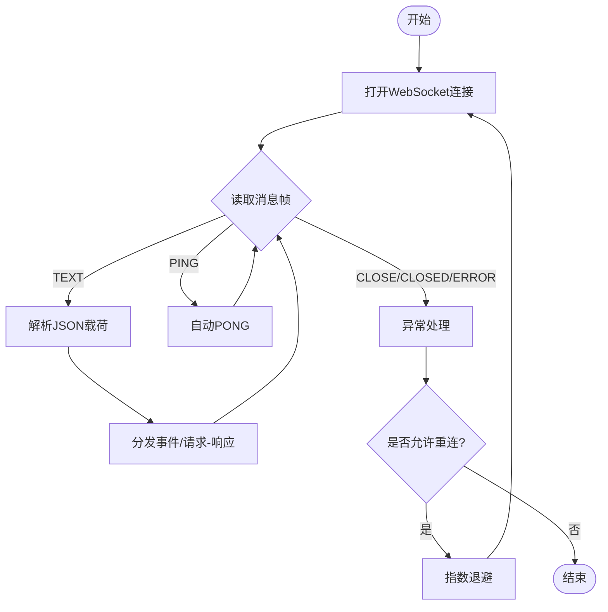
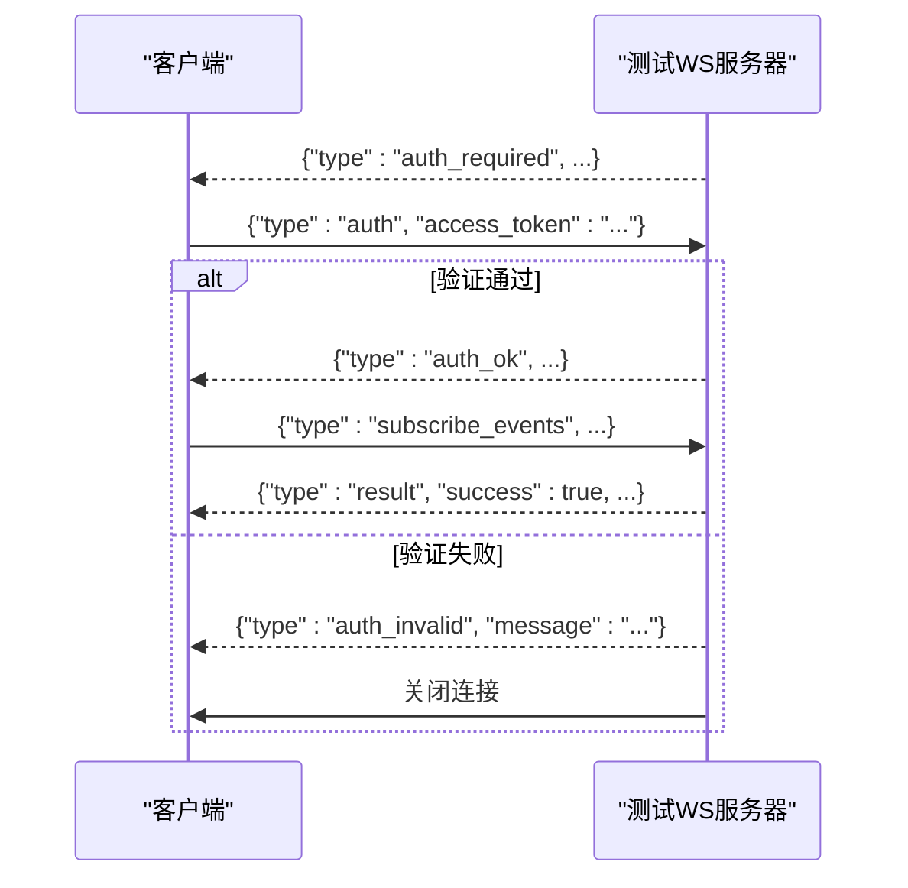
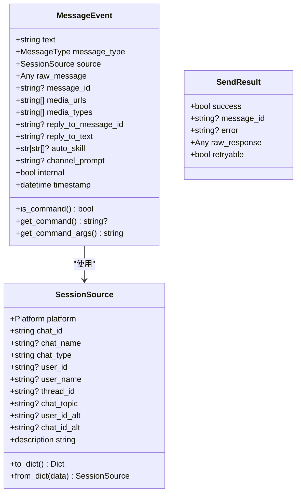
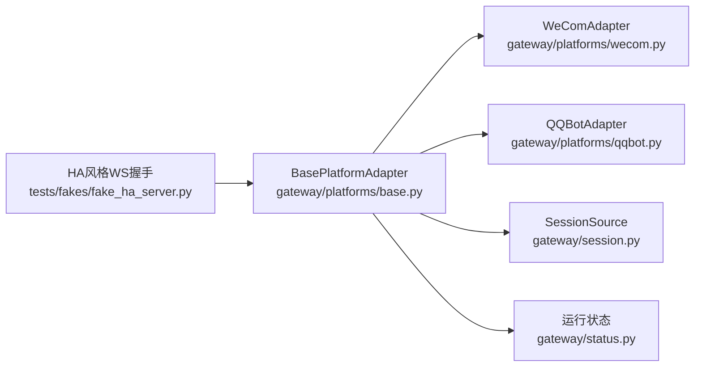

# WebSocket API

<cite>
**本文引用的文件**
- [gateway/platforms/wecom.py](file://gateway/platforms/wecom.py)
- [gateway/platforms/qqbot.py](file://gateway/platforms/qqbot.py)
- [tests/fakes/fake_ha_server.py](file://tests/fakes/fake_ha_server.py)
- [gateway/platforms/base.py](file://gateway/platforms/base.py)
- [gateway/platforms/api_server.py](file://gateway/platforms/api_server.py)
- [gateway/session.py](file://gateway/session.py)
- [gateway/status.py](file://gateway/status.py)
</cite>

## 目录
1. [简介](#简介)
2. [项目结构](#项目结构)
3. [核心组件](#核心组件)
4. [架构总览](#架构总览)
5. [详细组件分析](#详细组件分析)
6. [依赖关系分析](#依赖关系分析)
7. [性能考量](#性能考量)
8. [故障排查指南](#故障排查指南)
9. [结论](#结论)
10. [附录](#附录)

## 简介
本文件面向Hermes Agent的WebSocket API，系统性梳理其连接建立流程（含握手与参数）、消息格式与数据帧结构（文本与二进制）、事件与消息类型（会话状态变化、消息推送、错误通知等）、实时交互示例、连接管理与重连机制（心跳与异常处理），以及安全与性能优化建议。  
说明：仓库中未发现直接以“WebSocket API”命名的统一入口或服务端点；与WebSocket相关的能力主要体现在部分平台适配器（如企业微信、QQ）的内部通信实现，以及测试用的Home Assistant风格WebSocket认证流程。本文将基于现有实现进行归纳总结，并在无法定位具体代码时明确标注。

## 项目结构
围绕WebSocket能力的关键位置如下：
- 平台适配器层：企业微信（wecom）与QQ（qqbot）适配器包含WebSocket连接、心跳与事件分发逻辑
- 测试用例：Home Assistant风格的WebSocket认证握手流程，可作为消息格式参考
- 基础设施：平台适配器基类定义了通用的消息事件模型与发送结果模型
- 网关会话与状态：会话建模、运行状态持久化与健康检查

图示来源
- [gateway/platforms/wecom.py](file://gateway/platforms/wecom.py)
- [gateway/platforms/qqbot.py](file://gateway/platforms/qqbot.py)
- [gateway/platforms/base.py](file://gateway/platforms/base.py)
- [gateway/session.py](file://gateway/session.py)
- [gateway/status.py](file://gateway/status.py)
- [tests/fakes/fake_ha_server.py](file://tests/fakes/fake_ha_server.py)

章节来源
- [gateway/platforms/wecom.py](file://gateway/platforms/wecom.py)
- [gateway/platforms/qqbot.py](file://gateway/platforms/qqbot.py)
- [gateway/platforms/base.py](file://gateway/platforms/base.py)
- [tests/fakes/fake_ha_server.py](file://tests/fakes/fake_ha_server.py)

## 核心组件
- 平台适配器基类（BasePlatformAdapter）
  - 定义消息事件模型（MessageEvent）与发送结果模型（SendResult），为各平台适配器提供统一接口
  - 提供合并待处理消息、媒体缓存、代理配置等通用能力
- 企业微信适配器（WeComAdapter）
  - 实现WebSocket连接、应用级心跳（PING命令）、请求-响应映射、事件分发与回调路由
- QQ适配器（QQBotAdapter）
  - 实现WebSocket连接、心跳循环、事件读取、错误处理与指数退避重连
- Home Assistant风格WebSocket认证流程（测试用例）
  - 展示了典型的三步握手：auth_required → auth → auth_ok；以及订阅事件与ACK模式
- 会话与状态
  - 会话建模与键生成规则，运行状态持久化与健康检查

章节来源
- [gateway/platforms/base.py](file://gateway/platforms/base.py)
- [gateway/platforms/wecom.py](file://gateway/platforms/wecom.py)
- [gateway/platforms/qqbot.py](file://gateway/platforms/qqbot.py)
- [tests/fakes/fake_ha_server.py](file://tests/fakes/fake_ha_server.py)
- [gateway/session.py](file://gateway/session.py)
- [gateway/status.py](file://gateway/status.py)

## 架构总览
下图展示了企业微信与QQ适配器的WebSocket交互路径，以及与平台适配器基类的关系。

图示来源
- [gateway/platforms/wecom.py](file://gateway/platforms/wecom.py)
- [gateway/platforms/qqbot.py](file://gateway/platforms/qqbot.py)
- [gateway/platforms/base.py](file://gateway/platforms/base.py)

## 详细组件分析

### 企业微信（WeCom）WebSocket适配器
- 连接与握手
  - 通过获取网关URL并打开WebSocket连接，随后进入事件读取循环
  - 心跳采用应用级PING命令，周期性发送并等待响应
- 消息格式与事件分发
  - 使用JSON载荷，包含命令字段（cmd）、请求ID（headers.req_id）与主体（body）
  - 支持请求-响应映射：根据req_id匹配未决响应，或将回调事件分发至消息处理
  - 对特定命令类型（如PING、EVENT_CALLBACK）进行忽略或特殊处理
- 会话与重连
  - 适配器维护会话ID与序列号；当出现会话错误码时清理会话并触发重新识别
  - 异常时标记断开并失败未决操作，按最大尝试次数进行指数退避重连

图示来源
- [gateway/platforms/wecom.py](file://gateway/platforms/wecom.py)

章节来源
- [gateway/platforms/wecom.py](file://gateway/platforms/wecom.py)

### QQ（QQBot）WebSocket适配器
- 连接与事件读取
  - 通过获取网关URL并打开WebSocket连接，循环读取消息帧
  - 自动处理PING帧（aiohttp自动回复PONG），对CLOSE/CLOSED/ERROR进行异常处理
- 心跳与重连
  - 心跳循环周期性发送心跳（基于最新seq），异常时按退避策略重连
  - 当会话无效错误码出现时，清理会话并触发重新识别
- 错误处理
  - 记录警告日志，标记断开并失败未决操作，超过最大重试次数后停止

图示来源
- [gateway/platforms/qqbot.py](file://gateway/platforms/qqbot.py)

章节来源
- [gateway/platforms/qqbot.py](file://gateway/platforms/qqbot.py)

### Home Assistant风格WebSocket认证流程（测试参考）
- 握手步骤
  - 步骤1：服务器发送“auth_required”与版本信息
  - 步骤2：客户端发送“auth”（含访问令牌）
  - 步骤3：服务器验证后返回“auth_ok”，否则“auth_invalid”
  - 步骤4：客户端发送“subscribe_events”，服务器返回“result”确认
- 消息类型
  - type字段用于区分消息类型（如auth_required、auth、auth_ok、result、subscribe_events）

图示来源
- [tests/fakes/fake_ha_server.py](file://tests/fakes/fake_ha_server.py)

章节来源
- [tests/fakes/fake_ha_server.py](file://tests/fakes/fake_ha_server.py)

### 平台适配器基类（消息模型与发送结果）
- 消息事件（MessageEvent）
  - 文本内容、消息类型（文本/位置/图片/视频/音频/语音/文档/贴纸/命令）
  - 来源信息（SessionSource）、原始消息、消息ID、媒体URL列表与类型、回复上下文、通道提示、内部标志、时间戳
- 发送结果（SendResult）
  - 成功/失败、消息ID、错误信息、原始响应、是否可重试

图示来源
- [gateway/platforms/base.py](file://gateway/platforms/base.py)
- [gateway/session.py](file://gateway/session.py)

章节来源
- [gateway/platforms/base.py](file://gateway/platforms/base.py)
- [gateway/session.py](file://gateway/session.py)

## 依赖关系分析
- 企业微信与QQ适配器均继承自平台适配器基类，复用消息事件与发送结果模型
- 会话管理模块为消息事件提供来源上下文（SessionSource），并在运行状态模块中提供健康检查与状态持久化
- 测试用例中的Home Assistant风格握手流程可作为消息格式与事件类型的参考

图示来源
- [gateway/platforms/base.py](file://gateway/platforms/base.py)
- [gateway/platforms/wecom.py](file://gateway/platforms/wecom.py)
- [gateway/platforms/qqbot.py](file://gateway/platforms/qqbot.py)
- [gateway/session.py](file://gateway/session.py)
- [gateway/status.py](file://gateway/status.py)
- [tests/fakes/fake_ha_server.py](file://tests/fakes/fake_ha_server.py)

章节来源
- [gateway/platforms/base.py](file://gateway/platforms/base.py)
- [gateway/platforms/wecom.py](file://gateway/platforms/wecom.py)
- [gateway/platforms/qqbot.py](file://gateway/platforms/qqbot.py)
- [gateway/session.py](file://gateway/session.py)
- [gateway/status.py](file://gateway/status.py)
- [tests/fakes/fake_ha_server.py](file://tests/fakes/fake_ha_server.py)

## 性能考量
- 心跳与保活
  - 应用级心跳应设置合理间隔，避免过于频繁导致带宽与CPU压力
  - 对于长连接场景，结合底层库的自动PONG（如aiohttp）减少重复实现
- 事件分发与队列
  - 请求-响应映射需控制未决响应数量，避免内存膨胀
  - 对回调事件与普通事件分流处理，降低阻塞风险
- 重连策略
  - 指数退避上限与抖动有助于缓解网络波动与服务器压力
  - 最大重试次数与快速断开计数可防止雪崩效应
- 消息聚合
  - 对连续文本/媒体事件进行批处理与合并，减少往返次数与服务器压力
- 缓存与资源
  - 图片/音频/文档缓存需定期清理，避免磁盘占用过高

## 故障排查指南
- 连接失败
  - 检查鉴权参数与网关URL是否正确
  - 观察日志中的致命错误码与可重试标记，决定是否重启进程
- 心跳异常
  - 确认应用级心跳是否按预期发送与接收
  - 若底层库自动处理PONG，确保未重复发送相同心跳
- 事件丢失或乱序
  - 校验请求ID映射与去重逻辑
  - 对回调事件与响应事件分别处理，避免互相覆盖
- 重连失败
  - 查看退避延迟与最大重试次数是否合理
  - 检查会话错误码是否触发了会话清理与重新识别
- 健康检查
  - 使用运行状态接口确认网关进程状态与活跃平台

章节来源
- [gateway/platforms/wecom.py](file://gateway/platforms/wecom.py)
- [gateway/platforms/qqbot.py](file://gateway/platforms/qqbot.py)
- [gateway/status.py](file://gateway/status.py)

## 结论
Hermes Agent的WebSocket能力主要体现在企业微信与QQ适配器中：前者提供应用级心跳与请求-响应映射，后者提供心跳循环与指数退避重连。测试用例展示了Home Assistant风格的WebSocket握手流程，可作为消息格式与事件类型的参考。结合平台适配器基类的消息模型与会话管理，可构建稳定可靠的实时通信链路。建议在生产环境中完善心跳策略、事件去重与重连上限控制，并配合健康检查与状态持久化机制，确保系统的高可用与可观测性。

## 附录
- 实时交互示例（思路）
  - 客户端在握手后订阅事件，服务端通过应用级命令推送消息
  - 客户端收到事件后解析payload，依据cmd与req_id进行处理
  - 可参考测试用例中的“auth_required → auth → auth_ok → subscribe_events → result”的握手顺序
- 安全建议
  - 严格校验鉴权令牌与来源，避免未授权访问
  - 对私有/内部地址进行SSRF防护（参考平台适配器中的URL安全检查）
  - 对敏感信息进行脱敏与最小化暴露
- 性能优化
  - 合理设置心跳间隔与批处理窗口
  - 控制未决响应队列长度与缓存清理策略
  - 在网络波动场景下启用指数退避与快速断开保护