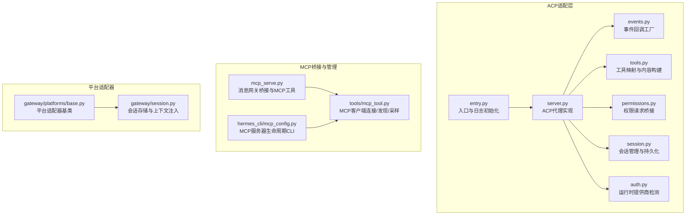
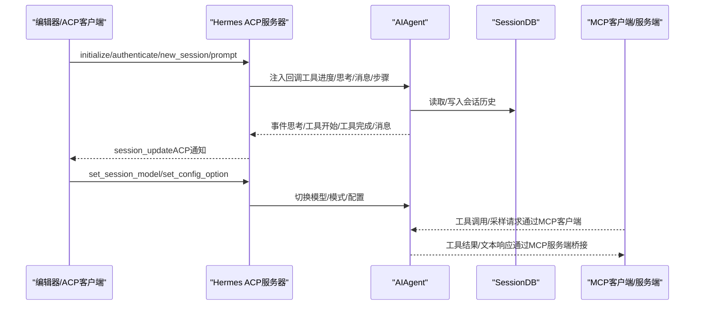
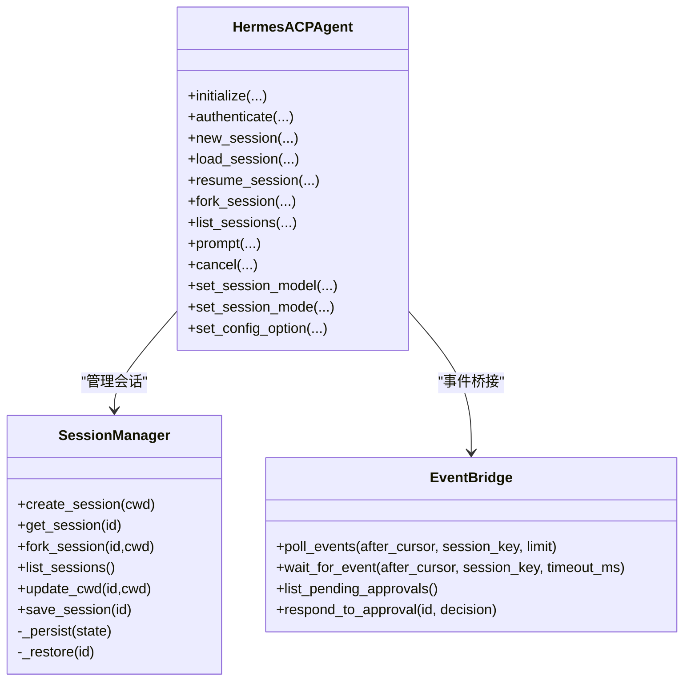
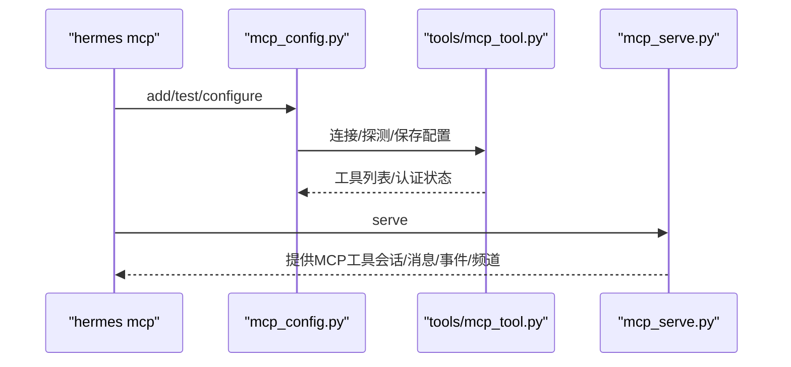
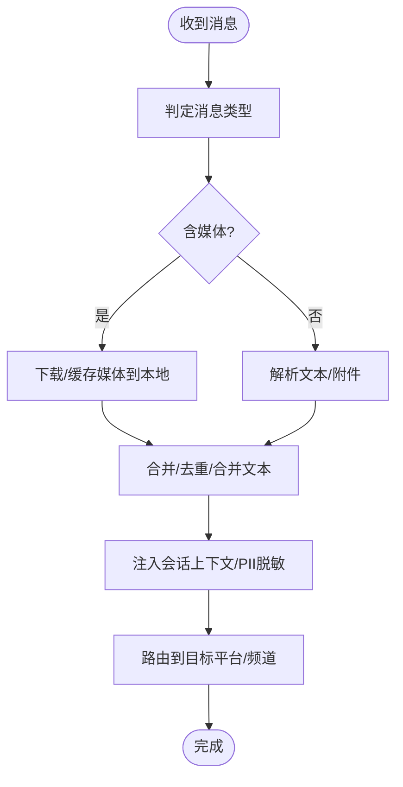
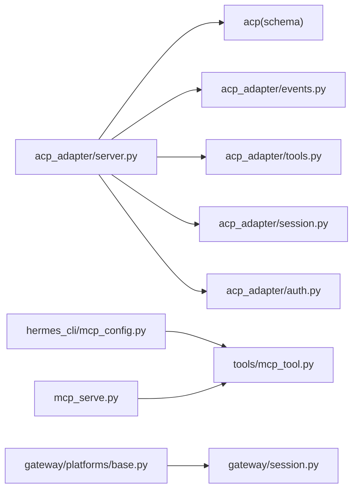

# 协议接口

<cite>
**本文引用的文件**
- [acp_adapter/__init__.py](file://acp_adapter/__init__.py)
- [acp_adapter/entry.py](file://acp_adapter/entry.py)
- [acp_adapter/events.py](file://acp_adapter/events.py)
- [acp_adapter/tools.py](file://acp_adapter/tools.py)
- [acp_adapter/server.py](file://acp_adapter/server.py)
- [acp_adapter/auth.py](file://acp_adapter/auth.py)
- [acp_adapter/permissions.py](file://acp_adapter/permissions.py)
- [acp_adapter/session.py](file://acp_adapter/session.py)
- [docs/acp-setup.md](file://docs/acp-setup.md)
- [mcp_serve.py](file://mcp_serve.py)
- [hermes_cli/mcp_config.py](file://hermes_cli/mcp_config.py)
- [tools/mcp_tool.py](file://tools/mcp_tool.py)
- [gateway/platforms/base.py](file://gateway/platforms/base.py)
- [gateway/session.py](file://gateway/session.py)
</cite>

## 目录
1. [简介](#简介)
2. [项目结构](#项目结构)
3. [核心组件](#核心组件)
4. [架构总览](#架构总览)
5. [详细组件分析](#详细组件分析)
6. [依赖分析](#依赖分析)
7. [性能考量](#性能考量)
8. [故障排查指南](#故障排查指南)
9. [结论](#结论)
10. [附录](#附录)

## 简介
本文件面向Hermes Agent的协议接口，系统化梳理以下内容：
- ACPI协议（Agent Client Protocol）：规范与实现、消息格式、事件处理、编辑器集成、权限与认证。
- MCP（Model Context Protocol）：接口规范、工具发现与调用、认证机制、服务端桥接与客户端管理。
- 平台适配器通用接口：消息路由、会话状态管理、错误处理与安全防护。
- 版本兼容性与升级策略、调试工具与测试方法、安全与性能优化、第三方协议扩展指南。

## 项目结构
围绕协议接口的关键目录与文件：
- ACP适配层：acp_adapter（入口、服务器、事件桥接、工具映射、权限、会话管理、认证）
- MCP桥接与管理：mcp_serve（消息网关桥接）、hermes_cli/mcp_config（命令行配置）、tools/mcp_tool（MCP客户端）
- 平台适配器：gateway/platforms/base（抽象基类与通用能力）、gateway/session（会话存储与上下文）

**图表来源**
- [acp_adapter/entry.py:1-86](file://acp_adapter/entry.py#L1-L86)
- [acp_adapter/server.py:93-729](file://acp_adapter/server.py#L93-L729)
- [acp_adapter/events.py:1-176](file://acp_adapter/events.py#L1-L176)
- [acp_adapter/tools.py:1-215](file://acp_adapter/tools.py#L1-L215)
- [acp_adapter/permissions.py:1-78](file://acp_adapter/permissions.py#L1-L78)
- [acp_adapter/session.py:1-476](file://acp_adapter/session.py#L1-L476)
- [acp_adapter/auth.py:1-25](file://acp_adapter/auth.py#L1-L25)
- [mcp_serve.py:1-868](file://mcp_serve.py#L1-L868)
- [hermes_cli/mcp_config.py:1-717](file://hermes_cli/mcp_config.py#L1-L717)
- [tools/mcp_tool.py:1-800](file://tools/mcp_tool.py#L1-L800)
- [gateway/platforms/base.py:1-800](file://gateway/platforms/base.py#L1-L800)
- [gateway/session.py:1-1091](file://gateway/session.py#L1-L1091)

**章节来源**
- [acp_adapter/__init__.py:1-2](file://acp_adapter/__init__.py#L1-L2)
- [acp_adapter/entry.py:1-86](file://acp_adapter/entry.py#L1-L86)
- [mcp_serve.py:1-868](file://mcp_serve.py#L1-L868)
- [hermes_cli/mcp_config.py:1-717](file://hermes_cli/mcp_config.py#L1-L717)
- [tools/mcp_tool.py:1-800](file://tools/mcp_tool.py#L1-L800)
- [gateway/platforms/base.py:1-800](file://gateway/platforms/base.py#L1-L800)
- [gateway/session.py:1-1091](file://gateway/session.py#L1-L1091)

## 核心组件
- ACP代理服务器：实现ACP协议方法（initialize、authenticate、new/load/resume/fork/list/cancel/prompt等），桥接AIAgent事件到编辑器通知，管理会话与工具表面。
- ACP事件桥接：将工具进度、思考过程、步骤完成、消息流等转换为ACP更新事件。
- ACP工具映射：将Hermes工具名映射到ACP ToolKind，并生成可读标题与内容块。
- ACP权限桥接：将编辑器的权限请求映射为Hermes审批回调。
- ACP会话管理：内存+数据库双轨持久化，支持fork、load、resume、list、cancel。
- MCP服务端桥接：将Hermes会话与消息历史暴露为MCP工具，支持事件轮询/等待、消息发送、频道列表等。
- MCP客户端管理：动态发现外部MCP服务器、工具选择、认证（Header/OAuth）、超时与重连、采样回调（server-initiated LLM请求）。
- 平台适配器基类：统一消息类型、长度限制、代理设置、媒体缓存、会话上下文注入、错误与重试策略。

**章节来源**
- [acp_adapter/server.py:93-729](file://acp_adapter/server.py#L93-L729)
- [acp_adapter/events.py:1-176](file://acp_adapter/events.py#L1-L176)
- [acp_adapter/tools.py:1-215](file://acp_adapter/tools.py#L1-L215)
- [acp_adapter/permissions.py:1-78](file://acp_adapter/permissions.py#L1-L78)
- [acp_adapter/session.py:1-476](file://acp_adapter/session.py#L1-L476)
- [mcp_serve.py:1-868](file://mcp_serve.py#L1-L868)
- [hermes_cli/mcp_config.py:1-717](file://hermes_cli/mcp_config.py#L1-L717)
- [tools/mcp_tool.py:1-800](file://tools/mcp_tool.py#L1-L800)
- [gateway/platforms/base.py:1-800](file://gateway/platforms/base.py#L1-L800)
- [gateway/session.py:1-1091](file://gateway/session.py#L1-L1091)

## 架构总览
ACP与MCP在Hermes中的位置与交互：

**图表来源**
- [acp_adapter/server.py:217-467](file://acp_adapter/server.py#L217-L467)
- [acp_adapter/events.py:47-175](file://acp_adapter/events.py#L47-L175)
- [acp_adapter/session.py:273-331](file://acp_adapter/session.py#L273-L331)
- [mcp_serve.py:431-800](file://mcp_serve.py#L431-L800)
- [tools/mcp_tool.py:774-800](file://tools/mcp_tool.py#L774-L800)

## 详细组件分析

### ACPI协议（Agent Client Protocol）
- 协议方法与职责
  - initialize：声明协议版本、能力集、可选认证方式（基于运行时提供商）。
  - authenticate：若存在可用提供商凭据则返回认证成功。
  - 会话管理：new_session、load_session、resume_session、fork_session、list_sessions、cancel。
  - prompt：执行对话，桥接工具进度、思考、消息流到编辑器；支持取消与用量统计。
  - 模型与配置：set_session_model、set_session_mode、set_config_option。
- 事件与通知
  - 工具开始/完成：由工具映射与标题生成，附带位置与原始输入/输出。
  - 思考过程：实时文本更新。
  - 步骤完成：按工具名队列匹配，确保并行同名调用正确闭合。
  - 权限请求：将编辑器权限选项映射为“允许一次/总是”、“拒绝一次/总是”，超时自动拒绝。
- 编辑器集成要点
  - ACP保留stdout用于JSON-RPC帧，stderr用于日志与人类可读输出。
  - 会话持久化至SessionDB，支持重启后恢复。
  - 支持slash命令（帮助、模型切换、工具列表、上下文、重置、压缩、版本）。
- 安全与错误处理
  - 运行时提供商检测失败回退。
  - 事件发送采用线程安全调度，异常静默记录。
  - 取消事件通过事件标志触发中断。

**图表来源**
- [acp_adapter/server.py:93-729](file://acp_adapter/server.py#L93-L729)
- [acp_adapter/session.py:70-476](file://acp_adapter/session.py#L70-L476)
- [mcp_serve.py:185-426](file://mcp_serve.py#L185-L426)

**章节来源**
- [acp_adapter/server.py:217-729](file://acp_adapter/server.py#L217-L729)
- [acp_adapter/events.py:47-175](file://acp_adapter/events.py#L47-L175)
- [acp_adapter/tools.py:53-197](file://acp_adapter/tools.py#L53-L197)
- [acp_adapter/permissions.py:26-77](file://acp_adapter/permissions.py#L26-L77)
- [acp_adapter/session.py:94-476](file://acp_adapter/session.py#L94-L476)
- [acp_adapter/auth.py:8-24](file://acp_adapter/auth.py#L8-L24)
- [docs/acp-setup.md:1-229](file://docs/acp-setup.md#L1-L229)

### MCP（Model Context Protocol）
- 接口规范与调用
  - 服务器端：将Hermes会话与消息历史暴露为MCP工具（列出会话、获取会话详情、读取消息、附件提取、事件轮询/等待、发送消息、频道列表等）。
  - 客户端侧：动态发现外部MCP服务器工具、工具选择、认证（Header/OAuth）、超时与重连、采样回调（server-initiated LLM请求）。
- 认证机制
  - HTTP服务器支持Bearer Token（从环境变量插值）。
  - OAuth 2.1 PKCE（通过mcp_oauth模块）。
- 采样与治理
  - 速率限制（滑动窗口）、最大令牌上限、工具循环次数限制、模型白名单、审计日志级别。
- 配置与CLI
  - hermes mcp add/remove/list/test/configure，支持预设、环境变量过滤、描述内容扫描与提示注入检测。

**图表来源**
- [hermes_cli/mcp_config.py:219-717](file://hermes_cli/mcp_config.py#L219-L717)
- [tools/mcp_tool.py:1-800](file://tools/mcp_tool.py#L1-L800)
- [mcp_serve.py:431-800](file://mcp_serve.py#L431-L800)

**章节来源**
- [mcp_serve.py:431-800](file://mcp_serve.py#L431-L800)
- [hermes_cli/mcp_config.py:219-717](file://hermes_cli/mcp_config.py#L219-L717)
- [tools/mcp_tool.py:1-800](file://tools/mcp_tool.py#L1-L800)

### 平台适配器通用接口
- 基类能力
  - 统一消息类型与处理流程（文本、位置、照片、视频、音频、语音、文档、贴纸、命令）。
  - 长度与编码边界处理（UTF-16长度计算、前缀截断）。
  - 代理设置与网络可达性检查、macOS系统代理自动检测。
  - 媒体缓存（图片/音频/文档），下载与本地路径映射，清理策略。
  - 会话上下文注入（动态系统提示），PII脱敏策略。
- 错误与重试
  - 传输错误模式识别与可重试条件。
  - 超时与重试策略，避免幂等操作重复投递风险。
- 会话管理
  - 会话键生成规则（平台/聊天类型/用户/线程/群组隔离策略）。
  - 会话过期策略（空闲/每日）、自动重置与挂起标记。
  - SQLite/JSONL双轨存储与原子落盘。

**图表来源**
- [gateway/platforms/base.py:634-790](file://gateway/platforms/base.py#L634-L790)
- [gateway/platforms/base.py:316-453](file://gateway/platforms/base.py#L316-L453)
- [gateway/session.py:440-496](file://gateway/session.py#L440-L496)
- [gateway/session.py:686-771](file://gateway/session.py#L686-L771)

**章节来源**
- [gateway/platforms/base.py:1-800](file://gateway/platforms/base.py#L1-L800)
- [gateway/session.py:1-1091](file://gateway/session.py#L1-L1091)

## 依赖分析
- ACP服务器依赖acp库（协议定义与schema），事件桥接依赖异步事件循环与线程池。
- MCP客户端依赖mcp包（可选），支持stdio与HTTP/StreamableHTTP传输，具备重连与采样能力。
- 平台适配器依赖会话存储（SQLite/JSONL）、URL安全校验、代理库（可选）。

**图表来源**
- [acp_adapter/server.py:11-62](file://acp_adapter/server.py#L11-L62)
- [hermes_cli/mcp_config.py:168-198](file://hermes_cli/mcp_config.py#L168-L198)
- [tools/mcp_tool.py:96-138](file://tools/mcp_tool.py#L96-L138)
- [mcp_serve.py:49-56](file://mcp_serve.py#L49-L56)
- [gateway/platforms/base.py:242-244](file://gateway/platforms/base.py#L242-L244)
- [gateway/session.py:506-522](file://gateway/session.py#L506-L522)

**章节来源**
- [acp_adapter/server.py:11-62](file://acp_adapter/server.py#L11-L62)
- [hermes_cli/mcp_config.py:168-198](file://hermes_cli/mcp_config.py#L168-L198)
- [tools/mcp_tool.py:96-138](file://tools/mcp_tool.py#L96-L138)
- [mcp_serve.py:49-56](file://mcp_serve.py#L49-L56)
- [gateway/platforms/base.py:242-244](file://gateway/platforms/base.py#L242-L244)
- [gateway/session.py:506-522](file://gateway/session.py#L506-L522)

## 性能考量
- ACP
  - 使用线程池并发运行同步AIAgent，避免阻塞事件循环。
  - 事件推送采用run_coroutine_threadsafe，控制超时避免阻塞。
  - 大结果截断（UI友好显示），减少传输体积。
- MCP
  - 采样回调异步执行，使用to_thread避免阻塞事件循环。
  - 速率限制与令牌上限，防止过载。
  - 工具循环次数限制，避免无限工具调用。
- 平台适配器
  - 媒体缓存命中与清理策略，降低重复下载成本。
  - mtime检查与增量轮询，降低数据库压力。

[本节为通用指导，无需具体文件引用]

## 故障排查指南
- ACP
  - 启动即崩溃：查看stderr日志，确认ACP额外安装与环境变量加载。
  - 会话无法恢复：检查SessionDB可用性与会话元数据。
  - 权限请求超时：调整超时阈值或在编辑器中快速决策。
- MCP
  - 连接失败：检查URL/命令、环境变量、代理设置；使用hermes mcp test验证。
  - 工具未发现：确认服务器已启用且工具描述合法；查看扫描告警。
  - 采样失败：检查模型白名单、速率限制、超时设置。
- 平台适配器
  - SSRF保护：禁止访问私有/内部地址，日志中会记录阻断原因。
  - 代理问题：检查系统代理或显式环境变量，确保SOCKS/HTTP代理可用。
  - 媒体缓存异常：确认缓存目录权限与磁盘空间。

**章节来源**
- [acp_adapter/entry.py:23-55](file://acp_adapter/entry.py#L23-L55)
- [acp_adapter/permissions.py:59-76](file://acp_adapter/permissions.py#L59-L76)
- [hermes_cli/mcp_config.py:511-571](file://hermes_cli/mcp_config.py#L511-L571)
- [tools/mcp_tool.py:324-382](file://tools/mcp_tool.py#L324-L382)
- [gateway/platforms/base.py:290-305](file://gateway/platforms/base.py#L290-L305)
- [gateway/platforms/base.py:112-168](file://gateway/platforms/base.py#L112-L168)

## 结论
Hermes Agent通过ACP与MCP实现了与编辑器及外部工具生态的深度集成：ACP负责编辑器侧的对话与工具执行体验，MCP负责跨服务工具发现与调用，平台适配器提供统一的消息路由与安全防护。通过会话持久化、权限桥接、采样治理与媒体缓存等机制，系统在易用性、安全性与性能之间取得平衡。

[本节为总结，无需具体文件引用]

## 附录

### 协议版本兼容性与升级策略
- ACP
  - initialize返回协议版本与能力集，客户端可通过protocol_version协商。
  - 对旧版字段（如AuthMethodAgent）进行向后兼容导入。
- MCP
  - 优先使用新式API（streamable_http_client），兼容旧版包装。
  - 动态工具发现与通知类型按SDK版本条件启用。
- 升级建议
  - 逐步升级SDK版本，关注构造函数参数变更（如message_handler支持）。
  - 保持配置项命名稳定，必要时提供迁移脚本或兼容层。

**章节来源**
- [acp_adapter/server.py:46-50](file://acp_adapter/server.py#L46-L50)
- [tools/mcp_tool.py:141-157](file://tools/mcp_tool.py#L141-L157)
- [tools/mcp_tool.py:96-112](file://tools/mcp_tool.py#L96-L112)

### 协议调试工具与测试方法
- ACP
  - hermes acp直接运行，stderr输出日志；编辑器侧查看ACP Client输出面板。
  - hermes doctor检查配置；hermes status检查API密钥状态。
- MCP
  - hermes mcp test验证连接与工具发现；hermes mcp add/remove/list/configure管理服务器与工具。
  - 测试覆盖：单元测试与端到端测试（参见tests目录下相关用例）。
- 平台适配器
  - 日志级别提升（HERMES_LOG_LEVEL=DEBUG）；检查代理与网络可达性。

**章节来源**
- [docs/acp-setup.md:174-229](file://docs/acp-setup.md#L174-L229)
- [hermes_cli/mcp_config.py:511-571](file://hermes_cli/mcp_config.py#L511-L571)
- [tests/acp/test_mcp_e2e.py](file://tests/acp/test_mcp_e2e.py)
- [tests/tools/test_mcp_tool.py](file://tests/tools/test_mcp_tool.py)

### 第三方协议扩展开发指南
- ACP
  - 实现acp.Agent子类，注册回调（tool_progress/thinking/message/step），处理会话生命周期。
  - 使用SessionManager持久化会话，注意cwd与工具集配置。
- MCP
  - 作为客户端：实现discover与connect逻辑，处理工具选择与认证，实现采样回调。
  - 作为服务端：参考mcp_serve.py的工具注册模式，提供事件轮询与消息发送能力。
- 平台适配器
  - 继承BasePlatformAdapter，实现消息解析、长度限制、代理与缓存策略。
  - 通过SessionContext注入动态系统提示，遵循PII脱敏策略。

**章节来源**
- [acp_adapter/server.py:93-142](file://acp_adapter/server.py#L93-L142)
- [acp_adapter/session.py:420-476](file://acp_adapter/session.py#L420-L476)
- [mcp_serve.py:431-800](file://mcp_serve.py#L431-L800)
- [tools/mcp_tool.py:774-800](file://tools/mcp_tool.py#L774-L800)
- [gateway/platforms/base.py:1-800](file://gateway/platforms/base.py#L1-L800)