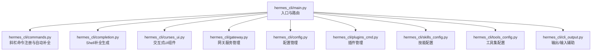
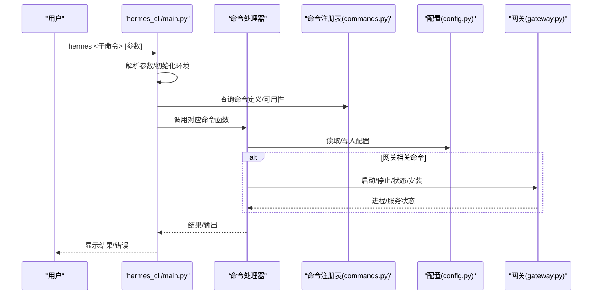
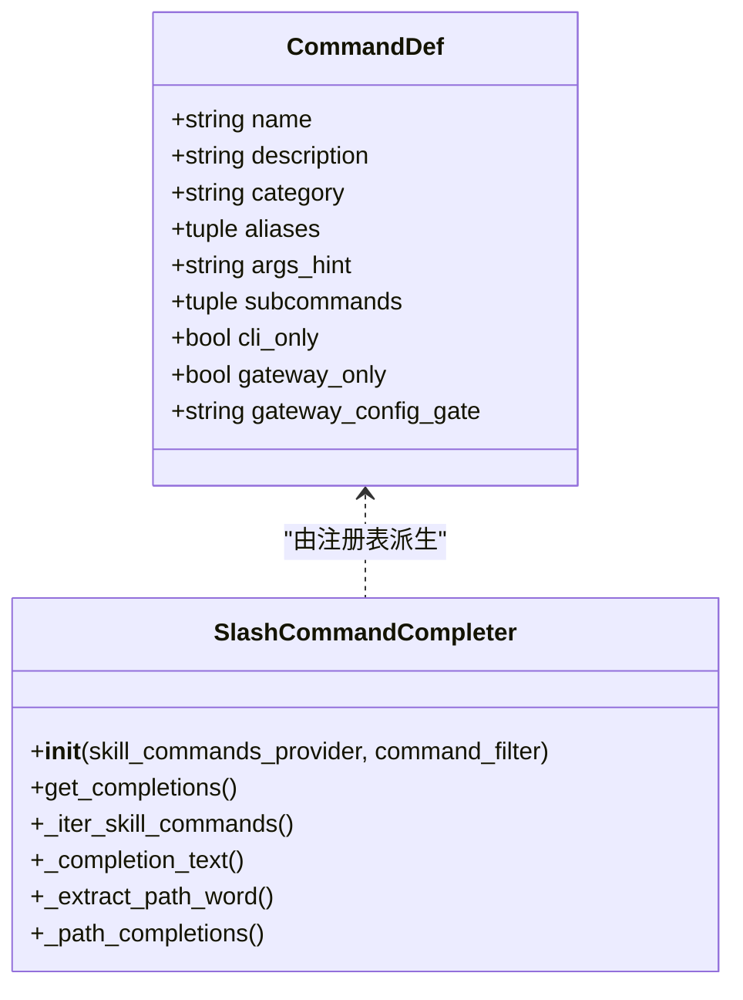
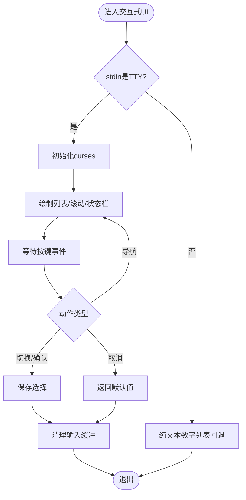
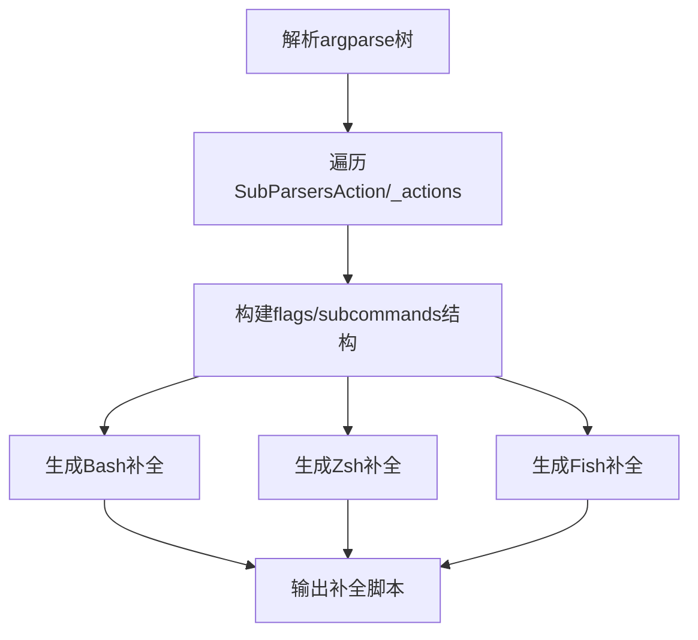
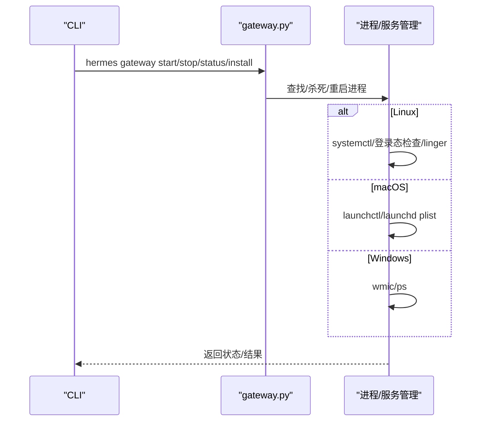
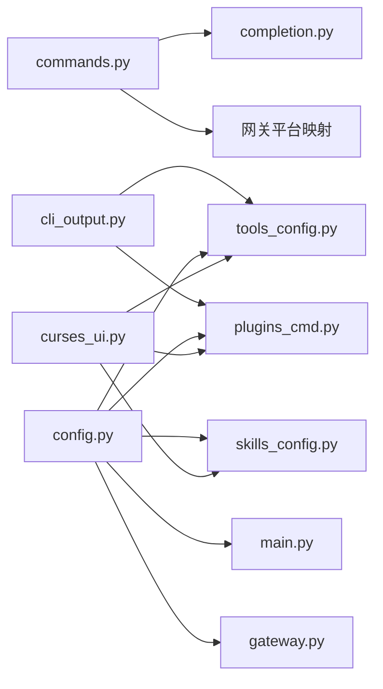

# CLI命令行界面

<cite>
**本文档引用的文件**
- [hermes_cli/main.py](file://hermes_cli/main.py)
- [hermes_cli/commands.py](file://hermes_cli/commands.py)
- [hermes_cli/completion.py](file://hermes_cli/completion.py)
- [hermes_cli/curses_ui.py](file://hermes_cli/curses_ui.py)
- [hermes_cli/gateway.py](file://hermes_cli/gateway.py)
- [hermes_cli/cli_output.py](file://hermes_cli/cli_output.py)
- [hermes_cli/config.py](file://hermes_cli/config.py)
- [hermes_cli/plugins_cmd.py](file://hermes_cli/plugins_cmd.py)
- [hermes_cli/skills_config.py](file://hermes_cli/skills_config.py)
- [hermes_cli/tools_config.py](file://hermes_cli/tools_config.py)
</cite>

## 目录
1. [简介](#简介)
2. [项目结构](#项目结构)
3. [核心组件](#核心组件)
4. [架构总览](#架构总览)
5. [详细组件分析](#详细组件分析)
6. [依赖关系分析](#依赖关系分析)
7. [性能考虑](#性能考虑)
8. [故障排除指南](#故障排除指南)
9. [结论](#结论)
10. [附录](#附录)

## 简介
本文件为 Hermes Agent 的命令行界面（CLI）提供全面的技术文档，覆盖命令系统架构、核心命令详解、交互式功能（多行编辑、斜杠命令自动补全、会话历史管理）、批处理模式与命令扩展开发、完整命令参考手册、键盘快捷键与用户界面设计、使用示例与工作流程、CLI 与网关系统的集成方式，以及故障排除与性能优化建议。

## 项目结构
Hermes CLI 的核心位于 hermes_cli 包中，主要模块职责如下：
- hermes_cli/main.py：CLI 入口与子命令路由，负责解析参数、初始化环境、调用具体命令处理器。
- hermes_cli/commands.py：斜杠命令定义与自动补全注册中心，统一管理所有内置命令及其别名、参数提示、平台可用性等。
- hermes_cli/completion.py：生成 Bash/Zsh/Fish 的动态补全脚本，基于实时的 argparse 解析树。
- hermes_cli/curses_ui.py：基于 curses 的交互式 UI 组件（多选/单选/数字列表回退），用于工具配置、技能开关等交互。
- hermes_cli/gateway.py：网关服务管理（启动/停止/状态/安装等），并与 CLI 命令协同工作。
- hermes_cli/cli_output.py：统一的输出与输入辅助函数（带颜色与提示），供多个模块复用。
- hermes_cli/config.py：配置管理（读取/保存/迁移），提供安全权限设置与容器感知能力。
- hermes_cli/plugins_cmd.py：插件安装/更新/移除/启用/禁用与交互式配置。
- hermes_cli/skills_config.py：技能按平台启用/禁用配置。
- hermes_cli/tools_config.py：工具集（toolsets）按平台启用/禁用与提供商配置。

**图表来源**
- [hermes_cli/main.py](file://hermes_cli/main.py)
- [hermes_cli/commands.py](file://hermes_cli/commands.py)
- [hermes_cli/completion.py](file://hermes_cli/completion.py)
- [hermes_cli/curses_ui.py](file://hermes_cli/curses_ui.py)
- [hermes_cli/gateway.py](file://hermes_cli/gateway.py)
- [hermes_cli/config.py](file://hermes_cli/config.py)
- [hermes_cli/plugins_cmd.py](file://hermes_cli/plugins_cmd.py)
- [hermes_cli/skills_config.py](file://hermes_cli/skills_config.py)
- [hermes_cli/tools_config.py](file://hermes_cli/tools_config.py)
- [hermes_cli/cli_output.py](file://hermes_cli/cli_output.py)

**章节来源**
- [hermes_cli/main.py](file://hermes_cli/main.py)
- [hermes_cli/commands.py](file://hermes_cli/commands.py)
- [hermes_cli/completion.py](file://hermes_cli/completion.py)
- [hermes_cli/curses_ui.py](file://hermes_cli/curses_ui.py)
- [hermes_cli/gateway.py](file://hermes_cli/gateway.py)
- [hermes_cli/config.py](file://hermes_cli/config.py)
- [hermes_cli/plugins_cmd.py](file://hermes_cli/plugins_cmd.py)
- [hermes_cli/skills_config.py](file://hermes_cli/skills_config.py)
- [hermes_cli/tools_config.py](file://hermes_cli/tools_config.py)
- [hermes_cli/cli_output.py](file://hermes_cli/cli_output.py)

## 核心组件
- 命令系统与自动补全
  - 中央命令注册表 COMMAND_REGISTRY 提供命令定义、别名、参数提示、分类、平台可用性等。
  - 自动补全器支持斜杠命令、子命令、技能命令、路径补全等。
- 交互式 UI
  - curses 多选/单选/数字列表回退，支持状态栏与实时统计。
- 配置与环境
  - 安全权限（目录/文件 0700/0600）、容器感知、NixOS/包管理器托管模式。
- 网关集成
  - CLI 与网关进程管理、服务安装/卸载、重启/状态查询。
- 扩展与生态
  - 插件系统（Git 源安装/更新/禁用）、技能按平台启用/禁用、工具集按平台启用/禁用与提供商配置。

**章节来源**
- [hermes_cli/commands.py](file://hermes_cli/commands.py)
- [hermes_cli/curses_ui.py](file://hermes_cli/curses_ui.py)
- [hermes_cli/config.py](file://hermes_cli/config.py)
- [hermes_cli/gateway.py](file://hermes_cli/gateway.py)
- [hermes_cli/plugins_cmd.py](file://hermes_cli/plugins_cmd.py)
- [hermes_cli/skills_config.py](file://hermes_cli/skills_config.py)
- [hermes_cli/tools_config.py](file://hermes_cli/tools_config.py)

## 架构总览
CLI 采用“入口路由 + 子命令处理器 + 统一配置/输出”的分层架构。命令系统以中央注册表为核心，自动补全器从注册表派生；交互式 UI 通过 curses 提供一致的键盘操作体验；配置模块确保安全与兼容；网关模块提供服务生命周期管理。

**图表来源**
- [hermes_cli/main.py](file://hermes_cli/main.py)
- [hermes_cli/commands.py](file://hermes_cli/commands.py)
- [hermes_cli/config.py](file://hermes_cli/config.py)
- [hermes_cli/gateway.py](file://hermes_cli/gateway.py)

## 详细组件分析

### 命令系统与自动补全
- 中央命令注册表
  - CommandDef 定义命令名称、描述、分类、别名、参数占位符、可选子命令、平台限制等。
  - 支持 CLI 专用命令、网关专用命令、配置门控命令（根据配置项决定是否在网关侧可见）。
- 自动补全
  - 基于 prompt_toolkit 的 Completer/AutoSuggest，支持斜杠命令、子命令、技能命令、路径补全、模糊文件名补全。
  - 支持命令过滤器与技能命令提供者回调，便于动态扩展。
- 平台映射
  - 将命令注册表转换为不同平台的菜单/命令集合（Telegram/Discord/Slack 等），含名称裁剪、去重、保留字处理。

**图表来源**
- [hermes_cli/commands.py](file://hermes_cli/commands.py)

**章节来源**
- [hermes_cli/commands.py](file://hermes_cli/commands.py)

### 交互式 UI（多行编辑、选择器）
- curses_checklist/curses_radiolist/curses_single_select
  - 支持多选/单选/数字列表回退，带滚动、状态栏、颜色高亮。
  - 在非 TTY 或失败时回退到纯文本数字列表，保证可用性。
- flush_stdin
  - 在 curses 返回后清理输入缓冲，避免后续 input/getpass 读取到残留字符。

**图表来源**
- [hermes_cli/curses_ui.py](file://hermes_cli/curses_ui.py)

**章节来源**
- [hermes_cli/curses_ui.py](file://hermes_cli/curses_ui.py)

### Shell 补全脚本生成
- 动态生成 Bash/Zsh/Fish 补全脚本，基于 argparse 解析树，无需硬编码子命令列表。
- 支持 -p/--profile 的补全与特殊子命令分支（如 profile 子命令的动作与名称列表）。

**图表来源**
- [hermes_cli/completion.py](file://hermes_cli/completion.py)

**章节来源**
- [hermes_cli/completion.py](file://hermes_cli/completion.py)

### 网关服务管理
- 进程查找/终止/重启/状态查询，支持 systemd/launchd/windows。
- Linux 下支持用户服务/系统服务，检测 linger 状态并给出指引。
- macOS 下通过 launchd 管理 plist，支持 profile 作用域。
- Windows 下通过 wmic/ps 查找进程并终止。

**图表来源**
- [hermes_cli/gateway.py](file://hermes_cli/gateway.py)

**章节来源**
- [hermes_cli/gateway.py](file://hermes_cli/gateway.py)

### 配置管理与安全
- 安全权限：目录/文件默认 0700/0600，容器/NixOS/包管理器托管模式下有特殊处理。
- 容器感知：检测容器运行环境，跳过严格权限或允许更宽松权限。
- 配置版本迁移：按版本追踪新增环境变量，仅提示新字段。

**章节来源**
- [hermes_cli/config.py](file://hermes_cli/config.py)

### 插件管理与交互式配置
- 支持 Git URL/owner/repo 简写安装，强制/更新/移除/启用/禁用。
- 读取 plugin.yaml，支持 manifest_version 校验与环境变量提示。
- 交互式 UI：插件列表、启用/禁用、内存提供者/上下文引擎选择。

**章节来源**
- [hermes_cli/plugins_cmd.py](file://hermes_cli/plugins_cmd.py)

### 技能配置
- 按平台启用/禁用技能，支持全局与平台级覆盖。
- 支持按类别批量切换，交互式 UI 使用 checklist。

**章节来源**
- [hermes_cli/skills_config.py](file://hermes_cli/skills_config.py)

### 工具集与提供商配置
- 工具集（toolsets）按平台启用/禁用，支持插件工具集。
- 提供商感知配置：针对不同工具集（TTS/Web/Browser/ImageGen/RL/HomeAssistant）提供多提供商选择与环境变量提示。
- 估计工具 schema 的 token 开销，帮助用户评估上下文成本。

**章节来源**
- [hermes_cli/tools_config.py](file://hermes_cli/tools_config.py)

## 依赖关系分析
- 命令系统依赖
  - commands.py 作为单一真相源，被 completion.py（自动补全）、gateway 平台映射（Telegram/Discord/Slack）等消费。
- UI 依赖
  - curses_ui.py 被 tools_config.py/skills_config.py/plugins_cmd.py 等模块复用。
- 配置依赖
  - config.py 被 main.py/gateway.py/plugins_cmd.py/tools_config.py/skills_config.py 等广泛使用。
- 输出依赖
  - cli_output.py 被 setup/tools_config/plugins_cmd 等模块共享。

**图表来源**
- [hermes_cli/commands.py](file://hermes_cli/commands.py)
- [hermes_cli/completion.py](file://hermes_cli/completion.py)
- [hermes_cli/curses_ui.py](file://hermes_cli/curses_ui.py)
- [hermes_cli/config.py](file://hermes_cli/config.py)
- [hermes_cli/gateway.py](file://hermes_cli/gateway.py)
- [hermes_cli/plugins_cmd.py](file://hermes_cli/plugins_cmd.py)
- [hermes_cli/skills_config.py](file://hermes_cli/skills_config.py)
- [hermes_cli/tools_config.py](file://hermes_cli/tools_config.py)
- [hermes_cli/cli_output.py](file://hermes_cli/cli_output.py)

**章节来源**
- [hermes_cli/commands.py](file://hermes_cli/commands.py)
- [hermes_cli/completion.py](file://hermes_cli/completion.py)
- [hermes_cli/curses_ui.py](file://hermes_cli/curses_ui.py)
- [hermes_cli/config.py](file://hermes_cli/config.py)
- [hermes_cli/gateway.py](file://hermes_cli/gateway.py)
- [hermes_cli/plugins_cmd.py](file://hermes_cli/plugins_cmd.py)
- [hermes_cli/skills_config.py](file://hermes_cli/skills_config.py)
- [hermes_cli/tools_config.py](file://hermes_cli/tools_config.py)
- [hermes_cli/cli_output.py](file://hermes_cli/cli_output.py)

## 性能考虑
- 自动补全缓存
  - 文件路径补全缓存（目录/前缀），减少频繁 IO。
  - 工具 schema token 估算缓存在进程内，避免重复计算。
- I/O 与网络
  - 强制 IPv4 选项可避免 IPv6 回退导致的超时问题。
  - 日志轮转与备份数量控制，避免磁盘占用过大。
- 交互式 UI
  - curses 模式下避免闪烁与重绘开销，非 TTY 回退到简单文本模式，降低 CPU 占用。

[本节为通用指导，不直接分析具体文件]

## 故障排除指南
- 无法在管道/非交互环境中运行交互式命令
  - CLI 对需要 TTY 的命令进行保护，若 stdin 非 TTY 将直接报错并退出。
- 容器模式
  - 若容器内运行或未正确设置权限，可能无法写入配置文件；检查容器标记与权限策略。
- 网关服务冲突
  - 同时安装用户服务与系统服务可能导致行为不明确；按需卸载一个并重新安装。
- 权限不足
  - systemd/launchd/Windows 权限不足会导致服务安装/启动失败；按提示使用 sudo 或修正权限。
- 补全脚本无效
  - 确认已将生成的补全脚本加载到 shell 配置中，并在安装后重新加载 shell。

**章节来源**
- [hermes_cli/main.py](file://hermes_cli/main.py)
- [hermes_cli/gateway.py](file://hermes_cli/gateway.py)
- [hermes_cli/config.py](file://hermes_cli/config.py)
- [hermes_cli/completion.py](file://hermes_cli/completion.py)

## 结论
Hermes CLI 通过集中式命令注册表、可扩展的自动补全、安全的配置与容器感知、以及丰富的交互式 UI，提供了强大而易用的本地与网关集成体验。其模块化设计便于扩展（插件、技能、工具集），并为批处理与自动化场景提供了稳定的基础。

[本节为总结性内容，不直接分析具体文件]

## 附录

### 命令参考手册（按类别）
- 会话类
  - new/reset：新建会话
  - clear：清屏并新建会话
  - history：显示对话历史
  - save：保存当前对话
  - retry：重试上一条消息
  - undo：撤销最后一次用户/助手交换
  - title：为当前会话设置标题
  - branch/fork：分支当前会话
  - compress：手动压缩对话上下文
  - rollback：列出或恢复文件系统快照
  - snapshot/snap：创建/恢复 Hermes 配置/状态快照
  - stop：终止所有运行中的后台进程
  - approve/deny：批准/拒绝危险命令（网关专用）
  - background/bg：后台运行提示
  - btw：使用会话上下文的临时旁白问题
  - queue/q：排队下一个回合（不打断）
  - status：显示会话信息
  - sethome/set-home：设为家频道（网关专用）
  - resume：恢复先前命名的会话
- 配置类
  - config：显示当前配置
  - model：切换当前会话模型（可选 --global）
  - provider：显示可用提供商与当前提供商
  - gquota：显示 Google Gemini Code Assist 配额使用
  - personality：设置预定义个性
  - statusbar/sb：切换上下文/模型状态栏
  - verbose：循环显示工具进度（off/new/all/verbose）
  - yolo：切换 YOLO 模式（跳过危险命令审批）
  - reasoning：管理推理努力与显示（none/minimal/low/medium/high/xhigh/show/hide/on/off）
  - fast：切换快速模式（Normal/Fast/Status）
  - skin：显示或更改显示皮肤/主题
  - voice：切换语音模式（on/off/tts/status）
- 工具与技能
  - tools：管理工具（list/disable/enable）
  - toolsets：列出可用工具集
  - skills：搜索/浏览/检查/安装/管理技能
  - cron：管理计划任务（list/add/create/edit/pause/resume/run/remove）
  - reload：将 .env 变量重新加载到运行会话
  - reload-mcp/reload_mcp：从配置重新加载 MCP 服务器
  - browser：连接浏览器工具（connect/disconnect/status）
  - plugins：列出已安装插件及状态
- 信息类
  - commands：浏览所有命令与技能（分页）
  - help：显示可用命令
  - restart：在排空运行后优雅重启网关
  - usage：显示当前会话的令牌用量与速率限制
  - insights：显示使用洞察与分析（可选天数）
  - platforms/gateway：显示网关/消息平台状态
  - paste：检查剪贴板中的图片并附加
  - image：附加本地图片文件用于下一次提示
  - update：更新 Hermes Agent 到最新版本
  - debug：上传调试报告（系统信息+日志）并获取可分享链接
- 退出类
  - quit/exit：退出 CLI

**章节来源**
- [hermes_cli/commands.py](file://hermes_cli/commands.py)

### 键盘快捷键与用户界面设计
- 交互式 UI
  - 上/下/回车/ESC：导航/确认/取消
  - 空格：多选切换
  - q：取消/退出
  - j/k：替代方向键导航（部分场景）
- 自动补全
  - 输入斜杠后触发命令补全，支持子命令与技能命令补全
  - 路径补全：支持 ./ ../ ~/ / 与包含 / 的路径词
- Shell 补全
  - Bash/Zsh/Fish 三套脚本，支持 -p/--profile 与子命令补全

**章节来源**
- [hermes_cli/curses_ui.py](file://hermes_cli/curses_ui.py)
- [hermes_cli/commands.py](file://hermes_cli/commands.py)
- [hermes_cli/completion.py](file://hermes_cli/completion.py)

### 使用示例与工作流程
- 交互式聊天
  - hermes 或 hermes chat：进入交互式聊天，支持斜杠命令与自动补全
  - hermes -c 或 hermes --continue：继续上次 CLI 会话
  - hermes --resume <名称或ID>：恢复指定会话
- 网关管理
  - hermes gateway start/stop/status：启动/停止/查看网关状态
  - hermes gateway install/uninstall：安装/卸载网关服务（Linux 用户/系统服务）
- 配置与扩展
  - hermes setup：交互式设置向导
  - hermes tools：按平台启用/禁用工具集，配置提供商
  - hermes skills：按平台启用/禁用技能
  - hermes plugins：安装/更新/移除/启用/禁用插件
- 批处理与自动化
  - 使用 hermes 命令行参数与斜杠命令实现批处理
  - 通过 completion.py 生成的补全脚本提升命令输入效率

**章节来源**
- [hermes_cli/main.py](file://hermes_cli/main.py)
- [hermes_cli/gateway.py](file://hermes_cli/gateway.py)
- [hermes_cli/tools_config.py](file://hermes_cli/tools_config.py)
- [hermes_cli/skills_config.py](file://hermes_cli/skills_config.py)
- [hermes_cli/plugins_cmd.py](file://hermes_cli/plugins_cmd.py)
- [hermes_cli/completion.py](file://hermes_cli/completion.py)

### CLI 与网关系统集成
- CLI 通过 hermes_cli/gateway.py 管理网关进程/服务，支持：
  - 进程查找/终止/重启/状态查询
  - Linux 用户/系统服务安装与 linger 检查
  - macOS launchd plist 管理
  - Windows 进程管理
- 命令注册表同时服务于 CLI 与网关平台（Telegram/Discord/Slack），通过配置门控决定可用性。

**章节来源**
- [hermes_cli/gateway.py](file://hermes_cli/gateway.py)
- [hermes_cli/commands.py](file://hermes_cli/commands.py)