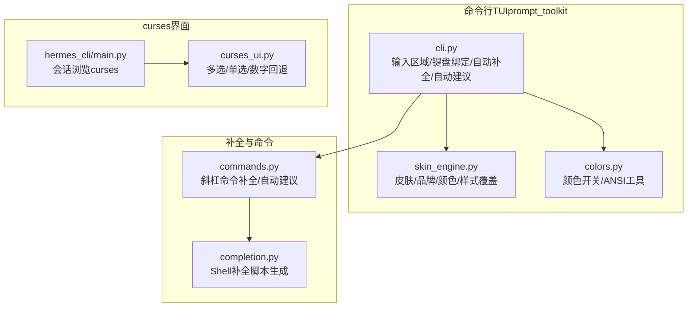
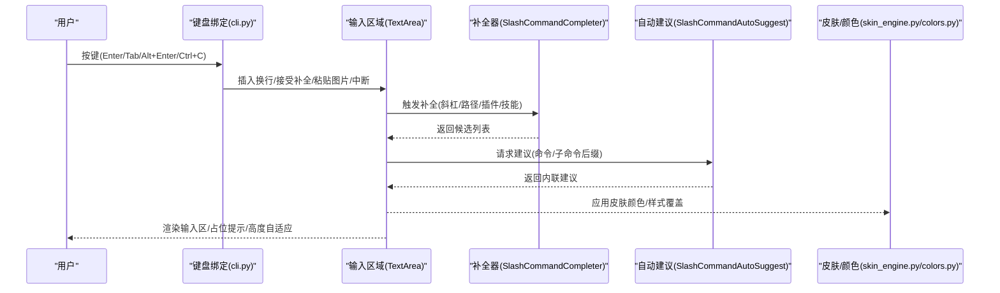
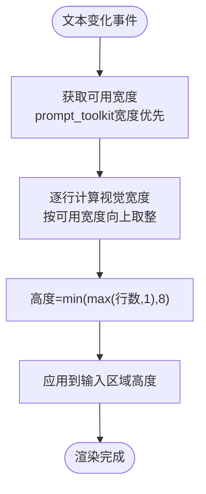
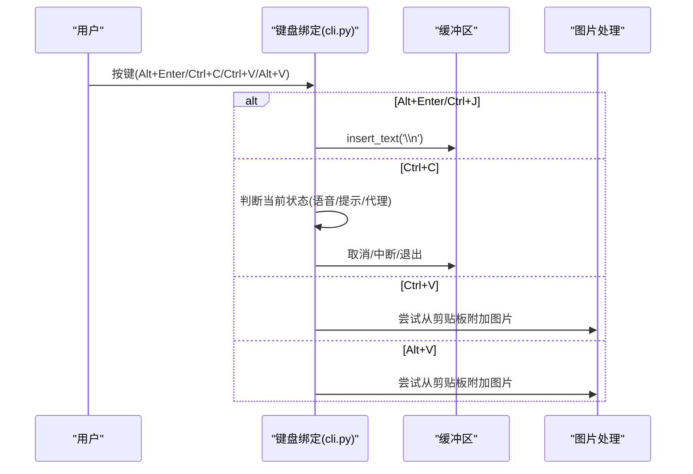
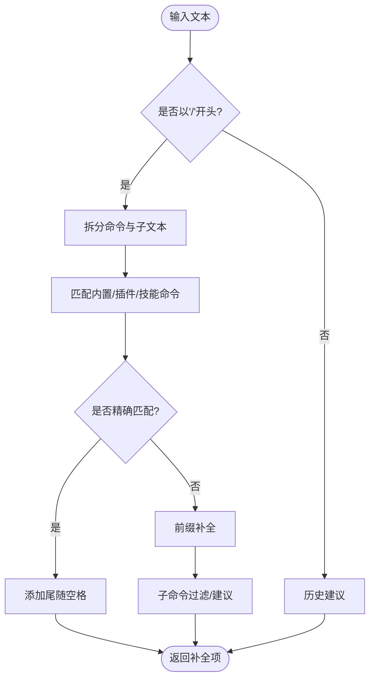
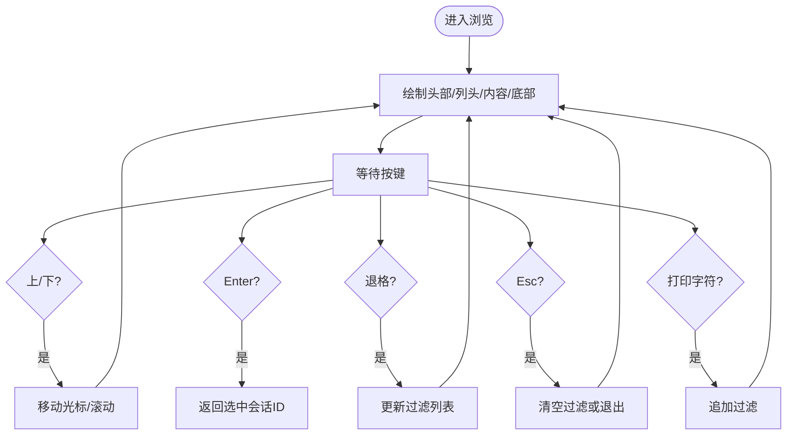
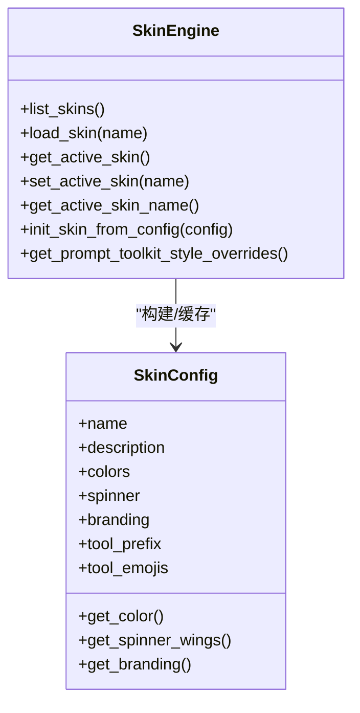
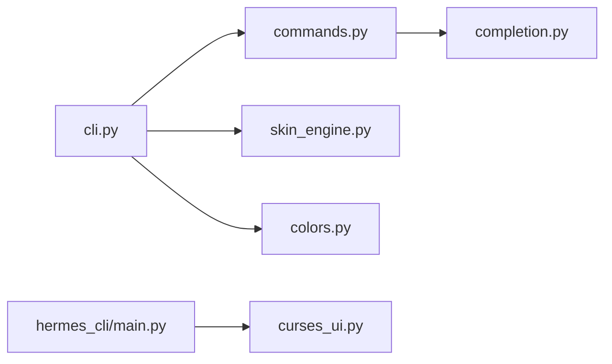

# 交互式界面

<cite>
**本文引用的文件**
- [curses_ui.py](file://hermes_cli/curses_ui.py)
- [main.py](file://hermes_cli/main.py)
- [commands.py](file://hermes_cli/commands.py)
- [completion.py](file://hermes_cli/completion.py)
- [skin_engine.py](file://hermes_cli/skin_engine.py)
- [colors.py](file://hermes_cli/colors.py)
- [example-skin.yaml](file://docs/skins/example-skin.yaml)
- [cli.py](file://cli.py)
- [test_commands.py](file://tests/hermes_cli/test_commands.py)
- [test_path_completion.py](file://tests/hermes_cli/test_path_completion.py)
- [test_session_browse.py](file://tests/hermes_cli/test_session_browse.py)
</cite>

## 目录
1. [简介](#简介)
2. [项目结构](#项目结构)
3. [核心组件](#核心组件)
4. [架构总览](#架构总览)
5. [详细组件分析](#详细组件分析)
6. [依赖分析](#依赖分析)
7. [性能考虑](#性能考虑)
8. [故障排除指南](#故障排除指南)
9. [结论](#结论)
10. [附录](#附录)

## 简介
本文件面向Hermes Agent的交互式界面，系统性阐述以下能力与实现：
- 多行编辑：基于prompt_toolkit的可折叠粘贴、动态高度、占位提示与内联自动建议
- 键盘快捷键：覆盖输入、历史导航、确认/取消、粘贴图像、Alt+Enter换行等
- 用户界面设计：curses与prompt_toolkit双栈界面，颜色与主题系统，响应式布局
- 斜杠命令自动补全：内置命令、子命令、插件命令、技能命令、路径补全与上下文感知
- 会话浏览：交互式会话选择、搜索过滤、结果排序与滚动
- 主题与界面定制：皮肤系统、品牌文案、工具输出前缀、状态栏与完成菜单样式

## 项目结构
交互式界面由两部分构成：
- 命令行TUI（prompt_toolkit）：负责输入区域、自动补全、自动建议、占位提示、键盘绑定与响应式布局
- curses界面：用于特定场景的交互式选择与浏览（如会话浏览）

**图表来源**
- [cli.py](file://cli.py)
- [skin_engine.py](file://hermes_cli/skin_engine.py)
- [colors.py](file://hermes_cli/colors.py)
- [curses_ui.py](file://hermes_cli/curses_ui.py)
- [main.py](file://hermes_cli/main.py)
- [commands.py](file://hermes_cli/commands.py)
- [completion.py](file://hermes_cli/completion.py)

**章节来源**
- [cli.py](file://cli.py)
- [skin_engine.py](file://hermes_cli/skin_engine.py)
- [colors.py](file://hermes_cli/colors.py)
- [curses_ui.py](file://hermes_cli/curses_ui.py)
- [main.py](file://hermes_cli/main.py)
- [commands.py](file://hermes_cli/commands.py)
- [completion.py](file://hermes_cli/completion.py)

## 核心组件
- 多行编辑与动态高度
  - TextArea支持多行、自动换行、高度自适应（基于视觉宽度与字符宽度）
  - 大段粘贴自动折叠为临时文件引用，避免阻塞
- 键盘快捷键
  - Alt+Enter/Ctrl+J插入换行；Tab处理补全/建议；上下箭头在历史与选择间切换
  - Ctrl+C统一处理：取消提示→中断代理→强制退出
  - Ctrl+V与Alt+V处理图片粘贴
- 斜杠命令自动补全
  - 内置命令、子命令、插件命令、技能命令、路径补全
  - 自动建议显示命令/子命令后缀，非斜杠输入回退到历史建议
- 会话浏览（curses）
  - 支持过滤、滚动、选择、Esc清空过滤/退出
- 主题与颜色
  - 皮肤系统提供颜色、品牌文案、工具前缀、状态栏与完成菜单样式
  - 颜色开关遵循NO_COLOR/TERM=dumb/Terminal类型

**章节来源**
- [cli.py](file://cli.py)
- [commands.py](file://hermes_cli/commands.py)
- [main.py](file://hermes_cli/main.py)
- [skin_engine.py](file://hermes_cli/skin_engine.py)
- [colors.py](file://hermes_cli/colors.py)

## 架构总览
交互式界面的关键流程如下：

**图表来源**
- [cli.py](file://cli.py)
- [commands.py](file://hermes_cli/commands.py)
- [skin_engine.py](file://hermes_cli/skin_engine.py)
- [colors.py](file://hermes_cli/colors.py)

## 详细组件分析

### 多行编辑与动态高度
- TextArea配置
  - 多行、自动换行、高度范围(1~8行)、历史记录、补全器、自动建议
  - 只读条件：命令运行中禁用输入
- 动态高度计算
  - 基于prompt_toolkit输出宽度与字符宽度（含CJK宽字符），按视觉行数限制高度
- 粘贴折叠
  - 当检测到大量字符或连续多行粘贴时，写入临时文件并以简洁引用替换文本

**图表来源**
- [cli.py](file://cli.py)

**章节来源**
- [cli.py](file://cli.py)

### 键盘快捷键与交互
- 输入与确认
  - Alt+Enter/Ctrl+J：插入换行
  - Tab：优先接受当前补全/建议，否则打开补全菜单
- 历史与选择
  - 上/下：在历史与选择之间切换；在首/末行时浏览历史
- 中断与取消
  - Ctrl+C：依次尝试取消语音录制→取消提示→中断代理→强制退出
- 图片粘贴
  - Ctrl+V：Linux终端回退处理；Alt+V：可靠粘贴图像（跨平台）
- 其他
  - Esc：在会话浏览中清空过滤或退出

**图表来源**
- [cli.py](file://cli.py)

**章节来源**
- [cli.py](file://cli.py)

### 斜杠命令自动补全系统
- 补全器
  - 内置命令、子命令、插件命令、技能命令、路径补全
  - 对于精确匹配的命令，自动添加尾随空格；子命令按需过滤
- 自动建议
  - 非斜杠输入回退到历史建议；斜杠输入建议命令/子命令后缀
- 路径补全
  - 识别“./”“~/”等路径前缀，按目录列出文件/目录，目录带斜杠后缀
  - 支持大小写不敏感前缀匹配与数量限制

**图表来源**
- [commands.py](file://hermes_cli/commands.py)
- [test_commands.py](file://tests/hermes_cli/test_commands.py)
- [test_path_completion.py](file://tests/hermes_cli/test_path_completion.py)

**章节来源**
- [commands.py](file://hermes_cli/commands.py)
- [test_commands.py](file://tests/hermes_cli/test_commands.py)
- [test_path_completion.py](file://tests/hermes_cli/test_path_completion.py)

### 会话浏览（curses）
- 屏幕布局
  - 顶部标题与操作提示；列头（名称/活跃时间/来源/ID）；内容区滚动列表；底部计数
- 搜索与过滤
  - 打印字符即加入过滤；退格删除；Esc清空过滤/退出
- 交互
  - 上/下箭头滚动；Enter选择；q/Esc退出
- 响应式
  - 终端过窄时提示；列宽自适应

**图表来源**
- [main.py](file://hermes_cli/main.py)
- [test_session_browse.py](file://tests/hermes_cli/test_session_browse.py)

**章节来源**
- [main.py](file://hermes_cli/main.py)
- [test_session_browse.py](file://tests/hermes_cli/test_session_browse.py)

### 主题与界面定制
- 皮肤系统
  - YAML定义：颜色、品牌文案、工具前缀、旋转器、横幅图
  - 内置主题：default/ares/mono/slate/daylight/warm-lightmode/poseidon/sisyphus/charizard
  - 运行时样式覆盖：prompt_toolkit风格层叠，即时刷新
- 颜色控制
  - NO_COLOR/TERM=dumb/Terminal类型决定是否启用颜色
- 示例模板
  - 提供完整字段参考与注释，便于创建自定义皮肤

**图表来源**
- [skin_engine.py](file://hermes_cli/skin_engine.py)
- [example-skin.yaml](file://docs/skins/example-skin.yaml)
- [colors.py](file://hermes_cli/colors.py)

**章节来源**
- [skin_engine.py](file://hermes_cli/skin_engine.py)
- [example-skin.yaml](file://docs/skins/example-skin.yaml)
- [colors.py](file://hermes_cli/colors.py)

### Shell补全脚本生成
- 支持bash/zsh/fish
- 基于实时argparse解析树，生成准确的子命令与标志补全
- 特殊处理profile子命令与-profile参数

**章节来源**
- [completion.py](file://hermes_cli/completion.py)

## 依赖分析
- 组件耦合
  - cli.py依赖commands.py（补全/建议）、skin_engine.py（样式/品牌）、colors.py（颜色）
  - curses_ui.py独立于主TUI，仅用于特定交互（多选/单选/数字回退）
  - main.py中的会话浏览依赖curses_ui.py的回退机制
- 外部依赖
  - prompt_toolkit（输入/补全/建议/键盘绑定）
  - curses（会话浏览）
  - yaml（皮肤加载）

**图表来源**
- [cli.py](file://cli.py)
- [commands.py](file://hermes_cli/commands.py)
- [skin_engine.py](file://hermes_cli/skin_engine.py)
- [colors.py](file://hermes_cli/colors.py)
- [curses_ui.py](file://hermes_cli/curses_ui.py)
- [main.py](file://hermes_cli/main.py)
- [completion.py](file://hermes_cli/completion.py)

**章节来源**
- [cli.py](file://cli.py)
- [commands.py](file://hermes_cli/commands.py)
- [skin_engine.py](file://hermes_cli/skin_engine.py)
- [colors.py](file://hermes_cli/colors.py)
- [curses_ui.py](file://hermes_cli/curses_ui.py)
- [main.py](file://hermes_cli/main.py)
- [completion.py](file://hermes_cli/completion.py)

## 性能考虑
- 多行编辑
  - 动态高度按视觉宽度计算，避免过度渲染
  - 大粘贴自动折叠为文件引用，减少UI阻塞
- 补全与建议
  - 命令/子命令补全基于内存缓存与前缀匹配
  - 路径补全限制数量，避免过多候选导致卡顿
- curses界面
  - 仅在TTY环境启用，非TTY直接回退到数字选择
  - 终端过窄时快速提示并退出，避免无效渲染

[本节为通用指导，无需具体文件引用]

## 故障排除指南
- 输入区域无法获得焦点或按键无响应
  - 检查是否处于命令运行/语音录制/确认提示等只读状态
  - 确认终端支持prompt_toolkit（现代终端通常支持）
- 斜杠命令补全不生效
  - 确认输入以“/”开头；检查命令可用性过滤器
  - 路径补全需以“./”或“~/”触发
- 会话浏览无法进入
  - 确保TTY可用；终端过窄时会提示退出
  - 使用Esc清空过滤后再选择
- 主题颜色异常
  - 设置NO_COLOR或使用TERM=dumb时将禁用颜色
  - 检查皮肤YAML语法与字段拼写

**章节来源**
- [cli.py](file://cli.py)
- [commands.py](file://hermes_cli/commands.py)
- [main.py](file://hermes_cli/main.py)
- [colors.py](file://hermes_cli/colors.py)

## 结论
Hermes Agent的交互式界面通过prompt_toolkit与curses双栈实现，既保证了强大的多行编辑与自动补全体验，又提供了可靠的curses回退与主题定制能力。斜杠命令补全系统覆盖内置、插件、技能与路径，结合自动建议与占位提示，显著提升输入效率。会话浏览与响应式布局确保在不同终端环境下的一致体验。

[本节为总结性内容，无需具体文件引用]

## 附录

### 使用示例与最佳实践
- 快速开始
  - 在输入区输入“/help”查看可用命令；输入“/reasoning show”查看推理设置
  - 使用Alt+Enter进行多行输入；Ctrl+C在任意状态下快速中断/取消
- 多行编辑
  - 长文本粘贴会自动折叠为文件引用，避免界面卡顿
  - 合理利用Tab补全与内联建议，减少重复输入
- 会话浏览
  - 输入字母即可过滤；Esc清空过滤；Enter确认选择
- 主题定制
  - 复制示例皮肤模板至“~/.hermes/skins/”，修改颜色与品牌文案后通过“/skin <name>”激活

**章节来源**
- [cli.py](file://cli.py)
- [commands.py](file://hermes_cli/commands.py)
- [main.py](file://hermes_cli/main.py)
- [skin_engine.py](file://hermes_cli/skin_engine.py)
- [example-skin.yaml](file://docs/skins/example-skin.yaml)