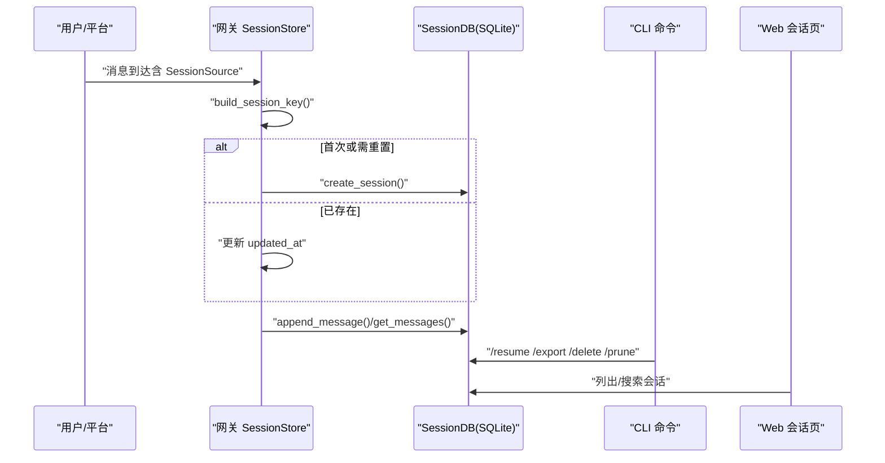
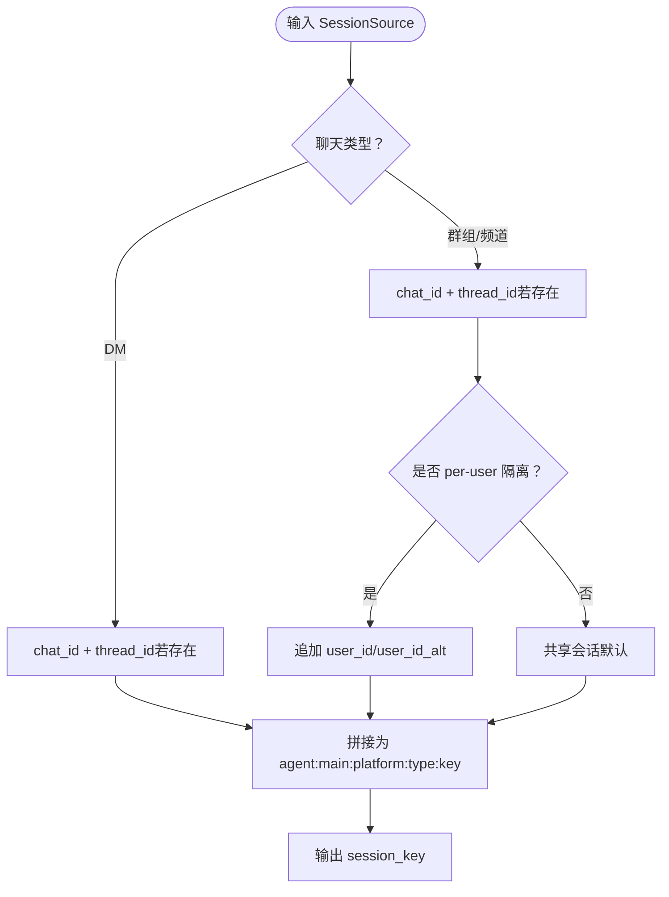
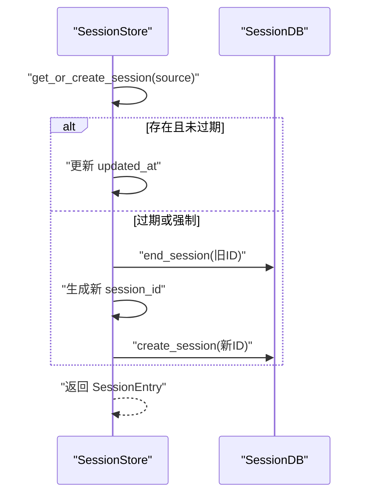
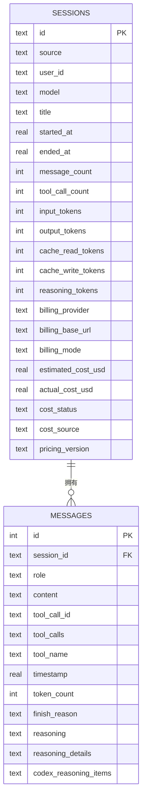
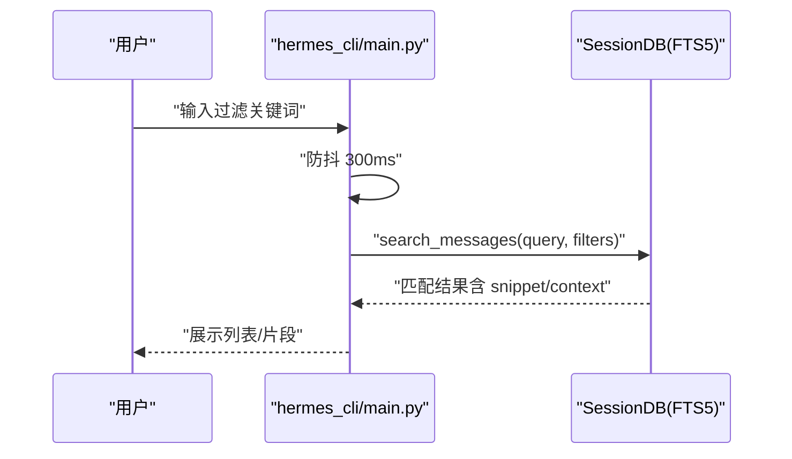
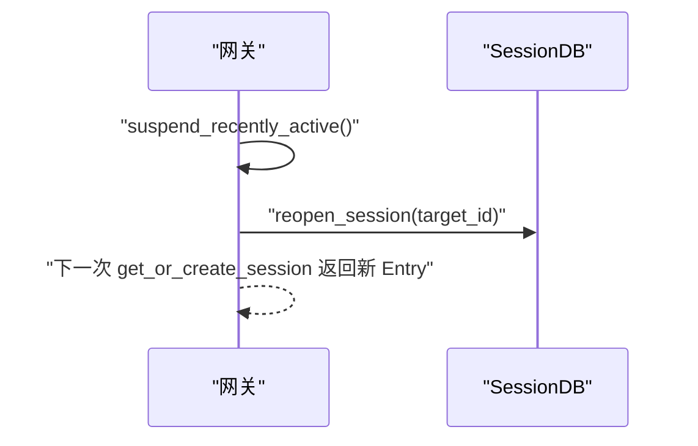
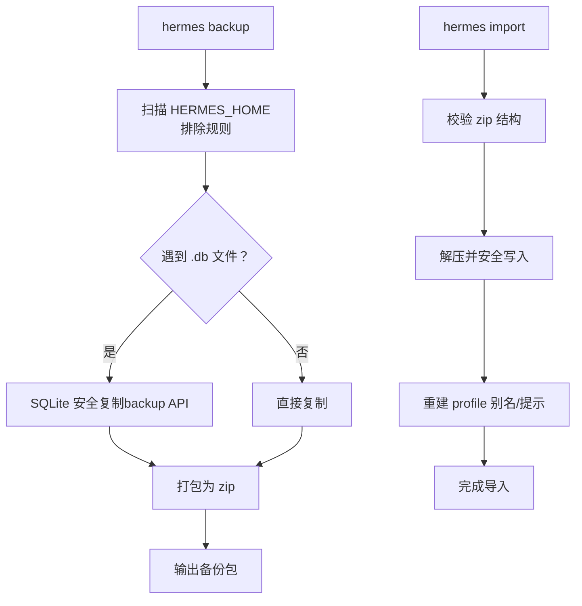
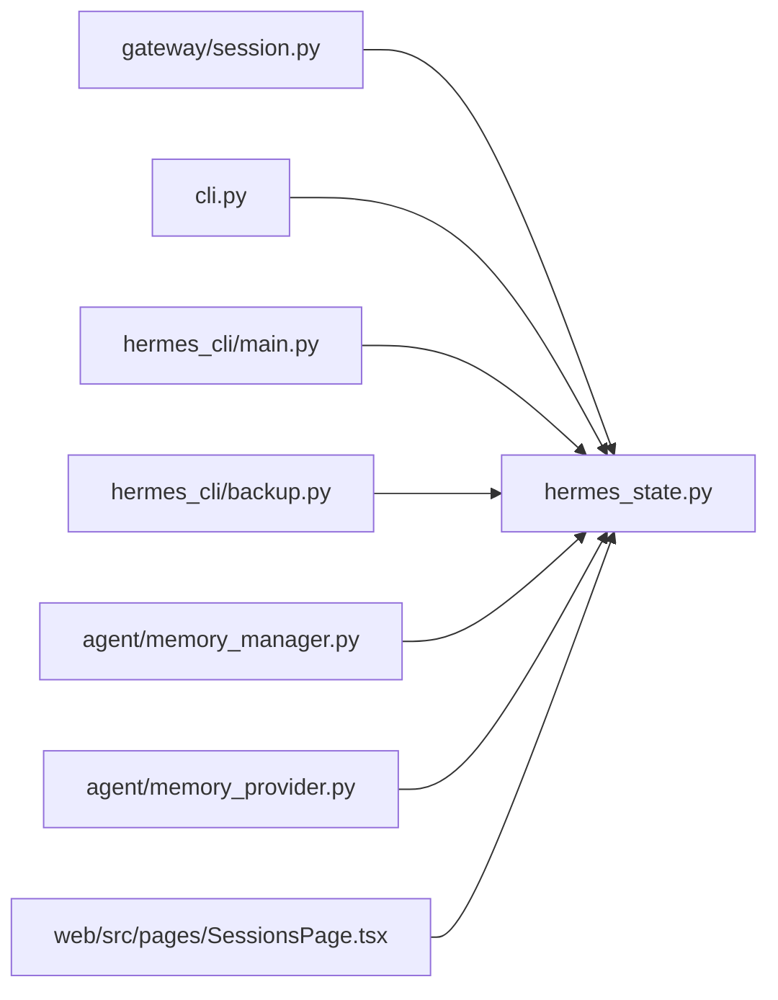

# 会话管理

<cite>
**本文引用的文件**
- [gateway/session.py](file://gateway/session.py)
- [hermes_state.py](file://hermes_state.py)
- [cli.py](file://cli.py)
- [hermes_cli/main.py](file://hermes_cli/main.py)
- [hermes_cli/backup.py](file://hermes_cli/backup.py)
- [agent/memory_manager.py](file://agent/memory_manager.py)
- [agent/memory_provider.py](file://agent/memory_provider.py)
- [web/src/pages/SessionsPage.tsx](file://web/src/pages/SessionsPage.tsx)
- [tests/gateway/test_session.py](file://tests/gateway/test_session.py)
- [tests/test_hermes_state.py](file://tests/test_hermes_state.py)
- [tests/hermes_cli/test_backup.py](file://tests/hermes_cli/test_backup.py)
- [tests/hermes_cli/test_session_browse.py](file://tests/hermes_cli/test_session_browse.py)
</cite>

## 目录
1. [简介](#简介)
2. [项目结构](#项目结构)
3. [核心组件](#核心组件)
4. [架构总览](#架构总览)
5. [详细组件分析](#详细组件分析)
6. [依赖分析](#依赖分析)
7. [性能考虑](#性能考虑)
8. [故障排查指南](#故障排查指南)
9. [结论](#结论)
10. [附录](#附录)

## 简介
本文件系统性阐述 Hermes Agent 的会话管理系统，覆盖会话生命周期（创建、保存、加载、删除）、会话标识与键生成规则、元数据与状态跟踪、会话浏览与交互选择、会话恢复与断线重连、并发与隔离、以及备份与迁移策略。文档同时提供最佳实践与性能优化建议，帮助开发者与用户在多平台、多会话场景下稳定高效地使用会话能力。

## 项目结构
围绕会话管理的关键模块与文件如下：
- 网关层会话存储与路由：gateway/session.py
- SQLite 会话数据库与全文检索：hermes_state.py
- CLI 会话命令与交互浏览：cli.py、hermes_cli/main.py
- 备份与导入：hermes_cli/backup.py
- 内存与上下文：agent/memory_manager.py、agent/memory_provider.py
- Web 会话浏览界面：web/src/pages/SessionsPage.tsx
- 测试用例：tests/gateway/test_session.py、tests/test_hermes_state.py、tests/hermes_cli/test_backup.py、tests/hermes_cli/test_session_browse.py

```mermaid
graph TB
subgraph "网关层"
GS["gateway/session.py<br/>会话键生成/存储/路由"]
end
subgraph "状态存储"
HS["hermes_state.py<br/>SQLite + FTS5 全文检索"]
end
subgraph "CLI"
CLI["cli.py<br/>/resume 等命令"]
HM["hermes_cli/main.py<br/>sessions browse 列表/筛选"]
end
subgraph "备份"
BK["hermes_cli/backup.py<br/>备份/导入/快照"]
end
subgraph "内存"
MM["agent/memory_manager.py"]
MP["agent/memory_provider.py"]
end
subgraph "Web"
WP["web/src/pages/SessionsPage.tsx<br/>前端会话浏览"]
end
GS --> HS
CLI --> HS
HM --> HS
BK --> HS
MM --> HS
MP --> HS
WP --> HS
```

图表来源
- [gateway/session.py](file://gateway/session.py)
- [hermes_state.py](file://hermes_state.py)
- [cli.py](file://cli.py)
- [hermes_cli/main.py](file://hermes_cli/main.py)
- [hermes_cli/backup.py](file://hermes_cli/backup.py)
- [agent/memory_manager.py](file://agent/memory_manager.py)
- [agent/memory_provider.py](file://agent/memory_provider.py)
- [web/src/pages/SessionsPage.tsx](file://web/src/pages/SessionsPage.tsx)

章节来源
- [gateway/session.py](file://gateway/session.py)
- [hermes_state.py](file://hermes_state.py)
- [cli.py](file://cli.py)
- [hermes_cli/main.py](file://hermes_cli/main.py)
- [hermes_cli/backup.py](file://hermes_cli/backup.py)
- [agent/memory_manager.py](file://agent/memory_manager.py)
- [agent/memory_provider.py](file://agent/memory_provider.py)
- [web/src/pages/SessionsPage.tsx](file://web/src/pages/SessionsPage.tsx)

## 核心组件
- 会话键与来源：通过 SessionSource 描述消息来源（平台、聊天类型、用户/群组标识等），并由 build_session_key 生成稳定的 session_key，用于区分不同上下文的会话。
- 会话存储：SessionStore 负责在内存中维护 session_key → session_id 映射，并持久化到 sessions.json；同时与 SQLite 的 SessionDB 协作，实现会话元数据与消息历史的持久化与查询。
- 会话生命周期：创建新会话、更新时间戳、自动重置（基于空闲或每日策略）、挂起以避免重启后误恢复、切换到已有会话 ID（/resume）。
- 恢复与重连：支持 /resume 切换到指定会话 ID；CLI 在启动时可重新打开已结束但未清理的会话；Web 提供搜索与筛选。
- 并发与隔离：SQLite 使用 WAL 模式与随机抖动重试降低写入竞争；会话键按来源维度隔离，确保多平台/多用户共享环境下的正确性。
- 备份与迁移：提供完整备份/导入、快速状态快照、会话导出/删除/修剪等能力。

章节来源
- [gateway/session.py](file://gateway/session.py)
- [hermes_state.py](file://hermes_state.py)
- [cli.py](file://cli.py)
- [hermes_cli/main.py](file://hermes_cli/main.py)
- [hermes_cli/backup.py](file://hermes_cli/backup.py)

## 架构总览
下图展示从消息来源到会话存储与检索的整体流程，以及 CLI/Web 的交互入口。



图表来源
- [gateway/session.py](file://gateway/session.py)
- [hermes_state.py](file://hermes_state.py)
- [cli.py](file://cli.py)
- [web/src/pages/SessionsPage.tsx](file://web/src/pages/SessionsPage.tsx)

## 详细组件分析

### 会话键生成与会话标识
- 会话键规则
  - DM：优先使用 chat_id 区分私聊；若存在 thread_id 则进一步细分；均不存在时可共享单一会话。
  - 群组/频道：以 chat_id 为主，thread_id 可进一步拆分；默认共享会话，除非启用 per-user 隔离。
  - 用户隔离：可通过配置控制是否按 user_id 或 user_id_alt 隔离；线程场景默认共享，除非显式开启 per-thread per-user 隔离。
- 会话标识
  - session_key：稳定键，用于映射到当前 session_id。
  - session_id：每次创建/重置时生成，格式包含时间戳与短随机串，保证全局唯一性。



图表来源
- [gateway/session.py](file://gateway/session.py)

章节来源
- [gateway/session.py](file://gateway/session.py)

### 会话生命周期管理
- 创建与更新
  - get_or_create_session：根据 session_key 获取或创建会话；更新 updated_at；必要时调用 SQLite create_session。
  - update_session：轻量更新（如 last_prompt_tokens）。
- 自动重置与挂起
  - _should_reset/_is_session_expired：依据空闲分钟数或每日时刻判断是否需要重置；活跃进程中的会话不会被判定过期。
  - suspend_session/suspend_recently_active：标记 suspended 以便下次访问时自动重置；启动时对近期活跃会话进行挂起以避免误恢复。
- 切换与恢复
  - reset_session：强制重置为新的 session_id。
  - switch_session：将当前 session_key 绑定到已有 session_id，常用于 /resume。



图表来源
- [gateway/session.py](file://gateway/session.py)

章节来源
- [gateway/session.py](file://gateway/session.py)

### 会话元数据与状态跟踪
- SessionEntry 字段
  - session_key/session_id、创建/更新时间、来源信息（平台/聊天类型/用户/群组）、显示名、令牌统计、成本估算、记忆刷新标记、挂起标记、自动重置标记等。
- SessionDB 表结构
  - sessions：会话元数据（source、user_id、模型、标题、开始/结束时间、计数与成本字段等）。
  - messages：消息历史（角色、内容、工具调用、推理字段等）。
  - FTS5 messages_fts：全文检索索引，支持复杂查询与高亮片段。
- 标题与解析
  - set_session_title/get_session_title/resolve_session_by_title：标题去重、清洗与变体解析（如 “标题 #2”）。



图表来源
- [hermes_state.py](file://hermes_state.py)

章节来源
- [hermes_state.py](file://hermes_state.py)

### 会话浏览、搜索与排序
- CLI 交互式浏览
  - hermes_cli/main.py 提供 sessions browse，支持键盘输入过滤、滚动、选择；支持“q”退出与“回车”确认。
  - 支持按标题/预览/ID/来源进行模糊匹配。
- Web 会话页
  - 分页加载 sessions，支持搜索框防抖（300ms）触发全文检索；结果映射为会话列表，支持删除与展开查看片段。
- 全文检索
  - hermes_state.py 使用 FTS5，支持短语、布尔、前缀等语法；返回匹配消息与上下文片段。



图表来源
- [hermes_cli/main.py](file://hermes_cli/main.py)
- [hermes_state.py](file://hermes_state.py)
- [web/src/pages/SessionsPage.tsx](file://web/src/pages/SessionsPage.tsx)

章节来源
- [hermes_cli/main.py](file://hermes_cli/main.py)
- [web/src/pages/SessionsPage.tsx](file://web/src/pages/SessionsPage.tsx)
- [hermes_state.py](file://hermes_state.py)

### 会话恢复机制
- 断线重连与进度保存
  - 网关启动时 suspend_recently_active 对近期活跃会话标记挂起，避免误恢复。
  - /resume 通过 switch_session 将当前会话绑定到目标 session_id，必要时 reopen_session。
  - CLI 启动时可重新打开已结束会话（清除 ended_at），继续对话。
- 进度与状态同步
  - append_to_transcript/rewrite_transcript：同时写入 SQLite 与 legacy JSONL，确保兼容性。
  - load_transcript：优先选择消息数量更长的数据源，避免迁移过程中的“静默截断”。



图表来源
- [gateway/session.py](file://gateway/session.py)
- [cli.py](file://cli.py)

章节来源
- [gateway/session.py](file://gateway/session.py)
- [cli.py](file://cli.py)

### 多会话并发管理与会话隔离
- 并发写入
  - SessionDB 使用 WAL 模式与短超时 + 应用层随机抖动重试，降低写入锁竞争导致的 UI 卡顿。
  - 定期 PASSIVE checkpoint，避免 WAL 文件无限增长。
- 会话隔离
  - 通过 session_key 的来源维度构建（平台/聊天类型/用户/群组/线程）实现强隔离，避免跨用户/跨群组污染。
  - 支持 per-user 与 per-thread per-user 配置，满足复杂场景需求。

章节来源
- [hermes_state.py](file://hermes_state.py)
- [gateway/session.py](file://gateway/session.py)

### 会话备份与迁移
- 备份
  - hermes_cli/backup.py 支持完整备份（排除临时/缓存/仓库目录），对 SQLite 使用安全复制（backup API），失败时回退到原样复制。
  - 快速状态快照（state-snapshots）仅拷贝关键状态文件，便于快速恢复。
- 导入
  - 校验 zip 结构，检测前缀，安全解压（路径穿越防护），并尝试重建 profile 别名脚本。
- 会话级操作
  - hermes_cli/main.py 提供 sessions export/delete/rename/prune 等命令；hermes_state.py 提供 export_session/export_all、delete_session、prune_sessions 等接口。



图表来源
- [hermes_cli/backup.py](file://hermes_cli/backup.py)
- [hermes_cli/main.py](file://hermes_cli/main.py)
- [hermes_state.py](file://hermes_state.py)

章节来源
- [hermes_cli/backup.py](file://hermes_cli/backup.py)
- [hermes_cli/main.py](file://hermes_cli/main.py)
- [hermes_state.py](file://hermes_state.py)
- [tests/hermes_cli/test_backup.py](file://tests/hermes_cli/test_backup.py)

## 依赖分析
- 组件耦合
  - gateway/session.py 依赖 hermes_state.py 的 SessionDB 进行持久化；同时维护内存索引 sessions.json。
  - CLI 与 Web 通过 hermes_state.py 的查询接口（列出/搜索/导出/删除）提供用户交互。
  - agent/memory_manager 与 memory_provider 作为外部扩展点，不直接参与会话键生成，但会在会话生命周期中进行上下文与记忆的同步。
- 外部依赖
  - SQLite（WAL/FTS5）
  - curses（CLI 交互浏览）
  - zipfile/json（备份/导入）



图表来源
- [gateway/session.py](file://gateway/session.py)
- [hermes_state.py](file://hermes_state.py)
- [cli.py](file://cli.py)
- [hermes_cli/main.py](file://hermes_cli/main.py)
- [hermes_cli/backup.py](file://hermes_cli/backup.py)
- [agent/memory_manager.py](file://agent/memory_manager.py)
- [agent/memory_provider.py](file://agent/memory_provider.py)
- [web/src/pages/SessionsPage.tsx](file://web/src/pages/SessionsPage.tsx)

章节来源
- [gateway/session.py](file://gateway/session.py)
- [hermes_state.py](file://hermes_state.py)
- [cli.py](file://cli.py)
- [hermes_cli/main.py](file://hermes_cli/main.py)
- [hermes_cli/backup.py](file://hermes_cli/backup.py)
- [agent/memory_manager.py](file://agent/memory_manager.py)
- [agent/memory_provider.py](file://agent/memory_provider.py)
- [web/src/pages/SessionsPage.tsx](file://web/src/pages/SessionsPage.tsx)

## 性能考虑
- 写入竞争与锁等待
  - 使用 WAL + 短超时 + 随机抖动重试，避免 SQLite 内建“确定性退避”造成的队头阻塞。
  - 定期 PASSIVE checkpoint，减少 WAL 文件膨胀。
- 查询与全文检索
  - FTS5 索引提升搜索性能；注意对用户输入进行安全转义与规范化，避免语法错误与性能退化。
- 会话键设计
  - 合理使用 per-user 与 per-thread per-user 隔离，避免过度碎片化导致索引与查询开销上升。
- I/O 与持久化
  - append_to_transcript 同步写入 SQLite 与 JSONL，确保兼容性；在批量写入场景建议合并写入以减少 I/O 次数。
- 并发读取
  - SQLite 多读单写模型下，尽量减少长事务与长时间持有锁的操作。

章节来源
- [hermes_state.py](file://hermes_state.py)
- [gateway/session.py](file://gateway/session.py)

## 故障排查指南
- 会话无法恢复
  - 检查是否被标记 suspended（/stop 后可能挂起）；使用 suspend_recently_active 或手动 reset_session。
  - 使用 switch_session 指定目标 session_id；若目标已结束，先 reopen_session。
- 搜索不到会话或结果异常
  - 确认 FTS5 查询语法（短语、布尔、前缀）；检查输入是否被安全转义。
  - 若会话来自旧版本，可能仍保留 legacy JSONL；load_transcript 会优先选择消息更多的数据源。
- 备份/导入失败
  - 检查权限与磁盘空间；确保 zip 结构有效；导入时注意覆盖风险（可使用 --force 提示）。
- 并发写入冲突
  - 观察日志中的 database is locked 错误；应用层已做重试，若频繁出现，考虑降低写入频率或调整并发策略。

章节来源
- [gateway/session.py](file://gateway/session.py)
- [hermes_state.py](file://hermes_state.py)
- [hermes_cli/backup.py](file://hermes_cli/backup.py)
- [tests/gateway/test_session.py](file://tests/gateway/test_session.py)
- [tests/test_hermes_state.py](file://tests/test_hermes_state.py)
- [tests/hermes_cli/test_backup.py](file://tests/hermes_cli/test_backup.py)

## 结论
Hermes Agent 的会话管理以“稳定键 + SQLite + FTS5 + 多入口交互”为核心，既保证了跨平台、多用户的强隔离与一致性，又提供了丰富的浏览、搜索、恢复与迁移能力。通过合理的键设计、并发写入策略与备份导入机制，能够在复杂场景下保持高可用与可运维性。

## 附录
- 最佳实践
  - 使用 per-user 隔离时谨慎评估会话数量，避免过多碎片化。
  - 定期执行 prune_sessions 清理陈旧会话，释放存储空间。
  - 对敏感平台（Discord/Slack）谨慎处理用户标识，必要时启用 PII 脱敏。
  - 使用 /resume 与标题管理配合，提高会话定位效率。
- 性能优化建议
  - 降低写入频率，合并批量写入；避免在热路径上执行长事务。
  - 使用 FTS5 查询时避免过于复杂的布尔表达式，优先使用短语与前缀。
  - 定期监控 WAL 文件大小，确保 PASSIVE checkpoint 正常运行。