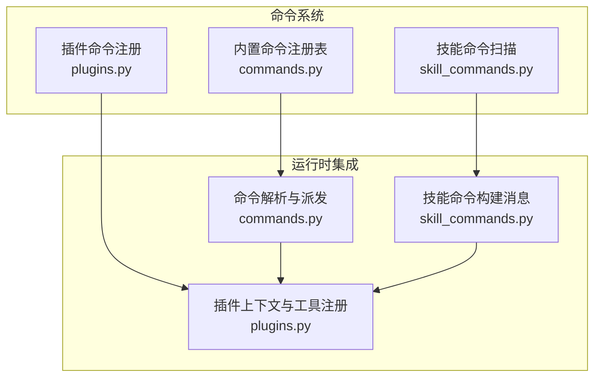
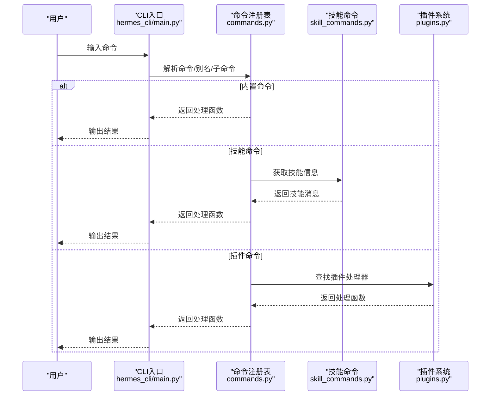
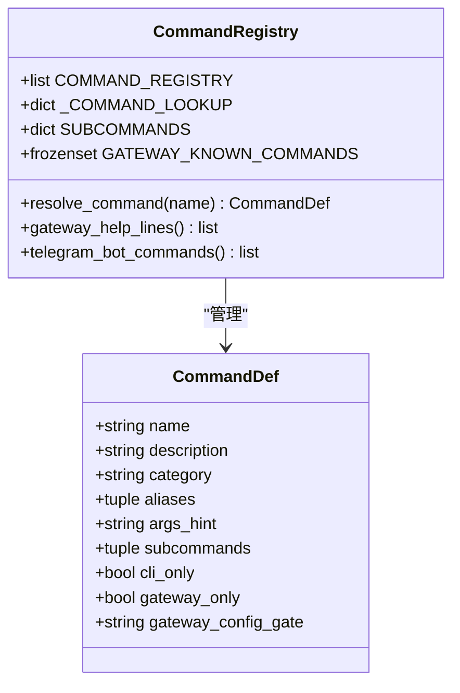
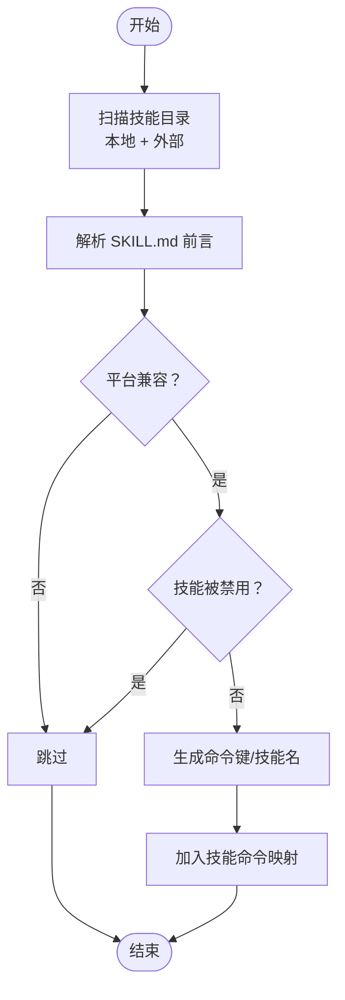
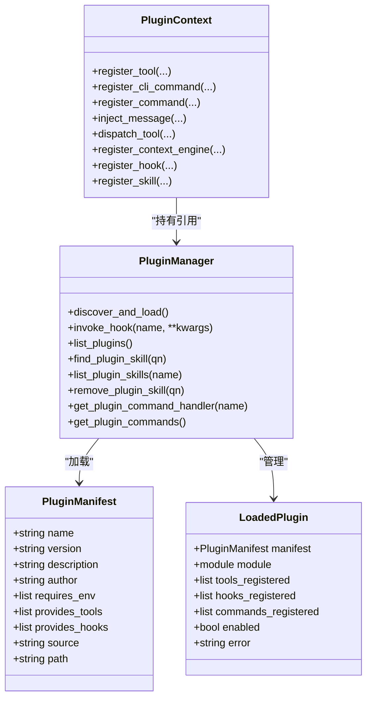
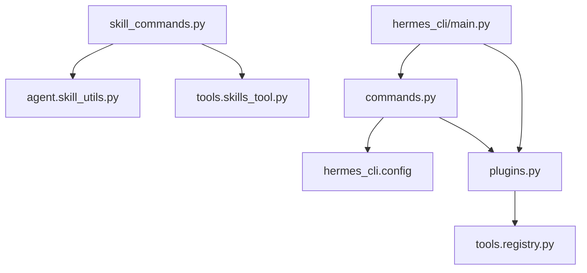

# 命令扩展开发

<cite>
**本文档引用的文件**
- [hermes_cli/commands.py](file://hermes_cli/commands.py)
- [hermes_cli/plugins.py](file://hermes_cli/plugins.py)
- [hermes_cli/plugins_cmd.py](file://hermes_cli/plugins_cmd.py)
- [agent/skill_commands.py](file://agent/skill_commands.py)
- [agent/skill_utils.py](file://agent/skill_utils.py)
- [tools/registry.py](file://tools/registry.py)
- [hermes_cli/main.py](file://hermes_cli/main.py)
- [plugins/example-dashboard/dashboard/plugin_api.py](file://plugins/example-dashboard/dashboard/plugin_api.py)
- [plugins/memory/honcho/plugin.yaml](file://plugins/memory/honcho/plugin.yaml)
- [plugins/memory/honcho/__init__.py](file://plugins/memory/honcho/__init__.py)
</cite>

## 目录
1. [简介](#简介)
2. [项目结构](#项目结构)
3. [核心组件](#核心组件)
4. [架构总览](#架构总览)
5. [详细组件分析](#详细组件分析)
6. [依赖分析](#依赖分析)
7. [性能考虑](#性能考虑)
8. [故障排除指南](#故障排除指南)
9. [结论](#结论)
10. [附录](#附录)

## 简介
本指南面向希望为 Hermes Agent 开发自定义命令与扩展现有命令功能的开发者。内容覆盖命令注册机制、参数定义与验证规则、命令插件系统架构与开发流程，并提供从简单到复杂的命令开发示例（含异步命令）、权限控制与安全检查、资源限制、测试与调试方法、发布与分发策略，以及最佳实践与常见陷阱。

## 项目结构
Hermes Agent 的命令体系由三部分组成：
- 内置命令：集中于命令注册表，支持别名、子命令、平台可用性门控等特性。
- 技能命令：通过扫描技能目录生成的“/技能名”命令，支持平台过滤、禁用列表、外部技能目录等。
- 插件命令：通过插件系统注册的会话内 slash 命令，支持 CLI 子命令与会话内命令两类扩展点。

图表来源
- [hermes_cli/commands.py:1-1235](file://hermes_cli/commands.py#L1-L1235)
- [agent/skill_commands.py:1-378](file://agent/skill_commands.py#L1-L378)
- [hermes_cli/plugins.py:1-844](file://hermes_cli/plugins.py#L1-L844)

章节来源
- [hermes_cli/commands.py:1-1235](file://hermes_cli/commands.py#L1-L1235)
- [agent/skill_commands.py:1-378](file://agent/skill_commands.py#L1-L378)
- [hermes_cli/plugins.py:1-844](file://hermes_cli/plugins.py#L1-L844)

## 核心组件
- 命令注册表与解析：内置命令以统一的数据结构注册，支持别名、子命令、平台可用性门控、自动补全等。
- 技能命令系统：扫描本地与外部技能目录，生成“/技能名”命令，注入技能配置与运行时提示。
- 插件系统：支持用户插件、项目插件与 pip 插件三种来源；提供工具注册、生命周期钩子、上下文引擎替换、CLI 子命令与会话内 slash 命令注册等能力。

章节来源
- [hermes_cli/commands.py:1-1235](file://hermes_cli/commands.py#L1-L1235)
- [agent/skill_commands.py:1-378](file://agent/skill_commands.py#L1-L378)
- [hermes_cli/plugins.py:1-844](file://hermes_cli/plugins.py#L1-L844)

## 架构总览
命令系统在运行时通过以下路径协同工作：
- CLI 启动后加载环境变量与配置，初始化日志与网络偏好。
- 命令注册表与技能命令扫描在导入阶段完成构建。
- 运行时根据输入解析命令，调用对应的处理逻辑（内置命令、技能命令或插件命令）。
- 插件通过上下文对象注册工具与命令，参与生命周期钩子与工具调度。

图表来源
- [hermes_cli/main.py:1-6528](file://hermes_cli/main.py#L1-L6528)
- [hermes_cli/commands.py:1-1235](file://hermes_cli/commands.py#L1-L1235)
- [agent/skill_commands.py:1-378](file://agent/skill_commands.py#L1-L378)
- [hermes_cli/plugins.py:1-844](file://hermes_cli/plugins.py#L1-L844)

## 详细组件分析

### 内置命令系统（commands.py）
- 数据结构：使用不可变数据类描述单个命令，包含名称、描述、分类、别名、参数占位符、子命令、平台可用性门控等字段。
- 注册机制：集中式注册表，支持别名映射、子命令提取、平台可用性门控（基于配置路径解析）。
- 自动补全：提供命令补全器，支持技能命令、路径补全等。
- 平台适配：针对不同平台（Telegram、Discord、Slack）进行命令名清洗与长度限制。

图表来源
- [hermes_cli/commands.py:1-1235](file://hermes_cli/commands.py#L1-L1235)

章节来源
- [hermes_cli/commands.py:1-1235](file://hermes_cli/commands.py#L1-L1235)

### 技能命令系统（skill_commands.py 与 skill_utils.py）
- 扫描与索引：遍历本地与外部技能目录，解析 SKILL.md 前言，生成“/技能名”命令字典。
- 平台过滤：根据技能前言中的平台声明与当前系统平台匹配结果过滤。
- 禁用列表：支持按技能名与平台维度的禁用配置。
- 消息构建：将技能内容、配置注入、运行时提示等组合为会话消息。

图表来源
- [agent/skill_commands.py:209-278](file://agent/skill_commands.py#L209-L278)
- [agent/skill_utils.py:92-115](file://agent/skill_utils.py#L92-L115)

章节来源
- [agent/skill_commands.py:1-378](file://agent/skill_commands.py#L1-L378)
- [agent/skill_utils.py:1-466](file://agent/skill_utils.py#L1-L466)

### 插件系统（plugins.py 与插件示例）
- 插件来源：用户插件（~/.hermes/plugins/）、项目插件（./.hermes/plugins/，需显式启用）、pip 插件（entry-points）。
- 生命周期钩子：支持 pre_tool_call、post_tool_call、pre_llm_call、post_llm_call、on_session_start、on_session_end 等。
- 上下文对象：PluginContext 提供注册工具、注册 CLI 子命令、注册 slash 命令、注入消息、分发工具、注册上下文引擎、注册生命周期钩子、注册插件技能等能力。
- 插件命令注册：注册会话内 slash 命令，冲突检测，handler 支持同步与异步。
- 插件命令发现：在网关平台菜单中优先展示插件命令，其次为内置技能命令。

图表来源
- [hermes_cli/plugins.py:92-410](file://hermes_cli/plugins.py#L92-L410)

章节来源
- [hermes_cli/plugins.py:1-844](file://hermes_cli/plugins.py#L1-L844)

### 工具注册与调度（tools/registry.py）
- 自注册模式：每个工具模块在导入时调用 registry.register() 完成注册。
- 注册约束：防止插件/MCP 覆盖内置工具或反之；支持工具集别名与可用性检查。
- 调度桥接：对异步工具处理器自动桥接为同步返回，统一错误格式。

章节来源
- [tools/registry.py:1-483](file://tools/registry.py#L1-L483)

### 插件命令开发示例
- 示例插件 API：演示插件路由挂载方式。
- Honcho 记忆插件：展示工具 schema、MemoryProvider 实现、生命周期钩子与配置项。

章节来源
- [plugins/example-dashboard/dashboard/plugin_api.py:1-15](file://plugins/example-dashboard/dashboard/plugin_api.py#L1-L15)
- [plugins/memory/honcho/plugin.yaml:1-8](file://plugins/memory/honcho/plugin.yaml#L1-L8)
- [plugins/memory/honcho/__init__.py:1-1055](file://plugins/memory/honcho/__init__.py#L1-L1055)

## 依赖分析
- 命令系统依赖关系
  - commands.py 依赖 hermes_cli.config 读取配置以解析平台可用性门控。
  - commands.py 依赖 plugins.py 的插件命令注册表，用于网关菜单与技能命令合并。
  - skill_commands.py 依赖 tools.skills_tool 与 agent.skill_utils 扫描与解析技能。
  - plugins.py 依赖 tools.registry 进行工具注册与调度。
- 运行时耦合
  - CLI 入口在启动时加载环境变量与配置，确保后续组件可用。
  - 插件命令与内置命令共享相同的命令解析与派发路径。

图表来源
- [hermes_cli/commands.py:1-1235](file://hermes_cli/commands.py#L1-L1235)
- [agent/skill_commands.py:1-378](file://agent/skill_commands.py#L1-L378)
- [hermes_cli/plugins.py:1-844](file://hermes_cli/plugins.py#L1-L844)
- [hermes_cli/main.py:1-6528](file://hermes_cli/main.py#L1-L6528)

章节来源
- [hermes_cli/commands.py:1-1235](file://hermes_cli/commands.py#L1-L1235)
- [agent/skill_commands.py:1-378](file://agent/skill_commands.py#L1-L378)
- [hermes_cli/plugins.py:1-844](file://hermes_cli/plugins.py#L1-L844)
- [hermes_cli/main.py:1-6528](file://hermes_cli/main.py#L1-L6528)

## 性能考虑
- 命令注册表构建：一次性构建，避免重复扫描；子命令提取与正则匹配仅在导入时执行。
- 技能命令扫描：按需扫描，缓存结果；平台与禁用过滤减少无效加载。
- 插件加载：延迟加载与禁用列表过滤；工具注册采用锁保护，保证并发安全。
- 工具调度：异步工具自动桥接，异常捕获统一返回，避免阻塞主循环。

## 故障排除指南
- 命令冲突
  - 插件注册 slash 命令时会检测与内置命令的冲突，冲突会被拒绝并记录警告。
- 平台可用性
  - 使用 gateway_config_gate 控制命令在网关端的可见性；若配置读取失败，降级为不可见。
- 插件加载失败
  - 插件缺少 register() 函数、manifest 解析失败、依赖缺失等情况会被记录为错误并跳过。
- 工具不可用
  - 工具集可用性检查失败时，工具不会出现在可用列表中；可通过检查工具集要求与环境变量定位问题。

章节来源
- [hermes_cli/plugins.py:242-254](file://hermes_cli/plugins.py#L242-L254)
- [hermes_cli/commands.py:257-299](file://hermes_cli/commands.py#L257-L299)
- [hermes_cli/plugins.py:540-577](file://hermes_cli/plugins.py#L540-L577)

## 结论
Hermes Agent 的命令扩展体系通过统一的命令注册表、灵活的技能命令扫描与强大的插件系统，为开发者提供了清晰、可扩展且安全的命令开发框架。遵循本文档的开发流程、参数定义与验证规则、权限控制与安全检查、资源限制与测试调试方法，可以高效地实现从简单到复杂的命令与插件功能，并安全地发布与分发。

## 附录

### 命令开发流程（步骤化）
- 设计命令
  - 明确命令名称、描述、分类、别名与参数占位符。
  - 如需平台特定行为，设置 gateway_config_gate 或 platform 过滤。
- 注册内置命令
  - 在命令注册表中添加 CommandDef 条目，必要时补充子命令与别名。
- 开发技能命令
  - 编写 SKILL.md，声明平台与配置需求；放置在本地或外部技能目录。
  - 系统会自动扫描并生成“/技能名”命令。
- 开发插件命令
  - 在插件的 register() 中通过 PluginContext.register_command() 注册 slash 命令。
  - 若需要工具调用，使用 PluginContext.register_tool() 注册工具并在命令处理器中 dispatch_tool()。
- 参数定义与验证
  - 对于工具，使用 OpenAI 风格 schema 定义参数；在 handler 中进行输入校验与错误返回。
  - 对于插件命令，建议在 handler 中进行参数解析与验证。
- 异步命令
  - 插件命令 handler 可为异步函数；系统会自动桥接为同步返回。
- 权限控制与安全检查
  - 使用 pre_tool_call 钩子返回 block 指令进行策略拦截。
  - 工具注册时声明 requires_env，确保运行环境满足要求。
- 资源限制
  - 工具注册时可设置 max_result_size_chars；全局默认值可在预算配置中调整。
- 测试与调试
  - 单元测试覆盖命令解析、参数验证、插件加载与工具调度。
  - 使用 CLI 的调试输出与日志定位问题。
- 发布与分发
  - 用户插件安装至 ~/.hermes/plugins/<name>/，包含 plugin.yaml 与 __init__.py。
  - 项目插件安装至 ./hermes/plugins/<name>/（需启用环境变量）。
  - pip 插件通过 entry-points 分发。

章节来源
- [hermes_cli/commands.py:1-1235](file://hermes_cli/commands.py#L1-L1235)
- [agent/skill_commands.py:1-378](file://agent/skill_commands.py#L1-L378)
- [hermes_cli/plugins.py:1-844](file://hermes_cli/plugins.py#L1-L844)
- [tools/registry.py:1-483](file://tools/registry.py#L1-L483)