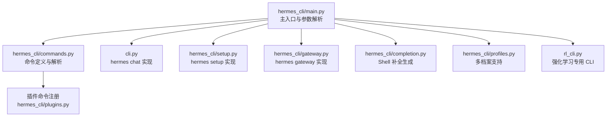
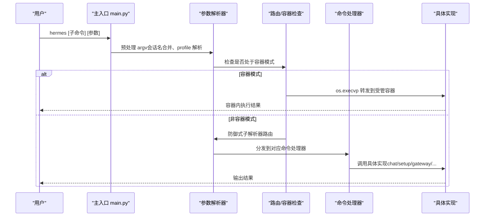
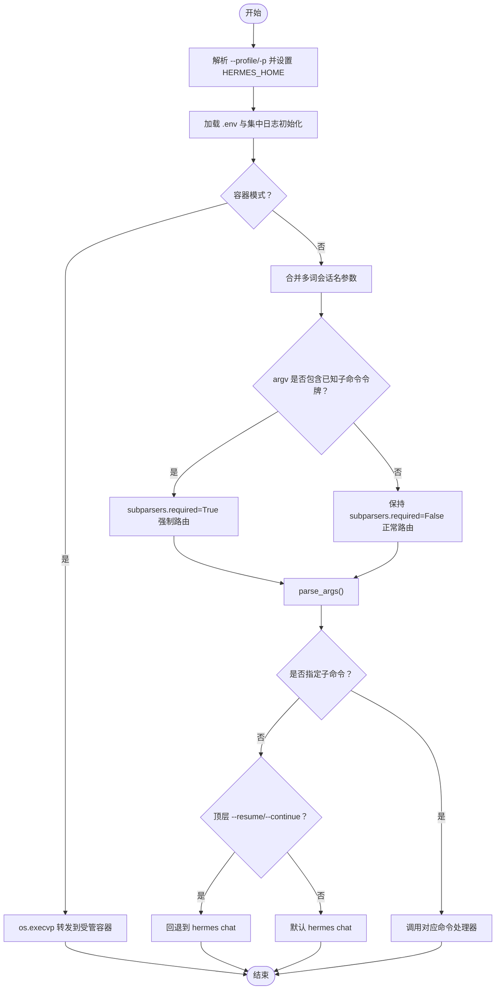
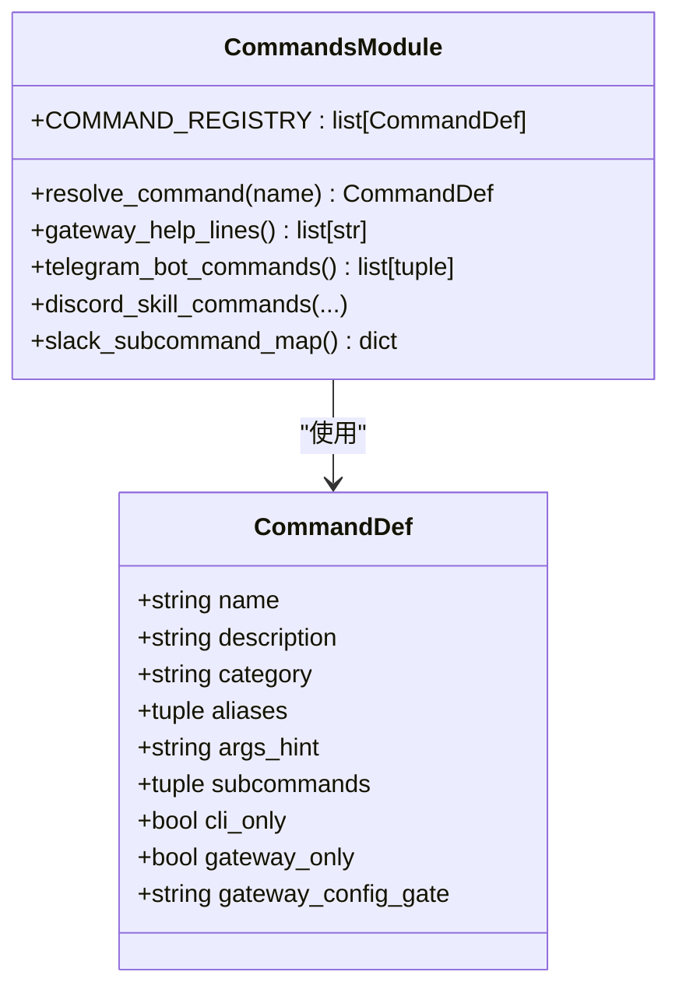
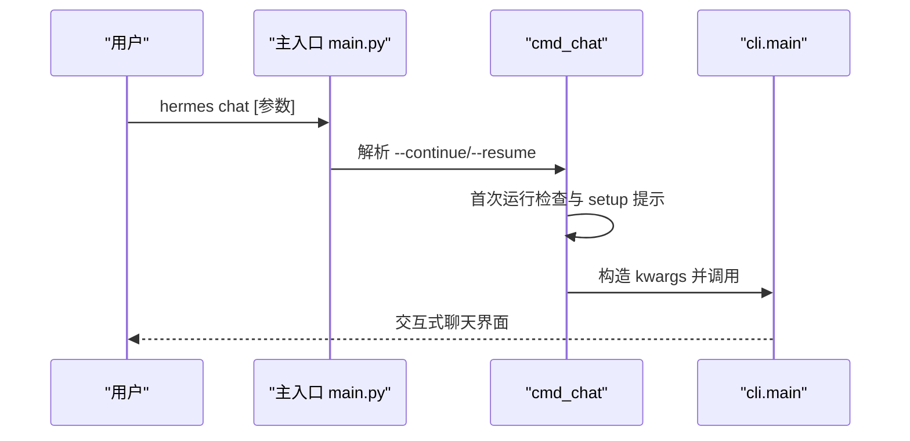
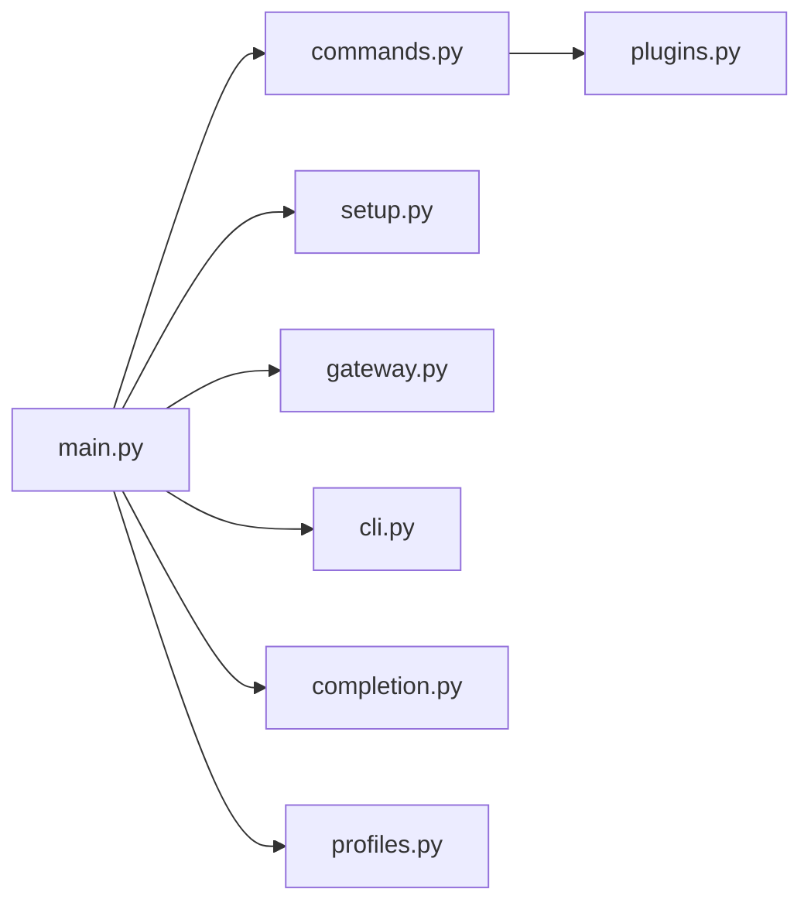

# 命令系统架构

<cite>
**本文档引用的文件**
- [hermes_cli/main.py](file://hermes_cli/main.py)
- [hermes_cli/commands.py](file://hermes_cli/commands.py)
- [cli.py](file://cli.py)
- [hermes_cli/setup.py](file://hermes_cli/setup.py)
- [hermes_cli/gateway.py](file://hermes_cli/gateway.py)
- [hermes_cli/completion.py](file://hermes_cli/completion.py)
- [hermes_cli/profiles.py](file://hermes_cli/profiles.py)
- [rl_cli.py](file://rl_cli.py)
</cite>

## 目录
1. [引言](#引言)
2. [项目结构](#项目结构)
3. [核心组件](#核心组件)
4. [架构总览](#架构总览)
5. [详细组件分析](#详细组件分析)
6. [依赖关系分析](#依赖关系分析)
7. [性能考虑](#性能考虑)
8. [故障排除指南](#故障排除指南)
9. [结论](#结论)

## 引言
本文件系统性阐述 Hermes Agent 的命令系统架构，重点覆盖以下方面：
- 命令解析机制：基于 argparse 的主入口与子命令分发
- 参数处理流程：参数预处理、会话名合并、容器感知路由
- 命令路由逻辑：防御式子解析器路由、默认到聊天的回退
- 主入口点对不同命令的处理：hermes chat、hermes gateway、hermes setup 等
- 命令别名、子命令嵌套结构与命令继承关系
- 命令行参数验证、默认值处理与错误处理机制
- 命令扩展开发指南：新增命令与自定义行为
- 具体代码示例路径：命令注册与执行过程

## 项目结构
Hermes 命令系统围绕 CLI 主入口与一组子模块协作构建：
- hermes_cli/main.py：命令行主入口，负责参数解析、子命令路由、容器感知转发、防御式子解析器路由
- hermes_cli/commands.py：内置命令定义与自动补全、平台映射、别名与子命令解析
- cli.py：交互式聊天 CLI（hermes chat）的实现入口
- hermes_cli/setup.py：交互式安装向导（hermes setup）
- hermes_cli/gateway.py：网关管理命令（hermes gateway）
- hermes_cli/completion.py：Shell 补全脚本生成（bash/zsh/fish）
- hermes_cli/profiles.py：多配置文件档案（profile）管理
- rl_cli.py：强化学习专用 CLI（可作为命令扩展参考）

**图表来源**
- [hermes_cli/main.py:6400-6528](file://hermes_cli/main.py#L6400-L6528)
- [hermes_cli/commands.py:1-120](file://hermes_cli/commands.py#L1-L120)
- [cli.py:1-120](file://cli.py#L1-L120)
- [hermes_cli/setup.py:1-120](file://hermes_cli/setup.py#L1-L120)
- [hermes_cli/gateway.py:1-120](file://hermes_cli/gateway.py#L1-L120)
- [hermes_cli/completion.py:1-80](file://hermes_cli/completion.py#L1-L80)
- [hermes_cli/profiles.py:1-120](file://hermes_cli/profiles.py#L1-L120)
- [rl_cli.py:1-120](file://rl_cli.py#L1-L120)

**章节来源**
- [hermes_cli/main.py:6400-6528](file://hermes_cli/main.py#L6400-L6528)
- [hermes_cli/commands.py:1-120](file://hermes_cli/commands.py#L1-L120)

## 核心组件
- 主入口与参数解析
  - 解析顶层参数（如 --version、--resume、--continue、--worktree 等），并根据是否包含已知子命令令牌决定是否强制子解析器必选
  - 对会话名称参数进行合并处理，避免多词参数被错误拆分
  - 在容器模式下透明转发所有子命令至受管容器
  - 默认行为：未指定命令时回退到 hermes chat
- 内置命令系统
  - 统一的 CommandDef 定义与别名映射
  - 支持 CLI 专属、网关专属、配置门控命令
  - 提供自动补全、平台菜单映射（Telegram/Discord）、帮助文本生成
- 子命令实现
  - hermes chat：交互式聊天 CLI，参数透传给 cli.py
  - hermes gateway：网关生命周期管理（run/start/stop/restart/status/install/uninstall/setup）
  - hermes setup：交互式安装向导，引导用户完成模型/终端/工具等配置
- 扩展机制
  - 插件注册 slash 命令（/cmd），在 CLI 与网关中生效
  - 自定义命令可通过插件上下文注册，或通过命令定义扩展

**章节来源**
- [hermes_cli/main.py:6400-6528](file://hermes_cli/main.py#L6400-L6528)
- [hermes_cli/commands.py:1-120](file://hermes_cli/commands.py#L1-L120)
- [cli.py:1-120](file://cli.py#L1-L120)
- [hermes_cli/gateway.py:1-120](file://hermes_cli/gateway.py#L1-L120)
- [hermes_cli/setup.py:1-120](file://hermes_cli/setup.py#L1-L120)

## 架构总览
Hermes 命令系统采用“主入口 + 子命令 + 命令定义 + 扩展”的分层设计。主入口负责环境初始化、参数预处理与路由；命令定义模块提供统一的命令元数据与解析；子命令模块实现具体功能；扩展模块允许插件注册自定义命令。

**图表来源**
- [hermes_cli/main.py:6433-6524](file://hermes_cli/main.py#L6433-L6524)

**章节来源**
- [hermes_cli/main.py:6433-6524](file://hermes_cli/main.py#L6433-L6524)

## 详细组件分析

### 主入口与参数解析（hermes_cli/main.py）
- Profile 覆盖与环境加载
  - 在任何 hermes 模块导入前解析 --profile/-p 并设置 HERMES_HOME，确保后续配置读取正确
  - 加载 .env（优先用户目录 ~/.hermes/.env，再回退项目根目录），初始化集中日志
- 容器感知路由
  - 若检测到容器执行信息，则直接 os.execvp 转发到受管容器，保证 --help、错误参数、所有子命令均在容器内执行
- 参数预处理
  - 合并多词会话名称（如 hermes -c "Pokemon Agent Dev"），避免被 argparse 错误拆分
- 防御式子解析器路由（bpo-9338 修复）
  - 当 argv 包含已知子命令令牌时，临时将 subparsers.required 设为 True 强制路由
  - 若因 --continue 等可选参数导致子命令被误吞，回退到默认行为
- 默认回退
  - 顶层 --resume 或 --continue 且未指定子命令时，回退到 hermes chat
  - 未指定任何命令时，默认启动 hermes chat

**图表来源**
- [hermes_cli/main.py:83-138](file://hermes_cli/main.py#L83-L138)
- [hermes_cli/main.py:6433-6524](file://hermes_cli/main.py#L6433-L6524)

**章节来源**
- [hermes_cli/main.py:83-138](file://hermes_cli/main.py#L83-L138)
- [hermes_cli/main.py:6433-6524](file://hermes_cli/main.py#L6433-L6524)

### 内置命令系统（hermes_cli/commands.py）
- 命令定义与别名
  - 使用 CommandDef 数据类统一描述命令：名称、描述、分类、别名、参数占位符、子命令列表、CLI/网关可见性、配置门控
  - 提供 COMMAND_REGISTRY 作为单一真相源，支持别名到命令的映射
- 命令解析与可用性
  - resolve_command 支持带/或不带/的名称解析
  - _is_gateway_available 根据配置门控决定命令在网关侧是否可用
- 平台集成
  - 生成网关帮助文本、Telegram/Discord 菜单条目、Slack 子命令映射
  - 名称清洗与长度限制（Telegram 32 字符、Discord 32 字符）
- 自动补全
  - 提供基于 prompt_toolkit 的补全器，支持内置命令、子命令、技能命令与文件路径补全

**图表来源**
- [hermes_cli/commands.py:40-53](file://hermes_cli/commands.py#L40-L53)
- [hermes_cli/commands.py:176-318](file://hermes_cli/commands.py#L176-L318)

**章节来源**
- [hermes_cli/commands.py:40-318](file://hermes_cli/commands.py#L40-L318)

### hermes chat（cli.py）
- 启动流程
  - 处理 --continue 与 --resume 的会话解析与回退
  - 首次运行检查：若未配置任何推理提供商，提示进入 setup 或退出
  - 后台更新检查与技能同步
  - 将参数转换为 kwargs 传递给 cli.main
- 关键参数
  - 模型/提供商选择、工具集、技能、详细/安静模式、查询、图片、工作树、检查点、会话 ID 透传、最大轮次等
- 错误处理
  - 捕获 ValueError 并输出错误信息后退出

**图表来源**
- [hermes_cli/main.py:676-784](file://hermes_cli/main.py#L676-L784)
- [cli.py:1-120](file://cli.py#L1-L120)

**章节来源**
- [hermes_cli/main.py:676-784](file://hermes_cli/main.py#L676-L784)
- [cli.py:1-120](file://cli.py#L1-L120)

### hermes setup（hermes_cli/setup.py）
- 功能概述
  - 交互式安装向导，分步骤引导用户完成模型/提供商、终端后端、代理设置、消息平台、工具等配置
  - 支持非交互场景的指导输出
- 关键点
  - 模型配置字典化、凭证池策略、推理努力级别设置
  - 与配置模块协同，写入 config.yaml 与 .env

**章节来源**
- [hermes_cli/setup.py:1-200](file://hermes_cli/setup.py#L1-L200)

### hermes gateway（hermes_cli/gateway.py）
- 功能概述
  - 网关生命周期管理：run、start、stop、restart、status、install、uninstall、setup
  - 进程管理：查找/终止服务进程、避免误杀由服务管理器托管的进程
- 关键点
  - 服务 PID 获取与祖先链检查
  - 与配置模块协作读取/保存环境变量与状态文件

**章节来源**
- [hermes_cli/gateway.py:1-200](file://hermes_cli/gateway.py#L1-L200)

### Shell 补全（hermes_cli/completion.py）
- 功能概述
  - 遍历 argparse 解析树，动态生成 bash/zsh/fish 的补全脚本
  - 不依赖硬编码子命令列表，保证补全始终与当前实现一致
- 关键点
  - 递归提取子命令与标志，清理 shell 不安全字符，按平台生成对应语法

**章节来源**
- [hermes_cli/completion.py:1-80](file://hermes_cli/completion.py#L1-L80)

### 多档案支持（hermes_cli/profiles.py）
- 功能概述
  - 支持多独立档案（profile），每个档案拥有独立的 HERMES_HOME、配置、会话、技能、网关、计划任务与日志
  - 提供档案创建、克隆、删除、切换、包装器脚本管理
- 关键点
  - 档案命名规则与保留名校验
  - 包装器脚本冲突检测与生成

**章节来源**
- [hermes_cli/profiles.py:1-200](file://hermes_cli/profiles.py#L1-L200)

### 强化学习专用 CLI（rl_cli.py）
- 功能概述
  - 面向 RL 训练的专用 CLI，提供更长迭代上限、RL 专用系统提示与工具集
  - 检查环境变量与子模块完整性，提供环境列表与服务器状态检查
- 关键点
  - 从配置文件读取模型与基础 URL，支持交互与单任务模式

**章节来源**
- [rl_cli.py:1-200](file://rl_cli.py#L1-L200)

## 依赖关系分析
- 主入口对各子模块的依赖
  - hermes_cli/main.py 依赖 hermes_cli/commands.py 进行命令解析与可用性判断
  - 依赖 hermes_cli/setup.py、hermes_cli/gateway.py、cli.py 分别处理 setup、gateway、chat 子命令
  - 依赖 hermes_cli/completion.py 生成补全脚本
  - 依赖 hermes_cli/profiles.py 进行档案覆盖与环境初始化
- 命令定义对平台与插件的依赖
  - hermes_cli/commands.py 依赖配置模块读取门控配置，依赖插件管理器收集插件命令
- 扩展机制
  - 插件通过 hermes_cli/plugins.py 注册 slash 命令，与内置命令共享解析与执行流程

**图表来源**
- [hermes_cli/main.py:6400-6528](file://hermes_cli/main.py#L6400-L6528)
- [hermes_cli/commands.py:1-120](file://hermes_cli/commands.py#L1-L120)

**章节来源**
- [hermes_cli/main.py:6400-6528](file://hermes_cli/main.py#L6400-L6528)
- [hermes_cli/commands.py:1-120](file://hermes_cli/commands.py#L1-L120)

## 性能考虑
- 参数解析优化
  - 防御式子解析器路由仅在 argv 包含已知子命令令牌时启用，避免不必要的强制必选开销
- 容器感知转发
  - 仅在容器模式下进行 os.execvp 转发，减少主机进程开销
- 日志与配置加载
  - 集中日志初始化与配置警告打印在模块导入早期完成，避免运行期重复 IO
- 自动补全
  - prompt_toolkit 可选依赖，缺失时不影响核心功能，仅降级自动补全体验

[本节为通用指导，无需特定文件引用]

## 故障排除指南
- 子命令未识别（Python 版本问题）
  - 症状：出现“unrecognized arguments”错误
  - 原因：父解析器存在 nargs='?' 的可选参数时，某些 Python 版本无法正确匹配子命令令牌
  - 处理：主入口已启用防御式子解析器路由，若仍失败，检查 argv 中是否将子命令误吞为可选参数值
- 容器模式下命令无效
  - 症状：在容器模式下执行 hermes --help 或子命令无响应
  - 原因：未正确配置容器执行信息或 sudo 权限不足
  - 处理：确认 get_container_exec_info 返回有效信息；必要时使用 sudo 并确保容器运行正常
- 首次运行未配置提供商
  - 症状：启动 hermes chat 提示需要先运行 setup
  - 处理：执行 hermes setup 或在非交互环境中使用配置命令设置模型与提供商
- Shell 补全不生效
  - 症状：bash/zsh/fish 补全未显示
  - 处理：确认已按平台生成并加载补全脚本；检查 argparse 解析树是否包含目标子命令

**章节来源**
- [hermes_cli/main.py:6451-6485](file://hermes_cli/main.py#L6451-L6485)
- [hermes_cli/main.py:543-648](file://hermes_cli/main.py#L543-L648)
- [hermes_cli/main.py:708-734](file://hermes_cli/main.py#L708-L734)
- [hermes_cli/completion.py:1-80](file://hermes_cli/completion.py#L1-L80)

## 结论
Hermes 命令系统以清晰的分层设计实现了稳定的参数解析、灵活的命令路由与强大的扩展能力。主入口通过容器感知与防御式子解析器路由确保跨平台与跨版本的一致性；内置命令系统提供统一的元数据与平台适配；扩展机制（插件与自定义命令）为生态发展留足空间。建议在新增命令时遵循 CommandDef 规范，充分利用别名与配置门控，并在需要时提供 Shell 补全与平台菜单映射，以提升用户体验。