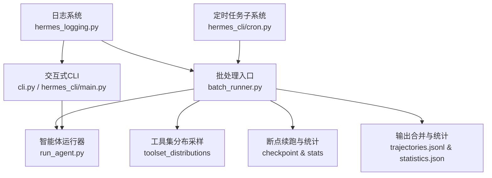
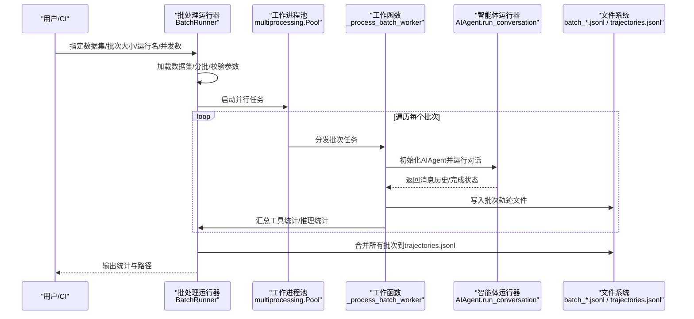
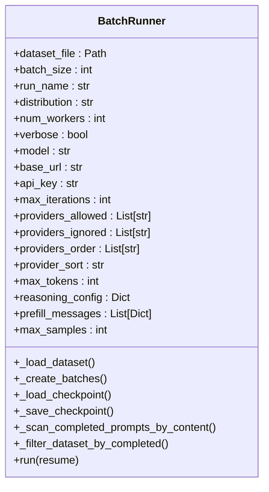
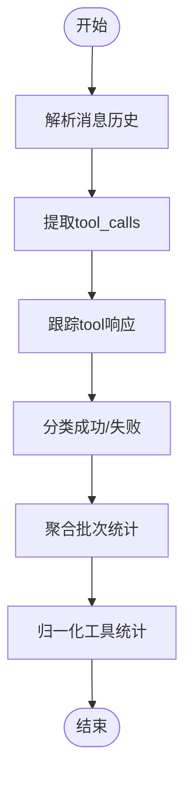
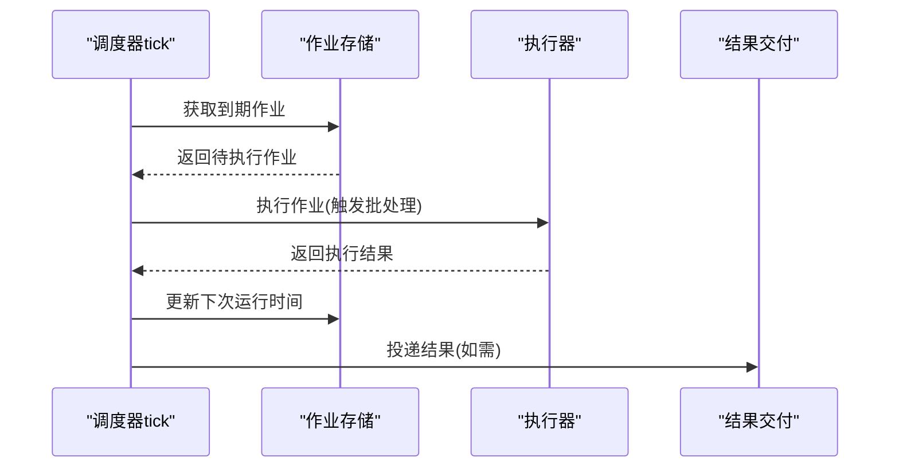
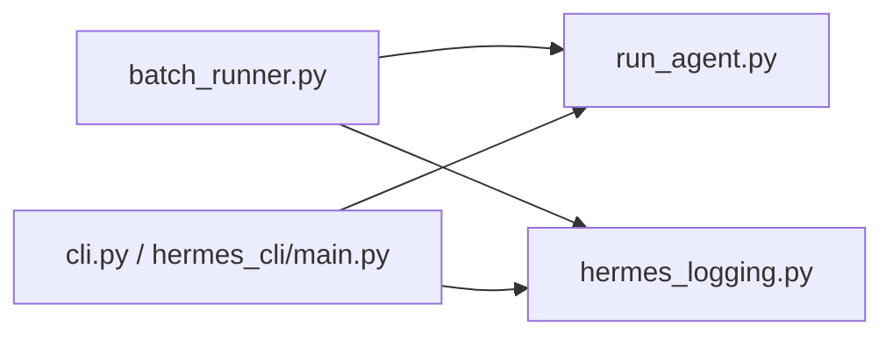

# 批处理模式

<cite>
**本文引用的文件**
- [batch_runner.py](file://batch_runner.py)
- [website/docs/user-guide/features/batch-processing.md](file://website/docs/user-guide/features/batch-processing.md)
- [cli.py](file://cli.py)
- [hermes_cli/main.py](file://hermes_cli/main.py)
- [hermes_constants.py](file://hermes_constants.py)
- [hermes_logging.py](file://hermes_logging.py)
- [run_agent.py](file://run_agent.py)
- [example_browser_tasks.jsonl](file://datagen-config-examples/example_browser_tasks.jsonl)
- [hermes_cli/cron.py](file://hermes_cli/cron.py)
- [tests/cron/test_scheduler.py](file://tests/cron/test_scheduler.py)
- [website/docs/developer-guide/cron-internals.md](file://website/docs/developer-guide/cron-internals.md)
</cite>

## 目录
1. [简介](#简介)
2. [项目结构](#项目结构)
3. [核心组件](#核心组件)
4. [架构总览](#架构总览)
5. [详细组件分析](#详细组件分析)
6. [依赖分析](#依赖分析)
7. [性能考虑](#性能考虑)
8. [故障排查指南](#故障排查指南)
9. [结论](#结论)
10. [附录](#附录)

## 简介
本文件系统性阐述 Hermes Agent 的批处理模式，面向需要在非交互环境中大规模运行智能体的用户与工程师。内容覆盖设计理念、使用场景、参数与输出控制、错误处理策略、与交互式模式的差异与转换机制、脚本化与 CI/CD 集成实践、性能优化与资源管理建议，以及调试与日志记录方法。批处理模式通过并行化、断点续跑、轨迹合并与统计聚合，实现稳定、可观测、可复现的大规模推理与工具调用生成。

## 项目结构
- 批处理入口与核心逻辑位于 batch_runner.py，负责数据集加载、分批、并行执行、断点续跑、轨迹合并与统计输出。
- 用户指南文档 website/docs/user-guide/features/batch-processing.md 提供了参数说明、输出格式、质量过滤与典型用例。
- CLI 与交互式模式由 cli.py 与 hermes_cli/main.py 提供，二者在非交互场景下可通过命令行参数或环境变量实现自动化。
- 日志系统由 hermes_logging.py 统一管理，支持多文件轮转与组件级路由，便于批处理运行时的诊断与审计。
- 运行时核心逻辑由 run_agent.py 提供，批处理模式通过 AIAgent 的会话接口进行对话与工具调用。
- 定时任务子系统 cron 提供周期性任务调度能力，可与批处理结合用于定时触发评估或数据生成。

**图表来源**
- [batch_runner.py:1-1291](file://batch_runner.py#L1-L1291)
- [cli.py:1-800](file://cli.py#L1-L800)
- [hermes_cli/main.py:1-800](file://hermes_cli/main.py#L1-L800)
- [run_agent.py:1811-1836](file://run_agent.py#L1811-L1836)
- [hermes_logging.py:156-261](file://hermes_logging.py#L156-L261)
- [hermes_cli/cron.py:253-290](file://hermes_cli/cron.py#L253-L290)

**章节来源**
- [batch_runner.py:1-1291](file://batch_runner.py#L1-L1291)
- [website/docs/user-guide/features/batch-processing.md:1-227](file://website/docs/user-guide/features/batch-processing.md#L1-L227)

## 核心组件
- 批处理运行器 BatchRunner：负责数据集加载、分批、并行工作进程调度、断点续跑、轨迹写入与统计聚合。
- 工具集分布采样：从预定义分布中随机采样工具集组合，确保训练数据多样性。
- 轨迹与统计：输出标准化轨迹（ShareGPT风格）、工具使用统计、推理覆盖率统计与失败样本过滤。
- 断点续跑：基于索引与内容匹配的恢复机制，支持跨运行合并输出。
- 日志与调试：统一日志文件、组件路由、调试级别输出与会话上下文标记。

**章节来源**
- [batch_runner.py:514-1291](file://batch_runner.py#L514-L1291)
- [website/docs/user-guide/features/batch-processing.md:93-183](file://website/docs/user-guide/features/batch-processing.md#L93-L183)

## 架构总览
批处理模式以“数据驱动 + 并行执行 + 结果聚合”的方式组织流程。每个提示独立运行一次完整会话，生成轨迹与统计；批量完成后合并为最终轨迹文件，并输出汇总统计。

**图表来源**
- [batch_runner.py:883-1057](file://batch_runner.py#L883-L1057)
- [batch_runner.py:388-511](file://batch_runner.py#L388-L511)
- [run_agent.py:1811-1836](file://run_agent.py#L1811-L1836)

## 详细组件分析

### 批处理运行器 BatchRunner
- 数据集加载与分批：读取 JSONL，校验字段，按 batch_size 切分为批次元组（索引, 条目）。
- 断点续跑：加载 checkpoint.json 与扫描 batch_*.jsonl 中已完成条目的内容，过滤重复后重分批。
- 并行执行：使用 multiprocessing.Pool 并发执行 _process_batch_worker，每个批次在独立进程中处理。
- 轨迹写入：每条成功结果写入 batch_{num}.jsonl，包含 conversations、metadata、tool_stats、tool_error_counts 等。
- 最终合并：遍历输出目录下所有 batch_*.jsonl，过滤无效/异常条目，合并为 trajectories.jsonl。
- 统计输出：计算工具使用率、推理覆盖率等，保存 statistics.json。

**图表来源**
- [batch_runner.py:514-870](file://batch_runner.py#L514-L870)

**章节来源**
- [batch_runner.py:627-870](file://batch_runner.py#L627-L870)
- [batch_runner.py:879-1057](file://batch_runner.py#L879-L1057)

### 工具集分布与采样
- 工具集分布：从 toolset_distributions 中采样工具集组合，保证至少启用一个工具集，提升数据多样性。
- 分布列表：支持列出可用分布并打印信息，便于选择合适的工具组合策略。

**章节来源**
- [batch_runner.py:1191-1204](file://batch_runner.py#L1191-L1204)

### 轨迹与统计提取
- 工具统计：从消息历史中解析 tool_calls 与 tool 响应，统计调用次数、成功/失败次数与成功率。
- 推理统计：统计包含推理标记的助手回合比例，过滤零推理样本。
- 归一化：对工具统计进行归一化，确保 Schema 一致，便于下游处理。

**图表来源**
- [batch_runner.py:114-230](file://batch_runner.py#L114-L230)

**章节来源**
- [batch_runner.py:114-230](file://batch_runner.py#L114-L230)

### 断点续跑与合并
- 增量检查点：每个批次完成后更新 checkpoint.json，记录已完成索引与批次统计。
- 内容匹配恢复：扫描已有 batch 文件，按实际提示文本匹配已完成项，避免索引漂移导致的重复执行。
- 最终合并：将所有 batch 文件合并为 trajectories.jsonl，并过滤异常条目。

**章节来源**
- [batch_runner.py:673-794](file://batch_runner.py#L673-L794)
- [batch_runner.py:995-1057](file://batch_runner.py#L995-L1057)

### 输出格式与质量过滤
- 输出目录：data/<run_name>/，包含 trajectories.jsonl、batch_*.jsonl、checkpoint.json、statistics.json。
- 轨迹格式：ShareGPT 风格 conversations，包含 from/value/tool_calls 等字段；metadata 包含批次号、时间戳与模型名；tool_stats 与 tool_error_counts 为归一化统计。
- 质量过滤：丢弃无推理回合的样本；合并阶段过滤无效工具名的条目。

**章节来源**
- [website/docs/user-guide/features/batch-processing.md:99-183](file://website/docs/user-guide/features/batch-processing.md#L99-L183)
- [batch_runner.py:1011-1040](file://batch_runner.py#L1011-L1040)

### 与交互式模式的差异与转换
- 交互式模式（cli.py/hermes_cli/main.py）强调人机实时对话、TUI 与即时反馈；批处理模式强调离线、并行、可审计与可复现。
- 参数桥接：交互式模式通过配置文件与环境变量注入终端后端、容器镜像、超时等参数；批处理模式通过 CLI 参数直接传入。
- 输出差异：交互式模式关注即时显示与会话上下文；批处理模式关注轨迹文件与统计报表。

**章节来源**
- [cli.py:192-536](file://cli.py#L192-L536)
- [hermes_cli/main.py:676-784](file://hermes_cli/main.py#L676-L784)

### 定时任务与批处理集成
- 定时任务子系统 cron 支持相对延迟、间隔、Cron 表达式与 ISO 时间戳等多种调度格式，适合周期性触发批处理任务。
- tick 流程：检测到期作业、推进下次运行时间、执行并交付结果，支持输出落盘与结果投递。

**图表来源**
- [website/docs/developer-guide/cron-internals.md:21-32](file://website/docs/developer-guide/cron-internals.md#L21-L32)
- [tests/cron/test_scheduler.py:1303-1316](file://tests/cron/test_scheduler.py#L1303-L1316)
- [hermes_cli/cron.py:253-290](file://hermes_cli/cron.py#L253-L290)

**章节来源**
- [website/docs/developer-guide/cron-internals.md:1-32](file://website/docs/developer-guide/cron-internals.md#L1-L32)
- [tests/cron/test_scheduler.py:1303-1316](file://tests/cron/test_scheduler.py#L1303-L1316)
- [hermes_cli/cron.py:253-290](file://hermes_cli/cron.py#L253-L290)

## 依赖分析
- 批处理运行器依赖 run_agent 的 AIAgent 会话接口，用于执行单轮对话与工具调用。
- 日志系统统一由 hermes_logging 提供，支持多文件轮转与组件路由，批处理与 CLI 共享同一套日志基础设施。
- CLI 与批处理共享配置加载与环境变量桥接机制，便于在非交互环境下通过环境变量与配置文件控制行为。

**图表来源**
- [batch_runner.py:38-44](file://batch_runner.py#L38-L44)
- [hermes_logging.py:156-261](file://hermes_logging.py#L156-L261)
- [cli.py:588-589](file://cli.py#L588-L589)

**章节来源**
- [batch_runner.py:38-44](file://batch_runner.py#L38-L44)
- [hermes_logging.py:156-261](file://hermes_logging.py#L156-L261)
- [cli.py:588-589](file://cli.py#L588-L589)

## 性能考虑
- 并发度与批大小：num_workers 控制并行进程数，batch_size 控制单次处理的提示数量；两者需根据模型 API 速率限制与本地资源平衡。
- 资源隔离：每条提示使用独立任务 ID 与沙箱环境，避免相互干扰；容器镜像可在每条提示上按需指定，满足特定基准环境需求。
- I/O 与磁盘：批次文件逐条写入，最终合并；建议在具备足够磁盘空间与带宽的环境中运行，避免 I/O 成为瓶颈。
- 日志级别：默认 INFO 级别，必要时开启 --verbose 或调用 setup_verbose_logging 以获得更详细的调试信息。

[本节为通用指导，无需具体文件分析]

## 故障排查指南
- 常见错误与提示
  - 缺少必需参数：未提供 dataset_file、batch_size 或 run_name 将直接报错并退出。
  - 分布名称无效：当 distribution 未知时，会提示可用分布列表并退出。
  - Docker 镜像不可用：若指定了 per-prompt 容器镜像且无法拉取，该提示会被丢弃并记录错误。
- 断点续跑
  - 若 checkpoint 写入失败，不影响整体运行，但可能影响恢复进度；建议定期检查 data/<run_name>/checkpoint.json。
  - 内容匹配恢复：即使数据集顺序变化，也能基于提示文本恢复，减少重复工作。
- 日志定位
  - 使用 hermes_logging 的统一日志文件（agent.log、errors.log），按组件前缀筛选；必要时开启调试级别输出。
  - 在 run_agent 中可抑制状态输出以保持机器可读，或在批处理模式下保留详细日志以便分析。

**章节来源**
- [batch_runner.py:1206-1286](file://batch_runner.py#L1206-L1286)
- [batch_runner.py:262-291](file://batch_runner.py#L262-L291)
- [hermes_logging.py:156-261](file://hermes_logging.py#L156-L261)
- [run_agent.py:1811-1836](file://run_agent.py#L1811-L1836)

## 结论
批处理模式通过并行化、断点续跑与标准化输出，为大规模推理与工具调用生成提供了稳定可靠的基础设施。配合定时任务与日志系统，可在非交互环境中高效完成训练数据生成、模型评估与基准测试等任务。建议在生产环境中合理设置并发度与批大小，利用断点续跑与内容匹配恢复机制，结合日志与统计输出进行持续优化与质量把控。

[本节为总结，无需具体文件分析]

## 附录

### 使用场景与示例
- 训练数据生成：使用默认分布与较高并发，生成多样化轨迹。
- 模型评估：固定模型与并发，对比不同提示集上的工具使用与推理覆盖率。
- 基准测试：为每条提示指定容器镜像与工作目录，确保环境一致性。

**章节来源**
- [website/docs/user-guide/features/batch-processing.md:185-227](file://website/docs/user-guide/features/batch-processing.md#L185-L227)
- [example_browser_tasks.jsonl:1-6](file://datagen-config-examples/example_browser_tasks.jsonl#L1-L6)

### 参数与输出速查
- 关键参数
  - dataset_file、batch_size、run_name、distribution、model、base_url、api_key、max_turns、num_workers、resume、verbose、max_samples、max_tokens、providers_allowed/ignored/order/sort、reasoning_effort/disable、ephemeral_system_prompt、log_prefix_chars、prefill_messages_file
- 输出文件
  - data/<run_name>/trajectories.jsonl、batch_*.jsonl、checkpoint.json、statistics.json

**章节来源**
- [website/docs/user-guide/features/batch-processing.md:51-92](file://website/docs/user-guide/features/batch-processing.md#L51-L92)
- [batch_runner.py:1116-1291](file://batch_runner.py#L1116-L1291)