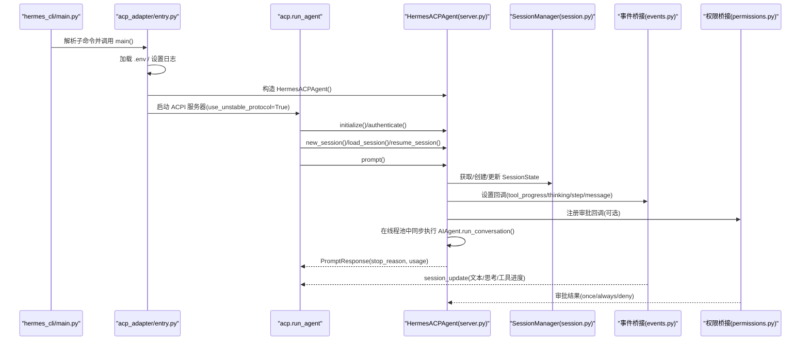
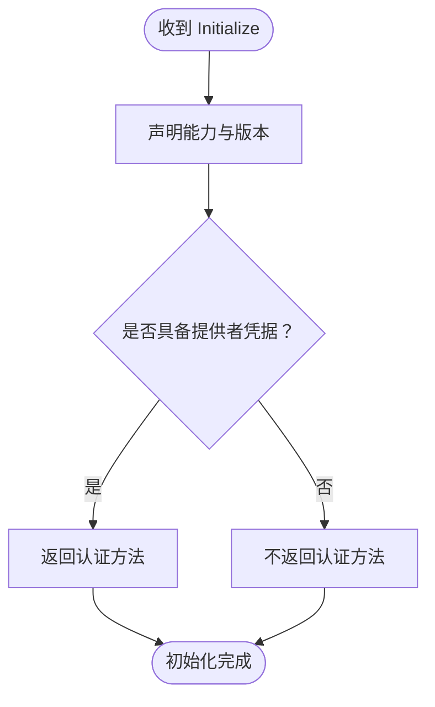
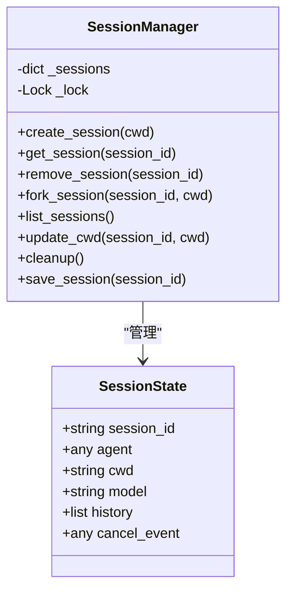
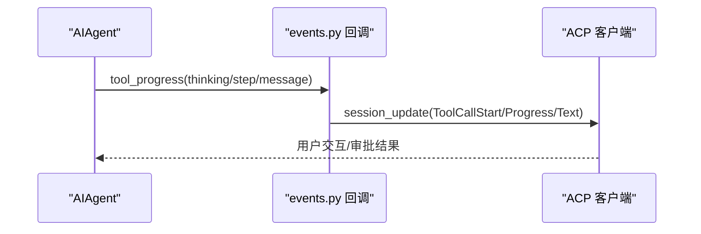
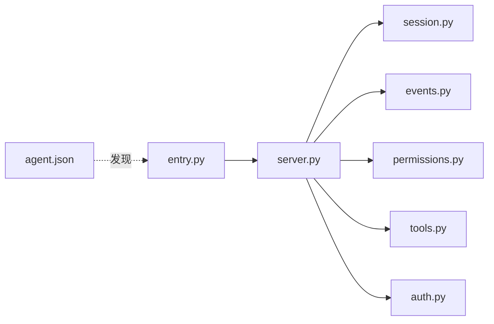

# ACPI 命令

<cite>
**本文引用的文件**
- [acp_adapter/__init__.py](file://acp_adapter/__init__.py)
- [acp_adapter/__main__.py](file://acp_adapter/__main__.py)
- [acp_adapter/entry.py](file://acp_adapter/entry.py)
- [acp_adapter/server.py](file://acp_adapter/server.py)
- [acp_adapter/session.py](file://acp_adapter/session.py)
- [acp_adapter/events.py](file://acp_adapter/events.py)
- [acp_adapter/permissions.py](file://acp_adapter/permissions.py)
- [acp_adapter/tools.py](file://acp_adapter/tools.py)
- [acp_adapter/auth.py](file://acp_adapter/auth.py)
- [acp_registry/agent.json](file://acp_registry/agent.json)
- [docs/acp-setup.md](file://docs/acp-setup.md)
- [website/docs/user-guide/features/acp.md](file://website/docs/user-guide/features/acp.md)
- [website/docs/developer-guide/acp-internals.md](file://website/docs/developer-guide/acp-internals.md)
- [hermes_cli/main.py](file://hermes_cli/main.py)
</cite>

## 目录
1. [简介](#简介)
2. [项目结构](#项目结构)
3. [核心组件](#核心组件)
4. [架构总览](#架构总览)
5. [详细组件分析](#详细组件分析)
6. [依赖关系分析](#依赖关系分析)
7. [性能考量](#性能考量)
8. [故障排除指南](#故障排除指南)
9. [结论](#结论)
10. [附录](#附录)

## 简介
本文件系统性阐述 Hermes Agent 的 ACPI（Agent Client Protocol）适配器与 hermes acp 命令，重点覆盖以下方面：
- ACPI 协议工作原理与消息流
- 服务器启动流程与客户端连接机制
- hermes acp 命令的参数与配置项
- ACPI 服务器的启动、停止、状态检查
- 编辑器集成（VS Code、Zed、JetBrains）配置与使用
- ACPI 协议规范要点、消息格式与错误处理
- 集成故障排除与性能优化建议

## 项目结构
ACPI 相关代码集中在 acp_adapter 包中，并通过 hermes_cli/main.py 暴露 hermes acp 子命令入口；注册表文件用于编辑器发现与启动。

```mermaid
graph TB
subgraph "ACPI 适配器"
A["entry.py<br/>启动与日志/环境加载"]
B["server.py<br/>HermesACPAgent 实现"]
C["session.py<br/>会话管理与持久化"]
D["events.py<br/>事件桥接"]
E["permissions.py<br/>权限请求桥接"]
F["tools.py<br/>工具调用映射与内容构建"]
G["auth.py<br/>认证提供者检测"]
end
subgraph "注册表"
R["agent.json<br/>命令型代理声明"]
end
subgraph "CLI"
CLI["hermes_cli/main.py<br/>子命令：acp"]
end
CLI --> A
A --> B
B --> C
B --> D
B --> E
B --> F
B --> G
R -. 发现/启动 .- CLI
```

**图表来源**
- [acp_adapter/entry.py:58-82](file://acp_adapter/entry.py#L58-L82)
- [acp_adapter/server.py:93-141](file://acp_adapter/server.py#L93-L141)
- [acp_adapter/session.py:70-112](file://acp_adapter/session.py#L70-L112)
- [acp_adapter/events.py:27-41](file://acp_adapter/events.py#L27-L41)
- [acp_adapter/permissions.py:26-77](file://acp_adapter/permissions.py#L26-L77)
- [acp_adapter/tools.py:53-61](file://acp_adapter/tools.py#L53-L61)
- [acp_adapter/auth.py:8-24](file://acp_adapter/auth.py#L8-L24)
- [acp_registry/agent.json:1-13](file://acp_registry/agent.json#L1-L13)
- [hermes_cli/main.py:6275-6291](file://hermes_cli/main.py#L6275-L6291)

**章节来源**
- [acp_adapter/entry.py:1-86](file://acp_adapter/entry.py#L1-L86)
- [acp_adapter/server.py:1-141](file://acp_adapter/server.py#L1-L141)
- [acp_adapter/session.py:1-91](file://acp_adapter/session.py#L1-L91)
- [acp_adapter/events.py:1-25](file://acp_adapter/events.py#L1-L25)
- [acp_adapter/permissions.py:1-24](file://acp_adapter/permissions.py#L1-L24)
- [acp_adapter/tools.py:1-20](file://acp_adapter/tools.py#L1-L20)
- [acp_adapter/auth.py:1-25](file://acp_adapter/auth.py#L1-L25)
- [acp_registry/agent.json:1-13](file://acp_registry/agent.json#L1-L13)
- [hermes_cli/main.py:6275-6291](file://hermes_cli/main.py#L6275-L6291)

## 核心组件
- 启动入口与运行时
  - hermes_cli/main.py 提供子命令“acp”，内部委托给 acp_adapter/entry.py 的 main()。
  - entry.py 负责加载环境变量、设置日志输出到 stderr、构造 HermesACPAgent 并调用 acp.run_agent 启动服务。
- 协议适配器
  - server.py 实现 HermesACPAgent，覆盖 ACPI 生命周期（initialize/authenticate）、会话管理（new/load/resume/fork/list/cancel）、提示执行（prompt）与模型/模式切换、可用命令通告等。
- 会话管理
  - session.py 维护内存会话表与持久化（~/.hermes/state.db），支持创建、恢复、fork、列表、清理与工作目录绑定。
- 事件桥接
  - events.py 将 AIAgent 的回调（思考、步骤、工具进度、消息）转换为 ACP session_update 通知，并通过线程安全方式投递。
- 权限桥接
  - permissions.py 将危险操作审批请求映射为 ACP request_permission 请求，并返回 Hermes 可识别的结果字符串。
- 工具映射
  - tools.py 将 Hermes 工具名映射到 ACP ToolKind，并生成工具调用标题与内容块。
- 认证辅助
  - auth.py 检测当前运行时提供者，用于 initialize 时声明可选认证方法。
- 注册表
  - agent.json 描述命令型代理，声明 hermes acp 启动方式，供编辑器发现与启动。

**章节来源**
- [hermes_cli/main.py:6275-6291](file://hermes_cli/main.py#L6275-L6291)
- [acp_adapter/entry.py:58-82](file://acp_adapter/entry.py#L58-L82)
- [acp_adapter/server.py:93-141](file://acp_adapter/server.py#L93-L141)
- [acp_adapter/session.py:70-112](file://acp_adapter/session.py#L70-L112)
- [acp_adapter/events.py:27-41](file://acp_adapter/events.py#L27-L41)
- [acp_adapter/permissions.py:26-77](file://acp_adapter/permissions.py#L26-L77)
- [acp_adapter/tools.py:53-61](file://acp_adapter/tools.py#L53-L61)
- [acp_adapter/auth.py:8-24](file://acp_adapter/auth.py#L8-L24)
- [acp_registry/agent.json:7-12](file://acp_registry/agent.json#L7-L12)

## 架构总览
下图展示从 hermes acp 到 ACP 服务器、会话管理与事件桥接的整体流程。



**图表来源**
- [hermes_cli/main.py:6275-6291](file://hermes_cli/main.py#L6275-L6291)
- [acp_adapter/entry.py:58-82](file://acp_adapter/entry.py#L58-L82)
- [acp_adapter/server.py:217-257](file://acp_adapter/server.py#L217-L257)
- [acp_adapter/session.py:114-125](file://acp_adapter/session.py#L114-L125)
- [acp_adapter/events.py:47-90](file://acp_adapter/events.py#L47-L90)
- [acp_adapter/permissions.py:43-76](file://acp_adapter/permissions.py#L43-L76)

## 详细组件分析

### hermes acp 命令与启动流程
- 子命令定义
  - hermes_cli/main.py 中定义“acp”子命令，帮助信息与描述明确指出“以 ACP（Agent Client Protocol）服务器形式运行 Hermes Agent，用于编辑器集成（VS Code、Zed、JetBrains）”。
  - 执行时导入 acp_adapter.entry.main() 并运行。
- 启动细节
  - entry.py 负责：
    - 日志：将根日志处理器重定向至 stderr，确保 stdout 专用于 ACP JSON-RPC。
    - 环境：从 HERMES_HOME（默认 ~/.hermes）加载 .env 文件。
    - 运行：构造 HermesACPAgent 并调用 acp.run_agent(use_unstable_protocol=True)。
  - server.py 初始化阶段：
    - initialize 返回协议版本、代理信息与能力（会话 fork/list/resume 能力、加载会话能力等）。
    - authenticate 若检测到有效提供者凭据则返回认证成功响应。
- 停止与异常
  - 捕获 KeyboardInterrupt 正常退出；捕获异常记录崩溃日志并以非零退出码结束。

**章节来源**
- [hermes_cli/main.py:6275-6291](file://hermes_cli/main.py#L6275-L6291)
- [acp_adapter/entry.py:23-56](file://acp_adapter/entry.py#L23-L56)
- [acp_adapter/entry.py:58-82](file://acp_adapter/entry.py#L58-L82)
- [acp_adapter/server.py:217-257](file://acp_adapter/server.py#L217-L257)
- [acp_adapter/auth.py:8-24](file://acp_adapter/auth.py#L8-L24)

### ACPI 协议工作原理与消息格式
- 协议版本与能力
  - initialize 返回的协议版本遵循 acp.PROTOCOL_VERSION；声明 agent_capabilities 与会话能力（fork/list/resume）。
- 会话生命周期
  - new_session：创建新会话并注册会话级 MCP 服务器（如存在），随后异步通告可用命令。
  - load_session/resume_session：恢复或续用现有会话，必要时创建新会话并刷新工具面。
  - list_sessions：合并内存与数据库中的会话信息。
  - cancel：设置取消事件并尝试中断底层 AIAgent。
- 提示执行与事件流
  - prompt：解析用户文本，拦截斜杠命令（如 /help、/model、/tools、/context、/reset、/compact、/version），否则交由 AIAgent 执行。
  - 回调桥接：将工具进度、思考片段、步骤完成、消息文本等转换为 session_update。
  - 使用统计：根据返回结果构造 Usage 对象（输入/输出/总令牌、推理令牌、缓存读取等）。
- 模型与模式切换
  - set_session_model：按会话切换模型并重建 AIAgent。
  - set_session_mode：持久化编辑器请求的模式标识。
  - set_config_option：接受配置项更新（当前作为占位存储）。



**图表来源**
- [acp_adapter/server.py:217-257](file://acp_adapter/server.py#L217-L257)
- [acp_adapter/auth.py:8-24](file://acp_adapter/auth.py#L8-L24)

**章节来源**
- [acp_adapter/server.py:266-356](file://acp_adapter/server.py#L266-L356)
- [acp_adapter/server.py:352-467](file://acp_adapter/server.py#L352-L467)
- [acp_adapter/server.py:675-729](file://acp_adapter/server.py#L675-L729)

### 会话管理与持久化
- 内存与数据库
  - SessionManager 维护内存会话字典与互斥锁；会话元数据（cwd、model、history、cancel_event）保存至 ~/.hermes/state.db。
  - 支持 create/get/remove/fork/list/cleanup/update_cwd 等操作。
- 工作目录绑定
  - 通过工具注册将任务 ID 与 cwd 绑定，确保文件/终端工具在编辑器工作区上下文中执行。
- 恢复逻辑
  - 若内存未命中，尝试从数据库恢复 ACP 源会话，重建 AIAgent 并注入历史。



**图表来源**
- [acp_adapter/session.py:58-68](file://acp_adapter/session.py#L58-L68)
- [acp_adapter/session.py:70-112](file://acp_adapter/session.py#L70-L112)
- [acp_adapter/session.py:333-405](file://acp_adapter/session.py#L333-L405)

**章节来源**
- [acp_adapter/session.py:70-112](file://acp_adapter/session.py#L70-L112)
- [acp_adapter/session.py:114-125](file://acp_adapter/session.py#L114-L125)
- [acp_adapter/session.py:136-163](file://acp_adapter/session.py#L136-L163)
- [acp_adapter/session.py:165-206](file://acp_adapter/session.py#L165-L206)
- [acp_adapter/session.py:208-216](file://acp_adapter/session.py#L208-L216)
- [acp_adapter/session.py:218-237](file://acp_adapter/session.py#L218-L237)
- [acp_adapter/session.py:238-248](file://acp_adapter/session.py#L238-L248)
- [acp_adapter/session.py:273-332](file://acp_adapter/session.py#L273-L332)
- [acp_adapter/session.py:333-405](file://acp_adapter/session.py#L333-L405)

### 事件桥接与工具调用映射
- 事件桥接
  - events.py 提供 make_tool_progress_cb、make_thinking_cb、make_step_cb、make_message_cb，将 AIAgent 回调转换为 ACP session_update。
  - 使用 asyncio.run_coroutine_threadsafe 保证主线程事件循环与工作线程之间的安全投递。
- 权限桥接
  - permissions.py 将 ACP request_permission 映射为 Hermes 审批回调，支持“允许一次/总是”、“拒绝一次”等选项，并在超时或失败时自动拒绝。
- 工具映射
  - tools.py 将 Hermes 工具名映射到 ACP ToolKind（如 read/edit/execute/fetch/search 等），并生成人类可读标题与内容块（含差异/文本/补丁等）。



**图表来源**
- [acp_adapter/events.py:47-90](file://acp_adapter/events.py#L47-L90)
- [acp_adapter/events.py:97-110](file://acp_adapter/events.py#L97-L110)
- [acp_adapter/events.py:117-155](file://acp_adapter/events.py#L117-L155)
- [acp_adapter/events.py:162-175](file://acp_adapter/events.py#L162-L175)
- [acp_adapter/permissions.py:43-76](file://acp_adapter/permissions.py#L43-L76)
- [acp_adapter/tools.py:104-174](file://acp_adapter/tools.py#L104-L174)

**章节来源**
- [acp_adapter/events.py:27-41](file://acp_adapter/events.py#L27-L41)
- [acp_adapter/events.py:47-90](file://acp_adapter/events.py#L47-L90)
- [acp_adapter/events.py:97-110](file://acp_adapter/events.py#L97-L110)
- [acp_adapter/events.py:117-155](file://acp_adapter/events.py#L117-L155)
- [acp_adapter/events.py:162-175](file://acp_adapter/events.py#L162-L175)
- [acp_adapter/permissions.py:26-77](file://acp_adapter/permissions.py#L26-L77)
- [acp_adapter/tools.py:53-61](file://acp_adapter/tools.py#L53-L61)
- [acp_adapter/tools.py:104-174](file://acp_adapter/tools.py#L104-L174)
- [acp_adapter/tools.py:177-197](file://acp_adapter/tools.py#L177-L197)
- [acp_adapter/tools.py:205-215](file://acp_adapter/tools.py#L205-L215)

### 编辑器集成与注册表
- 注册表
  - agent.json 声明类型为“command”，启动命令为 hermes acp，供编辑器插件/扩展发现与启动。
- VS Code/Zed/JetBrains
  - docs/acp-setup.md 与 website 文档提供了三类编辑器的安装与配置步骤，包括：
    - VS Code：安装 ACP Client 扩展，配置 settings.json 指向 acp_registry 目录。
    - Zed：在 settings.json 中添加 agent_servers，指向 hermes acp。
    - JetBrains：安装 ACP 插件，配置代理注册目录为 acp_registry。
- 配置与凭据
  - ACP 模式使用与 CLI 相同的配置路径：~/.hermes/.env、~/.hermes/config.yaml、~/.hermes/skills/、~/.hermes/state.db。
  - provider 解析沿用 Hermes 运行时解析器，因此 ACP 继承当前配置的提供者与凭据。

**章节来源**
- [acp_registry/agent.json:1-13](file://acp_registry/agent.json#L1-L13)
- [docs/acp-setup.md:16-64](file://docs/acp-setup.md#L16-L64)
- [docs/acp-setup.md:68-91](file://docs/acp-setup.md#L68-L91)
- [docs/acp-setup.md:95-114](file://docs/acp-setup.md#L95-L114)
- [docs/acp-setup.md:146-171](file://docs/acp-setup.md#L146-L171)
- [website/docs/user-guide/features/acp.md:34-64](file://website/docs/user-guide/features/acp.md#L34-L64)
- [website/docs/user-guide/features/acp.md:66-108](file://website/docs/user-guide/features/acp.md#L66-L108)
- [website/docs/user-guide/features/acp.md:109-122](file://website/docs/user-guide/features/acp.md#L109-L122)
- [website/docs/user-guide/features/acp.md:123-133](file://website/docs/user-guide/features/acp.md#L123-L133)

## 依赖关系分析
- 组件耦合
  - server.py 依赖 session.py（会话管理）、events.py（事件桥接）、permissions.py（权限桥接）、tools.py（工具映射）、auth.py（认证检测）。
  - entry.py 仅负责启动与运行时准备，耦合度低。
  - agent.json 仅用于编辑器发现，不直接参与运行时逻辑。
- 外部依赖
  - acp.run_agent 提供 ACPI 服务器框架；HermesACPAgent 继承自 acp.Agent。
  - AIAgent 作为同步执行体，通过线程池并发运行，避免阻塞事件循环。



**图表来源**
- [acp_adapter/entry.py:58-82](file://acp_adapter/entry.py#L58-L82)
- [acp_adapter/server.py:52-60](file://acp_adapter/server.py#L52-L60)
- [acp_registry/agent.json:7-12](file://acp_registry/agent.json#L7-L12)

**章节来源**
- [acp_adapter/server.py:52-60](file://acp_adapter/server.py#L52-L60)
- [acp_adapter/entry.py:58-82](file://acp_adapter/entry.py#L58-L82)
- [acp_registry/agent.json:7-12](file://acp_registry/agent.json#L7-L12)

## 性能考量
- 线程池与并发
  - server.py 使用 ThreadPoolExecutor 并发执行同步 AIAgent.run_conversation，避免阻塞 asyncio 事件循环。
- 流式输出
  - 事件桥接采用 fire-and-forget 异步推送，配合线程安全队列，提升实时性。
- 日志与 I/O
  - 日志统一输出到 stderr，stdout 保留为 ACP JSON-RPC 通道，减少 I/O 抖动。
- 会话持久化
  - 会话历史与元数据持久化至 SQLite，重启后可快速恢复，降低冷启动成本。

**章节来源**
- [acp_adapter/server.py:69-70](file://acp_adapter/server.py#L69-L70)
- [acp_adapter/server.py:421-444](file://acp_adapter/server.py#L421-L444)
- [acp_adapter/events.py:27-41](file://acp_adapter/events.py#L27-L41)
- [acp_adapter/entry.py:23-41](file://acp_adapter/entry.py#L23-L41)
- [acp_adapter/session.py:273-332](file://acp_adapter/session.py#L273-L332)

## 故障排除指南
- 编辑器中看不到 ACP Agent
  - 检查编辑器 settings.json 是否正确指向 acp_registry 目录。
  - 确认 hermes 在 PATH 中，或在编辑器中显式配置 hermes 命令。
  - 重新启动编辑器使变更生效。
- 启动后立即报错
  - 运行 hermes doctor 与 hermes status 检查配置与凭据。
  - 直接运行 hermes acp 查看 stderr 输出定位问题。
- “模块未找到”
  - 安装 ACP 额外依赖：pip install -e ".[acp]"。
- 响应缓慢
  - 检查网络与提供方状态；部分提供方有速率限制，可切换模型/提供方。
- 终端命令被拒绝
  - 检查编辑器 ACP Client 扩展的审批策略（自动/手动）。
- 日志查看
  - VS Code：Output 面板选择 ACP Client 或 Hermes Agent。
  - Zed：View → Toggle Terminal 查看进程输出。
  - JetBrains：Event Log 或 ACP 工具窗口。
  - 可通过设置 HERMES_LOG_LEVEL=DEBUG 提升日志级别。

**章节来源**
- [docs/acp-setup.md:174-221](file://docs/acp-setup.md#L174-L221)
- [website/docs/user-guide/features/acp.md:162-180](file://website/docs/user-guide/features/acp.md#L162-L180)

## 结论
ACPI 适配器通过清晰的启动流程、严格的会话管理与事件桥接，实现了 Hermes Agent 与编辑器的无缝集成。hermes acp 命令提供了一键启动 ACP 服务器的能力，结合注册表与编辑器扩展，可快速构建本地化的智能编码助手。遵循本文的配置与排障建议，可在不同编辑器环境中稳定运行并获得良好的交互体验。

## 附录

### hermes acp 命令参数与配置
- 子命令
  - hermes acp：以 ACP 服务器模式启动 Hermes Agent。
- 环境与配置
  - 环境变量：~/.hermes/.env（包含 API Key 与提供者配置）。
  - 配置文件：~/.hermes/config.yaml（模型、提供者、技能等）。
  - 日志：输出到 stderr，stdout 保留为 ACP JSON-RPC。
- 启动方式对比
  - hermes acp
  - hermes-acp
  - python -m acp_adapter

**章节来源**
- [hermes_cli/main.py:6275-6291](file://hermes_cli/main.py#L6275-L6291)
- [acp_adapter/entry.py:23-41](file://acp_adapter/entry.py#L23-L41)
- [docs/acp-setup.md:16-21](file://docs/acp-setup.md#L16-L21)
- [website/docs/user-guide/features/acp.md:48-64](file://website/docs/user-guide/features/acp.md#L48-L64)