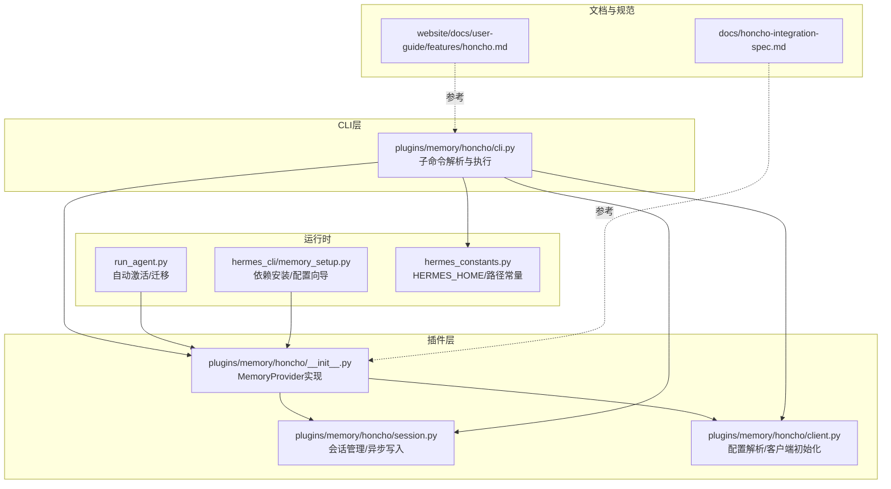
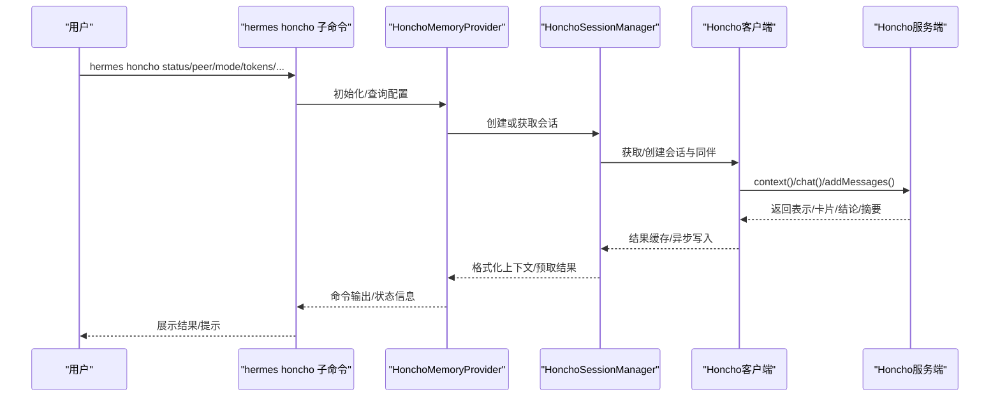
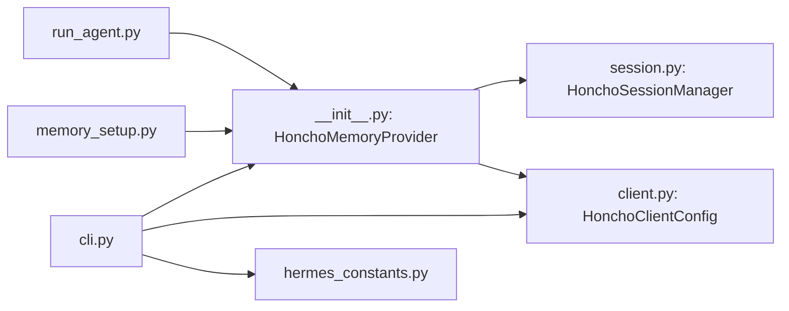

# Honcho命令

<cite>
**本文引用的文件**
- [cli.py](file://plugins/memory/honcho/cli.py)
- [__init__.py](file://plugins/memory/honcho/__init__.py)
- [client.py](file://plugins/memory/honcho/client.py)
- [session.py](file://plugins/memory/honcho/session.py)
- [memory_setup.py](file://hermes_cli/memory_setup.py)
- [run_agent.py](file://run_agent.py)
- [hermes_constants.py](file://hermes_constants.py)
- [honcho.md](file://website/docs/user-guide/features/honcho.md)
- [honcho-integration-spec.md](file://docs/honcho-integration-spec.md)
- [test_cli.py](file://tests/honcho_plugin/test_cli.py)
- [test_client.py](file://tests/honcho_plugin/test_client.py)
- [test_honcho_client_config.py](file://tests/test_honcho_client_config.py)
- [doctor.py](file://hermes_cli/doctor.py)
</cite>

## 目录
1. [简介](#简介)
2. [项目结构](#项目结构)
3. [核心组件](#核心组件)
4. [架构总览](#架构总览)
5. [详细组件分析](#详细组件分析)
6. [依赖关系分析](#依赖关系分析)
7. [性能考量](#性能考量)
8. [故障排除指南](#故障排除指南)
9. [结论](#结论)
10. [附录](#附录)

## 简介
本文件系统化阐述 Hermes Agent 中 Honcho AI 记忆集成命令与工作机制，覆盖命令体系（setup、status、sessions、map、peer、mode、tokens、identity、migrate、enable、disable、sync）、配置流程、身份管理、会话映射、同伴设置、令牌预算、迁移指南、协议与API交互、数据同步策略以及常见问题排查与最佳实践。目标是帮助用户从零开始完成 Honcho 集成，理解其工作原理，并在生产环境中稳定运行。

## 项目结构
围绕 Honcho 的 CLI 命令与插件实现，主要涉及以下模块：
- 插件入口与工具定义：plugins/memory/honcho/__init__.py
- CLI 子命令解析与执行：plugins/memory/honcho/cli.py
- 客户端配置与初始化：plugins/memory/honcho/client.py
- 会话管理与异步写入：plugins/memory/honcho/session.py
- 内存提供者选择与安装依赖：hermes_cli/memory_setup.py
- 运行时自动激活与迁移：run_agent.py
- 常量与路径：hermes_constants.py
- 用户文档与规范：website/docs/user-guide/features/honcho.md、docs/honcho-integration-spec.md
- 测试与诊断：tests/honcho_plugin/*、hermes_cli/doctor.py

图表来源
- [cli.py:1301-1398](file://plugins/memory/honcho/cli.py#L1301-L1398)
- [__init__.py:186-287](file://plugins/memory/honcho/__init__.py#L186-L287)
- [client.py:34-76](file://plugins/memory/honcho/client.py#L34-L76)
- [session.py:68-142](file://plugins/memory/honcho/session.py#L68-L142)
- [memory_setup.py:185-200](file://hermes_cli/memory_setup.py#L185-L200)
- [run_agent.py:1229-1259](file://run_agent.py#L1229-L1259)
- [hermes_constants.py:11-17](file://hermes_constants.py#L11-L17)

章节来源
- [cli.py:1-1399](file://plugins/memory/honcho/cli.py#L1-L1399)
- [__init__.py:1-1055](file://plugins/memory/honcho/__init__.py#L1-L1055)
- [client.py:1-677](file://plugins/memory/honcho/client.py#L1-L677)
- [session.py:1-1256](file://plugins/memory/honcho/session.py#L1-L1256)
- [memory_setup.py:1-458](file://hermes_cli/memory_setup.py#L1-L458)
- [run_agent.py:1229-1259](file://run_agent.py#L1229-L1259)
- [hermes_constants.py:1-295](file://hermes_constants.py#L1-L295)

## 核心组件
- MemoryProvider 实现：提供工具模式、上下文注入、预取与异步写入、会话初始化与懒加载、迁移与预热等能力。
- CLI 子命令：统一入口 hermes honcho，支持 setup/status/sessions/map/peer/mode/tokens/identity/migrate/enable/disable/sync。
- 客户端配置：支持多源配置解析（本地 honcho.json、全局 ~/.honcho/config.json、环境变量），并可被 Hermes 主配置覆盖。
- 会话管理：维护会话缓存、异步写队列、观察模式、消息分片与最大字符限制、预取上下文与对话式推理。

章节来源
- [__init__.py:186-504](file://plugins/memory/honcho/__init__.py#L186-L504)
- [cli.py:1260-1398](file://plugins/memory/honcho/cli.py#L1260-L1398)
- [client.py:34-76](file://plugins/memory/honcho/client.py#L34-L76)
- [session.py:68-142](file://plugins/memory/honcho/session.py#L68-L142)

## 架构总览
下图展示 Honcho 在 Hermes 中的整体调用链：CLI 解析 → MemoryProvider 初始化 → 会话管理器 → Honcho SDK 客户端 → 服务器端存储与推理。

图表来源
- [cli.py:577-655](file://plugins/memory/honcho/cli.py#L577-L655)
- [__init__.py:264-402](file://plugins/memory/honcho/__init__.py#L264-L402)
- [session.py:164-200](file://plugins/memory/honcho/session.py#L164-L200)
- [client.py:613-637](file://plugins/memory/honcho/client.py#L613-L637)

## 详细组件分析

### CLI 子命令体系与参数
- setup：通过内存提供者向导启动 Honcho 配置，写入 $HERMES_HOME/honcho.json 并自动设置 memory.provider。
- status：显示当前配置、连接状态、会话键、观察模式、写频率、召回模式、上下文预算、对话式推理节律等。
- peers：跨 profile 展示用户同伴与 AI 同伴名称。
- sessions：列出目录到会话名的映射。
- map：将当前目录映射到指定会话名；不带参数时列出映射。
- peer：更新用户同伴与 AI 同伴名称，支持动态推理级别。
- mode：切换 recall 模式（hybrid/context/tools）。
- strategy：设置会话策略（per-session/per-directory/per-repo/global）。
- tokens：设置上下文注入的 token 预算与对话式推理的最大字符数。
- identity：从文件（如 SOUL.md/IDENTITY.md）播种 AI 同伴身份，或显示当前 AI 表示。
- migrate：OpenClaw 到 Hermes 的迁移指引。
- enable/disable：启用/禁用当前 profile 的 Honcho。
- sync：将默认主机块克隆到所有现有 profile。
- 其他：--target-profile 可在不切换活动 profile 的情况下查看/修改特定 profile 的 Honcho 配置。

章节来源
- [cli.py:1260-1398](file://plugins/memory/honcho/cli.py#L1260-L1398)
- [cli.py:1301-1398](file://plugins/memory/honcho/cli.py#L1301-L1398)
- [honcho.md:157-170](file://website/docs/user-guide/features/honcho.md#L157-L170)

### 配置解析与优先级
- 配置文件解析顺序：$HERMES_HOME/honcho.json（实例本地）→ ~/.hermes/honcho.json（默认主机块）→ ~/.honcho/config.json（全局互操作）→ 环境变量。
- 主机键派生：HERMES_HONCHO_HOST 环境变量优先；否则基于活动 profile 名称生成 hermes.<profile>；默认为 hermes。
- 关键字段与默认值：apiKey、baseUrl、workspaceId、peerName、aiPeer、observationMode、contextTokens、dialecticCadence、recallMode、writeFrequency、saveMessages、sessionStrategy 等。
- 环境变量：HONCHO_API_KEY、HONCHO_BASE_URL、HONCHO_ENVIRONMENT、HONCHO_TIMEOUT。

章节来源
- [client.py:34-76](file://plugins/memory/honcho/client.py#L34-L76)
- [client.py:310-324](file://plugins/memory/honcho/client.py#L310-L324)
- [client.py:287-307](file://plugins/memory/honcho/client.py#L287-L307)
- [client.py:613-637](file://plugins/memory/honcho/client.py#L613-L637)
- [test_client.py:45-84](file://tests/honcho_plugin/test_client.py#L45-L84)
- [test_honcho_client_config.py:39-105](file://tests/test_honcho_client_config.py#L39-L105)

### 身份管理与同伴设置
- 用户同伴（peerName）与 AI 同伴（aiPeer）：可通过 peer 子命令更新；AI 同伴在首次会话创建时由 SDK 自动确保存在。
- 观察模式：directional（全部开启）与 unified（共享池）。支持 granular 对象配置以控制每个同伴的 observe_me/observe_others。
- AI 同伴身份播种：通过 identity 子命令从文件内容播种到 AI 同伴表示中，使其在后续对话中形成自我模型。
- 多代理隔离：不同 profile 使用不同的主机块，AI 同伴名采用裸 profile 名避免点号导致的 ID 限制。

章节来源
- [cli.py:783-840](file://plugins/memory/honcho/cli.py#L783-L840)
- [cli.py:997-1024](file://plugins/memory/honcho/cli.py#L997-L1024)
- [session.py:164-200](file://plugins/memory/honcho/session.py#L164-L200)
- [client.py:183-200](file://plugins/memory/honcho/client.py#L183-L200)

### 会话映射与策略
- per-session：每次运行新建会话，适合新用户或短期任务。
- per-directory：按工作目录复用会话，上下文随目录持久累积。
- per-repo：按 Git 仓库维度复用会话。
- global：全目录共享单一会话。
- map 子命令用于将当前目录映射到自定义会话名；也可通过 sessions 查看映射列表。

章节来源
- [cli.py:739-781](file://plugins/memory/honcho/cli.py#L739-L781)
- [cli.py:758-781](file://plugins/memory/honcho/cli.py#L758-L781)
- [__init__.py:357-369](file://plugins/memory/honcho/__init__.py#L357-L369)

### 令牌预算与推理深度
- 上下文注入预算：contextTokens 控制每轮注入的 token 数量，超出按词边界截断。
- 对话式推理预算：dialecticMaxChars 控制注入系统提示中的推理结果长度。
- 推理深度：dialecticDepth（1–3）与 per-pass reasoning 级别（dialecticDepthLevels）组合，支持冷/暖提示与多轮合成。
- 动态推理级别：根据消息长度动态提升推理级别，但不超过 high 或显式上限。

章节来源
- [__init__.py:614-627](file://plugins/memory/honcho/__init__.py#L614-L627)
- [__init__.py:695-708](file://plugins/memory/honcho/__init__.py#L695-L708)
- [__init__.py:709-747](file://plugins/memory/honcho/__init__.py#L709-L747)
- [honcho.md:97-143](file://website/docs/user-guide/features/honcho.md#L97-L143)

### 工具与系统提示注入
- 工具集合：honcho_profile、honcho_search、honcho_context、honcho_reasoning、honcho_conclude。
- 系统提示注入：在 hybrid/context 模式下，自动注入“会话摘要 + 用户表示 + 用户同伴卡 + AI 自我表示 + AI 身份卡”，并在 tools 模式下提供工具可用性说明。
- CLI 命令注入：当 Honcho 激活时，在系统提示中注入简短的管理命令清单，便于用户直接调用。

章节来源
- [__init__.py:34-176](file://plugins/memory/honcho/__init__.py#L34-L176)
- [__init__.py:458-504](file://plugins/memory/honcho/__init__.py#L458-L504)
- [honcho.md:145-156](file://website/docs/user-guide/features/honcho.md#L145-L156)
- [honcho-integration-spec.md:310-331](file://docs/honcho-integration-spec.md#L310-L331)

### 异步预取与写入
- 零延迟响应路径：turn 结束后后台线程触发 context 与 dialectic 预取，下一回合从缓存读取，避免每次轮次阻塞。
- 写入频率：async（后台队列）、turn（每轮同步）、session（仅会话结束批量）、N（每 N 轮）。
- 消息分片：超过 messageMaxChars 的消息会被分片发送；对话式推理输入受 dialecticMaxInputChars 限制。

章节来源
- [__init__.py:506-675](file://plugins/memory/honcho/__init__.py#L506-L675)
- [session.py:131-142](file://plugins/memory/honcho/session.py#L131-L142)
- [session.py:124-129](file://plugins/memory/honcho/session.py#L124-L129)

### 迁移与自动激活
- 自动激活：若 Honcho 曾启用且具备凭据，但未设置 memory.provider，则自动设为 honcho 并持久化配置。
- 迁移指南：提供从 openclaw-honcho 到 Hermes Honcho 的步骤，保留服务端数据与配置。

章节来源
- [run_agent.py:1229-1259](file://run_agent.py#L1229-L1259)
- [cli.py:1026-1060](file://plugins/memory/honcho/cli.py#L1026-L1060)
- [honcho.md:172-181](file://website/docs/user-guide/features/honcho.md#L172-L181)

## 依赖关系分析
- CLI 依赖 MemoryProvider 提供的配置与工具能力；MemoryProvider 依赖会话管理器与客户端配置。
- 客户端配置支持多源合并，优先级明确；会话管理器负责与 SDK 的交互与缓存。
- 运行时通过 run_agent 自动检测并激活 Honcho；memory_setup 负责依赖安装与交互式配置。

图表来源
- [cli.py:1-1399](file://plugins/memory/honcho/cli.py#L1-L1399)
- [__init__.py:186-287](file://plugins/memory/honcho/__init__.py#L186-L287)
- [session.py:68-142](file://plugins/memory/honcho/session.py#L68-L142)
- [client.py:34-76](file://plugins/memory/honcho/client.py#L34-L76)
- [run_agent.py:1229-1259](file://run_agent.py#L1229-L1259)
- [memory_setup.py:185-200](file://hermes_cli/memory_setup.py#L185-L200)
- [hermes_constants.py:11-17](file://hermes_constants.py#L11-L17)

章节来源
- [cli.py:1-1399](file://plugins/memory/honcho/cli.py#L1-L1399)
- [__init__.py:1-1055](file://plugins/memory/honcho/__init__.py#L1-L1055)
- [client.py:1-677](file://plugins/memory/honcho/client.py#L1-L677)
- [session.py:1-1256](file://plugins/memory/honcho/session.py#L1-L1256)
- [run_agent.py:1229-1259](file://run_agent.py#L1229-L1259)
- [memory_setup.py:1-458](file://hermes_cli/memory_setup.py#L1-L458)
- [hermes_constants.py:1-295](file://hermes_constants.py#L1-L295)

## 性能考量
- 零延迟注入：通过后台线程预取 context 与 dialectic，turn 开始前从缓存读取，显著降低响应延迟。
- 成本控制：通过 contextCadence、dialecticCadence、dialecticDepth 与 contextTokens/dialecticMaxChars 精细控制成本与深度。
- 分片与截断：消息与推理结果按阈值分片与截断，避免超限与过度开销。
- 写入策略：async 模式减少对主流程的影响；turn/session/N 模式按需平衡一致性与成本。

章节来源
- [__init__.py:506-675](file://plugins/memory/honcho/__init__.py#L506-L675)
- [__init__.py:614-627](file://plugins/memory/honcho/__init__.py#L614-L627)
- [session.py:124-129](file://plugins/memory/honcho/session.py#L124-L129)

## 故障排除指南
- 连接失败：检查 API Key 是否正确、baseUrl 是否可达、网络连通性；使用 status --all 查看各 profile 的配置与连接状态。
- 未连接原因：disabled（未启用）、无 API Key 或 base URL；确认 HonchoClientConfig 的 enabled 与 api_key/base_url。
- Doctor 诊断：当 Honcho 已配置时，doctor 会将其标记为可用工具之一；若不可用，检查环境变量与配置文件。
- 测试验证：通过单元测试可验证配置解析、环境变量回退、超时覆盖等行为。

章节来源
- [cli.py:644-655](file://plugins/memory/honcho/cli.py#L644-L655)
- [cli.py:657-694](file://plugins/memory/honcho/cli.py#L657-L694)
- [test_cli.py:6-56](file://tests/honcho_plugin/test_cli.py#L6-L56)
- [test_client.py:565-602](file://tests/honcho_plugin/test_client.py#L565-L602)
- [doctor.py:102-128](file://hermes_cli/doctor.py#L102-L128)

## 结论
Hermes 的 Honcho 集成通过 MemoryProvider 将 AI 原生记忆能力无缝嵌入对话流程，结合异步预取、灵活的召回模式、会话策略与令牌预算控制，既保证了低延迟响应，又提供了强大的跨会话建模能力。CLI 命令体系完善，覆盖配置、状态、会话映射、同伴与身份管理、迁移与同步等关键场景。建议在生产环境中结合实际成本与延迟需求，合理设置 cadence、depth、budget 与写入频率，并通过 doctor 与 status 周期性巡检。

## 附录

### 命令速查与使用示例
- hermes honcho setup：交互式配置向导，自动写入 $HERMES_HOME/honcho.json 并设置 memory.provider。
- hermes honcho status：查看当前配置、连接状态、会话键、观察模式、写频率、召回模式、上下文预算、推理节律。
- hermes honcho peers：查看各 profile 的用户同伴与 AI 同伴名称。
- hermes honcho sessions：列出目录到会话名的映射。
- hermes honcho map <name>：将当前目录映射到指定会话名；不带参数时列出映射。
- hermes honcho peer --user <name> --ai <name>：更新用户同伴与 AI 同伴名称。
- hermes honcho mode hybrid|context|tools：切换召回模式。
- hermes honcho strategy per-session|per-directory|per-repo|global：设置会话策略。
- hermes honcho tokens --context N --dialectic M：设置上下文注入预算与推理结果最大字符数。
- hermes honcho identity <file> 或 --show：从文件播种 AI 同伴身份或显示当前表示。
- hermes honcho migrate：OpenClaw 到 Hermes 的迁移指引。
- hermes honcho enable/disable：启用/禁用当前 profile 的 Honcho。
- hermes honcho sync：将默认主机块克隆到所有现有 profile。

章节来源
- [cli.py:1260-1398](file://plugins/memory/honcho/cli.py#L1260-L1398)
- [honcho.md:157-170](file://website/docs/user-guide/features/honcho.md#L157-L170)

### 配置要点与最佳实践
- 配置文件位置：优先 $HERMES_HOME/honcho.json；默认主机块位于 ~/.hermes/honcho.json；全局互操作位于 ~/.honcho/config.json。
- 环境变量：HONCHO_API_KEY、HONCHO_BASE_URL、HONCHO_ENVIRONMENT、HONCHO_TIMEOUT。
- 令牌预算：contextTokens 与 dialecticMaxChars 作为成本控制双刃剑，建议按模型上下文长度与任务复杂度逐步调优。
- 观察模式：directional 适合多同伴独立建模；unified 适合共享观察池。
- 会话策略：per-directory 适合大多数开发者；per-repo 适合大型项目；global 适合跨项目统一建模。
- 写入频率：async 适合高吞吐；turn/session/N 适合对一致性有更高要求的场景。

章节来源
- [client.py:34-76](file://plugins/memory/honcho/client.py#L34-L76)
- [client.py:613-637](file://plugins/memory/honcho/client.py#L613-L637)
- [__init__.py:304-316](file://plugins/memory/honcho/__init__.py#L304-L316)
- [honcho.md:97-143](file://website/docs/user-guide/features/honcho.md#L97-L143)