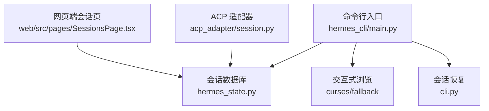
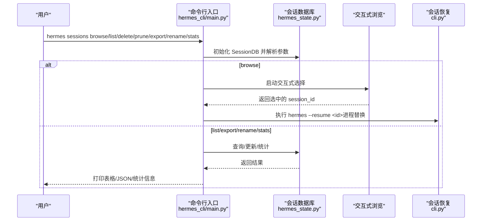
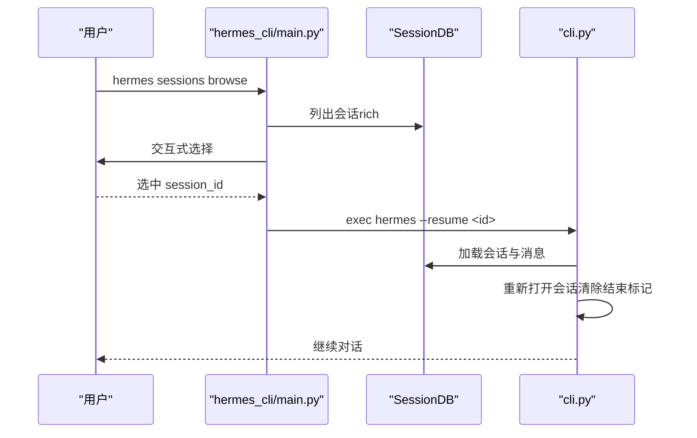
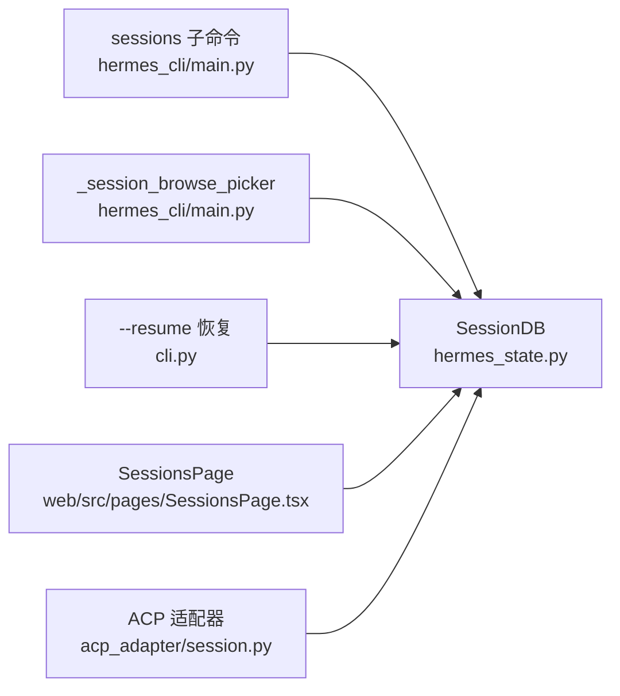

# 会话命令

<cite>
**本文引用的文件**
- [hermes_cli/main.py](file://hermes_cli/main.py)
- [hermes_state.py](file://hermes_state.py)
- [cli.py](file://cli.py)
- [tests/hermes_cli/test_session_browse.py](file://tests/hermes_cli/test_session_browse.py)
- [tests/hermes_cli/test_sessions_delete.py](file://tests/hermes_cli/test_sessions_delete.py)
- [website/docs/developer-guide/session-storage.md](file://website/docs/developer-guide/session-storage.md)
- [web/src/pages/SessionsPage.tsx](file://web/src/pages/SessionsPage.tsx)
- [acp_adapter/session.py](file://acp_adapter/session.py)
</cite>

## 目录
1. [简介](#简介)
2. [项目结构](#项目结构)
3. [核心组件](#核心组件)
4. [架构总览](#架构总览)
5. [详细组件分析](#详细组件分析)
6. [依赖分析](#依赖分析)
7. [性能考虑](#性能考虑)
8. [故障排查指南](#故障排查指南)
9. [结论](#结论)
10. [附录](#附录)

## 简介
本文件系统性地介绍 Hermes Agent 的会话命令体系，重点覆盖 hermes sessions 及其子命令（browse、list、delete、prune、export、rename、stats、browse）。内容涵盖会话管理机制、会话存储与索引、会话恢复流程、命令参数用法、交互式浏览与搜索、批量清理与导出、数据结构与标识符、最佳实践与备份建议等。

## 项目结构
围绕会话命令的关键代码分布在以下模块：
- hermes_cli/main.py：定义 sessions 子命令及解析逻辑，实现各子动作（list、browse、delete、prune、export、rename、stats）。
- hermes_state.py：SQLite 会话存储与检索、全文检索（FTS5）、会话生命周期管理、导出与清理。
- cli.py：会话恢复（--resume）时从数据库加载历史消息并重新打开会话。
- 测试：覆盖 browse 交互选择、delete 前缀解析与确认、FTS 搜索等行为。
- 网页端：会话列表与搜索 UI，展示 FTS 检索能力。
- ACP 适配器：通过 SessionDB 将会话状态持久化到数据库。

图表来源
- [hermes_cli/main.py](file://hermes_cli/main.py)
- [hermes_state.py](file://hermes_state.py)
- [cli.py](file://cli.py)
- [web/src/pages/SessionsPage.tsx](file://web/src/pages/SessionsPage.tsx)
- [acp_adapter/session.py](file://acp_adapter/session.py)

章节来源
- [hermes_cli/main.py](file://hermes_cli/main.py)
- [hermes_state.py](file://hermes_state.py)

## 核心组件
- 会话命令子系统：在主解析器下注册 sessions 子命令，包含 list、browse、delete、prune、export、rename、stats 等子动作。
- 会话数据库（SessionDB）：基于 SQLite 的会话与消息存储，支持 WAL 模式、FTS5 全文检索、事务重试与主动 checkpoint，提供会话生命周期、标题管理、导出与清理等能力。
- 交互式浏览：提供 curses 高级界面与降级的数字列表模式，支持按标题/预览/来源过滤与快速选择。
- 会话恢复：通过 --resume 在 CLI 中加载历史消息并重新开启会话。

章节来源
- [hermes_cli/main.py](file://hermes_cli/main.py)
- [hermes_state.py](file://hermes_state.py)
- [cli.py](file://cli.py)

## 架构总览
会话命令的执行路径如下：
- 解析命令与参数 → 初始化 SessionDB → 调用对应动作函数 → 访问数据库执行查询/写入 → 输出结果或触发进程替换（browse 恢复）。

图表来源
- [hermes_cli/main.py](file://hermes_cli/main.py)
- [hermes_state.py](file://hermes_state.py)
- [cli.py](file://cli.py)

## 详细组件分析

### sessions 子命令与参数
- sessions list
  - 参数：--source（过滤来源）、--limit（限制数量，默认 20）
  - 行为：列出最近会话，显示标题/预览/最后活跃时间/来源/ID；默认隐藏第三方工具会话，除非显式指定 --source
- sessions browse
  - 参数：--source（过滤来源）、--limit（默认 50）
  - 行为：交互式选择会话，支持键盘上下移动、输入字符过滤、Esc 清空过滤、Enter 选择；成功后以进程替换方式启动 hermes --resume <id>
- sessions delete
  - 参数：session_id（可为完整 ID 或唯一前缀）、--yes（跳过确认）
  - 行为：解析 session_id → 确认（TTY 环境）→ 删除会话及其消息；不级联删除子会话，仅解除父关联
- sessions prune
  - 参数：--older-than（默认 90 天）、--source（仅清理该来源）、--yes
  - 行为：删除已结束且超过 N 天未活跃的会话；对即将被删除的子会话解除父关联
- sessions export
  - 参数：output（输出文件路径，- 表示标准输出）、--source、--session-id
  - 行为：单个导出或全量导出为 JSONL；每行一个会话对象（含消息）
- sessions rename
  - 参数：session_id、title（多个词拼接为标题）
  - 行为：设置/更新会话标题，内部进行清洗与唯一性校验
- sessions stats
  - 行为：打印会话总数与消息总数

章节来源
- [hermes_cli/main.py](file://hermes_cli/main.py)

### 会话数据模型与存储
- SQLite 表结构
  - sessions：会话元数据（ID、来源、用户ID、模型、系统提示、父子会话链、起止时间、计数与用量指标、标题等）
  - messages：消息明细（角色、内容、工具调用、时间戳、token 数、完成原因、推理字段等）
  - FTS5 虚表 messages_fts：用于全文检索，自动同步插入/删除/更新
- 索引与约束
  - sessions 上的 source、parent_session_id、started_at 等索引
  - sessions.title 唯一索引（非空）
- 迁移与兼容
  - 支持多版本迁移，逐步添加新列（如推理 token、计费信息、定价版本等）

章节来源
- [hermes_state.py](file://hermes_state.py)
- [website/docs/developer-guide/session-storage.md](file://website/docs/developer-guide/session-storage.md)

### 交互式浏览与搜索
- 浏览器逻辑
  - curses 模式：支持上下键导航、输入字符过滤、回车选择、Esc 清空过滤、q/Escape 退出
  - 降级模式：数字编号列表，输入序号选择，q/空输入取消
  - 过滤规则：优先匹配标题，其次预览，再次来源；当无标题/预览时回退到 ID
- 搜索能力
  - FTS5 查询语法：短语、布尔、前缀等；内部对用户输入进行安全转义与规范化
  - 结果包含会话元数据、片段与前后文（1 条）

章节来源
- [hermes_cli/main.py](file://hermes_cli/main.py)
- [tests/hermes_cli/test_session_browse.py](file://tests/hermes_cli/test_session_browse.py)
- [hermes_state.py](file://hermes_state.py)

### 会话恢复流程
- CLI 恢复
  - 通过 --resume 加载历史消息，重建对话历史；若会话曾结束则重新打开（清除结束标记）
- ACP 适配器
  - 在服务端保存会话状态，使用 SessionDB 将当前状态持久化到数据库

图表来源
- [hermes_cli/main.py](file://hermes_cli/main.py)
- [cli.py](file://cli.py)
- [hermes_state.py](file://hermes_state.py)

章节来源
- [cli.py](file://cli.py)
- [acp_adapter/session.py](file://acp_adapter/session.py)

### 命令使用示例与场景
- 查看会话列表（按来源过滤、限制数量）
  - hermes sessions list --source cli --limit 20
- 交互式浏览与恢复
  - hermes sessions browse --source telegram --limit 50
  - 选择后以 hermes --resume <id> 继续
- 删除单个会话（支持唯一前缀）
  - hermes sessions delete 20260315_092437_c9a6 --yes
- 清理旧会话
  - hermes sessions prune --older-than 90 --source cli --yes
- 导出会话（单个/全部）
  - hermes sessions export sessions.jsonl --source cli
  - hermes sessions export - --session-id abc123 > session.json
- 重命名会话标题
  - hermes sessions rename abc123 "我的项目 v2"
- 查看统计
  - hermes sessions stats

章节来源
- [hermes_cli/main.py](file://hermes_cli/main.py)
- [tests/hermes_cli/test_sessions_delete.py](file://tests/hermes_cli/test_sessions_delete.py)

### 数据结构与标识符
- 会话标识符（ID）
  - 字符串主键，支持唯一前缀解析；resolve_session_id 会优先精确匹配，否则尝试唯一前缀匹配
- 会话元数据（部分关键字段）
  - source：来源（cli、telegram、discord 等）
  - parent_session_id：父子会话链，支持子会话延续与压缩分段
  - started_at/ended_at：会话起止时间
  - title：会话标题（唯一，非空时唯一）
  - 计数与用量：message_count、tool_call_count、input_tokens、output_tokens、cache_*、reasoning_tokens、计费与定价字段
- 消息字段
  - role/content/tool_calls/tool_call_id/tool_name/timestamp/token_count/finish_reason/reasoning 及其结构化细节

章节来源
- [hermes_state.py](file://hermes_state.py)
- [website/docs/developer-guide/session-storage.md](file://website/docs/developer-guide/session-storage.md)

## 依赖分析
- 命令层依赖数据库层：所有动作均通过 SessionDB 完成读写
- 交互层依赖命令层：browse 通过 list_sessions_rich 获取候选集，再交由 _session_browse_picker 处理
- 恢复层依赖数据库层：--resume 通过 get_messages_as_conversation 重建历史，并更新会话结束标记
- 网页端依赖数据库层：通过 FTS5 搜索接口返回结果并在前端渲染

图表来源
- [hermes_cli/main.py](file://hermes_cli/main.py)
- [hermes_state.py](file://hermes_state.py)
- [cli.py](file://cli.py)
- [web/src/pages/SessionsPage.tsx](file://web/src/pages/SessionsPage.tsx)
- [acp_adapter/session.py](file://acp_adapter/session.py)

章节来源
- [hermes_cli/main.py](file://hermes_cli/main.py)
- [hermes_state.py](file://hermes_state.py)

## 性能考虑
- 写入竞争与抖动
  - 使用 WAL 模式与短超时 + 应用层随机抖动重试，避免 SQLite 内置忙等待导致的“车队效应”
  - 定期 PASSIVE checkpoint，减少 WAL 文件膨胀
- 查询优化
  - sessions/source/parent_session_id/started_at 等索引提升过滤与排序效率
  - FTS5 触发器自动维护，全文检索稳定高效
- I/O 与并发
  - 多进程共享 state.db 时，短超时 + 抖动重试显著降低 UI 卡顿

章节来源
- [hermes_state.py](file://hermes_state.py)

## 故障排查指南
- sessions browse 无输出或仅显示“无会话”
  - 检查是否默认隐藏第三方工具会话；如需查看，请显式指定 --source
  - 确认 limit 是否过小
- 交互式浏览无法进入 curses 模式
  - 降级到数字列表模式；检查终端是否支持 curses
- sessions delete 报“未找到”
  - 确认 session_id 是否为完整 ID 或唯一前缀；使用 resolve_session_id 的行为验证
- sessions prune 不生效
  - 仅清理已结束会话；检查 older-than 与 source 参数
- FTS5 查询报错
  - 输入包含未闭合引号或特殊字符；系统会进行转义与规范化，必要时简化查询
- 非 TTY 环境确认失败
  - sessions delete/prune 在 stdin 关闭时会直接取消，避免阻塞

章节来源
- [hermes_cli/main.py](file://hermes_cli/main.py)
- [tests/hermes_cli/test_session_browse.py](file://tests/hermes_cli/test_session_browse.py)
- [tests/hermes_cli/test_sessions_delete.py](file://tests/hermes_cli/test_sessions_delete.py)

## 结论
Hermes Agent 的会话命令体系以 SQLite + FTS5 为核心，提供高效、可扩展的会话存储与检索能力；命令行与网页端协同，既满足日常运维与交互需求，又支持批量导出与清理。通过合理的参数设计与交互体验，用户可以轻松完成会话浏览、筛选、删除与恢复等操作。

## 附录

### 最佳实践与备份建议
- 定期导出重要会话
  - 使用 sessions export 导出 JSONL，便于归档与跨环境迁移
- 清理策略
  - 使用 sessions prune 清理长期未使用的已结束会话，结合 --older-than 与 --source 控制范围
- 标题管理
  - 使用 sessions rename 为会话设置清晰标题，便于后续检索与识别
- 备份建议
  - 定期复制 state.db（位于 HERMES_HOME 下），并结合 WAL checkpoint 保证一致性
- 恢复注意事项
  - --resume 会重新打开会话并加载历史消息；确保数据库可写且会话存在

章节来源
- [hermes_cli/main.py](file://hermes_cli/main.py)
- [hermes_state.py](file://hermes_state.py)