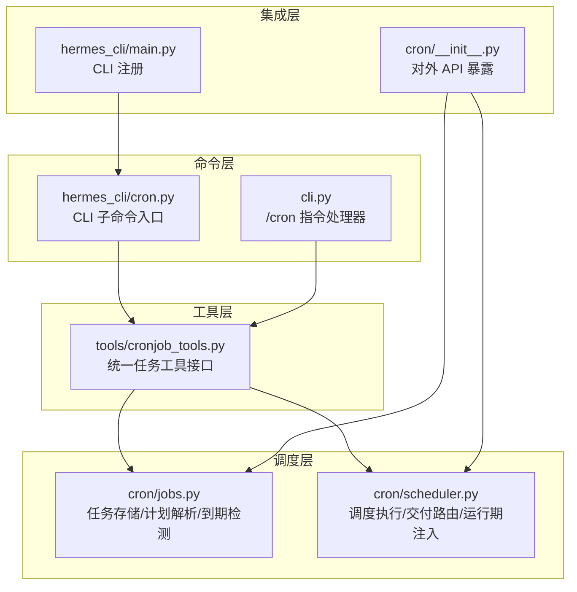
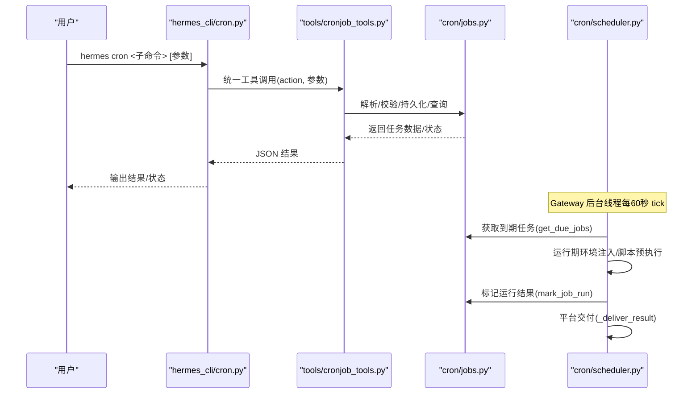
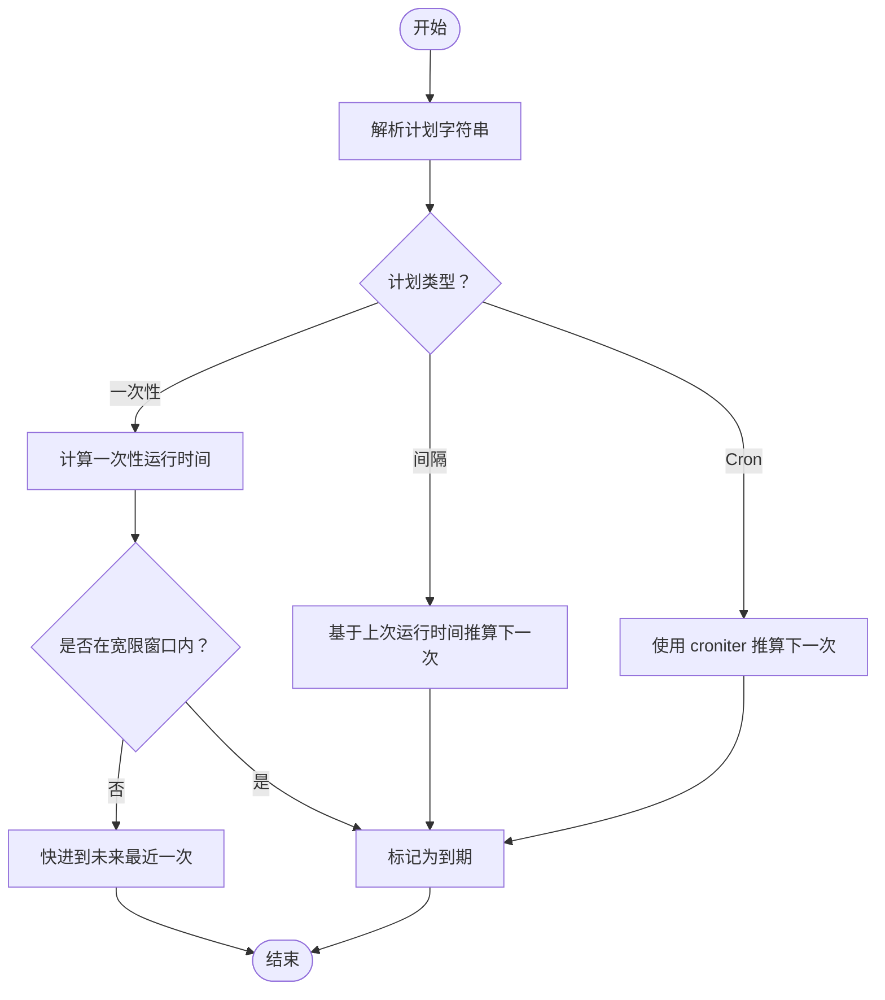
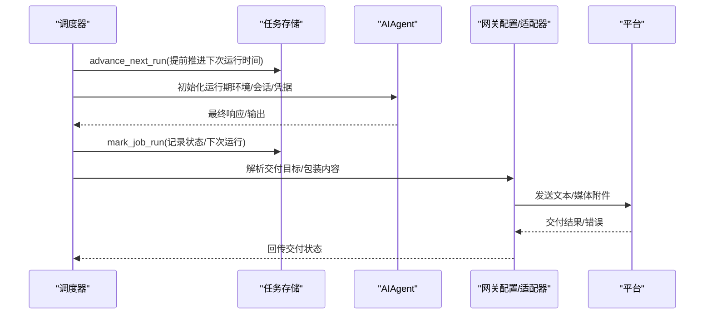
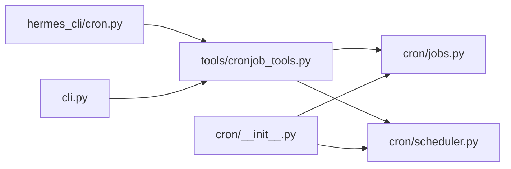

# 定时任务命令

<cite>
**本文档引用的文件**
- [hermes_cli/cron.py](file://hermes_cli/cron.py)
- [cron/__init__.py](file://cron/__init__.py)
- [cron/jobs.py](file://cron/jobs.py)
- [cron/scheduler.py](file://cron/scheduler.py)
- [tools/cronjob_tools.py](file://tools/cronjob_tools.py)
- [cli.py](file://cli.py)
- [hermes_cli/main.py](file://hermes_cli/main.py)
- [tests/cron/test_jobs.py](file://tests/cron/test_jobs.py)
- [tests/cron/test_scheduler.py](file://tests/cron/test_scheduler.py)
- [tests/hermes_cli/test_cron.py](file://tests/hermes_cli/test_cron.py)
- [README.md](file://README.md)
</cite>

## 目录
1. [简介](#简介)
2. [项目结构](#项目结构)
3. [核心组件](#核心组件)
4. [架构总览](#架构总览)
5. [详细组件分析](#详细组件分析)
6. [依赖分析](#依赖分析)
7. [性能考虑](#性能考虑)
8. [故障排除指南](#故障排除指南)
9. [结论](#结论)
10. [附录](#附录)

## 简介
本文件系统性阐述 Hermes Agent 的定时任务（cron）命令体系，围绕 hermes cron 及其子命令（list、status、tick、create/add、edit、pause、resume、run、remove/rm/delete）进行深入解析。内容覆盖调度机制、任务配置与存储、执行监控流程、命令参数与配置文件使用、任务生命周期管理、执行环境与安全策略、错误处理与故障排除、性能优化建议，并提供可操作的使用示例。

## 项目结构
Hermes Agent 的定时任务能力由以下模块协同实现：
- 命令层：hermes_cli/cron.py 提供 CLI 子命令入口；cli.py 提供聊天界面中的 /cron 指令支持。
- 工具层：tools/cronjob_tools.py 将任务管理封装为统一工具接口，负责参数校验、威胁扫描、脚本路径验证与输出格式化。
- 调度层：cron/jobs.py 负责任务存储、CRUD、计划解析、到期检测、输出落盘；cron/scheduler.py 负责调度器运行、交付路由、运行期环境注入与错误处理。
- 集成层：cron/__init__.py 暴露对外 API；hermes_cli/main.py 注册 CLI 子命令。

**图表来源**
- [hermes_cli/cron.py:1-291](file://hermes_cli/cron.py#L1-L291)
- [tools/cronjob_tools.py:1-511](file://tools/cronjob_tools.py#L1-L511)
- [cron/jobs.py:1-769](file://cron/jobs.py#L1-L769)
- [cron/scheduler.py:1-1010](file://cron/scheduler.py#L1-L1010)
- [cron/__init__.py:1-43](file://cron/__init__.py#L1-L43)
- [hermes_cli/main.py:5281-5290](file://hermes_cli/main.py#L5281-L5290)

**章节来源**
- [hermes_cli/cron.py:1-291](file://hermes_cli/cron.py#L1-L291)
- [tools/cronjob_tools.py:1-511](file://tools/cronjob_tools.py#L1-L511)
- [cron/jobs.py:1-769](file://cron/jobs.py#L1-L769)
- [cron/scheduler.py:1-1010](file://cron/scheduler.py#L1-L1010)
- [cron/__init__.py:1-43](file://cron/__init__.py#L1-L43)
- [hermes_cli/main.py:5281-5290](file://hermes_cli/main.py#L5281-L5290)

## 核心组件
- hermes_cli/cron.py：CLI 子命令分发器，负责 list/status/tick/create/edit/pause/resume/run/remove 等命令的参数解析与调用。
- tools/cronjob_tools.py：统一任务工具接口，提供 create/list/update/pause/resume/remove/run 等动作，内置提示词威胁扫描与脚本路径安全校验。
- cron/jobs.py：任务持久化与计划引擎，负责任务 CRUD、计划字符串解析、下一运行时间计算、到期检测、输出落盘与重复次数控制。
- cron/scheduler.py：调度器执行器，负责 tick 循环、并发锁、交付目标解析、运行期环境注入、脚本预执行、媒体附件发送与错误回传。
- cron/__init__.py：对外 API 聚合，导出任务管理与调度函数。
- cli.py：聊天界面 /cron 指令解析与执行，支持交互式任务管理。

**章节来源**
- [hermes_cli/cron.py:41-291](file://hermes_cli/cron.py#L41-L291)
- [tools/cronjob_tools.py:221-511](file://tools/cronjob_tools.py#L221-L511)
- [cron/jobs.py:320-769](file://cron/jobs.py#L320-L769)
- [cron/scheduler.py:67-1010](file://cron/scheduler.py#L67-L1010)
- [cron/__init__.py:18-42](file://cron/__init__.py#L18-L42)
- [cli.py:5018-5262](file://cli.py#L5018-L5262)

## 架构总览
定时任务从“命令入口”到“调度执行”的完整链路如下：

**图表来源**
- [hermes_cli/cron.py:253-291](file://hermes_cli/cron.py#L253-L291)
- [tools/cronjob_tools.py:221-384](file://tools/cronjob_tools.py#L221-L384)
- [cron/jobs.py:664-740](file://cron/jobs.py#L664-L740)
- [cron/scheduler.py:1-1010](file://cron/scheduler.py#L1-L1010)

## 详细组件分析

### hermes cron 子命令与参数
- hermes cron list [--all]：列出所有任务，支持显示已禁用任务。
- hermes cron status：检查网关是否运行以及当前活跃任务数与下次运行时间。
- hermes cron tick：手动触发一次调度 tick。
- hermes cron create|add --schedule <表达式> [--prompt <文本>] [--name <名称>] [--deliver <目标>] [--repeat <次数>] [--skill <技能>|--skills <数组>] [--script <脚本路径>]：创建新任务。
- hermes cron edit <job_id> [--schedule|--prompt|--name|--deliver|--repeat|--skill|--skills|--add-skill|--remove-skill|--clear-skills]：编辑现有任务。
- hermes cron pause|resume|run|remove|rm|delete <job_id>：暂停/恢复/触发/删除任务。

参数要点：
- schedule 支持“持续时间”“间隔”“Cron 表达式”“时间戳”四种形式，详见计划解析。
- deliver 支持 "origin"（同源）、"local"（本地保存）、"平台:chat_id[:thread_id]" 或平台别名自动解析。
- skills 支持单个或多个技能名称，编辑时可替换、追加、移除或清空。
- script 为相对路径，位于 ~/.hermes/scripts/ 下，执行前会注入到提示词上下文中。

**章节来源**
- [hermes_cli/cron.py:41-291](file://hermes_cli/cron.py#L41-L291)
- [cli.py:5018-5262](file://cli.py#L5018-L5262)
- [tools/cronjob_tools.py:407-465](file://tools/cronjob_tools.py#L407-L465)

### 计划解析与调度机制
- 计划解析 parse_schedule：
  - "30m"/"2h"/"1d" → 一次性在未来某时刻运行；
  - "every 30m"/"every 2h" → 间隔循环；
  - "0 9 * * *" → Cron 表达式（需 croniter 包）；
  - "2026-02-03T14:00:00" → 指定时间一次性运行。
- compute_next_run：根据计划类型与上次运行时间计算下一次运行时间，支持一次性任务的宽限期与循环/日程的动态宽限窗口。
- get_due_jobs：在网关重启后对“过期但未超过宽限”的循环任务进行快进跳过，避免重启风暴。

**图表来源**
- [cron/jobs.py:117-204](file://cron/jobs.py#L117-L204)
- [cron/jobs.py:284-314](file://cron/jobs.py#L284-L314)
- [cron/jobs.py:664-740](file://cron/jobs.py#L664-L740)

**章节来源**
- [cron/jobs.py:117-204](file://cron/jobs.py#L117-L204)
- [cron/jobs.py:284-314](file://cron/jobs.py#L284-L314)
- [cron/jobs.py:664-740](file://cron/jobs.py#L664-L740)

### 任务配置与存储
- 存储位置：~/.hermes/cron/jobs.json；输出目录 ~/.hermes/cron/output/<job_id>/。
- 关键字段：
  - id/name/prompt/skills/skill/model/provider/base_url/script/schedule/schedule_display/repeat/deliver/next_run_at/last_run_at/last_status/last_error/last_delivery_error/state/enabled/paused_*。
- 权限保护：目录与文件采用安全权限（仅属主读写），避免敏感信息泄露。
- 自动修复：jobs.json 若存在无效控制字符，尝试自动修复并重写。

**章节来源**
- [cron/jobs.py:34-38](file://cron/jobs.py#L34-L38)
- [cron/jobs.py:320-366](file://cron/jobs.py#L320-L366)
- [cron/jobs.py:743-769](file://cron/jobs.py#L743-L769)

### 执行监控与交付
- 运行期注入：
  - 重新加载 .env 与 config.yaml，确保模型/推理路由/凭据等最新；
  - 设置会话数据库与会话 ID，便于审计与检索；
  - 自动交付环境变量（平台、聊天 ID、主题 ID）。
- 脚本预执行：
  - 在 ~/.hermes/scripts/ 下执行数据采集脚本，将 stdout 注入提示词上下文；
  - 超时默认 120 秒，可通过 HERMES_CRON_SCRIPT_TIMEOUT 或配置项调整；
  - 输出与错误均进行敏感信息脱敏。
- 交付路由：
  - 支持 origin/local/平台直送，自动解析人类友好标签；
  - 优先使用运行中适配器（支持端到端加密）；失败则回退至独立发送；
  - 支持媒体附件分离发送（音频/视频/图片/文档）。
- 包装与静默：
  - 默认包装响应头尾，便于识别与停止指令；
  - 支持 [SILENT] 静默标记抑制交付。

**图表来源**
- [cron/scheduler.py:67-161](file://cron/scheduler.py#L67-L161)
- [cron/scheduler.py:201-369](file://cron/scheduler.py#L201-L369)
- [cron/scheduler.py:376-488](file://cron/scheduler.py#L376-L488)
- [cron/scheduler.py:580-800](file://cron/scheduler.py#L580-L800)

**章节来源**
- [cron/scheduler.py:67-161](file://cron/scheduler.py#L67-L161)
- [cron/scheduler.py:201-369](file://cron/scheduler.py#L201-L369)
- [cron/scheduler.py:376-488](file://cron/scheduler.py#L376-L488)
- [cron/scheduler.py:580-800](file://cron/scheduler.py#L580-L800)

### 命令使用示例
- 创建一次性任务：hermes cron create --schedule "30m" --prompt "检查服务器状态"
- 创建循环任务：hermes cron add --schedule "every 2h" --prompt "生成日报"
- 添加技能：hermes cron add --schedule "every 1h" --skill blogwatcher --prompt "聚合文章"
- 编辑任务：hermes cron edit <job_id> --schedule "every 4h" --add-skill find-nearby
- 删除任务：hermes cron rm <job_id>
- 查看状态：hermes cron status
- 强制执行：hermes cron run <job_id>

注意：所有命令均可通过聊天界面 /cron 子命令完成，语法一致。

**章节来源**
- [hermes_cli/cron.py:160-237](file://hermes_cli/cron.py#L160-L237)
- [cli.py:5158-5262](file://cli.py#L5158-L5262)

## 依赖分析
- hermes_cli/cron.py 依赖 tools.cronjob_tools.cronjob 作为统一工具入口，再委派到 cron/jobs 与 cron/scheduler。
- tools/cronjob_tools.py 直接依赖 cron/jobs 的 CRUD 与计划解析函数。
- cron/scheduler.py 依赖 cron/jobs 的到期检测、运行标记与输出落盘，并依赖网关配置与平台适配器。
- cron/__init__.py 将任务管理与调度函数统一导出，供外部模块复用。

**图表来源**
- [hermes_cli/cron.py:35-38](file://hermes_cli/cron.py#L35-L38)
- [tools/cronjob_tools.py:23-33](file://tools/cronjob_tools.py#L23-L33)
- [cron/__init__.py:18-29](file://cron/__init__.py#L18-L29)

**章节来源**
- [hermes_cli/cron.py:35-38](file://hermes_cli/cron.py#L35-L38)
- [tools/cronjob_tools.py:23-33](file://tools/cronjob_tools.py#L23-L33)
- [cron/__init__.py:18-29](file://cron/__init__.py#L18-L29)

## 性能考虑
- 调度周期：网关后台线程每 60 秒 tick，减少资源占用与误触发风险。
- 并发与锁：使用文件锁防止多进程同时 tick，避免重复执行。
- 快进策略：对重启后“超过宽限窗口”的循环任务直接快进，避免重启风暴。
- 超时控制：脚本执行超时默认 120 秒，可通过环境变量或配置项调整；任务运行采用基于活动的超时监控，避免长时间挂起。
- I/O 优化：临时文件写入与原子替换，确保数据一致性与崩溃安全。

**章节来源**
- [cron/scheduler.py:62-65](file://cron/scheduler.py#L62-L65)
- [cron/jobs.py:252-282](file://cron/jobs.py#L252-L282)
- [cron/scheduler.py:376-407](file://cron/scheduler.py#L376-L407)

## 故障排除指南
常见问题与定位步骤：
- 网关未运行导致任务不触发：
  - 使用 hermes cron status 检查网关 PID 与运行状态；若未运行，按提示安装/启动网关服务。
- 任务未到期：
  - 使用 hermes cron list 查看 next_run_at；确认计划表达式与系统时区设置。
- 交付失败：
  - 查看 last_delivery_error 字段；确认平台配置与 HOME_CHANNEL 环境变量；必要时改为 "local" 仅保存输出以便排查。
- 脚本执行失败：
  - 检查 HERMES_CRON_SCRIPT_TIMEOUT 与脚本路径是否在 ~/.hermes/scripts/ 内；查看脚本输出与错误信息。
- 任务被意外删除：
  - 检查 repeat 限制与 mark_job_run 的完成计数；一次性任务完成后会自动禁用。
- 安全告警：
  - cron 提示词威胁扫描会拦截包含隐藏字符或危险模式的提示词；请修正后再试。

**章节来源**
- [hermes_cli/cron.py:127-158](file://hermes_cli/cron.py#L127-L158)
- [tools/cronjob_tools.py:60-69](file://tools/cronjob_tools.py#L60-L69)
- [cron/jobs.py:586-634](file://cron/jobs.py#L586-L634)
- [cron/scheduler.py:201-369](file://cron/scheduler.py#L201-L369)

## 结论
Hermes Agent 的定时任务系统以“统一工具 + 文件存储 + 网关调度”为核心，具备灵活的计划表达式、完善的交付路由、严格的运行期注入与安全策略、以及稳健的错误处理与性能保障。通过 hermes cron 与 /cron 指令，用户可在 CLI 或聊天界面中高效地创建、编辑、监控与维护自动化任务。

## 附录

### 命令与参数速查
- hermes cron list [--all]
- hermes cron status
- hermes cron tick
- hermes cron create|add --schedule <表达式> [--prompt] [--name] [--deliver] [--repeat] [--skill|--skills] [--script]
- hermes cron edit <job_id> [--schedule|--prompt|--name|--deliver|--repeat|--skill|--skills|--add-skill|--remove-skill|--clear-skills]
- hermes cron pause|resume|run|remove|rm|delete <job_id>

### 计划表达式示例
- "30m" → 一次性在未来 30 分钟运行
- "every 2h" → 每 2 小时循环
- "0 9 * * *" → 每天 9:00（需 croniter）
- "2026-02-03T14:00:00" → 指定时间一次性运行

### 交付目标示例
- "origin" → 回到创建时的聊天与话题
- "local" → 仅保存输出，不投递
- "telegram:-1001234567890:17585" → 指定频道/群组与主题
- "discord:#engineering" → 通过通道名解析

### 环境变量与配置
- HERMES_CRON_SCRIPT_TIMEOUT：脚本执行超时（秒）
- HERMES_CRON_TIMEOUT：任务运行空闲超时（秒，0 表示不限）
- config.yaml 中的 cron.wrap_response 控制交付包装开关
- 平台 HOME_CHANNEL 环境变量用于自动解析交付目标

**章节来源**
- [hermes_cli/cron.py:127-158](file://hermes_cli/cron.py#L127-L158)
- [tools/cronjob_tools.py:407-465](file://tools/cronjob_tools.py#L407-L465)
- [cron/scheduler.py:376-407](file://cron/scheduler.py#L376-L407)