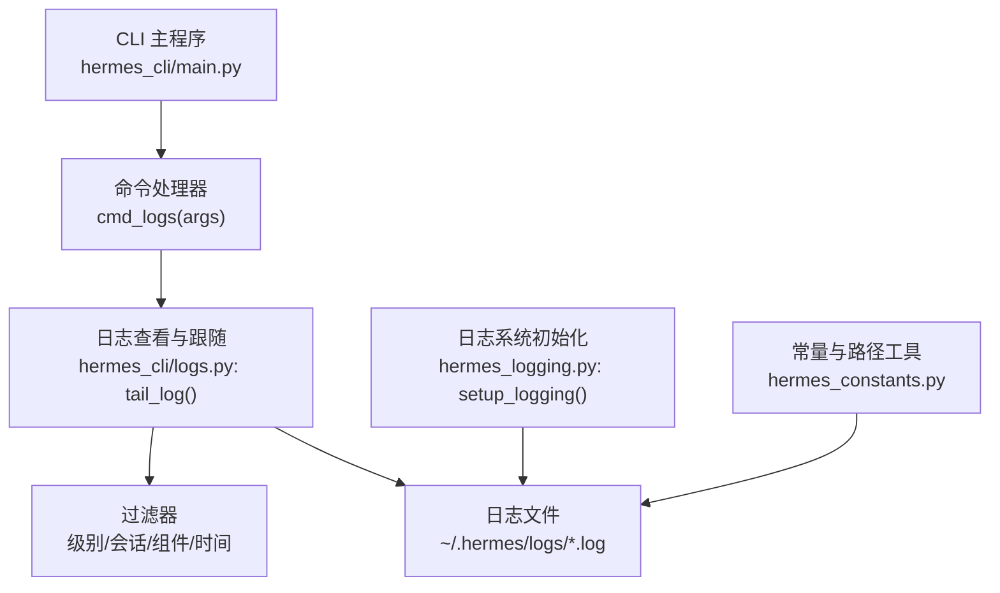
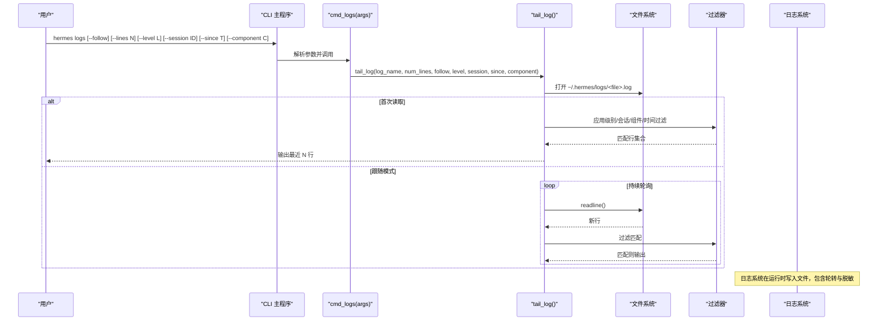
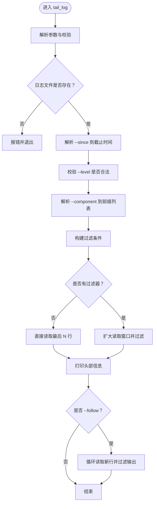
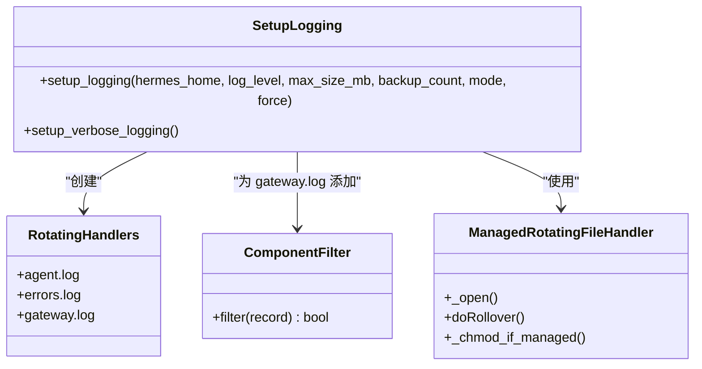
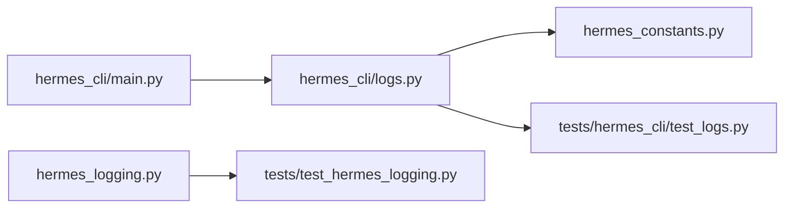

# 日志命令

<cite>
**本文引用的文件列表**
- [hermes_cli/logs.py](file://hermes_cli/logs.py)
- [hermes_cli/main.py](file://hermes_cli/main.py)
- [hermes_logging.py](file://hermes_logging.py)
- [hermes_constants.py](file://hermes_constants.py)
- [tests/hermes_cli/test_logs.py](file://tests/hermes_cli/test_logs.py)
- [tests/test_hermes_logging.py](file://tests/test_hermes_logging.py)
</cite>

## 目录
1. [简介](#简介)
2. [项目结构与定位](#项目结构与定位)
3. [核心组件](#核心组件)
4. [架构总览](#架构总览)
5. [详细组件分析](#详细组件分析)
6. [依赖关系分析](#依赖关系分析)
7. [性能与资源特性](#性能与资源特性)
8. [使用示例与最佳实践](#使用示例与最佳实践)
9. [故障排除指南](#故障排除指南)
10. [结论](#结论)

## 简介
本文件系统性地介绍 Hermes Agent 的日志命令体系，重点围绕 hermes logs 命令及其相关功能展开，覆盖以下主题：
- 日志文件结构与命名
- 日志级别分类与过滤
- 日志轮转机制与配置
- 命令参数详解（--follow、--lines、--level、--session、--since、--component）
- 实时日志查看、日志过滤、时间范围筛选
- 日志配置、存储位置与清理策略
- 日志分析技巧与常见问题排查

## 项目结构与定位
- hermes logs 子命令由 CLI 主入口注册，并委托给 hermes_cli/logs.py 中的 tail_log/list_logs 实现。
- 日志系统由 hermes_logging.py 统一初始化，负责创建 agent.log、errors.log、gateway.log，并采用轮转与脱敏格式化输出。
- 日志目录位于用户主目录下的 ~/.hermes/logs/，可通过 HERMES_HOME 环境变量定制。

图表来源
- [hermes_cli/main.py:4815-4833](file://hermes_cli/main.py#L4815-L4833)
- [hermes_cli/logs.py:138-247](file://hermes_cli/logs.py#L138-L247)
- [hermes_logging.py:156-260](file://hermes_logging.py#L156-L260)
- [hermes_constants.py:11-17](file://hermes_constants.py#L11-L17)

章节来源
- [hermes_cli/main.py:6380-6428](file://hermes_cli/main.py#L6380-L6428)
- [hermes_cli/logs.py:1-391](file://hermes_cli/logs.py#L1-L391)
- [hermes_logging.py:1-391](file://hermes_logging.py#L1-L391)
- [hermes_constants.py:1-112](file://hermes_constants.py#L1-L112)

## 核心组件
- hermes_cli/logs.py
  - 提供 tail_log()：读取并显示日志，支持尾部读取、实时跟随、多维过滤（级别、会话、组件、相对时间）。
  - 提供 list_logs()：列出日志目录下所有 .log 文件及大小、修改时间。
  - 内置正则解析：时间戳、日志级别、记录器名称（用于组件过滤）。
- hermes_logging.py
  - 统一初始化日志系统，创建 agent.log、errors.log、gateway.log。
  - 使用 RotatingFileHandler 进行轮转，支持自定义最大大小与备份数。
  - 提供 _ComponentFilter 与 COMPONENT_PREFIXES，支持按组件路由到不同文件或过滤。
  - 提供 RedactingFormatter 脱敏输出，避免敏感信息落盘。
- hermes_constants.py
  - 提供 get_hermes_home()/display_hermes_home()，统一日志目录路径。
- hermes_cli/main.py
  - 注册 logs 子命令，定义参数与帮助信息；将参数转发至 cmd_logs，再调用 tail_log/list_logs。

章节来源
- [hermes_cli/logs.py:138-247](file://hermes_cli/logs.py#L138-L247)
- [hermes_logging.py:156-260](file://hermes_logging.py#L156-L260)
- [hermes_constants.py:11-17](file://hermes_constants.py#L11-L17)
- [hermes_cli/main.py:6380-6428](file://hermes_cli/main.py#L6380-L6428)

## 架构总览
hermes logs 的工作流从 CLI 解析开始，进入命令处理函数，随后根据目标日志文件与过滤条件进行读取与展示；若启用跟随模式，则持续轮询新内容。

图表来源
- [hermes_cli/main.py:4815-4833](file://hermes_cli/main.py#L4815-L4833)
- [hermes_cli/logs.py:138-247](file://hermes_cli/logs.py#L138-L247)
- [hermes_logging.py:156-260](file://hermes_logging.py#L156-L260)

## 详细组件分析

### hermes_cli/logs.py：日志查看与过滤
- 已知日志文件映射：agent、errors、gateway 对应 agent.log、errors.log、gateway.log。
- 时间戳与级别解析：通过正则提取“YYYY-MM-DD HH:MM:SS”与“DEBUG/INFO/WARNING/ERROR/CRITICAL”。
- 记录器名称提取：用于组件过滤，支持带会话标签的行。
- 过滤组合：支持同时使用最小级别、会话子串、组件前缀、相对时间范围。
- 尾部读取策略：当存在过滤器时，扩大读取窗口以确保最终输出满足数量要求；对大文件采用从末尾分块读取的方式提升效率。
- 实时跟随：打开文件后定位到末尾，循环读取新增行，命中过滤条件即打印。

图表来源
- [hermes_cli/logs.py:138-247](file://hermes_cli/logs.py#L138-L247)
- [hermes_cli/logs.py:249-332](file://hermes_cli/logs.py#L249-L332)

章节来源
- [hermes_cli/logs.py:1-391](file://hermes_cli/logs.py#L1-L391)

### hermes_logging.py：日志系统初始化与轮转
- 初始化流程：setup_logging() 创建 logs/ 目录，添加多个 RotatingFileHandler，分别对应 agent.log、errors.log、gateway.log。
- 轮转参数：默认单文件最大大小与备份数可由配置文件读取，也可通过参数覆盖。
- 组件路由：gateway.log 仅接收以特定前缀开头的 logger 名称记录，其余记录保留在 agent.log。
- 脱敏输出：使用 RedactingFormatter，避免敏感信息落盘。
- 权限管理：在托管模式下，初始创建与轮转后设置组可读写权限，便于网关与交互用户共享。

图表来源
- [hermes_logging.py:156-260](file://hermes_logging.py#L156-L260)
- [hermes_logging.py:299-368](file://hermes_logging.py#L299-L368)

章节来源
- [hermes_logging.py:1-391](file://hermes_logging.py#L1-L391)

### hermes_cli/main.py：命令注册与参数解析
- 注册 logs 子命令，定义参数与帮助文本，包括 -n/--lines、-f/--follow、--level、--session、--since、--component。
- 将参数转发至 cmd_logs，再调用 tail_log 或 list_logs。

章节来源
- [hermes_cli/main.py:6380-6428](file://hermes_cli/main.py#L6380-L6428)
- [hermes_cli/main.py:4815-4833](file://hermes_cli/main.py#L4815-L4833)

## 依赖关系分析
- hermes_cli/main.py 依赖 hermes_cli/logs.py 提供的 tail_log/list_logs。
- hermes_cli/logs.py 依赖 hermes_constants.py 获取日志目录路径。
- hermes_logging.py 作为日志系统核心，被运行时代码调用以写入日志；hermes_cli/logs.py 在查看日志时独立于运行时日志写入逻辑。
- 测试覆盖了日志命令的解析、过滤、文件读取等关键路径。

图表来源
- [hermes_cli/main.py:4815-4833](file://hermes_cli/main.py#L4815-L4833)
- [hermes_cli/logs.py:1-391](file://hermes_cli/logs.py#L1-L391)
- [hermes_logging.py:1-391](file://hermes_logging.py#L1-L391)
- [tests/hermes_cli/test_logs.py:1-256](file://tests/hermes_cli/test_logs.py#L1-L256)
- [tests/test_hermes_logging.py:1-724](file://tests/test_hermes_logging.py#L1-L724)

章节来源
- [hermes_cli/main.py:4815-4833](file://hermes_cli/main.py#L4815-L4833)
- [hermes_cli/logs.py:1-391](file://hermes_cli/logs.py#L1-L391)
- [hermes_logging.py:1-391](file://hermes_logging.py#L1-L391)
- [tests/hermes_cli/test_logs.py:1-256](file://tests/hermes_cli/test_logs.py#L1-L256)
- [tests/test_hermes_logging.py:1-724](file://tests/test_hermes_logging.py#L1-L724)

## 性能与资源特性
- 大文件读取优化：当文件超过一定阈值时，采用从末尾分块读取的方式，减少内存占用并提高响应速度。
- 过滤成本控制：启用过滤时扩大读取窗口，避免多次 IO 循环；级别过滤基于预定义顺序表快速比较。
- 实时跟随：采用短间隔轮询与增量读取，保证低延迟输出；遇到空行时短暂休眠以降低 CPU 占用。
- 轮转与磁盘空间：默认单文件大小与备份数可配置，避免日志无限增长；托管模式下确保文件权限正确，便于共享访问。

章节来源
- [hermes_cli/logs.py:278-332](file://hermes_cli/logs.py#L278-L332)
- [hermes_logging.py:214-260](file://hermes_logging.py#L214-L260)

## 使用示例与最佳实践

### 基础用法
- 查看最近 50 行 agent.log
  - hermes logs
- 实时跟随 agent.log
  - hermes logs -f
- 查看 errors.log
  - hermes logs errors
- 查看 gateway.log 最近 100 行
  - hermes logs gateway -n 100

### 过滤与筛选
- 只显示 WARNING 及以上级别
  - hermes logs --level WARNING
- 按会话 ID 过滤
  - hermes logs --session abc123
- 按组件过滤
  - hermes logs --component tools
- 显示过去 1 小时内的日志
  - hermes logs --since 1h
- 结合 --since 与 --follow
  - hermes logs --since 30m -f

### 列出可用日志文件
- hermes logs list

### 调试模式与性能分析
- 调试模式：在需要更详细输出时，结合运行时的详细日志开关（例如 verbose 模式），并在 hermes logs 中使用 --level DEBUG 或 --since 辅助定位问题。
- 错误追踪：优先使用 errors.log（仅 WARNING+）进行快速排查，必要时切换到 agent.log 获取完整上下文。
- 性能分析：关注 gateway.log（仅网关组件）与 tools.log（工具相关）中的耗时操作与异常重试，结合会话 ID 进行关联分析。

章节来源
- [hermes_cli/main.py:6387-6398](file://hermes_cli/main.py#L6387-L6398)
- [hermes_cli/logs.py:7-18](file://hermes_cli/logs.py#L7-L18)

## 故障排除指南
- 日志文件不存在
  - 现象：提示找不到日志文件，建议先运行 hermes chat 生成日志。
  - 排查：确认 ~/.hermes/logs/ 目录存在且包含目标日志文件。
- 权限不足
  - 现象：Permission denied。
  - 排查：检查 ~/.hermes/logs/ 下文件权限；在托管模式下确认组权限已正确设置。
- 参数无效
  - --since 格式不正确：请使用形如 1h、30m、2d 的格式。
  - --level 不在允许范围内：仅支持 DEBUG、INFO、WARNING、ERROR、CRITICAL。
  - --component 不在允许范围内：仅支持 gateway、agent、tools、cli、cron。
- 大文件读取缓慢
  - 建议：开启 --follow 并配合 --since 缩小扫描范围；或减少 --lines 数量。
- 实时跟随卡顿
  - 建议：等待片刻让文件句柄稳定；确认未被其他进程锁定。

章节来源
- [hermes_cli/logs.py:172-199](file://hermes_cli/logs.py#L172-L199)
- [hermes_logging.py:309-329](file://hermes_logging.py#L309-L329)

## 结论
hermes logs 命令提供了轻量、高效、可扩展的日志查看与过滤能力，结合 hermes_logging 的轮转与脱敏机制，能够满足日常运维、调试与排障需求。通过合理使用 --follow、--lines、--level、--session、--since、--component 等参数，可以快速聚焦问题域并定位根因。建议在生产环境中配合配置文件调整轮转参数，并定期清理过期日志以控制磁盘占用。