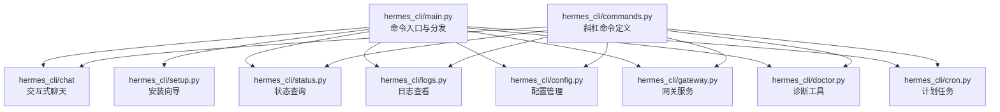
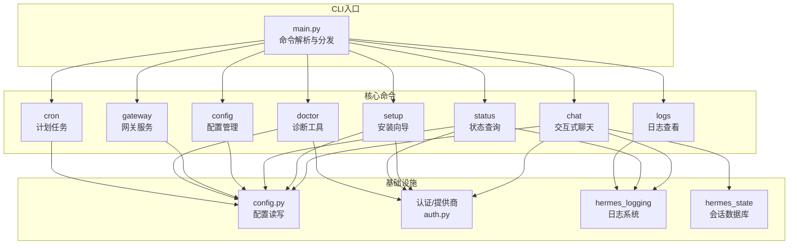
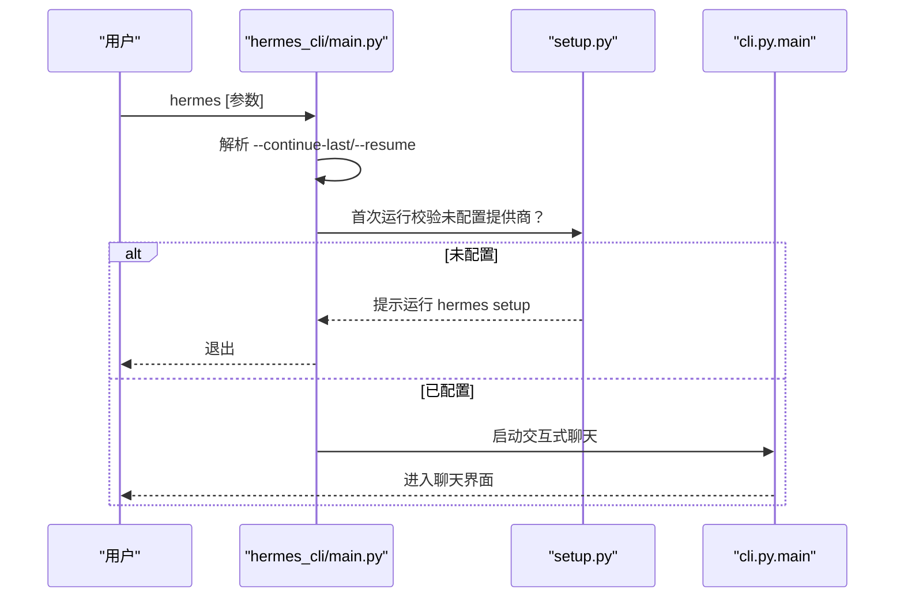
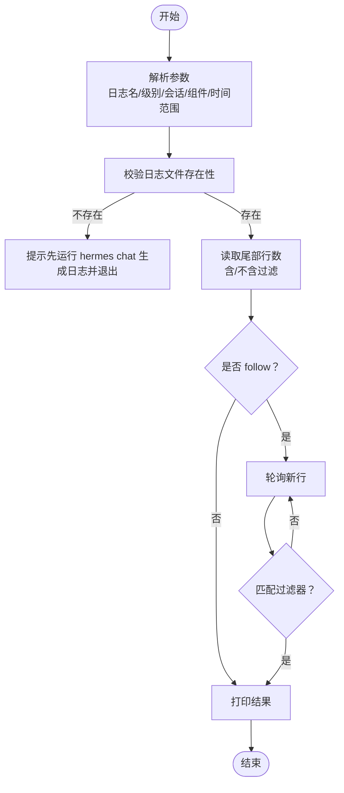
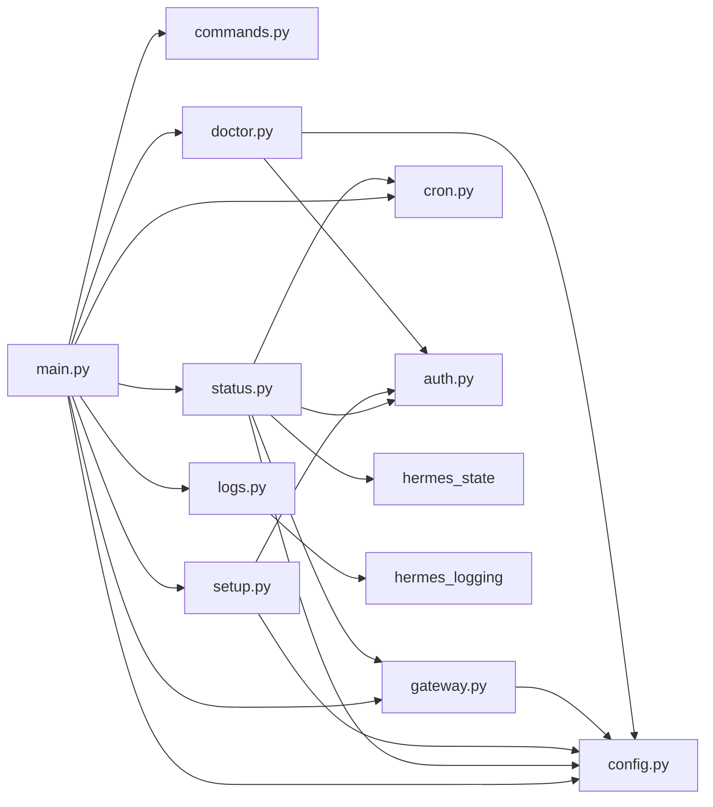

# 核心命令详解

<cite>
**本文档引用的文件**
- [hermes_cli/main.py](file://hermes_cli/main.py)
- [hermes_cli/commands.py](file://hermes_cli/commands.py)
- [hermes_cli/setup.py](file://hermes_cli/setup.py)
- [hermes_cli/status.py](file://hermes_cli/status.py)
- [hermes_cli/logs.py](file://hermes_cli/logs.py)
- [hermes_cli/config.py](file://hermes_cli/config.py)
- [hermes_cli/gateway.py](file://hermes_cli/gateway.py)
- [hermes_cli/doctor.py](file://hermes_cli/doctor.py)
- [hermes_cli/cron.py](file://hermes_cli/cron.py)
</cite>

## 目录
1. [简介](#简介)
2. [项目结构](#项目结构)
3. [核心组件](#核心组件)
4. [架构总览](#架构总览)
5. [详细组件分析](#详细组件分析)
6. [依赖分析](#依赖分析)
7. [性能考虑](#性能考虑)
8. [故障排除指南](#故障排除指南)
9. [结论](#结论)
10. [附录](#附录)

## 简介
本文件为 Hermes Agent 核心命令的权威参考，覆盖 hermes chat、hermes setup、hermes status、hermes logs 等常用命令。内容包括：命令语法与参数、执行流程、前置条件与后置处理、命令组合与工作流、输出格式与错误处理、别名与快捷方式、批量操作技巧以及故障排除。

## 项目结构
Hermes CLI 命令由统一入口解析与分发，核心模块职责如下：
- hermes_cli/main.py：命令入口、子命令注册、运行时环境初始化（日志、网络偏好、配置加载）
- hermes_cli/commands.py：内置斜杠命令定义与自动补全支持
- hermes_cli/setup.py：交互式安装向导（模型/提供商、终端后端、工具等）
- hermes_cli/status.py：组件状态概览（环境、密钥、认证、平台、网关、计划任务等）
- hermes_cli/logs.py：日志查看、过滤与实时跟踪
- hermes_cli/config.py：配置管理（查看、编辑、设置键值）
- hermes_cli/gateway.py：网关服务管理（安装、启动、停止、状态）
- hermes_cli/doctor.py：诊断工具（环境、依赖、服务状态检查）
- hermes_cli/cron.py：计划任务管理（列表、状态、暂停/恢复、触发）

图表来源
- [hermes_cli/main.py:1-120](file://hermes_cli/main.py#L1-L120)
- [hermes_cli/commands.py:1-120](file://hermes_cli/commands.py#L1-L120)

章节来源
- [hermes_cli/main.py:1-120](file://hermes_cli/main.py#L1-L120)
- [hermes_cli/commands.py:1-120](file://hermes_cli/commands.py#L1-L120)

## 核心组件
- 命令入口与运行时
  - 初始化集中日志、IPv4 优先策略、环境变量加载
  - 支持 --profile/-p 覆盖 HERMES_HOME，确保后续模块读取正确路径
  - 非交互命令的 TTY 校验（如 setup、model），避免管道/非 TTY 场景误用
- 内置斜杠命令
  - 统一注册在 COMMAND_REGISTRY，支持别名、子命令、描述与参数提示
  - 支持按平台/配置门控显示命令（如某些命令仅在启用特定功能时出现）
- 安装向导
  - 模型与提供商选择、终端后端、代理/容器资源、工具配置
  - 同提供商凭据池与轮转策略配置
- 状态查询
  - 环境信息、API 密钥、认证提供商、工具网关（Nous）状态、终端后端、消息平台、网关服务、计划任务、会话数量
  - 支持深度检查（连通性、端口占用）
- 日志查看
  - 支持 tail、follow、级别过滤、会话过滤、组件过滤、相对时间范围
  - 输出前缀包含文件位置与过滤条件
- 配置管理
  - 查看、编辑、设置键值、迁移、查询
- 网关服务
  - 安装/卸载、启动/停止/重启、状态查询；跨平台（systemd/launchd/Termux/Docker）
- 诊断工具
  - Python 版本、虚拟环境、依赖、服务状态、权限、终端浏览器依赖等
- 计划任务
  - 列表、状态、暂停/恢复、立即触发、创建/编辑/删除

章节来源
- [hermes_cli/main.py:140-200](file://hermes_cli/main.py#L140-L200)
- [hermes_cli/commands.py:55-170](file://hermes_cli/commands.py#L55-L170)
- [hermes_cli/setup.py:140-220](file://hermes_cli/setup.py#L140-L220)
- [hermes_cli/status.py:80-120](file://hermes_cli/status.py#L80-L120)
- [hermes_cli/logs.py:29-75](file://hermes_cli/logs.py#L29-L75)
- [hermes_cli/config.py:1-80](file://hermes_cli/config.py#L1-L80)
- [hermes_cli/gateway.py:2860-2975](file://hermes_cli/gateway.py#L2860-L2975)
- [hermes_cli/doctor.py:164-200](file://hermes_cli/doctor.py#L164-L200)
- [hermes_cli/cron.py:253-290](file://hermes_cli/cron.py#L253-L290)

## 架构总览
下图展示 CLI 命令到具体实现模块的调用关系，以及与配置、认证、日志等基础设施的交互。

图表来源
- [hermes_cli/main.py:676-784](file://hermes_cli/main.py#L676-L784)
- [hermes_cli/setup.py:625-666](file://hermes_cli/setup.py#L625-L666)
- [hermes_cli/status.py:85-489](file://hermes_cli/status.py#L85-L489)
- [hermes_cli/logs.py:138-247](file://hermes_cli/logs.py#L138-L247)
- [hermes_cli/config.py:1-80](file://hermes_cli/config.py#L1-L80)
- [hermes_cli/gateway.py:2860-2975](file://hermes_cli/gateway.py#L2860-L2975)
- [hermes_cli/doctor.py:164-200](file://hermes_cli/doctor.py#L164-L200)
- [hermes_cli/cron.py:253-290](file://hermes_cli/cron.py#L253-L290)

## 详细组件分析

### hermes chat 交互式聊天
- 语法与参数
  - hermes [可选参数]
  - 关键参数（示例）：--model/--provider、--toolsets、--skills、--query、--image、--resume、--worktree、--checkpoints、--pass-session-id、--max-turns、--yolo、--source、--continue-last/-c
- 执行流程
  - 解析 --continue-last/-c：若提供字符串则按名称/ID 解析，否则回退到最近一次 CLI 会话
  - 解析 --resume：支持名称或 ID，解析失败保留原值交由后续逻辑报告“未找到会话”
  - 首次运行校验：若未检测到任何提供商配置，提示运行 hermes setup 或退出
  - 后台预取更新检查、技能同步
  - 设置环境变量：HERMES_YOLO_MODE、HERMES_SESSION_SOURCE
  - 调用 cli.py.main(...) 传入解析后的参数
- 前置条件
  - 至少配置一个推理提供商（API Key 或自定义端点）
  - 可交互 TTY（非管道/非批处理）
- 后置处理
  - 成功：进入交互式聊天界面
  - 失败：打印错误并退出
- 错误处理
  - 参数解析错误：打印错误并退出
  - 未配置提供商：提示运行 setup 并退出
- 使用示例
  - hermes --query "解释量子计算"
  - hermes --resume "项目讨论" --toolsets web
  - hermes -c --yolo --source tool
- 别名与快捷方式
  - hermes 默认即为 chat
- 批量操作技巧
  - 结合 --query 与 --image 进行一次性问答
  - 使用 --worktree 与 --checkpoints 管理长对话上下文

图表来源
- [hermes_cli/main.py:676-784](file://hermes_cli/main.py#L676-L784)
- [hermes_cli/setup.py:625-666](file://hermes_cli/setup.py#L625-L666)

章节来源
- [hermes_cli/main.py:676-784](file://hermes_cli/main.py#L676-L784)
- [hermes_cli/main.py:529-540](file://hermes_cli/main.py#L529-L540)
- [hermes_cli/main.py:699-707](file://hermes_cli/main.py#L699-L707)

### hermes setup 交互式安装向导
- 语法与参数
  - hermes setup [子步骤]
  - 子步骤：model、terminal、gateway、tools 等
- 执行流程
  - 加载配置，打印标题与说明
  - 逐项引导：模型与提供商、终端后端、代理/容器资源、工具配置
  - 同提供商凭据池与轮转策略配置（当支持时）
  - 最终汇总：列出可用工具类别与缺失项，给出下一步建议
- 前置条件
  - 可交互 TTY
  - 可选：已有部分配置以跳过重复步骤
- 后置处理
  - 保存配置至 config.yaml 与 .env
  - 提示下一步命令（如 hermes、hermes gateway、hermes doctor）
- 错误处理
  - 选择/输入异常：重试或退出
  - 第三方凭据获取失败：记录并允许稍后配置
- 使用示例
  - hermes setup model
  - hermes setup terminal
  - hermes setup tools
- 别名与快捷方式
  - 无
- 批量操作技巧
  - 快速首次设置：quick 模式跳过部分步骤
  - 非交互：通过环境变量或 hermes config set 预配置

章节来源
- [hermes_cli/setup.py:140-220](file://hermes_cli/setup.py#L140-L220)
- [hermes_cli/setup.py:625-666](file://hermes_cli/setup.py#L625-L666)
- [hermes_cli/setup.py:344-572](file://hermes_cli/setup.py#L344-L572)

### hermes status 组件状态查询
- 语法与参数
  - hermes status [--all] [--deep]
- 执行流程
  - 打印环境信息（项目路径、Python 版本、.env 文件存在性、模型与提供商）
  - API Key 与认证提供商状态（红绿勾选与简要信息）
  - Nous 工具网关状态（订阅特性、当前提供商）
  - API Key 类提供商配置
  - 终端后端（本地/SSH/Docker/Daytona）、Sudo 权限
  - 消息平台（Telegram、Discord、WhatsApp、Signal、Slack、Email、SMS、DingTalk、Feishu、WeCom、Weixin、BlueBubbles、QQBot）
  - 网关服务状态（systemd/launchd/Termux/Docker）
  - 计划任务与会话数量
  - 深度检查（可选）：OpenRouter 连通性、端口占用
- 前置条件
  - 无需交互
- 后置处理
  - 输出人类可读的状态摘要
- 错误处理
  - 读取配置/文件异常：显示“未知”或错误信息
- 使用示例
  - hermes status
  - hermes status --all
  - hermes status --deep
- 别名与快捷方式
  - 无
- 批量操作技巧
  - 结合 --all 查看完整密钥摘要
  - 结合 --deep 排查网络连通性问题

章节来源
- [hermes_cli/status.py:85-489](file://hermes_cli/status.py#L85-L489)

### hermes logs 日志查看与过滤
- 语法与参数
  - hermes logs [agent|errors|gateway] [-n|--num-lines] [-f|--follow] [--level] [--session] [--since] [--component]
- 执行流程
  - 解析日志文件名映射与目标文件路径
  - 解析 --since 为时间戳阈值
  - 解析 --level 为最小级别
  - 解析 --component 为组件前缀集合
  - 读取尾部行数（含/不含过滤），或进入 follow 模式
  - 实时监控新行并按过滤器输出
- 前置条件
  - 日志目录存在且有权限访问
- 后置处理
  - 输出带过滤条件的头部与匹配行
- 错误处理
  - 未知日志名：提示可用日志并退出
  - 日志文件不存在：提示先运行 hermes chat 生成日志
  - 无效 --since/--level：提示格式并退出
- 使用示例
  - hermes logs
  - hermes logs -f --level WARNING
  - hermes logs gateway -n 100
  - hermes logs --session abc123
  - hermes logs --component tools --since 1h
- 别名与快捷方式
  - 无
- 批量操作技巧
  - 结合 --since 与 -f 实时追踪近期问题
  - 结合 --component 与 --level 定位特定模块

图表来源
- [hermes_cli/logs.py:138-247](file://hermes_cli/logs.py#L138-L247)
- [hermes_cli/logs.py:249-356](file://hermes_cli/logs.py#L249-L356)

章节来源
- [hermes_cli/logs.py:29-75](file://hermes_cli/logs.py#L29-L75)
- [hermes_cli/logs.py:138-247](file://hermes_cli/logs.py#L138-L247)
- [hermes_cli/logs.py:249-356](file://hermes_cli/logs.py#L249-L356)

### hermes config 配置管理
- 语法与参数
  - hermes config [view|edit|set|wizard|migrate|query]
- 执行流程
  - view：打印当前配置
  - edit：在编辑器中打开 config.yaml
  - set：设置指定键值（支持嵌套键）
  - wizard：重新运行安装向导
  - migrate：迁移配置
  - query：查询配置值
- 前置条件
  - 可交互 TTY（edit/wizard）
- 后置处理
  - set 成功后刷新缓存或提示重启
- 错误处理
  - 编辑器不可用：提示手动编辑
  - 键值无效：提示格式或路径
- 使用示例
  - hermes config view
  - hermes config set model.provider custom
  - hermes config set model.base_url http://localhost:8080/v1
  - hermes config edit
- 别名与快捷方式
  - 无
- 批量操作技巧
  - 通过 set 批量设置常用键值
  - 使用 query 获取当前生效值

章节来源
- [hermes_cli/config.py:1-80](file://hermes_cli/config.py#L1-L80)

### hermes gateway 网关服务管理
- 语法与参数
  - hermes gateway [run|start|stop|restart|status|install|uninstall|setup]
- 执行流程
  - install：根据平台安装服务（systemd/launchd/Termux/Docker），支持 --force、--system、--run-as-user
  - start：启动默认服务或指定服务（system）
  - stop：停止默认服务或全部
  - status：检查默认服务或系统服务状态
  - uninstall：卸载服务（Termux 不支持）
  - setup：交互式配置消息平台
- 前置条件
  - 管理员权限（必要时）
  - 平台支持（systemd/launchd/Termux/Docker）
- 后置处理
  - 安装/启动成功：提示 PID/日志查看方式
- 错误处理
  - 平台不支持：提示手动运行
  - 服务已存在/不存在：提示清理或重新安装
- 使用示例
  - hermes gateway install
  - hermes gateway start
  - hermes gateway status
  - hermes gateway setup
- 别名与快捷方式
  - 无
- 批量操作技巧
  - 在服务器上使用 --system 安装系统服务
  - 结合 journalctl/systemctl 查看日志与状态

章节来源
- [hermes_cli/gateway.py:2860-2975](file://hermes_cli/gateway.py#L2860-L2975)

### hermes doctor 诊断工具
- 语法与参数
  - hermes doctor [--fix]
- 执行流程
  - 加载 .env 与项目 .env
  - 检查：Python 版本、虚拟环境、系统包、终端浏览器依赖、服务状态、权限、网关服务 linger 等
  - 可选自动修复：尝试修复可自动处理的问题
  - 输出总结与剩余问题清单
- 前置条件
  - 可交互 TTY（可选）
- 后置处理
  - 修复计数与剩余问题提示
- 错误处理
  - 无法导入依赖：降级显示信息
- 使用示例
  - hermes doctor
  - hermes doctor --fix
- 别名与快捷方式
  - 无
- 批量操作技巧
  - 结合 --fix 自动修复简单问题
  - 逐步排查：先 doctor，再 status，最后 logs

章节来源
- [hermes_cli/doctor.py:164-200](file://hermes_cli/doctor.py#L164-L200)
- [hermes_cli/doctor.py:131-162](file://hermes_cli/doctor.py#L131-L162)

### hermes cron 计划任务管理
- 语法与参数
  - hermes cron [list|status|tick|create|add|edit|pause|resume|run|remove|rm|delete]
- 执行流程
  - list：列出所有任务（可 --all 显示全部）
  - status：检查网关是否运行（影响任务自动触发）
  - tick：立即执行到期任务
  - create/add：创建任务
  - edit：编辑任务
  - pause/resume：暂停/恢复任务
  - run：立即触发任务
  - remove/rm/delete：删除任务
- 前置条件
  - 网关运行（自动触发依赖）
- 后置处理
  - 成功/失败输出明确提示
- 错误处理
  - 任务不存在：提示 ID 或名称
  - 网关未运行：提示安装/启动网关
- 使用示例
  - hermes cron list
  - hermes cron status
  - hermes cron create --prompt "检查服务器健康" --schedule "every 1h"
  - hermes cron run --job-id <id>
- 别名与快捷方式
  - add 为 create 的别名
- 批量操作技巧
  - 先 status 确认网关状态
  - 使用 tick 手动验证任务逻辑

章节来源
- [hermes_cli/cron.py:253-290](file://hermes_cli/cron.py#L253-L290)
- [hermes_cli/cron.py:121-145](file://hermes_cli/cron.py#L121-L145)

## 依赖分析
- 模块耦合
  - main.py 作为统一入口，依赖各子命令模块与基础设施（config、auth、logging、state）
  - commands.py 为共享的斜杠命令注册中心，被多个界面复用（CLI、网关、平台）
  - setup.py 与 config.py、auth.py 紧密协作，确保配置一致性
  - status.py 依赖 config、auth、gateway、cron、hermes_state 等模块
  - logs.py 依赖 hermes_constants 与 hermes_logging 的组件前缀映射
- 外部依赖
  - 平台服务：systemd/launchd/Termux/Docker
  - 网络：HTTP(S) 访问（OpenRouter 等）
  - 文件系统：~/.hermes 下的配置、日志、会话、计划任务文件
- 循环依赖
  - 未发现直接循环依赖；各模块通过函数调用而非互相导入

图表来源
- [hermes_cli/main.py:676-784](file://hermes_cli/main.py#L676-L784)
- [hermes_cli/status.py:85-489](file://hermes_cli/status.py#L85-L489)
- [hermes_cli/logs.py:138-247](file://hermes_cli/logs.py#L138-L247)
- [hermes_cli/setup.py:625-666](file://hermes_cli/setup.py#L625-L666)

章节来源
- [hermes_cli/main.py:676-784](file://hermes_cli/main.py#L676-L784)
- [hermes_cli/status.py:85-489](file://hermes_cli/status.py#L85-L489)
- [hermes_cli/logs.py:138-247](file://hermes_cli/logs.py#L138-L247)
- [hermes_cli/setup.py:625-666](file://hermes_cli/setup.py#L625-L666)

## 性能考虑
- 日志查看
  - 大文件读取采用从末尾反向读取与分块策略，避免全文件扫描
  - follow 模式以短周期轮询，减少 CPU 占用
- 首次运行校验
  - 仅进行轻量检查（环境变量、配置文件、认证状态），避免昂贵的网络请求
- 计划任务
  - 状态检查与 tick 为 O(n) 遍历，n 为任务数量；建议合理调度频率
- 网关服务
  - 跨平台安装/启动涉及系统服务管理器调用，注意权限与 linger 设置

## 故障排除指南
- hermes chat 报错“需要交互式终端”
  - 确保在可交互 TTY 中运行，避免管道或非 TTY 环境
- hermes chat 提示“未配置提供商”
  - 运行 hermes setup 或设置 OPENROUTER_API_KEY/OPENAI_API_KEY 等环境变量
- hermes logs 提示“日志文件不存在”
  - 先运行 hermes chat 生成日志，再执行 hermes logs
- hermes logs --level 或 --since 格式错误
  - --level 必须为 DEBUG/INFO/WARNING/ERROR/CRITICAL 之一
  - --since 必须为 "1h"/"30m"/"2d" 等格式
- hermes gateway 安装/启动失败
  - 检查平台支持（systemd/launchd/Termux/Docker）
  - 在 Linux 上确认 systemd/linger 配置
  - 在 macOS 上确认 launchd 状态
- hermes doctor 发现 Python 版本过低
  - 升级至 3.10+，推荐 3.11+
- hermes cron 任务未触发
  - 确认网关正在运行（hermes gateway status），或手动执行 hermes cron tick

章节来源
- [hermes_cli/main.py:53-68](file://hermes_cli/main.py#L53-L68)
- [hermes_cli/main.py:708-734](file://hermes_cli/main.py#L708-L734)
- [hermes_cli/logs.py:172-189](file://hermes_cli/logs.py#L172-L189)
- [hermes_cli/gateway.py:2860-2975](file://hermes_cli/gateway.py#L2860-L2975)
- [hermes_cli/doctor.py:184-198](file://hermes_cli/doctor.py#L184-L198)
- [hermes_cli/cron.py:121-145](file://hermes_cli/cron.py#L121-L145)

## 结论
本文档系统梳理了 Hermes Agent 的核心命令，覆盖语法、参数、执行流程、前置条件、后置处理、组合使用模式、输出格式与错误处理。建议在日常使用中结合 hermes doctor 与 hermes status 进行健康检查，使用 hermes logs 进行问题定位，并通过 hermes setup 完成初始配置与持续优化。

## 附录
- 斜杠命令一览（节选）
  - 会话类：/new、/clear、/history、/save、/retry、/undo、/title、/branch、/compress、/rollback、/snapshot、/stop、/approve、/deny、/background、/btw、/queue、/status、/resume
  - 配置类：/config、/model、/provider、/personality、/statusbar、/verbose、/yolo、/reasoning、/fast、/skin、/voice
  - 工具与技能：/tools、/toolsets、/skills、/cron、/reload、/reload-mcp、/browser、/plugins
  - 信息类：/commands、/help、/restart、/usage、/insights、/platforms、/paste、/image、/update、/debug
  - 退出类：/quit
- 别名与快捷方式
  - /new 的别名为 /reset
  - /background 的别名为 /bg
  - /branch 的别名为 /fork
  - /reload-mcp 的别名为 /reload_mcp
  - /platforms 的别名为 /gateway
  - /quit 的别名为 /exit

章节来源
- [hermes_cli/commands.py:59-169](file://hermes_cli/commands.py#L59-L169)