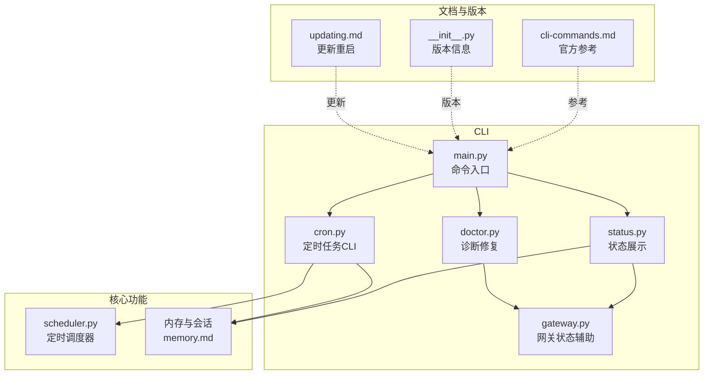
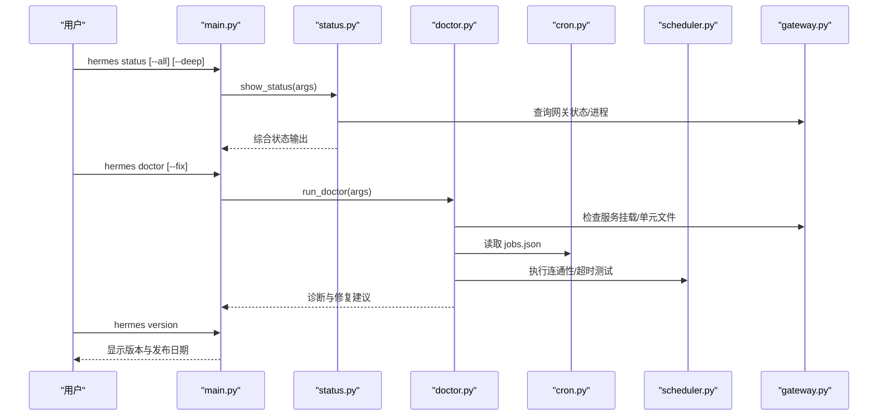
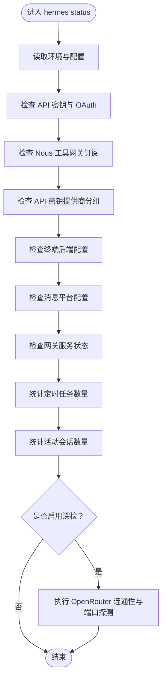
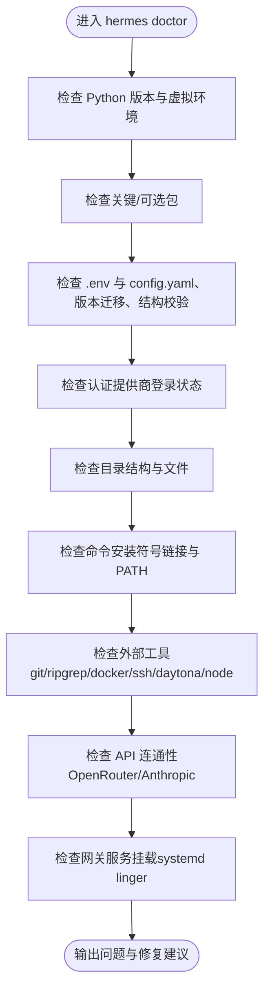
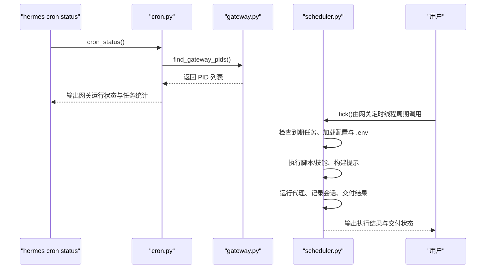
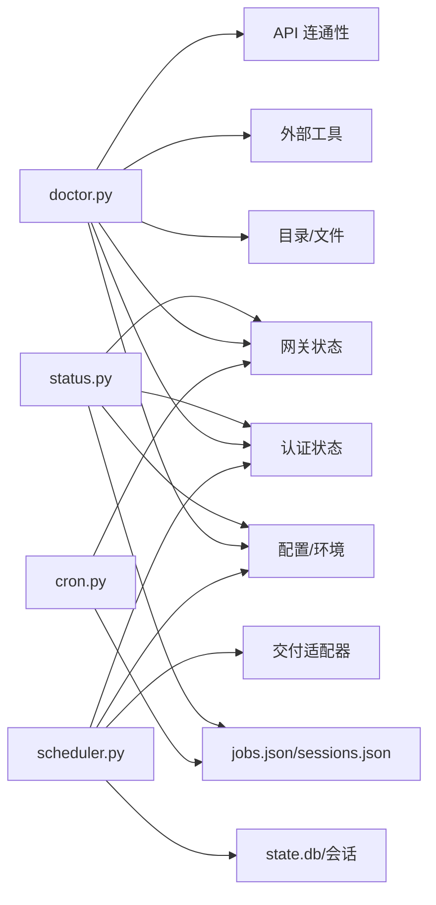

# 状态命令

<cite>
**本文引用的文件**
- [status.py](file://hermes_cli/status.py)
- [doctor.py](file://hermes_cli/doctor.py)
- [main.py](file://hermes_cli/main.py)
- [__init__.py](file://hermes_cli/__init__.py)
- [cron.py](file://hermes_cli/cron.py)
- [scheduler.py](file://cron/scheduler.py)
- [gateway.py](file://hermes_cli/gateway.py)
- [cli-commands.md](file://website/docs/reference/cli-commands.md)
- [memory.md](file://website/docs/user-guide/features/memory.md)
- [updating.md](file://website/docs/getting-started/updating.md)
</cite>

## 目录
1. [简介](#简介)
2. [项目结构](#项目结构)
3. [核心组件](#核心组件)
4. [架构总览](#架构总览)
5. [详细组件分析](#详细组件分析)
6. [依赖分析](#依赖分析)
7. [性能考虑](#性能考虑)
8. [故障排查指南](#故障排查指南)
9. [结论](#结论)
10. [附录](#附录)

## 简介
本文件聚焦于 Hermes Agent 的状态相关命令，系统性说明以下命令的行为与输出：
- hermes status：综合展示系统环境、认证与密钥、消息平台、网关服务、定时任务、会话状态等
- hermes doctor：深度诊断与修复建议，覆盖环境、配置、目录结构、外部工具、API连通性等
- hermes version：显示当前版本与发布日期

文档同时解释状态检查机制、组件健康监控、依赖项验证流程，给出输出格式解读、异常检测要点、使用示例与故障诊断方法，并总结性能监控与健康检查的最佳实践。

## 项目结构
围绕状态命令的关键模块与文件如下：
- hermes_cli/status.py：实现 hermes status 的完整输出逻辑，按“环境、API密钥、认证提供商、工具网关、API密钥提供商、终端后端、消息平台、网关服务、定时任务、会话、深度检查”等维度组织
- hermes_cli/doctor.py：实现 hermes doctor 的诊断流程，覆盖 Python 环境、包依赖、配置文件、认证状态、目录结构、外部工具、API 连接性、网关服务挂载等
- hermes_cli/main.py：CLI 入口，注册 status、doctor、version 等子命令入口与帮助信息
- hermes_cli/__init__.py：声明版本与发布日期
- hermes_cli/cron.py：CLI 层对定时任务的查看与状态报告
- cron/scheduler.py：定时调度器，负责执行到期任务、交付结果、超时控制等
- hermes_cli/gateway.py：网关服务状态探测、安装与运行状态辅助
- website/docs/reference/cli-commands.md：官方 CLI 命令参考，含 doctor 用法
- website/docs/user-guide/features/memory.md：内存与会话存储相关背景
- website/docs/getting-started/updating.md：更新与重启网关的流程说明

**图表来源**
- [main.py:1-800](file://hermes_cli/main.py#L1-L800)
- [status.py:1-489](file://hermes_cli/status.py#L1-L489)
- [doctor.py:1-800](file://hermes_cli/doctor.py#L1-L800)
- [cron.py:1-291](file://hermes_cli/cron.py#L1-L291)
- [scheduler.py:1-800](file://cron/scheduler.py#L1-L800)
- [gateway.py:3135-3161](file://hermes_cli/gateway.py#L3135-L3161)
- [cli-commands.md:298-318](file://website/docs/reference/cli-commands.md#L298-L318)
- [__init__.py:1-16](file://hermes_cli/__init__.py#L1-L16)
- [memory.md:175-222](file://website/docs/user-guide/features/memory.md#L175-L222)
- [updating.md:23-46](file://website/docs/getting-started/updating.md#L23-L46)

**章节来源**
- [main.py:1-800](file://hermes_cli/main.py#L1-L800)
- [cli-commands.md:298-318](file://website/docs/reference/cli-commands.md#L298-L318)

## 核心组件
- hermes status
  - 输出环境信息（项目根、Python 版本、.env 文件存在性）、模型与提供方、各类 API 密钥与 OAuth 登录状态、工具网关订阅状态、API 密钥提供商分组、终端后端与 SSH/Docker/Daytona 配置、消息平台配置、网关服务状态、定时任务数量、会话数量
  - 支持深检模式（deep），进行 OpenRouter 连通性与本地端口占用探测
- hermes doctor
  - 检查 Python 版本与虚拟环境、关键与可选包、~/.hermes/.env 与 config.yaml、配置版本与迁移、配置结构有效性、认证提供商登录状态、目录结构与文件、SQLite WAL 文件大小、命令安装符号链接、外部工具（git、ripgrep、docker、ssh、daytona、node/npm）、API 连通性（OpenRouter、Anthropic）
- hermes version
  - 显示版本号与发布日期

**章节来源**
- [status.py:85-489](file://hermes_cli/status.py#L85-L489)
- [doctor.py:164-800](file://hermes_cli/doctor.py#L164-L800)
- [__init__.py:14-16](file://hermes_cli/__init__.py#L14-L16)

## 架构总览
下图展示状态命令在系统中的交互关系：CLI 入口解析参数，调用对应模块；状态模块读取配置与环境变量，访问认证与网关辅助模块；定时任务与内存信息作为状态维度被汇总。

**图表来源**
- [main.py:16-800](file://hermes_cli/main.py#L16-L800)
- [status.py:85-489](file://hermes_cli/status.py#L85-L489)
- [doctor.py:164-800](file://hermes_cli/doctor.py#L164-L800)
- [cron.py:121-157](file://hermes_cli/cron.py#L121-L157)
- [scheduler.py:580-800](file://cron/scheduler.py#L580-L800)
- [gateway.py:3135-3161](file://hermes_cli/gateway.py#L3135-L3161)

## 详细组件分析

### hermes status：系统状态检查与输出
- 环境与配置
  - 项目根、Python 版本、.env 文件存在性、默认模型与生效提供方
- 认证与密钥
  - 列出常见提供方的密钥与 OAuth 登录状态，支持显示原始密钥或脱敏显示
- 工具网关（Nous）
  - 若已登录，展示订阅可用能力与当前选择状态
- API 密钥提供商分组
  - 按提供商组合检查配置状态
- 终端后端
  - 本地/SSH/Docker/Daytona 等后端配置与 sudo 权限
- 消息平台
  - 各平台令牌与家频道配置状态
- 网关服务
  - Termux、Linux（systemd）、macOS（launchd）下的状态与管理器识别
- 定时任务
  - 读取 jobs.json 中启用任务数量
- 会话
  - 读取 sessions.json 中活动会话数量
- 深度检查（--deep）
  - OpenRouter 连通性探测、本地端口占用探测

**图表来源**
- [status.py:85-489](file://hermes_cli/status.py#L85-L489)

**章节来源**
- [status.py:85-489](file://hermes_cli/status.py#L85-L489)

### hermes doctor：深度诊断与修复
- Python 环境与虚拟环境、关键与可选包
- 配置文件与版本迁移、配置结构校验
- 认证提供商登录状态、codex CLI 可用性
- 目录结构与文件（~/.hermes、子目录、SOUL.md、state.db、WAL 文件大小）
- 命令安装（符号链接与 PATH）
- 外部工具（git、ripgrep、docker、ssh、daytona、node/npm）
- API 连通性（OpenRouter、Anthropic）
- 网关服务挂载（systemd linger）

**图表来源**
- [doctor.py:164-800](file://hermes_cli/doctor.py#L164-L800)

**章节来源**
- [doctor.py:164-800](file://hermes_cli/doctor.py#L164-L800)

### hermes version：版本信息
- 显示版本号与发布日期，便于定位构建时间与变更范围

**章节来源**
- [__init__.py:14-16](file://hermes_cli/__init__.py#L14-L16)

### 定时任务状态与网关状态
- hermes cron status：基于网关进程是否存在判断定时任务是否能自动触发，并显示活动任务数与下次运行时间
- scheduler.tick：定时调度器每分钟检查到期任务，执行脚本与技能，构建提示，运行代理，交付结果至目标平台，支持静默标记抑制交付

**图表来源**
- [cron.py:127-157](file://hermes_cli/cron.py#L127-L157)
- [scheduler.py:580-800](file://cron/scheduler.py#L580-L800)
- [gateway.py:3135-3161](file://hermes_cli/gateway.py#L3135-L3161)

**章节来源**
- [cron.py:127-157](file://hermes_cli/cron.py#L127-L157)
- [scheduler.py:580-800](file://cron/scheduler.py#L580-L800)

### 内存与会话状态
- 会话存储：SQLite state.db 与 sessions.json 提供活动会话数量与状态
- 内存：MEMORY.md/USER.md 与外部记忆插件提供持久化与检索能力

**章节来源**
- [status.py:436-447](file://hermes_cli/status.py#L436-L447)
- [memory.md:175-222](file://website/docs/user-guide/features/memory.md#L175-L222)

## 依赖分析
- hermes status 依赖
  - 配置加载、环境变量读取、认证状态查询、网关状态探测、定时任务与会话文件读取
- hermes doctor 依赖
  - 配置版本检查与迁移、配置结构校验、认证状态查询、目录与文件检查、外部工具探测、API 连通性探测、网关服务挂载检查
- hermes cron status 依赖
  - 网关进程探测与 jobs.json 解析
- scheduler.tick 依赖
  - 配置与 .env 重载、提供方路由、凭证池、会话数据库、交付适配器

**图表来源**
- [status.py:85-489](file://hermes_cli/status.py#L85-L489)
- [doctor.py:164-800](file://hermes_cli/doctor.py#L164-L800)
- [cron.py:121-157](file://hermes_cli/cron.py#L121-L157)
- [scheduler.py:580-800](file://cron/scheduler.py#L580-L800)

**章节来源**
- [status.py:85-489](file://hermes_cli/status.py#L85-L489)
- [doctor.py:164-800](file://hermes_cli/doctor.py#L164-L800)
- [cron.py:121-157](file://hermes_cli/cron.py#L121-L157)
- [scheduler.py:580-800](file://cron/scheduler.py#L580-L800)

## 性能考虑
- 状态命令本身为轻量输出，不涉及长耗时操作；深检模式仅做短连接探测
- doctor 的外部工具与 API 探测采用短超时，避免阻塞
- 定时任务执行受脚本超时与空闲超时限制，防止长时间卡死
- 建议定期清理 WAL 文件以避免未打点导致体积膨胀

[本节为通用指导，无需特定文件引用]

## 故障排查指南
- 网关未运行
  - 使用 hermes cron status 检查网关进程；若未运行，按提示安装或前台启动
  - 参考网关运行建议与健康日志输出
- Python 环境问题
  - doctor 会检查版本与虚拟环境；必要时安装推荐包或升级 Python
- 配置文件缺失或过旧
  - doctor 会提示创建 .env 与 config.yaml，或执行迁移
- 认证未登录
  - 检查各提供商登录状态，按提示完成登录流程
- 外部工具缺失
  - doctor 会提示安装 git、ripgrep、docker、ssh、daytona、node/npm 等
- API 连通性失败
  - doctor 会尝试 OpenRouter/Anthropic 连通性，检查密钥与网络
- 网关服务挂载
  - Linux 下检查 systemd linger 是否开启，避免注销后服务停止

**章节来源**
- [doctor.py:131-162](file://hermes_cli/doctor.py#L131-L162)
- [cron.py:127-157](file://hermes_cli/cron.py#L127-L157)
- [gateway.py:3135-3161](file://hermes_cli/gateway.py#L3135-L3161)

## 结论
- hermes status 提供“全景视图”，覆盖环境、认证、平台、网关、任务与会话等关键维度
- hermes doctor 提供“深度诊断”，从环境、配置、目录、工具到 API 连通性逐一验证，并给出修复建议
- hermes version 提供版本信息，便于定位与回溯
- 定时任务与网关状态紧密关联，doctor 与 cron status 可相互印证
- 建议将状态命令纳入日常巡检，结合 doctor 的修复建议与 WAL 清理、配置迁移等最佳实践，维持系统健康稳定

[本节为总结性内容，无需特定文件引用]

## 附录

### 命令输出格式与解读
- hermes status
  - 环境：显示项目根、Python 版本、.env 文件存在性
  - API 密钥/OAuth：每个提供方一行，带勾选/叉号与状态描述；可选显示原始密钥
  - 工具网关：显示订阅可用能力与当前选择状态
  - API 密钥提供商分组：显示各分组是否已配置
  - 终端后端：显示后端类型与相关配置（SSH/Docker/Daytona）
  - 消息平台：显示各平台令牌与家频道状态
  - 网关服务：显示运行状态与管理器类型
  - 定时任务：显示启用任务数量
  - 会话：显示活动会话数量
  - 深度检查：可选，显示 OpenRouter 连通性与端口占用
- hermes doctor
  - 分类输出：Python 环境、包依赖、配置文件、认证、目录结构、命令安装、外部工具、API 连通性、网关服务挂载
  - 每项包含“✓/⚠/✗”状态与简要说明；可选“--fix”自动修复
- hermes version
  - 显示版本号与发布日期

**章节来源**
- [status.py:85-489](file://hermes_cli/status.py#L85-L489)
- [doctor.py:164-800](file://hermes_cli/doctor.py#L164-L800)
- [__init__.py:14-16](file://hermes_cli/__init__.py#L14-L16)

### 使用示例
- hermes status
  - hermes status：基础状态
  - hermes status --all：显示原始密钥
  - hermes status --deep：附加连通性与端口探测
- hermes doctor
  - hermes doctor：诊断
  - hermes doctor --fix：尝试自动修复
- hermes cron
  - hermes cron status：查看定时任务与网关状态
  - hermes cron list：列出任务
- hermes version
  - hermes version：查看版本

**章节来源**
- [cli-commands.md:298-318](file://website/docs/reference/cli-commands.md#L298-L318)
- [main.py:16-44](file://hermes_cli/main.py#L16-L44)

### 异常检测与影响因素
- 网关未运行：定时任务无法自动触发
- 配置缺失：.env 与 config.yaml 缺失或过旧，导致认证与模型配置无效
- 认证失败：API 密钥或 OAuth 未登录，导致推理与平台消息发送失败
- 外部工具缺失：git/ripgrep/docker/ssh/node 等缺失影响功能完整性
- API 连通性失败：网络或密钥错误导致外部服务不可用
- 网关服务挂载：Linux 下 linger 未开启可能导致注销后服务停止

**章节来源**
- [doctor.py:131-162](file://hermes_cli/doctor.py#L131-L162)
- [cron.py:127-157](file://hermes_cli/cron.py#L127-L157)

### 性能监控与健康检查最佳实践
- 将 hermes status 与 hermes doctor 纳入日常巡检
- 定期清理 WAL 文件，避免体积膨胀
- 使用 hermes doctor --fix 自动修复可修复问题
- 关注网关服务挂载与 systemd linger 设置
- 更新后重启网关以确保新代码生效

**章节来源**
- [updating.md:23-46](file://website/docs/getting-started/updating.md#L23-L46)