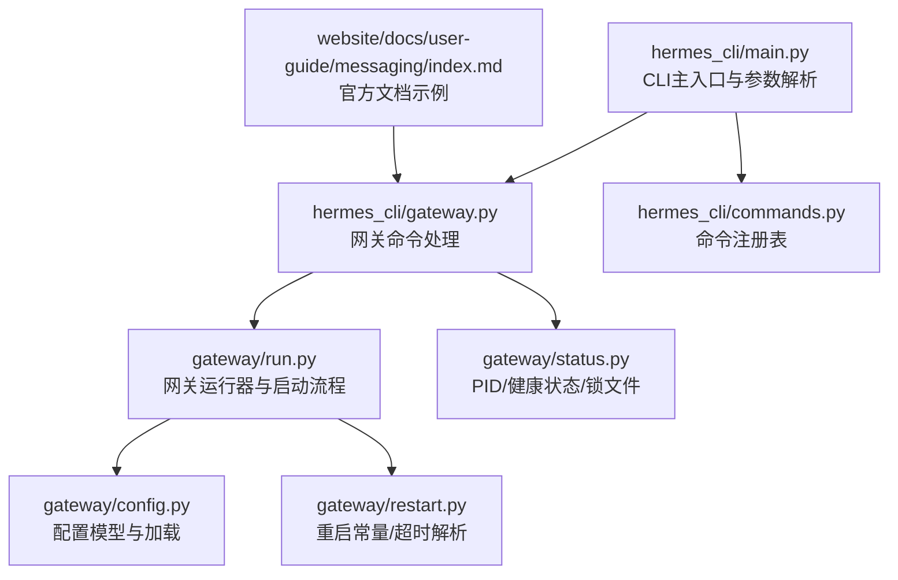
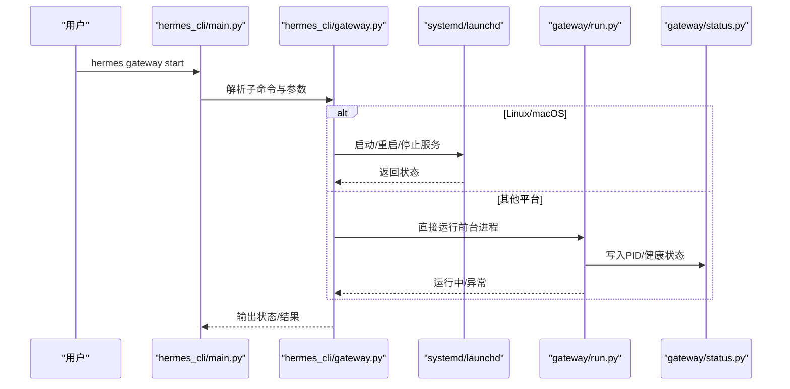
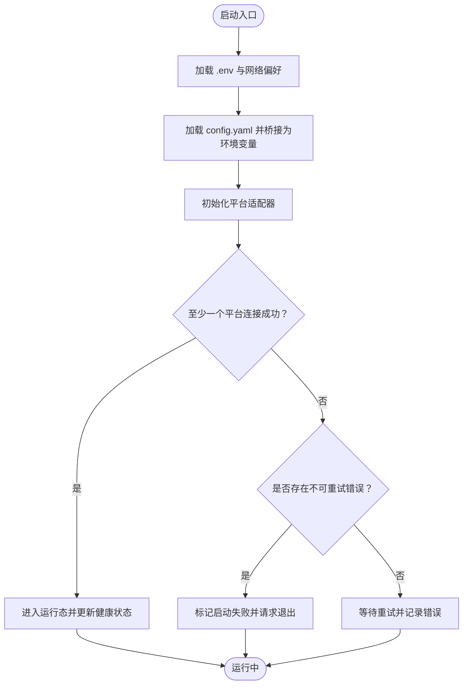
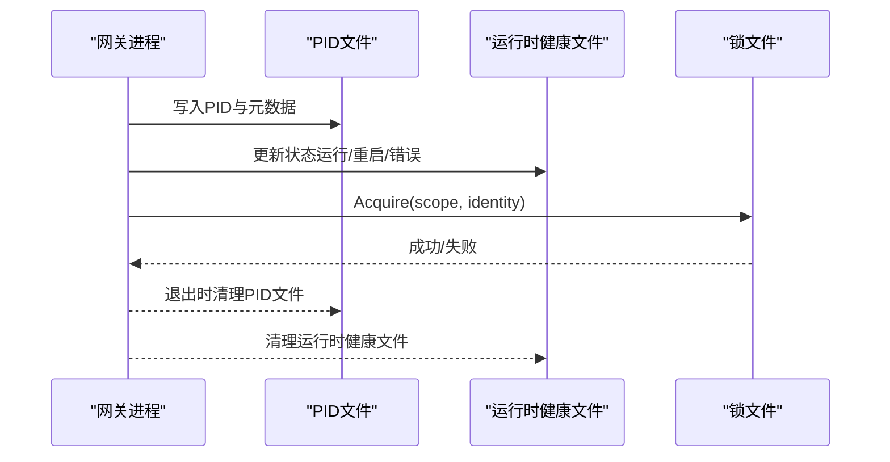
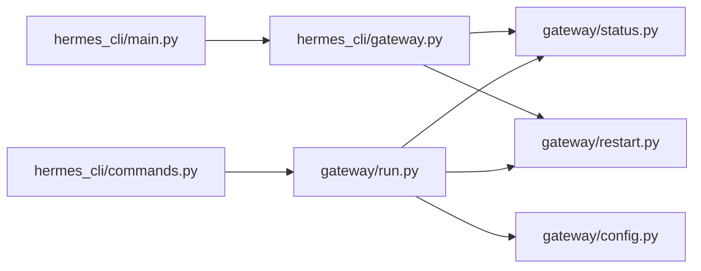

# 网关命令

<cite>
**本文引用的文件**
- [hermes_cli/gateway.py](file://hermes_cli/gateway.py)
- [gateway/run.py](file://gateway/run.py)
- [gateway/status.py](file://gateway/status.py)
- [gateway/config.py](file://gateway/config.py)
- [gateway/restart.py](file://gateway/restart.py)
- [hermes_cli/main.py](file://hermes_cli/main.py)
- [hermes_cli/commands.py](file://hermes_cli/commands.py)
- [website/docs/user-guide/messaging/index.md](file://website/docs/user-guide/messaging/index.md)
</cite>

## 目录
1. [简介](#简介)
2. [项目结构](#项目结构)
3. [核心组件](#核心组件)
4. [架构总览](#架构总览)
5. [详细组件分析](#详细组件分析)
6. [依赖分析](#依赖分析)
7. [性能考虑](#性能考虑)
8. [故障排除指南](#故障排除指南)
9. [结论](#结论)
10. [附录](#附录)

## 简介
本文件系统化梳理 Hermes Agent 网关命令与相关机制，覆盖 hermes gateway 及其子命令（run、start、stop、restart、status、install、uninstall、setup）的使用方式、启动流程、配置管理、进程与服务管理、健康检查、安装部署策略以及常见问题排查。文档同时解释命令参数（如 --system、--all、--run-as-user 等）的含义与适用场景，并给出典型使用示例与最佳实践。

## 项目结构
围绕网关命令与运行时的关键模块如下：
- hermes_cli/gateway.py：网关命令入口与子命令处理逻辑（install/start/stop/restart/status/setup），平台交互式配置，服务管理（systemd/launchd）。
- gateway/run.py：网关运行器与启动流程，配置桥接、环境变量注入、平台适配器初始化、健康状态持久化。
- gateway/status.py：进程 PID 文件与运行时健康状态文件的读写、锁文件管理、进程存在性校验。
- gateway/config.py：网关配置模型与加载策略（config.yaml、.env、环境变量优先级）。
- gateway/restart.py：重启常量与超时解析，用于服务管理触发优雅重启。
- hermes_cli/main.py：CLI 主入口与子命令解析，定义 gateway 子命令的参数与帮助。
- hermes_cli/commands.py：命令注册表，包含 /restart 等网关相关命令的定义。
- website/docs/user-guide/messaging/index.md：官方用户指南中的网关命令速查与快速开始。

**图表来源**
- [hermes_cli/gateway.py](file://hermes_cli/gateway.py)
- [gateway/run.py](file://gateway/run.py)
- [gateway/status.py](file://gateway/status.py)
- [gateway/config.py](file://gateway/config.py)
- [gateway/restart.py](file://gateway/restart.py)
- [hermes_cli/main.py](file://hermes_cli/main.py)
- [hermes_cli/commands.py](file://hermes_cli/commands.py)
- [website/docs/user-guide/messaging/index.md](file://website/docs/user-guide/messaging/index.md)

**章节来源**
- [hermes_cli/gateway.py](file://hermes_cli/gateway.py)
- [gateway/run.py](file://gateway/run.py)
- [gateway/status.py](file://gateway/status.py)
- [gateway/config.py](file://gateway/config.py)
- [gateway/restart.py](file://gateway/restart.py)
- [hermes_cli/main.py](file://hermes_cli/main.py)
- [hermes_cli/commands.py](file://hermes_cli/commands.py)
- [website/docs/user-guide/messaging/index.md](file://website/docs/user-guide/messaging/index.md)

## 核心组件
- 网关命令处理器：负责解析子命令（run/start/stop/restart/status/install/uninstall/setup），并根据平台能力选择 systemd 或 launchd 进行服务管理，或直接运行前台进程。
- 网关运行器：加载配置、桥接环境变量、初始化平台适配器、维护会话与投递路由、记录运行时健康状态。
- 状态与锁：通过 PID 文件与运行时健康文件实现“是否在运行”的判定；通过锁文件避免同一外部身份在同一机器上被多个本地实例并发使用。
- 配置系统：优先级从高到低为环境变量、config.yaml、历史 gateway.json、内置默认值；支持按平台细粒度覆盖。
- 重启机制：通过特定退出码与超时控制，配合服务管理器实现优雅重启与自动恢复。

**章节来源**
- [hermes_cli/gateway.py](file://hermes_cli/gateway.py)
- [gateway/run.py](file://gateway/run.py)
- [gateway/status.py](file://gateway/status.py)
- [gateway/config.py](file://gateway/config.py)
- [gateway/restart.py](file://gateway/restart.py)

## 架构总览
下图展示网关命令在不同平台上的服务管理路径与运行时状态流转：

**图表来源**
- [hermes_cli/main.py](file://hermes_cli/main.py)
- [hermes_cli/gateway.py](file://hermes_cli/gateway.py)
- [gateway/run.py](file://gateway/run.py)
- [gateway/status.py](file://gateway/status.py)

## 详细组件分析

### 命令与参数详解
- hermes gateway run
  - 作用：以前台模式运行网关，适合开发调试或临时使用。
  - 关键行为：写入 PID 文件与运行时健康状态；不依赖系统服务管理器。
- hermes gateway start
  - 作用：启动网关服务（优先使用 systemd/launchd），否则提示前台运行方式。
  - 参数：
    - --system：针对 Linux 的系统级服务单元。
    - --all：启动前清理所有配置文件中的陈旧进程。
- hermes gateway stop
  - 作用：停止当前配置文件对应的网关实例或服务。
  - 参数：
    - --system：停止系统级服务。
    - --all：停止所有配置文件中的网关进程。
- hermes gateway restart
  - 作用：优雅重启网关，优先通过服务管理器，失败则手动停止再启动。
  - 参数：
    - --system：针对系统级服务。
    - --all：先停止所有配置文件中的网关进程，再启动。
- hermes gateway status
  - 作用：查询网关状态（服务或前台进程），并输出最近的运行时健康摘要。
  - 参数：
    - --deep：深度状态检查（由具体平台实现）。
    - --system：查询系统级服务状态。
- hermes gateway install
  - 作用：安装为后台服务（Linux 使用 systemd，macOS 使用 launchd）。
  - 参数：
    - --force：强制重装。
    - --system：安装为系统级服务（开机自启）。
    - --run-as-user：指定系统服务运行用户（Linux）。
- hermes gateway uninstall
  - 作用：卸载网关服务。
  - 参数：
    - --system：卸载系统级服务。
- hermes gateway setup
  - 作用：交互式配置各消息平台（Telegram、Discord、WhatsApp、Signal、Weixin、Feishu 等）与网关服务。

**章节来源**
- [hermes_cli/main.py](file://hermes_cli/main.py)
- [hermes_cli/gateway.py](file://hermes_cli/gateway.py)

### 启动流程与配置管理
- 启动流程要点
  - 环境准备：加载 ~/.hermes/.env 与项目根目录 .env；应用 IPv4 优先策略；设置安静模式与交互执行审批。
  - 配置桥接：读取 config.yaml 并将其关键字段映射为环境变量，覆盖 .env 中的同名值；同时保留 config.yaml 的权威地位。
  - 平台适配器初始化：按配置启用对应平台，记录连接状态与错误；若全部不可用且非可重试错误，标记启动失败并请求干净退出。
  - 运行时健康：持续更新运行时健康状态文件，记录平台状态、活动代理数、重启请求等。
- 配置优先级
  - 环境变量 > config.yaml > 历史 gateway.json > 内置默认值。
  - 支持按平台细粒度覆盖（如 Telegram/Discord/Signal 等）。
- 安全与合规
  - 对占位令牌进行弱校验，避免空令牌导致连接失败但难以诊断。
  - 支持敏感信息脱敏开关。

**图表来源**
- [gateway/run.py](file://gateway/run.py)
- [gateway/config.py](file://gateway/config.py)

**章节来源**
- [gateway/run.py](file://gateway/run.py)
- [gateway/config.py](file://gateway/config.py)

### 进程与服务管理机制
- 进程发现与终止
  - 通过 ps/wmic 命令扫描匹配模式的进程，识别当前配置文件作用域内的网关进程。
  - 支持优雅终止（SIGTERM）与强制终止（SIGKILL/taskkill），并处理权限与异常。
- PID 文件与运行时健康
  - PID 文件位于 {HERMES_HOME}/gateway.pid，记录进程元数据（argv、启动时间等）。
  - 运行时健康文件 {HERMES_HOME}/gateway_state.json 记录网关状态、平台状态、重启请求、活跃代理数等。
- 锁文件与互斥
  - 以 scope + identity 为维度生成锁文件，防止同一外部身份（如同一 Telegram Bot Token）被多实例同时使用。
- 服务管理
  - Linux：systemd 用户/系统服务；支持 linger 检测与提示。
  - macOS：launchd 用户代理；支持 plist 路径推导。
  - 其他：提示前台运行或容器内使用 Docker restart 策略。

**图表来源**
- [gateway/status.py](file://gateway/status.py)

**章节来源**
- [gateway/status.py](file://gateway/status.py)
- [hermes_cli/gateway.py](file://hermes_cli/gateway.py)

### 健康检查与状态显示
- 状态命令会优先检测服务是否存在，若存在则调用对应服务管理器查询；否则扫描前台进程并输出最近的运行时健康摘要。
- 运行时健康摘要包含：
  - 平台致命错误与最近错误信息
  - 启动失败原因
  - 正在停机/重启过程中的活动代理数
  - 最近更新时间

**章节来源**
- [hermes_cli/gateway.py](file://hermes_cli/gateway.py)
- [gateway/status.py](file://gateway/status.py)

### 安装部署与平台适配
- Linux（systemd）
  - 支持用户服务与系统服务；系统服务需 root 权限；可指定 --run-as-user。
  - 若未检测到 systemd（如 WSL），提供前台运行建议与 tmux/screen 方案。
- macOS（launchd）
  - 自动推导 plist 路径，按当前配置文件作用域命名。
- 容器环境
  - 不需要安装服务；使用 Docker restart 策略或直接运行前台进程。
- 交互式安装向导
  - 在 setup 流程中，根据平台能力引导安装/启动服务，并在完成后询问是否立即重启网关。

**章节来源**
- [hermes_cli/gateway.py](file://hermes_cli/gateway.py)
- [website/docs/user-guide/messaging/index.md](file://website/docs/user-guide/messaging/index.md)

### 命令与网关功能关联
- /restart 命令
  - 网关内部命令，用于触发优雅重启；由 gateway/restart.py 提供默认重启排水超时与退出码常量。
- 命令注册表
  - 所有命令（含 /restart）在 hermes_cli/commands.py 中集中注册，便于 CLI 帮助、自动补全与网关分发。

**章节来源**
- [hermes_cli/commands.py](file://hermes_cli/commands.py)
- [gateway/restart.py](file://gateway/restart.py)

## 依赖分析
- 组件耦合
  - hermes_cli/gateway.py 依赖 gateway/status.py（PID/健康）、gateway/restart.py（重启常量）、hermes_cli/config（环境变量与配置桥接）。
  - gateway/run.py 依赖 gateway/config.py（配置模型）、gateway/status.py（健康状态）、gateway/restart.py（重启超时）。
- 外部依赖
  - systemd/launchd：Linux/macOS 服务管理。
  - signal-cli（Signal 平台）：HTTP 守护端可达性。
  - 平台 SDK/库：各消息平台适配器（Telegram/Discord/Signal/Weixin/Feishu 等）。

**图表来源**
- [hermes_cli/gateway.py](file://hermes_cli/gateway.py)
- [gateway/run.py](file://gateway/run.py)
- [gateway/status.py](file://gateway/status.py)
- [gateway/config.py](file://gateway/config.py)
- [gateway/restart.py](file://gateway/restart.py)
- [hermes_cli/main.py](file://hermes_cli/main.py)
- [hermes_cli/commands.py](file://hermes_cli/commands.py)

**章节来源**
- [hermes_cli/gateway.py](file://hermes_cli/gateway.py)
- [gateway/run.py](file://gateway/run.py)
- [gateway/status.py](file://gateway/status.py)
- [gateway/config.py](file://gateway/config.py)
- [gateway/restart.py](file://gateway/restart.py)
- [hermes_cli/main.py](file://hermes_cli/main.py)
- [hermes_cli/commands.py](file://hermes_cli/commands.py)

## 性能考虑
- 进程扫描与信号处理：前台进程扫描采用系统命令，注意超时与权限；终止策略区分平台差异。
- 配置桥接：仅在启动阶段一次性桥接，避免运行期频繁 IO。
- 会话缓存：运行器对 AIAgent 实例进行缓存，减少提示词缓存重建开销。
- 重连退避：平台适配器失败时采用指数/固定延迟重试，降低瞬时错误影响。

[本节为通用指导，无需特定文件引用]

## 故障排除指南
- 无法安装/启动服务
  - Linux：确认 systemd 是否可用与 linger 状态；必要时启用 linger 并重试。
  - macOS：确认 launchd plist 是否存在与权限。
  - 容器：使用 Docker restart 策略或直接前台运行。
- 启动失败
  - 查看最近运行时健康摘要，定位平台致命错误或启动失败原因。
  - 检查 config.yaml 语法与必填项（如平台 token）。
- 重复实例冲突
  - 若 PID 文件存在但进程不存在，系统会清理；若仍冲突，检查锁文件并确保同一外部身份只允许单实例。
- 重启失败
  - 服务管理器未恢复时，检查 linger 状态或手动停止后前台运行。

**章节来源**
- [hermes_cli/gateway.py](file://hermes_cli/gateway.py)
- [gateway/status.py](file://gateway/status.py)
- [gateway/run.py](file://gateway/run.py)

## 结论
Hermes Agent 网关命令提供了统一的服务化与前台运行体验，结合配置桥接、健康状态持久化与平台适配器，能够稳定地支撑多平台消息集成。通过合理的参数与平台适配策略，用户可在不同环境中选择最适合的部署方式，并借助健康检查与故障排除流程快速定位与解决问题。

[本节为总结性内容，无需特定文件引用]

## 附录

### 常用命令与示例
- 快速开始
  - hermes gateway setup：交互式配置平台与服务
  - hermes gateway：前台运行网关
- 服务管理
  - hermes gateway install：安装为用户服务
  - sudo hermes gateway install --system：安装为系统服务
  - hermes gateway start / stop / restart / status
  - hermes gateway status --system：查询系统服务状态
- 容器环境
  - 使用 Docker restart 策略或直接 hermes gateway run

**章节来源**
- [website/docs/user-guide/messaging/index.md](file://website/docs/user-guide/messaging/index.md)
- [hermes_cli/main.py](file://hermes_cli/main.py)
- [hermes_cli/gateway.py](file://hermes_cli/gateway.py)