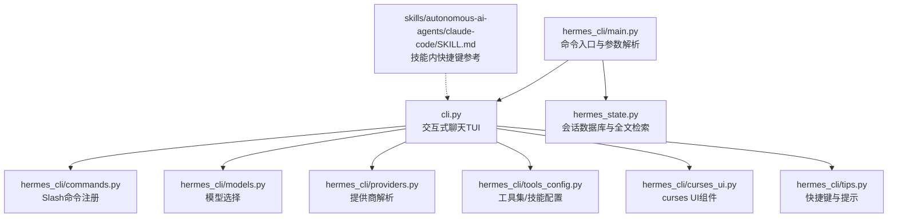
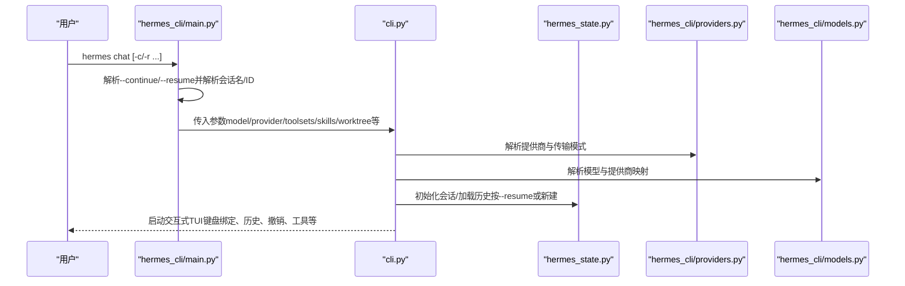
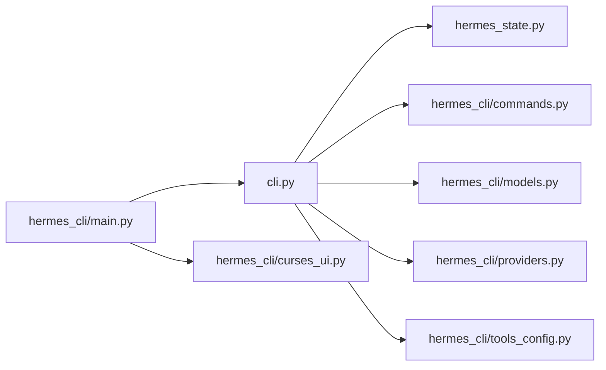

# 聊天命令

<cite>
**本文引用的文件**
- [hermes_cli/main.py](file://hermes_cli/main.py)
- [cli.py](file://cli.py)
- [hermes_cli/curses_ui.py](file://hermes_cli/curses_ui.py)
- [hermes_cli/commands.py](file://hermes_cli/commands.py)
- [hermes_cli/models.py](file://hermes_cli/models.py)
- [hermes_cli/providers.py](file://hermes_cli/providers.py)
- [hermes_cli/tools_config.py](file://hermes_cli/tools_config.py)
- [hermes_state.py](file://hermes_state.py)
- [hermes_cli/tips.py](file://hermes_cli/tips.py)
- [website/docs/user-guide/cli.md](file://website/docs/user-guide/cli.md)
- [skills/autonomous-ai-agents/claude-code/SKILL.md](file://skills/autonomous-ai-agents/claude-code/SKILL.md)
- [tests/hermes_cli/test_session_browse.py](file://tests/hermes_cli/test_session_browse.py)
- [tests/hermes_cli/test_coalesce_session_args.py](file://tests/hermes_cli/test_coalesce_session_args.py)
- [tests/cli/test_worktree.py](file://tests/cli/test_worktree.py)
</cite>

## 目录
1. [简介](#简介)
2. [项目结构](#项目结构)
3. [核心组件](#核心组件)
4. [架构总览](#架构总览)
5. [详细组件分析](#详细组件分析)
6. [依赖分析](#依赖分析)
7. [性能考虑](#性能考虑)
8. [故障排除指南](#故障排除指南)
9. [结论](#结论)
10. [附录](#附录)

## 简介
本文件面向Hermes Agent的聊天命令与交互式聊天界面，围绕 hermes chat、hermes -c/--continue、hermes -r/--resume 等命令展开，系统性说明：
- 交互式聊天界面的启动流程与控制流
- 会话管理与上下文保持机制（含会话继续/恢复）
- 命令参数作用与用法：--model、--provider、--toolsets、--skills 等
- 高级功能：会话继续、会话恢复、工作树模式（--worktree）
- 快捷键、搜索与会话浏览
- 使用示例与常见问题排查

## 项目结构
与聊天命令直接相关的模块与职责概览：
- hermes_cli/main.py：命令入口、参数解析、会话解析与聊天命令分发
- cli.py：交互式聊天TUI主逻辑、键盘绑定、历史/撤销、工具与技能集成
- hermes_cli/curses_ui.py：curses多选/单选菜单与回退方案
- hermes_cli/commands.py：Slash命令注册与自动补全
- hermes_cli/models.py、hermes_cli/providers.py：模型与提供商选择与解析
- hermes_cli/tools_config.py：工具集与技能配置
- hermes_state.py：会话数据库（SQLite）与全文检索
- hermes_cli/tips.py、website/docs/user-guide/cli.md：快捷键与使用提示
- 技能文档：技能内联快捷键与交互模式参考
- 测试：会话浏览、参数合并、工作树隔离等行为验证

**图表来源**
- [hermes_cli/main.py:676-784](file://hermes_cli/main.py#L676-L784)
- [cli.py:3789-8860](file://cli.py#L3789-L8860)
- [hermes_state.py:115-200](file://hermes_state.py#L115-L200)
- [hermes_cli/commands.py:59-169](file://hermes_cli/commands.py#L59-L169)
- [hermes_cli/models.py:525-559](file://hermes_cli/models.py#L525-L559)
- [hermes_cli/providers.py:303-430](file://hermes_cli/providers.py#L303-L430)
- [hermes_cli/tools_config.py:44-69](file://hermes_cli/tools_config.py#L44-L69)
- [hermes_cli/curses_ui.py:35-234](file://hermes_cli/curses_ui.py#L35-L234)
- [hermes_cli/tips.py:46-64](file://hermes_cli/tips.py#L46-L64)
- [skills/autonomous-ai-agents/claude-code/SKILL.md:428-466](file://skills/autonomous-ai-agents/claude-code/SKILL.md#L428-L466)

**章节来源**
- [hermes_cli/main.py:676-784](file://hermes_cli/main.py#L676-L784)
- [cli.py:3789-8860](file://cli.py#L3789-L8860)
- [hermes_state.py:115-200](file://hermes_state.py#L115-L200)
- [hermes_cli/commands.py:59-169](file://hermes_cli/commands.py#L59-L169)
- [hermes_cli/models.py:525-559](file://hermes_cli/models.py#L525-L559)
- [hermes_cli/providers.py:303-430](file://hermes_cli/providers.py#L303-L430)
- [hermes_cli/tools_config.py:44-69](file://hermes_cli/tools_config.py#L44-L69)
- [hermes_cli/curses_ui.py:35-234](file://hermes_cli/curses_ui.py#L35-L234)
- [hermes_cli/tips.py:46-64](file://hermes_cli/tips.py#L46-L64)
- [skills/autonomous-ai-agents/claude-code/SKILL.md:428-466](file://skills/autonomous-ai-agents/claude-code/SKILL.md#L428-L466)

## 核心组件
- hermes chat：默认进入交互式聊天；支持 --model、--provider、--toolsets、--skills、--resume、--worktree 等参数
- hermes -c/--continue：将当前CLI会话继续到最近一次CLI会话或指定名称/ID的会话
- hermes -r/--resume：按名称或ID恢复会话；支持多词会话名合并
- 交互式TUI：基于prompt_toolkit构建，支持历史导航、撤销、多行输入、语音、图像粘贴等
- 会话数据库：SQLite + FTS5，支持全文检索、消息索引与并发写入优化
- 模型与提供商：统一模型目录与提供商解析，支持别名与自定义端点
- 工具集与技能：可按平台启用/禁用工具集，支持技能命令与自动补全

**章节来源**
- [hermes_cli/main.py:676-784](file://hermes_cli/main.py#L676-L784)
- [cli.py:3789-8860](file://cli.py#L3789-L8860)
- [hermes_state.py:115-200](file://hermes_state.py#L115-L200)
- [hermes_cli/models.py:525-559](file://hermes_cli/models.py#L525-L559)
- [hermes_cli/providers.py:303-430](file://hermes_cli/providers.py#L303-L430)
- [hermes_cli/tools_config.py:44-69](file://hermes_cli/tools_config.py#L44-L69)

## 架构总览
下图展示从命令入口到TUI运行、会话恢复与数据库交互的关键路径。

**图表来源**
- [hermes_cli/main.py:676-784](file://hermes_cli/main.py#L676-L784)
- [cli.py:3789-8860](file://cli.py#L3789-L8860)
- [hermes_state.py:115-200](file://hermes_state.py#L115-L200)
- [hermes_cli/providers.py:303-430](file://hermes_cli/providers.py#L303-L430)
- [hermes_cli/models.py:525-559](file://hermes_cli/models.py#L525-L559)

## 详细组件分析

### hermes chat 命令与参数
- 默认行为：进入交互式聊天TUI
- 关键参数
  - --model：指定当前会话使用的模型
  - --provider：指定提供商（别名/ID），影响传输协议与认证方式
  - --toolsets：启用工具集（如web、terminal、file等）
  - --skills：启用技能（技能命令可通过/技能子命令访问）
  - --resume：按名称或ID恢复会话
  - --worktree：在Git工作树中隔离会话状态
  - --checkpoints：与文件系统快照/检查点相关（用于回滚/恢复）
  - --pass_session_id：将会话ID传递给下游（如外部工具）
  - --max-turns：限制最大轮次
  - --yolo：跳过危险命令审批
  - --source：为会话打标签（便于过滤）
  - --image：附加本地图片
  - --query：一次性查询模式（非交互）

- 参数解析与会话解析
  - --continue/-c：若未指定--resume，则尝试解析最近CLI会话或按名称解析
  - --resume：支持多词会话名合并（测试覆盖）
  - 会话解析：优先精确ID匹配，否则按标题解析（最新一条）

- 首次运行保护：若未检测到任何提供商配置，引导用户执行setup

**章节来源**
- [hermes_cli/main.py:676-784](file://hermes_cli/main.py#L676-L784)
- [tests/hermes_cli/test_coalesce_session_args.py:71-99](file://tests/hermes_cli/test_coalesce_session_args.py#L71-L99)
- [tests/hermes_cli/test_session_browse.py:373-394](file://tests/hermes_cli/test_session_browse.py#L373-L394)

### 交互式聊天界面（TUI）
- 键盘绑定与快捷键
  - Enter：发送消息
  - Alt+Enter / Ctrl+J：多行输入换行
  - Ctrl+C：中断/取消/退出
  - Ctrl+D：退出
  - Ctrl+Z：挂起到后台（Unix）
  - Tab：接受建议/自动补全
  - Ctrl+V：粘贴文本与图片
  - Ctrl+B：语音录制（可配置）
  - 上/下箭头：历史浏览
  - Esc Esc：回溯/总结
  - Shift+Tab：切换权限模式
  - Alt+P：切换模型
  - Alt+T：切换思考模式
  - Alt+O：切换Fast模式

- 功能特性
  - 多行输入、历史导航、撤销上一轮用户-助手对话
  - 工具与技能列表展示、自动补全
  - 语音模式（录音键可配置）、图像粘贴
  - 会话标题设置、背景任务、队列提示等

- 与Slash命令的集成
  - 输入/触发命令自动补全与帮助
  - 内置命令包括：new、clear、history、retry、undo、title、branch、compress、rollback、snapshot、stop、approve、deny、background、btw、queue、status、model、provider、tools、toolsets、skills、cron、reload、reload-mcp、browser、plugins、commands、help、restart、usage、insights、platforms、paste、image、update、debug、quit等

**章节来源**
- [cli.py:3789-8860](file://cli.py#L3789-L8860)
- [hermes_cli/commands.py:59-169](file://hermes_cli/commands.py#L59-L169)
- [hermes_cli/tips.py:46-64](file://hermes_cli/tips.py#L46-L64)
- [website/docs/user-guide/cli.md:86-121](file://website/docs/user-guide/cli.md#L86-L121)
- [skills/autonomous-ai-agents/claude-code/SKILL.md:428-466](file://skills/autonomous-ai-agents/claude-code/SKILL.md#L428-L466)

### 会话管理与上下文保持
- 会话数据库（SQLite + FTS5）
  - 存储会话元数据、消息历史、令牌统计、计费信息等
  - 支持全文检索（messages_fts），便于会话搜索
  - 并发写入优化：短超时+随机抖动重试，避免写锁“车队效应”

- 会话继续与恢复
  - --continue：解析最近CLI会话或按名称解析后作为--resume
  - --resume：支持名称/ID解析，若解析失败则报错
  - 会话浏览：内置交互式浏览（支持搜索过滤、方向键导航、Enter选择、Esc退出）

- 历史与撤销
  - 支持撤销上一个用户回合（删除对应消息数量）
  - 历史显示与最近会话列表展示

**章节来源**
- [hermes_state.py:115-200](file://hermes_state.py#L115-L200)
- [cli.py:3998-4032](file://cli.py#L3998-L4032)
- [cli.py:4422-4442](file://cli.py#L4422-L4442)
- [hermes_cli/main.py:295-527](file://hermes_cli/main.py#L295-L527)

### 模型与提供商
- 模型目录与提供商
  - 统一模型目录（OpenRouter、各提供商模型清单）
  - 提供器别名与标准化（如anthropic、github、alibaba等）
  - 自定义提供商与用户配置覆盖

- 传输模式与API模式
  - 基于提供商识别传输类型（openai_chat、anthropic_messages、codex_responses等）
  - URL启发式推断未知提供商的API模式

**章节来源**
- [hermes_cli/models.py:525-559](file://hermes_cli/models.py#L525-L559)
- [hermes_cli/providers.py:303-430](file://hermes_cli/providers.py#L303-L430)

### 工具集与技能
- 工具集
  - 可配置工具集（web、browser、terminal、file、code_execution、vision、image_gen、moa、tts、skills、todo、memory、session_search、clarify、delegation、cronjob、messaging、rl、homeassistant）
  - 按平台启用/禁用，支持插件扩展

- 技能
  - 技能命令注册与自动补全
  - 通过/技能子命令浏览与安装

**章节来源**
- [hermes_cli/tools_config.py:44-69](file://hermes_cli/tools_config.py#L44-L69)
- [hermes_cli/commands.py:59-169](file://hermes_cli/commands.py#L59-L169)

### 工作树模式（--worktree）
- 在Git仓库根目录创建独立工作树隔离会话状态
- 退出时清理工作树（若无未推送提交）
- 支持清理过期工作树（按时间阈值）

**章节来源**
- [tests/cli/test_worktree.py:179-240](file://tests/cli/test_worktree.py#L179-L240)
- [tests/cli/test_worktree.py:406-529](file://tests/cli/test_worktree.py#L406-L529)

## 依赖分析
- 命令入口对TUI与会话数据库的依赖
- TUI对命令注册、模型/提供商解析、工具集/技能配置的依赖
- 会话浏览对curses UI与会话数据库的依赖

**图表来源**
- [hermes_cli/main.py:676-784](file://hermes_cli/main.py#L676-L784)
- [cli.py:3789-8860](file://cli.py#L3789-L8860)
- [hermes_state.py:115-200](file://hermes_state.py#L115-L200)
- [hermes_cli/commands.py:59-169](file://hermes_cli/commands.py#L59-L169)
- [hermes_cli/models.py:525-559](file://hermes_cli/models.py#L525-L559)
- [hermes_cli/providers.py:303-430](file://hermes_cli/providers.py#L303-L430)
- [hermes_cli/tools_config.py:44-69](file://hermes_cli/tools_config.py#L44-L69)
- [hermes_cli/curses_ui.py:35-234](file://hermes_cli/curses_ui.py#L35-L234)

**章节来源**
- [hermes_cli/main.py:676-784](file://hermes_cli/main.py#L676-L784)
- [cli.py:3789-8860](file://cli.py#L3789-L8860)
- [hermes_state.py:115-200](file://hermes_state.py#L115-L200)
- [hermes_cli/commands.py:59-169](file://hermes_cli/commands.py#L59-L169)
- [hermes_cli/models.py:525-559](file://hermes_cli/models.py#L525-L559)
- [hermes_cli/providers.py:303-430](file://hermes_cli/providers.py#L303-L430)
- [hermes_cli/tools_config.py:44-69](file://hermes_cli/tools_config.py#L44-L69)
- [hermes_cli/curses_ui.py:35-234](file://hermes_cli/curses_ui.py#L35-L234)

## 性能考虑
- 数据库写入竞争缓解：短超时+随机抖动重试，降低“车队效应”
- FTS5全文检索：加速会话内容搜索
- 工具令牌估算缓存：减少重复计算
- 会话浏览的curses渲染与滚动优化：自适应终端宽度、可见区域裁剪

[本节为通用指导，不涉及具体文件分析]

## 故障排除指南
- 无法进入聊天：首次运行未配置提供商
  - 现象：提示需要运行setup
  - 处理：执行 hermes setup 或配置至少一个提供商的凭据
- 会话恢复失败
  - 现象：找不到匹配的会话
  - 处理：使用 hermes sessions browse 查看并选择；或使用 hermes sessions list 查看完整列表
- 会话名/ID解析异常
  - 现象：--continue 指定名称但未找到
  - 处理：确认名称大小写/拼写；支持多词名称合并（测试覆盖）
- 工作树模式异常
  - 现象：工作树未清理或残留
  - 处理：确保无未推送提交；过期工作树会在启动时清理
- 键盘绑定冲突
  - 现象：某些终端/环境不支持特定组合键
  - 处理：参考快捷键表调整或使用替代键；Alt+V粘贴图片需终端支持

**章节来源**
- [hermes_cli/main.py:676-784](file://hermes_cli/main.py#L676-L784)
- [cli.py:3789-8860](file://cli.py#L3789-L8860)
- [tests/hermes_cli/test_session_browse.py:373-394](file://tests/hermes_cli/test_session_browse.py#L373-L394)
- [tests/cli/test_worktree.py:206-240](file://tests/cli/test_worktree.py#L206-L240)

## 结论
Hermes Agent的聊天命令以简洁的CLI入口对接强大的交互式TUI，结合会话数据库与工具/技能生态，提供了从基础对话到复杂任务编排的一体化体验。通过--continue/--resume实现无缝会话延续，--worktree保障开发态隔离，配合丰富的快捷键与搜索能力，满足多场景高效协作需求。

[本节为总结性内容，不涉及具体文件分析]

## 附录

### 常用命令与参数速查
- hermes chat [--model ...] [--provider ...] [--toolsets ...] [--skills ...] [--resume ...] [--worktree] [--checkpoints] [--pass_session_id] [--max-turns ...]
- hermes -c/--continue ["会话名称"]：继续最近CLI会话或指定名称/ID
- hermes -r/--resume "会话名称或ID"：恢复指定会话
- hermes sessions browse：交互式浏览与搜索会话
- hermes sessions list：列出所有会话

**章节来源**
- [hermes_cli/main.py:676-784](file://hermes_cli/main.py#L676-L784)
- [hermes_cli/main.py:295-527](file://hermes_cli/main.py#L295-L527)

### 使用示例
- 会话继续
  - hermes -c
  - hermes -c "我的项目讨论"
- 会话恢复
  - hermes -r "20250401_abc123"
  - hermes -r "日常开发"
- 工作树模式
  - hermes chat --worktree
  - hermes -c --worktree "隔离开发"
- 指定模型与提供商
  - hermes chat --model gpt-5.4 --provider openrouter
- 启用工具集与技能
  - hermes chat --toolsets web,terminal --skills hermes-agent-dev,github-auth

**章节来源**
- [hermes_cli/main.py:676-784](file://hermes_cli/main.py#L676-L784)
- [hermes_cli/models.py:525-559](file://hermes_cli/models.py#L525-L559)
- [hermes_cli/providers.py:303-430](file://hermes_cli/providers.py#L303-L430)
- [hermes_cli/tools_config.py:44-69](file://hermes_cli/tools_config.py#L44-L69)