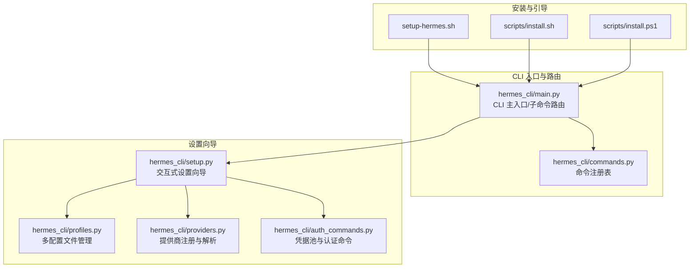
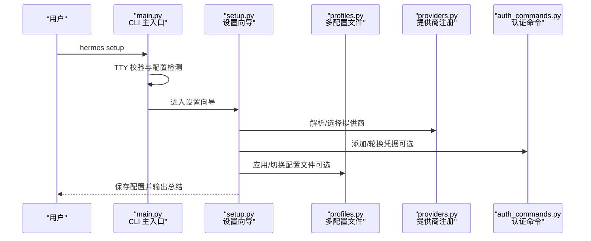
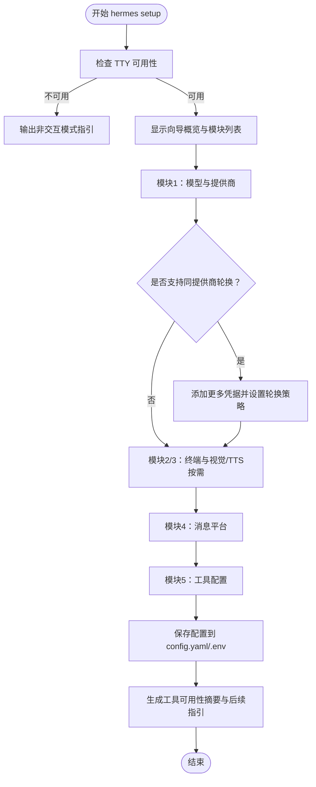
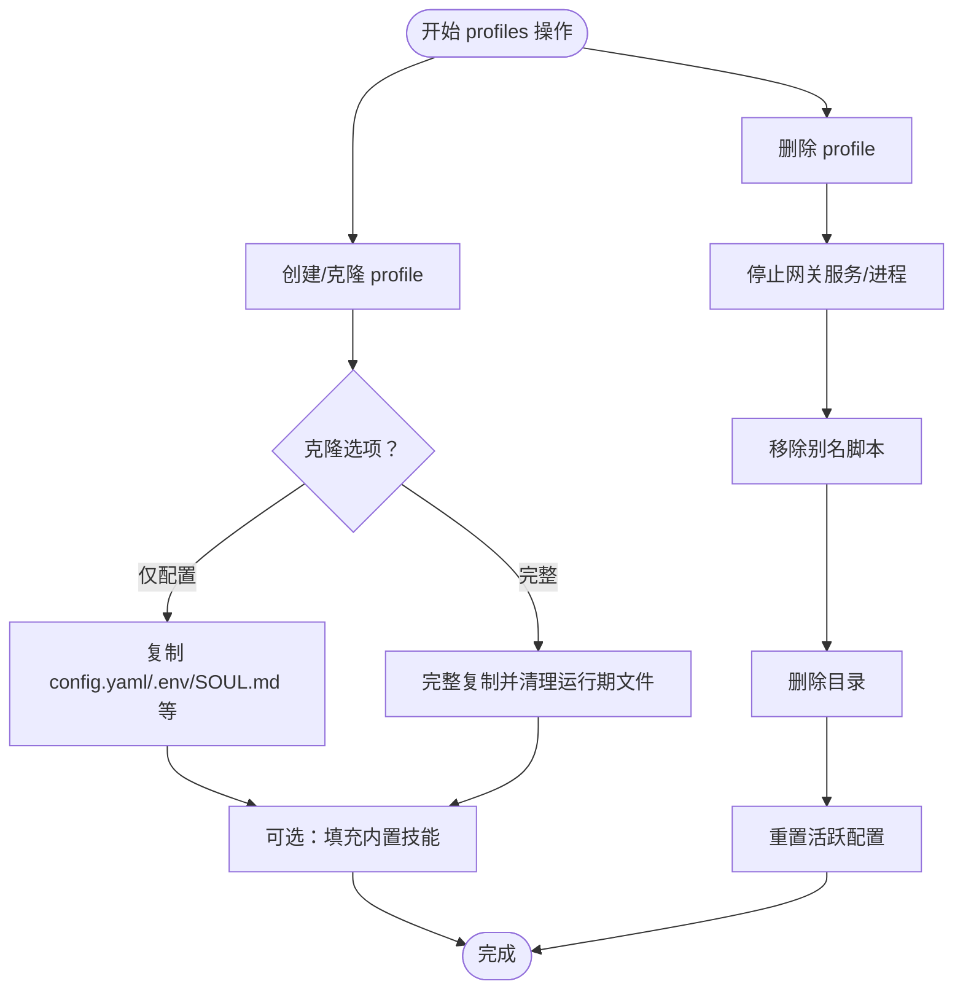
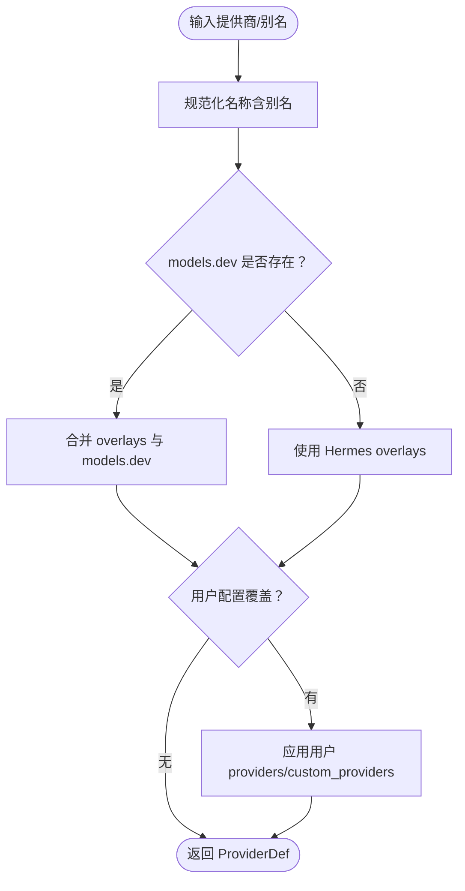
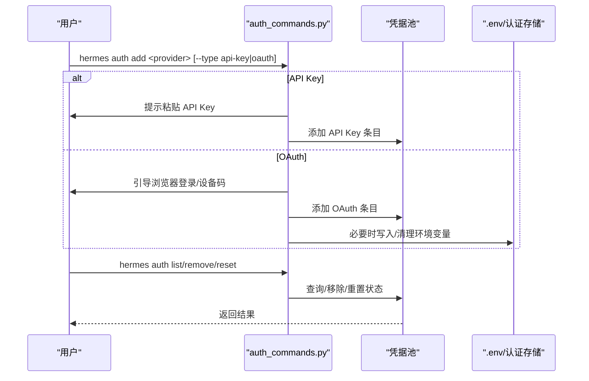
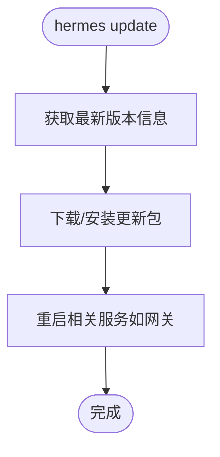
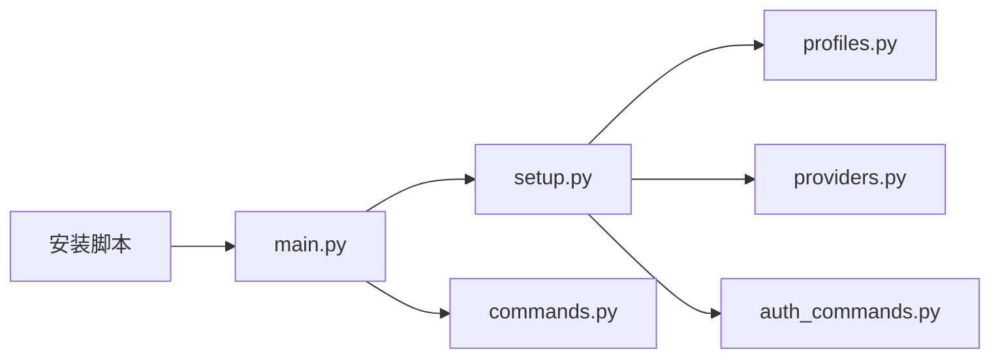

# 设置命令

<cite>
**本文引用的文件**
- [hermes_cli/setup.py](file://hermes_cli/setup.py)
- [hermes_cli/main.py](file://hermes_cli/main.py)
- [hermes_cli/profiles.py](file://hermes_cli/profiles.py)
- [hermes_cli/providers.py](file://hermes_cli/providers.py)
- [hermes_cli/auth_commands.py](file://hermes_cli/auth_commands.py)
- [hermes_cli/commands.py](file://hermes_cli/commands.py)
- [setup-hermes.sh](file://setup-hermes.sh)
- [scripts/install.sh](file://scripts/install.sh)
- [scripts/install.ps1](file://scripts/install.ps1)
</cite>

## 目录
1. [简介](#简介)
2. [项目结构](#项目结构)
3. [核心组件](#核心组件)
4. [架构总览](#架构总览)
5. [详细组件分析](#详细组件分析)
6. [依赖关系分析](#依赖关系分析)
7. [性能考量](#性能考量)
8. [故障排除指南](#故障排除指南)
9. [结论](#结论)
10. [附录](#附录)

## 简介
本文件系统性梳理 Hermes Agent 的设置命令与工作流，重点覆盖以下方面：
- hermes setup 交互式设置向导：分模块引导用户完成模型/提供商、终端后端、代理设置、消息平台、工具等配置。
- hermes logout 认证清理：清除存储的认证信息与凭据池条目。
- hermes update 版本更新：升级到最新版本。
- 配置文件管理：config.yaml 与 .env 的位置、写入策略与验证。
- 认证状态处理：凭据池、OAuth 登录、环境变量注入与清理。
- 命令参数选择：--profile、--provider、--model 的使用与配置方法。
- 多配置文件管理：多配置文件（profiles）隔离与切换。
- 安全考虑与最佳实践：凭据存储、最小暴露原则、轮换策略。
- 故障排除：常见配置问题与解决路径。

## 项目结构
围绕设置命令的关键模块与文件如下：
- hermes_cli/setup.py：交互式设置向导主入口与各模块配置流程。
- hermes_cli/main.py：CLI 主入口、子命令路由、TTY 校验、配置检测与启动逻辑。
- hermes_cli/profiles.py：多配置文件（profiles）管理：创建、克隆、删除、别名脚本、活跃配置等。
- hermes_cli/providers.py：提供商注册与解析：内置提供商、别名映射、传输协议、认证类型等。
- hermes_cli/auth_commands.py：凭据池与认证命令：添加、列出、移除、重置、轮换策略等。
- hermes_cli/commands.py：命令注册表与自动补全，包含 update、config、model、provider 等命令定义。
- 安装脚本：setup-hermes.sh、scripts/install.sh、scripts/install.ps1 提供首次安装与引导。

**图表来源**
- [hermes_cli/main.py](file://hermes_cli/main.py)
- [hermes_cli/setup.py](file://hermes_cli/setup.py)
- [hermes_cli/profiles.py](file://hermes_cli/profiles.py)
- [hermes_cli/providers.py](file://hermes_cli/providers.py)
- [hermes_cli/auth_commands.py](file://hermes_cli/auth_commands.py)
- [hermes_cli/commands.py](file://hermes_cli/commands.py)
- [setup-hermes.sh](file://setup-hermes.sh)
- [scripts/install.sh](file://scripts/install.sh)
- [scripts/install.ps1](file://scripts/install.ps1)

**章节来源**
- [hermes_cli/main.py](file://hermes_cli/main.py)
- [hermes_cli/setup.py](file://hermes_cli/setup.py)
- [hermes_cli/profiles.py](file://hermes_cli/profiles.py)
- [hermes_cli/providers.py](file://hermes_cli/providers.py)
- [hermes_cli/auth_commands.py](file://hermes_cli/auth_commands.py)
- [hermes_cli/commands.py](file://hermes_cli/commands.py)
- [setup-hermes.sh](file://setup-hermes.sh)
- [scripts/install.sh](file://scripts/install.sh)
- [scripts/install.ps1](file://scripts/install.ps1)

## 核心组件
- 交互式设置向导（hermes setup）
  - 分模块配置：模型与提供商、终端后端、代理设置、消息平台、工具。
  - 自动保存配置到 config.yaml 与 .env；支持非交互模式提示。
- 凭据池与认证（hermes auth）
  - 支持 API Key 与 OAuth（设备码、外部浏览器）两种认证方式。
  - 同提供商多凭据轮换策略：填满优先、轮询、最少使用、随机。
  - 支持从环境变量或共享认证源导入凭据。
- 多配置文件（profiles）
  - 每个 profile 是独立的 HERMES_HOME，包含各自的 config.yaml、.env、内存、会话、技能、网关、计划、工作区、日志、定时任务等。
  - 支持创建、克隆（仅配置/完整）、删除、别名脚本、活跃配置粘性设置。
- 提供商注册与解析（providers）
  - 内置提供商与别名映射，合并 overlays 与用户自定义配置。
  - 识别传输协议（chat_completions、anthropic_messages、codex_responses 等）与认证类型（api_key、oauth_*）。
- 更新与诊断（hermes update、doctor）
  - hermes update 升级到最新版本。
  - hermes doctor 检查配置与依赖。

**章节来源**
- [hermes_cli/setup.py](file://hermes_cli/setup.py)
- [hermes_cli/auth_commands.py](file://hermes_cli/auth_commands.py)
- [hermes_cli/profiles.py](file://hermes_cli/profiles.py)
- [hermes_cli/providers.py](file://hermes_cli/providers.py)
- [hermes_cli/commands.py](file://hermes_cli/commands.py)

## 架构总览
设置命令在 CLI 中的调用链路如下：

**图表来源**
- [hermes_cli/main.py](file://hermes_cli/main.py)
- [hermes_cli/setup.py](file://hermes_cli/setup.py)
- [hermes_cli/profiles.py](file://hermes_cli/profiles.py)
- [hermes_cli/providers.py](file://hermes_cli/providers.py)
- [hermes_cli/auth_commands.py](file://hermes_cli/auth_commands.py)

## 详细组件分析

### 组件一：交互式设置向导（hermes setup）
- 功能要点
  - 分模块引导：模型与提供商、终端后端、代理设置、消息平台、工具。
  - 非交互模式提示：当 stdin 不可用时，提示通过环境变量或 hermes config set 配置。
  - 保存策略：先写入磁盘，再刷新向导内存配置，避免覆盖新写入内容。
  - 同提供商凭据池：对支持的提供商，可配置多凭据与轮换策略，提升可用性。
  - 视觉能力与 TTS：根据提供商能力提示是否需要额外配置。
- 关键流程
  - 选择提供商与模型：委托给 hermes model 的公共流程。
  - 凭据池配置：按需添加多个同提供商凭据，并设置轮换策略。
  - 工具可用性汇总：基于订阅与环境变量判断各类工具是否可用。
  - 输出总结：打印配置文件位置与后续操作建议。

**图表来源**
- [hermes_cli/setup.py](file://hermes_cli/setup.py)

**章节来源**
- [hermes_cli/setup.py](file://hermes_cli/setup.py)

### 组件二：多配置文件管理（profiles）
- 功能要点
  - 每个 profile 是独立的 HERMES_HOME，包含各自配置与数据。
  - 默认 profile 为 ~/.hermes；命名 profile 存放于 ~/.hermes/profiles/<name>/。
  - 支持创建、克隆（仅配置/完整）、删除、活跃配置粘性设置、别名脚本（~/.local/bin/<name>）。
  - 导出/导入：默认 profile 导出时排除基础设施与缓存文件，便于便携备份。
- 关键流程
  - 创建：校验名称合法性、创建目录结构、可选复制配置与记忆文件。
  - 克隆：支持 --clone（仅配置）与 --clone-all（完整），并清理运行期文件。
  - 删除：停止网关服务、移除别名脚本、删除目录、重置活跃配置。
  - 别名脚本：安全冲突检测，允许覆盖自有脚本。

**图表来源**
- [hermes_cli/profiles.py](file://hermes_cli/profiles.py)

**章节来源**
- [hermes_cli/profiles.py](file://hermes_cli/profiles.py)

### 组件三：提供商注册与解析（providers）
- 功能要点
  - 合并 models.dev 目录、Hermes overlays 与用户配置，形成最终 ProviderDef。
  - 别名映射：将人类友好名称映射到规范提供商 ID。
  - 传输协议与认证类型：决定 API 模式（chat_completions、anthropic_messages、codex_responses 等）与认证方式。
- 关键流程
  - 规范化提供商名称（含别名）。
  - 优先从 models.dev 获取信息，否则回退到 Hermes overlays。
  - 用户自定义 providers 与 custom_providers 覆盖合并。

**图表来源**
- [hermes_cli/providers.py](file://hermes_cli/providers.py)

**章节来源**
- [hermes_cli/providers.py](file://hermes_cli/providers.py)

### 组件四：凭据池与认证命令（auth）
- 功能要点
  - 支持 API Key 与 OAuth（设备码、外部浏览器）两类认证。
  - 同提供商多凭据轮换策略：fill_first、round_robin、least_used、random。
  - 交互式与非交互式两种添加方式；支持从环境变量或共享认证源导入。
  - 列表、移除、重置状态（冷却时间）等管理命令。
- 关键流程
  - 添加凭据：根据提供商类型选择 API Key 或 OAuth 流程，生成带标签的凭据条目。
  - 移除凭据：支持按索引、ID、标签匹配；必要时同步清理 .env 或底层认证存储。
  - 轮换策略：持久化到 config.yaml 的 credential_pool_strategies 字段。

**图表来源**
- [hermes_cli/auth_commands.py](file://hermes_cli/auth_commands.py)

**章节来源**
- [hermes_cli/auth_commands.py](file://hermes_cli/auth_commands.py)

### 组件五：命令注册与更新（commands、update）
- 命令注册
  - commands.py 定义了所有命令及其分类、别名、子命令与参数提示，包括 update、config、model、provider 等。
- 更新流程
  - hermes update 升级到最新版本；安装脚本（setup-hermes.sh、scripts/install.sh、scripts/install.ps1）在安装后引导用户运行 hermes setup 并提供后续命令提示。

**图表来源**
- [hermes_cli/commands.py](file://hermes_cli/commands.py)
- [setup-hermes.sh](file://setup-hermes.sh)
- [scripts/install.sh](file://scripts/install.sh)
- [scripts/install.ps1](file://scripts/install.ps1)

**章节来源**
- [hermes_cli/commands.py](file://hermes_cli/commands.py)
- [setup-hermes.sh](file://setup-hermes.sh)
- [scripts/install.sh](file://scripts/install.sh)
- [scripts/install.ps1](file://scripts/install.ps1)

## 依赖关系分析
- 模块耦合
  - setup.py 依赖 providers.py（解析提供商）、auth_commands.py（凭据池）、profiles.py（配置文件切换）、config（读写配置）。
  - main.py 作为 CLI 入口，负责 TTY 校验、配置检测、profile 覆盖与子命令路由。
  - commands.py 为命令定义中心，被 gateway、CLI、自动补全等共享使用。
- 外部依赖
  - 安装脚本依赖系统包管理器与 Python venv；Windows 与类 Unix 系统分别提供不同安装流程。
  - 网关与消息平台配置依赖各平台的令牌与回调地址（由 setup 向导引导）。

**图表来源**
- [hermes_cli/main.py](file://hermes_cli/main.py)
- [hermes_cli/setup.py](file://hermes_cli/setup.py)
- [hermes_cli/profiles.py](file://hermes_cli/profiles.py)
- [hermes_cli/providers.py](file://hermes_cli/providers.py)
- [hermes_cli/auth_commands.py](file://hermes_cli/auth_commands.py)
- [hermes_cli/commands.py](file://hermes_cli/commands.py)
- [setup-hermes.sh](file://setup-hermes.sh)
- [scripts/install.sh](file://scripts/install.sh)
- [scripts/install.ps1](file://scripts/install.ps1)

**章节来源**
- [hermes_cli/main.py](file://hermes_cli/main.py)
- [hermes_cli/setup.py](file://hermes_cli/setup.py)
- [hermes_cli/profiles.py](file://hermes_cli/profiles.py)
- [hermes_cli/providers.py](file://hermes_cli/providers.py)
- [hermes_cli/auth_commands.py](file://hermes_cli/auth_commands.py)
- [hermes_cli/commands.py](file://hermes_cli/commands.py)
- [setup-hermes.sh](file://setup-hermes.sh)
- [scripts/install.sh](file://scripts/install.sh)
- [scripts/install.ps1](file://scripts/install.ps1)

## 性能考量
- 非交互模式：当 stdin 不可用时，setup 将提示通过环境变量或 hermes config set 配置，避免阻塞与无效等待。
- 凭据池轮换：合理设置轮换策略（如 round_robin）可均衡负载与配额使用，减少因单凭据耗尽导致的中断。
- 配置写入：向导先写入磁盘再刷新内存配置，避免覆盖新写入内容，确保一致性。
- 安装与更新：安装脚本与更新流程尽量减少不必要的依赖加载与网络请求，提升首启体验。

[本节为通用指导，无需特定文件引用]

## 故障排除指南
- 无法进入交互式设置
  - 现象：提示“需要交互式终端”。
  - 原因：stdin 不是 TTY。
  - 处理：直接在终端中运行 hermes setup；或在非交互环境中使用 hermes config set 或环境变量进行配置。
- 配置未生效
  - 现象：修改后仍提示未配置。
  - 原因：未写入 config.yaml/.env 或未重新加载。
  - 处理：确认已保存；必要时运行 hermes doctor 检查配置与依赖；或手动编辑 ~/.hermes/config.yaml 与 ~/.hermes/.env。
- 凭据池未轮换
  - 现象：凭据耗尽后无备用。
  - 原因：未添加多凭据或未设置轮换策略。
  - 处理：使用 hermes auth add 添加更多凭据；使用 hermes auth（交互）或直接在 config.yaml 设置 credential_pool_strategies。
- 多配置文件冲突
  - 现象：命令冲突或路径错误。
  - 原因：别名与系统命令冲突或路径不在 PATH。
  - 处理：检查 ~/.local/bin 是否在 PATH；删除冲突别名脚本后重新创建；或使用 hermes -p <profile> 指定配置文件。
- Windows 安装后无法运行
  - 现象：hermes 命令不可用。
  - 原因：未激活虚拟环境或未将安装目录加入 PATH。
  - 处理：参考 scripts/install.ps1 的引导步骤，确保使用 venv 的 Python 执行 hermes；或在 PowerShell 中使用完整路径。

**章节来源**
- [hermes_cli/main.py](file://hermes_cli/main.py)
- [hermes_cli/setup.py](file://hermes_cli/setup.py)
- [hermes_cli/auth_commands.py](file://hermes_cli/auth_commands.py)
- [hermes_cli/profiles.py](file://hermes_cli/profiles.py)
- [scripts/install.ps1](file://scripts/install.ps1)

## 结论
- hermes setup 提供了从零到一的完整配置体验，覆盖模型提供商、终端后端、代理设置、消息平台与工具配置，并在非交互环境下提供明确的替代方案。
- 多配置文件（profiles）使用户可在同一系统内隔离运行多个 Hermes 实例，适合开发、测试与多角色场景。
- 凭据池与认证命令提供了灵活的多凭据管理与轮换策略，显著提升稳定性与可用性。
- 命令注册与安装脚本确保了 CLI 的一致性与跨平台部署体验。
- 建议在生产环境遵循最小暴露原则、定期轮换凭据、使用 profiles 隔离敏感配置，并通过 hermes doctor 定期巡检。

[本节为总结性内容，无需特定文件引用]

## 附录

### 设置命令参数与配置方法
- hermes setup
  - 作用：交互式设置向导，分模块引导配置。
  - 参数：无固定参数；在非交互环境中会提示使用 hermes config set 或环境变量。
- hermes logout
  - 作用：清理存储的认证信息与凭据池条目。
  - 行为：移除指定提供商的凭据；必要时清理 .env 与底层认证存储。
- hermes update
  - 作用：升级到最新版本。
  - 行为：下载并安装更新包，必要时重启相关服务。

**章节来源**
- [hermes_cli/setup.py](file://hermes_cli/setup.py)
- [hermes_cli/auth_commands.py](file://hermes_cli/auth_commands.py)
- [hermes_cli/commands.py](file://hermes_cli/commands.py)

### 多配置文件管理（profiles）示例
- 创建与克隆
  - hermes profile create <name>：创建空配置文件夹与目录结构。
  - hermes profile create <name> --clone：复制当前配置到新 profile。
  - hermes profile create <name> --clone-all：完整复制当前 profile。
- 别名与活跃配置
  - hermes profile use <name>：设置粘性活跃配置。
  - ~/.local/bin/<name>：创建别名脚本，直接以 hermes -p <name> 运行。
- 删除
  - hermes profile delete <name>：停止网关、移除别名脚本、删除目录并重置活跃配置。

**章节来源**
- [hermes_cli/profiles.py](file://hermes_cli/profiles.py)

### 认证状态处理与清理机制
- 凭据池
  - 支持 API Key 与 OAuth（设备码、外部浏览器）。
  - 多凭据轮换策略：fill_first、round_robin、least_used、random。
- 清理
  - hermes auth remove：按索引/ID/标签移除；必要时同步清理 .env 或底层存储。
  - hermes auth reset：重置提供商凭据状态（冷却时间）。
  - hermes logout：清理存储的认证信息与凭据池条目。

**章节来源**
- [hermes_cli/auth_commands.py](file://hermes_cli/auth_commands.py)

### 安全考虑与最佳实践
- 最小暴露原则：仅在必要时暴露 API Key；优先使用 OAuth 设备码登录。
- 多凭据轮换：为高并发或长周期任务准备备用凭据，避免单一凭据耗尽。
- 配置隔离：使用 profiles 隔离开发/生产配置；避免将敏感凭据提交到版本控制。
- 定期审计：使用 hermes doctor 检查配置与依赖；定期轮换凭据并清理过期条目。
- 非交互环境：通过 hermes config set 或环境变量进行配置，避免在 CI/CD 中交互式输入。

**章节来源**
- [hermes_cli/setup.py](file://hermes_cli/setup.py)
- [hermes_cli/auth_commands.py](file://hermes_cli/auth_commands.py)
- [hermes_cli/profiles.py](file://hermes_cli/profiles.py)