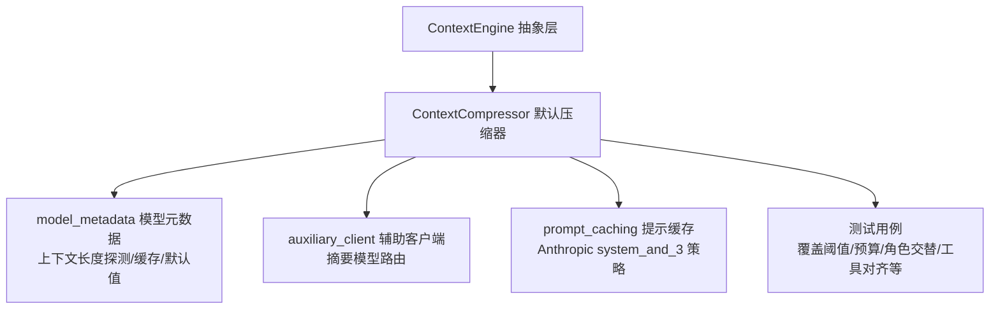
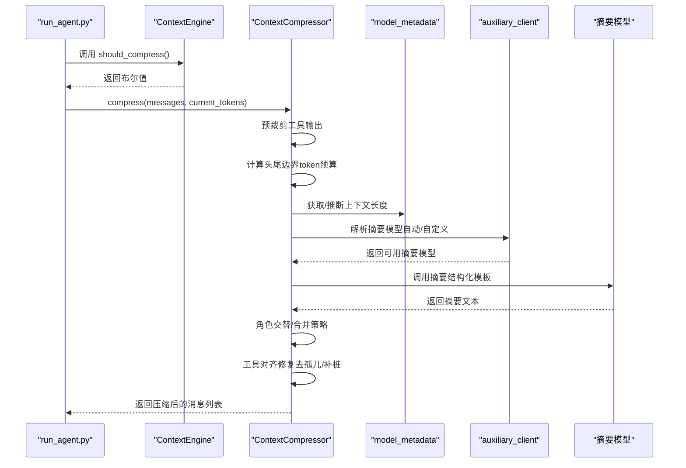
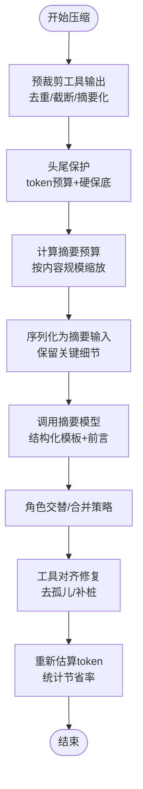
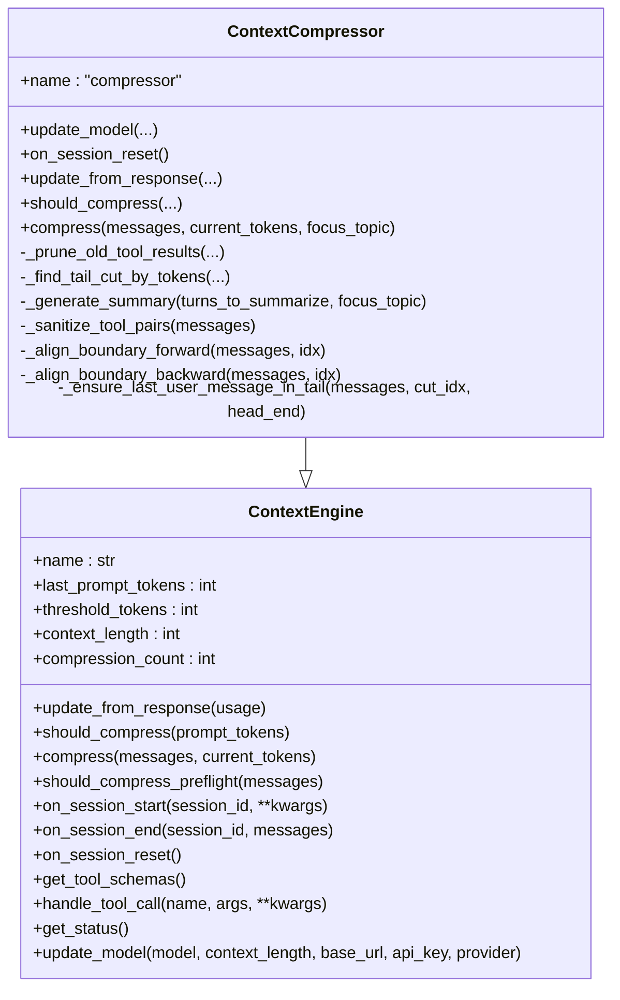

# 上下文压缩与缓存

<cite>
**本文引用的文件**
- [agent/context_compressor.py](file://agent/context_compressor.py)
- [agent/context_engine.py](file://agent/context_engine.py)
- [agent/prompt_caching.py](file://agent/prompt_caching.py)
- [agent/model_metadata.py](file://agent/model_metadata.py)
- [agent/auxiliary_client.py](file://agent/auxiliary_client.py)
- [tests/agent/test_context_compressor.py](file://tests/agent/test_context_compressor.py)
- [tests/agent/test_context_engine.py](file://tests/agent/test_context_engine.py)
- [tests/agent/test_model_metadata.py](file://tests/agent/test_model_metadata.py)
</cite>

## 目录
1. [简介](#简介)
2. [项目结构](#项目结构)
3. [核心组件](#核心组件)
4. [架构总览](#架构总览)
5. [详细组件分析](#详细组件分析)
6. [依赖关系分析](#依赖关系分析)
7. [性能考量](#性能考量)
8. [故障排查指南](#故障排查指南)
9. [结论](#结论)

## 简介
本技术文档聚焦于 Hermes Agent 的上下文压缩与缓存系统，围绕 ContextCompressor 类展开，深入解析其上下文长度估算、压缩算法选择、缓存策略设计、上下文引擎工作机制、智能压缩触发条件、压缩质量评估、提示缓存实现细节（含缓存键生成、命中率优化与过期策略）、多模型上下文限制处理、token 估算精度与性能优化技巧，并结合测试用例给出可复现的使用模式与排错建议。

## 项目结构
与上下文压缩与缓存直接相关的核心模块如下：
- 上下文引擎抽象：定义统一接口与生命周期管理
- 默认压缩器：实现基于摘要的上下文压缩与摘要迭代更新
- 模型元数据：上下文长度探测、默认值、缓存与错误解析
- 辅助客户端：为摘要生成提供低成本/快速摘要模型的路由
- 提示缓存：针对特定模型（如 Anthropic）的前缀缓存控制

图表来源
- [agent/context_engine.py:1-185](file://agent/context_engine.py#L1-L185)
- [agent/context_compressor.py:188-1164](file://agent/context_compressor.py#L188-L1164)
- [agent/model_metadata.py:1-800](file://agent/model_metadata.py#L1-L800)
- [agent/auxiliary_client.py:1-800](file://agent/auxiliary_client.py#L1-L800)
- [agent/prompt_caching.py:1-73](file://agent/prompt_caching.py#L1-L73)
- [tests/agent/test_context_compressor.py:1-784](file://tests/agent/test_context_compressor.py#L1-L784)

章节来源
- [agent/context_engine.py:1-185](file://agent/context_engine.py#L1-L185)
- [agent/context_compressor.py:188-1164](file://agent/context_compressor.py#L188-L1164)
- [agent/model_metadata.py:1-800](file://agent/model_metadata.py#L1-L800)
- [agent/auxiliary_client.py:1-800](file://agent/auxiliary_client.py#L1-L800)
- [agent/prompt_caching.py:1-73](file://agent/prompt_caching.py#L1-L73)
- [tests/agent/test_context_compressor.py:1-784](file://tests/agent/test_context_compressor.py#L1-L784)
- [tests/agent/test_context_engine.py:1-251](file://tests/agent/test_context_engine.py#L1-L251)
- [tests/agent/test_model_metadata.py:1-714](file://tests/agent/test_model_metadata.py#L1-L714)

## 核心组件
- ContextEngine 抽象基类：定义压缩器生命周期、阈值参数、是否压缩判断、压缩入口、工具扩展点与状态显示。
- ContextCompressor：默认压缩器，实现“预裁剪工具输出 → 头尾保护（按 token 预算）→ 结构化摘要 → 工具对齐修复 → 角色交替与合并策略”的完整流程。
- model_metadata：提供模型上下文长度探测、默认值映射、持久化缓存、错误消息解析、端点元数据抓取与本地服务器探测。
- auxiliary_client：为摘要生成提供自动/自定义/多提供商的辅助客户端链路，确保在主模型不可用时仍能进行摘要。
- prompt_caching：针对 Anthropic 的提示缓存策略，通过在系统提示与最近若干条消息上注入缓存标记，显著降低输入 token 成本。

章节来源
- [agent/context_engine.py:32-185](file://agent/context_engine.py#L32-L185)
- [agent/context_compressor.py:188-1164](file://agent/context_compressor.py#L188-L1164)
- [agent/model_metadata.py:1-800](file://agent/model_metadata.py#L1-L800)
- [agent/auxiliary_client.py:1-800](file://agent/auxiliary_client.py#L1-L800)
- [agent/prompt_caching.py:1-73](file://agent/prompt_caching.py#L1-L73)

## 架构总览
上下文压缩与缓存系统的运行时交互如下：

图表来源
- [agent/context_engine.py:65-90](file://agent/context_engine.py#L65-L90)
- [agent/context_compressor.py:999-1164](file://agent/context_compressor.py#L999-L1164)
- [agent/model_metadata.py:443-567](file://agent/model_metadata.py#L443-L567)
- [agent/auxiliary_client.py:767-800](file://agent/auxiliary_client.py#L767-L800)

## 详细组件分析

### ContextCompressor 实现原理
- 上下文长度估算与阈值
  - 基于字符数粗估（每 4 字符约 1 token），用于快速判断与边界计算。
  - 阈值 = min(模型上下文 × 阈值比例, 最小上下文阈值)；默认阈值比例为 50%，最小上下文阈值保证大模型不会过早压缩。
- 压缩算法与流程
  - 预裁剪阶段：将旧工具结果替换为“信息性一行摘要”，并去重相同内容、截断过长 tool_calls 参数。
  - 头尾保护：采用“token 预算”而非固定消息数保护尾部，避免大工具输出阻塞压缩；硬保底至少 3 条消息。
  - 结构化摘要：使用带前言与结构化模板的提示，包含活动任务、已完成动作、当前状态、进行中、阻塞、关键决策、已解答问题、待办问题、相关文件、剩余工作、关键上下文等字段；支持聚焦主题压缩。
  - 工具对齐修复：移除孤儿工具结果、为缺失结果补桩，确保 API 不报“找不到函数调用输出”。
  - 角色交替与合并：避免摘要消息与前后邻居角色重复；若双碰撞则将摘要合并到首尾消息中。
- 智能压缩触发与冷却
  - 连续两次压缩节省不足 10% 则退避，防止震荡压缩。
  - 摘要生成失败进入冷却：永久失败（无摘要模型）冷却 600 秒；瞬时错误（超时/限流/网络）冷却 60 秒；必要时回退到主模型。
- 压缩质量评估
  - 统计压缩前后 token 差值与节省百分比，记录最近一次节省率与无效压缩次数，用于抗震荡与日志输出。

图表来源
- [agent/context_compressor.py:336-468](file://agent/context_compressor.py#L336-L468)
- [agent/context_compressor.py:474-756](file://agent/context_compressor.py#L474-L756)
- [agent/context_compressor.py:932-994](file://agent/context_compressor.py#L932-L994)
- [agent/context_compressor.py:999-1164](file://agent/context_compressor.py#L999-L1164)

章节来源
- [agent/context_compressor.py:310-331](file://agent/context_compressor.py#L310-L331)
- [agent/context_compressor.py:336-468](file://agent/context_compressor.py#L336-L468)
- [agent/context_compressor.py:474-544](file://agent/context_compressor.py#L474-L544)
- [agent/context_compressor.py:545-756](file://agent/context_compressor.py#L545-L756)
- [agent/context_compressor.py:778-836](file://agent/context_compressor.py#L778-L836)
- [agent/context_compressor.py:838-994](file://agent/context_compressor.py#L838-L994)
- [agent/context_compressor.py:999-1164](file://agent/context_compressor.py#L999-L1164)

### 上下文引擎工作机制
- 生命周期与接口
  - 注册/启动/结束：on_session_start/on_session_end/on_session_reset
  - 使用跟踪：update_from_response 更新 prompt/completion/total token
  - 压缩判定：should_compress 与 should_compress_preflight（默认 false）
  - 压缩入口：compress 接收完整消息列表，返回压缩后列表
  - 可选工具：get_tool_schemas/handle_tool_call
  - 状态显示：get_status 输出最近 token、阈值、使用百分比、压缩次数
- 默认行为
  - 阈值参数默认值、阈值重算、会话重置清理

章节来源
- [agent/context_engine.py:32-185](file://agent/context_engine.py#L32-L185)
- [tests/agent/test_context_engine.py:61-166](file://tests/agent/test_context_engine.py#L61-L166)

### 提示缓存实现细节（Anthropic）
- 缓存策略：system_and_3，即系统提示与最近 3 条非系统消息作为缓存断点。
- 缓存标记：在消息或内容块上注入 cache_control 标记；支持 TTL（默认 5 分钟，可设为 1 小时）。
- 适用范围：对系统消息、工具消息与多模态内容分别处理，确保缓存标记正确放置。

章节来源
- [agent/prompt_caching.py:15-73](file://agent/prompt_caching.py#L15-L73)

### 模型元数据与上下文限制处理
- 上下文长度探测
  - 优先级：配置显式指定 > 持久化缓存 > OpenRouter 元数据 > 自定义端点 /models > 默认字典 > 探测阶梯（从高到低）
  - 探测阶梯：128K → 64K → 32K → 16K → 8K；遇到错误自动降级
- 默认上下文映射：覆盖主流厂商与模型族，保证未知模型有合理默认
- 错误解析：从错误消息中提取上下文上限与可用输出 token 数，用于动态调整
- 本地服务器探测：识别 Ollama/LM Studio/llama.cpp/vLLM 并读取实际分配的 n_ctx
- 缓存持久化：以“模型@基础地址”为键，区分不同提供商的上下文限制

章节来源
- [agent/model_metadata.py:443-567](file://agent/model_metadata.py#L443-L567)
- [agent/model_metadata.py:570-616](file://agent/model_metadata.py#L570-L616)
- [agent/model_metadata.py:626-694](file://agent/model_metadata.py#L626-L694)
- [agent/model_metadata.py:716-766](file://agent/model_metadata.py#L716-L766)
- [tests/agent/test_model_metadata.py:207-377](file://tests/agent/test_model_metadata.py#L207-L377)

### 辅助客户端与摘要模型选择
- 自动链路：OpenRouter → Nous Portal → 自定义端点 → Codex OAuth Responses → 原生 Anthropic → 直连 API Key 提供商 → None
- 视觉/多模态链路：主提供商（若支持）→ OpenRouter → Nous → Codex → 原生 Anthropic → 自定义端点（本地视觉模型）
- 支付/余额耗尽：402 或信用相关错误时自动切换下一个可用提供商
- 摘要模型默认：按提供商设置的便宜/快速模型，或用户自定义覆盖

章节来源
- [agent/auxiliary_client.py:1-800](file://agent/auxiliary_client.py#L1-L800)

### 测试用例与使用模式
- 压缩阈值与预算
  - 阈值比例与最小上下文阈值、尾部 token 预算随上下文窗口缩放、比率钳制在 10%-80%
- 角色交替与摘要合并
  - 避免摘要与邻居角色重复；双碰撞时合并到首尾消息
- 工具对齐与摘要生成
  - 摘要生成失败进入冷却；内容为 None/dict 时安全处理；不强制温度；透传主运行时参数
- 尾部保护与大工具输出
  - token 预算优先，避免大工具输出阻塞压缩；软上限允许单条 oversized 消息被纳入尾部

章节来源
- [tests/agent/test_context_compressor.py:23-624](file://tests/agent/test_context_compressor.py#L23-L624)
- [tests/agent/test_context_engine.py:168-251](file://tests/agent/test_context_engine.py#L168-L251)
- [tests/agent/test_model_metadata.py:42-105](file://tests/agent/test_model_metadata.py#L42-L105)

## 依赖关系分析

图表来源
- [agent/context_engine.py:32-185](file://agent/context_engine.py#L32-L185)
- [agent/context_compressor.py:188-304](file://agent/context_compressor.py#L188-L304)

章节来源
- [agent/context_engine.py:32-185](file://agent/context_engine.py#L32-L185)
- [agent/context_compressor.py:188-304](file://agent/context_compressor.py#L188-L304)

## 性能考量
- token 估算
  - 粗估：每 4 字符 ≈ 1 token；用于快速边界与阈值判断，避免昂贵的 tokenizer 调用
  - 粗估误差：代码/JSON 密集场景可能高估 30%-50%，但提前触发卫生检查更安全
- 压缩成本
  - 预裁剪阶段零 LLM 调用，仅遍历消息与哈希去重，成本低
  - 摘要阶段使用辅助客户端，尽量选择便宜/快速模型；失败时冷却与回退
- 尾部保护
  - token 预算避免大工具输出阻塞压缩；软上限允许单条 oversized 消息被纳入尾部，减少拆分带来的额外 token
- 缓存策略
  - 提示缓存（Anthropic）：system_and_3 将输入 token 成本降低约 75%
  - 模型上下文缓存：持久化“模型@基础地址”键值，避免反复探测

章节来源
- [agent/context_compressor.py:61-63](file://agent/context_compressor.py#L61-L63)
- [agent/context_compressor.py:932-994](file://agent/context_compressor.py#L932-L994)
- [agent/prompt_caching.py:1-73](file://agent/prompt_caching.py#L1-L73)
- [agent/model_metadata.py:570-616](file://agent/model_metadata.py#L570-L616)

## 故障排查指南
- 摘要生成失败
  - 永久失败（无摘要模型）：冷却 600 秒；检查辅助客户端链路与摘要模型配置
  - 瞬时失败（超时/限流/网络）：冷却 60 秒；检查网络与配额
  - 回退策略：当摘要模型不同于主模型且报“模型不存在/不可用”时，自动回退到主模型
- 工具对齐异常
  - 孤儿工具结果/缺失结果：由工具对齐修复自动移除孤儿或补桩，确保 API 不报错
- 角色重复导致的对话断裂
  - 若摘要与邻居角色重复，自动切换摘要角色；双碰撞则合并到首尾消息
- 上下文长度探测异常
  - 通过错误消息解析提取真实上下文上限；若 API 不返回上下文，按探测阶梯降级
  - 本地服务器（Ollama/LM Studio/llama.cpp/vLLM）可通过端点探测与 props 读取实际 n_ctx

章节来源
- [agent/context_compressor.py:563-756](file://agent/context_compressor.py#L563-L756)
- [agent/context_compressor.py:778-836](file://agent/context_compressor.py#L778-L836)
- [agent/context_compressor.py:838-994](file://agent/context_compressor.py#L838-L994)
- [agent/model_metadata.py:626-694](file://agent/model_metadata.py#L626-L694)
- [agent/model_metadata.py:716-766](file://agent/model_metadata.py#L716-L766)

## 结论
Hermes Agent 的上下文压缩与缓存系统通过“预裁剪 + token 预算尾部保护 + 结构化摘要 + 工具对齐修复 + 角色交替/合并策略”的组合，在保证任务连续性与工具完整性的同时，有效控制上下文增长。配合模型元数据的多源探测与缓存、辅助客户端的自动链路与回退、以及 Anthropic 的提示缓存，系统在不同模型与部署环境下均具备良好的鲁棒性与性能表现。测试用例覆盖了关键路径与边界场景，便于定位与修复问题。