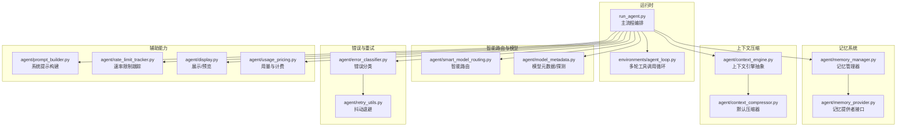
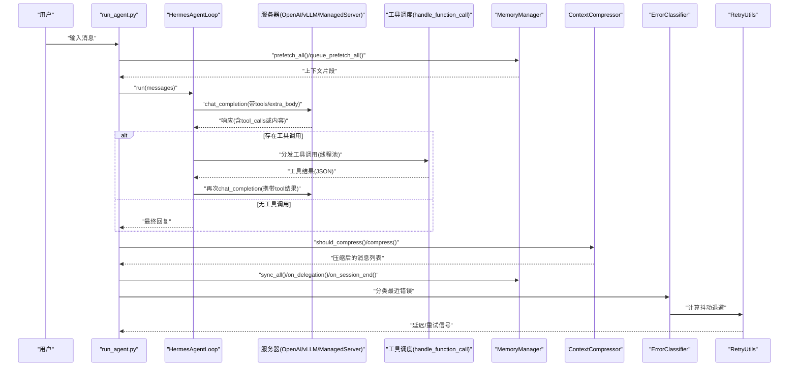
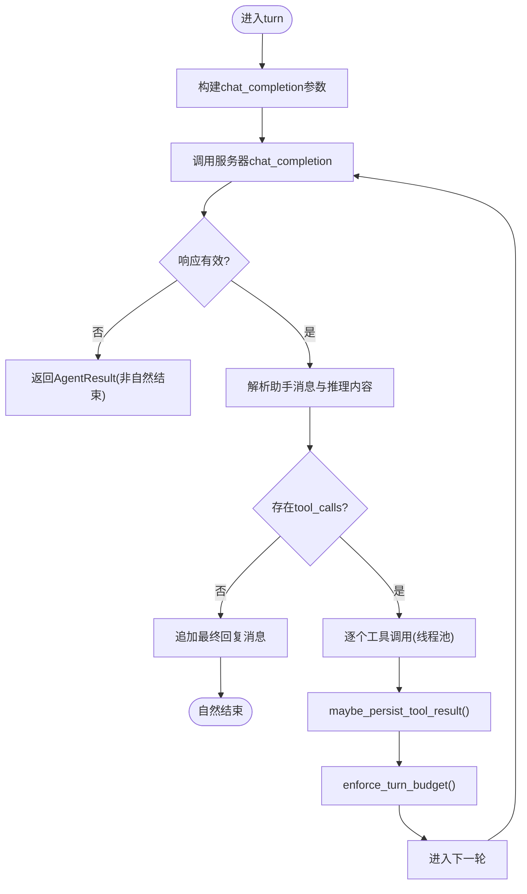
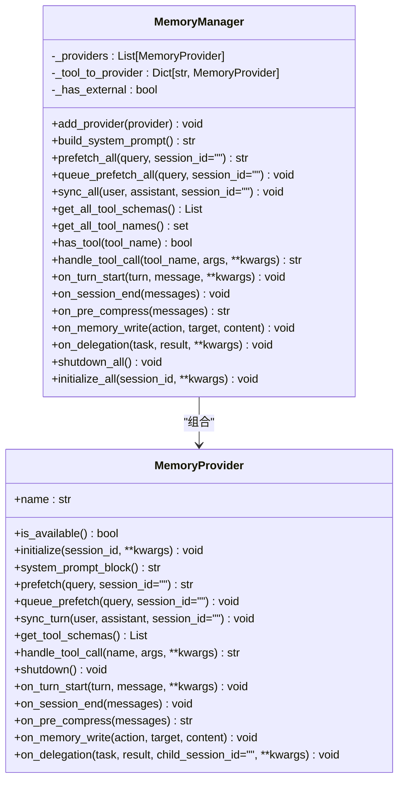
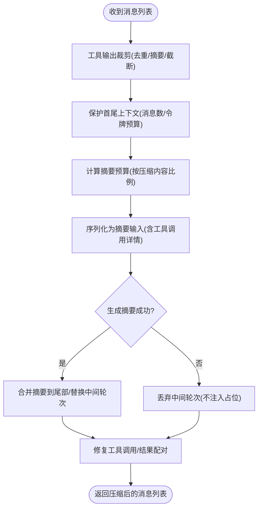
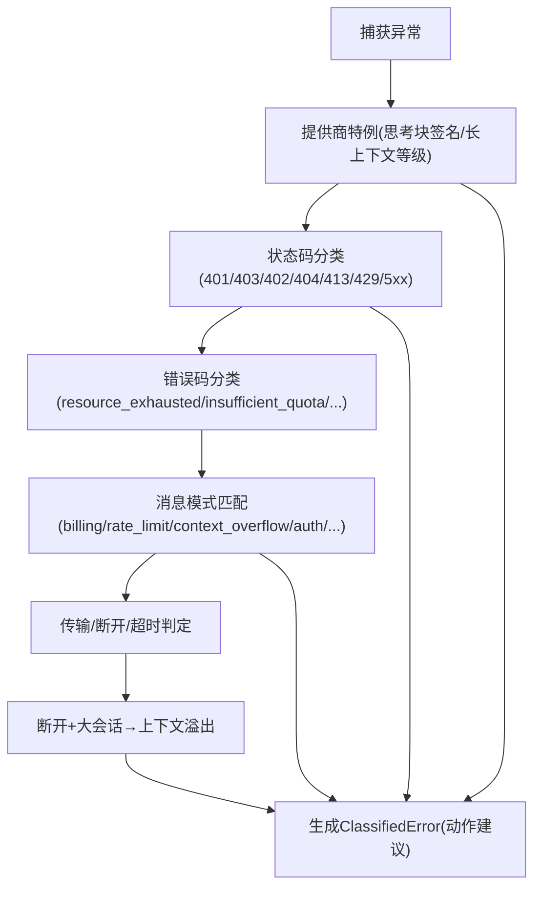
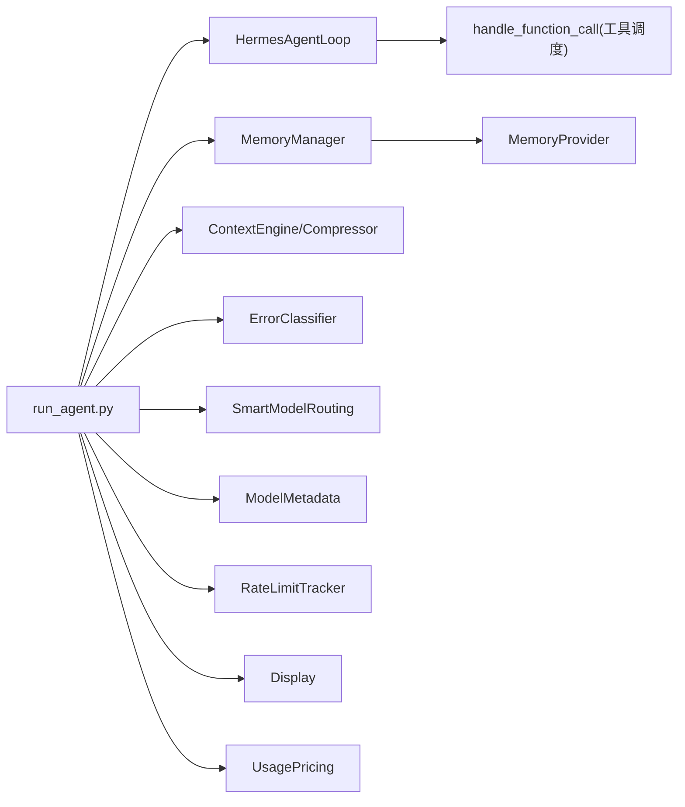

# 代理引擎

<cite>
**本文引用的文件**
- [agent/__init__.py](file://agent/__init__.py)
- [environments/agent_loop.py](file://environments/agent_loop.py)
- [agent/memory_manager.py](file://agent/memory_manager.py)
- [agent/memory_provider.py](file://agent/memory_provider.py)
- [agent/context_compressor.py](file://agent/context_compressor.py)
- [agent/context_engine.py](file://agent/context_engine.py)
- [agent/smart_model_routing.py](file://agent/smart_model_routing.py)
- [agent/error_classifier.py](file://agent/error_classifier.py)
- [agent/retry_utils.py](file://agent/retry_utils.py)
- [agent/prompt_builder.py](file://agent/prompt_builder.py)
- [agent/model_metadata.py](file://agent/model_metadata.py)
- [agent/rate_limit_tracker.py](file://agent/rate_limit_tracker.py)
- [agent/display.py](file://agent/display.py)
- [agent/usage_pricing.py](file://agent/usage_pricing.py)
- [run_agent.py](file://run_agent.py)
</cite>

## 目录
1. [简介](#简介)
2. [项目结构](#项目结构)
3. [核心组件](#核心组件)
4. [架构总览](#架构总览)
5. [详细组件分析](#详细组件分析)
6. [依赖关系分析](#依赖关系分析)
7. [性能考量](#性能考量)
8. [故障排查指南](#故障排查指南)
9. [结论](#结论)
10. [附录](#附录)

## 简介
本文件面向Hermes Agent代理引擎，系统性阐述其“代理循环机制、对话管理、工具调用处理与错误处理恢复”；深入解析“记忆管理系统（持久化策略、用户画像管理、检索机制）”；解释“上下文压缩算法与缓存策略”；覆盖“智能路由、模型选择与性能优化”；并提供“具体使用模式与集成方式”。文档兼顾初学者易读性与资深开发者的深度需求。

## 项目结构
Hermes Agent将代理内核拆分为多个模块化子系统：
- 运行时与循环：environments/agent_loop.py 提供可复用的多轮工具调用循环；run_agent.py 负责主流程编排与生命周期管理。
- 记忆系统：agent/memory_manager.py 作为统一入口，协调内置与外部插件记忆提供者；agent/memory_provider.py 定义抽象接口。
- 上下文压缩：agent/context_engine.py 抽象上下文引擎；agent/context_compressor.py 实现默认压缩器。
- 智能路由与模型选择：agent/smart_model_routing.py 基于消息特征选择廉价/强模型路径。
- 错误分类与重试：agent/error_classifier.py 对API错误进行分类并给出恢复建议；agent/retry_utils.py 提供抖动退避策略。
- 辅助能力：agent/prompt_builder.py 构建系统提示；agent/model_metadata.py 提供模型元数据与探测；agent/rate_limit_tracker.py 解析速率限制头；agent/display.py 提供CLI展示；agent/usage_pricing.py 提供用量与计费估算。

图表来源
- [environments/agent_loop.py:1-535](file://environments/agent_loop.py#L1-L535)
- [run_agent.py:1-200](file://run_agent.py#L1-L200)
- [agent/memory_manager.py:83-374](file://agent/memory_manager.py#L83-L374)
- [agent/memory_provider.py:42-232](file://agent/memory_provider.py#L42-L232)
- [agent/context_engine.py:32-185](file://agent/context_engine.py#L32-L185)
- [agent/context_compressor.py:188-800](file://agent/context_compressor.py#L188-L800)
- [agent/smart_model_routing.py:62-196](file://agent/smart_model_routing.py#L62-L196)
- [agent/model_metadata.py:1-200](file://agent/model_metadata.py#L1-L200)
- [agent/error_classifier.py:24-830](file://agent/error_classifier.py#L24-L830)
- [agent/retry_utils.py:19-58](file://agent/retry_utils.py#L19-L58)
- [agent/prompt_builder.py:1-200](file://agent/prompt_builder.py#L1-L200)
- [agent/rate_limit_tracker.py:30-247](file://agent/rate_limit_tracker.py#L30-L247)
- [agent/display.py:90-200](file://agent/display.py#L90-L200)
- [agent/usage_pricing.py:27-200](file://agent/usage_pricing.py#L27-L200)

章节来源
- [agent/__init__.py:1-7](file://agent/__init__.py#L1-L7)
- [environments/agent_loop.py:1-535](file://environments/agent_loop.py#L1-L535)
- [run_agent.py:1-200](file://run_agent.py#L1-L200)

## 核心组件
- 代理循环（HermesAgentLoop）
  - 支持标准OpenAI工具调用协议，兼容多种后端（OpenAI、vLLM、SGLang、OpenRouter、ManagedServer等）。
  - 统一处理模型响应、工具调用解析、线程池执行工具、结果持久化与预算控制、推理内容提取与记录。
  - 关键点：线程池大小可配置；支持回退解析（当后端不支持结构化tool_calls时）；对未知/非法工具调用进行安全兜底；记录每轮API耗时与工具耗时，便于诊断。
- 记忆管理（MemoryManager）
  - 协调内置提供者与最多一个外部提供者；内置提供者始终注册且不可移除；外部提供者仅允许单一实例以避免schema冲突。
  - 提供系统提示拼装、预取/同步、工具Schema聚合、生命周期钩子（回合开始、会话结束、压缩前、写入镜像、委托完成等）。
- 上下文压缩（ContextCompressor）
  - 默认上下文引擎实现，基于“昂贵摘要模型”对中间轮次进行损失可控的压缩，保护首尾上下文。
  - 包含工具输出裁剪、迭代更新摘要、摘要预算缩放、失败冷却与降级策略。
- 智能路由（SmartModelRouting）
  - 基于消息复杂度启发式选择廉价模型路径；若消息过于复杂或包含调试/长文本/链接/复杂关键词，则回退到主模型。
  - 可解析运行时提供者配置，动态生成路由签名。
- 错误分类与重试（ErrorClassifier + RetryUtils）
  - 结构化错误分类（认证、账单、限流、过载、超上下文、格式错误、模型不存在、超大请求体、思考块签名、长上下文等级等），并给出是否需要压缩、旋转凭证、回退、重试等建议。
  - 抖动退避防止并发风暴，支持装饰性指数退避与随机抖动。
- 其他支撑组件
  - PromptBuilder：系统提示拼装、平台提示、技能索引、上下文文件扫描与注入。
  - ModelMetadata：模型上下文探测、默认上下文表、最小上下文阈值、探针层级。
  - RateLimitTracker：解析速率限制头并格式化显示。
  - Display：工具预览、表情符号、Diff渲染、皮肤适配。
  - UsagePricing：用量归一化、计费估算、成本状态标注。

章节来源
- [environments/agent_loop.py:119-535](file://environments/agent_loop.py#L119-L535)
- [agent/memory_manager.py:83-374](file://agent/memory_manager.py#L83-L374)
- [agent/context_compressor.py:188-800](file://agent/context_compressor.py#L188-L800)
- [agent/smart_model_routing.py:62-196](file://agent/smart_model_routing.py#L62-L196)
- [agent/error_classifier.py:24-830](file://agent/error_classifier.py#L24-L830)
- [agent/retry_utils.py:19-58](file://agent/retry_utils.py#L19-L58)
- [agent/prompt_builder.py:1-200](file://agent/prompt_builder.py#L1-L200)
- [agent/model_metadata.py:1-200](file://agent/model_metadata.py#L1-L200)
- [agent/rate_limit_tracker.py:30-247](file://agent/rate_limit_tracker.py#L30-L247)
- [agent/display.py:90-200](file://agent/display.py#L90-L200)
- [agent/usage_pricing.py:27-200](file://agent/usage_pricing.py#L27-L200)

## 架构总览
下图展示了代理引擎在一次典型对话中的交互流程：从用户输入到工具调用、再到上下文压缩与记忆同步，以及错误分类与重试恢复。

图表来源
- [environments/agent_loop.py:175-535](file://environments/agent_loop.py#L175-L535)
- [agent/memory_manager.py:177-294](file://agent/memory_manager.py#L177-L294)
- [agent/context_compressor.py:310-756](file://agent/context_compressor.py#L310-L756)
- [agent/error_classifier.py:242-416](file://agent/error_classifier.py#L242-L416)
- [agent/retry_utils.py:19-58](file://agent/retry_utils.py#L19-L58)

## 详细组件分析

### 代理循环机制（HermesAgentLoop）
- 循环控制
  - 最大轮次限制；每轮统计API耗时与工具耗时；记录推理内容与工具错误。
  - 支持extra_body透传（如OpenRouter偏好/变换）；支持回退解析（当后端不支持结构化tool_calls时）。
- 工具调用处理
  - 标准化tool_calls（对象/字典）；校验工具名；解析参数JSON；线程池执行（避免内部asyncio.run死锁）；结果持久化与预算控制；错误收集与记录。
- 结果收敛
  - 无工具调用即视为自然结束；返回完整历史、托管状态、回合数、自然结束标志与每轮推理内容。

图表来源
- [environments/agent_loop.py:175-535](file://environments/agent_loop.py#L175-L535)

章节来源
- [environments/agent_loop.py:119-535](file://environments/agent_loop.py#L119-L535)

### 对话管理与系统提示
- 系统提示构建
  - 聚合各提供者的静态提示块；支持平台提示、技能索引、上下文文件扫描与注入；阻断潜在提示注入风险。
- 平台与身份
  - 默认身份描述；工具使用强制指引；针对特定模型族的执行纪律；会话搜索与记忆使用指导。

章节来源
- [agent/prompt_builder.py:1-200](file://agent/prompt_builder.py#L1-L200)

### 记忆管理系统
- 提供者模型
  - MemoryProvider定义生命周期与可选钩子；MemoryManager负责注册、系统提示拼装、预取/同步、工具Schema聚合与路由、生命周期事件广播。
- 内置与外部提供者
  - 内置提供者始终启用且不可移除；外部提供者仅允许单一实例；冲突工具名警告；失败不影响其他提供者。
- 用户画像与检索
  - 预取/同步在回合前后执行；支持按会话隔离；提供者可自定义系统提示、预取逻辑、工具Schema与处理；支持压缩前抽取洞察、写入镜像、委托完成观察。

图表来源
- [agent/memory_provider.py:42-232](file://agent/memory_provider.py#L42-L232)
- [agent/memory_manager.py:83-374](file://agent/memory_manager.py#L83-L374)

章节来源
- [agent/memory_provider.py:1-232](file://agent/memory_provider.py#L1-L232)
- [agent/memory_manager.py:1-374](file://agent/memory_manager.py#L1-L374)

### 上下文压缩算法与缓存策略
- 引擎抽象
  - ContextEngine定义压缩触发、压缩执行、会话生命周期钩子、状态展示与模型切换更新。
- 默认压缩器（ContextCompressor）
  - 步骤：工具输出裁剪（去重/摘要/截断）、保护首尾消息、计算摘要预算、结构化摘要模板、迭代更新、失败冷却与降级。
  - 抗抖动：连续低效压缩自动跳过；失败冷却时间；摘要模型不可用时回退至主模型。
  - 缓存策略：摘要前缀规范化；摘要迭代更新保留历史信息；tail token预算替代固定消息数保护。

图表来源
- [agent/context_engine.py:32-185](file://agent/context_engine.py#L32-L185)
- [agent/context_compressor.py:336-756](file://agent/context_compressor.py#L336-L756)

章节来源
- [agent/context_engine.py:1-185](file://agent/context_engine.py#L1-L185)
- [agent/context_compressor.py:1-800](file://agent/context_compressor.py#L1-L800)

### 智能路由与模型选择
- 简单消息启发式
  - 字符数/词数/换行数/代码块/URL/复杂关键词集合；满足条件则选择廉价模型路径。
- 运行时解析
  - 解析提供者、API密钥、基础URL等，生成路由签名；失败回退到主模型。
- 使用模式
  - 在每轮开始根据用户消息与配置决定是否走“简单转接”，从而降低成本。

章节来源
- [agent/smart_model_routing.py:62-196](file://agent/smart_model_routing.py#L62-L196)

### 错误处理与恢复
- 错误分类
  - 结构化FailoverReason枚举；优先级管线：提供商特例、状态码、错误码、消息模式、传输错误、服务断开+大会话→上下文溢出、未知。
- 恢复动作
  - 是否可重试、是否需要压缩、是否旋转凭证、是否回退。
- 重试策略
  - 抖动退避：装饰性指数退避+随机抖动，避免并发风暴。

图表来源
- [agent/error_classifier.py:242-416](file://agent/error_classifier.py#L242-L416)
- [agent/retry_utils.py:19-58](file://agent/retry_utils.py#L19-L58)

章节来源
- [agent/error_classifier.py:1-830](file://agent/error_classifier.py#L1-L830)
- [agent/retry_utils.py:1-58](file://agent/retry_utils.py#L1-L58)

### 性能优化要点
- 线程池与并发
  - 工具执行线程池独立，避免后端内部asyncio.run死锁；池大小可配置并动态调整。
- 抖动退避
  - 防止并发重试风暴，提升整体稳定性。
- 上下文压缩
  - 工具输出裁剪与摘要预算缩放，减少传输与计算开销；迭代更新保留历史，避免重复劳动。
- 模型元数据与探测
  - 自动探测上下文长度与最小阈值，避免无效尝试；默认上下文表与探针层级。
- 速率限制跟踪
  - 解析x-ratelimit-*头，格式化显示与紧凑摘要，便于监控与告警。

章节来源
- [environments/agent_loop.py:36-48](file://environments/agent_loop.py#L36-L48)
- [agent/retry_utils.py:19-58](file://agent/retry_utils.py#L19-L58)
- [agent/context_compressor.py:474-544](file://agent/context_compressor.py#L474-L544)
- [agent/model_metadata.py:77-95](file://agent/model_metadata.py#L77-L95)
- [agent/rate_limit_tracker.py:92-247](file://agent/rate_limit_tracker.py#L92-L247)

## 依赖关系分析
- 组件耦合
  - run_agent.py 作为编排中心，依赖上下文引擎、记忆管理、错误分类、智能路由、模型元数据、展示与计费等模块。
  - HermesAgentLoop 与工具调度解耦，通过handle_function_call与线程池协作，降低阻塞风险。
  - MemoryManager 与 MemoryProvider 采用组合与路由，确保单一外部提供者约束与失败隔离。
- 外部依赖
  - OpenAI兼容客户端、第三方模型提供者SDK、速率限制头解析、计费API/快照。
- 潜在循环
  - 当前模块间为单向依赖（编排→子系统），未见循环导入迹象。

图表来源
- [run_agent.py:63-110](file://run_agent.py#L63-L110)
- [environments/agent_loop.py:23-25](file://environments/agent_loop.py#L23-L25)
- [agent/memory_manager.py:90-147](file://agent/memory_manager.py#L90-L147)
- [agent/context_engine.py:32-185](file://agent/context_engine.py#L32-L185)
- [agent/error_classifier.py:242-416](file://agent/error_classifier.py#L242-L416)
- [agent/smart_model_routing.py:110-196](file://agent/smart_model_routing.py#L110-L196)
- [agent/model_metadata.py:1-200](file://agent/model_metadata.py#L1-L200)
- [agent/rate_limit_tracker.py:92-247](file://agent/rate_limit_tracker.py#L92-L247)
- [agent/display.py:90-200](file://agent/display.py#L90-L200)
- [agent/usage_pricing.py:27-200](file://agent/usage_pricing.py#L27-L200)

章节来源
- [run_agent.py:63-110](file://run_agent.py#L63-L110)

## 性能考量
- 工具执行
  - 线程池大小直接影响并发工具执行吞吐；过大可能导致资源争用，过小导致队列堆积与延迟放大。
- 上下文压缩
  - 工具输出裁剪与摘要预算应与模型上下文窗口匹配；迭代更新可减少重复摘要成本。
- 错误恢复
  - 合理的抖动退避与失败冷却可显著降低Provider侧压力峰值。
- 展示与日志
  - 工具预览长度与Diff渲染需平衡可观测性与输出体积。

## 故障排查指南
- 常见错误与定位
  - 认证失败：检查凭证轮换与提供者刷新；确认should_rotate_credential与should_fallback。
  - 账单/配额：区分瞬时配额与永久耗尽；瞬时配额按费率限制处理，永久耗尽需回退或更换提供者。
  - 上下文溢出：优先压缩；若持续无效，检查压缩阈值与摘要预算；必要时提升模型上下文或优化提示。
  - 工具调用失败：查看ToolError记录（turn/tool_name/arguments/error/tool_result）；检查线程池队列长度与工具耗时。
  - 速率限制：关注x-ratelimit-*头，结合抖动退避；必要时降低并发或切换时段。
- 诊断工具
  - 错误分类结果与恢复建议；抖动退避参数；速率限制状态格式化输出；用量与计费估算。
- 快速修复建议
  - 减少一次性工具输出体量（裁剪/摘要）；缩短提示词；降低温度；启用智能路由的简单消息分流；适当增大线程池与压缩阈值。

章节来源
- [agent/error_classifier.py:24-830](file://agent/error_classifier.py#L24-L830)
- [agent/retry_utils.py:19-58](file://agent/retry_utils.py#L19-L58)
- [agent/rate_limit_tracker.py:92-247](file://agent/rate_limit_tracker.py#L92-L247)
- [environments/agent_loop.py:52-79](file://environments/agent_loop.py#L52-L79)

## 结论
Hermes Agent代理引擎通过模块化设计实现了高内聚、低耦合的对话与工具调用闭环。其核心优势在于：
- 稳健的代理循环与工具调度（线程池隔离、回退解析、预算控制）；
- 可插拔的记忆系统（内置+单一外部提供者、失败隔离、生命周期钩子）；
- 高效的上下文压缩（工具输出裁剪、摘要预算、迭代更新、失败冷却）；
- 智能路由与模型选择（启发式分流、运行时解析、签名化路由）；
- 完备的错误分类与重试（结构化分类、抖动退避、恢复建议）。

这些特性共同保障了在复杂任务场景下的稳定性、可扩展性与成本可控性。

## 附录
- 使用模式参考
  - 代理循环：在run_agent.py中初始化MemoryManager与ContextEngine，随后调用HermesAgentLoop.run(messages)。
  - 记忆系统：注册内置提供者与单一外部提供者；在每轮前prefetch，在回合后sync；必要时queue_prefetch。
  - 上下文压缩：根据should_compress判断是否压缩；compress返回新消息列表；在会话结束时清理状态。
  - 智能路由：在每轮开始调用resolve_turn_route(user_message, routing_config, primary)，按返回路由执行。
  - 错误处理：捕获异常后classify_api_error，依据ClassifiedError决定重试/压缩/回退/旋转凭证。
- 集成方式
  - run_agent.py作为主入口，按需注入或替换上下文引擎、记忆提供者、错误分类器与展示组件。
  - 通过环境变量与配置文件控制线程池大小、压缩阈值、路由开关与展示参数。