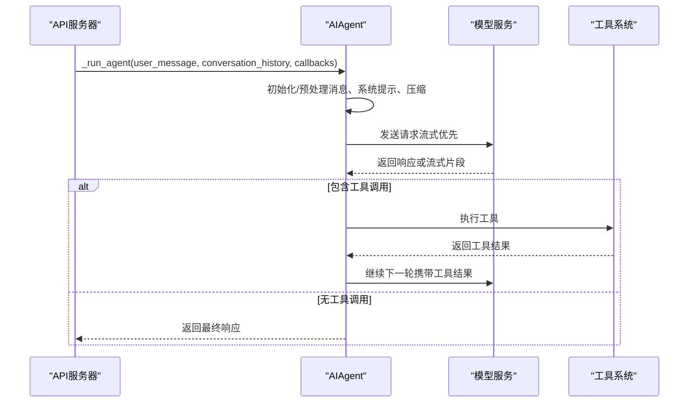
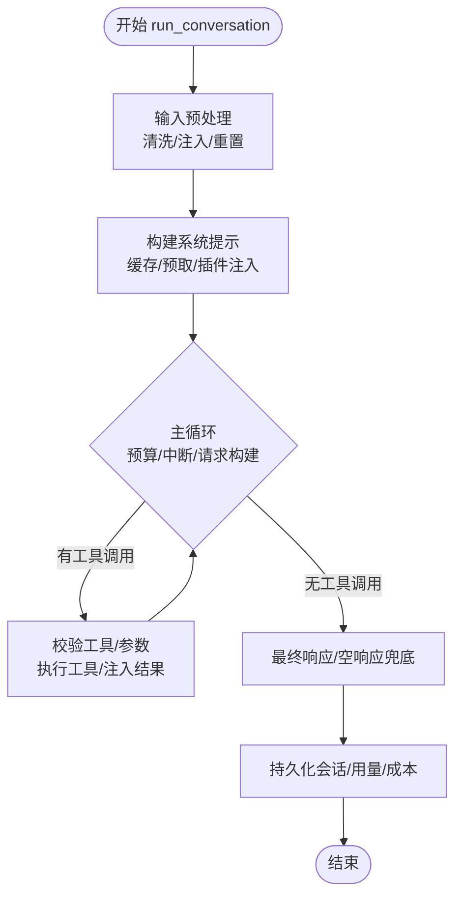
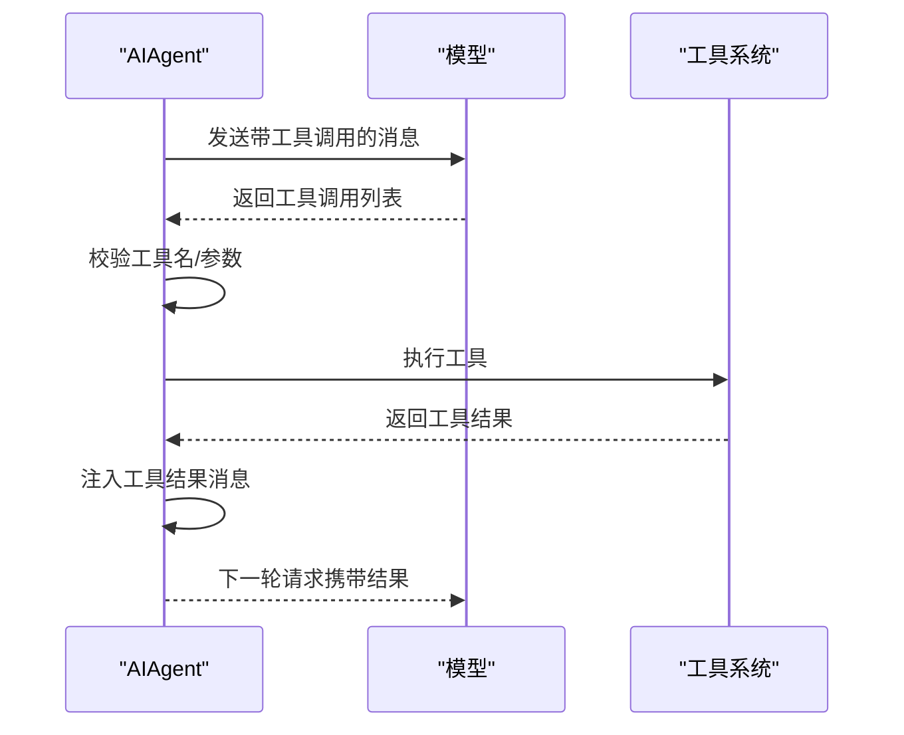
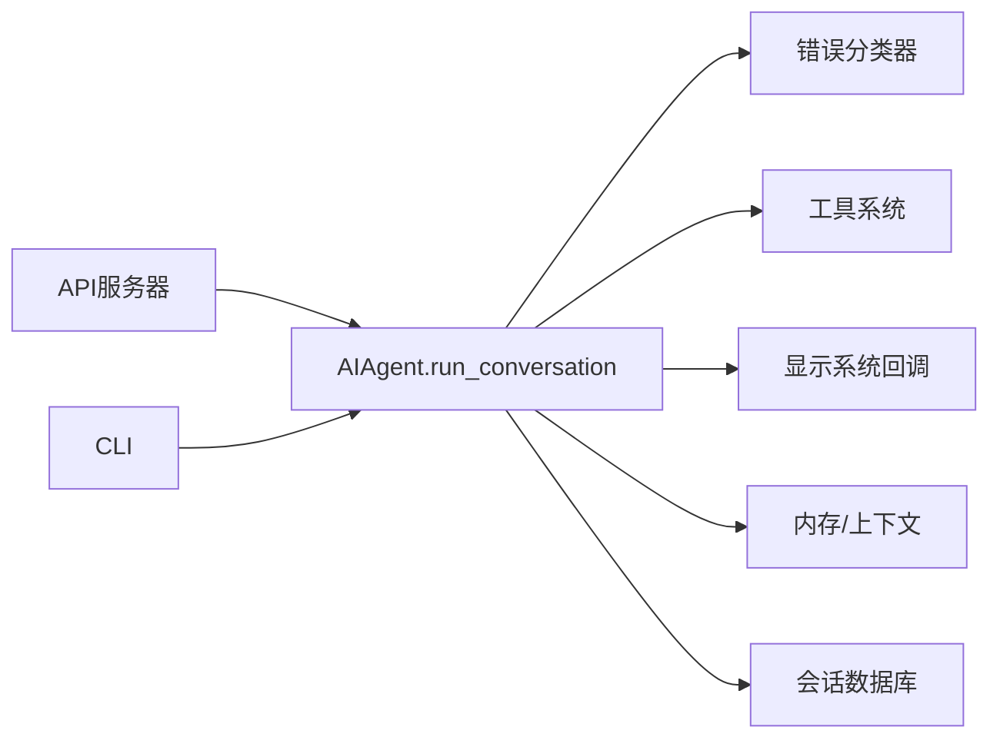

# 对话循环管理

<cite>
**本文档引用的文件**
- [run_agent.py](file://run_agent.py)
- [api_server.py](file://gateway/platforms/api_server.py)
- [cli.py](file://cli.py)
- [test_run_agent.py](file://tests/run_agent/test_run_agent.py)
</cite>

## 目录
1. [简介](#简介)
2. [项目结构](#项目结构)
3. [核心组件](#核心组件)
4. [架构总览](#架构总览)
5. [详细组件分析](#详细组件分析)
6. [依赖分析](#依赖分析)
7. [性能考虑](#性能考虑)
8. [故障排除指南](#故障排除指南)
9. [结论](#结论)

## 简介
本文件面向Hermes Agent的对话循环管理，聚焦于AIAgent类的run_conversation方法实现。文档深入解析以下关键主题：
- 对话状态管理：消息历史维护、会话边界处理、持久化策略
- 工具调用循环机制：工具选择、参数校验、执行与结果注入
- 中断与错误处理：用户中断、API错误分类、恢复策略
- 预算与并发：迭代预算控制、并发工具执行、线程安全
- 超时与健康检查：流式传输监控、重试退避、连接清理
- 与显示系统、错误处理、工具系统的集成关系
- 常见问题与调试方法

## 项目结构
Hermes Agent将对话循环核心逻辑集中在run_agent.py中的AIAgent类，通过API服务器网关（gateway/platforms/api_server.py）调度运行，并在CLI（cli.py）中提供交互入口。测试用例（tests/run_agent/test_run_agent.py）覆盖了关键行为验证。

```mermaid
graph TB
subgraph "运行时"
AIAgent["AIAgent.run_conversation<br/>对话循环主控"]
Display["显示系统回调<br/>stream_delta_callback 等"]
Tools["工具系统<br/>handle_function_call 等"]
Error["错误分类器<br/>classify_api_error"]
Memory["内存/上下文<br/>prefetch/persist"]
end
subgraph "网关层"
APIServer["API服务器<br/>_run_agent 启动线程"]
end
subgraph "CLI"
CLI["命令行接口<br/>/background 等命令"]
end
APIServer --> AIAgent
CLI --> AIAgent
AIAgent --> Display
AIAgent --> Tools
AIAgent --> Error
AIAgent --> Memory
```

**图表来源**
- [run_agent.py](file://run_agent.py)
- [api_server.py](file://gateway/platforms/api_server.py)
- [cli.py](file://cli.py)

**章节来源**
- [run_agent.py](file://run_agent.py)
- [api_server.py](file://gateway/platforms/api_server.py)
- [cli.py](file://cli.py)

## 核心组件
- AIAgent.run_conversation：对话循环的主入口，负责消息构建、API调用、工具执行、错误恢复与状态持久化。
- 迭代预算（IterationBudget）：线程安全的迭代计数器，限制工具调用轮次，支持子代理独立预算。
- 错误分类器（classify_api_error）：对API错误进行结构化分类，指导重试、压缩、凭证轮换与回退。
- 显示系统回调：支持流式增量输出、思考态提示、工具进度通知等。
- 工具系统：工具定义加载、参数校验、函数调用执行与结果存储。

**章节来源**
- [run_agent.py](file://run_agent.py)
- [test_run_agent.py](file://tests/run_agent/test_run_agent.py)

## 架构总览
下图展示了从网关到AIAgent的调用链路，以及run_conversation内部的主循环与关键分支。



**图表来源**
- [api_server.py](file://gateway/platforms/api_server.py)
- [run_agent.py](file://run_agent.py)

## 详细组件分析

### AIAgent.run_conversation 方法详解
该方法是对话循环的核心，包含以下关键阶段：

- 输入预处理
  - 安全清洗：去除代理字符、剥离泄漏的记忆上下文标记
  - 任务标识：生成唯一task_id隔离并发任务资源
  - 回调绑定：设置流式回调以便TTS等提前启动
  - 重置重试计数：确保每轮对话的重试状态独立

- 系统提示与消息准备
  - 缓存系统提示：复用会话缓存以保持前缀缓存一致性
  - 预飞行压缩：若历史长度接近阈值，先进行压缩避免API失败
  - 插件注入：pre_llm_call钩子将临时上下文注入用户消息
  - 外部记忆预取：一次性预取外部记忆，避免重复调用

- 主循环（工具调用循环）
  - 中断检测：轮询中断标志，支持用户新消息打断
  - 预算控制：使用IterationBudget限制总迭代次数
  - 请求构建：标准化消息格式、工具调用JSON、移除不兼容字段
  - 流式调用：优先使用流式接口，具备健康检查能力
  - 响应归一化：统一不同API模式的响应结构
  - 工具调用：校验工具名与参数，执行并注入结果
  - 压缩触发：基于实际token使用量动态决定是否压缩

- 结束条件与收尾
  - 无工具调用：返回最终响应
  - 空响应兜底：对“仅思考”或空响应进行多轮恢复尝试
  - 持久化：保存会话日志、令牌用量、成本统计



**图表来源**
- [run_agent.py](file://run_agent.py)

**章节来源**
- [run_agent.py](file://run_agent.py)

### 对话状态管理与消息历史维护
- 会话边界：通过session_id区分不同会话；首次会话构建系统提示并缓存；后续会话复用缓存以维持前缀缓存命中。
- 历史维护：每次调用复制conversation_history，避免污染调用方列表；在工具执行后追加工具结果，保持角色交替。
- 持久化策略：按轮次增量保存会话日志；在API失败且可能扩大会话的情况下跳过持久化，防止“增长循环”。

**章节来源**
- [run_agent.py](file://run_agent.py)

### 工具调用循环机制
- 工具选择与修复：自动修复模型误称的工具名；对未知工具名返回错误消息供模型自纠正。
- 参数校验：严格校验JSON参数，处理截断场景；对无效JSON注入工具错误结果以引导模型重试。
- 并发执行：工具执行由_execute_tool_calls统一调度；对execute_code这类轻量RPC调用进行预算回退。
- 结果注入：将工具结果作为“tool”角色消息注入，保持对话序列有效性。



**图表来源**
- [run_agent.py](file://run_agent.py)

**章节来源**
- [run_agent.py](file://run_agent.py)

### 对话中断处理、错误分类与恢复策略
- 用户中断：在每轮开始检查中断标志，立即退出工具循环并返回中断状态。
- 错误分类：使用classify_api_error对429、413、上下文溢出、签名失效等进行结构化分类。
- 恢复策略：
  - 速率限制：优先凭证池轮换，其次回退到备用提供商。
  - 负载过载：指数退避等待Retry-After或随机抖动。
  - 请求体过大：进行上下文压缩，最多尝试3次。
  - 上下文溢出：降低上下文窗口或压缩历史，必要时调整max_tokens。
  - 思维块签名失效：移除reasoning_details后重试一次。
  - 无效响应：快速回退到备用提供商，避免无意义重试。

**章节来源**
- [run_agent.py](file://run_agent.py)

### 迭代预算控制、并发工具执行与线程安全
- 预算控制：IterationBudget为每个AIAgent实例提供线程安全的迭代计数；父/子代理共享但可独立配置。
- 并发工具执行：工具执行在当前线程内顺序进行，避免跨线程状态竞争；execute_code预算回退避免计入总预算。
- 线程安全：中断信号通过线程ID绑定，确保只影响当前执行线程；流式回调在主线程中更新显示。

**章节来源**
- [run_agent.py](file://run_agent.py)

### 对话状态持久化、会话边界处理与超时管理
- 持久化：每轮结束后增量保存会话日志；API调用后更新令牌用量与成本统计；在网关平台中通过_session_db写入数据库。
- 会话边界：首次会话构建系统提示并缓存；后续会话复用缓存；切换模型时重建系统提示并记录。
- 超时管理：流式接口具备90秒静默检测与60秒读取超时；非流式路径通过退避与中断感知避免无限等待。

**章节来源**
- [run_agent.py](file://run_agent.py)

### 与显示系统、错误处理和工具系统的集成
- 显示系统：通过stream_delta_callback、thinking_callback、tool_progress_callback等回调实现流式输出、思考态提示与工具进度。
- 错误处理：统一的错误分类与恢复流程，结合verbose_logging输出诊断信息；在CLI中提供可读的错误摘要与修复建议。
- 工具系统：通过model_tools模块加载工具定义与执行函数；支持工具参数强制规范化与结果持久化。

**章节来源**
- [run_agent.py](file://run_agent.py)

## 依赖分析
- AIAgent依赖多个子系统：错误分类器、上下文压缩器、显示回调、工具系统、内存管理器、会话数据库。
- 网关层（API服务器）负责在独立线程中启动AIAgent，支持跨线程中断（agent_ref引用）。
- CLI层提供背景任务与语音转文本等入口，间接调用AIAgent.run_conversation。



**图表来源**
- [run_agent.py](file://run_agent.py)
- [api_server.py](file://gateway/platforms/api_server.py)
- [cli.py](file://cli.py)

**章节来源**
- [run_agent.py](file://run_agent.py)
- [api_server.py](file://gateway/platforms/api_server.py)
- [cli.py](file://cli.py)

## 性能考虑
- 流式优先：默认使用流式接口，提升健康检查灵敏度与用户体验。
- 预取优化：外部记忆一次性预取，避免每轮重复调用。
- 前缀缓存：系统提示缓存与Anthropic缓存控制减少重复token消耗。
- 压缩触发：基于实际token使用量动态压缩，避免不必要的API失败。
- 令牌统计：精确记录prompt/completion/total与缓存命中率，便于成本与性能分析。

## 故障排除指南
- 常见问题
  - “响应被截断”：检查max_tokens与输出预算，必要时降低推理强度或增加输出上限。
  - “工具调用参数无效”：确认JSON格式正确，必要时使用空对象{}；关注截断导致的半闭合括号。
  - “空响应”：启用后工具空响应的多轮恢复；必要时切换到备用提供商。
  - “速率限制”：启用凭证池轮换或回退到备用提供商；尊重Retry-After头。
  - “请求体过大”：触发上下文压缩；若无法压缩，建议新建会话或手动压缩。
- 调试方法
  - 启用verbose_logging查看请求/响应细节与令牌用量。
  - 使用HERMES_DUMP_REQUESTS导出请求快照定位问题。
  - 在CLI中使用/background命令进行隔离测试，避免干扰当前会话。

**章节来源**
- [run_agent.py](file://run_agent.py)
- [test_run_agent.py](file://tests/run_agent/test_run_agent.py)

## 结论
AIAgent.run_conversation通过严谨的状态管理、健壮的错误分类与恢复策略、精细的预算控制与并发安全设计，实现了高可靠性的对话循环。其与显示系统、工具系统和内存系统的深度集成，使得复杂任务的自动化执行成为可能。遵循本文档的实践建议与故障排除方法，可显著提升对话循环的稳定性与可维护性。