# 工具调用处理

<cite>
**本文引用的文件**
- [run_agent.py](file://run_agent.py)
- [model_tools.py](file://model_tools.py)
- [tools/registry.py](file://tools/registry.py)
- [agent/smart_model_routing.py](file://agent/smart_model_routing.py)
- [tools/tool_result_storage.py](file://tools/tool_result_storage.py)
- [tools/code_execution_tool.py](file://tools/code_execution_tool.py)
- [tools/path_security.py](file://tools/path_security.py)
- [tools/environments/managed_modal.py](file://tools/environments/managed_modal.py)
- [agent/retry_utils.py](file://agent/retry_utils.py)
- [environments/tool_context.py](file://environments/tool_context.py)
- [environments/agent_loop.py](file://environments/agent_loop.py)
- [plugins/memory/mem0/__init__.py](file://plugins/memory/mem0/__init__.py)
- [plugins/memory/supermemory/__init__.py](file://plugins/memory/supermemory/__init__.py)
- [tests/agent/test_smart_model_routing.py](file://tests/agent/test_smart_model_routing.py)
- [tests/tools/test_tool_result_storage.py](file://tests/tools/test_tool_result_storage.py)
- [tests/agent/test_memory_provider.py](file://tests/agent/test_memory_provider.py)
- [tests/plugins/test_retaindb_plugin.py](file://tests/plugins/test_retaindb_plugin.py)
</cite>

## 目录
1. [简介](#简介)
2. [项目结构](#项目结构)
3. [核心组件](#核心组件)
4. [架构总览](#架构总览)
5. [详细组件分析](#详细组件分析)
6. [依赖分析](#依赖分析)
7. [性能考量](#性能考量)
8. [故障排查指南](#故障排查指南)
9. [结论](#结论)
10. [附录](#附录)

## 简介
本技术文档围绕 Hermes Agent 的“工具调用处理系统”展开，系统性阐述从工具发现、参数校验、并发执行到结果聚合的完整流程；解释智能模型路由机制、工具集过滤与模型选择策略；说明工具执行的安全检查、破坏性命令检测与路径隔离机制；覆盖错误处理、重试策略与超时管理；并结合工具注册表、内存管理与会话状态的集成关系，给出并发冲突、资源竞争与性能优化建议。

## 项目结构
该系统由三层协作构成：
- 调用编排层：负责对话循环、工具解析、并发调度与结果聚合（run_agent.py）。
- 工具编排层：负责工具发现、Schema 汇总、异步桥接与分发（model_tools.py、tools/registry.py）。
- 执行与安全层：负责工具执行、结果持久化、路径安全、环境沙箱与重试策略（tools/*、agent/retry_utils.py、tools/environments/managed_modal.py）。

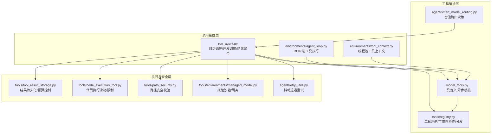

**图表来源**
- [run_agent.py](file://run_agent.py)
- [model_tools.py](file://model_tools.py)
- [tools/registry.py](file://tools/registry.py)
- [agent/smart_model_routing.py](file://agent/smart_model_routing.py)
- [tools/tool_result_storage.py](file://tools/tool_result_storage.py)
- [tools/code_execution_tool.py](file://tools/code_execution_tool.py)
- [tools/path_security.py](file://tools/path_security.py)
- [tools/environments/managed_modal.py](file://tools/environments/managed_modal.py)
- [agent/retry_utils.py](file://agent/retry_utils.py)
- [environments/tool_context.py](file://environments/tool_context.py)
- [environments/agent_loop.py](file://environments/agent_loop.py)

**章节来源**
- [run_agent.py](file://run_agent.py)
- [model_tools.py](file://model_tools.py)
- [tools/registry.py](file://tools/registry.py)
- [agent/smart_model_routing.py](file://agent/smart_model_routing.py)
- [tools/tool_result_storage.py](file://tools/tool_result_storage.py)
- [tools/code_execution_tool.py](file://tools/code_execution_tool.py)
- [tools/path_security.py](file://tools/path_security.py)
- [tools/environments/managed_modal.py](file://tools/environments/managed_modal.py)
- [agent/retry_utils.py](file://agent/retry_utils.py)
- [environments/tool_context.py](file://environments/tool_context.py)
- [environments/agent_loop.py](file://environments/agent_loop.py)

## 核心组件
- 工具注册与发现：通过 tools/registry.py 统一收集工具 Schema、处理器与可用性检查函数，并支持别名映射与 MCP 动态刷新。
- 工具定义与异步桥接：model_tools.py 在导入阶段触发内置工具发现，提供 get_tool_definitions 与 handle_function_call，并统一异步工具的事件循环管理。
- 智能模型路由：agent/smart_model_routing.py 基于提示词复杂度启发式选择“廉价模型”，并在运行时解析具体 runtime，失败时回退主模型。
- 并发执行与结果聚合：run_agent.py 解析工具调用后并发提交至线程池，周期性心跳避免网关误判空闲，聚合结果并注入消息历史。
- 结果持久化与预算控制：tools/tool_result_storage.py 提供三层防御：单工具阈值、结果持久化与每轮聚合预算，防止上下文溢出。
- 安全与隔离：tools/code_execution_tool.py 限定允许工具集合、最大调用次数与超时；tools/path_security.py 防止路径逃逸；managed_modal.py 提供托管沙箱隔离与超时控制。
- 错误处理与重试：agent/retry_utils.py 提供抖动退避；run_agent.py 对未应答工具调用注入错误消息；工具返回 JSON 错误时记录并归类。

**章节来源**
- [tools/registry.py](file://tools/registry.py)
- [model_tools.py](file://model_tools.py)
- [agent/smart_model_routing.py](file://agent/smart_model_routing.py)
- [run_agent.py](file://run_agent.py)
- [tools/tool_result_storage.py](file://tools/tool_result_storage.py)
- [tools/code_execution_tool.py](file://tools/code_execution_tool.py)
- [tools/path_security.py](file://tools/path_security.py)
- [tools/environments/managed_modal.py](file://tools/environments/managed_modal.py)
- [agent/retry_utils.py](file://agent/retry_utils.py)

## 架构总览
下图展示一次典型工具调用的端到端流程，包括工具发现、参数校验、并发执行、结果持久化与聚合。

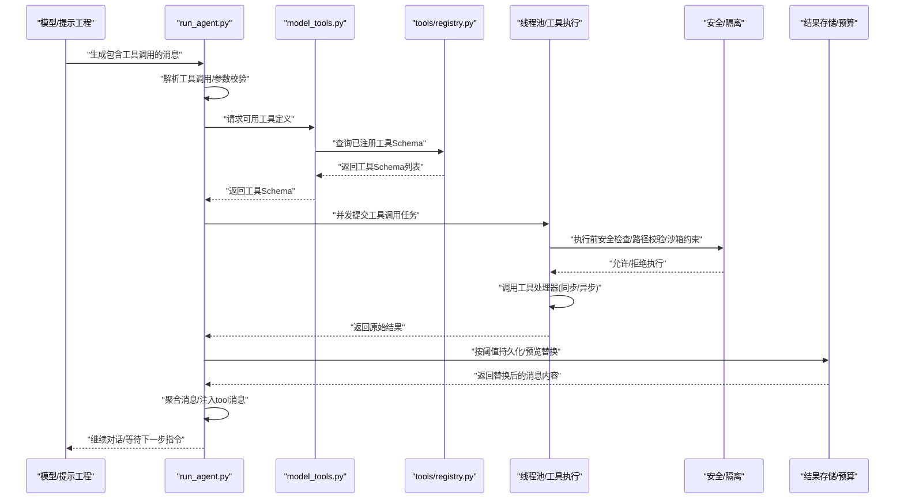

**图表来源**
- [run_agent.py](file://run_agent.py)
- [model_tools.py](file://model_tools.py)
- [tools/registry.py](file://tools/registry.py)
- [tools/tool_result_storage.py](file://tools/tool_result_storage.py)
- [tools/code_execution_tool.py](file://tools/code_execution_tool.py)
- [tools/path_security.py](file://tools/path_security.py)

## 详细组件分析

### 工具发现与可用性过滤
- 注册中心：tools/registry.py 提供 register/deregister/get_definitions/dispatch 等能力，支持工具集别名、可用性检查与快照一致性。
- 发现与桥接：model_tools.py 导入时触发 discover_builtin_tools 与 MCP/插件发现，构建 TOOL_TO_TOOLSET_MAP 与 TOOLSET_REQUIREMENTS，供 run_agent 进行工具集过滤。
- 工具集过滤：run_agent 在并发执行前对工具进行可用性检查与去重，避免重复或冲突工具进入同一轮次。

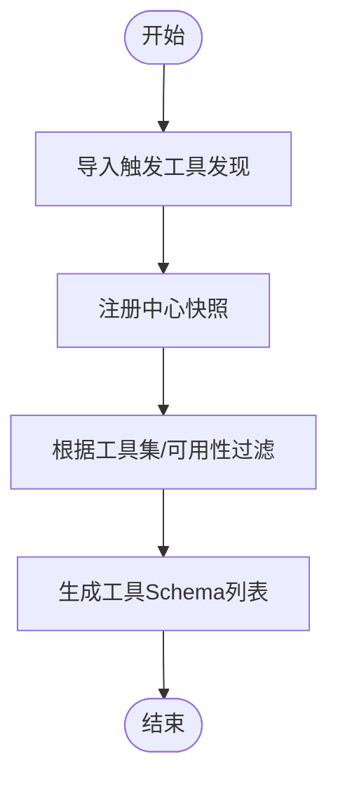

**图表来源**
- [tools/registry.py](file://tools/registry.py)
- [model_tools.py](file://model_tools.py)

**章节来源**
- [tools/registry.py](file://tools/registry.py)
- [model_tools.py](file://model_tools.py)
- [tests/agent/test_memory_provider.py](file://tests/agent/test_memory_provider.py)

### 参数验证与工具调用解析
- 参数解析：run_agent 将模型输出的工具调用解析为 (id, name, args)，并对 JSON 解析失败与类型异常做容错处理。
- 插件钩子：在实际执行前，可调用插件 get_pre_tool_call_block_message 判定是否阻断，避免危险工具被调用。
- 去重与注入：当内存管理器提供的工具与插件注册工具名称冲突时，采用“先到先得”策略，避免重复注入导致的 400 错。

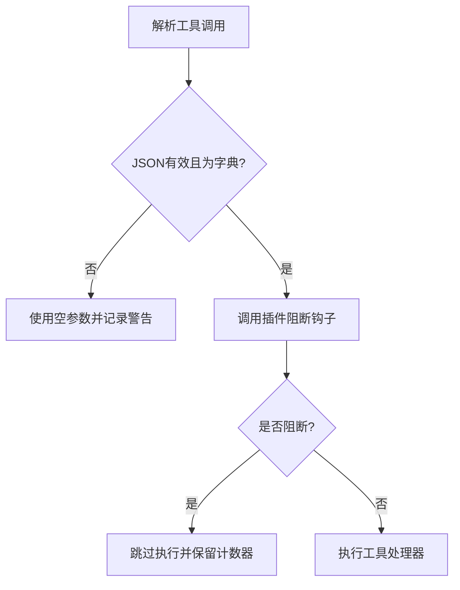

**图表来源**
- [run_agent.py](file://run_agent.py)

**章节来源**
- [run_agent.py](file://run_agent.py)
- [tests/agent/test_memory_provider.py](file://tests/agent/test_memory_provider.py)

### 并发执行与结果聚合
- 线程池并发：run_agent 使用 ThreadPoolExecutor 并发执行多个工具调用，最大工作线程受控，周期性心跳避免网关误判空闲。
- 结果聚合：每个工具执行完成后，先进行结果持久化与预算控制，再注入消息历史；对未被应答的工具调用自动注入错误消息，保证角色交替与一致性。
- 子目录提示：工具执行后可附加子目录提示，辅助后续检索与上下文压缩。

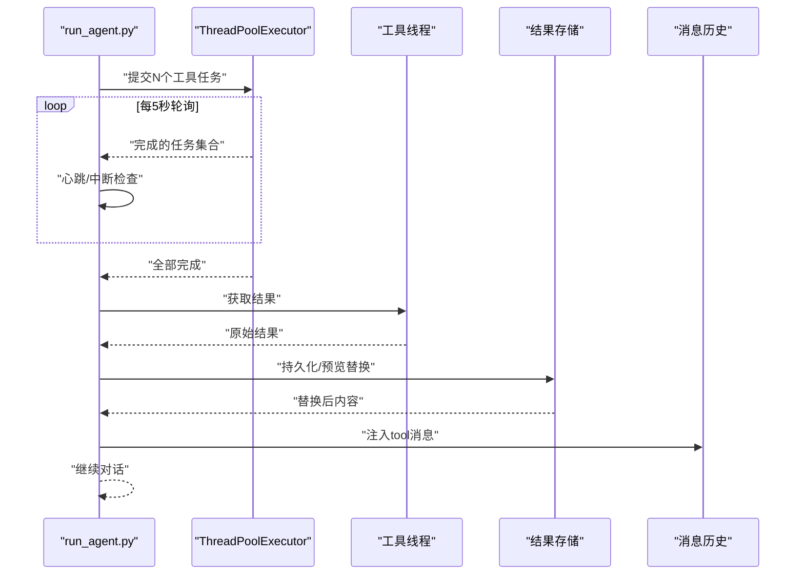

**图表来源**
- [run_agent.py](file://run_agent.py)
- [tools/tool_result_storage.py](file://tools/tool_result_storage.py)

**章节来源**
- [run_agent.py](file://run_agent.py)
- [environments/agent_loop.py](file://environments/agent_loop.py)
- [environments/tool_context.py](file://environments/tool_context.py)

### 智能模型路由与工具集选择
- 路由决策：agent/smart_model_routing.py 基于提示长度、单词数、换行数、代码片段、URL 与关键词集合等启发式规则，判断是否走“廉价模型”。
- 运行时解析：若满足条件则解析目标 provider 的 runtime（含 API Key、Base URL 等），失败则回退主模型。
- 配置示例：可通过配置项控制排序（价格/延迟/吞吐）、白名单/黑名单、参数透传与数据收集策略。

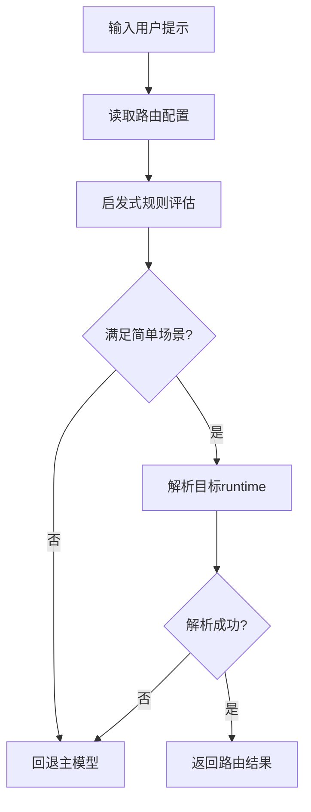

**图表来源**
- [agent/smart_model_routing.py](file://agent/smart_model_routing.py)
- [tests/agent/test_smart_model_routing.py](file://tests/agent/test_smart_model_routing.py)

**章节来源**
- [agent/smart_model_routing.py](file://agent/smart_model_routing.py)
- [tests/agent/test_smart_model_routing.py](file://tests/agent/test_smart_model_routing.py)

### 工具执行的安全检查与路径隔离
- 破坏性命令检测：tools/code_execution_tool.py 对工具名称进行白名单校验，限制最大调用次数与超时，避免滥用。
- 路径隔离与逃逸防护：tools/path_security.py 提供 validate_within_dir 与 has_traversal_component，确保路径解析后仍在允许根目录内。
- 托管沙箱：tools/environments/managed_modal.py 提供托管沙箱创建、超时与持久化文件系统，避免凭据挂载与主机文件泄露。

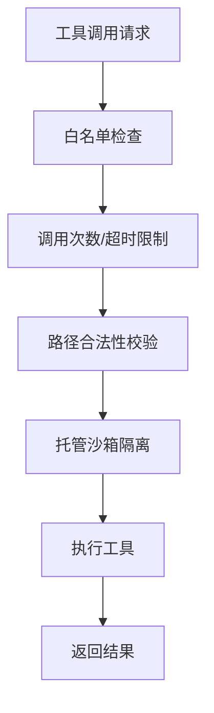

**图表来源**
- [tools/code_execution_tool.py](file://tools/code_execution_tool.py)
- [tools/path_security.py](file://tools/path_security.py)
- [tools/environments/managed_modal.py](file://tools/environments/managed_modal.py)

**章节来源**
- [tools/code_execution_tool.py](file://tools/code_execution_tool.py)
- [tools/path_security.py](file://tools/path_security.py)
- [tools/environments/managed_modal.py](file://tools/environments/managed_modal.py)

### 结果持久化与预算控制
- 单工具阈值：工具内部可自行截断输出，作为第一道防线。
- 结果持久化：超过阈值的结果写入沙箱临时目录，以“预览+文件路径”的形式替代，模型可使用 read_file 读取。
- 每轮聚合预算：对一轮内所有工具结果进行汇总预算控制，优先持久化最大的非持久化结果，直至低于预算上限。

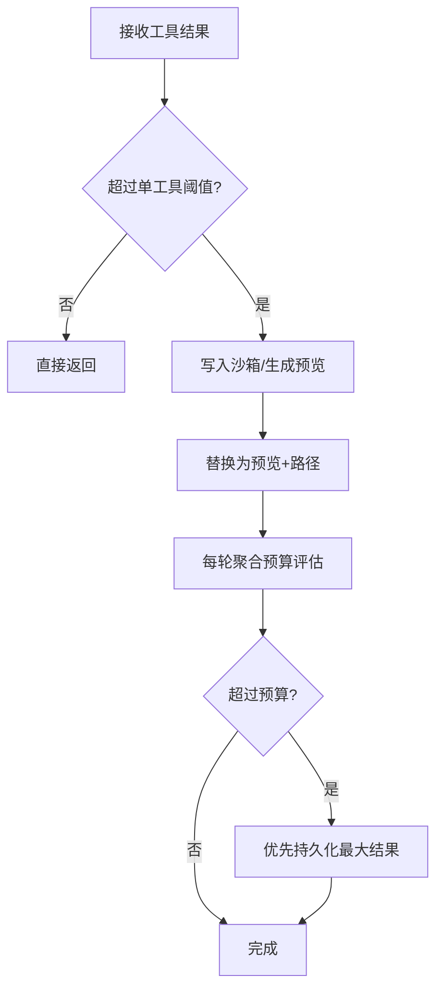

**图表来源**
- [tools/tool_result_storage.py](file://tools/tool_result_storage.py)
- [tests/tools/test_tool_result_storage.py](file://tests/tools/test_tool_result_storage.py)

**章节来源**
- [tools/tool_result_storage.py](file://tools/tool_result_storage.py)
- [tests/tools/test_tool_result_storage.py](file://tests/tools/test_tool_result_storage.py)

### 错误处理、重试策略与超时管理
- 抖动退避重试：agent/retry_utils.py 提供带抖动的指数退避，降低并发重试风暴风险。
- 工具执行错误：run_agent 对工具执行异常统一包装为 JSON 错误字符串，并记录工具错误明细。
- 未应答工具调用：对未收到对应 tool 消息的 assistant 工具调用，自动注入错误消息，保持历史一致性。
- 超时与心跳：run_agent 在并发执行期间定期心跳，避免网关误判空闲；托管沙箱设置超时与空闲超时。

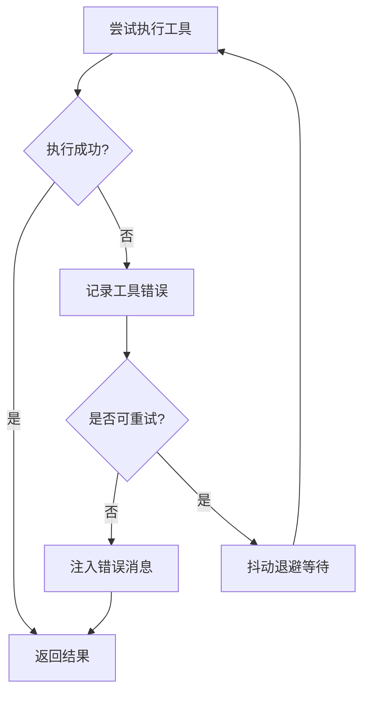

**图表来源**
- [agent/retry_utils.py](file://agent/retry_utils.py)
- [run_agent.py](file://run_agent.py)

**章节来源**
- [agent/retry_utils.py](file://agent/retry_utils.py)
- [run_agent.py](file://run_agent.py)
- [tools/environments/managed_modal.py](file://tools/environments/managed_modal.py)

### 与工具注册表、内存管理与会话状态的集成
- 内存管理器：内存工具由内存管理器统一注入，避免与插件注册工具重复；当提供者 on_memory_write 失败时，其他提供者仍正常通知。
- 记忆提供者插件：mem0 与 supermemory 插件实现工具调用与异步写入，失败时记录并优雅降级。
- 会话状态：会话持久化包含 cwd、provider、base_url、api_mode 等元信息，fork/恢复时从数据库还原。

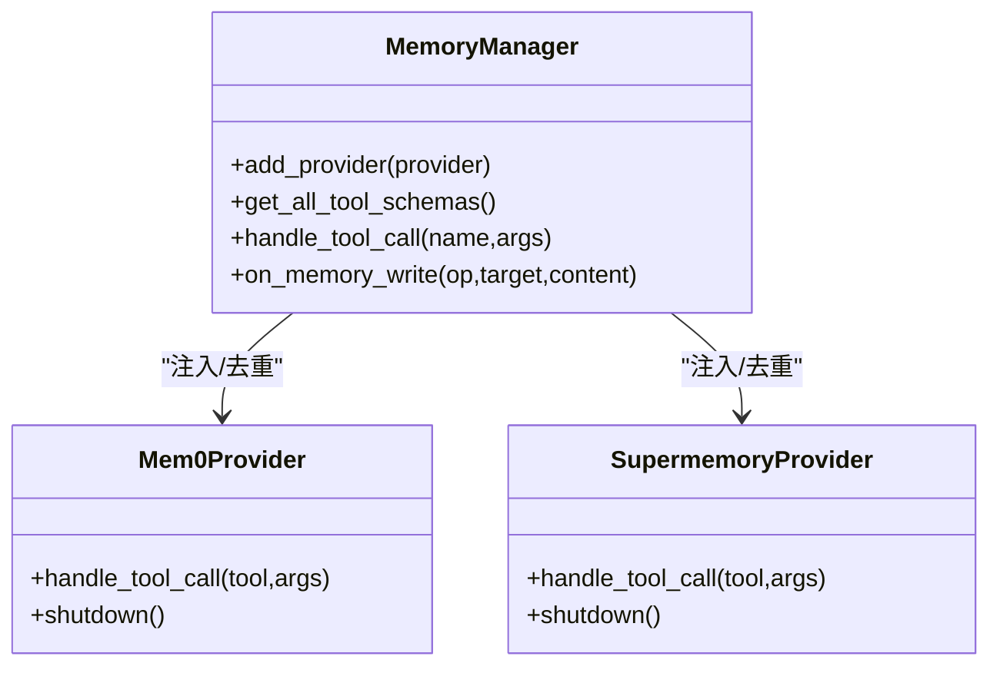

**图表来源**
- [plugins/memory/mem0/__init__.py](file://plugins/memory/mem0/__init__.py)
- [plugins/memory/supermemory/__init__.py](file://plugins/memory/supermemory/__init__.py)
- [tests/agent/test_memory_provider.py](file://tests/agent/test_memory_provider.py)

**章节来源**
- [plugins/memory/mem0/__init__.py](file://plugins/memory/mem0/__init__.py)
- [plugins/memory/supermemory/__init__.py](file://plugins/memory/supermemory/__init__.py)
- [tests/agent/test_memory_provider.py](file://tests/agent/test_memory_provider.py)

## 依赖分析
- 组件耦合与内聚：工具注册中心与工具编排层低耦合，通过 Schema 与处理器接口交互；调用编排层集中处理并发与聚合，内聚度高。
- 外部依赖：托管沙箱依赖外部服务；智能路由依赖运行时解析；结果持久化依赖环境提供的临时目录与执行能力。
- 循环依赖规避：tools/registry.py 不依赖 model_tools 或具体工具模块，避免循环导入。

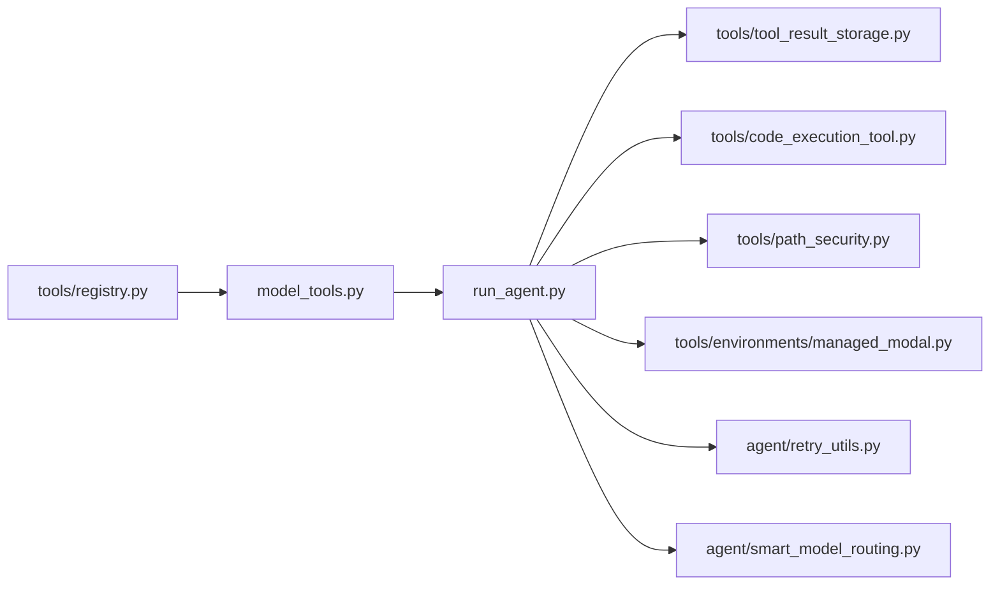

**图表来源**
- [tools/registry.py](file://tools/registry.py)
- [model_tools.py](file://model_tools.py)
- [run_agent.py](file://run_agent.py)
- [tools/tool_result_storage.py](file://tools/tool_result_storage.py)
- [tools/code_execution_tool.py](file://tools/code_execution_tool.py)
- [tools/path_security.py](file://tools/path_security.py)
- [tools/environments/managed_modal.py](file://tools/environments/managed_modal.py)
- [agent/retry_utils.py](file://agent/retry_utils.py)
- [agent/smart_model_routing.py](file://agent/smart_model_routing.py)

**章节来源**
- [tools/registry.py](file://tools/registry.py)
- [model_tools.py](file://model_tools.py)
- [run_agent.py](file://run_agent.py)

## 性能考量
- 并发度控制：run_agent 限制最大工作线程，避免线程过多导致上下文切换开销；线程池在 RL/环境工具执行中也采用固定大小，减少事件循环抖动。
- 异步桥接：model_tools 统一维护长生命周期事件循环，避免“事件循环已关闭”错误与客户端重建成本。
- 结果持久化：优先持久化大结果而非内联截断，减少重复计算与模型重试；预算控制按大小排序，最小化多次持久化。
- 路由优化：智能路由仅在简单场景启用，复杂场景回退主模型，平衡成本与质量。

[本节为通用性能讨论，不直接分析具体文件]

## 故障排查指南
- 工具未出现或不可用：检查 tools/registry.py 的可用性检查函数与工具集要求；确认 model_tools 的工具集过滤逻辑。
- 工具执行报错：查看 run_agent 的工具错误记录与 JSON 错误格式；确认工具返回的 error 字段是否包含 exit_code 与负值。
- 结果过大导致上下文溢出：确认 tools/tool_result_storage.py 的阈值与持久化路径；检查每轮预算 enforce_turn_budget 是否生效。
- 路由未生效：核对 agent/smart_model_routing.py 的启发式规则与配置项；确认 resolve_runtime_provider 是否抛出异常。
- 重试风暴：检查 agent/retry_utils 的抖动退避参数；确认并发重试是否集中在同一 Provider。

**章节来源**
- [tools/registry.py](file://tools/registry.py)
- [run_agent.py](file://run_agent.py)
- [tools/tool_result_storage.py](file://tools/tool_result_storage.py)
- [agent/smart_model_routing.py](file://agent/smart_model_routing.py)
- [agent/retry_utils.py](file://agent/retry_utils.py)

## 结论
Hermes Agent 的工具调用处理系统通过“注册中心 + 编排层 + 执行与安全层”的分层设计，实现了从工具发现、参数校验、并发执行到结果聚合与安全隔离的闭环。智能路由在成本与质量间取得平衡，结果持久化与预算控制有效防止上下文溢出，抖动退避与心跳机制提升了稳定性。结合内存管理与会话状态的集成，系统在复杂多变的工具生态中保持了高可用与可维护性。

[本节为总结性内容，不直接分析具体文件]

## 附录
- 典型工具调用模式与参数传递示例（路径参考）
  - 工具定义与异步桥接：[model_tools.py](file://model_tools.py)
  - 工具注册与可用性检查：[tools/registry.py](file://tools/registry.py)
  - 并发执行与结果聚合：[run_agent.py](file://run_agent.py)
  - 结果持久化与预算控制：[tools/tool_result_storage.py](file://tools/tool_result_storage.py)
  - 代码执行沙箱与限制：[tools/code_execution_tool.py](file://tools/code_execution_tool.py)
  - 路径安全校验：[tools/path_security.py](file://tools/path_security.py)
  - 托管沙箱隔离：[tools/environments/managed_modal.py](file://tools/environments/managed_modal.py)
  - 抖动退避重试：[agent/retry_utils.py](file://agent/retry_utils.py)
  - 内存管理器与提供者插件：[plugins/memory/mem0/__init__.py](file://plugins/memory/mem0/__init__.py)、[plugins/memory/supermemory/__init__.py](file://plugins/memory/supermemory/__init__.py)
  - 智能路由测试用例：[tests/agent/test_smart_model_routing.py](file://tests/agent/test_smart_model_routing.py)
  - 结果持久化测试用例：[tests/tools/test_tool_result_storage.py](file://tests/tools/test_tool_result_storage.py)
  - 内存提供者测试用例：[tests/agent/test_memory_provider.py](file://tests/agent/test_memory_provider.py)
  - 插件工具测试用例：[tests/plugins/test_retaindb_plugin.py](file://tests/plugins/test_retaindb_plugin.py)

[本节为附录索引，不直接分析具体文件]