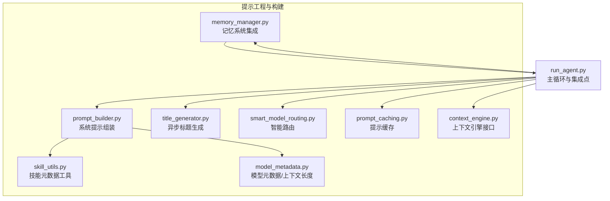
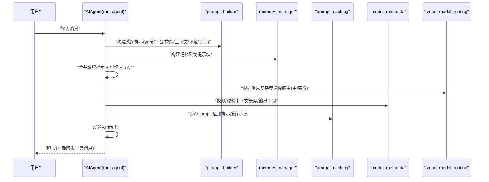
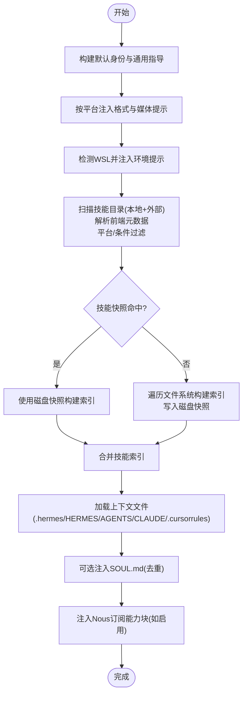
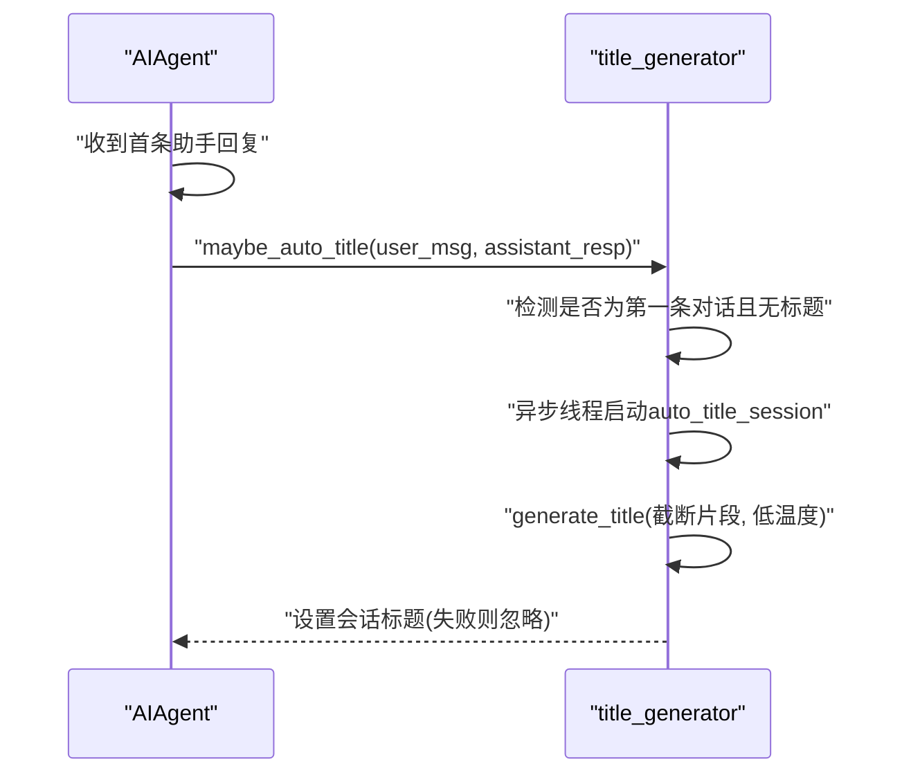
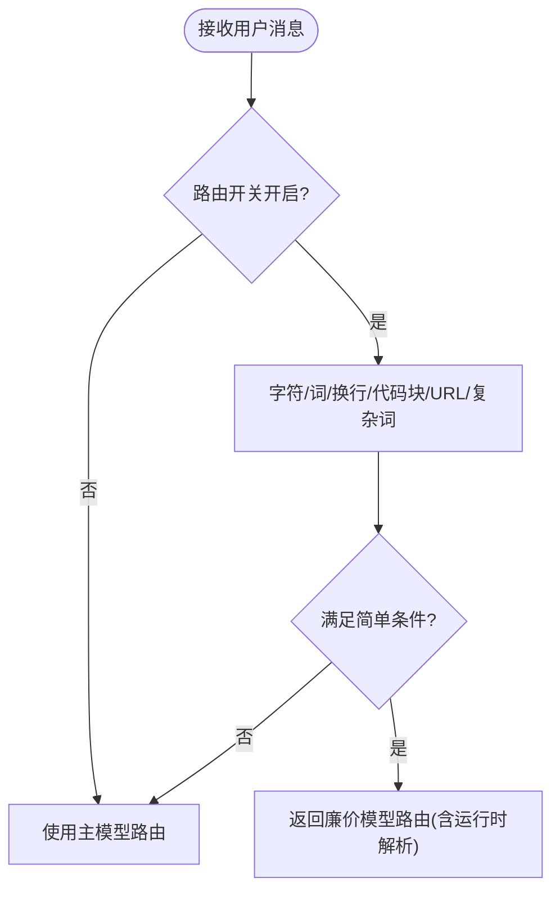
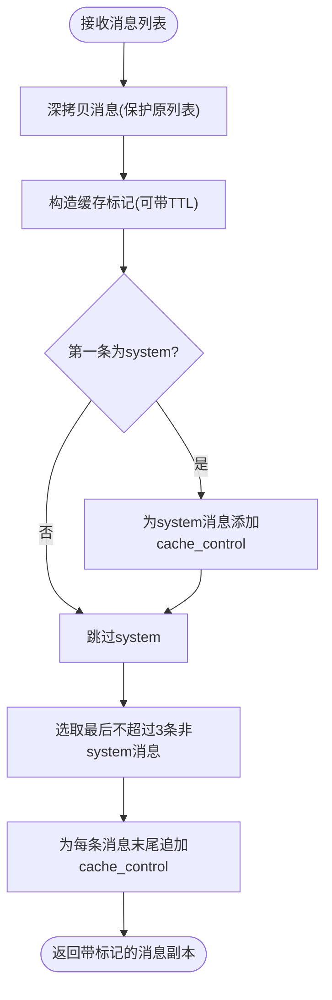
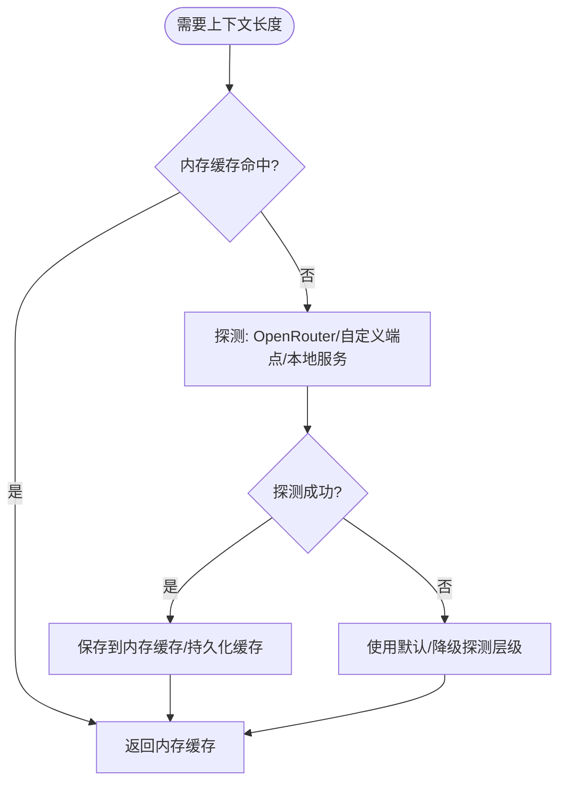
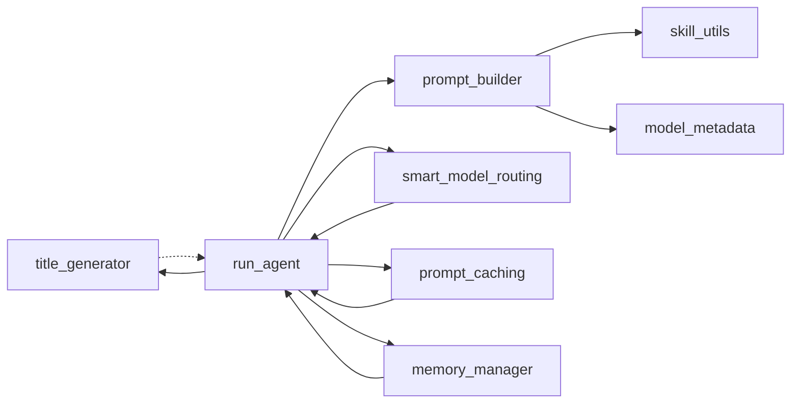

# 提示工程与构建

<cite>
**本文引用的文件**
- [prompt_builder.py](file://agent/prompt_builder.py)
- [title_generator.py](file://agent/title_generator.py)
- [smart_model_routing.py](file://agent/smart_model_routing.py)
- [prompt_caching.py](file://agent/prompt_caching.py)
- [model_metadata.py](file://agent/model_metadata.py)
- [skill_utils.py](file://agent/skill_utils.py)
- [memory_manager.py](file://agent/memory_manager.py)
- [context_engine.py](file://agent/context_engine.py)
- [run_agent.py](file://run_agent.py)
</cite>

## 目录
1. [引言](#引言)
2. [项目结构](#项目结构)
3. [核心组件](#核心组件)
4. [架构总览](#架构总览)
5. [详细组件分析](#详细组件分析)
6. [依赖分析](#依赖分析)
7. [性能考量](#性能考量)
8. [故障排查指南](#故障排查指南)
9. [结论](#结论)
10. [附录](#附录)

## 引言
本文件面向Hermes Agent的提示工程与构建系统，聚焦prompt_builder模块的设计理念与实现细节，系统阐述以下主题：
- 系统提示的组装：身份、平台提示、技能索引、上下文文件、环境提示、订阅能力块等
- 技能注入与条件过滤：按工具集/工具可用性、平台兼容性、禁用列表进行筛选
- 上下文文件处理：安全扫描、截断、优先级与合并
- 标题生成器：异步首条对话标题生成策略
- 智能路由：基于消息复杂度的廉价模型路由策略
- 模型特定格式化与提示规则：执行纪律、操作指导、角色切换
- 提示模板的动态生成与平台适配
- 提示缓存：Anthropic策略与跨轮复用
- 提示缓存的应用场景、策略与性能优化
- 与记忆系统、工具调用、模型元数据的协作关系
- 效果评估、调试技巧与最佳实践

## 项目结构
提示工程与构建相关的核心代码位于agent目录中，围绕run_agent主循环组织：
- 提示构建：prompt_builder.py（系统提示拼装、技能索引、上下文文件、环境提示、订阅能力）
- 标题生成：title_generator.py（异步首条对话标题）
- 智能路由：smart_model_routing.py（简单消息走廉价模型）
- 提示缓存：prompt_caching.py（Anthropic系统+最近N条消息缓存）
- 模型元数据：model_metadata.py（上下文长度探测、缓存、错误解析）
- 技能工具辅助：skill_utils.py（技能前端元数据解析、平台匹配、外部目录扫描）
- 记忆管理：memory_manager.py（系统提示块、上下文围栏、工具路由）
- 上下文引擎：context_engine.py（压缩策略接口）

图表来源
- [prompt_builder.py:1-1046](file://agent/prompt_builder.py#L1-L1046)
- [title_generator.py:1-126](file://agent/title_generator.py#L1-L126)
- [smart_model_routing.py:1-196](file://agent/smart_model_routing.py#L1-L196)
- [prompt_caching.py:1-73](file://agent/prompt_caching.py#L1-L73)
- [model_metadata.py:1-1117](file://agent/model_metadata.py#L1-L1117)
- [skill_utils.py:1-466](file://agent/skill_utils.py#L1-L466)
- [memory_manager.py:1-374](file://agent/memory_manager.py#L1-L374)
- [context_engine.py:1-185](file://agent/context_engine.py#L1-L185)
- [run_agent.py:1-11555](file://run_agent.py#L1-L11555)

章节来源
- [run_agent.py:81-98](file://run_agent.py#L81-L98)

## 核心组件
- 系统提示构建器：负责拼接身份、平台提示、技能索引、上下文文件、环境提示、订阅能力块，并在必要时注入工具使用强制与执行纪律
- 标题生成器：在首次响应后异步生成会话标题，避免影响首屏延迟
- 智能路由：根据消息复杂度与关键词启发式选择廉价模型，降低推理成本
- 提示缓存：针对Anthropic的系统+最近N条消息缓存策略，显著降低输入token成本
- 模型元数据：提供上下文长度探测、错误解析、本地服务识别与缓存持久化
- 技能工具辅助：解析技能前端元数据、平台匹配、外部目录扫描与条件过滤
- 记忆系统：提供系统提示块、上下文围栏与工具路由，确保模型不误读回忆内容

章节来源
- [prompt_builder.py:134-874](file://agent/prompt_builder.py#L134-L874)
- [title_generator.py:22-126](file://agent/title_generator.py#L22-L126)
- [smart_model_routing.py:62-196](file://agent/smart_model_routing.py#L62-L196)
- [prompt_caching.py:41-73](file://agent/prompt_caching.py#L41-L73)
- [model_metadata.py:443-616](file://agent/model_metadata.py#L443-L616)
- [skill_utils.py:52-169](file://agent/skill_utils.py#L52-L169)
- [memory_manager.py:157-174](file://agent/memory_manager.py#L157-L174)

## 架构总览
提示工程与构建在run_agent主循环中被调用，形成“系统提示 + 记忆 + 工具 + 上下文”的完整提示序列，并在发送前应用提示缓存与模型特定规则。

图表来源
- [run_agent.py:81-98](file://run_agent.py#L81-L98)
- [prompt_builder.py:583-808](file://agent/prompt_builder.py#L583-L808)
- [memory_manager.py:157-174](file://agent/memory_manager.py#L157-L174)
- [prompt_caching.py:41-73](file://agent/prompt_caching.py#L41-L73)
- [model_metadata.py:443-616](file://agent/model_metadata.py#L443-L616)
- [smart_model_routing.py:110-196](file://agent/smart_model_routing.py#L110-L196)

## 详细组件分析

### 系统提示构建器（prompt_builder）
设计理念：
- 分层拼装：身份、平台提示、技能索引、上下文文件、环境提示、订阅能力块
- 安全优先：上下文文件扫描威胁模式与不可见字符，防止注入
- 动态缓存：技能索引两层缓存（内存LRU + 磁盘快照），支持外部技能目录
- 平台适配：按平台注入格式与媒体交付提示；按模型家族注入执行纪律与操作指导
- 可扩展：通过常量与函数扩展新平台、模型族与提示块

关键流程与要点：
- 身份与通用指导：默认身份、记忆指导、会话检索指导、技能管理指导、工具使用强制与执行纪律
- 平台提示：针对WhatsApp、Telegram、Discord、Slack、Signal、Email、Cron、CLI、SMS、Weixin、WeCom、QQBot等注入格式与媒体交付建议
- 环境提示：检测WSL并注入路径与文件系统说明
- 技能索引：扫描本地与外部技能目录，解析前端元数据，按平台与条件过滤，构建紧凑索引；两层缓存加速
- 上下文文件：优先加载.git根目录下的.hermes.md或HERMES.md，否则顶层AGENTS.md/agents.md，或当前目录CLAUDE.md/claude.md，或当前目录.cursorrules与.rules/*.mdc；每个源限制最大字符并头尾截断；SOUL.md来自HERMES_HOME独立注入
- 订阅能力块：当启用受管理的Nous功能时，注入当前能力状态与使用建议

图表来源
- [prompt_builder.py:583-808](file://agent/prompt_builder.py#L583-L808)
- [prompt_builder.py:881-1046](file://agent/prompt_builder.py#L881-L1046)
- [skill_utils.py:52-169](file://agent/skill_utils.py#L52-L169)

章节来源
- [prompt_builder.py:134-874](file://agent/prompt_builder.py#L134-L874)
- [prompt_builder.py:881-1046](file://agent/prompt_builder.py#L881-L1046)
- [skill_utils.py:52-169](file://agent/skill_utils.py#L52-L169)

### 标题生成器（title_generator）
目标：在首次响应完成后异步生成会话标题，避免阻塞首屏体验。
- 触发条件：仅在检测到可能是第一条用户→助手对话且会话尚未有标题时
- 生成策略：截断首条对话片段，构造简短描述性标题，严格温度与token限制
- 异步执行：在后台线程启动，失败静默

图表来源
- [title_generator.py:95-126](file://agent/title_generator.py#L95-L126)
- [title_generator.py:22-93](file://agent/title_generator.py#L22-L93)

章节来源
- [title_generator.py:22-126](file://agent/title_generator.py#L22-L126)

### 智能路由（smart_model_routing）
目标：在消息相对简单时走廉价模型，降低推理成本；复杂/长文本/代码/调试类任务保持主模型。
- 关键启发式：字符数、词数、换行数、代码块标记、URL存在性、复杂关键词集合
- 返回路由：包含provider、model、api_key_env等，自动解析运行时并标注路由原因

图表来源
- [smart_model_routing.py:62-107](file://agent/smart_model_routing.py#L62-L107)
- [smart_model_routing.py:110-196](file://agent/smart_model_routing.py#L110-L196)

章节来源
- [smart_model_routing.py:62-196](file://agent/smart_model_routing.py#L62-L196)

### 提示缓存（prompt_caching）
目标：对Anthropic模型应用系统+最近N条消息的缓存控制标记，减少重复输入token消耗。
- 缓存策略：系统提示与最后3条非系统消息各打一个缓存标记
- TTL支持：可配置缓存保留时间
- 兼容性：处理tool消息、空内容、字符串与多模态内容的cache_control注入

图表来源
- [prompt_caching.py:15-73](file://agent/prompt_caching.py#L15-L73)

章节来源
- [prompt_caching.py:41-73](file://agent/prompt_caching.py#L41-L73)

### 模型元数据与上下文长度（model_metadata）
目标：统一探测与缓存模型上下文长度、输出上限、定价信息，支持错误解析与本地服务识别。
- 探测策略：OpenRouter元数据缓存、自定义端点/models探测、llama.cpp属性回填
- 错误解析：从错误消息提取上下文上限与可用输出token
- 本地识别：检测Ollama/LM Studio/llama.cpp/vLLM等本地服务
- 缓存持久化：将发现的上下文长度持久化到HERMES_HOME，重启后复用

图表来源
- [model_metadata.py:443-567](file://agent/model_metadata.py#L443-L567)
- [model_metadata.py:611-651](file://agent/model_metadata.py#L611-L651)

章节来源
- [model_metadata.py:443-694](file://agent/model_metadata.py#L443-L694)

### 技能工具辅助（skill_utils）
目标：轻量级技能元数据工具，避免引入重型依赖链，支持平台匹配、禁用列表、外部目录扫描与条件提取。
- 前端元数据：解析YAML frontmatter，支持嵌套与回退
- 平台匹配：根据frontmatter的platforms字段与当前系统匹配
- 条件提取：提取requires/fallback_for工具/工具集条件
- 外部目录：读取配置中的外部技能目录，去重与校验

章节来源
- [skill_utils.py:52-169](file://agent/skill_utils.py#L52-L169)
- [skill_utils.py:241-255](file://agent/skill_utils.py#L241-L255)
- [skill_utils.py:174-235](file://agent/skill_utils.py#L174-L235)

### 记忆系统集成（memory_manager）
目标：在系统提示中注入记忆块，在API调用时对回忆内容加围栏，避免模型误读为用户输入。
- 系统提示块：聚合各提供者的系统提示块
- 围栏与注释：对回忆内容包裹<memory-context>标签与系统注释，便于模型区分背景信息
- 工具路由：将工具名映射到提供者，统一处理工具调用

章节来源
- [memory_manager.py:65-80](file://agent/memory_manager.py#L65-L80)
- [memory_manager.py:157-174](file://agent/memory_manager.py#L157-L174)
- [memory_manager.py:249-267](file://agent/memory_manager.py#L249-L267)

## 依赖分析
提示工程与构建模块之间的耦合与协作：
- prompt_builder依赖skill_utils进行技能解析与平台匹配，依赖model_metadata进行上下文长度探测（间接）
- title_generator与run_agent通过回调与会话数据库交互
- smart_model_routing与run_agent的路由解析配合
- prompt_caching与run_agent在消息发送前应用
- memory_manager与run_agent在系统提示与上下文围栏处协作

图表来源
- [prompt_builder.py:18-27](file://agent/prompt_builder.py#L18-L27)
- [run_agent.py:81-98](file://run_agent.py#L81-L98)
- [title_generator.py:11-13](file://agent/title_generator.py#L11-L13)
- [smart_model_routing.py:9-9](file://agent/smart_model_routing.py#L9-L9)
- [prompt_caching.py:11-12](file://agent/prompt_caching.py#L11-L12)
- [memory_manager.py:36-37](file://agent/memory_manager.py#L36-L37)

章节来源
- [run_agent.py:81-98](file://run_agent.py#L81-L98)

## 性能考量
- 技能索引缓存
  - 内存LRU：以(技能目录、工具集、平台提示)为键，限制最大项数，命中即移动至末尾
  - 磁盘快照：基于mtime/size清单验证，避免冷启动全量扫描
  - 外部目录：只读扫描，去重优先，避免重复技能
- 上下文文件截断：头尾截断并插入占位符，控制单源大小
- 提示缓存：Anthropic系统+最近N条消息缓存，显著降低输入token成本
- 智能路由：简单消息走廉价模型，减少主模型调用次数
- 模型元数据缓存：OpenRouter元数据1小时缓存，自定义端点models结果5分钟缓存；本地服务探测与上下文长度持久化

章节来源
- [prompt_builder.py:428-527](file://agent/prompt_builder.py#L428-L527)
- [prompt_builder.py:881-891](file://agent/prompt_builder.py#L881-L891)
- [prompt_caching.py:41-73](file://agent/prompt_caching.py#L41-L73)
- [smart_model_routing.py:62-107](file://agent/smart_model_routing.py#L62-L107)
- [model_metadata.py:443-567](file://agent/model_metadata.py#L443-L567)

## 故障排查指南
- 上下文文件注入失败
  - 现象：.hermes.md/AGENTS.md/CLAUDE.md/.cursorrules被阻止或为空
  - 排查：检查威胁模式与不可见字符扫描日志；确认文件编码与大小限制
  - 参考
    - [prompt_builder.py:55-73](file://agent/prompt_builder.py#L55-L73)
    - [prompt_builder.py:881-1046](file://agent/prompt_builder.py#L881-L1046)
- 技能索引为空
  - 现象：系统提示缺少技能索引
  - 排查：确认技能目录存在、前端元数据有效、平台匹配、禁用列表、条件过滤
  - 参考
    - [prompt_builder.py:583-808](file://agent/prompt_builder.py#L583-L808)
    - [skill_utils.py:92-115](file://agent/skill_utils.py#L92-L115)
- 提示缓存未生效
  - 现象：Anthropic输入token未减少
  - 排查：确认消息顺序（system在前）、非system消息数量、cache_control注入位置
  - 参考
    - [prompt_caching.py:41-73](file://agent/prompt_caching.py#L41-L73)
- 路由未切换
  - 现象：简单消息仍走主模型
  - 排查：检查路由开关、阈值配置、复杂关键词命中
  - 参考
    - [smart_model_routing.py:62-107](file://agent/smart_model_routing.py#L62-L107)
- 上下文溢出或输出受限
  - 现象：API报错或输出被截断
  - 排查：解析错误消息中的上下文上限与可用输出token；必要时降低max_tokens或压缩历史
  - 参考
    - [model_metadata.py:626-694](file://agent/model_metadata.py#L626-L694)
- 记忆内容被误读
  - 现象：模型将回忆当作用户输入
  - 排查：确认记忆上下文已围栏；检查工具调用路由
  - 参考
    - [memory_manager.py:65-80](file://agent/memory_manager.py#L65-L80)
    - [memory_manager.py:249-267](file://agent/memory_manager.py#L249-L267)

## 结论
Hermes Agent的提示工程与构建系统通过分层设计与多层缓存，实现了高可扩展、高性能与强安全性的系统提示组装。prompt_builder模块将身份、平台、技能、上下文、环境与订阅能力有机融合；title_generator、smart_model_routing、prompt_caching与model_metadata分别从体验、成本、传输与元数据角度提供优化；memory_manager确保回忆内容的正确隔离与工具路由。整体方案在保证安全性的同时，兼顾了跨平台、多模型与多工具场景下的稳定性与效率。

## 附录
- 代码示例路径（不直接展示代码）：
  - 系统提示构建：[build_skills_system_prompt:583-808](file://agent/prompt_builder.py#L583-L808)
  - 上下文文件加载：[build_context_files_prompt:1006-1046](file://agent/prompt_builder.py#L1006-L1046)
  - 环境提示：[build_environment_hints:407-416](file://agent/prompt_builder.py#L407-L416)
  - 订阅能力块：[build_nous_subscription_prompt:811-874](file://agent/prompt_builder.py#L811-L874)
  - 标题生成入口：[maybe_auto_title:95-126](file://agent/title_generator.py#L95-L126)
  - 智能路由：[resolve_turn_route:110-196](file://agent/smart_model_routing.py#L110-L196)
  - 提示缓存：[apply_anthropic_cache_control:41-73](file://agent/prompt_caching.py#L41-L73)
  - 模型元数据探测：[fetch_endpoint_model_metadata:479-567](file://agent/model_metadata.py#L479-L567)
  - 记忆系统提示块：[build_system_prompt:157-174](file://agent/memory_manager.py#L157-L174)