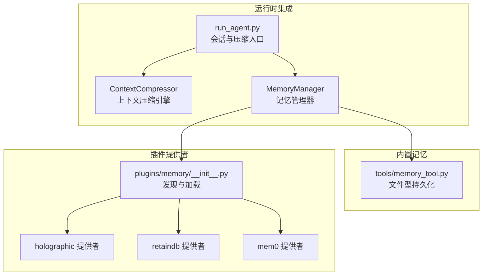
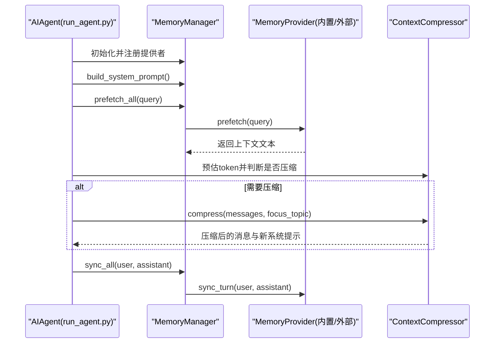
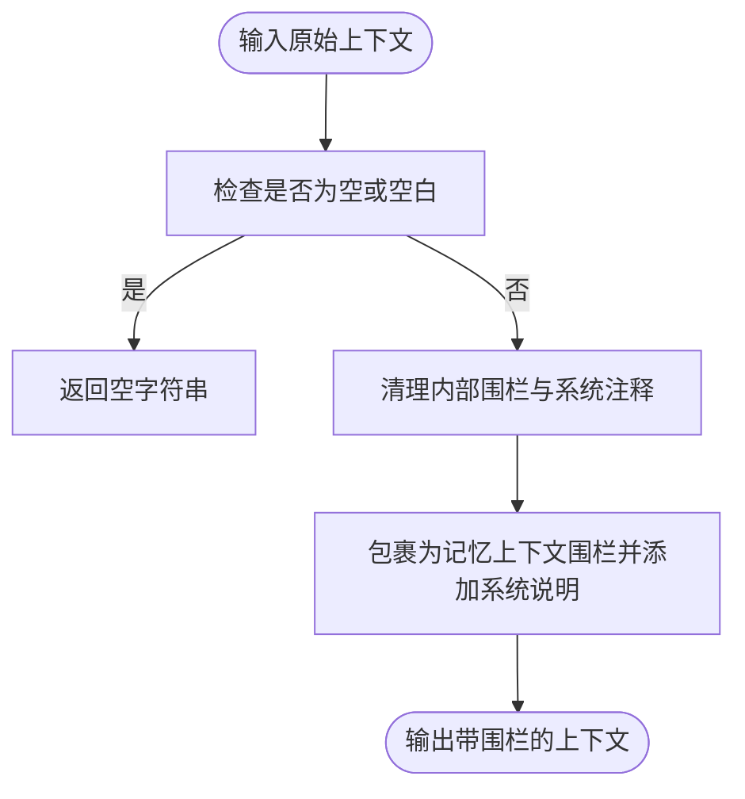
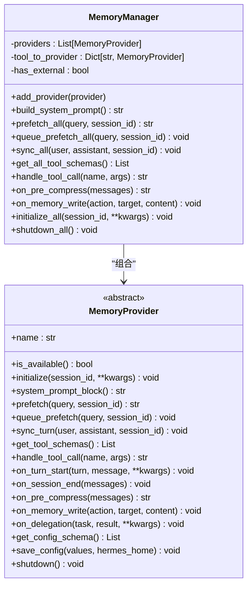
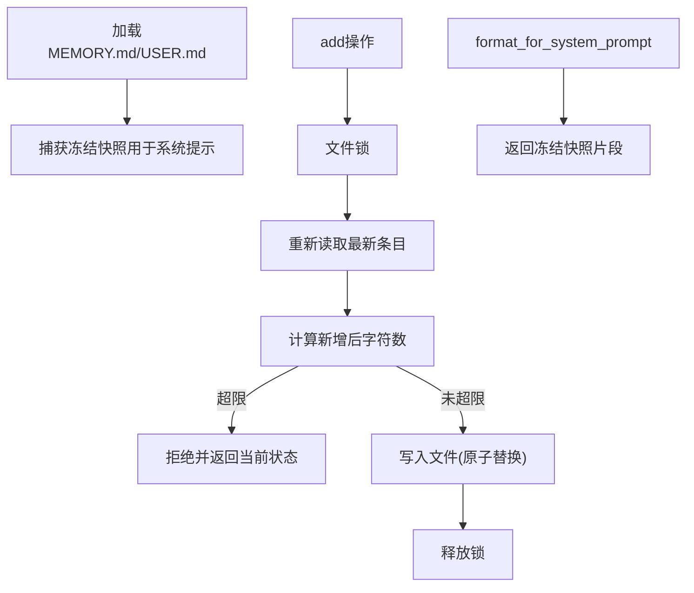
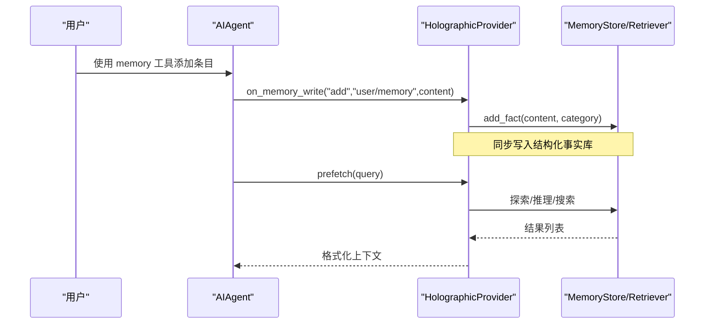
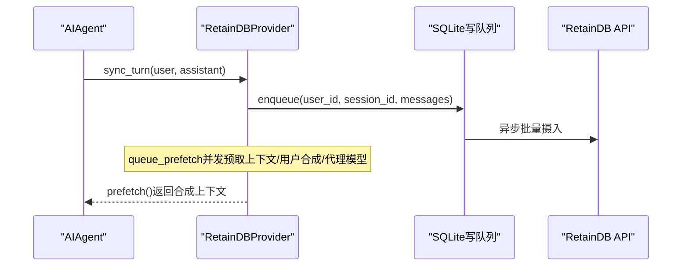
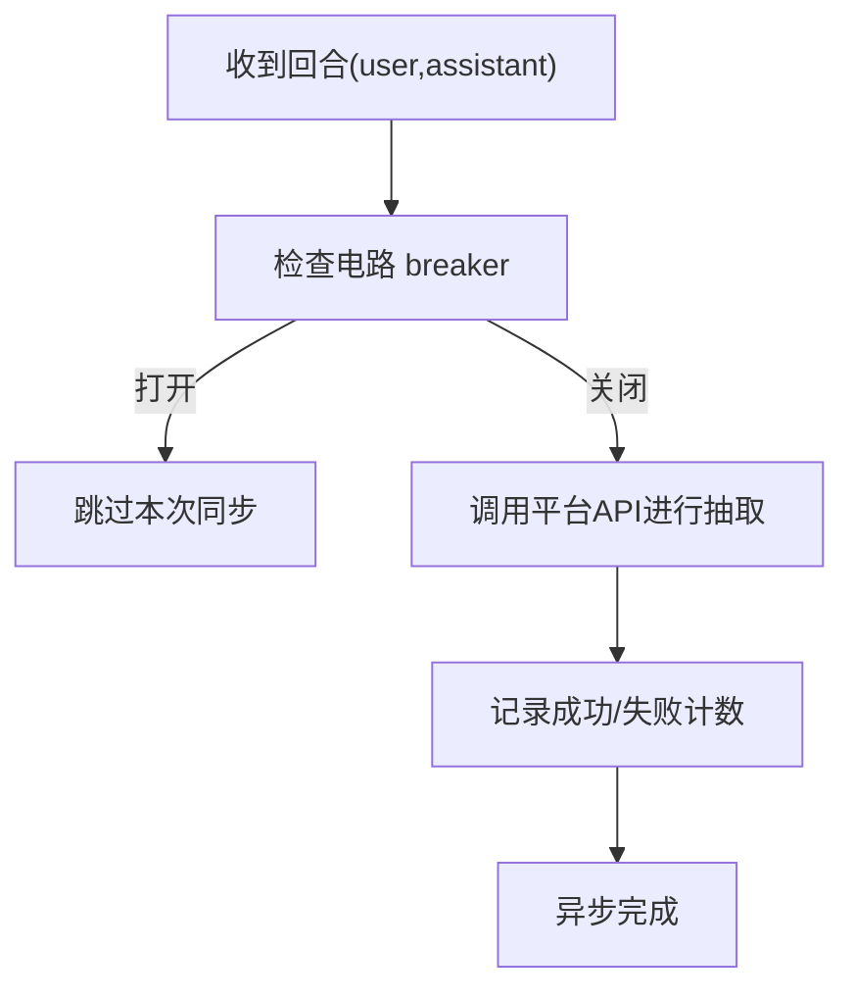
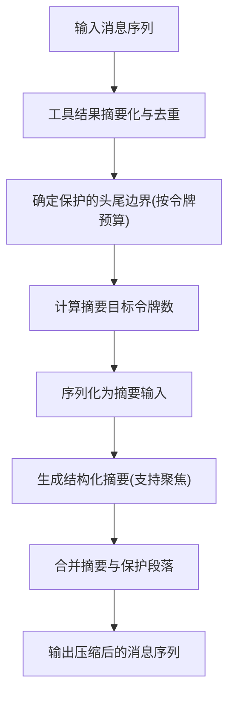
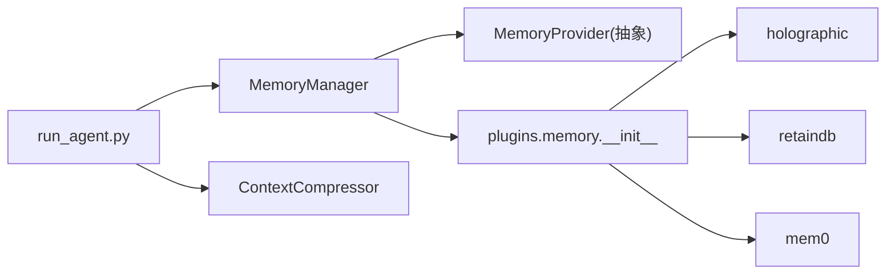

# 记忆管理系统

<cite>
**本文档引用的文件**
- [agent/memory_manager.py](file://agent/memory_manager.py)
- [agent/memory_provider.py](file://agent/memory_provider.py)
- [plugins/memory/__init__.py](file://plugins/memory/__init__.py)
- [plugins/memory/holographic/__init__.py](file://plugins/memory/holographic/__init__.py)
- [plugins/memory/retaindb/__init__.py](file://plugins/memory/retaindb/__init__.py)
- [plugins/memory/mem0/__init__.py](file://plugins/memory/mem0/__init__.py)
- [tools/memory_tool.py](file://tools/memory_tool.py)
- [agent/context_compressor.py](file://agent/context_compressor.py)
- [run_agent.py](file://run_agent.py)
- [hermes_cli/plugins_cmd.py](file://hermes_cli/plugins_cmd.py)
- [tests/agent/test_memory_provider.py](file://tests/agent/test_memory_provider.py)
- [tests/plugins/test_retaindb_plugin.py](file://tests/plugins/test_retaindb_plugin.py)
</cite>

## 目录
1. [简介](#简介)
2. [项目结构](#项目结构)
3. [核心组件](#核心组件)
4. [架构总览](#架构总览)
5. [详细组件分析](#详细组件分析)
6. [依赖关系分析](#依赖关系分析)
7. [性能考虑](#性能考虑)
8. [故障排除指南](#故障排除指南)
9. [结论](#结论)

## 简介
本文件系统性阐述 Hermes Agent 的记忆管理系统，覆盖以下主题：
- 记忆管理器架构与 build_memory_context_block 实现
- 记忆块构建策略与上下文压缩机制
- 用户画像管理与记忆检索算法
- 持久化存储策略与插件化记忆提供者体系
- 存储后端适配与数据迁移机制
- 记忆索引优化、查询性能提升与内存使用控制
- 与上下文压缩、工具调用、会话管理的协作关系
- 性能瓶颈与数据一致性问题的解决方案

## 项目结构
Hermes 记忆系统由内置记忆（本地文件）与外部插件提供者共同组成，通过 MemoryManager 统一编排，并在运行时与上下文压缩引擎协同工作。

**图表来源**
- [run_agent.py:7152-7252](file://run_agent.py#L7152-L7252)
- [agent/context_compressor.py:188-330](file://agent/context_compressor.py#L188-L330)
- [agent/memory_manager.py:83-374](file://agent/memory_manager.py#L83-L374)
- [plugins/memory/__init__.py:122-182](file://plugins/memory/__init__.py#L122-L182)

**章节来源**
- [agent/memory_manager.py:1-374](file://agent/memory_manager.py#L1-L374)
- [plugins/memory/__init__.py:1-407](file://plugins/memory/__init__.py#L1-L407)
- [tools/memory_tool.py:1-585](file://tools/memory_tool.py#L1-L585)
- [agent/context_compressor.py:1-800](file://agent/context_compressor.py#L1-L800)
- [run_agent.py:7152-7252](file://run_agent.py#L7152-L7252)

## 核心组件
- MemoryManager：统一注册与编排内置与外部记忆提供者，负责系统提示拼装、预取、同步、工具路由与生命周期钩子。
- MemoryProvider 抽象基类：定义插件提供者必须实现的生命周期与可选钩子。
- 内置记忆（MemoryStore）：基于文件的持久化，支持冻结快照注入系统提示，避免前缀缓存失效。
- 插件提供者：holographic（结构化事实存储）、retaindb（云端检索与合成）、mem0（平台 API 语义检索与去重）。
- 上下文压缩引擎：在会话过长时对历史进行损失性压缩，保护头尾并生成结构化摘要。

**章节来源**
- [agent/memory_manager.py:83-374](file://agent/memory_manager.py#L83-L374)
- [agent/memory_provider.py:42-232](file://agent/memory_provider.py#L42-L232)
- [tools/memory_tool.py:105-461](file://tools/memory_tool.py#L105-L461)
- [plugins/memory/holographic/__init__.py:114-408](file://plugins/memory/holographic/__init__.py#L114-L408)
- [plugins/memory/retaindb/__init__.py:452-767](file://plugins/memory/retaindb/__init__.py#L452-L767)
- [plugins/memory/mem0/__init__.py:119-374](file://plugins/memory/mem0/__init__.py#L119-L374)
- [agent/context_compressor.py:188-800](file://agent/context_compressor.py#L188-L800)

## 架构总览
记忆系统采用“内置优先 + 外部插件”的双层架构。内置提供者始终激活，外部提供者最多一个，二者通过 MemoryManager 协同工作。运行时在每轮对话前进行预取，在每轮结束后进行同步，并在上下文过长时触发压缩。

**图表来源**
- [run_agent.py:7152-7252](file://run_agent.py#L7152-L7252)
- [agent/memory_manager.py:157-220](file://agent/memory_manager.py#L157-L220)
- [agent/context_compressor.py:310-331](file://agent/context_compressor.py#L310-L331)

**章节来源**
- [run_agent.py:7152-7252](file://run_agent.py#L7152-L7252)
- [agent/memory_manager.py:157-220](file://agent/memory_manager.py#L157-L220)
- [agent/context_compressor.py:310-331](file://agent/context_compressor.py#L310-L331)

## 详细组件分析

### build_memory_context_block 与上下文围栏
- 功能：将从提供者召回的记忆内容包裹在特定围栏标签中，并注入系统提示说明，防止模型将回忆内容误认为用户输入。
- 安全性：提供 sanitize_context 清理内部标签与系统注释，避免注入风险。
- 使用时机：仅在 API 调用时注入，不写入持久化存储。

**图表来源**
- [agent/memory_manager.py:57-80](file://agent/memory_manager.py#L57-L80)

**章节来源**
- [agent/memory_manager.py:57-80](file://agent/memory_manager.py#L57-L80)
- [tests/agent/test_memory_provider.py:756-782](file://tests/agent/test_memory_provider.py#L756-L782)

### MemoryManager：统一编排与生命周期
- 注册限制：内置提供者始终存在且不可移除；最多允许一个外部提供者。
- 生命周期钩子：initialize、system_prompt_block、prefetch、queue_prefetch、sync_turn、get_tool_schemas、handle_tool_call、on_turn_start、on_session_end、on_pre_compress、on_memory_write、on_delegation、shutdown。
- 工具路由：根据工具名将调用分发给对应提供者，避免冲突。
- 线程安全：各提供者独立初始化，hermes_home 自动注入以确保路径隔离。

**图表来源**
- [agent/memory_manager.py:83-374](file://agent/memory_manager.py#L83-L374)
- [agent/memory_provider.py:42-232](file://agent/memory_provider.py#L42-L232)

**章节来源**
- [agent/memory_manager.py:83-374](file://agent/memory_manager.py#L83-L374)
- [agent/memory_provider.py:42-232](file://agent/memory_provider.py#L42-L232)

### 内置记忆（MemoryStore）：用户画像与环境事实
- 文件存储：MEMORY.md（个人笔记/环境事实）、USER.md（用户画像），均以分节符分隔条目。
- 字符限制：分别配置上限，防止系统提示膨胀。
- 冻结快照：首次加载时捕获快照，贯穿会话稳定不变，避免前缀缓存失效。
- 并发安全：写入采用原子替换 + 锁文件，读取直接读取完整文件，保证一致性。
- 内容扫描：阻断潜在注入与敏感信息泄露模式，保障注入到系统提示的内容安全。

**图表来源**
- [tools/memory_tool.py:124-141](file://tools/memory_tool.py#L124-L141)
- [tools/memory_tool.py:222-265](file://tools/memory_tool.py#L222-L265)
- [tools/memory_tool.py:431-461](file://tools/memory_tool.py#L431-L461)

**章节来源**
- [tools/memory_tool.py:105-461](file://tools/memory_tool.py#L105-L461)

### 插件提供者：holographic（结构化事实与推理）
- 存储：SQLite + HRR 向量，支持实体解析、信任评分与时间衰减。
- 检索：FTS5 + 向量相似度，支持搜索、探查实体、关联、推理与矛盾检测。
- 工具：fact_store（增删改查/分类/标签/信任调整）、fact_feedback（帮助性反馈训练）。
- 自动抽取：会话结束时按规则抽取偏好与决策类事实。
- 镜像写入：内置记忆 add 时自动镜像为 user_pref/general 类别。

**图表来源**
- [plugins/memory/holographic/__init__.py:243-251](file://plugins/memory/holographic/__init__.py#L243-L251)
- [plugins/memory/holographic/__init__.py:205-224](file://plugins/memory/holographic/__init__.py#L205-L224)
- [plugins/memory/holographic/retrieval.py:481-493](file://plugins/memory/holographic/retrieval.py#L481-L493)

**章节来源**
- [plugins/memory/holographic/__init__.py:114-408](file://plugins/memory/holographic/__init__.py#L114-L408)
- [plugins/memory/holographic/retrieval.py:346-493](file://plugins/memory/holographic/retrieval.py#L346-L493)

### 插件提供者：retaindb（云端检索与合成）
- 云端 API：提供检索、上下文合成、用户画像、代理自我模型、共享文件工具。
- 写入队列：SQLite 异步写队列，崩溃安全，启动重放。
- 预取：并发线程预取上下文、用户合成与代理模型，消费于下一轮开始。
- 工具：profile、search、context、remember、forget、文件上传/列举/读取/提取/删除。
- 镜像写入：内置记忆 add 时映射为 factual/preference。

**图表来源**
- [plugins/memory/retaindb/__init__.py:329-408](file://plugins/memory/retaindb/__init__.py#L329-L408)
- [plugins/memory/retaindb/__init__.py:542-624](file://plugins/memory/retaindb/__init__.py#L542-L624)
- [plugins/memory/retaindb/__init__.py:747-756](file://plugins/memory/retaindb/__init__.py#L747-L756)

**章节来源**
- [plugins/memory/retaindb/__init__.py:452-767](file://plugins/memory/retaindb/__init__.py#L452-L767)

### 插件提供者：mem0（平台 API 语义检索）
- 服务端抽取：每次回合将对话交由平台进行事实抽取，非阻塞。
- 检索：支持关键词与语义检索，可启用重排序提高精度。
- 工具：profile（快速概览）、search（语义检索）、conclude（显式存储）。
- 稳定性：电路 breaker 防抖，连续失败后冷却，避免雪崩。

**图表来源**
- [plugins/memory/mem0/__init__.py:180-202](file://plugins/memory/mem0/__init__.py#L180-L202)
- [plugins/memory/mem0/__init__.py:272-296](file://plugins/memory/mem0/__init__.py#L272-L296)

**章节来源**
- [plugins/memory/mem0/__init__.py:119-374](file://plugins/memory/mem0/__init__.py#L119-L374)

### 上下文压缩：策略与实现
- 预处理：先对旧工具结果进行廉价摘要化与重复项去重，减少后续 LLM 压缩负担。
- 保护策略：保护头部与尾部消息，尾部采用“按令牌预算”而非固定数量，更贴合实际内容长度。
- 结构化摘要：使用模板化的摘要结构（目标、已完成、进行中、阻塞、决策、已解决/待办问题、文件、剩余工作、关键上下文），并支持迭代更新。
- 聚焦压缩：支持用户指定 focus_topic，使摘要更偏向保留该主题相关信息。
- 失败回退：摘要模型不可用时进入冷却，必要时回退到主模型继续压缩。

**图表来源**
- [agent/context_compressor.py:336-468](file://agent/context_compressor.py#L336-L468)
- [agent/context_compressor.py:474-544](file://agent/context_compressor.py#L474-L544)
- [agent/context_compressor.py:545-756](file://agent/context_compressor.py#L545-L756)

**章节来源**
- [agent/context_compressor.py:188-800](file://agent/context_compressor.py#L188-L800)
- [run_agent.py:7152-7252](file://run_agent.py#L7152-L7252)

### 记忆检索算法与索引优化
- Holographic（holographic）：FTS5 + HRR 向量相似度，支持实体探查、邻接关系与多实体推理；内置矛盾检测阈值控制。
- RetainDB（retaindb）：云端语义检索 + 用户画像 + 代理自我模型合成；提供上下文叠加去重，避免重复信息。
- Mem0（mem0）：平台侧抽取 + 语义检索，支持重排序；通过过滤器限定用户/代理作用域，避免跨会话污染。

**章节来源**
- [plugins/memory/holographic/retrieval.py:481-493](file://plugins/memory/holographic/retrieval.py#L481-L493)
- [plugins/memory/retaindb/__init__.py:643-744](file://plugins/memory/retaindb/__init__.py#L643-L744)
- [plugins/memory/mem0/__init__.py:297-362](file://plugins/memory/mem0/__init__.py#L297-L362)

### 持久化存储策略与数据迁移
- 内置存储：文件型持久化，原子写入，锁文件保障并发安全；支持配置字符上限与去重。
- 插件存储：holographic 使用 SQLite；retaindb 使用本地 SQLite 写队列；mem0 通过平台 API 持久化。
- 数据迁移：插件发现与加载模块支持 bundled 与 user-installed 双路径，名称冲突时 bundled 优先；提供 save_config/schema 以便迁移配置。

**章节来源**
- [tools/memory_tool.py:431-461](file://tools/memory_tool.py#L431-L461)
- [plugins/memory/__init__.py:122-182](file://plugins/memory/__init__.py#L122-L182)
- [plugins/memory/retaindb/__init__.py:329-408](file://plugins/memory/retaindb/__init__.py#L329-L408)

### 与上下文压缩、工具调用、会话管理的协作
- 上下文压缩：在压缩前通知提供者 on_pre_compress，收集可用于摘要的关键洞察；压缩后更新令牌估算，清除文件读取去重缓存。
- 工具调用：MemoryManager 将工具调用路由至对应提供者；提供者内部可并发预取与异步写入，不影响主线程。
- 会话管理：提供 on_session_end、on_delegation 等钩子，便于在会话边界执行数据归档与观察子任务结果。

**章节来源**
- [run_agent.py:7152-7252](file://run_agent.py#L7152-L7252)
- [agent/memory_manager.py:285-344](file://agent/memory_manager.py#L285-L344)

## 依赖关系分析
- 运行时依赖：run_agent.py 依赖 MemoryManager 与 ContextCompressor；MemoryManager 依赖 MemoryProvider 抽象与具体插件实现。
- 插件发现：plugins/memory/__init__.py 负责扫描 bundled 与 user-installed 插件目录，加载并注册提供者。
- CLI 集成：hermes_cli 支持选择当前记忆提供者与上下文引擎，影响运行时行为。

**图表来源**
- [run_agent.py:7152-7252](file://run_agent.py#L7152-L7252)
- [agent/memory_manager.py:83-374](file://agent/memory_manager.py#L83-L374)
- [plugins/memory/__init__.py:122-182](file://plugins/memory/__init__.py#L122-L182)

**章节来源**
- [run_agent.py:7152-7252](file://run_agent.py#L7152-L7252)
- [hermes_cli/plugins_cmd.py:664-708](file://hermes_cli/plugins_cmd.py#L664-L708)

## 性能考虑
- 预处理与去重：在压缩前对工具结果进行摘要化与重复项去重，显著降低 LLM 摘要成本。
- 令牌预算尾保护：以尾部令牌预算替代固定消息数，更贴合真实内容长度分布。
- 结构化摘要：模板化摘要减少歧义，提升后续任务连续性。
- 并发与异步：插件提供者普遍采用后台线程与异步队列，避免阻塞主循环。
- 电路 breaker：mem0 提供失败冷却与回退策略，避免服务端压力雪崩。
- 字符限制与冻结快照：内置记忆严格控制系统提示大小，冻结快照保持前缀缓存稳定。

[本节为通用指导，无需特定文件引用]

## 故障排除指南
- 插件加载失败：检查插件目录结构与 __init__.py 是否包含 register 或 MemoryProvider 子类；查看日志中的加载错误。
- 提供者冲突：同时注册多个外部提供者会被拒绝，需在配置中明确选择一个。
- 内容注入风险：内置记忆对写入内容进行威胁模式扫描，若命中将被拒绝。
- RetainDB 写入队列：若出现写入失败，检查 SQLite 队列表与错误字段，系统会在重启后重放。
- 压缩失败冷却：当摘要模型不可用时，压缩器会进入长时间冷却，建议切换摘要模型或等待冷却结束。

**章节来源**
- [plugins/memory/__init__.py:159-182](file://plugins/memory/__init__.py#L159-L182)
- [tests/agent/test_memory_provider.py:427-451](file://tests/agent/test_memory_provider.py#L427-L451)
- [tools/memory_tool.py:90-103](file://tools/memory_tool.py#L90-L103)
- [plugins/memory/retaindb/__init__.py:380-408](file://plugins/memory/retaindb/__init__.py#L380-L408)
- [agent/context_compressor.py:709-756](file://agent/context_compressor.py#L709-L756)

## 结论
Hermes 记忆系统通过“内置优先 + 外部插件”的架构实现了高扩展性与强一致性的协同：内置记忆保障本地稳定性与安全，插件提供者拓展云端能力与检索精度，MemoryManager 统一编排生命周期与工具路由，ContextCompressor 在长会话场景下维持上下文窗口可控。配合预处理、令牌预算尾保护、结构化摘要与电路 breaker 等机制，系统在性能与可靠性之间取得平衡，并提供清晰的故障定位与迁移路径。