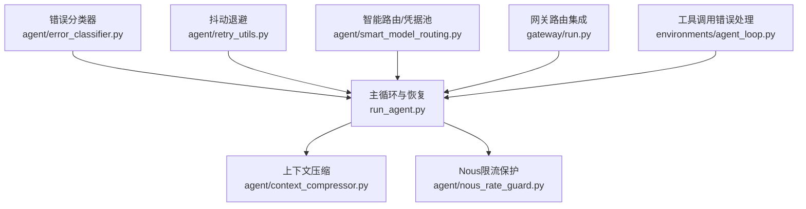
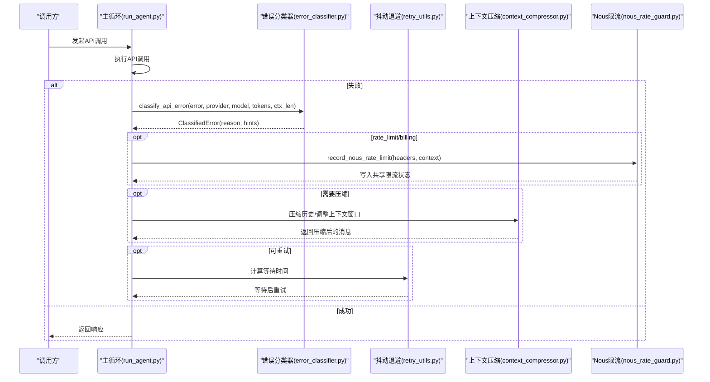
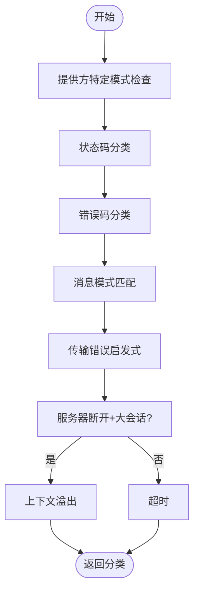
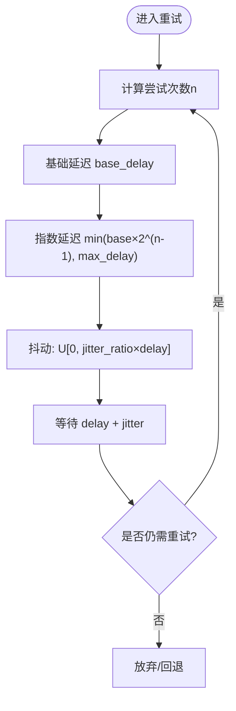
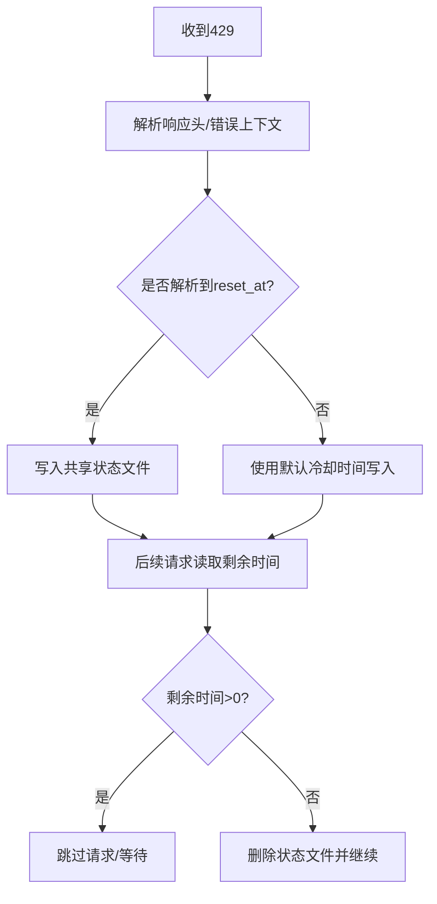
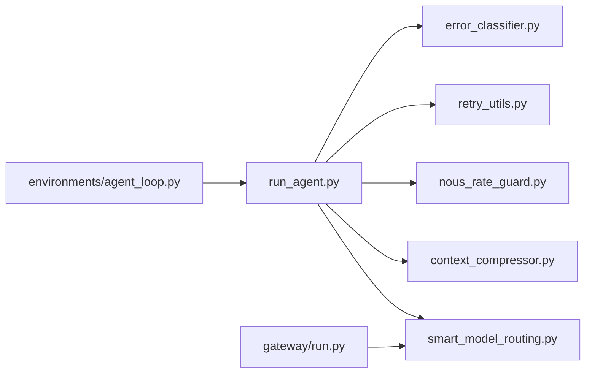

# 错误处理与恢复

<cite>
**本文引用的文件**
- [agent/error_classifier.py](file://agent/error_classifier.py)
- [agent/retry_utils.py](file://agent/retry_utils.py)
- [run_agent.py](file://run_agent.py)
- [agent/nous_rate_guard.py](file://agent/nous_rate_guard.py)
- [agent/context_compressor.py](file://agent/context_compressor.py)
- [tests/agent/test_error_classifier.py](file://tests/agent/test_error_classifier.py)
- [tests/test_retry_utils.py](file://tests/test_retry_utils.py)
- [tests/run_agent/test_long_context_tier_429.py](file://tests/run_agent/test_long_context_tier_429.py)
- [tests/run_agent/test_anthropic_error_handling.py](file://tests/run_agent/test_anthropic_error_handling.py)
- [agent/smart_model_routing.py](file://agent/smart_model_routing.py)
- [gateway/run.py](file://gateway/run.py)
- [environments/agent_loop.py](file://environments/agent_loop.py)
</cite>

## 目录
1. [简介](#简介)
2. [项目结构](#项目结构)
3. [核心组件](#核心组件)
4. [架构总览](#架构总览)
5. [详细组件分析](#详细组件分析)
6. [依赖分析](#依赖分析)
7. [性能考量](#性能考量)
8. [故障排查指南](#故障排查指南)
9. [结论](#结论)
10. [附录](#附录)

## 简介
本文件面向Hermes Agent的错误处理与恢复系统，系统化阐述以下内容：
- 错误分类器的实现原理：API错误识别、故障转移原因分析、错误类型判断
- 重试机制设计：抖动退避算法、指数退避策略、最大重试次数控制
- 不同类型错误的处理策略：网络错误、API限制、模型错误、工具执行错误
- 自动切换与降级策略、用户通知与调试信息收集
- 与模型路由、工具调用、会话管理的集成关系
- 幂等性保证、状态回滚与调试信息收集问题

## 项目结构
围绕错误处理与恢复的关键模块如下：
- 错误分类与恢复决策：agent/error_classifier.py
- 重试与退避：agent/retry_utils.py
- 主循环与恢复路径：run_agent.py
- Nous Portal跨会话限流保护：agent/nous_rate_guard.py
- 上下文压缩与降级：agent/context_compressor.py
- 模型路由与凭据池集成：agent/smart_model_routing.py、gateway/run.py
- 工具调用错误处理：environments/agent_loop.py
- 单元测试与回归验证：tests/...（含错误分类、重试工具、长上下文429等）



图示来源
- [agent/error_classifier.py](file://agent/error_classifier.py)
- [agent/retry_utils.py](file://agent/retry_utils.py)
- [run_agent.py](file://run_agent.py)
- [agent/nous_rate_guard.py](file://agent/nous_rate_guard.py)
- [agent/context_compressor.py](file://agent/context_compressor.py)
- [agent/smart_model_routing.py](file://agent/smart_model_routing.py)
- [gateway/run.py](file://gateway/run.py)
- [environments/agent_loop.py](file://environments/agent_loop.py)

章节来源
- [agent/error_classifier.py](file://agent/error_classifier.py)
- [agent/retry_utils.py](file://agent/retry_utils.py)
- [run_agent.py](file://run_agent.py)
- [agent/nous_rate_guard.py](file://agent/nous_rate_guard.py)
- [agent/context_compressor.py](file://agent/context_compressor.py)
- [agent/smart_model_routing.py](file://agent/smart_model_routing.py)
- [gateway/run.py](file://gateway/run.py)
- [environments/agent_loop.py](file://environments/agent_loop.py)

## 核心组件
- 错误分类器：基于HTTP状态码、错误体、错误码、消息模式与传输错误类型进行优先级分类，输出可执行的恢复建议（是否可重试、是否压缩、是否轮换凭据、是否回退）
- 抖动退避：在指数退避基础上加入抖动，避免多个会话同时重试导致“惊群效应”
- 主循环恢复路径：在API调用失败时，依据分类结果执行凭据轮换、模型/提供方回退、上下文压缩、等待后重试或最终放弃
- Nous限流保护：跨会话记录限流状态，避免重复放大请求
- 上下文压缩：在上下文溢出时，通过摘要与尾部保护策略降低历史消息占用
- 智能路由与凭据池：在限流等场景下优先尝试其他凭据或提供方，减少整体失败概率
- 工具调用错误处理：捕获工具执行异常，生成结构化错误消息并注入对话历史

章节来源
- [agent/error_classifier.py](file://agent/error_classifier.py)
- [agent/retry_utils.py](file://agent/retry_utils.py)
- [run_agent.py](file://run_agent.py)
- [agent/nous_rate_guard.py](file://agent/nous_rate_guard.py)
- [agent/context_compressor.py](file://agent/context_compressor.py)
- [agent/smart_model_routing.py](file://agent/smart_model_routing.py)
- [gateway/run.py](file://gateway/run.py)
- [environments/agent_loop.py](file://environments/agent_loop.py)

## 架构总览
下图展示了从API调用到错误分类、恢复决策与重试的整体流程。



图示来源
- [run_agent.py](file://run_agent.py)
- [agent/error_classifier.py](file://agent/error_classifier.py)
- [agent/retry_utils.py](file://agent/retry_utils.py)
- [agent/context_compressor.py](file://agent/context_compressor.py)
- [agent/nous_rate_guard.py](file://agent/nous_rate_guard.py)

## 详细组件分析

### 错误分类器
- 分类目标：将API错误映射到FailoverReason枚举，并给出恢复提示（可重试、是否压缩、是否轮换凭据、是否回退）
- 分类优先级：
  1) 提供方特定模式（如Anthropic思维块签名、长上下文额外用量门限）
  2) HTTP状态码分类（401/403/402/404/413/429/400/500/502/503/529等）
  3) 错误码分类（如resource_exhausted、billing_not_active等）
  4) 消息模式匹配（账单/配额/速率限制/上下文溢出/认证/模型不存在）
  5) 传输错误启发式（超时/连接错误等）
  6) 服务器断开+大会话→上下文溢出
  7) 默认未知错误（可重试）
- 关键特性：
  - 支持从错误链中提取状态码与错误体
  - 支持OpenRouter等代理的metadata.raw内嵌真实错误消息
  - 对402进行“账单耗尽”与“瞬时配额”的二义性消解
  - 对400进行“上下文溢出”与“格式错误”的区分与启发式判定



图示来源
- [agent/error_classifier.py](file://agent/error_classifier.py)

章节来源
- [agent/error_classifier.py](file://agent/error_classifier.py)
- [tests/agent/test_error_classifier.py](file://tests/agent/test_error_classifier.py)

### 重试机制与抖动退避
- 指数退避：第n次尝试延迟≈min(base×2^(n-1), max_delay)
- 抖动：在延迟上叠加均匀分布的抖动，抖动幅度为delay×jitter_ratio
- 线程安全：使用锁保护全局计数器，结合纳秒级时间戳与单调计数器生成种子，避免并发重试相关性
- 使用场景：在run_agent.py中根据分类结果计算等待时间；当遇到429/RPH受限时，优先尊重Retry-After头，否则使用抖动退避



图示来源
- [agent/retry_utils.py](file://agent/retry_utils.py)
- [run_agent.py](file://run_agent.py)
- [tests/test_retry_utils.py](file://tests/test_retry_utils.py)

章节来源
- [agent/retry_utils.py](file://agent/retry_utils.py)
- [run_agent.py](file://run_agent.py)
- [tests/test_retry_utils.py](file://tests/test_retry_utils.py)

### 主循环恢复路径与策略
- 凭据轮换与刷新：针对401，尝试Codex/Nous/OAuth等刷新；若失败则标记不可重试并触发回退
- 思维块签名恢复：Anthropic 400签名无效时一次性剥离reasoning_details并重试
- 长上下文门限：Anthropic 429“extra usage for long context”时将上下文窗口降至200k并压缩
- 负载均衡与回退：对429/billing，若凭据池尚有可用凭据则先尝试轮换，否则激活回退链
- Nous Portal限流：记录限流状态并在后续尝试前跳过，避免放大请求
- 上下文溢出：优先尝试减少max_tokens（输出上限），否则逐步降低context_length并压缩历史
- 413负载过大：按最大压缩次数尝试压缩历史，失败则终止并提示
- 非重试客户端错误：在无压缩/限流/过载/上下文溢出等场景下，尝试回退并记录调试信息
- 最大重试耗尽：尝试一次主客户端重建（传输层问题）后仍失败则激活回退链，最终汇总错误并持久化会话

```mermaid
sequenceDiagram
participant Loop as "主循环(run_agent.py)"
participant Pool as "凭据池"
participant Classifier as "分类器"
participant Guard as "Nous限流"
participant Comp as "压缩器"
participant Backoff as "抖动退避"
Loop->>Classifier : classify_api_error(...)
Classifier-->>Loop : ClassifiedError(hints)
alt rate_limit/billing
Loop->>Pool : 尝试轮换凭据
Pool-->>Loop : 成功/失败
opt 成功
Loop-->>Loop : 继续重试
else 失败
Loop->>Guard : record_nous_rate_limit(...)
Loop-->>Loop : 跳过至max_retries
end
else thinking_signature
Loop-->>Loop : 剥离reasoning_details后重试
else long_context_tier
Loop-->>Loop : context_length降至200k并压缩
else context_overflow
Loop-->>Comp : 降低max_tokens或压缩历史
Comp-->>Loop : 返回压缩结果
else payload_too_large
Loop-->>Comp : 压缩历史
Comp-->>Loop : 返回压缩结果
end
opt 可重试
Loop->>Backoff : 计算等待
Backoff-->>Loop : 等待后重试
else 不可重试
Loop-->>Loop : 回退/终止
end
```

图示来源
- [run_agent.py](file://run_agent.py)
- [agent/error_classifier.py](file://agent/error_classifier.py)
- [agent/nous_rate_guard.py](file://agent/nous_rate_guard.py)
- [agent/context_compressor.py](file://agent/context_compressor.py)
- [agent/retry_utils.py](file://agent/retry_utils.py)

章节来源
- [run_agent.py](file://run_agent.py)
- [agent/nous_rate_guard.py](file://agent/nous_rate_guard.py)
- [agent/context_compressor.py](file://agent/context_compressor.py)
- [tests/run_agent/test_long_context_tier_429.py](file://tests/run_agent/test_long_context_tier_429.py)
- [tests/run_agent/test_anthropic_error_handling.py](file://tests/run_agent/test_anthropic_error_handling.py)

### Nous Portal跨会话限流保护
- 记录：解析响应头（x-ratelimit-reset-requests-1h/x-ratelimit-reset-requests/retry-after）或错误上下文中的reset_at，写入共享JSON文件
- 查询：读取剩余冷却时间，用于短路后续尝试
- 清理：成功请求后清理状态文件



图示来源
- [agent/nous_rate_guard.py](file://agent/nous_rate_guard.py)

章节来源
- [agent/nous_rate_guard.py](file://agent/nous_rate_guard.py)

### 上下文压缩与降级
- 目标：在上下文溢出时，通过摘要与尾部保护策略降低历史消息占用
- 策略：
  - 先尝试减少max_tokens（仅输出上限），不改变上下文窗口
  - 若仍溢出，则逐步降低context_length并压缩历史
  - 压缩失败且已达最小阈值时，终止并提示用户
- 与主循环集成：在run_agent.py中根据分类结果触发压缩逻辑，并在必要时重启当前回合以应用新上下文

章节来源
- [agent/context_compressor.py](file://agent/context_compressor.py)
- [run_agent.py](file://run_agent.py)

### 智能路由与凭据池集成
- 智能路由：在简单/短文本场景选择低成本模型，失败时回退到主运行时
- 凭据池：在限流/429场景下优先轮换可用凭据，避免直接耗尽重试
- 网关集成：网关在构建路由时保留credential_pool，确保错误恢复路径一致

章节来源
- [agent/smart_model_routing.py](file://agent/smart_model_routing.py)
- [gateway/run.py](file://gateway/run.py)

### 工具调用错误处理
- 捕获工具执行异常，生成结构化错误消息并注入对话历史
- 对于未被工具处理的错误，不注入虚假消息，避免破坏角色交替与令牌消耗
- 记录慢工具与线程池队列状态，便于调试

章节来源
- [environments/agent_loop.py](file://environments/agent_loop.py)

## 依赖分析
- run_agent.py依赖：
  - 错误分类器：用于决定恢复策略
  - 抖动退避：用于计算等待时间
  - Nous限流：在429时记录限流状态
  - 上下文压缩：在上下文溢出时降级
  - 智能路由/凭据池：在限流时优先轮换凭据或回退
- 测试覆盖：
  - 错误分类器：覆盖HTTP状态码、错误码、消息模式、提供方特定场景
  - 重试工具：覆盖指数退避、抖动、并发安全性
  - 长上下文429：覆盖Anthropic长上下文门限与降级逻辑



图示来源
- [run_agent.py](file://run_agent.py)
- [agent/error_classifier.py](file://agent/error_classifier.py)
- [agent/retry_utils.py](file://agent/retry_utils.py)
- [agent/nous_rate_guard.py](file://agent/nous_rate_guard.py)
- [agent/context_compressor.py](file://agent/context_compressor.py)
- [agent/smart_model_routing.py](file://agent/smart_model_routing.py)
- [gateway/run.py](file://gateway/run.py)
- [environments/agent_loop.py](file://environments/agent_loop.py)

章节来源
- [run_agent.py](file://run_agent.py)
- [agent/error_classifier.py](file://agent/error_classifier.py)
- [agent/retry_utils.py](file://agent/retry_utils.py)
- [agent/nous_rate_guard.py](file://agent/nous_rate_guard.py)
- [agent/context_compressor.py](file://agent/context_compressor.py)
- [agent/smart_model_routing.py](file://agent/smart_model_routing.py)
- [gateway/run.py](file://gateway/run.py)
- [environments/agent_loop.py](file://environments/agent_loop.py)

## 性能考量
- 抖动退避防止“惊群效应”，在高并发限流场景下显著降低重试尖峰
- 上下文压缩在不丢失关键信息的前提下减少历史消息，降低后续请求成本
- Nous限流保护避免重复放大请求，减少RPH浪费
- 在run_agent中采用分段sleep与中断检测，提升交互响应性

## 故障排查指南
- 认证失败（401/403）：检查凭据有效性与刷新流程；查看分类器对auth/auth_permanent的区分
- 速率限制（429/400带速率限制文本/402带瞬时信号）：优先轮换凭据；尊重Retry-After；必要时回退提供方
- 账单耗尽（402无瞬时信号）：不可重试，需更换/充值凭据
- 上下文溢出（400/413/服务器断开+大会话）：先尝试减少max_tokens，再逐步降低context_length并压缩历史
- 负载过载（503/529）：等待后重试或回退
- 工具执行错误：查看environments/agent_loop.py中的错误注入与日志记录
- 调试信息：run_agent.py中包含详细的错误摘要、上下文统计与调试输出

章节来源
- [run_agent.py](file://run_agent.py)
- [tests/agent/test_error_classifier.py](file://tests/agent/test_error_classifier.py)
- [tests/run_agent/test_anthropic_error_handling.py](file://tests/run_agent/test_anthropic_error_handling.py)

## 结论
Hermes Agent的错误处理与恢复体系通过“结构化分类+抖动退避+多策略降级”的组合，实现了对网络错误、API限制、模型错误与工具执行错误的稳健应对。其关键优势在于：
- 明确的错误分类与恢复提示，使主循环能够快速做出正确决策
- 抖动退避与跨会话限流保护，有效缓解并发重试压力
- 上下文压缩与长上下文门限降级，保障长时间会话的稳定性
- 与智能路由、凭据池的深度集成，提升整体可用性与弹性

## 附录
- 自定义错误处理器实现要点
  - 基于错误分类器的结构化输出，扩展恢复动作（如切换模型、调整参数、注入提示）
  - 在run_agent.py中插入自定义分支，遵循现有“可重试/压缩/轮换/回退”的决策流
  - 保持幂等性：对可能产生副作用的操作（如写文件）进行去重与回滚
  - 收集调试信息：在分类器与主循环中保留错误摘要、上下文统计与响应头信息

章节来源
- [agent/error_classifier.py](file://agent/error_classifier.py)
- [run_agent.py](file://run_agent.py)