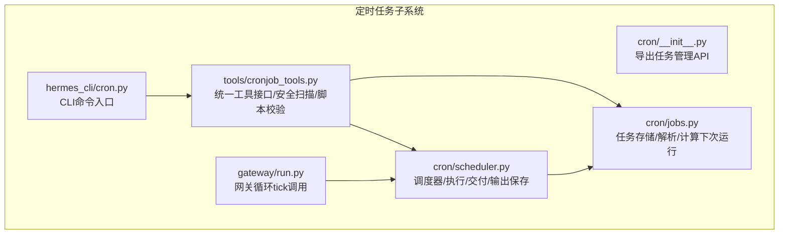
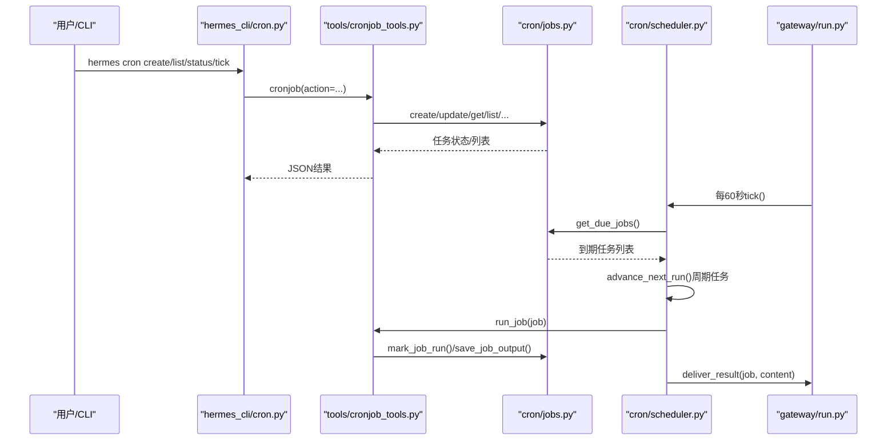
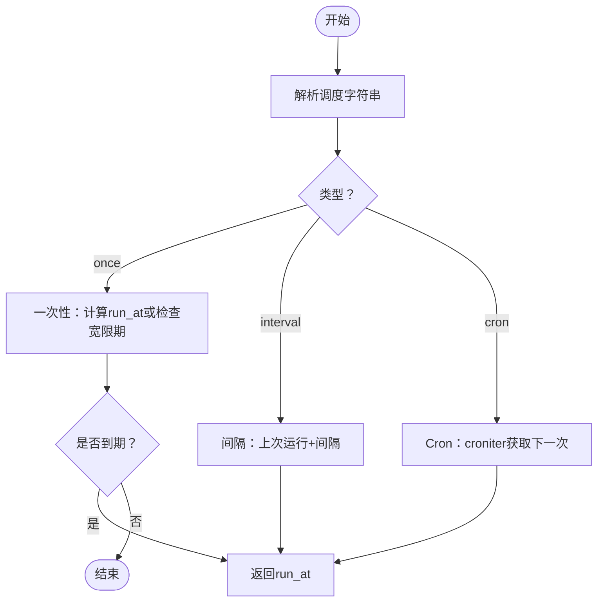
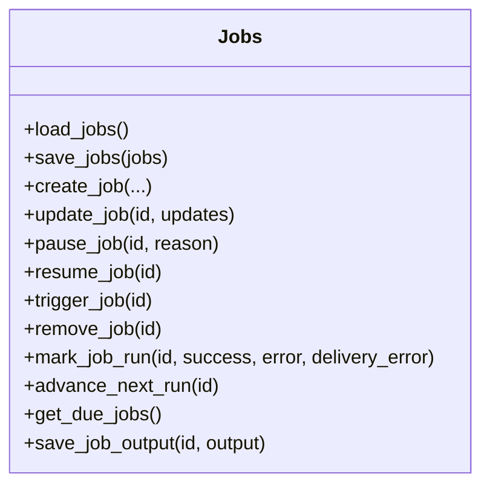
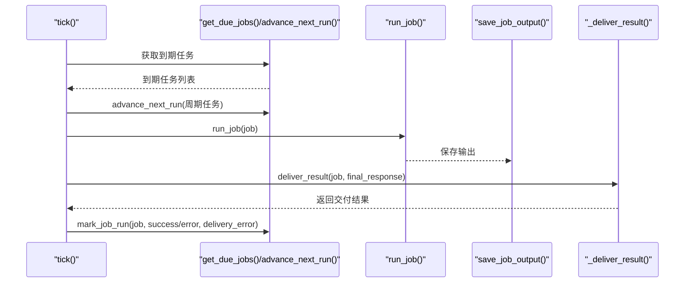
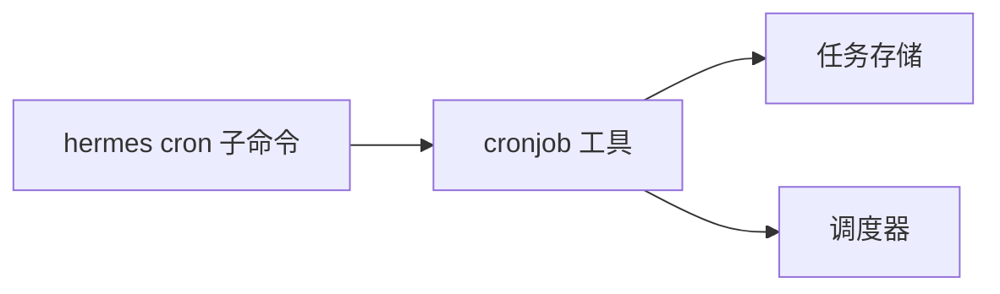
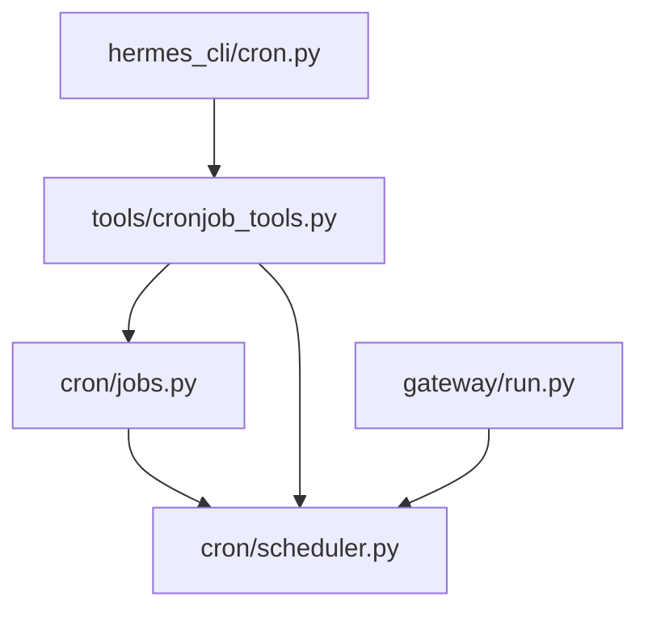

# 定时任务系统

<cite>
**本文档引用的文件**
- [cron/__init__.py](file://cron/__init__.py)
- [cron/jobs.py](file://cron/jobs.py)
- [cron/scheduler.py](file://cron/scheduler.py)
- [hermes_cli/cron.py](file://hermes_cli/cron.py)
- [tools/cronjob_tools.py](file://tools/cronjob_tools.py)
- [tests/cron/test_jobs.py](file://tests/cron/test_jobs.py)
- [tests/cron/test_scheduler.py](file://tests/cron/test_scheduler.py)
- [gateway/run.py](file://gateway/run.py)
- [cli-config.yaml.example](file://cli-config.yaml.example)
- [website/docs/developer-guide/cron-internals.md](file://website/docs/developer-guide/cron-internals.md)
</cite>

## 目录
1. [简介](#简介)
2. [项目结构](#项目结构)
3. [核心组件](#核心组件)
4. [架构总览](#架构总览)
5. [详细组件分析](#详细组件分析)
6. [依赖关系分析](#依赖关系分析)
7. [性能考量](#性能考量)
8. [故障排查指南](#故障排查指南)
9. [结论](#结论)
10. [附录](#附录)

## 简介
本文件为 Hermes Agent 定时任务系统的权威技术文档，面向开发者与运维人员，系统阐述 Cron 子系统的架构设计、任务调度机制、任务定义与执行计划、优先级与并发控制、平台通知集成与交付、监控日志、任务开发指南（编写、参数传递、错误处理）、任务隔离与资源管理、性能优化策略、具体任务示例与使用场景、持久化与恢复、故障处理机制，以及调试与监控最佳实践。

## 项目结构
定时任务系统由以下模块协同工作：
- cron 模块：任务存储、解析与调度核心逻辑
- tools/cronjob_tools：统一的任务管理工具接口，提供安全扫描与路径校验
- hermes_cli/cron：命令行子命令入口，支持 list、create、edit、pause、resume、run、remove、status、tick
- gateway/run：网关长期运行循环中每分钟触发 tick，实现自动调度
- 测试用例：覆盖任务 CRUD、到期检测、交付路由、会话持久化等关键行为

**图表来源**
- [cron/__init__.py:18-42](file://cron/__init__.py#L18-L42)
- [cron/jobs.py:320-366](file://cron/jobs.py#L320-L366)
- [cron/scheduler.py:909-1010](file://cron/scheduler.py#L909-L1010)
- [tools/cronjob_tools.py:23-33](file://tools/cronjob_tools.py#L23-L33)
- [hermes_cli/cron.py:160-184](file://hermes_cli/cron.py#L160-L184)
- [gateway/run.py:554-680](file://gateway/run.py#L554-L680)

**章节来源**
- [cron/__init__.py:1-43](file://cron/__init__.py#L1-L43)
- [website/docs/developer-guide/cron-internals.md:11-32](file://website/docs/developer-guide/cron-internals.md#L11-L32)

## 核心组件
- 任务模型与存储
  - 任务字段：id、name、prompt、skills、schedule、repeat、deliver、next_run_at、last_run_at、state、enabled、origin 等
  - 存储位置：~/.hermes/cron/jobs.json；输出保存在 ~/.hermes/cron/output/{job_id}/YYYY-MM-DD_HH-MM-SS.md
  - 原子写入：使用临时文件 + 原子替换，确保数据一致性
- 调度与执行
  - 解析 schedule 字符串为内部结构（once/interval/cron）
  - 计算下次运行时间，支持动态宽限期与过期回退
  - 执行前推进 next_run_at，避免重复触发（尤其针对周期性任务）
  - 通过 AIAgent 运行，注入环境变量与会话数据库，支持静默标记抑制交付
- 平台交付
  - 支持本地交付与多平台自动投递（Telegram、Discord、Slack、WhatsApp、Signal、Matrix、Mattermost、HomeAssistant、DingTalk、Feishu、WeCom、WeChat、SMS、Email、Webhook、BlueBubbles、QQBot 等）
  - 自动提取 MEDIA: 标签并以原生附件发送（音频/视频/图片/文档）
  - 包装响应头尾，便于用户识别与停止指令
- CLI 与工具
  - hermes cron 子命令：list/status/tick/create/edit/pause/resume/run/remove
  - 统一 cronjob 工具：action-oriented 接口，内置威胁扫描与脚本路径校验

**章节来源**
- [cron/jobs.py:320-366](file://cron/jobs.py#L320-L366)
- [cron/jobs.py:468-523](file://cron/jobs.py#L468-L523)
- [cron/jobs.py:664-741](file://cron/jobs.py#L664-L741)
- [cron/scheduler.py:909-1010](file://cron/scheduler.py#L909-L1010)
- [cron/scheduler.py:201-368](file://cron/scheduler.py#L201-L368)
- [hermes_cli/cron.py:160-291](file://hermes_cli/cron.py#L160-L291)
- [tools/cronjob_tools.py:221-384](file://tools/cronjob_tools.py#L221-L384)

## 架构总览
定时任务系统采用“文件锁 + 网关循环 tick”的轻量调度模型，避免对系统 crontab 的依赖，同时保证跨进程互斥与幂等。

**图表来源**
- [hermes_cli/cron.py:160-291](file://hermes_cli/cron.py#L160-L291)
- [tools/cronjob_tools.py:221-384](file://tools/cronjob_tools.py#L221-L384)
- [cron/jobs.py:664-741](file://cron/jobs.py#L664-L741)
- [cron/scheduler.py:909-1010](file://cron/scheduler.py#L909-L1010)
- [gateway/run.py:554-680](file://gateway/run.py#L554-L680)

## 详细组件分析

### 任务定义与调度模型
- 支持四种调度格式
  - 相对延迟：如 "30m"、"2h"、"1d"（一次性）
  - 间隔：如 "every 2h"、"every 30m"（周期性）
  - Cron 表达式：标准 5/6 场景（分钟、小时、日、月、周、年）
  - ISO 时间戳："2025-01-15T09:00:00"（一次性）
- 解析与校验
  - parse_schedule 将字符串标准化为内部结构，含 display 字段便于展示
  - cron 表达式需 croniter 依赖，否则抛错提示安装
- 下次运行时间计算
  - compute_next_run 支持一次性、间隔与 cron 三种类型
  - 对一次性任务提供短暂宽限期（ONESHOT_GRACE_SECONDS），允许在下一 tick 内仍可触发
  - 对周期性任务根据周期动态计算宽限期（半周期，120s 至 2h 之间），超过宽限期则快进到未来最近一次

**图表来源**
- [cron/jobs.py:117-204](file://cron/jobs.py#L117-L204)
- [cron/jobs.py:284-314](file://cron/jobs.py#L284-L314)
- [cron/jobs.py:225-250](file://cron/jobs.py#L225-L250)

**章节来源**
- [cron/jobs.py:96-204](file://cron/jobs.py#L96-L204)
- [cron/jobs.py:284-314](file://cron/jobs.py#L284-L314)
- [tests/cron/test_jobs.py:164-176](file://tests/cron/test_jobs.py#L164-L176)

### 任务生命周期与持久化
- 任务 CRUD
  - create_job：解析调度、归一化技能/模型/脚本、设置默认 deliver/origin、生成 next_run_at
  - update_job：支持更新调度、提示词、技能、模型、脚本、重复次数等；变更调度时刷新显示与下次运行时间
  - pause/resume：暂停/恢复，记录 paused_at/paused_reason/state
  - trigger_job：立即调度到当前 tick
  - remove_job：删除任务
- 状态与历史
  - mark_job_run：更新 last_run_at、last_status、累计完成次数、计算 next_run_at；达到 repeat 限制自动删除
  - advance_next_run：在执行前推进周期任务的 next_run_at，避免崩溃重试导致重复执行
  - 输出持久化：save_job_output 将每次运行结果保存为 Markdown 文件，带原子写入与权限加固
- 数据库修复
  - load_jobs 支持自动修复 jobs.json 中的非法控制字符，必要时重写修复

**图表来源**
- [cron/jobs.py:320-366](file://cron/jobs.py#L320-L366)
- [cron/jobs.py:368-523](file://cron/jobs.py#L368-L523)
- [cron/jobs.py:586-662](file://cron/jobs.py#L586-L662)
- [cron/jobs.py:664-741](file://cron/jobs.py#L664-L741)
- [cron/jobs.py:743-769](file://cron/jobs.py#L743-L769)

**章节来源**
- [cron/jobs.py:320-366](file://cron/jobs.py#L320-L366)
- [cron/jobs.py:368-523](file://cron/jobs.py#L368-L523)
- [cron/jobs.py:586-662](file://cron/jobs.py#L586-L662)
- [cron/jobs.py:664-741](file://cron/jobs.py#L664-L741)
- [cron/jobs.py:743-769](file://cron/jobs.py#L743-L769)

### 执行与交付流程
- 提示词构建
  - _build_job_prompt：注入系统提示（自动交付说明与静默标记规则）、可选技能内容、可选预执行脚本输出
  - _run_job_script：限制在 ~/.hermes/scripts/ 目录内执行，支持超时、输出脱敏
- 执行与超时
  - run_job：初始化会话数据库、注入 origin 与自动交付环境变量、加载配置与凭据池、创建 AIAgent、运行对话、处理空响应（视为软失败）
  - 超时策略：基于活动度检测（HERMES_CRON_TIMEOUT，默认 600s），无活动则中断并报错
- 交付与媒体转发
  - _deliver_result：解析目标平台与聊天 ID，优先使用运行中的适配器直发（支持端到端加密），否则走独立发送路径
  - 提取 MEDIA: 标签并按扩展名路由到 send_voice/send_image_file/send_video/send_document
  - 包装响应头尾，便于用户识别与停止指令
- 输出与日志
  - save_job_output：原子写入 Markdown 输出文件
  - 日志记录：成功/失败/空响应/交付错误等关键事件

**图表来源**
- [cron/scheduler.py:909-1010](file://cron/scheduler.py#L909-L1010)
- [cron/scheduler.py:580-886](file://cron/scheduler.py#L580-L886)
- [cron/scheduler.py:201-368](file://cron/scheduler.py#L201-L368)
- [cron/scheduler.py:909-996](file://cron/scheduler.py#L909-L996)

**章节来源**
- [cron/scheduler.py:580-886](file://cron/scheduler.py#L580-L886)
- [cron/scheduler.py:909-1010](file://cron/scheduler.py#L909-L1010)
- [tests/cron/test_scheduler.py:548-630](file://tests/cron/test_scheduler.py#L548-L630)

### CLI 与工具接口
- hermes cron 子命令
  - list：列出所有任务，支持显示禁用项
  - status：显示网关运行状态与下一个运行时间
  - tick：手动触发一次调度
  - create/edit/pause/resume/run/remove：对应任务管理动作
- 统一 cronjob 工具
  - 单一 action-oriented 接口，支持 create/list/update/pause/resume/remove/run
  - 内置威胁扫描（阻止提示词注入与敏感信息泄露模式）
  - 脚本路径校验：仅允许相对路径位于 ~/.hermes/scripts/ 下，防止路径穿越

**图表来源**
- [hermes_cli/cron.py:160-291](file://hermes_cli/cron.py#L160-L291)
- [tools/cronjob_tools.py:221-384](file://tools/cronjob_tools.py#L221-L384)

**章节来源**
- [hermes_cli/cron.py:160-291](file://hermes_cli/cron.py#L160-L291)
- [tools/cronjob_tools.py:221-384](file://tools/cronjob_tools.py#L221-L384)

## 依赖关系分析
- 外部依赖
  - croniter：解析与验证 cron 表达式
  - dotenv：加载 ~/.hermes/.env 与配置桥接
  - hermes_cli.runtime_provider：运行时推理提供者解析
  - agent.credential_pool：凭据池加载
  - gateway.platforms.*：平台适配器与发送工具
- 内部耦合
  - cron/scheduler.py 依赖 cron/jobs.py 的任务状态与输出保存
  - tools/cronjob_tools.py 作为统一入口，协调 jobs 与 scheduler
  - gateway/run.py 在主循环中定时调用 tick，形成自动调度闭环

**图表来源**
- [cron/scheduler.py:52-53](file://cron/scheduler.py#L52-L53)
- [tools/cronjob_tools.py:23-33](file://tools/cronjob_tools.py#L23-L33)
- [hermes_cli/cron.py:35-38](file://hermes_cli/cron.py#L35-L38)
- [gateway/run.py:554-680](file://gateway/run.py#L554-L680)

**章节来源**
- [cron/scheduler.py:37-41](file://cron/scheduler.py#L37-L41)
- [cron/scheduler.py:52-53](file://cron/scheduler.py#L52-L53)
- [tools/cronjob_tools.py:23-33](file://tools/cronjob_tools.py#L23-L33)

## 性能考量
- 调度频率与锁
  - tick 每 60 秒执行一次，使用文件锁避免并发重入
  - 周期性任务在执行前推进 next_run_at，降低崩溃重试风险
- 超时与资源
  - HERMES_CRON_TIMEOUT 控制空闲超时（默认 600s），避免长时间卡死占用资源
  - 脚本执行超时可从环境变量/配置/模块变量三处解析，确保可控
- I/O 与持久化
  - 任务数据库与输出文件均采用原子写入与权限加固（0700/0600），减少碎片与安全风险
- 交付优化
  - 优先使用运行中适配器直发，支持端到端加密；媒体文件分离发送，避免文本过大

[本节为通用指导，无需特定文件引用]

## 故障排查指南
- 常见问题定位
  - 任务未触发：检查网关是否运行、tick 是否被锁阻塞、任务是否处于 paused/completed 状态、next_run_at 是否正确
  - 交付失败：确认平台配置已启用、HOME_CHANNEL 环境变量是否存在、网络连通性、速率限制
  - 空响应：若 final_response 为空，系统视为软失败（last_status 不为 ok），检查模型输出或工具调用
  - 脚本执行失败：检查脚本路径是否在 ~/.hermes/scripts/ 下、权限、超时、输出脱敏
- 日志与审计
  - 输出文件保存在 ~/.hermes/cron/output/{job_id}/YYYY-MM-DD_HH-MM-SS.md
  - 关键事件（成功/失败/交付错误/宽限期快进）均有日志记录
- 配置建议
  - cron.wrap_response：控制是否包装交付头尾
  - HERMES_CRON_TIMEOUT：调整空闲超时
  - HERMES_CRON_SCRIPT_TIMEOUT：调整脚本执行超时

**章节来源**
- [cron/scheduler.py:909-1010](file://cron/scheduler.py#L909-L1010)
- [cron/scheduler.py:280-305](file://cron/scheduler.py#L280-L305)
- [tests/cron/test_scheduler.py:717-753](file://tests/cron/test_scheduler.py#L717-L753)

## 结论
Hermes Agent 定时任务系统以简洁可靠的文件锁 + 网关 tick 模型实现自动化调度，结合严格的提示词安全扫描、脚本路径校验、原子持久化与多平台交付能力，既满足日常自动化需求，又兼顾安全性与可观测性。通过统一工具接口与 CLI 子命令，用户可以高效地创建、管理与监控定时任务。

[本节为总结，无需特定文件引用]

## 附录

### 任务开发指南
- 任务编写
  - 提示词必须自包含，系统会在运行时注入交付说明与静默标记规则
  - 可选加载一个或多个技能，技能内容将前置到提示词
  - 使用预执行脚本收集上下文（脚本路径必须位于 ~/.hermes/scripts/ 下）
- 参数传递
  - 通过 cronjob 工具的 prompt/schedule/name/deliver/skills/model/provider/base_url/script 等参数传入
  - deliver 支持 "origin"/"local"/"平台:聊天ID:主题ID" 等形式
- 错误处理
  - 任务失败会记录 error 与 last_error；交付失败记录 last_delivery_error
  - 空 final_response 视为软失败，不会标记为 ok
  - 超时与空闲超时会中断并记录诊断摘要

**章节来源**
- [tools/cronjob_tools.py:221-384](file://tools/cronjob_tools.py#L221-L384)
- [cron/scheduler.py:580-886](file://cron/scheduler.py#L580-L886)

### 任务示例与使用场景
- 示例
  - 每日健康报告：schedule="every 1d"，prompt="汇总今日步数、饮水、睡眠质量，给出改进建议"
  - 每两小时服务器巡检：schedule="every 2h"，prompt="检查CPU、内存、磁盘、网络连接状态"
  - 一次性提醒：schedule="30m"，prompt="会议还有半小时开始，请准备材料"
  - 周期性数据采集：schedule="0 9 * * *"，配合 script 收集指标后分析
- 场景
  - 自动化监控与告警
  - 周期性报告与知识沉淀
  - 数据采集与变更检测
  - 跨平台通知与汇报

**章节来源**
- [website/docs/developer-guide/cron-internals.md:21-32](file://website/docs/developer-guide/cron-internals.md#L21-L32)

### 任务隔离、资源管理与性能优化
- 隔离
  - 任务在独立会话中运行，不携带先前上下文
  - 注入 origin 与自动交付环境变量，避免泄漏到其他任务
- 资源
  - 超时控制（HERMES_CRON_TIMEOUT）、脚本超时（HERMES_CRON_SCRIPT_TIMEOUT）
  - 凭据池按提供者加载，避免硬编码密钥
- 优化
  - 原子写入与权限加固，减少 I/O 抖动
  - 周期任务执行前推进 next_run_at，避免重复触发
  - 交付前提取媒体文件，减少文本传输体积

**章节来源**
- [cron/scheduler.py:580-886](file://cron/scheduler.py#L580-L886)
- [cron/scheduler.py:909-1010](file://cron/scheduler.py#L909-L1010)

### 任务持久化、恢复与故障处理
- 持久化
  - 任务列表与状态保存在 jobs.json，输出保存在 output 目录
  - 原子写入与权限加固，支持自动修复非法控制字符
- 恢复
  - 网关重启后，周期性任务通过动态宽限期判断是否快进到未来最近一次
  - 一次性任务在宽限期内仍可触发
- 故障处理
  - 任务失败与交付失败分别记录，便于追踪
  - 超时中断并保留诊断摘要，便于定位卡点

**章节来源**
- [cron/jobs.py:320-366](file://cron/jobs.py#L320-L366)
- [cron/jobs.py:664-741](file://cron/jobs.py#L664-L741)
- [cron/scheduler.py:909-1010](file://cron/scheduler.py#L909-L1010)

### 调试与监控最佳实践
- 调试
  - 使用 hermes cron tick 手动触发一次调度
  - 查看输出目录中的 Markdown 文件，核对最终响应与错误
  - 检查网关日志与任务日志，关注宽限期快进与交付错误
- 监控
  - 定期检查 hermes cron status，确认网关运行与下一个运行时间
  - 通过 hermes cron list 观察任务状态与最近运行结果
  - 配置 cron.wrap_response 与 HOME_CHANNEL 环境变量，确保交付可见性与准确性

**章节来源**
- [hermes_cli/cron.py:121-158](file://hermes_cli/cron.py#L121-L158)
- [cli-config.yaml.example:597-627](file://cli-config.yaml.example#L597-L627)