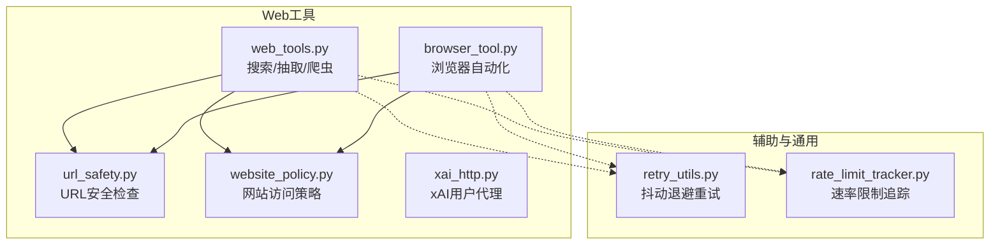
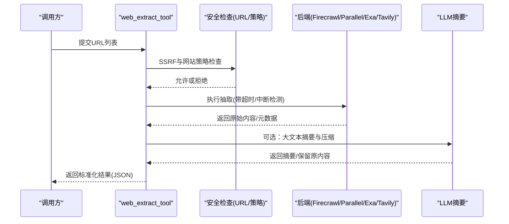
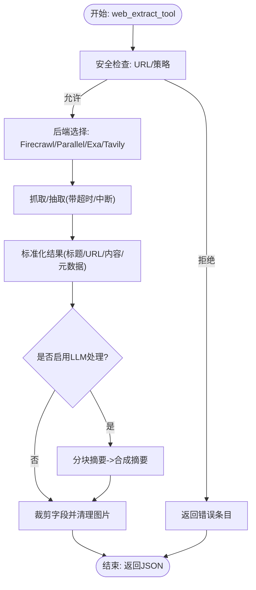
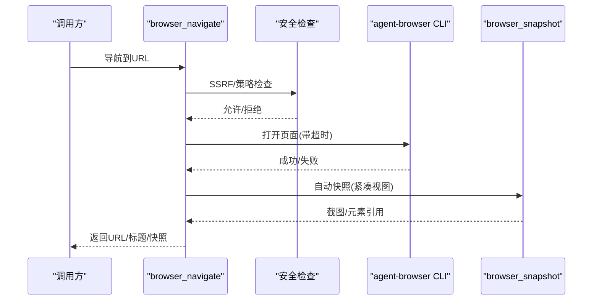
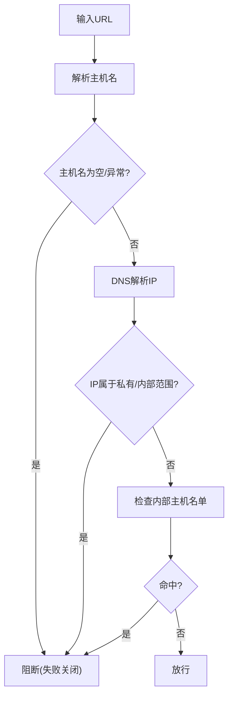
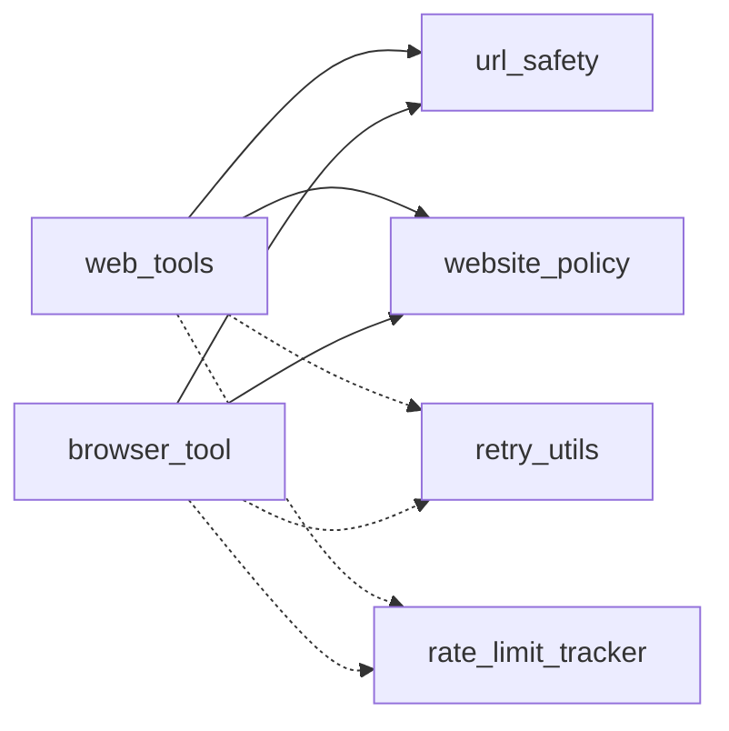

# Web工具

<cite>
**本文引用的文件**
- [web_tools.py](file://tools/web_tools.py)
- [browser_tool.py](file://tools/browser_tool.py)
- [url_safety.py](file://tools/url_safety.py)
- [website_policy.py](file://tools/website_policy.py)
- [xai_http.py](file://tools/xai_http.py)
- [retry_utils.py](file://agent/retry_utils.py)
- [rate_limit_tracker.py](file://agent/rate_limit_tracker.py)
</cite>

## 目录
1. [简介](#简介)
2. [项目结构](#项目结构)
3. [核心组件](#核心组件)
4. [架构总览](#架构总览)
5. [详细组件分析](#详细组件分析)
6. [依赖分析](#依赖分析)
7. [性能考虑](#性能考虑)
8. [故障排查指南](#故障排查指南)
9. [结论](#结论)
10. [附录：使用示例与最佳实践](#附录使用示例与最佳实践)

## 简介
本文件系统性阐述 Hermes Agent 的 Web 工具体系，覆盖以下方面：
- 架构设计：HTTP 客户端实现、请求管理与响应处理
- 网页抓取：页面解析、内容提取与数据格式化
- API 集成：RESTful 调用、认证与错误重试
- 安全机制：URL 验证、内容过滤与速率限制
- 性能优化：连接池管理、缓存策略与并发控制
- 使用示例与最佳实践

## 项目结构
Web 工具相关代码主要位于 tools 目录下，围绕“搜索引擎/抽取器”（web_tools）与“浏览器自动化”（browser_tool）两大能力展开，并辅以安全与通用网络工具模块。

图示来源
- [web_tools.py](file://tools/web_tools.py)
- [browser_tool.py](file://tools/browser_tool.py)
- [url_safety.py](file://tools/url_safety.py)
- [website_policy.py](file://tools/website_policy.py)
- [xai_http.py](file://tools/xai_http.py)
- [retry_utils.py](file://agent/retry_utils.py)
- [rate_limit_tracker.py](file://agent/rate_limit_tracker.py)

章节来源
- [web_tools.py](file://tools/web_tools.py)
- [browser_tool.py](file://tools/browser_tool.py)
- [url_safety.py](file://tools/url_safety.py)
- [website_policy.py](file://tools/website_policy.py)
- [xai_http.py](file://tools/xai_http.py)
- [retry_utils.py](file://agent/retry_utils.py)
- [rate_limit_tracker.py](file://agent/rate_limit_tracker.py)

## 核心组件
- web_search_tool：统一入口的网页搜索，支持后端自动选择（Parallel/Exa/Tavily/Firecrawl），返回标准结果格式
- web_extract_tool：从指定 URL 抽取内容，支持 LLM 智能摘要与压缩
- web_crawl_tool：对站点进行定向爬取，支持指令驱动与 LLM 后处理
- browser_navigate/snapshot/click/type/scroll/back/press/console/vision 等：基于 agent-browser 的浏览器自动化工具集
- URL 安全与网站策略：防止 SSRF、阻止内部地址与黑名单域名
- 速率限制与重试：统一的抖动退避重试策略与速率限制状态展示

章节来源
- [web_tools.py](file://tools/web_tools.py)
- [browser_tool.py](file://tools/browser_tool.py)
- [url_safety.py](file://tools/url_safety.py)
- [website_policy.py](file://tools/website_policy.py)
- [retry_utils.py](file://agent/retry_utils.py)
- [rate_limit_tracker.py](file://agent/rate_limit_tracker.py)

## 架构总览
Web 工具采用“多后端适配 + 统一接口 + 安全前置 + LLM 后处理”的分层设计：
- 前置安全：URL 安全检查与网站策略拦截
- 后端选择：按配置与可用性动态选择 Firecrawl/Parallel/Exa/Tavily
- 请求执行：SDK/HTTP 客户端调用第三方服务；浏览器工具通过 agent-browser CLI 或云提供商
- 数据处理：标准化响应、内容清洗、LLM 摘要与压缩
- 可观测性：调试会话记录、压缩率统计、错误日志

图示来源
- [web_tools.py](file://tools/web_tools.py)
- [url_safety.py](file://tools/url_safety.py)
- [website_policy.py](file://tools/website_policy.py)

## 详细组件分析

### 组件A：Web搜索与抽取（web_tools）
- 后端选择逻辑：优先读取配置 web.backend，其次根据环境变量回退到可用后端；支持工具网关（Nous订阅）与直连模式
- Firecrawl 客户端：支持直连与工具网关两种方式，自动复用已创建实例
- Parallel/Exa/Tavily：分别封装 SDK/HTTP 调用，统一输出格式
- 内容处理：对大文本进行分块并行摘要，再合成最终摘要；设置最大输出长度与压缩比统计
- 输出清洗：移除 base64 图片占位，减少 token 与噪音

图示来源
- [web_tools.py](file://tools/web_tools.py)
- [url_safety.py](file://tools/url_safety.py)
- [website_policy.py](file://tools/website_policy.py)

章节来源
- [web_tools.py](file://tools/web_tools.py)

### 组件B：浏览器自动化（browser_tool）
- 会话管理：按任务隔离，本地模式使用 agent-browser CLI，云模式（Browserbase/Browser Use）通过 CDP 连接
- 命令执行：通过子进程调用 agent-browser，使用临时 socket 目录避免并发冲突；超时与非 JSON 输出处理
- 安全增强：导航前/后 URL 安全检查、网站策略拦截、首次导航记录隐身特性
- 视觉分析：截图转 base64 并调用视觉模型分析，支持标注交互元素
- 自动录制：可按配置自动录制会话视频，定期清理旧文件

图示来源
- [browser_tool.py](file://tools/browser_tool.py)
- [url_safety.py](file://tools/url_safety.py)
- [website_policy.py](file://tools/website_policy.py)

章节来源
- [browser_tool.py](file://tools/browser_tool.py)

### 组件C：安全与策略（url_safety 与 website_policy）
- URL 安全：解析主机名并解析 IP，阻断私有/环回/链路本地/多播/未指定/保留地址及特定内部主机名
- 网站策略：从配置加载域名黑名单与共享文件，支持通配匹配，带短 TTL 缓存，失败开放策略

图示来源
- [url_safety.py](file://tools/url_safety.py)
- [website_policy.py](file://tools/website_policy.py)

章节来源
- [url_safety.py](file://tools/url_safety.py)
- [website_policy.py](file://tools/website_policy.py)

### 组件D：API集成与HTTP客户端
- Firecrawl：支持直连与工具网关，自动复用客户端实例
- Parallel：同步/异步 SDK 客户端封装
- Tavily：HTTP 客户端，统一返回结构
- xAI 用户代理：统一 User-Agent 标识

章节来源
- [web_tools.py](file://tools/web_tools.py)
- [xai_http.py](file://tools/xai_http.py)

### 组件E：重试与速率限制
- 抖动退避重试：decorrelated jittered backoff，避免并发风暴
- 速率限制追踪：解析 x-ratelimit-* 头部，格式化显示与紧凑摘要

章节来源
- [retry_utils.py](file://agent/retry_utils.py)
- [rate_limit_tracker.py](file://agent/rate_limit_tracker.py)

## 依赖分析
- 组件耦合
  - web_tools 依赖 url_safety 与 website_policy 进行前置安全
  - browser_tool 依赖 url_safety 与 website_policy，同时依赖 agent-browser CLI 与云提供商 SDK
  - 两者均通过统一的工具注册表对外暴露
- 外部依赖
  - Firecrawl/Parallel/Exa/Tavily SDK 与 HTTP 客户端
  - httpx、subprocess、requests 等标准库
- 循环依赖
  - 未发现循环导入；各模块职责清晰，通过函数/方法调用解耦

图示来源
- [web_tools.py](file://tools/web_tools.py)
- [browser_tool.py](file://tools/browser_tool.py)
- [url_safety.py](file://tools/url_safety.py)
- [website_policy.py](file://tools/website_policy.py)
- [retry_utils.py](file://agent/retry_utils.py)
- [rate_limit_tracker.py](file://agent/rate_limit_tracker.py)

章节来源
- [web_tools.py](file://tools/web_tools.py)
- [browser_tool.py](file://tools/browser_tool.py)
- [retry_utils.py](file://agent/retry_utils.py)
- [rate_limit_tracker.py](file://agent/rate_limit_tracker.py)

## 性能考虑
- 连接与并发
  - Firecrawl 客户端单实例复用，避免重复初始化
  - 浏览器命令通过子进程执行，使用独立 socket 目录避免竞争
- 缓存策略
  - 网站策略规则短 TTL 缓存，平衡实时性与性能
  - 浏览器截图与录制文件定期清理，防止磁盘膨胀
- 处理优化
  - 大文本分块并行摘要，降低单次 LLM 负担
  - 压缩上限与截断策略，控制最终输出大小
- 重试与退避
  - 抖动退避降低并发重试峰值，提升整体稳定性

章节来源
- [web_tools.py](file://tools/web_tools.py)
- [browser_tool.py](file://tools/browser_tool.py)
- [retry_utils.py](file://agent/retry_utils.py)

## 故障排查指南
- 常见问题
  - API 密钥缺失：检查对应后端环境变量是否设置
  - URL 被阻断：检查 SSRF 与网站策略配置
  - 超时/非 JSON 输出：浏览器命令超时或 agent-browser 异常，查看 stderr 与临时文件
  - LLM 处理失败：调整超时或切换模型，或禁用 LLM 处理
- 排查步骤
  - 开启调试会话（WEB_TOOLS_DEBUG），查看日志与压缩指标
  - 检查速率限制状态，必要时降低并发或等待窗口重置
  - 对浏览器工具，确认 agent-browser 安装与权限，socket 目录路径在 macOS 上需注意长度限制

章节来源
- [web_tools.py](file://tools/web_tools.py)
- [browser_tool.py](file://tools/browser_tool.py)
- [rate_limit_tracker.py](file://agent/rate_limit_tracker.py)

## 结论
Hermes Agent 的 Web 工具通过“多后端适配 + 安全前置 + LLM 后处理”的架构，在保证安全性的同时提供了强大的信息检索与内容理解能力。浏览器自动化进一步扩展了对动态页面与视觉内容的处理能力。配合抖动退避重试与速率限制追踪，系统在高并发场景下具备良好的稳定性与可观测性。

## 附录：使用示例与最佳实践
- 使用示例
  - 搜索：调用 web_search_tool 获取结果元数据
  - 抽取：调用 web_extract_tool 获取内容，必要时开启 LLM 摘要
  - 爬取：调用 web_crawl_tool 指定深度与指令
  - 浏览器：先 browser_navigate，再 browser_snapshot 获取交互元素，必要时 browser_vision 分析视觉内容
- 最佳实践
  - 优先使用搜索获取 URL 列表，再对目标页面进行抽取
  - 对大文本启用 LLM 处理，但设置合理最小长度阈值与输出上限
  - 在云模式下启用代理与隐身特性，降低机器人检测风险
  - 定期清理截图与录制文件，避免磁盘占用
  - 配置合理的命令超时与 LLM 超时，结合抖动退避重试提升成功率

章节来源
- [web_tools.py](file://tools/web_tools.py)
- [browser_tool.py](file://tools/browser_tool.py)