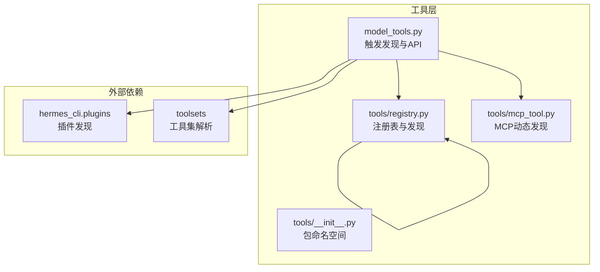
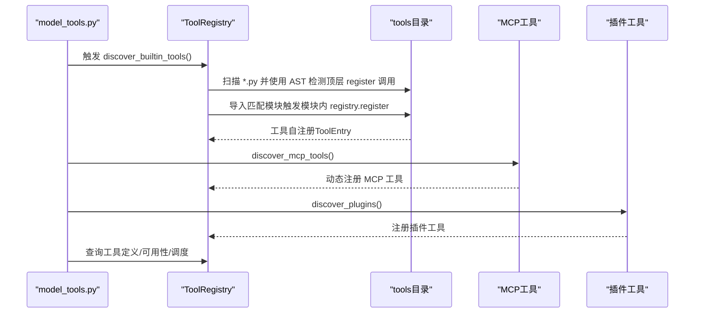
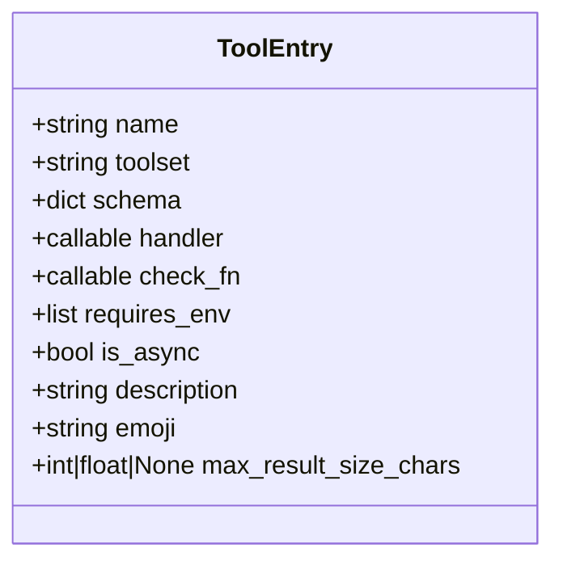
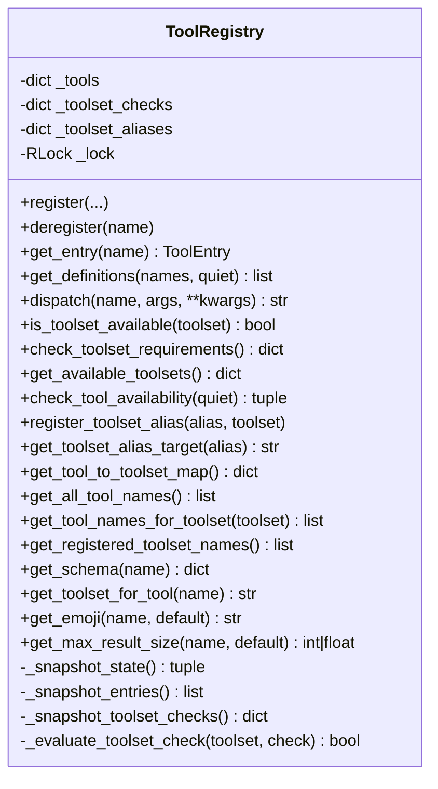
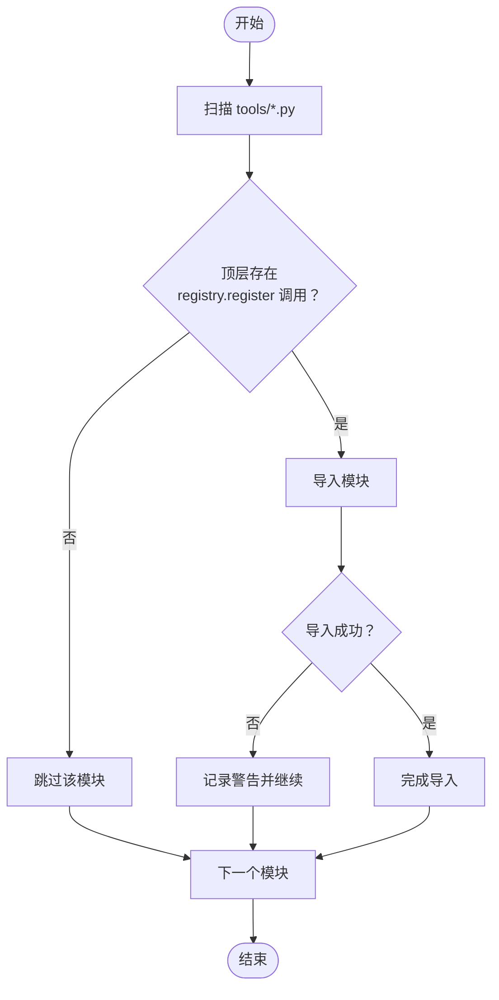
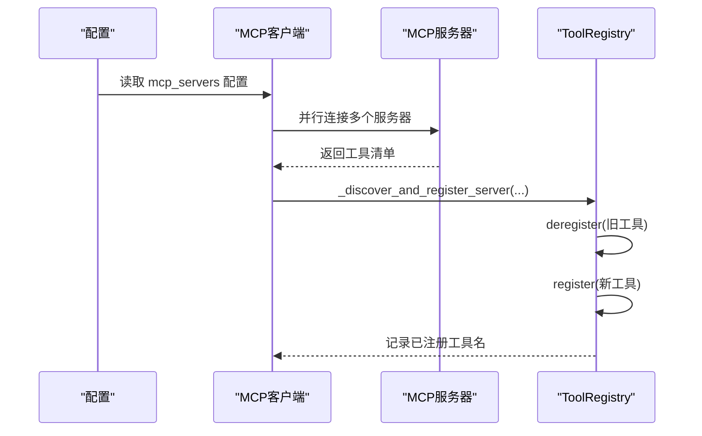
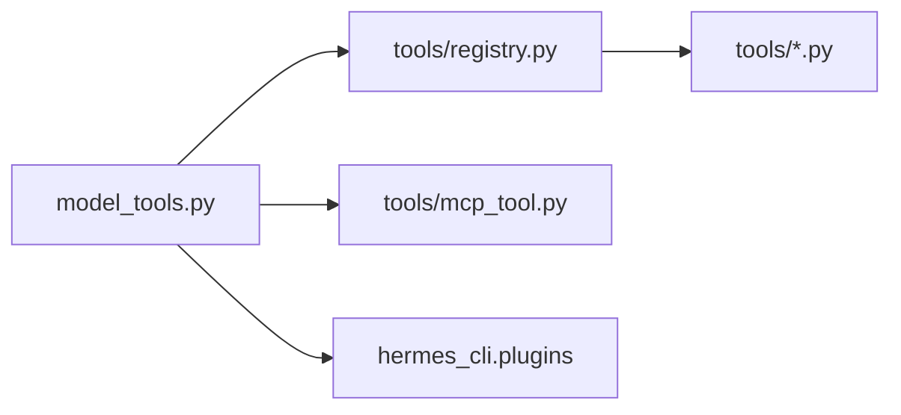

# 工具注册机制

<cite>
**本文档引用的文件**
- [tools/registry.py](file://tools/registry.py)
- [model_tools.py](file://model_tools.py)
- [tools/mcp_tool.py](file://tools/mcp_tool.py)
- [tools/__init__.py](file://tools/__init__.py)
- [tests/tools/test_registry.py](file://tests/tools/test_registry.py)
- [tests/tools/test_mcp_dynamic_discovery.py](file://tests/tools/test_mcp_dynamic_discovery.py)
- [website/docs/developer-guide/tools-runtime.md](file://website/docs/developer-guide/tools-runtime.md)
- [HERMES_AGENT_KNOWLEDGE_BASE.md](file://HERMES_AGENT_KNOWLEDGE_BASE.md)
</cite>

## 目录
1. [简介](#简介)
2. [项目结构](#项目结构)
3. [核心组件](#核心组件)
4. [架构总览](#架构总览)
5. [详细组件分析](#详细组件分析)
6. [依赖关系分析](#依赖关系分析)
7. [性能考虑](#性能考虑)
8. [故障排查指南](#故障排查指南)
9. [结论](#结论)
10. [附录](#附录)

## 简介
本文件系统化阐述 Hermes Agent 的工具注册机制，重点覆盖：
- 工具注册表的架构设计与数据结构（ToolEntry 类）
- ToolRegistry 单例模式的实现原理与线程安全策略
- 工具自动发现机制（AST 解析、模块导入流程、工具注册过程）
- 工具注册 API 的使用方法（register、deregister 等）
- 工具可用性检查机制、线程安全设计与性能优化策略
- 实际工具注册示例与最佳实践

## 项目结构
工具注册机制涉及以下关键文件与职责：
- tools/registry.py：集中式工具注册表与工具发现逻辑
- model_tools.py：触发工具发现、构建工具定义、对外提供 API
- tools/mcp_tool.py：MCP 服务器工具动态发现与注册
- tools/__init__.py：工具包命名空间与最小化导入副作用
- 测试与文档：验证注册行为、并发安全、动态刷新等

图表来源
- [model_tools.py:128-147](file://model_tools.py#L128-L147)
- [tools/registry.py:56-73](file://tools/registry.py#L56-L73)
- [tools/mcp_tool.py:126-138](file://tools/mcp_tool.py#L126-L138)

章节来源
- [model_tools.py:128-147](file://model_tools.py#L128-L147)
- [tools/registry.py:56-73](file://tools/registry.py#L56-L73)
- [tools/__init__.py:1-26](file://tools/__init__.py#L1-L26)

## 核心组件
- ToolEntry：封装单个工具的元数据（名称、工具集、Schema、处理器、可用性检查函数、环境变量需求、是否异步、描述、表情符号、最大结果大小等）。
- ToolRegistry：单例注册表，负责工具注册、反注册、查询、可用性检查、调度执行、工具集映射等；内部以可重入锁保证线程安全。
- discover_builtin_tools：基于 AST 的工具自动发现，扫描 tools 目录下包含顶层 registry.register 调用的模块并导入。
- 模块级单例 registry：全局唯一注册表实例，供各工具模块在导入时进行自注册。

章节来源
- [tools/registry.py:76-98](file://tools/registry.py#L76-L98)
- [tools/registry.py:100-110](file://tools/registry.py#L100-L110)
- [tools/registry.py:41-73](file://tools/registry.py#L41-L73)
- [tools/registry.py:436-437](file://tools/registry.py#L436-L437)

## 架构总览
工具注册机制采用“自注册 + 自动发现”的架构：
- 工具模块在导入时调用 registry.register 完成自注册
- model_tools 在启动阶段触发 discover_builtin_tools 导入工具模块
- MCP 与插件在运行时动态发现并注册工具
- ToolRegistry 提供统一查询、可用性检查与调度接口

图表来源
- [model_tools.py:128-147](file://model_tools.py#L128-L147)
- [tools/registry.py:41-73](file://tools/registry.py#L41-L73)
- [tools/mcp_tool.py:126-138](file://tools/mcp_tool.py#L126-L138)

## 详细组件分析

### ToolEntry 数据结构
ToolEntry 使用 __slots__ 限制属性，确保内存占用小且访问高效。字段包括：
- 基础信息：name、toolset、schema、handler、check_fn
- 环境与异步：requires_env、is_async
- 描述与标识：description、emoji
- 结果控制：max_result_size_chars

图表来源
- [tools/registry.py:76-98](file://tools/registry.py#L76-L98)

章节来源
- [tools/registry.py:76-98](file://tools/registry.py#L76-L98)

### ToolRegistry 单例与线程安全
- 单例：模块级 registry = ToolRegistry()
- 线程安全：使用可重入锁（threading.RLock）保护所有写操作；读操作通过快照（_snapshot_state）获取稳定视图，避免并发修改导致的不一致
- 可用性检查：对 check_fn 异常进行容错处理，异常即视为不可用
- 工具集别名：支持显式别名映射，便于向后兼容与用户友好显示

图表来源
- [tools/registry.py:100-434](file://tools/registry.py#L100-L434)

章节来源
- [tools/registry.py:100-110](file://tools/registry.py#L100-L110)
- [tools/registry.py:112-134](file://tools/registry.py#L112-L134)
- [tools/registry.py:352-360](file://tools/registry.py#L352-L360)
- [tools/registry.py:414-433](file://tools/registry.py#L414-L433)

### 工具自动发现机制（AST 解析与模块导入）
- AST 检测：仅匹配模块体内的顶层 registry.register(...) 调用，避免辅助模块误触发
- 导入策略：按排序后的文件名导入，捕获导入异常并记录警告，不影响其他工具加载
- 发现入口：discover_builtin_tools 返回已导入模块名列表，供上层使用

图表来源
- [tools/registry.py:41-73](file://tools/registry.py#L41-L73)

章节来源
- [tools/registry.py:41-73](file://tools/registry.py#L41-L73)
- [website/docs/developer-guide/tools-runtime.md:45-67](file://website/docs/developer-guide/tools-runtime.md#L45-L67)

### 工具注册 API 使用方法
- register(name, toolset, schema, handler, check_fn=None, requires_env=None, is_async=False, description="", emoji="", max_result_size_chars=None)
  - 支持同名工具冲突检测（MCP 到 MCP 允许覆盖，其他类型禁止覆盖）
  - 自动建立工具集可用性检查函数映射
- deregister(name)
  - 移除工具条目，必要时清理工具集检查函数与别名映射
- get_definitions(names, quiet=False)
  - 返回 OpenAI 格式的工具定义，自动过滤不可用工具
- dispatch(name, args, **kwargs)
  - 同步/异步处理器统一分发，异常捕获并返回标准化错误格式
- 可用性检查相关
  - is_toolset_available(toolset)：检查工具集可用性
  - check_toolset_requirements()：批量检查工具集可用性
  - get_available_toolsets()：UI 展示用工具集元数据
  - check_tool_availability(quiet)：兼容旧接口

章节来源
- [tools/registry.py:176-228](file://tools/registry.py#L176-L228)
- [tools/registry.py:229-252](file://tools/registry.py#L229-L252)
- [tools/registry.py:258-286](file://tools/registry.py#L258-L286)
- [tools/registry.py:292-310](file://tools/registry.py#L292-L310)
- [tools/registry.py:352-360](file://tools/registry.py#L352-L360)
- [tools/registry.py:362-413](file://tools/registry.py#L362-L413)
- [tools/registry.py:414-433](file://tools/registry.py#L414-L433)

### MCP 动态工具发现与刷新
- 运行时连接 MCP 服务器，批量并行发现工具
- 将 MCP 工具转换为标准 Schema 并注册到 ToolRegistry
- 支持动态刷新：当收到 tools/list_changed 通知时，先全量反注册再重新注册
- 线程安全：使用锁保护注册表状态，避免与读取线程并发冲突

图表来源
- [tools/mcp_tool.py:126-138](file://tools/mcp_tool.py#L126-L138)
- [tools/mcp_tool.py:1897-1918](file://tools/mcp_tool.py#L1897-L1918)
- [tests/tools/test_mcp_dynamic_discovery.py:130-160](file://tests/tools/test_mcp_dynamic_discovery.py#L130-L160)

章节来源
- [tools/mcp_tool.py:126-138](file://tools/mcp_tool.py#L126-L138)
- [tools/mcp_tool.py:1897-1918](file://tools/mcp_tool.py#L1897-L1918)
- [tests/tools/test_mcp_dynamic_discovery.py:130-160](file://tests/tools/test_mcp_dynamic_discovery.py#L130-L160)

### 工具可用性检查机制
- 工具级：get_definitions 会根据 check_fn 过滤不可用工具
- 工具集级：is_toolset_available/check_toolset_requirements 统一评估工具集可用性
- 容错策略：check_fn 抛出异常视为不可用，日志记录调试信息
- UI 展示：get_available_toolsets 提供工具集可用性、工具列表与环境变量要求

章节来源
- [tools/registry.py:258-286](file://tools/registry.py#L258-L286)
- [tools/registry.py:352-360](file://tools/registry.py#L352-L360)
- [tools/registry.py:362-413](file://tools/registry.py#L362-L413)
- [tools/registry.py:414-433](file://tools/registry.py#L414-L433)

### 线程安全设计与并发测试
- 读写分离：所有写操作（register/deregister）在 RLock 内执行
- 快照读取：_snapshot_state/_snapshot_entries/_snapshot_toolset_checks 返回稳定视图，避免读取过程中状态突变
- 并发测试覆盖：测试用例验证在读取期间并发注册/反注册不会崩溃，且结果一致

章节来源
- [tools/registry.py:112-134](file://tools/registry.py#L112-L134)
- [tests/tools/test_registry.py:427-562](file://tests/tools/test_registry.py#L427-L562)

### 性能优化策略
- 事件循环桥接：_run_async 为同步上下文提供持久事件循环，避免“事件循环已关闭”问题并减少重复创建开销
- 工具集检查缓存：同一 call 期内共享 check_fn 结果，避免重复计算
- 并行 MCP 发现：多服务器并行连接与工具发现，缩短整体发现时间
- 最大结果大小控制：get_max_result_size 提供统一限额，防止超大响应影响性能

章节来源
- [model_tools.py:44-126](file://model_tools.py#L44-L126)
- [tools/registry.py:265-286](file://tools/registry.py#L265-L286)
- [tools/mcp_tool.py:2031-2050](file://tools/mcp_tool.py#L2031-L2050)
- [tools/registry.py:315-323](file://tools/registry.py#L315-L323)

## 依赖关系分析
- model_tools 依赖 tools/registry 与工具模块，触发自动发现并构建工具定义
- MCP 工具发现依赖 mcp 包（可选），在可用时动态注册
- 插件工具发现依赖 hermes_cli.plugins
- 工具模块在导入时依赖 tools/registry 完成自注册

图表来源
- [model_tools.py:128-147](file://model_tools.py#L128-L147)
- [tools/registry.py:56-73](file://tools/registry.py#L56-L73)
- [tools/mcp_tool.py:126-138](file://tools/mcp_tool.py#L126-L138)

章节来源
- [model_tools.py:128-147](file://model_tools.py#L128-L147)
- [tools/registry.py:56-73](file://tools/registry.py#L56-L73)
- [tools/mcp_tool.py:126-138](file://tools/mcp_tool.py#L126-L138)

## 性能考虑
- 事件循环复用：在 CLI 主线程与工作线程分别维护持久事件循环，避免频繁创建/销毁带来的性能损耗
- 工具集检查去重：同一 call 内共享 check_fn 执行结果，降低重复检查成本
- MCP 并行发现：多服务器并行连接与工具拉取，缩短冷启动时间
- 结果大小限制：统一的最大结果字符数控制，避免超大响应影响吞吐

章节来源
- [model_tools.py:44-126](file://model_tools.py#L44-L126)
- [tools/registry.py:265-286](file://tools/registry.py#L265-L286)
- [tools/mcp_tool.py:2031-2050](file://tools/mcp_tool.py#L2031-L2050)
- [tools/registry.py:315-323](file://tools/registry.py#L315-L323)

## 故障排查指南
- 工具未出现在可用列表
  - 检查工具模块是否包含顶层 registry.register 调用
  - 确认 discover_builtin_tools 是否正确导入该模块
  - 若工具有 check_fn，请确认其返回值与异常处理
- MCP 工具未注册或动态刷新失败
  - 检查 mcp_servers 配置与网络连通性
  - 查看日志中关于连接失败与工具注册摘要的信息
  - 确认工具名是否与内置工具冲突
- 并发场景下的异常
  - 确保通过 ToolRegistry 的 API 进行读写，避免直接修改内部字典
  - 如需在读取期间变更注册表，使用 deregister + register 或等待读取完成
- 插件工具未加载
  - 确认 discover_plugins 是否被调用且无异常
  - 检查插件模块是否正确导出工具注册逻辑

章节来源
- [tools/registry.py:258-286](file://tools/registry.py#L258-L286)
- [tools/mcp_tool.py:2031-2050](file://tools/mcp_tool.py#L2031-L2050)
- [tests/tools/test_mcp_dynamic_discovery.py:130-160](file://tests/tools/test_mcp_dynamic_discovery.py#L130-L160)

## 结论
Hermes Agent 的工具注册机制通过 ToolRegistry 单例与 ToolEntry 数据结构实现了高内聚、低耦合的工具管理；借助 AST 自动发现与模块导入，实现了零配置扩展；配合 MCP 与插件的动态发现能力，满足了复杂场景下的工具生命周期管理。线程安全与性能优化策略确保了在高并发与长生命周期运行中的稳定性与效率。

## 附录

### 工具注册 API 参考
- register(name, toolset, schema, handler, check_fn=None, requires_env=None, is_async=False, description="", emoji="", max_result_size_chars=None)
- deregister(name)
- get_definitions(names, quiet=False)
- dispatch(name, args, **kwargs)
- is_toolset_available(toolset)
- check_toolset_requirements()
- get_available_toolsets()
- check_tool_availability(quiet)
- register_toolset_alias(alias, toolset)
- get_toolset_alias_target(alias)
- get_tool_to_toolset_map()
- get_all_tool_names()
- get_tool_names_for_toolset(toolset)
- get_registered_toolset_names()
- get_schema(name)
- get_toolset_for_tool(name)
- get_emoji(name, default)
- get_max_result_size(name, default)

章节来源
- [tools/registry.py:176-228](file://tools/registry.py#L176-L228)
- [tools/registry.py:229-252](file://tools/registry.py#L229-L252)
- [tools/registry.py:258-286](file://tools/registry.py#L258-L286)
- [tools/registry.py:292-310](file://tools/registry.py#L292-L310)
- [tools/registry.py:352-360](file://tools/registry.py#L352-L360)
- [tools/registry.py:362-413](file://tools/registry.py#L362-L413)
- [tools/registry.py:414-433](file://tools/registry.py#L414-L433)
- [tools/registry.py:151-171](file://tools/registry.py#L151-L171)
- [tools/registry.py:348-351](file://tools/registry.py#L348-L351)
- [tools/registry.py:325-327](file://tools/registry.py#L325-L327)
- [tools/registry.py:144-149](file://tools/registry.py#L144-L149)
- [tools/registry.py:140-142](file://tools/registry.py#L140-L142)
- [tools/registry.py:339-341](file://tools/registry.py#L339-L341)
- [tools/registry.py:343-346](file://tools/registry.py#L343-L346)
- [tools/registry.py:315-323](file://tools/registry.py#L315-L323)

### 工具注册示例（步骤）
- 创建工具文件，定义 handler、schema、check_fn、requires_env
- 在文件末尾调用 registry.register 完成自注册
- 确保工具模块在 tools 目录下，且包含顶层 registry.register 调用
- 启动时由 model_tools 触发 discover_builtin_tools，自动导入并注册

章节来源
- [website/docs/developer-guide/adding-tools.md:24-98](file://website/docs/developer-guide/adding-tools.md#L24-L98)
- [model_tools.py:128-147](file://model_tools.py#L128-L147)
- [tools/registry.py:41-73](file://tools/registry.py#L41-L73)

### 最佳实践
- 工具模块应保持最小导入副作用，避免在 tools/__init__.py 中触发大量导入
- check_fn 应快速、幂等、健壮，避免抛出异常
- 对于异步工具，确保 handler 返回协程并在 dispatch 中通过 _run_async 正确桥接
- 使用工具集别名提升用户体验，但注意避免与内置工具冲突
- MCP 工具注册时优先处理冲突，保留内置工具不变

章节来源
- [tools/__init__.py:1-26](file://tools/__init__.py#L1-L26)
- [tools/registry.py:192-213](file://tools/registry.py#L192-L213)
- [model_tools.py:81-126](file://model_tools.py#L81-L126)
- [tools/mcp_tool.py:1897-1918](file://tools/mcp_tool.py#L1897-L1918)