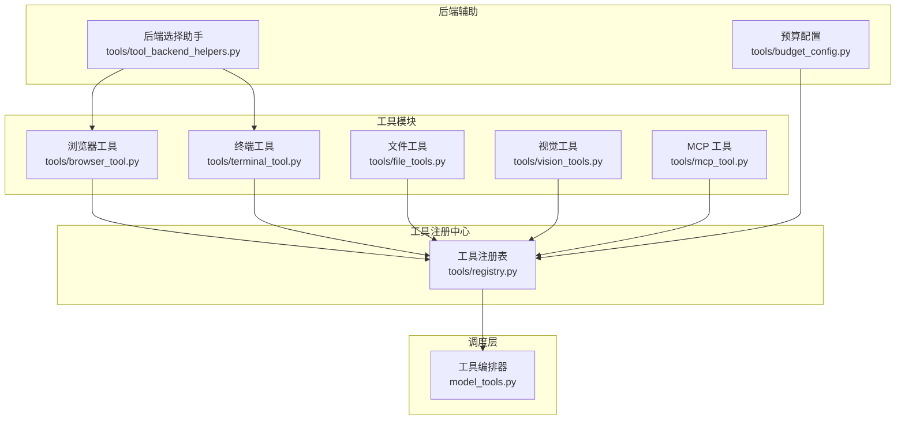
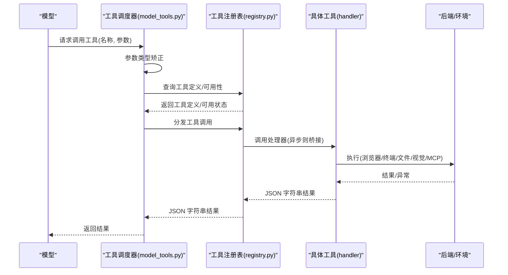
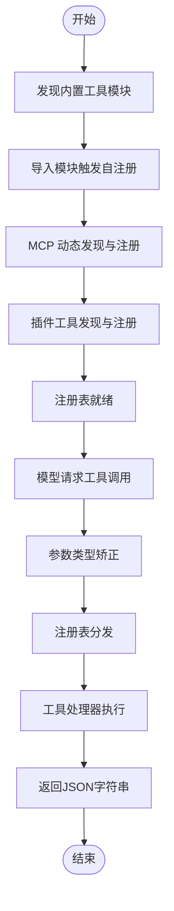
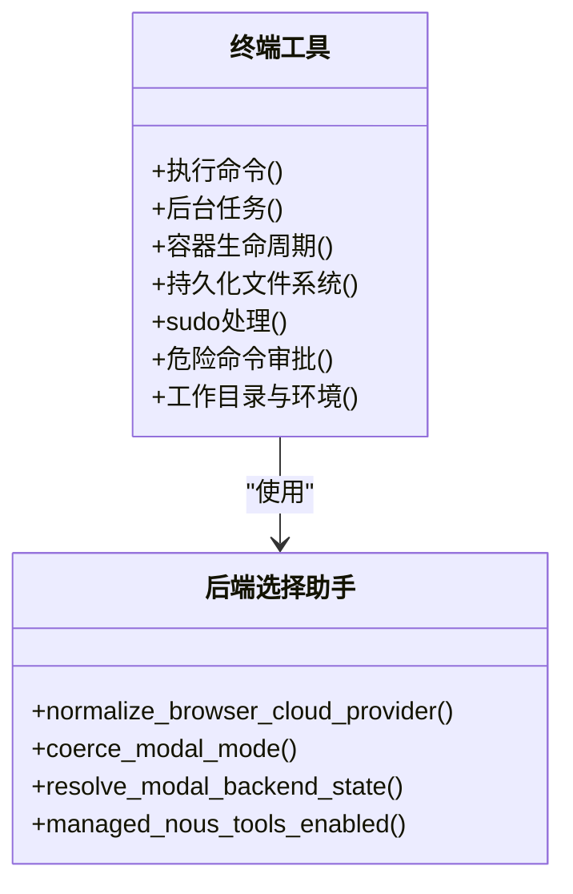
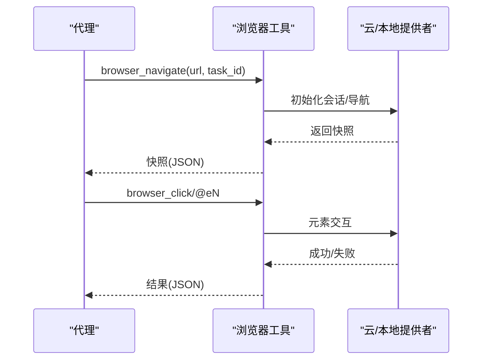
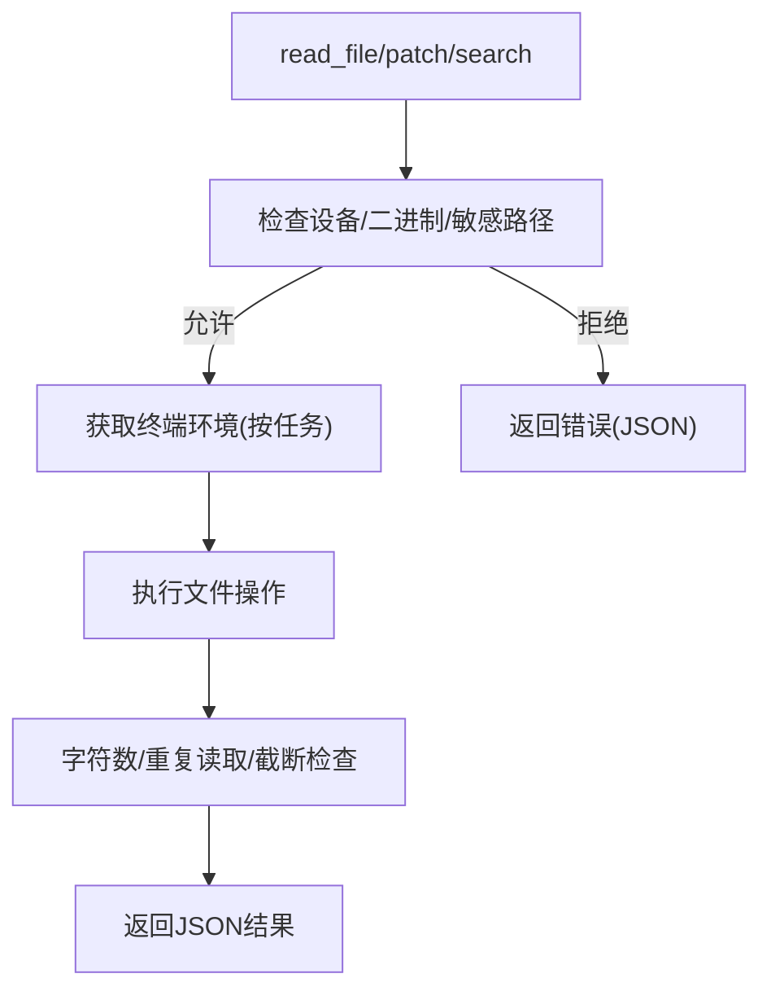
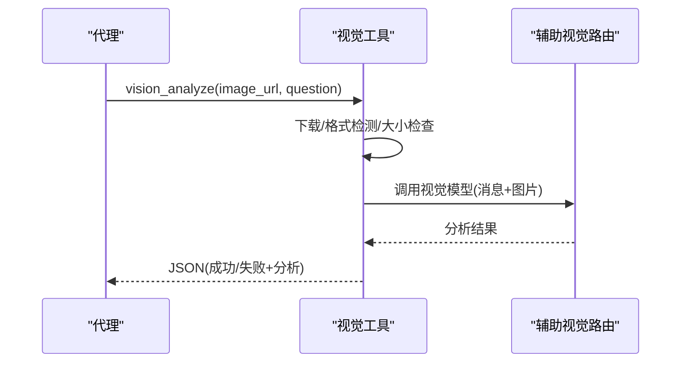
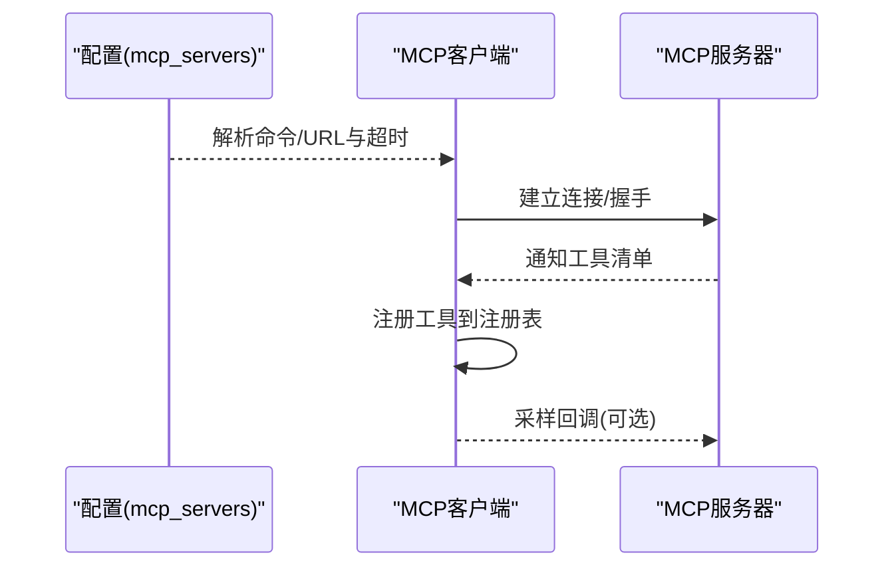
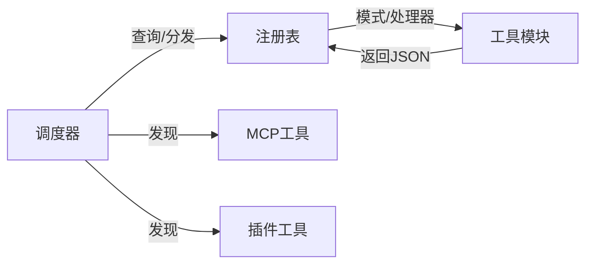

# 工具系统

<cite>
**本文引用的文件**
- [tools/__init__.py](file://tools/__init__.py)
- [tools/registry.py](file://tools/registry.py)
- [tools/browser_tool.py](file://tools/browser_tool.py)
- [tools/terminal_tool.py](file://tools/terminal_tool.py)
- [tools/file_tools.py](file://tools/file_tools.py)
- [tools/vision_tools.py](file://tools/vision_tools.py)
- [tools/mcp_tool.py](file://tools/mcp_tool.py)
- [tools/tool_backend_helpers.py](file://tools/tool_backend_helpers.py)
- [model_tools.py](file://model_tools.py)
- [tools/budget_config.py](file://tools/budget_config.py)
</cite>

## 目录
1. [简介](#简介)
2. [项目结构](#项目结构)
3. [核心组件](#核心组件)
4. [架构总览](#架构总览)
5. [详细组件分析](#详细组件分析)
6. [依赖关系分析](#依赖关系分析)
7. [性能考量](#性能考量)
8. [故障排查指南](#故障排查指南)
9. [结论](#结论)
10. [附录](#附录)

## 简介
本文件系统性阐述 Hermes Agent 的工具系统：从工具注册机制、工具分类与管理策略，到终端工具、浏览器工具、文件操作工具、视觉分析工具等的实现细节与使用方法；并提供自定义工具开发指南（接口规范、参数校验、执行流程与安全考虑）、工具发现/加载/执行/结果处理的全生命周期说明、使用示例与最佳实践，以及工具系统与代理引擎的集成方式与性能优化策略。

## 项目结构
工具系统围绕“注册中心 + 工具模块 + 调度器”的三层架构组织：
- 注册中心：集中收集工具的模式定义、处理器、可用性检查与元数据，并提供查询与分发能力。
- 工具模块：按功能域划分（终端、浏览器、文件、视觉、MCP 等），每个模块在导入时自我注册。
- 调度器：面向模型侧暴露统一的工具定义与调用接口，负责参数类型矫正、插件钩子、异步桥接与错误处理。

图示来源
- [tools/registry.py:100-437](file://tools/registry.py#L100-L437)
- [tools/browser_tool.py:657-800](file://tools/browser_tool.py#L657-L800)
- [tools/terminal_tool.py:598-800](file://tools/terminal_tool.py#L598-L800)
- [tools/file_tools.py:695-800](file://tools/file_tools.py#L695-L800)
- [tools/vision_tools.py:748-790](file://tools/vision_tools.py#L748-L790)
- [tools/mcp_tool.py:134-146](file://tools/mcp_tool.py#L134-L146)
- [model_tools.py:128-146](file://model_tools.py#L128-L146)
- [tools/tool_backend_helpers.py:65-98](file://tools/tool_backend_helpers.py#L65-L98)
- [tools/budget_config.py:23-52](file://tools/budget_config.py#L23-L52)

章节来源
- [tools/__init__.py:1-26](file://tools/__init__.py#L1-L26)
- [tools/registry.py:1-483](file://tools/registry.py#L1-L483)
- [model_tools.py:1-563](file://model_tools.py#L1-L563)

## 核心组件
- 工具注册表（ToolRegistry）
  - 单例注册表，负责收集工具的名称、工具集、模式、处理器、可用性检查函数、环境要求、是否异步、描述、表情符号、最大结果长度等元数据。
  - 提供工具定义导出、工具分发、可用性检查、工具集映射、别名解析、线程安全快照等能力。
- 工具模块
  - 浏览器工具：多后端（本地 Chromium、Browserbase、Browser Use、Firecrawl）统一抽象，支持会话隔离、可访问性树快照、元素交互、截图与视觉分析等。
  - 终端工具：支持本地、Docker、Modal、SSH、Singularity、Daytona 等多种执行后端，具备超时控制、持久化文件系统、后台任务、磁盘用量告警、危险命令审批等。
  - 文件工具：基于终端环境的 ShellFileOperations，提供读取、写入、补丁、搜索等能力，内置设备路径阻断、敏感路径保护、重复读取去重、大文件字符数限制、秘密信息脱敏等。
  - 视觉工具：统一的图像下载、格式检测、Base64 编码、大小限制与自动缩放、SSRF 防护、错误消息清洗、调试日志记录等。
  - MCP 工具：连接外部 MCP 服务器（stdio 或 HTTP/StreamableHTTP），动态发现工具并注册到注册表，支持采样回调、速率限制、凭证清洗、动态工具变更通知等。
- 调度器（model_tools.py）
  - 自动发现内置工具、MCP 工具与插件工具，构建 OpenAI 兼容的工具定义列表，按工具集启用/禁用过滤。
  - 执行前进行参数类型矫正（数字/布尔），拦截特定工具交由代理循环处理，触发插件预/后置钩子，异步工具通过桥接循环执行，统一错误格式化返回。
- 后端辅助与预算配置
  - 工具后端选择助手：浏览器云提供商归一化、Modal 模式解析、Nou’s 订阅态判断、网关偏好判断等。
  - 预算配置：全局与逐工具的结果大小阈值、单轮预算、预览大小，支持固定阈值与注册表回退。

章节来源
- [tools/registry.py:76-437](file://tools/registry.py#L76-L437)
- [tools/browser_tool.py:1-800](file://tools/browser_tool.py#L1-L800)
- [tools/terminal_tool.py:1-800](file://tools/terminal_tool.py#L1-L800)
- [tools/file_tools.py:1-800](file://tools/file_tools.py#L1-L800)
- [tools/vision_tools.py:1-790](file://tools/vision_tools.py#L1-L790)
- [tools/mcp_tool.py:1-800](file://tools/mcp_tool.py#L1-L800)
- [model_tools.py:128-563](file://model_tools.py#L128-L563)
- [tools/tool_backend_helpers.py:1-122](file://tools/tool_backend_helpers.py#L1-L122)
- [tools/budget_config.py:1-53](file://tools/budget_config.py#L1-L53)

## 架构总览
工具系统的运行时序列如下：

图示来源
- [model_tools.py:421-534](file://model_tools.py#L421-L534)
- [tools/registry.py:292-310](file://tools/registry.py#L292-L310)

## 详细组件分析

### 工具注册机制与生命周期
- 自注册流程
  - 工具模块在导入时调用注册表的 register 接口，传入工具名、工具集、模式、处理器、可用性检查函数、环境变量要求、是否异步、描述、表情、最大结果长度等。
  - 注册表维护工具条目、工具集检查函数与别名映射，提供线程安全快照以避免并发读写冲突。
- 发现与加载
  - 调度器启动时自动发现内置工具模块并导入，从而触发各模块的 self-register。
  - 支持 MCP 工具动态发现与注册，以及插件工具发现。
- 可用性检查
  - 按工具集维度执行 check_fn，失败或抛错时标记不可用；注册表提供工具集可用性查询与 UI 展示所需元数据。
- 执行与结果处理
  - 调度器对异步工具通过桥接循环执行；统一捕获异常并返回标准错误格式；支持插件钩子在调用前后触发。

图示来源
- [model_tools.py:128-146](file://model_tools.py#L128-L146)
- [tools/registry.py:176-228](file://tools/registry.py#L176-L228)

章节来源
- [tools/registry.py:100-437](file://tools/registry.py#L100-L437)
- [model_tools.py:128-316](file://model_tools.py#L128-L316)

### 终端工具（多后端执行）
- 支持后端
  - 本地、Docker、Singularity、Modal（直连/托管）、Daytona、SSH。
- 关键特性
  - 多执行后端、容器资源控制、持久化文件系统、后台任务、超时与生命周期管理、磁盘用量告警、sudo 密码缓存与交互提示、危险命令审批、工作目录与环境变量透传。
- 安全与稳定性
  - 环境变量白名单过滤、进程中断事件响应、孤儿容器/VM 清理、会话空闲清理线程、任务级环境覆盖注册。

图示来源
- [tools/terminal_tool.py:598-800](file://tools/terminal_tool.py#L598-L800)
- [tools/tool_backend_helpers.py:38-98](file://tools/tool_backend_helpers.py#L38-L98)

章节来源
- [tools/terminal_tool.py:1-800](file://tools/terminal_tool.py#L1-L800)
- [tools/tool_backend_helpers.py:1-122](file://tools/tool_backend_helpers.py#L1-L122)

### 浏览器工具（多后端自动化）
- 支持后端
  - 本地 Chromium（agent-browser）、Browserbase、Browser Use、Firecrawl；支持 CDP 连接覆盖与 Camofox 代理模式。
- 关键特性
  - 会话隔离（按 task_id）、可访问性树快照、元素交互（点击/输入/滚动/回退/按键）、页面截图与视觉分析、命令超时与空闲清理、SSRF 阻断与网站策略检查。
- 安全与稳定性
  - 私有地址访问开关、URL 安全检查、重定向 SSRF 防护、临时文件清理、孤儿会话扫描与回收、后台清理线程。

图示来源
- [tools/browser_tool.py:657-800](file://tools/browser_tool.py#L657-L800)

章节来源
- [tools/browser_tool.py:1-800](file://tools/browser_tool.py#L1-L800)

### 文件操作工具（读/写/补丁/搜索）
- 能力范围
  - 读取文本文件（带行号与分页）、写入文件、目标化替换/补丁（V4A）、内容/文件搜索（正则/Glob）。
- 安全与效率
  - 设备路径阻断（/dev/zero 等）、二进制文件阻断、敏感路径保护（/etc/ 等）、重复读取去重与连续读取警告、大文件字符数限制、秘密信息脱敏、搜索结果截断提示。
- 与终端工具的协作
  - 基于终端环境的 ShellFileOperations，按任务隔离创建/复用执行环境，支持容器/SSH 等后端。

图示来源
- [tools/file_tools.py:282-490](file://tools/file_tools.py#L282-L490)

章节来源
- [tools/file_tools.py:1-800](file://tools/file_tools.py#L1-L800)

### 视觉分析工具（图像 URL/本地路径）
- 能力范围
  - 下载图像（含重试与 SSRF 防护）、格式检测、Base64 编码、大小限制与自动缩放、调用统一视觉路由、调试日志记录、错误消息清洗。
- 安全与稳定性
  - URL 格式与安全检查、重定向 SSRF 防护、最大下载体积限制、最大负载大小限制、Pillow 自动缩放降噪。

图示来源
- [tools/vision_tools.py:405-667](file://tools/vision_tools.py#L405-L667)

章节来源
- [tools/vision_tools.py:1-790](file://tools/vision_tools.py#L1-L790)

### MCP 工具（外部工具协议）
- 能力范围
  - 连接 stdio 或 HTTP/StreamableHTTP 的 MCP 服务器，动态发现工具并注册到注册表；支持采样回调（服务器主动请求 LLM 补充工具调用）与速率限制。
- 安全与稳定性
  - 环境变量白名单过滤、凭证清洗、描述内容注入风险扫描、指数回退重连、动态工具变更通知、线程安全与事件循环隔离。

图示来源
- [tools/mcp_tool.py:134-146](file://tools/mcp_tool.py#L134-L146)
- [tools/mcp_tool.py:774-800](file://tools/mcp_tool.py#L774-L800)

章节来源
- [tools/mcp_tool.py:1-800](file://tools/mcp_tool.py#L1-L800)

### 工具分类与管理策略
- 工具集（Toolset）
  - 注册表维护工具集名称、可用性检查、工具清单、环境变量要求等元数据；支持别名映射与工具集可用性批量查询。
- 启用/禁用策略
  - 调度器根据 enabled_toolsets/disabled_toolsets 过滤工具定义，兼容旧版工具集名称映射。
- 结果大小与预算
  - 支持逐工具阈值、全局默认阈值与固定阈值优先级；结合单轮预算与预览大小，控制上下文占用。

章节来源
- [tools/registry.py:371-433](file://tools/registry.py#L371-L433)
- [model_tools.py:196-316](file://model_tools.py#L196-L316)
- [tools/budget_config.py:23-52](file://tools/budget_config.py#L23-L52)

### 自定义工具开发指南
- 接口规范
  - 在工具模块中定义工具处理器函数，构造 OpenAI 兼容的工具模式字典，调用注册表的 register 接口完成注册。
- 参数校验与类型矫正
  - 调度器在执行前对参数进行类型矫正（整数/浮点/布尔），确保与 JSON Schema 匹配。
- 执行流程
  - 处理器返回 JSON 字符串；异步工具通过桥接循环执行；统一错误格式化。
- 安全考虑
  - 使用注册表提供的工具错误/结果封装工具函数；对敏感路径/设备路径/私有地址进行阻断；对错误消息进行凭证清洗。
- 最佳实践
  - 明确工具集归属与可用性检查函数；设置合理的最大结果长度；为长耗时工具设置超时；在描述中明确前置条件与副作用。

章节来源
- [tools/registry.py:456-483](file://tools/registry.py#L456-L483)
- [model_tools.py:334-418](file://model_tools.py#L334-L418)
- [tools/file_tools.py:102-127](file://tools/file_tools.py#L102-L127)
- [tools/browser_tool.py:374-392](file://tools/browser_tool.py#L374-L392)
- [tools/vision_tools.py:213-228](file://tools/vision_tools.py#L213-L228)

## 依赖关系分析
- 模块耦合
  - 工具模块仅在导入时注册，避免循环导入；注册表不依赖具体工具模块，仅持有模式与处理器引用。
  - 调度器依赖注册表与工具集解析，同时引入 MCP 与插件发现作为扩展点。
- 外部依赖
  - MCP 工具依赖 mcp SDK（可选）；终端工具依赖 Modal/SSH/Docker 等后端（可选）；视觉工具依赖辅助路由与可选的 Pillow。
- 循环依赖规避
  - 注册表通过 AST 检测与延迟导入避免循环；调度器在启动阶段完成发现，后续只读。

图示来源
- [tools/registry.py:56-74](file://tools/registry.py#L56-L74)
- [model_tools.py:128-146](file://model_tools.py#L128-L146)

章节来源
- [tools/registry.py:1-483](file://tools/registry.py#L1-L483)
- [model_tools.py:128-146](file://model_tools.py#L128-L146)

## 性能考量
- 异步桥接与事件循环
  - 为避免“事件循环已关闭”问题，调度器为 CLI 主线程与工作线程分别维护长期存活的事件循环，异步工具通过桥接执行。
- 结果大小与预算
  - 通过预算配置与逐工具阈值控制上下文占用，避免过大的工具结果影响推理成本与速度。
- 后台清理与资源回收
  - 浏览器与终端工具均提供后台清理线程与孤儿进程/会话扫描，降低资源泄漏风险。
- 超时与重试
  - 终端工具前台最大超时、浏览器命令超时、视觉下载与 API 调用超时均可配置；MCP 工具支持指数回退重连。

章节来源
- [model_tools.py:44-126](file://model_tools.py#L44-L126)
- [tools/budget_config.py:23-52](file://tools/budget_config.py#L23-L52)
- [tools/browser_tool.py:178-200](file://tools/browser_tool.py#L178-L200)
- [tools/vision_tools.py:51-68](file://tools/vision_tools.py#L51-L68)
- [tools/mcp_tool.py:163-167](file://tools/mcp_tool.py#L163-L167)

## 故障排查指南
- 工具未出现或不可用
  - 检查工具集可用性检查函数是否通过；确认 enabled_toolsets/disabled_toolsets 配置；查看调度器输出的最终工具选择。
- 执行报错
  - 查看统一错误格式化返回；关注参数类型矫正是否导致预期不符；检查插件钩子是否拦截。
- 浏览器工具问题
  - 检查云提供商配置与网络；确认私有地址访问开关；查看会话清理日志。
- 终端工具问题
  - 检查后端可用性（Docker/Modal/SSH）与环境变量；关注磁盘用量告警；确认 sudo 权限与交互提示。
- 视觉工具问题
  - 检查图像 URL/路径合法性与安全检查；确认下载超时与大小限制；查看调试日志。
- MCP 工具问题
  - 检查 mcp_servers 配置与命令/URL 可用性；查看凭证清洗与采样回调日志。

章节来源
- [model_tools.py:530-534](file://model_tools.py#L530-L534)
- [tools/browser_tool.py:440-474](file://tools/browser_tool.py#L440-L474)
- [tools/terminal_tool.py:82-108](file://tools/terminal_tool.py#L82-L108)
- [tools/vision_tools.py:620-667](file://tools/vision_tools.py#L620-L667)
- [tools/mcp_tool.py:324-382](file://tools/mcp_tool.py#L324-L382)

## 结论
Hermes Agent 的工具系统通过“注册中心 + 工具模块 + 调度器”的清晰分层，实现了工具的自注册、统一调度、安全与性能保障。其多后端设计（终端/浏览器/视觉/MCP）与严格的可用性检查、参数矫正、错误处理、预算控制与后台清理机制，使得工具系统既灵活又稳健，适合在复杂代理场景中稳定运行。

## 附录
- 使用示例（路径指引）
  - 终端工具：参见终端工具模块中的使用说明与注释。
  - 浏览器工具：参见浏览器工具模块中的使用说明与注释。
  - 文件工具：参见文件工具模块中的使用说明与注释。
  - 视觉工具：参见视觉工具模块中的使用说明与注释。
  - MCP 工具：参见 MCP 工具模块中的配置示例与注释。
- 最佳实践
  - 明确工具集边界与可用性检查；合理设置最大结果长度与预算；为长耗时工具配置超时；在描述中明确前置条件与副作用；启用调试日志定位问题。