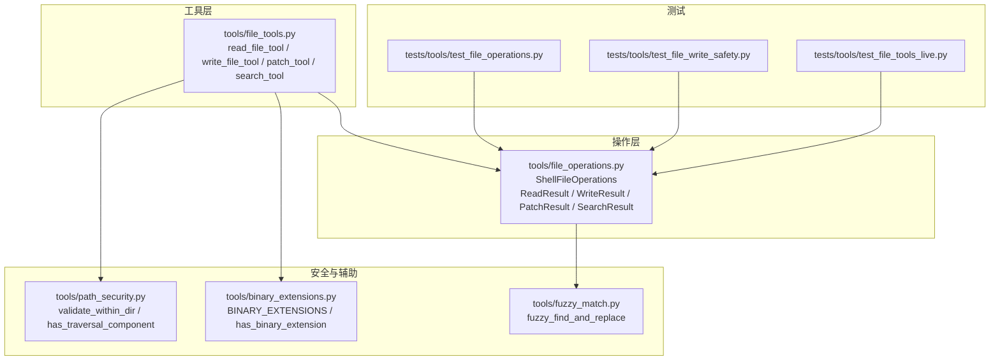
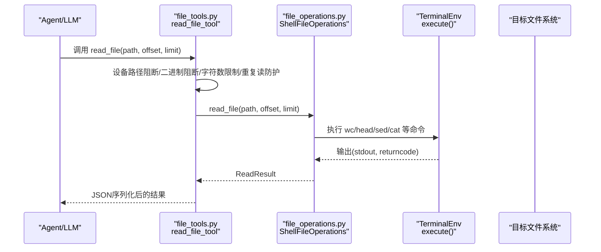
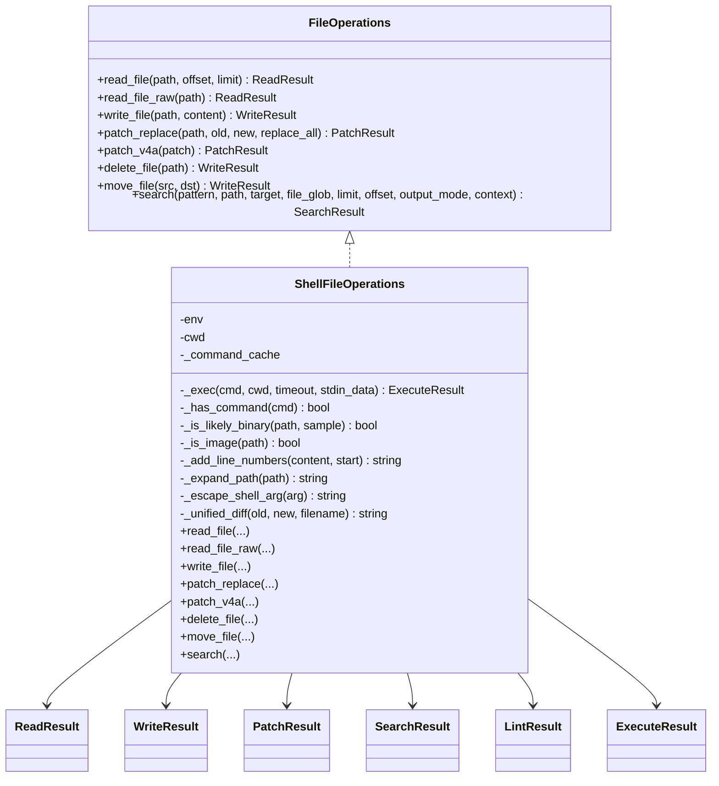

# 文件操作工具

<cite>
**本文引用的文件列表**
- [tools/file_operations.py](file://tools/file_operations.py)
- [tools/file_tools.py](file://tools/file_tools.py)
- [tools/path_security.py](file://tools/path_security.py)
- [tools/binary_extensions.py](file://tools/binary_extensions.py)
- [tools/fuzzy_match.py](file://tools/fuzzy_match.py)
- [tests/tools/test_file_operations.py](file://tests/tools/test_file_operations.py)
- [tests/tools/test_file_write_safety.py](file://tests/tools/test_file_write_safety.py)
- [tests/tools/test_file_tools_live.py](file://tests/tools/test_file_tools_live.py)
- [hermes_cli/config.py](file://hermes_cli/config.py)
</cite>

## 目录
1. [简介](#简介)
2. [项目结构](#项目结构)
3. [核心组件](#核心组件)
4. [架构总览](#架构总览)
5. [详细组件分析](#详细组件分析)
6. [依赖关系分析](#依赖关系分析)
7. [性能考量](#性能考量)
8. [故障排查指南](#故障排查指南)
9. [结论](#结论)
10. [附录：使用示例与最佳实践](#附录使用示例与最佳实践)

## 简介
本文件面向Hermes Agent的文件操作工具，系统性阐述其架构设计与实现细节，覆盖以下主题：
- 文件系统抽象与终端后端适配
- 路径安全验证与权限管理
- 文本/二进制/大文件读写流程
- 文件搜索与批量操作（递归、模式匹配、结果分页）
- 安全机制（路径遍历防护、文件类型校验、敏感路径阻断、写入沙箱）
- 性能优化（命令缓存、并发控制、内存与上下文限制）
- 使用示例与安全最佳实践

## 项目结构
文件操作工具主要由三层构成：
- 工具层：对外暴露read_file、write_file、patch、search_files等LLM可调用工具接口，并进行读取去重、字符数限制、敏感路径阻断、连续重复读/搜的防护。
- 操作层：统一的ShellFileOperations类，封装所有文件操作的底层实现，通过终端环境execute接口在本地或容器/云环境中执行命令。
- 安全与辅助：路径安全校验、二进制扩展识别、模糊匹配替换策略、写入拒绝列表与安全根目录沙箱。

图表来源
- [tools/file_tools.py:1-800](file://tools/file_tools.py#L1-L800)
- [tools/file_operations.py:1-1217](file://tools/file_operations.py#L1-L1217)
- [tools/path_security.py:1-44](file://tools/path_security.py#L1-L44)
- [tools/binary_extensions.py:1-43](file://tools/binary_extensions.py#L1-L43)
- [tools/fuzzy_match.py:1-567](file://tools/fuzzy_match.py#L1-L567)
- [tests/tools/test_file_operations.py:1-358](file://tests/tools/test_file_operations.py#L1-L358)
- [tests/tools/test_file_write_safety.py:1-44](file://tests/tools/test_file_write_safety.py#L1-L44)
- [tests/tools/test_file_tools_live.py:243-268](file://tests/tools/test_file_tools_live.py#L243-L268)

章节来源
- [tools/file_tools.py:1-800](file://tools/file_tools.py#L1-L800)
- [tools/file_operations.py:1-1217](file://tools/file_operations.py#L1-L1217)
- [tools/path_security.py:1-44](file://tools/path_security.py#L1-L44)
- [tools/binary_extensions.py:1-43](file://tools/binary_extensions.py#L1-L43)
- [tools/fuzzy_match.py:1-567](file://tools/fuzzy_match.py#L1-L567)

## 核心组件
- 统一文件操作接口：FileOperations抽象类定义了read_file、read_file_raw、write_file、patch_replace、patch_v4a、delete_file、move_file、search等方法，确保跨终端后端一致性。
- ShellFileOperations实现：基于终端execute接口，封装命令执行、参数转义、二进制/图片检测、行号添加、分页读取、差异生成、lint检查等。
- 工具层封装：read_file_tool、write_file_tool、patch_tool、search_tool对ShellFileOperations进行包装，加入设备路径阻断、二进制文件阻断、最大字符数限制、重复读/搜防护、敏感路径阻断、写入沙箱、时间戳跟踪等。
- 结果数据类：ReadResult、WriteResult、PatchResult、SearchResult、LintResult用于标准化返回值，便于工具注册与前端展示。
- 路径安全与二进制扩展：validate_within_dir、has_binary_extension、BINARY_EXTENSIONS等保障路径合法性与文件类型安全。
- 模糊匹配：fuzzy_find_and_replace提供多策略匹配，提升替换成功率并避免严格匹配导致的失败。

章节来源
- [tools/file_operations.py:248-298](file://tools/file_operations.py#L248-L298)
- [tools/file_operations.py:322-800](file://tools/file_operations.py#L322-L800)
- [tools/file_tools.py:282-800](file://tools/file_tools.py#L282-L800)
- [tools/path_security.py:15-44](file://tools/path_security.py#L15-L44)
- [tools/binary_extensions.py:37-43](file://tools/binary_extensions.py#L37-L43)
- [tools/fuzzy_match.py:50-102](file://tools/fuzzy_match.py#L50-L102)

## 架构总览
文件操作工具采用“工具层-操作层-安全与辅助”的分层设计，通过ShellFileOperations桥接不同终端后端，实现跨环境一致的文件操作能力；工具层负责安全与用户体验增强（字符数限制、重复读/搜防护、敏感路径阻断、写入沙箱）。

图表来源
- [tools/file_tools.py:282-450](file://tools/file_tools.py#L282-L450)
- [tools/file_operations.py:468-556](file://tools/file_operations.py#L468-L556)

章节来源
- [tools/file_tools.py:282-450](file://tools/file_tools.py#L282-L450)
- [tools/file_operations.py:468-556](file://tools/file_operations.py#L468-L556)

## 详细组件分析

### 文件系统抽象与终端后端适配
- ShellFileOperations通过终端环境execute(command, cwd)统一执行命令，支持本地、Docker、Singularity、SSH、Modal、Daytona等后端。
- 命令可用性缓存：_has_command缓存命令存在性，减少重复查询。
- 路径展开与转义：_expand_path处理~与~user，_escape_shell_arg对参数进行单引号转义，防止注入。
- 分页读取与行号：_add_line_numbers为输出添加行号前缀，配合limit/offset实现高效分页。
- 大文件与二进制：通过MAX_FILE_SIZE、MAX_LINE_LENGTH、MAX_LINES限制读取规模；二进制与图片通过扩展名与采样检测区分。

章节来源
- [tools/file_operations.py:330-369](file://tools/file_operations.py#L330-L369)
- [tools/file_operations.py:411-452](file://tools/file_operations.py#L411-L452)
- [tools/file_operations.py:468-556](file://tools/file_operations.py#L468-L556)

### 权限管理与写入安全
- 写入拒绝列表：WRITE_DENIED_PATHS与WRITE_DENIED_PREFIXES禁止对敏感系统/凭证文件的写入。
- 可选安全根目录：HERMES_WRITE_SAFE_ROOT将写入约束在指定子树内，未设置时仅依赖静态拒绝列表。
- 敏感路径阻断：工具层对写入路径进行前缀匹配与精确匹配，阻止对/etc、/boot、/usr/lib/systemd、/private等敏感目录及特定文件的直接写入。
- 预期写入异常：_is_expected_write_exception过滤常见权限错误，避免日志噪声。

章节来源
- [tools/file_operations.py:45-117](file://tools/file_operations.py#L45-L117)
- [tools/file_operations.py:665-718](file://tools/file_operations.py#L665-L718)
- [tools/file_tools.py:93-128](file://tools/file_tools.py#L93-L128)

### 读取流程与安全增强
- read_file：先统计大小与行数，再按需读取并添加行号；对超大文件给出提示；二进制与图片直接拒绝显示。
- read_file_raw：完整读取，不加行号与分页，适合一次性获取全文。
- 类似文件建议：当文件不存在时，列出同目录下相似文件名供选择。
- 字符数限制：工具层根据配置限制返回字符数，避免模型上下文膨胀。
- 重复读防护：同一任务内对相同路径/偏移/范围的重复读取会触发警告或阻断，防止循环读取。
- 时间戳跟踪：记录最近一次读取时间，写入/补丁后刷新，避免“过期”警告误报。

章节来源
- [tools/file_operations.py:557-636](file://tools/file_operations.py#L557-L636)
- [tools/file_tools.py:32-53](file://tools/file_tools.py#L32-L53)
- [tools/file_tools.py:282-450](file://tools/file_tools.py#L282-L450)
- [tools/file_tools.py:454-539](file://tools/file_tools.py#L454-L539)

### 写入与补丁流程
- write_file：自动创建父目录，通过stdin管道写入，绕过ARG_MAX限制；统计字节数并返回结果。
- patch_replace：使用fuzzy_find_and_replace进行多策略匹配，支持唯一匹配或全部替换；生成统一差异并运行对应语言的语法检查。
- patch_v4a：解析V4A格式补丁，应用到多个文件。
- 移动/删除：mv与rm命令封装，同样受写入安全策略保护。

章节来源
- [tools/file_operations.py:665-783](file://tools/file_operations.py#L665-L783)
- [tools/file_operations.py:784-800](file://tools/file_operations.py#L784-L800)
- [tools/fuzzy_match.py:50-102](file://tools/fuzzy_match.py#L50-L102)

### 文件搜索与批量操作
- 支持两种模式：content（内容搜索）与files（文件名搜索）。
- 内容搜索：基于ripgrep（rg），支持glob过滤、上下文行、计数模式、文件列表模式；默认排序按修改时间。
- 文件搜索：支持**/递归与通配符，自动排除隐藏目录与.gitignore忽略项。
- 分页与截断：通过limit/offset分页，结果可能被截断并提示下一页offset。
- 噪声控制：测试中强调搜索结果必须为真实存在的路径，避免噪声。

章节来源
- [tools/file_operations.py:882-1169](file://tools/file_operations.py#L882-L1169)
- [tests/tools/test_file_tools_live.py:324-361](file://tests/tools/test_file_tools_live.py#L324-L361)

### 路径安全与类型校验
- 路径遍历防护：validate_within_dir使用resolve与relative_to确保路径位于允许根目录内；has_traversal_component快速检测..组件。
- 二进制/图片阻断：has_binary_extension与BINARY_EXTENSIONS避免对二进制文件进行文本读取；图片文件引导至视觉分析工具。
- 设备路径阻断：/_BLOCKED_DEVICE_PATHS与proc/self/fd/*别名阻断无限输出或阻塞输入的设备文件。

章节来源
- [tools/path_security.py:15-44](file://tools/path_security.py#L15-L44)
- [tools/binary_extensions.py:37-43](file://tools/binary_extensions.py#L37-L43)
- [tools/file_tools.py:74-91](file://tools/file_tools.py#L74-L91)

### 模糊匹配与替换策略
- 多策略链：精确匹配、逐行去空白、空白归一化、缩进无关、转义归一化、边界去空白、Unicode归一化、块锚定、上下文感知。
- 唯一性要求：非replace_all时若匹配多处则报错，要求提供更多上下文或开启replace_all。
- 位置映射：针对Unicode与空白归一化，提供从归一化字符串到原始字符串的位置映射，保证替换准确性。

章节来源
- [tools/fuzzy_match.py:50-102](file://tools/fuzzy_match.py#L50-L102)
- [tools/fuzzy_match.py:131-431](file://tools/fuzzy_match.py#L131-L431)
- [tools/fuzzy_match.py:438-456](file://tools/fuzzy_match.py#L438-L456)

## 依赖关系分析

图表来源
- [tools/file_operations.py:248-298](file://tools/file_operations.py#L248-L298)
- [tools/file_operations.py:322-800](file://tools/file_operations.py#L322-L800)

章节来源
- [tools/file_operations.py:248-800](file://tools/file_operations.py#L248-L800)

## 性能考量
- 命令缓存：_has_command缓存命令可用性，降低重复查询成本。
- ARG_MAX规避：write_file通过stdin_data传参，避免命令行长度限制，支持超大文件写入。
- 读取限制：MAX_FILE_SIZE、MAX_LINE_LENGTH、MAX_LINES与工具层字符数上限共同控制上下文占用。
- 搜索加速：ripgrep并行遍历，支持.gitignore与隐藏目录排除，默认按修改时间排序。
- 并发与缓存：_file_ops_cache按任务ID缓存ShellFileOperations实例，避免重复创建环境；读取去重与连续重复读/搜防护减少无效IO。
- 内存管理：分页读取与采样检测二进制，避免一次性加载大文件；工具层对超长内容进行拒绝或提示分页。

章节来源
- [tools/file_operations.py:370-376](file://tools/file_operations.py#L370-L376)
- [tools/file_operations.py:697-700](file://tools/file_operations.py#L697-L700)
- [tools/file_tools.py:32-53](file://tools/file_tools.py#L32-L53)
- [tools/file_tools.py:130-149](file://tools/file_tools.py#L130-L149)

## 故障排查指南
- 写入被拒：检查是否命中WRITE_DENIED_PATHS或WRITE_DENIED_PREFIXES，或是否超出HERMES_WRITE_SAFE_ROOT限制；必要时使用终端工具以sudo方式执行。
- 路径遍历：确认路径未包含..组件，或使用validate_within_dir进行校验。
- 二进制/图片：二进制文件无法文本读取，图片应使用视觉分析工具；可通过has_binary_extension提前判断。
- 设备路径：/dev/zero、/dev/random、/dev/stdin等会被阻断，避免无限输出或阻塞。
- 搜索无结果：确认路径存在且符合.gitignore规则；content模式下rg退出码为1表示无匹配但无错误。
- 连续重复读/搜：超过阈值会触发警告或阻断，建议调整offset/limit或停止循环读取。
- 补丁失败：fuzzy_find_and_replace要求唯一匹配（replace_all=False），否则需提供更明确上下文或启用replace_all。

章节来源
- [tests/tools/test_file_operations.py:279-306](file://tests/tools/test_file_operations.py#L279-L306)
- [tests/tools/test_file_write_safety.py:14-44](file://tests/tools/test_file_write_safety.py#L14-L44)
- [tools/file_tools.py:74-91](file://tools/file_tools.py#L74-L91)
- [tools/file_tools.py:430-446](file://tools/file_tools.py#L430-L446)

## 结论
Hermes Agent的文件操作工具通过清晰的分层设计与完善的安全机制，在跨终端后端的一致性之上，提供了稳健的读写、搜索与批量操作能力。其重点在于：
- 严格的路径与权限控制（拒绝列表、安全根目录、敏感路径阻断）
- 对二进制/图片的类型识别与分流
- 智能的模糊匹配与差异生成
- 上下文与性能的平衡（字符数限制、命令缓存、分页读取）

这些特性使文件工具既能满足日常开发场景，又能有效防范潜在风险。

## 附录：使用示例与最佳实践
- 读取文件
  - 使用read_file进行分页读取，结合offset与limit控制上下文大小。
  - 对超大文件优先使用offset/limit，避免一次性读取造成上下文膨胀。
  - 若文件过大且未分页，工具层会给出提示建议。
- 写入文件
  - 使用write_file完全覆盖原文件，谨慎使用；如需局部修改，请使用patch。
  - 避免写入敏感路径（/etc、/boot、/usr/lib/systemd、~/.ssh、~/.aws等）。
  - 在HERMES_WRITE_SAFE_ROOT启用的部署中，仅可在指定子树内写入。
- 补丁编辑
  - replace模式要求唯一匹配，提供足够上下文或启用replace_all。
  - 自动运行对应语言的语法检查，确保修改后代码可编译/可运行。
- 搜索
  - content模式使用ripgrep，支持正则与上下文行；files模式支持通配符与递归。
  - 注意.gitignore与隐藏目录的影响；必要时使用更精确的pattern或file_glob。
- 安全最佳实践
  - 不要尝试读取/dev/*、/proc/*等设备/进程信息。
  - 不要直接写入系统关键文件或凭证文件。
  - 使用工具层提供的阻断与提示，避免路径遍历与二进制误用。
  - 在容器/云环境中，优先通过ShellFileOperations而非直接shell命令操作文件。

章节来源
- [tools/file_tools.py:703-764](file://tools/file_tools.py#L703-L764)
- [tools/file_tools.py:767-800](file://tools/file_tools.py#L767-L800)
- [tools/file_operations.py:882-1169](file://tools/file_operations.py#L882-L1169)