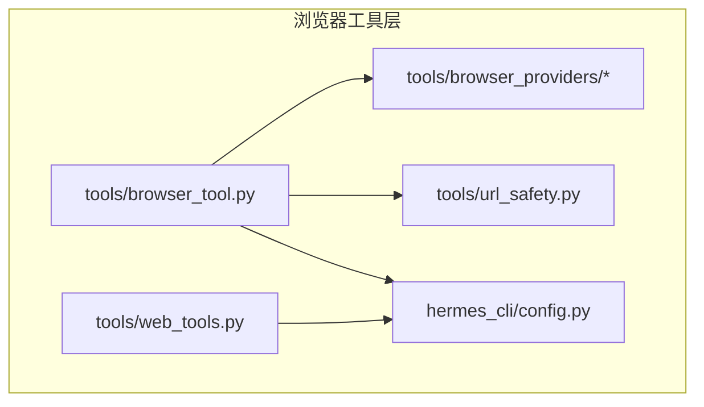
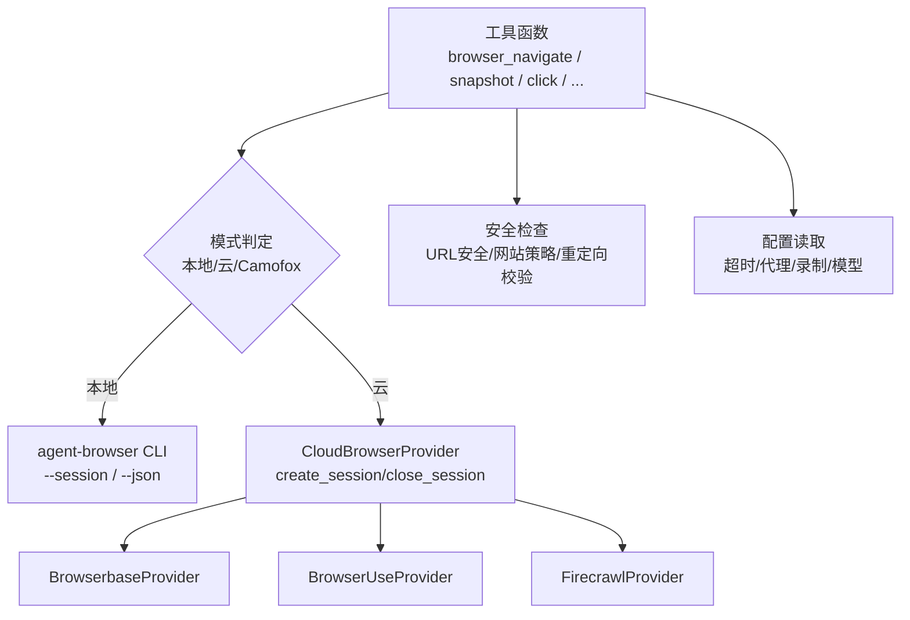
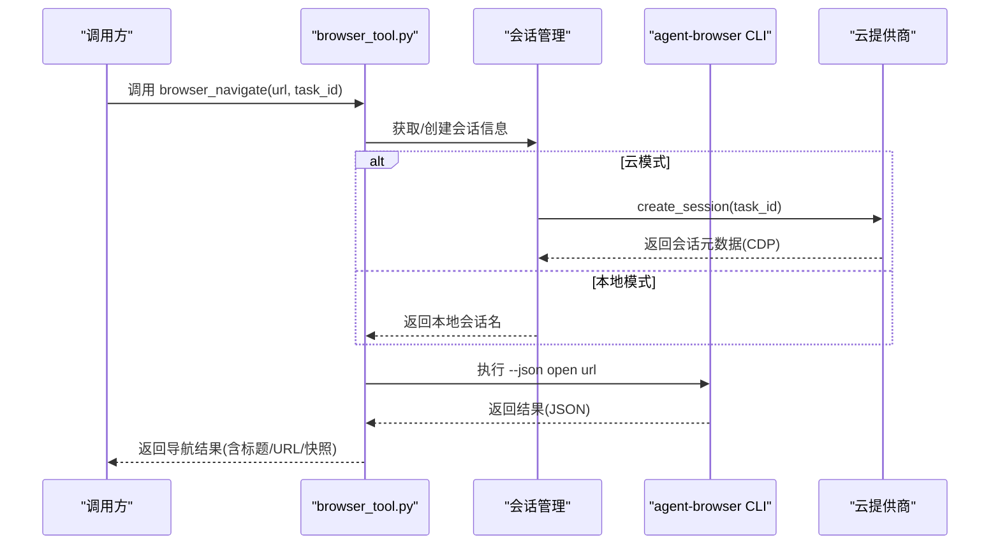
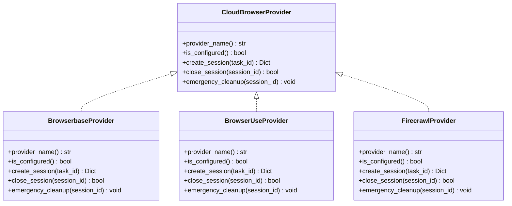
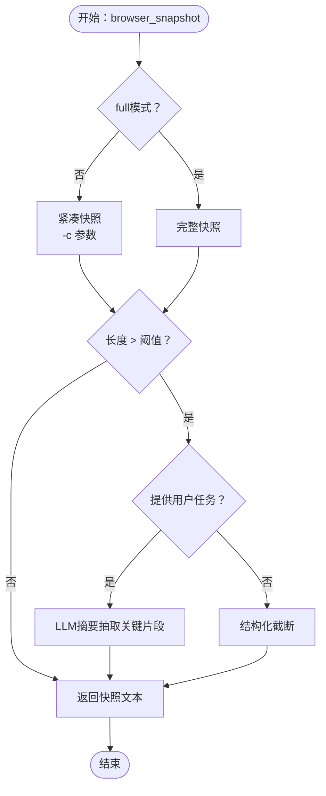
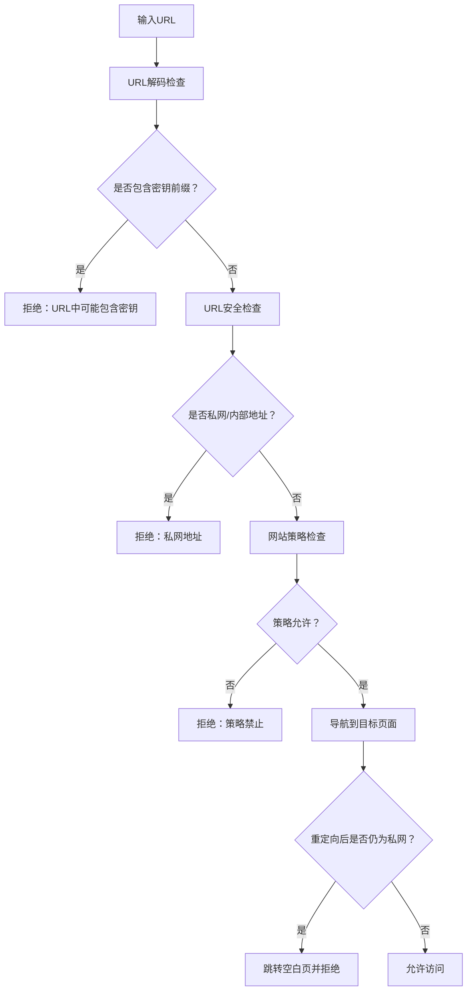
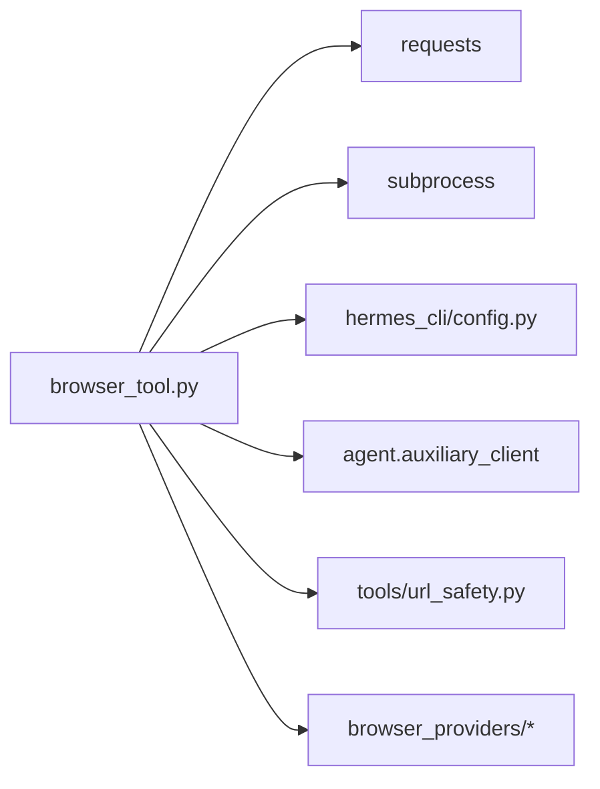

# 浏览器工具

<cite>
**本文引用的文件**
- [tools/browser_tool.py](file://tools/browser_tool.py)
- [tools/browser_providers/base.py](file://tools/browser_providers/base.py)
- [tools/browser_providers/browserbase.py](file://tools/browser_providers/browserbase.py)
- [tools/browser_providers/browser_use.py](file://tools/browser_providers/browser_use.py)
- [tools/browser_providers/firecrawl.py](file://tools/browser_providers/firecrawl.py)
- [tools/web_tools.py](file://tools/web_tools.py)
- [tools/url_safety.py](file://tools/url_safety.py)
- [hermes_cli/config.py](file://hermes_cli/config.py)
</cite>

## 目录
1. [简介](#简介)
2. [项目结构](#项目结构)
3. [核心组件](#核心组件)
4. [架构总览](#架构总览)
5. [详细组件分析](#详细组件分析)
6. [依赖分析](#依赖分析)
7. [性能考虑](#性能考虑)
8. [故障排查指南](#故障排查指南)
9. [结论](#结论)
10. [附录](#附录)

## 简介
本文件面向Hermes Agent的浏览器工具系统，系统性阐述其架构设计与实现细节，覆盖多提供商支持（Browserbase、Browser Use、Firecrawl）、会话管理与页面渲染、浏览器自动化能力（导航、元素交互、截图、数据提取）、安全机制（跨域与私网访问限制、内容安全策略与隐私保护）、性能优化（缓存策略、并发控制、资源管理）以及使用示例与集成指南。目标是帮助开发者与使用者在不同运行环境下稳定、安全、高效地使用浏览器自动化能力。

## 项目结构
浏览器工具模块位于tools目录下，核心入口为browser_tool.py，负责统一调度本地或云端浏览器后端；具体云提供商通过browser_providers子模块实现；配套的网页检索与提取工具位于web_tools.py；安全检查由url_safety.py提供；配置读取与环境变量解析由hermes_cli/config.py提供。

图示来源
- [tools/browser_tool.py:1-120](file://tools/browser_tool.py#L1-L120)
- [tools/browser_providers/base.py:1-60](file://tools/browser_providers/base.py#L1-L60)
- [tools/web_tools.py:1-60](file://tools/web_tools.py#L1-L60)
- [tools/url_safety.py:1-40](file://tools/url_safety.py#L1-L40)
- [hermes_cli/config.py:1-60](file://hermes_cli/config.py#L1-L60)

章节来源
- [tools/browser_tool.py:1-120](file://tools/browser_tool.py#L1-L120)
- [tools/browser_providers/base.py:1-60](file://tools/browser_providers/base.py#L1-L60)
- [tools/web_tools.py:1-60](file://tools/web_tools.py#L1-L60)
- [tools/url_safety.py:1-40](file://tools/url_safety.py#L1-L40)
- [hermes_cli/config.py:1-60](file://hermes_cli/config.py#L1-L60)

## 核心组件
- 统一浏览器工具接口：提供browser_navigate、browser_snapshot、browser_click、browser_type、browser_scroll、browser_back、browser_press、browser_get_images、browser_vision、browser_console等工具函数，封装agent-browser CLI调用与云提供商会话管理。
- 云提供商抽象：CloudBrowserProvider定义统一接口，BrowserbaseProvider、BrowserUseProvider、FirecrawlProvider分别对接对应云服务。
- 会话管理：自动创建/关闭本地或云端会话，支持任务隔离、空闲清理、录制回放、异常退出回收。
- 页面渲染与数据提取：基于agent-browser的可访问性树快照，支持任务感知的内容抽取与截屏视觉分析。
- 安全与合规：URL安全检查（SSRF防护）、网站策略拦截、敏感信息脱敏、重定向二次校验。
- 配置与环境：从配置文件与环境变量读取超时、代理、录制、模型等参数。

章节来源
- [tools/browser_tool.py:657-804](file://tools/browser_tool.py#L657-L804)
- [tools/browser_providers/base.py:7-60](file://tools/browser_providers/base.py#L7-L60)
- [tools/browser_providers/browserbase.py:15-218](file://tools/browser_providers/browserbase.py#L15-L218)
- [tools/browser_providers/browser_use.py:63-216](file://tools/browser_providers/browser_use.py#L63-L216)
- [tools/browser_providers/firecrawl.py:17-108](file://tools/browser_providers/firecrawl.py#L17-L108)

## 架构总览
浏览器工具采用“统一接口 + 多后端适配”的分层架构：
- 工具层：对外暴露标准化工具函数，内部根据当前模式（本地/云）选择执行路径。
- 会话层：负责会话生命周期管理（创建、复用、关闭），并处理后台清理线程。
- 执行层：本地模式通过agent-browser CLI驱动headless Chromium；云模式通过各提供商SDK/HTTP API创建并连接到远端浏览器实例。
- 安全层：前置URL安全检查、网站策略检查、后置敏感信息脱敏与错误降级。
- 配置层：从配置文件与环境变量读取行为参数，支持动态调整。

图示来源
- [tools/browser_tool.py:838-916](file://tools/browser_tool.py#L838-L916)
- [tools/browser_providers/base.py:7-60](file://tools/browser_providers/base.py#L7-L60)
- [tools/browser_providers/browserbase.py:53-161](file://tools/browser_providers/browserbase.py#L53-L161)
- [tools/browser_providers/browser_use.py:120-171](file://tools/browser_providers/browser_use.py#L120-L171)
- [tools/browser_providers/firecrawl.py:45-73](file://tools/browser_providers/firecrawl.py#L45-L73)
- [tools/url_safety.py:51-98](file://tools/url_safety.py#L51-L98)
- [hermes_cli/config.py:1-60](file://hermes_cli/config.py#L1-L60)

## 详细组件分析

### 组件A：浏览器工具统一接口与会话管理
- 任务隔离：每个task_id绑定独立会话，避免状态污染；支持CDP直连覆盖与本地会话两种模式。
- 后台清理：启动独立线程定期扫描空闲会话并关闭；进程退出时进行紧急清理，确保资源回收。
- 命令执行：统一构建agent-browser命令行参数，按需设置socket目录、超时、PATH扩展等；对非JSON输出与空输出进行容错处理。
- 自动录制：根据配置在首次导航时自动开始录制，结束时停止并保存视频文件。
- 资源清理：截图与录制文件按时间阈值清理，防止磁盘膨胀。

图示来源
- [tools/browser_tool.py:1302-1438](file://tools/browser_tool.py#L1302-L1438)
- [tools/browser_tool.py:838-916](file://tools/browser_tool.py#L838-L916)
- [tools/browser_tool.py:1013-1209](file://tools/browser_tool.py#L1013-L1209)

章节来源
- [tools/browser_tool.py:412-474](file://tools/browser_tool.py#L412-L474)
- [tools/browser_tool.py:480-650](file://tools/browser_tool.py#L480-L650)
- [tools/browser_tool.py:838-916](file://tools/browser_tool.py#L838-L916)
- [tools/browser_tool.py:1013-1209](file://tools/browser_tool.py#L1013-L1209)
- [tools/browser_tool.py:1810-1858](file://tools/browser_tool.py#L1810-L1858)
- [tools/browser_tool.py:2143-2244](file://tools/browser_tool.py#L2143-L2244)

### 组件B：云提供商适配器
- 抽象接口：CloudBrowserProvider定义provider_name、is_configured、create_session、close_session、emergency_cleanup等方法。
- BrowserbaseProvider：直接使用API Key与Project ID创建会话，支持代理、高级隐身、keepAlive与自定义超时；对付费特性不可用返回码进行降级重试。
- BrowserUseProvider：支持直接API Key或通过托管网关（Nous订阅）创建会话；对并发创建冲突进行幂等键处理。
- FirecrawlProvider：通过API创建浏览器会话，支持TTL配置。

图示来源
- [tools/browser_providers/base.py:7-60](file://tools/browser_providers/base.py#L7-L60)
- [tools/browser_providers/browserbase.py:15-218](file://tools/browser_providers/browserbase.py#L15-L218)
- [tools/browser_providers/browser_use.py:63-216](file://tools/browser_providers/browser_use.py#L63-L216)
- [tools/browser_providers/firecrawl.py:17-108](file://tools/browser_providers/firecrawl.py#L17-L108)

章节来源
- [tools/browser_providers/base.py:7-60](file://tools/browser_providers/base.py#L7-L60)
- [tools/browser_providers/browserbase.py:26-161](file://tools/browser_providers/browserbase.py#L26-L161)
- [tools/browser_providers/browser_use.py:69-171](file://tools/browser_providers/browser_use.py#L69-L171)
- [tools/browser_providers/firecrawl.py:23-73](file://tools/browser_providers/firecrawl.py#L23-L73)

### 组件C：页面渲染与数据提取流程
- 可访问性树快照：默认紧凑模式仅返回交互元素与引用ID，超过阈值时自动截断或经LLM摘要；支持完整模式返回全文。
- 任务感知抽取：当快照过长且提供用户任务描述时，使用LLM抽取与任务相关的关键片段。
- 截图与视觉分析：持久化截图并通过集中式视觉模型分析，支持标注交互元素以便后续操作。
- 控制台与JS评估：支持读取控制台消息/异常，或在页面上下文中执行表达式以读取状态或提取数据。

图示来源
- [tools/browser_tool.py:1441-1492](file://tools/browser_tool.py#L1441-L1492)
- [tools/browser_tool.py:1211-1296](file://tools/browser_tool.py#L1211-L1296)

章节来源
- [tools/browser_tool.py:1441-1492](file://tools/browser_tool.py#L1441-L1492)
- [tools/browser_tool.py:1211-1296](file://tools/browser_tool.py#L1211-L1296)
- [tools/browser_tool.py:1678-1733](file://tools/browser_tool.py#L1678-L1733)
- [tools/browser_tool.py:1736-1773](file://tools/browser_tool.py#L1736-L1773)

### 组件D：安全机制与隐私保护
- URL安全检查：阻断私有/环回/链路本地/保留地址与CGNAT范围；对内部主机名（如云元数据）强制拦截；DNS失败时拒绝请求。
- 网站策略检查：在导航前调用网站访问策略模块，阻止被策略禁止的站点。
- 重定向二次校验：导航后若发生重定向至私网地址，立即跳转空白页并报错，防止后续快照泄漏内部内容。
- 敏感信息脱敏：在发送给辅助模型前对快照与视觉分析结果进行敏感信息脱敏。
- 私网访问开关：可通过配置允许私网访问，但默认开启SSRF保护。

图示来源
- [tools/browser_tool.py:1313-1381](file://tools/browser_tool.py#L1313-L1381)
- [tools/url_safety.py:51-98](file://tools/url_safety.py#L51-L98)

章节来源
- [tools/browser_tool.py:1313-1381](file://tools/browser_tool.py#L1313-L1381)
- [tools/url_safety.py:39-98](file://tools/url_safety.py#L39-L98)

### 组件E：第三方提供商集成与配置
- Browserbase（直接凭证）
  - 环境变量：BROWSERBASE_API_KEY、BROWSERBASE_PROJECT_ID、BROWSERBASE_BASE_URL（可选）
  - 功能开关：BROWSERBASE_PROXIES（默认true）、BROWSERBASE_ADVANCED_STEALTH（默认false，需Scale计划）、BROWSERBASE_KEEP_ALIVE（默认true，需付费）、BROWSERBASE_SESSION_TIMEOUT（毫秒）
- Browser Use（直接或托管网关）
  - 环境变量：BROWSER_USE_API_KEY（直接）；或通过托管网关（由工具网关解析逻辑决定）
  - 行为：托管模式下默认短超时与代理国家代码
- Firecrawl（浏览器会话）
  - 环境变量：FIRECRAWL_API_KEY、FIRECRAWL_API_URL（自托管）、FIRECRAWL_BROWSER_TTL（默认300秒）
- 通用配置
  - 浏览器命令超时：browser.command_timeout（来自配置文件）
  - 允许私网访问：browser.allow_private_urls（默认false）
  - 录制会话：browser.record_sessions（默认false）

章节来源
- [tools/browser_providers/browserbase.py:33-88](file://tools/browser_providers/browserbase.py#L33-L88)
- [tools/browser_providers/browser_use.py:76-93](file://tools/browser_providers/browser_use.py#L76-L93)
- [tools/browser_providers/firecrawl.py:30-43](file://tools/browser_providers/firecrawl.py#L30-L43)
- [tools/browser_tool.py:178-200](file://tools/browser_tool.py#L178-L200)
- [tools/browser_tool.py:374-392](file://tools/browser_tool.py#L374-L392)
- [hermes_cli/config.py:1-60](file://hermes_cli/config.py#L1-L60)

## 依赖分析
- 模块耦合
  - browser_tool.py对browser_providers的依赖通过注册表与运行时解析，降低编译期耦合。
  - 对外部CLI（agent-browser）与HTTP SDK（requests）的依赖清晰分离，便于替换与测试。
- 外部依赖
  - requests用于云提供商API调用
  - subprocess用于CLI调用，stdout/stderr临时文件避免管道阻塞
  - hermes_cli.config提供配置读取
  - agent.auxiliary_client用于LLM摘要与视觉分析

图示来源
- [tools/browser_tool.py:52-84](file://tools/browser_tool.py#L52-L84)
- [tools/browser_providers/browserbase.py:8](file://tools/browser_providers/browserbase.py#L8)
- [tools/browser_providers/browser_use.py:9](file://tools/browser_providers/browser_use.py#L9)
- [tools/browser_providers/firecrawl.py:8](file://tools/browser_providers/firecrawl.py#L8)

章节来源
- [tools/browser_tool.py:52-84](file://tools/browser_tool.py#L52-L84)
- [tools/browser_providers/browserbase.py:8-12](file://tools/browser_providers/browserbase.py#L8-L12)
- [tools/browser_providers/browser_use.py:9-13](file://tools/browser_providers/browser_use.py#L9-L13)
- [tools/browser_providers/firecrawl.py:8-14](file://tools/browser_providers/firecrawl.py#L8-L14)

## 性能考虑
- 缓存策略
  - LRU缓存CLI发现结果与命令超时配置，减少重复解析开销。
  - 快照阈值与结构化截断，避免大文本传输与LLM成本过高。
- 并发控制
  - 会话活动时间戳与锁保护，避免竞态；后台清理线程周期扫描，避免频繁遍历。
  - 截图清理按目录节流，每小时最多清理一次，降低IO压力。
- 资源管理
  - 进程退出时atexit清理所有会话；守护进程PID文件清理；socket目录与临时文件及时删除。
  - 录制与截图按时间阈值清理，防止磁盘占用无限增长。
- 超时与重试
  - 命令超时可从配置读取，默认30秒；视觉分析超时可配置；对402等付费特性不可用场景进行降级重试。

章节来源
- [tools/browser_tool.py:114-120](file://tools/browser_tool.py#L114-L120)
- [tools/browser_tool.py:178-200](file://tools/browser_tool.py#L178-L200)
- [tools/browser_tool.py:2096-2118](file://tools/browser_tool.py#L2096-L2118)
- [tools/browser_tool.py:2120-2136](file://tools/browser_tool.py#L2120-L2136)
- [tools/browser_tool.py:480-506](file://tools/browser_tool.py#L480-L506)

## 故障排查指南
- agent-browser未找到
  - 症状：提示未安装或找不到CLI
  - 排查：确认已安装agent-browser并加入PATH；Termux需要显式安装而非仅npx回退
- Termux本地模式受限
  - 症状：本地命令被阻止
  - 排查：按提示安装agent-browser全局或本地版本
- 云提供商凭证缺失
  - 症状：云模式无法创建会话
  - 排查：检查BROWSERBASE_API_KEY/BROWSERBASE_PROJECT_ID或BROWSER_USE_API_KEY；托管网关需正确配置
- 私网地址被阻断
  - 症状：导航失败并提示私网地址
  - 排查：确认allow_private_urls配置；必要时调整策略或改用本地模式
- 截图/录制问题
  - 症状：截图文件未生成或路径异常
  - 排查：检查macOS socket路径限制、Chromium安装、守护进程状态；查看日志中的详细错误
- 视觉分析失败
  - 症状：截图成功但LLM分析失败
  - 排查：增大auxiliary.vision.timeout；检查图片大小限制并启用自动缩放

章节来源
- [tools/browser_tool.py:920-990](file://tools/browser_tool.py#L920-L990)
- [tools/browser_tool.py:1313-1381](file://tools/browser_tool.py#L1313-L1381)
- [tools/browser_tool.py:1971-1996](file://tools/browser_tool.py#L1971-L1996)
- [tools/browser_tool.py:2048-2093](file://tools/browser_tool.py#L2048-L2093)

## 结论
Hermes浏览器工具通过统一接口与多提供商适配，实现了在本地与云端环境下的稳定浏览器自动化能力。其会话管理、安全检查与资源清理机制确保了可靠性与安全性；快照与视觉分析结合任务感知抽取提升了信息利用效率。遵循本文的配置与优化建议，可在不同部署环境中获得一致、高效、安全的浏览体验。

## 附录

### 使用示例与集成指南
- 基础用法
  - 导航到页面并获取快照：browser_navigate -> browser_snapshot
  - 点击与输入：browser_click、browser_type
  - 滚动与返回：browser_scroll、browser_back
  - 键盘按键：browser_press
  - 图片提取：browser_get_images
  - 截图与视觉分析：browser_vision（可选标注）
  - 控制台与JS评估：browser_console（可选表达式求值）
- 集成步骤
  - 安装agent-browser并确保可用
  - 配置所需云提供商的API Key与项目ID（或托管网关）
  - 在配置文件中设置超时、录制、模型等参数
  - 在技能或工作流中调用上述工具函数完成端到端任务

章节来源
- [tools/browser_tool.py:657-804](file://tools/browser_tool.py#L657-L804)
- [tools/browser_tool.py:1302-1438](file://tools/browser_tool.py#L1302-L1438)
- [tools/browser_tool.py:1441-1492](file://tools/browser_tool.py#L1441-L1492)
- [tools/browser_tool.py:1495-1566](file://tools/browser_tool.py#L1495-L1566)
- [tools/browser_tool.py:1568-1612](file://tools/browser_tool.py#L1568-L1612)
- [tools/browser_tool.py:1615-1642](file://tools/browser_tool.py#L1615-L1642)
- [tools/browser_tool.py:1645-1672](file://tools/browser_tool.py#L1645-L1672)
- [tools/browser_tool.py:1678-1733](file://tools/browser_tool.py#L1678-L1733)
- [tools/browser_tool.py:1860-1915](file://tools/browser_tool.py#L1860-L1915)
- [tools/browser_tool.py:1918-2093](file://tools/browser_tool.py#L1918-L2093)