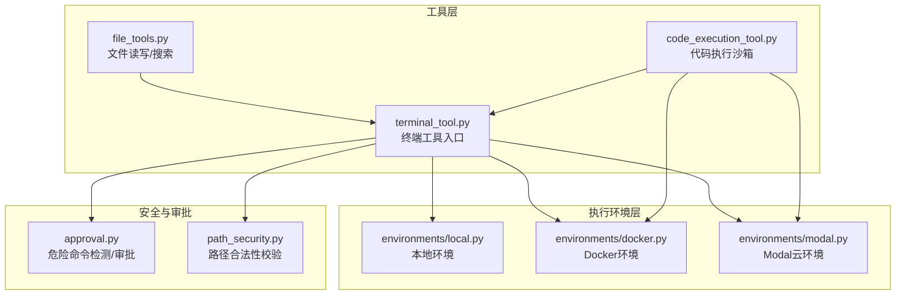
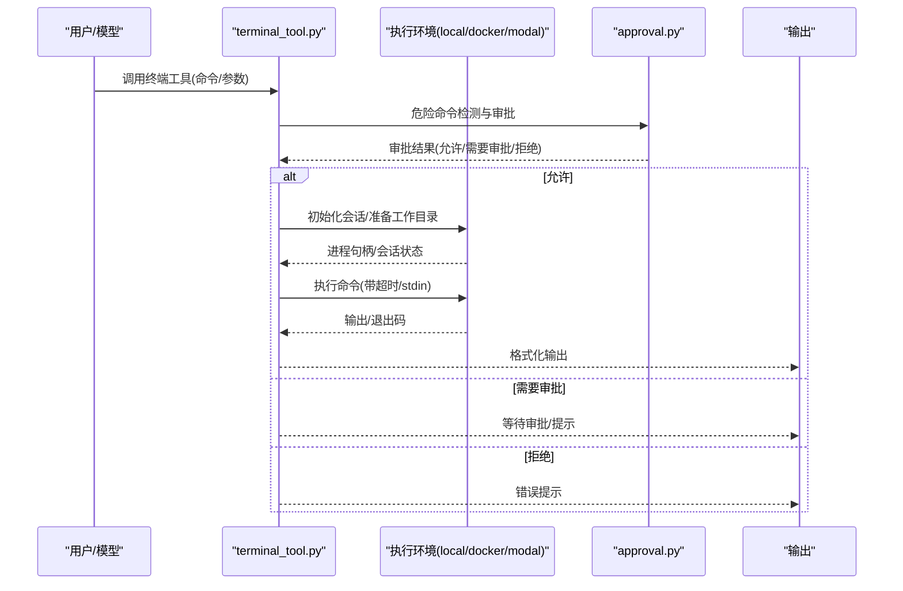
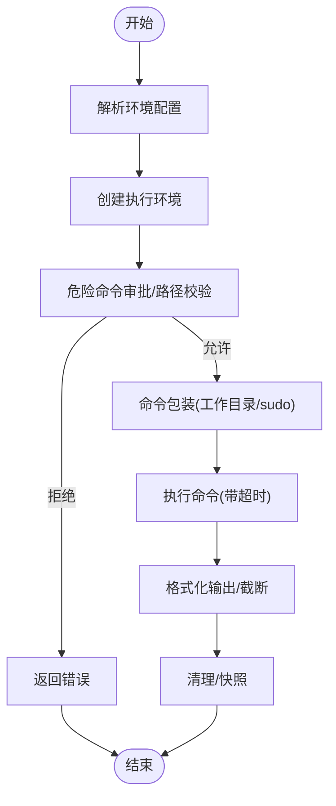
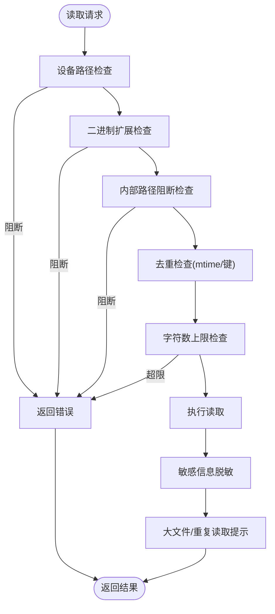
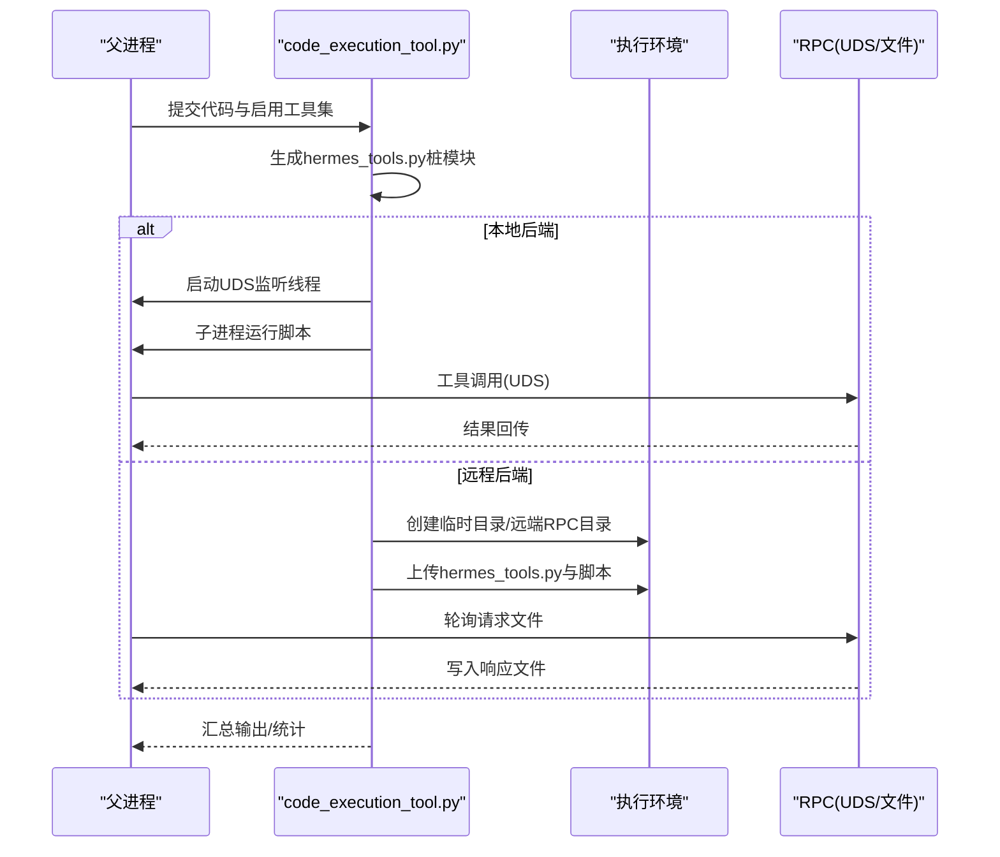
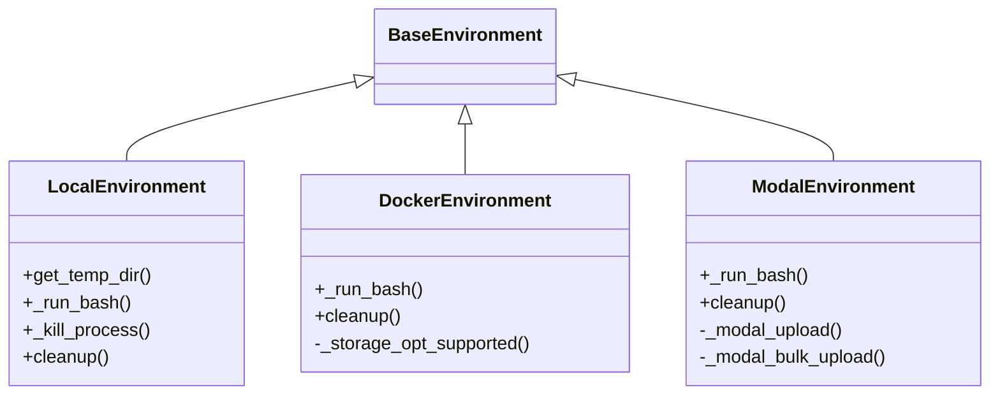
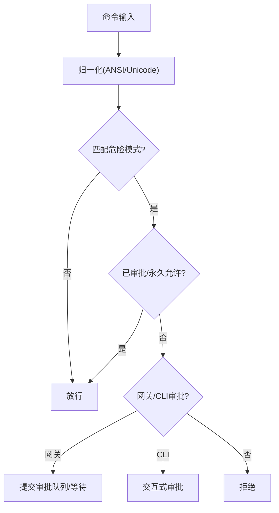
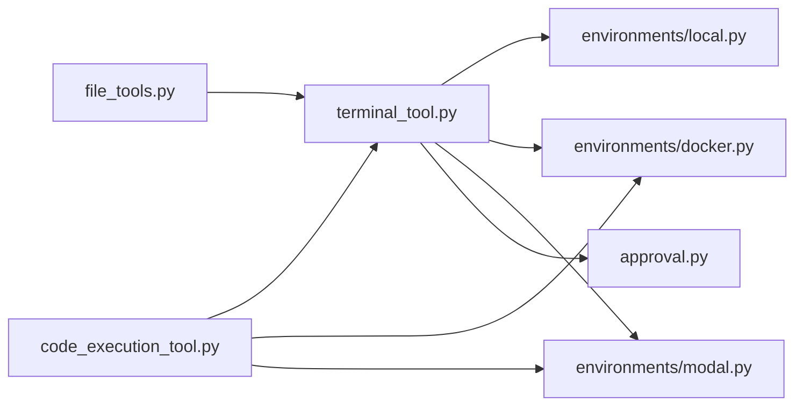

# 终端工具

<cite>
**本文引用的文件**
- [tools/terminal_tool.py](file://tools/terminal_tool.py)
- [tools/code_execution_tool.py](file://tools/code_execution_tool.py)
- [tools/file_tools.py](file://tools/file_tools.py)
- [tools/environments/local.py](file://tools/environments/local.py)
- [tools/environments/docker.py](file://tools/environments/docker.py)
- [tools/environments/modal.py](file://tools/environments/modal.py)
- [tools/approval.py](file://tools/approval.py)
- [tools/path_security.py](file://tools/path_security.py)
- [tests/tools/test_daytona_environment.py](file://tests/tools/test_daytona_environment.py)
</cite>

## 目录
1. [简介](#简介)
2. [项目结构](#项目结构)
3. [核心组件](#核心组件)
4. [架构总览](#架构总览)
5. [详细组件分析](#详细组件分析)
6. [依赖分析](#依赖分析)
7. [性能考虑](#性能考虑)
8. [故障排除指南](#故障排除指南)
9. [结论](#结论)
10. [附录：使用示例与最佳实践](#附录使用示例与最佳实践)

## 简介
本文件面向Hermes Agent的终端工具系统，系统性阐述其设计与实现，覆盖命令执行流程、安全沙箱机制（含危险命令审批、路径校验、环境隔离）、输出处理与资源限制策略，并给出文件操作、系统命令、网络工具等使用建议与安全最佳实践。文档同时提供关键流程的可视化图示与排障指引，帮助开发者与使用者在保证安全的前提下高效使用终端能力。

## 项目结构
终端工具体系由“工具层”“执行环境层”“安全与审批层”三部分组成：
- 工具层：终端工具、文件工具、代码执行工具等对外接口与参数校验
- 执行环境层：本地、Docker、Modal等后端的容器化/云沙箱执行环境
- 安全与审批层：危险命令检测、会话级审批、路径合法性校验、敏感路径阻断

图表来源
- [tools/terminal_tool.py:598-800](file://tools/terminal_tool.py#L598-L800)
- [tools/file_tools.py:152-270](file://tools/file_tools.py#L152-L270)
- [tools/code_execution_tool.py:431-528](file://tools/code_execution_tool.py#L431-L528)
- [tools/environments/local.py:216-315](file://tools/environments/local.py#L216-L315)
- [tools/environments/docker.py:235-579](file://tools/environments/docker.py#L235-L579)
- [tools/environments/modal.py:147-435](file://tools/environments/modal.py#L147-L435)
- [tools/approval.py:587-661](file://tools/approval.py#L587-L661)
- [tools/path_security.py:15-44](file://tools/path_security.py#L15-L44)

章节来源
- [tools/terminal_tool.py:598-800](file://tools/terminal_tool.py#L598-L800)
- [tools/file_tools.py:152-270](file://tools/file_tools.py#L152-L270)
- [tools/code_execution_tool.py:431-528](file://tools/code_execution_tool.py#L431-L528)
- [tools/environments/local.py:216-315](file://tools/environments/local.py#L216-L315)
- [tools/environments/docker.py:235-579](file://tools/environments/docker.py#L235-L579)
- [tools/environments/modal.py:147-435](file://tools/environments/modal.py#L147-L435)
- [tools/approval.py:587-661](file://tools/approval.py#L587-L661)
- [tools/path_security.py:15-44](file://tools/path_security.py#L15-L44)

## 核心组件
- 终端工具（terminal_tool）：统一的命令执行入口，支持本地、Docker、Modal等多种后端；内置超时、工作目录、持久化、sudo处理、危险命令审批等能力。
- 文件工具（file_tools）：封装文件读取、写入、补丁编辑与内容/文件名搜索；具备设备路径阻断、二进制文件拦截、敏感路径保护、重复读取去重与过量字符限制等安全策略。
- 代码执行工具（code_execution_tool）：在沙箱中运行用户脚本，通过Unix域套接字或远程文件传输实现工具调用代理，限制工具调用次数与输出大小，保障结果仅返回标准输出。
- 执行环境（environments）：本地、Docker、Modal等环境抽象，负责进程启动、stdin/stdout管理、资源限制、文件同步与快照持久化。
- 审批与安全（approval、path_security）：危险命令模式匹配与会话级审批；路径解析与遍历检查，防止越权访问。

章节来源
- [tools/terminal_tool.py:512-531](file://tools/terminal_tool.py#L512-L531)
- [tools/file_tools.py:282-449](file://tools/file_tools.py#L282-L449)
- [tools/code_execution_tool.py:1-120](file://tools/code_execution_tool.py#L1-L120)
- [tools/environments/local.py:216-315](file://tools/environments/local.py#L216-L315)
- [tools/environments/docker.py:235-579](file://tools/environments/docker.py#L235-L579)
- [tools/environments/modal.py:147-435](file://tools/environments/modal.py#L147-L435)
- [tools/approval.py:587-661](file://tools/approval.py#L587-L661)
- [tools/path_security.py:15-44](file://tools/path_security.py#L15-L44)

## 架构总览
终端工具的执行链路从“工具层”进入“环境层”，在“安全与审批层”的多重守卫下完成命令执行与结果回传。代码执行工具在本地或远端环境中以沙箱方式运行脚本，通过RPC将工具调用转发至父进程处理。

图表来源
- [tools/terminal_tool.py:144-148](file://tools/terminal_tool.py#L144-L148)
- [tools/approval.py:587-661](file://tools/approval.py#L587-L661)
- [tools/environments/local.py:254-276](file://tools/environments/local.py#L254-L276)
- [tools/environments/docker.py:488-509](file://tools/environments/docker.py#L488-L509)
- [tools/environments/modal.py:368-400](file://tools/environments/modal.py#L368-L400)

## 详细组件分析

### 终端工具（terminal_tool）
- 功能要点
  - 多后端选择：local、docker、singularity、modal、daytona、ssh
  - 环境生命周期管理：按任务ID复用/清理、后台清理线程、会话快照
  - sudo处理：自动将sudo替换为非交互式输入，支持缓存密码与交互式提示
  - 危险命令审批：集中检测与会话级审批，支持网关异步审批
  - 工作目录与路径安全：白名单字符校验、相对路径/主机路径处理
  - 资源与超时：前台最大超时、后端超时、磁盘用量告警
- 关键流程
  - 环境配置解析与创建
  - 命令预处理（sudo改写、工作目录包装）
  - 执行与输出处理（合并stdout/stderr、截断、转义）
  - 清理与持久化（会话快照、容器/沙箱清理）

图表来源
- [tools/terminal_tool.py:598-674](file://tools/terminal_tool.py#L598-L674)
- [tools/terminal_tool.py:686-800](file://tools/terminal_tool.py#L686-L800)
- [tools/terminal_tool.py:144-148](file://tools/terminal_tool.py#L144-L148)
- [tools/terminal_tool.py:445-499](file://tools/terminal_tool.py#L445-L499)

章节来源
- [tools/terminal_tool.py:598-800](file://tools/terminal_tool.py#L598-L800)

### 文件工具（file_tools）
- 功能要点
  - 设备路径阻断：禁止读取无限输出/阻塞输入的设备节点
  - 二进制文件拦截：基于扩展名判断，避免误读二进制
  - 敏感路径保护：禁止直接写入系统关键路径
  - 重复读取去重：基于mtime与键值缓存，避免上下文浪费
  - 字符数上限：超过阈值拒绝，引导分页读取
  - 搜索与补丁：基于ripgrep的高效搜索与模糊替换
- 关键流程
  - 读取前安全检查（设备/二进制/内部路径）
  - 去重与字符数限制
  - 写入/补丁前的路径与时间戳校验
  - 返回结果与可选警告/提示

图表来源
- [tools/file_tools.py:282-449](file://tools/file_tools.py#L282-L449)
- [tools/file_tools.py:541-619](file://tools/file_tools.py#L541-L619)
- [tools/file_tools.py:622-687](file://tools/file_tools.py#L622-L687)

章节来源
- [tools/file_tools.py:282-687](file://tools/file_tools.py#L282-L687)

### 代码执行工具（code_execution_tool）
- 功能要点
  - 本地后端：Unix域套接字RPC，子进程接收工具调用并回传结果
  - 远程后端：文件型RPC，请求/响应文件轮询，避免stdin不可靠问题
  - 工具白名单：仅允许有限工具进入沙箱，防止任意命令执行
  - 资源限制：超时、工具调用次数上限、输出大小限制
  - 环境隔离：复用终端环境配置，支持容器/云沙箱
- 关键流程
  - 生成hermes_tools.py桩模块（按可用工具筛选）
  - 本地：启动RPC监听线程；远程：在远端创建临时目录与RPC目录
  - 执行脚本并轮询响应文件/套接字，记录调用日志
  - 收敛结果并清理

图表来源
- [tools/code_execution_tool.py:130-163](file://tools/code_execution_tool.py#L130-L163)
- [tools/code_execution_tool.py:307-425](file://tools/code_execution_tool.py#L307-L425)
- [tools/code_execution_tool.py:564-704](file://tools/code_execution_tool.py#L564-L704)
- [tools/code_execution_tool.py:706-800](file://tools/code_execution_tool.py#L706-L800)

章节来源
- [tools/code_execution_tool.py:1-800](file://tools/code_execution_tool.py#L1-L800)

### 执行环境（environments）
- 本地环境（local）
  - 进程组管理、会话快照、HOME隔离、最小PATH构建、敏感环境变量过滤
- Docker环境（docker）
  - 安全参数（capabilities drop、no-new-privileges、PID限制）、tmpfs、资源限制、持久化挂载、凭据与技能目录挂载
- Modal环境（modal）
  - 异步事件循环、文件同步管理、快照保存与恢复、stdin分块上传

图表来源
- [tools/environments/local.py:216-315](file://tools/environments/local.py#L216-L315)
- [tools/environments/docker.py:235-579](file://tools/environments/docker.py#L235-L579)
- [tools/environments/modal.py:147-435](file://tools/environments/modal.py#L147-L435)

章节来源
- [tools/environments/local.py:216-315](file://tools/environments/local.py#L216-L315)
- [tools/environments/docker.py:235-579](file://tools/environments/docker.py#L235-L579)
- [tools/environments/modal.py:147-435](file://tools/environments/modal.py#L147-L435)

### 审批与安全（approval、path_security）
- 危险命令检测：正则模式集合覆盖删除、权限修改、服务控制、脚本执行、数据库操作、fork炸弹等
- 会话级审批：支持一次性、会话级、永久允许与拒绝；网关异步审批队列；智能审批（辅助LLM风险评估）
- 路径安全：解析路径并相对根目录校验，阻断路径遍历；快速判定含“..”组件

图表来源
- [tools/approval.py:187-199](file://tools/approval.py#L187-L199)
- [tools/approval.py:587-661](file://tools/approval.py#L587-L661)
- [tools/approval.py:694-800](file://tools/approval.py#L694-L800)
- [tools/path_security.py:15-44](file://tools/path_security.py#L15-L44)

章节来源
- [tools/approval.py:587-800](file://tools/approval.py#L587-L800)
- [tools/path_security.py:15-44](file://tools/path_security.py#L15-L44)

## 依赖分析
- 组件耦合
  - terminal_tool依赖environments与approval；file_tools依赖terminal_tool的环境；code_execution_tool依赖terminal_tool的环境与RPC机制
  - environments之间低耦合，通过BaseEnvironment统一接口
- 外部依赖
  - Docker CLI/Podman、Modal SDK、异步事件循环（Modal）
- 潜在环路
  - 工具层与环境层单向依赖，未见循环导入

图表来源
- [tools/terminal_tool.py:502-510](file://tools/terminal_tool.py#L502-L510)
- [tools/file_tools.py:162-167](file://tools/file_tools.py#L162-L167)
- [tools/code_execution_tool.py:438-442](file://tools/code_execution_tool.py#L438-L442)

章节来源
- [tools/terminal_tool.py:502-510](file://tools/terminal_tool.py#L502-L510)
- [tools/file_tools.py:162-167](file://tools/file_tools.py#L162-L167)
- [tools/code_execution_tool.py:438-442](file://tools/code_execution_tool.py#L438-L442)

## 性能考虑
- 超时与并发
  - 前台命令硬上限与后端超时分离，避免长时间阻塞
  - Modal使用独立事件循环与批量上传，降低I/O阻塞
- I/O与存储
  - Docker默认tmpfs写盘，减少磁盘抖动；持久化模式使用bind mount
  - Modal文件同步采用tar打包与分块stdin，规避ARG_MAX限制
- 上下文与带宽
  - 文件读取字符数上限与重复读取去重，减少上下文窗口压力
  - 代码执行工具对stdout/stderr进行大小限制，避免大输出污染

章节来源
- [tools/terminal_tool.py:75-79](file://tools/terminal_tool.py#L75-L79)
- [tools/environments/docker.py:282-296](file://tools/environments/docker.py#L282-L296)
- [tools/environments/modal.py:306-348](file://tools/environments/modal.py#L306-L348)
- [tools/file_tools.py:28-52](file://tools/file_tools.py#L28-L52)
- [tools/code_execution_tool.py:67-71](file://tools/code_execution_tool.py#L67-L71)

## 故障排除指南
- 常见问题与定位
  - Docker不可用：检查CLI是否存在、版本是否成功返回、守护进程状态
  - Modal连接失败：确认SDK可用、应用存在、镜像解析正确、快照恢复降级
  - 代码执行失败：确认平台支持（Windows禁用）、远端Python可用、RPC目录权限
  - 危险命令被拒：查看审批模式与会话状态，必要时调整配置或通过审批
  - 文件读取异常：检查设备路径、二进制扩展、内部路径阻断、字符数限制
- 排查步骤
  - 查看环境变量与后端配置（TERMINAL_ENV、TERMINAL_TIMEOUT等）
  - 使用测试用例验证命令包装与stdin heredoc行为（参考Daytona测试）
  - 检查磁盘用量与清理策略，避免宿主空间不足

章节来源
- [tools/environments/docker.py:169-233](file://tools/environments/docker.py#L169-L233)
- [tools/environments/modal.py:223-263](file://tools/environments/modal.py#L223-L263)
- [tools/code_execution_tool.py:743-758](file://tools/code_execution_tool.py#L743-L758)
- [tests/tools/test_daytona_environment.py:221-319](file://tests/tools/test_daytona_environment.py#L221-L319)

## 结论
Hermes Agent的终端工具系统通过“工具层—环境层—安全层”的清晰分层，实现了跨本地与云端的命令执行、文件操作与代码执行沙箱。其安全策略覆盖危险命令检测、会话级审批、路径合法性与环境变量过滤，配合资源限制与输出截断，有效平衡了易用性与安全性。建议在生产中结合审批模式、持久化策略与监控告警，持续优化执行体验与安全基线。

## 附录：使用示例与最佳实践

### 使用示例
- 在本地执行命令
  - 设置TERMINAL_ENV=local，直接调用终端工具执行命令
  - 参考：[tools/terminal_tool.py:598-674](file://tools/terminal_tool.py#L598-L674)
- 在Docker中执行并持久化
  - 设置TERMINAL_ENV=docker，开启持久化文件系统，执行后自动清理或保留
  - 参考：[tools/environments/docker.py:235-579](file://tools/environments/docker.py#L235-L579)
- 在Modal中执行并快照
  - 设置TERMINAL_ENV=modal，首次创建沙盒并保存快照，后续可恢复
  - 参考：[tools/environments/modal.py:147-435](file://tools/environments/modal.py#L147-L435)
- 通过代码执行工具运行脚本
  - 生成hermes_tools.py桩模块，本地通过UDS或远端通过文件RPC调用工具
  - 参考：[tools/code_execution_tool.py:130-163](file://tools/code_execution_tool.py#L130-L163)

### 最佳实践
- 命令注入防护
  - 使用工具提供的命令包装与转义函数，避免直接拼接用户输入
  - 对sudo命令统一改写为非交互式输入，避免阻塞
  - 参考：[tools/terminal_tool.py:445-499](file://tools/terminal_tool.py#L445-L499)
- 资源消耗控制
  - 明确设置TERMINAL_TIMEOUT与容器资源（CPU/内存/磁盘），避免长耗时任务影响系统
  - 参考：[tools/terminal_tool.py:674-674](file://tools/terminal_tool.py#L674-L674)，[tools/environments/docker.py:282-296](file://tools/environments/docker.py#L282-L296)
- 错误处理策略
  - 对设备路径、二进制文件、内部路径进行前置阻断
  - 对重复读取与超限读取给出明确提示，引导分页读取
  - 参考：[tools/file_tools.py:282-449](file://tools/file_tools.py#L282-L449)