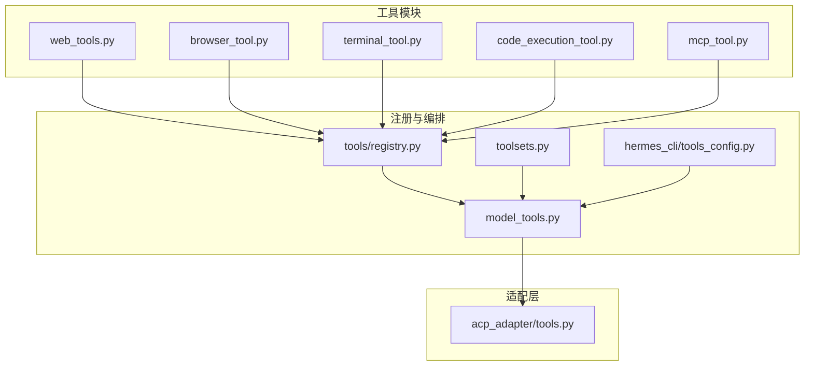
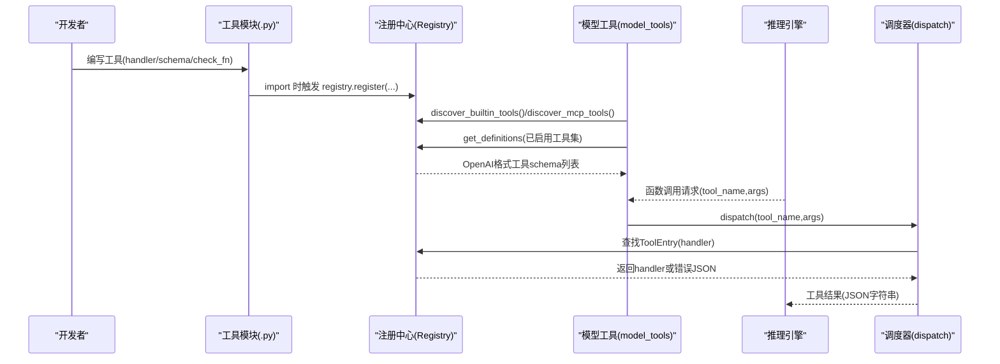
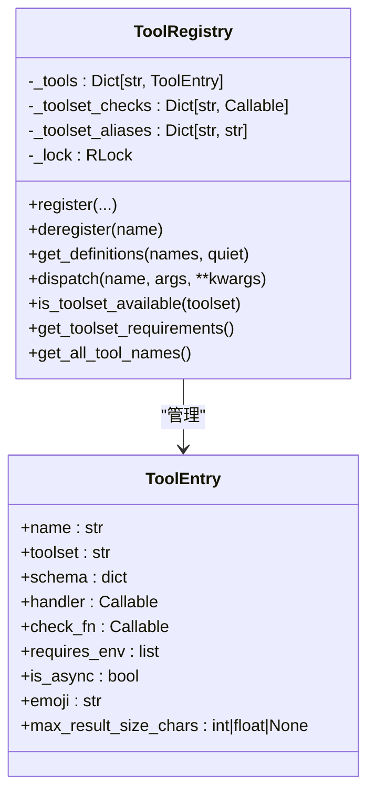
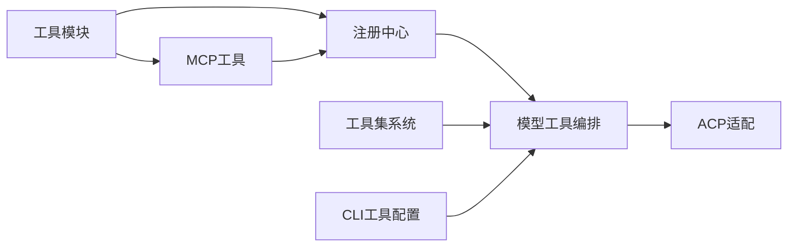

# 自定义工具开发

<cite>
**本文档引用的文件**
- [tools/registry.py](file://tools/registry.py)
- [tools/__init__.py](file://tools/__init__.py)
- [toolsets.py](file://toolsets.py)
- [model_tools.py](file://model_tools.py)
- [hermes_cli/tools_config.py](file://hermes_cli/tools_config.py)
- [tools/web_tools.py](file://tools/web_tools.py)
- [tools/browser_tool.py](file://tools/browser_tool.py)
- [tools/terminal_tool.py](file://tools/terminal_tool.py)
- [tools/code_execution_tool.py](file://tools/code_execution_tool.py)
- [tools/mcp_tool.py](file://tools/mcp_tool.py)
- [acp_adapter/tools.py](file://acp_adapter/tools.py)
- [tests/tools/test_registry.py](file://tests/tools/test_registry.py)
- [tests/tools/test_mcp_dynamic_discovery.py](file://tests/tools/test_mcp_dynamic_discovery.py)
- [website/docs/developer-guide/adding-tools.md](file://website/docs/developer-guide/adding-tools.md)
</cite>

## 目录
1. [简介](#简介)
2. [项目结构](#项目结构)
3. [核心组件](#核心组件)
4. [架构总览](#架构总览)
5. [详细组件分析](#详细组件分析)
6. [依赖分析](#依赖分析)
7. [性能考虑](#性能考虑)
8. [故障排除指南](#故障排除指南)
9. [结论](#结论)
10. [附录](#附录)

## 简介
本指南面向希望在 Hermes Agent 中开发自定义工具的开发者，系统讲解工具开发的完整流程：从接口规范、参数与返回值格式，到工具注册机制（schema 定义、handler 实现、可用性检查），再到最佳实践（错误处理、日志记录、性能优化）、测试策略（单元测试、集成测试、安全测试）以及部署与分发。文档同时提供简单工具与复杂工具的开发示例路径，并给出可操作的步骤说明。

## 项目结构
Hermes 的工具体系由“工具模块 + 注册中心 + 工具集 + 调用编排”四部分组成：
- 工具模块：每个工具文件遵循统一结构，定义 handler、schema、check_fn、requires_env 等元数据，并通过注册中心完成自注册。
- 注册中心：集中管理工具元数据、可用性检查、动态刷新、异步桥接等。
- 工具集：对工具进行分组与组合，支持平台维度的启用控制。
- 调用编排：在推理前生成工具 schema 列表，在调用时根据名称路由到对应 handler。

图表来源
- [tools/registry.py:100-437](file://tools/registry.py#L100-L437)
- [toolsets.py:66-397](file://toolsets.py#L66-L397)
- [model_tools.py:29-146](file://model_tools.py#L29-L146)
- [hermes_cli/tools_config.py:44-111](file://hermes_cli/tools_config.py#L44-L111)
- [acp_adapter/tools.py:1-215](file://acp_adapter/tools.py#L1-L215)

章节来源
- [tools/registry.py:1-483](file://tools/registry.py#L1-L483)
- [toolsets.py:1-703](file://toolsets.py#L1-L703)
- [model_tools.py:1-200](file://model_tools.py#L1-L200)
- [hermes_cli/tools_config.py:1-800](file://hermes_cli/tools_config.py#L1-L800)

## 核心组件
- 工具注册中心（ToolRegistry）
  - 提供 register/deregister、get_definitions、dispatch、可用性检查、工具集映射等能力。
  - 支持异步 handler 的同步桥接，保证缓存客户端生命周期稳定。
- 工具集系统（toolsets）
  - 将工具按场景组合成 toolset，支持静态定义与插件动态扩展，支持别名与递归解析。
- 模型工具编排（model_tools）
  - 触发工具发现、聚合 schema、执行工具调用、维护工具集映射与要求。
- CLI 工具配置（hermes_cli/tools_config）
  - 提供工具集选择界面、提供商配置、环境变量要求、后置安装脚本等。
- ACP 适配（acp_adapter/tools）
  - 将 Hermes 工具映射为 ACP ToolKind，构建事件内容，支持标题与位置提取。

章节来源
- [tools/registry.py:100-437](file://tools/registry.py#L100-L437)
- [toolsets.py:401-588](file://toolsets.py#L401-L588)
- [model_tools.py:196-200](file://model_tools.py#L196-L200)
- [hermes_cli/tools_config.py:44-111](file://hermes_cli/tools_config.py#L44-L111)
- [acp_adapter/tools.py:1-215](file://acp_adapter/tools.py#L1-L215)

## 架构总览
工具从“模块自注册”到“推理调用”的端到端流程如下：

图表来源
- [model_tools.py:132-146](file://model_tools.py#L132-L146)
- [tools/registry.py:292-310](file://tools/registry.py#L292-L310)

章节来源
- [model_tools.py:128-200](file://model_tools.py#L128-L200)
- [tools/registry.py:176-310](file://tools/registry.py#L176-L310)

## 详细组件分析

### 组件A：工具注册中心（ToolRegistry）
- 职责
  - 接收工具模块的注册调用，保存 schema、handler、check_fn、requires_env、emoji 等元数据。
  - 提供 get_definitions 过滤不可用工具；dispatch 执行工具并统一封装异常。
  - 支持工具集别名、动态 MCP 刷新、线程安全快照。
- 关键点
  - 注册冲突保护：内置工具与 MCP 工具允许同名覆盖（用于服务器刷新），否则拒绝影子覆盖。
  - 可用性检查：check_fn 失败则工具不参与 schema 输出；异常视为不可用。
  - 异步桥接：自动检测运行循环，避免“事件循环已关闭”问题；工作线程使用独立 loop。
  - 结果大小限制：支持 per-tool 最大结果字符数配置，配合预算配置使用。

图表来源
- [tools/registry.py:76-225](file://tools/registry.py#L76-L225)

章节来源
- [tools/registry.py:100-437](file://tools/registry.py#L100-L437)

### 组件B：工具集系统（toolsets）
- 职责
  - 定义工具集（如 web、terminal、browser、file、vision 等）及其包含的工具或其它工具集。
  - 支持复合工具集解析（递归展开 includes），支持别名与插件动态注册工具集。
- 关键点
  - get_toolset/resolve_toolset 提供静态与动态工具集查询与解析。
  - validate_toolset 支持校验工具集名称有效性（含别名）。
  - create_custom_toolset 允许运行时创建自定义工具集。

章节来源
- [toolsets.py:66-397](file://toolsets.py#L66-L397)
- [toolsets.py:401-588](file://toolsets.py#L401-L588)

### 组件C：模型工具编排（model_tools）
- 职责
  - 触发工具发现（内置与 MCP），聚合 schema，执行工具调用，维护工具集映射。
  - 提供异步桥接函数，确保缓存客户端生命周期稳定。
- 关键点
  - discover_builtin_tools + discover_mcp_tools 启动工具发现。
  - get_tool_definitions 支持启用/禁用工具集过滤，生成 OpenAI 格式 schema。
  - _run_async 在主线程与工作线程分别维护长生命周期事件循环。

章节来源
- [model_tools.py:128-200](file://model_tools.py#L128-L200)

### 组件D：CLI 工具配置（hermes_cli/tools_config）
- 职责
  - 提供工具集选择清单、提供商选择（如 Web 搜索、TTS、浏览器云服务等）、API 密钥配置。
  - 计算工具 schema 的 token 预估，支持后置安装脚本（如 npm 安装浏览器依赖）。
- 关键点
  - CONFIGURABLE_TOOLSETS 定义可配置工具集与描述。
  - TOOL_CATEGORIES 映射工具集到提供商与环境变量要求。
  - _estimate_tool_tokens 使用 cl100k_base 对 schema 进行 token 估算。

章节来源
- [hermes_cli/tools_config.py:44-111](file://hermes_cli/tools_config.py#L44-L111)
- [hermes_cli/tools_config.py:118-376](file://hermes_cli/tools_config.py#L118-L376)
- [hermes_cli/tools_config.py:699-738](file://hermes_cli/tools_config.py#L699-L738)

### 组件E：ACP 适配（acp_adapter/tools）
- 职责
  - 将 Hermes 工具名映射为 ACP ToolKind（read/edit/search/execute/fetch/think 等）。
  - 构建 ToolCallStart/ToolCallProgress 事件内容，支持标题与位置提取。
- 关键点
  - build_tool_start/build_tool_complete 生成 ACP 事件负载，限制 UI 展示结果长度。
  - extract_locations 从参数中抽取文件路径与行号。

章节来源
- [acp_adapter/tools.py:1-215](file://acp_adapter/tools.py#L1-L215)

### 组件F：工具实现示例（web/browser/terminal/code_execution）
- 网络工具（web_tools）
  - 支持多后端（Firecrawl、Exa、Parallel、Tavily），自动选择与回退，支持托管网关。
  - 提供搜索、提取、抓取等工具函数，具备调试模式与网站策略检查。
- 浏览器工具（browser_tool）
  - 支持本地 Chromium、Browserbase、Browser Use、Firecrawl 等后端，统一行为。
  - 基于无障碍树的文本页面表示，支持会话隔离与清理。
- 终端工具（terminal_tool）
  - 支持本地、Docker、Modal、SSH、Singularity 等执行环境，背景任务、危险命令审批、磁盘用量告警。
- 程序化工具调用（code_execution_tool）
  - 通过 UDS 或文件传输在沙箱内执行 Python 脚本，减少 LLM 循环次数，限制资源消耗。

章节来源
- [tools/web_tools.py:1-200](file://tools/web_tools.py#L1-L200)
- [tools/browser_tool.py:1-200](file://tools/browser_tool.py#L1-L200)
- [tools/terminal_tool.py:1-200](file://tools/terminal_tool.py#L1-L200)
- [tools/code_execution_tool.py:1-200](file://tools/code_execution_tool.py#L1-L200)

### 组件G：MCP 工具接入（tools/mcp_tool）
- 职责
  - 通过 stdio 或 HTTP/StreamableHTTP 连接外部 MCP 服务器，动态发现工具并注册到注册中心。
  - 支持重连、超时、环境变量过滤、凭证清洗、采样（sampling）与通知（tools/list_changed）。
- 关键点
  - _MCP_AVAILABLE 控制可选依赖加载；线程安全的后台事件循环。
  - _build_safe_env 仅传递安全环境变量，提升安全性。

章节来源
- [tools/mcp_tool.py:1-200](file://tools/mcp_tool.py#L1-L200)

## 依赖分析
- 模块耦合
  - 工具模块仅在导入时通过 registry.register() 与注册中心交互，避免循环导入。
  - model_tools 作为编排层，依赖注册中心与工具集系统，不直接依赖具体工具实现。
  - hermes_cli/tools_config 依赖注册中心以获取工具集信息与提供商配置。
- 外部依赖
  - MCP 客户端（mcp 包）为可选依赖，未安装时模块降级为无操作。
  - tiktoken 用于工具 schema 的 token 估算（可选）。

图表来源
- [model_tools.py:29-146](file://model_tools.py#L29-L146)
- [hermes_cli/tools_config.py:44-111](file://hermes_cli/tools_config.py#L44-L111)
- [tools/mcp_tool.py:91-138](file://tools/mcp_tool.py#L91-L138)

章节来源
- [model_tools.py:128-200](file://model_tools.py#L128-L200)
- [hermes_cli/tools_config.py:44-111](file://hermes_cli/tools_config.py#L44-L111)
- [tools/mcp_tool.py:91-138](file://tools/mcp_tool.py#L91-L138)

## 性能考虑
- 工具发现与 token 估算
  - 首次调用会触发全量工具发现与 tiktoken 编码，后续进程内缓存结果，避免重复开销。
- 异步桥接
  - 为避免“事件循环已关闭”，采用持久事件循环并在工作线程中各自持有 loop，减少 GC 期间的 RuntimeError。
- 结果截断与预算
  - ACP 事件展示结果限制长度；注册中心支持 per-tool 最大结果字符数，结合全局预算配置控制输出规模。
- 并发与锁
  - 注册中心使用可重入锁保护状态变更，读操作返回稳定快照，降低竞争条件。

章节来源
- [model_tools.py:44-125](file://model_tools.py#L44-L125)
- [tools/registry.py:112-134](file://tools/registry.py#L112-L134)
- [acp_adapter/tools.py:185-197](file://acp_adapter/tools.py#L185-L197)

## 故障排除指南
- 工具不可见
  - 检查 check_fn 是否返回 False 或抛出异常；确认工具是否被注册且未被 MCP 覆盖。
- 工具调用失败
  - 查看 dispatch 返回的 JSON 错误；关注异常捕获与日志记录。
- MCP 工具未生效
  - 确认 mcp 包已安装；检查服务器连接超时、重连次数与环境变量过滤。
- CLI 工具配置问题
  - 使用 hermes tools 选择工具集与提供商，确保所需环境变量已设置；必要时运行后置安装脚本。

章节来源
- [tests/tools/test_registry.py:115-121](file://tests/tools/test_registry.py#L115-L121)
- [tests/tools/test_mcp_dynamic_discovery.py:130-160](file://tests/tools/test_mcp_dynamic_discovery.py#L130-L160)
- [tools/mcp_tool.py:91-138](file://tools/mcp_tool.py#L91-L138)

## 结论
Hermes 的工具体系以“模块自注册 + 注册中心 + 工具集 + 编排层”为核心，既保证了灵活性与可扩展性，又提供了完善的可用性检查、异步桥接与安全控制。开发者只需遵循统一的接口规范与注册流程，即可快速开发并上线自定义工具，并通过 CLI 工具配置与测试策略保障质量与稳定性。

## 附录

### 开发步骤与最佳实践
- 接口规范
  - handler 必须接收一个字典参数 args，返回 JSON 字符串（使用工具注册中心提供的 tool_result/tool_error 辅助函数）。
  - schema 遵循 OpenAI function 格式，包含 name、description、parameters（含类型、属性、必填项）。
- 参数与返回值
  - 参数：使用 JSON Schema 描述字段类型、枚举、默认值与必填项。
  - 返回值：统一为 JSON 字符串；成功使用 tool_result，失败使用 tool_error。
- 注册与可用性
  - 在模块导入时调用 registry.register(...) 完成注册。
  - 提供 check_fn 与 requires_env，确保工具在运行时可用。
- 错误处理与日志
  - 使用工具注册中心的异常捕获与日志记录；对外错误消息避免泄露凭证。
- 性能优化
  - 控制结果大小与 token 估算；避免在 handler 内频繁创建昂贵对象；利用异步桥接减少事件循环切换成本。
- 测试策略
  - 单元测试：验证 schema、dispatch、check_fn、错误路径。
  - 集成测试：验证工具链路（如 web_tools + browser_tool + terminal_tool）。
  - 安全测试：验证环境变量过滤、URL 安全、凭证清洗。

章节来源
- [website/docs/developer-guide/adding-tools.md:24-98](file://website/docs/developer-guide/adding-tools.md#L24-L98)
- [tools/registry.py:456-483](file://tools/registry.py#L456-L483)
- [tests/tools/test_registry.py:1-200](file://tests/tools/test_registry.py#L1-L200)

### 开发示例路径
- 简单工具（天气查询）
  - 参考：[website/docs/developer-guide/adding-tools.md:24-98](file://website/docs/developer-guide/adding-tools.md#L24-L98)
  - 步骤：定义 check_fn、handler、schema，最后在模块末尾调用 registry.register(...)。
- 复杂工具（网络工具 web_tools）
  - 参考：[tools/web_tools.py:1-200](file://tools/web_tools.py#L1-L200)
  - 特点：多后端选择、托管网关、调试模式、网站策略检查。
- 复杂工具（浏览器工具 browser_tool）
  - 参考：[tools/browser_tool.py:1-200](file://tools/browser_tool.py#L1-L200)
  - 特点：多后端（本地/云）、会话隔离、无障碍树页面表示、清理逻辑。
- 复杂工具（终端工具 terminal_tool）
  - 参考：[tools/terminal_tool.py:1-200](file://tools/terminal_tool.py#L1-L200)
  - 特点：多执行环境、背景任务、危险命令审批、磁盘用量告警。
- 复杂工具（程序化工具调用 code_execution_tool）
  - 参考：[tools/code_execution_tool.py:1-200](file://tools/code_execution_tool.py#L1-L200)
  - 特点：UDS/文件传输、沙箱限制、资源上限、工具 stub 生成。

章节来源
- [website/docs/developer-guide/adding-tools.md:24-98](file://website/docs/developer-guide/adding-tools.md#L24-L98)
- [tools/web_tools.py:1-200](file://tools/web_tools.py#L1-L200)
- [tools/browser_tool.py:1-200](file://tools/browser_tool.py#L1-L200)
- [tools/terminal_tool.py:1-200](file://tools/terminal_tool.py#L1-L200)
- [tools/code_execution_tool.py:1-200](file://tools/code_execution_tool.py#L1-L200)

### 部署与分发
- 工具注册
  - 将工具模块放入 tools/ 目录，确保模块导入时触发 registry.register()。
- 工具集启用
  - 使用 hermes tools 选择工具集与提供商，CLI 会自动保存到配置文件。
- MCP 工具
  - 在配置文件中添加 mcp_servers 条目，启动时自动发现并注册。
- ACP 集成
  - 使用 acp_adapter/tools 将工具映射为 ACP 事件，便于编辑器与 IDE 集成。

章节来源
- [hermes_cli/tools_config.py:44-111](file://hermes_cli/tools_config.py#L44-L111)
- [tools/mcp_tool.py:13-44](file://tools/mcp_tool.py#L13-L44)
- [acp_adapter/tools.py:19-56](file://acp_adapter/tools.py#L19-L56)