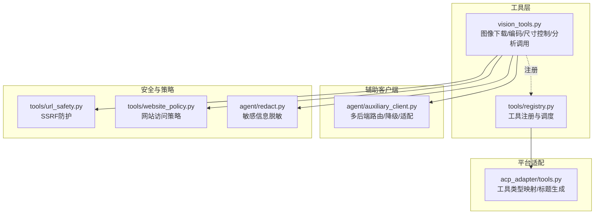
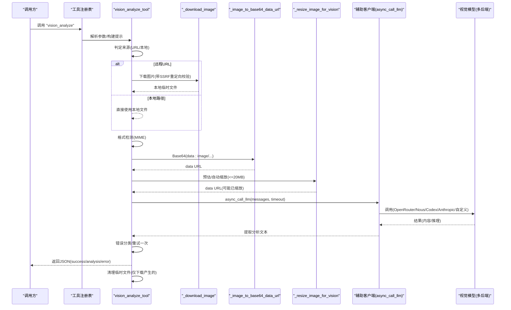
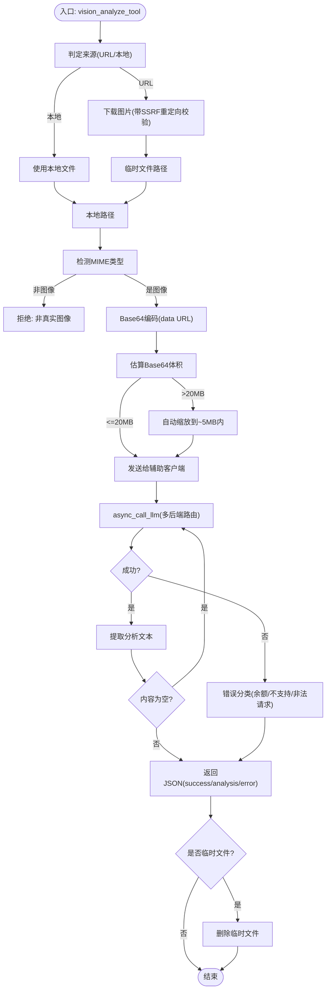
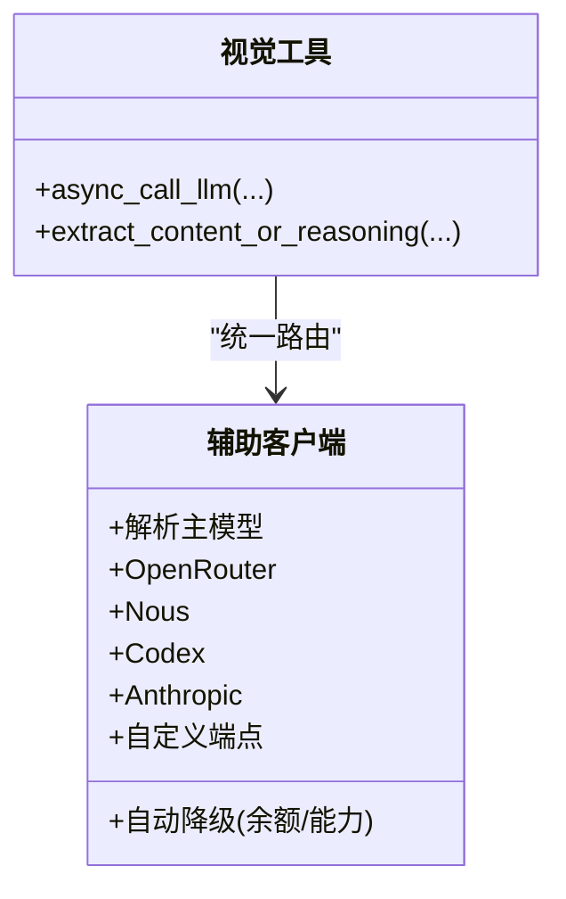
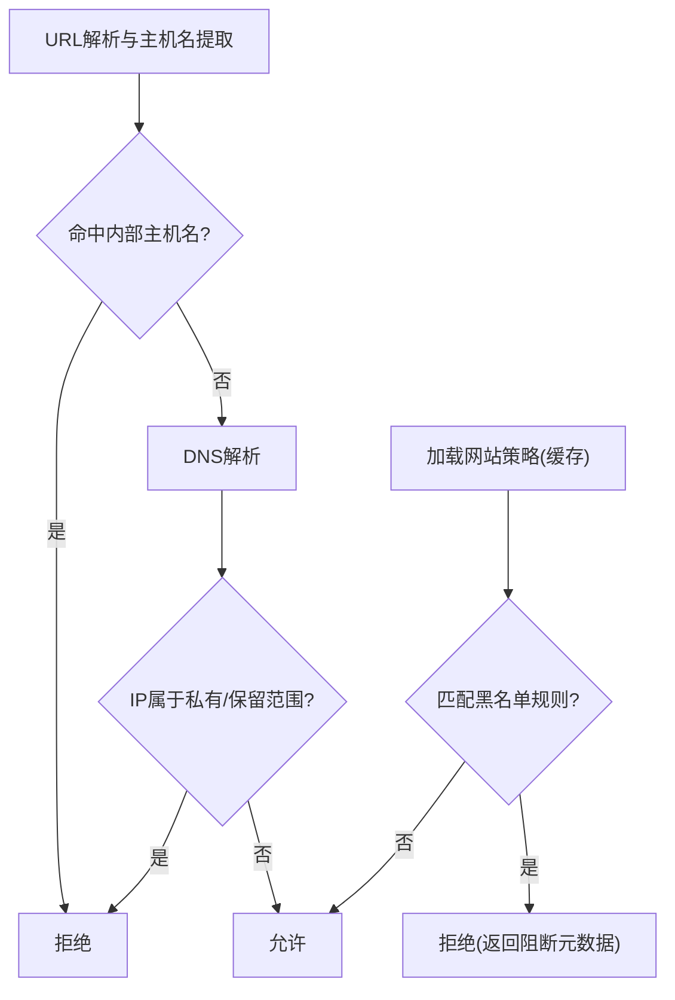
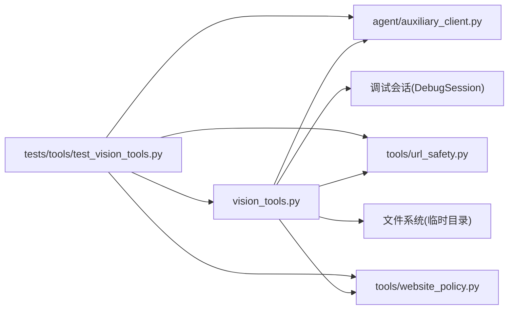

# 视觉分析工具

<cite>
**本文引用的文件**
- [tools/vision_tools.py](file://tools/vision_tools.py)
- [agent/auxiliary_client.py](file://agent/auxiliary_client.py)
- [tools/url_safety.py](file://tools/url_safety.py)
- [tools/website_policy.py](file://tools/website_policy.py)
- [acp_adapter/tools.py](file://acp_adapter/tools.py)
- [tests/tools/test_vision_tools.py](file://tests/tools/test_vision_tools.py)
- [agent/redact.py](file://agent/redact.py)
- [tools/file_tools.py](file://tools/file_tools.py)
</cite>

## 目录
1. [简介](#简介)
2. [项目结构](#项目结构)
3. [核心组件](#核心组件)
4. [架构总览](#架构总览)
5. [详细组件分析](#详细组件分析)
6. [依赖关系分析](#依赖关系分析)
7. [性能考量](#性能考量)
8. [故障排查指南](#故障排查指南)
9. [结论](#结论)
10. [附录](#附录)

## 简介
本文件系统性阐述 Hermes Agent 的视觉分析工具（图像识别与分析）的设计与实现，覆盖以下方面：
- 图像处理流水线：下载、格式校验、编码、尺寸控制与重试机制
- 多模态输入支持：统一通过辅助客户端路由至不同后端（OpenRouter、Nous、Codex、Anthropic、自定义等）
- 分析算法与能力边界：基于通用视觉模型的综合描述与问答能力
- 视觉内容分析：图像质量评估、元数据提取（格式、大小）、提示词驱动的语义理解
- 性能优化：自动尺寸缩放、超大文件预检、重试退避、临时文件清理
- 安全与合规：SSRF 防护、网站访问策略、敏感信息脱敏与日志脱敏

## 项目结构
视觉分析工具位于 tools 子模块中，围绕 vision_tools.py 构建，并通过 agent/auxiliary_client.py 统一路由到多后端视觉模型；同时配合安全与策略模块（tools/url_safety.py、tools/website_policy.py）以及 ACP 工具映射（acp_adapter/tools.py）形成完整的调用链路。

图表来源
- [tools/vision_tools.py:1-790](file://tools/vision_tools.py#L1-L790)
- [agent/auxiliary_client.py:17-28](file://agent/auxiliary_client.py#L17-L28)
- [tools/url_safety.py:1-98](file://tools/url_safety.py#L1-L98)
- [tools/website_policy.py:1-283](file://tools/website_policy.py#L1-L283)
- [acp_adapter/tools.py:1-215](file://acp_adapter/tools.py#L1-L215)

章节来源
- [tools/vision_tools.py:1-790](file://tools/vision_tools.py#L1-L790)
- [agent/auxiliary_client.py:1-800](file://agent/auxiliary_client.py#L1-L800)
- [tools/url_safety.py:1-98](file://tools/url_safety.py#L1-L98)
- [tools/website_policy.py:1-283](file://tools/website_policy.py#L1-L283)
- [acp_adapter/tools.py:1-215](file://acp_adapter/tools.py#L1-L215)

## 核心组件
- 视觉分析工具（vision_analyze_tool）：负责输入校验、远程下载、本地读取、格式检测、Base64 编码、尺寸控制、调用辅助客户端、结果提取与错误分类、临时文件清理。
- 辅助客户端（auxiliary_client）：统一解析“主模型 + 视觉回退链”，支持 OpenRouter、Nous、Codex、Anthropic、自定义端点等，自动在余额不足或模型不支持时降级。
- URL 安全（url_safety）：阻止私有/内部地址访问，防止 SSRF；对重定向目标二次校验。
- 网站策略（website_policy）：加载用户配置的域名黑名单，快速缓存策略以降低频繁检查成本。
- ACP 工具映射（acp_adapter/tools）：将工具名映射为 ACP ToolKind，并生成可读标题，便于可观测性与审计。
- 敏感信息脱敏（agent/redact）：对日志与输出中的敏感文本进行掩码处理。

章节来源
- [tools/vision_tools.py:405-680](file://tools/vision_tools.py#L405-L680)
- [agent/auxiliary_client.py:17-28](file://agent/auxiliary_client.py#L17-L28)
- [tools/url_safety.py:1-98](file://tools/url_safety.py#L1-L98)
- [tools/website_policy.py:1-283](file://tools/website_policy.py#L1-L283)
- [acp_adapter/tools.py:1-215](file://acp_adapter/tools.py#L1-L215)
- [agent/redact.py:124-168](file://agent/redact.py#L124-L168)

## 架构总览
视觉分析从“工具注册”开始，经“参数校验与来源判定”（URL/本地路径），进入“下载/读取与格式检测”，随后“Base64 编码与尺寸控制”，再由“辅助客户端路由”调用具体视觉模型，最后返回“分析结果并清理临时资源”。

图表来源
- [tools/vision_tools.py:405-680](file://tools/vision_tools.py#L405-L680)
- [agent/auxiliary_client.py:17-28](file://agent/auxiliary_client.py#L17-L28)

## 详细组件分析

### 组件A：图像处理与分析流水线
- 输入来源判定：支持 http/https URL 与本地文件路径（含 file:// 与 ~ 展开）。
- 下载与安全：异步下载，设置超时；启用事件钩子对每次重定向目标再次进行 SSRF 校验；根据 Content-Length 与实际字节大小双重限制最大下载量。
- 格式检测：先尝试 MIME 类型推断，再进行 Base64 编码；若非真实图像则拒绝。
- 编码与尺寸控制：估算 Base64 扩展后的体积，优先直接编码；若超过上限（20MB），自动按策略缩放至目标（5MB）以内；若 Pillow 不可用则回退原图并交由上层抛错。
- 调用与重试：构造消息结构（文本+image_url），调用辅助客户端；若因尺寸被拒，自动缩放后重试一次。
- 结果提取与错误分类：提取内容或推理字段；对空内容再试一次；对常见错误（余额不足、不支持视觉、请求非法）给出明确指引。
- 清理：仅删除下载产生的临时文件，保留本地/缓存文件。

图表来源
- [tools/vision_tools.py:405-680](file://tools/vision_tools.py#L405-L680)

章节来源
- [tools/vision_tools.py:405-680](file://tools/vision_tools.py#L405-L680)
- [tests/tools/test_vision_tools.py:32-118](file://tests/tools/test_vision_tools.py#L32-L118)
- [tests/tools/test_vision_tools.py:581-620](file://tests/tools/test_vision_tools.py#L581-L620)
- [tests/tools/test_vision_tools.py:838-861](file://tests/tools/test_vision_tools.py#L838-L861)

### 组件B：多模态后端路由与降级
- 自动检测顺序（视觉任务）：主模型（若为支持视觉的提供商）→ OpenRouter → Nous → Codex → Anthropic → 自定义端点。
- 支持环境变量与配置覆盖默认模型；当出现余额不足等支付类错误时，自动切换到下一个可用后端。
- 对 Codex 与 Anthropic 提供专用适配器，确保与 OpenAI 兼容接口一致。

图表来源
- [agent/auxiliary_client.py:17-28](file://agent/auxiliary_client.py#L17-L28)
- [agent/auxiliary_client.py:428-597](file://agent/auxiliary_client.py#L428-L597)

章节来源
- [agent/auxiliary_client.py:17-28](file://agent/auxiliary_client.py#L17-L28)
- [agent/auxiliary_client.py:428-597](file://agent/auxiliary_client.py#L428-L597)

### 组件C：安全与策略
- SSRF 防护：禁止私有/环回/链路本地/保留地址与 CGNAT 范围；对重定向目标再次校验；DNS 失败一律阻断。
- 网站访问策略：从用户配置加载域名黑名单，支持通配与共享文件；内存缓存短 TTL，避免频繁 IO。
- 敏感信息脱敏：对日志与输出中的密钥、令牌、授权头、JSON 字段等进行掩码处理。

图表来源
- [tools/url_safety.py:51-98](file://tools/url_safety.py#L51-L98)
- [tools/website_policy.py:232-283](file://tools/website_policy.py#L232-L283)
- [agent/redact.py:124-168](file://agent/redact.py#L124-L168)

章节来源
- [tools/url_safety.py:1-98](file://tools/url_safety.py#L1-L98)
- [tools/website_policy.py:1-283](file://tools/website_policy.py#L1-L283)
- [agent/redact.py:124-168](file://agent/redact.py#L124-L168)

### 组件D：工具注册与平台映射
- 工具注册：将 vision_analyze 注册为异步工具，schema 包含 image_url 与 question 参数。
- ACP 映射：将工具名映射为 ToolKind（如 read），并生成人类可读标题（截断过长问题）。

章节来源
- [tools/vision_tools.py:750-790](file://tools/vision_tools.py#L750-L790)
- [acp_adapter/tools.py:20-50](file://acp_adapter/tools.py#L20-L50)
- [acp_adapter/tools.py:63-96](file://acp_adapter/tools.py#L63-L96)

## 依赖关系分析
- 视觉工具依赖：
  - 辅助客户端：统一调用与降级
  - URL 安全：下载前/重定向后校验
  - 网站策略：对 URL 进行访问控制
  - 调试会话：记录调用与结果（可选）
  - 文件系统：临时目录与清理
- 测试覆盖：
  - URL 合法性与 SSRF 阻断
  - MIME 类型推断与 Base64 输出
  - 自动缩放策略与边界条件
  - 错误分类与重试逻辑
  - 环境变量覆盖模型选择

图表来源
- [tools/vision_tools.py:1-790](file://tools/vision_tools.py#L1-L790)
- [agent/auxiliary_client.py:1-800](file://agent/auxiliary_client.py#L1-L800)
- [tools/url_safety.py:1-98](file://tools/url_safety.py#L1-L98)
- [tools/website_policy.py:1-283](file://tools/website_policy.py#L1-L283)
- [tests/tools/test_vision_tools.py:1-861](file://tests/tools/test_vision_tools.py#L1-L861)

章节来源
- [tools/vision_tools.py:1-790](file://tools/vision_tools.py#L1-L790)
- [agent/auxiliary_client.py:1-800](file://agent/auxiliary_client.py#L1-L800)
- [tests/tools/test_vision_tools.py:1-861](file://tests/tools/test_vision_tools.py#L1-L861)

## 性能考量
- 自动尺寸缩放：估算 Base64 体积，优先直接编码；超过 20MB 硬上限时自动缩放至 5MB 目标，减少 API 拒绝率与重试成本。
- 重试与退避：下载阶段采用指数退避重试；API 尺寸错误时自动缩放后重试一次。
- 超大文件预检：在编码前估算体积，避免不必要的网络往返与内存占用。
- 临时文件清理：仅清理下载产生的临时文件，避免对本地/缓存文件造成影响。
- 并发友好：下载与编码均为异步，适合批量处理场景（建议结合外部批处理器）。

章节来源
- [tools/vision_tools.py:289-403](file://tools/vision_tools.py#L289-L403)
- [tools/vision_tools.py:128-229](file://tools/vision_tools.py#L128-L229)
- [tools/vision_tools.py:669-680](file://tools/vision_tools.py#L669-L680)

## 故障排查指南
- 常见错误与指引：
  - 余额不足/付费相关：提示充值账户并重试。
  - 模型不支持视觉：确认所选模型具备多模态能力。
  - 请求非法/图像过大：建议缩小分辨率或更换格式。
- 日志与调试：
  - 开启 VISION_TOOLS_DEBUG 可记录每次调用与结果，便于定位问题。
  - 错误与警告均启用 exc_info，便于追踪异常堆栈。
- 安全相关：
  - SSRF 阻断：若出现“私有地址/内部主机名”被阻断，请检查 URL 是否指向内网服务。
  - 网站策略：若被策略拦截，请检查配置文件中的域名黑名单。
- 代码级验证：
  - 使用测试用例覆盖 URL 合法性、MIME 推断、自动缩放、错误分类与重试等关键路径。

章节来源
- [tools/vision_tools.py:620-668](file://tools/vision_tools.py#L620-L668)
- [tests/tools/test_vision_tools.py:266-367](file://tests/tools/test_vision_tools.py#L266-L367)
- [tests/tools/test_vision_tools.py:369-440](file://tests/tools/test_vision_tools.py#L369-L440)
- [tools/url_safety.py:51-98](file://tools/url_safety.py#L51-L98)
- [tools/website_policy.py:232-283](file://tools/website_policy.py#L232-L283)

## 结论
该视觉分析工具通过清晰的流水线与完善的多后端路由，实现了对图像的可靠分析；配合 SSRF 防护、网站策略与敏感信息脱敏，兼顾安全性与合规性；自动尺寸缩放与重试机制有效提升成功率与性能。建议在生产环境中结合批量处理与缓存策略进一步优化吞吐与延迟。

## 附录

### 使用示例与集成指南
- 基本用法（Python 异步）：
  - 从 vision_tools 导入 vision_analyze_tool
  - 传入 image_url 与 question，等待返回 JSON（包含 success/analysis/error）
- 环境变量：
  - AUXILIARY_VISION_MODEL：覆盖默认视觉模型
  - HERMES_VISION_DOWNLOAD_TIMEOUT：下载超时（秒）
- 平台集成：
  - 通过工具注册表调用“vision_analyze”
  - ACP 工具映射将工具标记为“read”，标题显示问题摘要
- 最佳实践：
  - 优先使用 HTTPS URL；本地文件请确保路径正确且可读
  - 若图像较大，建议预先压缩或调整分辨率
  - 在高并发场景下，结合外部批处理器与缓存策略

章节来源
- [tools/vision_tools.py:770-790](file://tools/vision_tools.py#L770-L790)
- [acp_adapter/tools.py:94-96](file://acp_adapter/tools.py#L94-L96)
- [tests/tools/test_vision_tools.py:212-228](file://tests/tools/test_vision_tools.py#L212-L228)