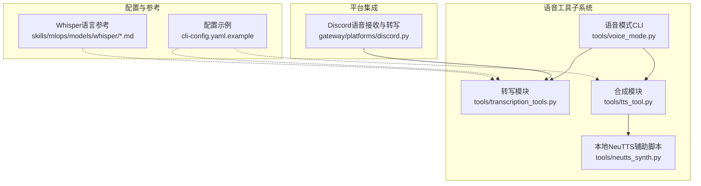
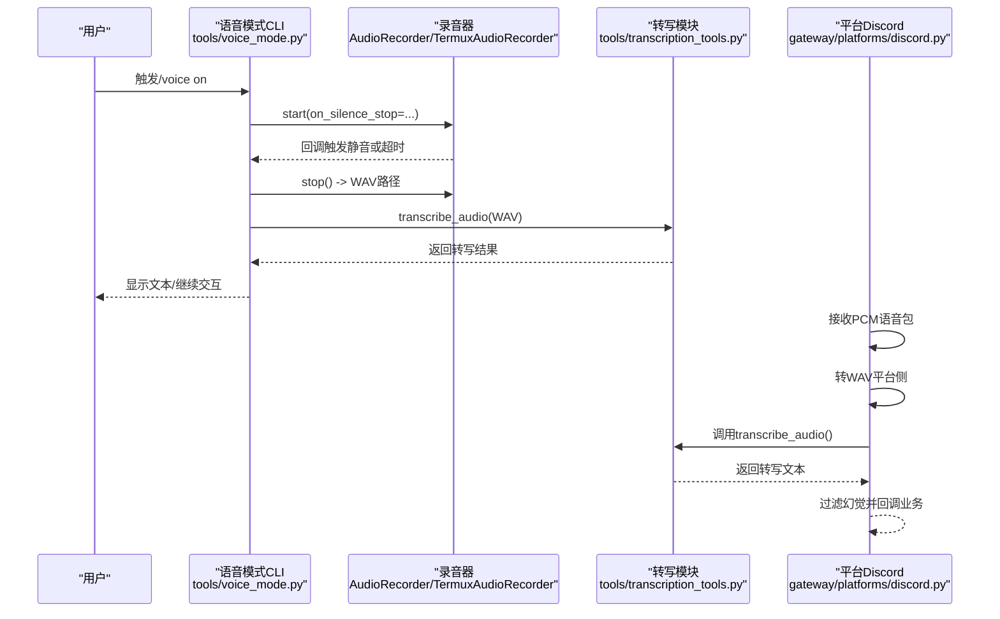
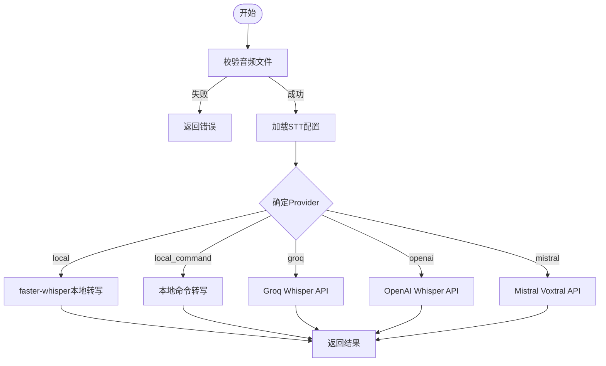
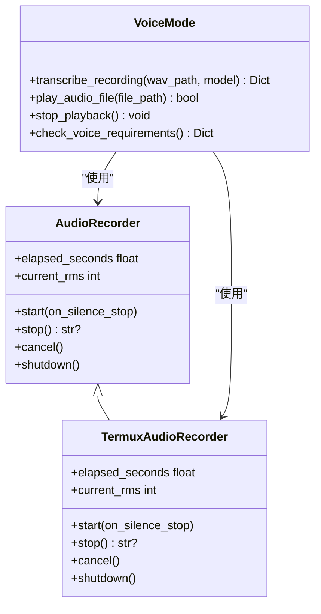
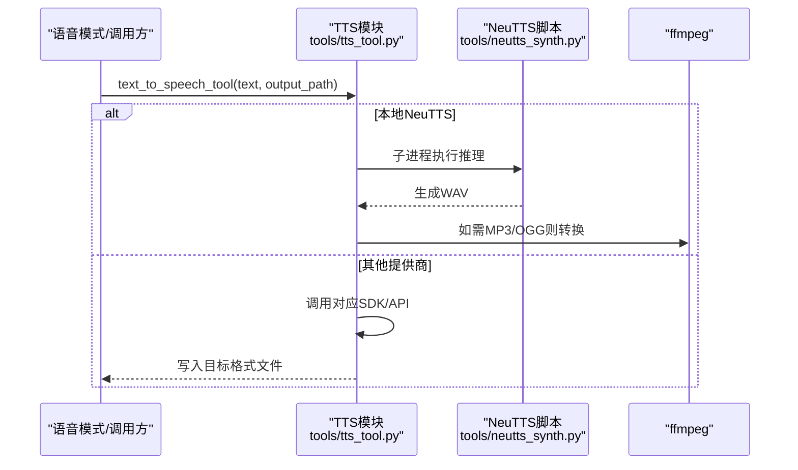
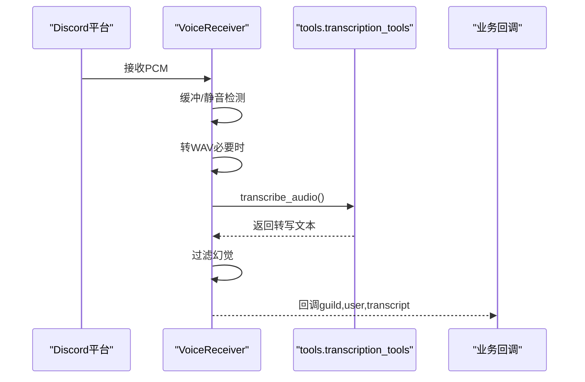
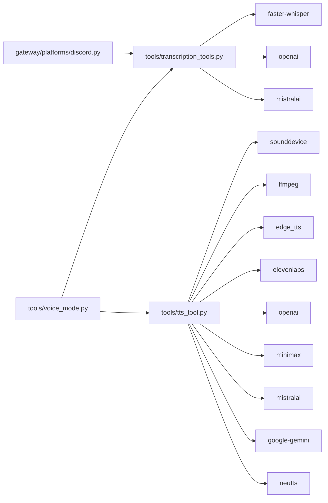

# 语音工具

<cite>
**本文引用的文件**
- [tools/transcription_tools.py](file://tools/transcription_tools.py)
- [tools/tts_tool.py](file://tools/tts_tool.py)
- [tools/voice_mode.py](file://tools/voice_mode.py)
- [tools/neutts_synth.py](file://tools/neutts_synth.py)
- [cli-config.yaml.example](file://cli-config.yaml.example)
- [gateway/platforms/discord.py](file://gateway/platforms/discord.py)
- [skills/mlops/models/whisper/references/languages.md](file://skills/mlops/models/whisper/references/languages.md)
- [skills/mlops/models/whisper/SKILL.md](file://skills/mlops/models/whisper/SKILL.md)
- [tests/gateway/test_voice_command.py](file://tests/gateway/test_voice_command.py)
- [tests/tools/test_voice_mode.py](file://tests/tools/test_voice_mode.py)
</cite>

## 目录
1. [简介](#简介)
2. [项目结构](#项目结构)
3. [核心组件](#核心组件)
4. [架构总览](#架构总览)
5. [详细组件分析](#详细组件分析)
6. [依赖关系分析](#依赖关系分析)
7. [性能考虑](#性能考虑)
8. [故障排查指南](#故障排查指南)
9. [结论](#结论)
10. [附录：使用示例与配置](#附录使用示例与配置)

## 简介
本文件面向Hermes Agent语音工具系统，系统性阐述其架构设计与实现细节，覆盖以下主题：
- 音频处理流水线：从麦克风采集、本地/云端转写到语音合成与播放
- 多语言支持：Whisper模型的语言列表、自动/指定语言识别、翻译模式
- 实时处理能力：推拉式录音、静音检测、平台级语音消息处理
- 文本转语音（TTS）：多家云服务与本地引擎、格式适配、速度/音色参数
- 集成方式：麦克风输入、音频输出、流式播放、消息平台语音通道
- 性能优化：音频压缩、缓冲策略、延迟控制
- 使用示例与配置：基于配置文件与环境变量的快速上手

## 项目结构
语音工具相关代码主要分布在如下模块：
- 转写（STT）：tools/transcription_tools.py
- 合成（TTS）：tools/tts_tool.py、tools/neutts_synth.py
- 语音模式（CLI推话语音）：tools/voice_mode.py
- 平台集成（Discord等）：gateway/platforms/discord.py
- 配置参考：cli-config.yaml.example
- Whisper语言与用法参考：skills/mlops/models/whisper/*.md
- 测试：tests/gateway/test_voice_command.py、tests/tools/test_voice_mode.py

图表来源
- [tools/transcription_tools.py:1-678](file://tools/transcription_tools.py#L1-L678)
- [tools/tts_tool.py:1-1335](file://tools/tts_tool.py#L1-L1335)
- [tools/neutts_synth.py:1-105](file://tools/neutts_synth.py#L1-L105)
- [tools/voice_mode.py:1-1018](file://tools/voice_mode.py#L1-L1018)
- [gateway/platforms/discord.py:1054-1317](file://gateway/platforms/discord.py#L1054-L1317)
- [cli-config.yaml.example:690-705](file://cli-config.yaml.example#L690-L705)
- [skills/mlops/models/whisper/references/languages.md:1-144](file://skills/mlops/models/whisper/references/languages.md#L1-L144)
- [skills/mlops/models/whisper/SKILL.md:72-142](file://skills/mlops/models/whisper/SKILL.md#L72-L142)

章节来源
- [tools/transcription_tools.py:1-678](file://tools/transcription_tools.py#L1-L678)
- [tools/tts_tool.py:1-1335](file://tools/tts_tool.py#L1-L1335)
- [tools/voice_mode.py:1-1018](file://tools/voice_mode.py#L1-L1018)
- [cli-config.yaml.example:690-705](file://cli-config.yaml.example#L690-L705)

## 核心组件
- 转写（STT）：支持本地faster-whisper、Groq Whisper API、OpenAI Whisper API、Mistral Voxtral Transcribe；自动探测可用后端并进行文件校验、格式转换与模型加载。
- 合成（TTS）：支持Edge TTS、ElevenLabs、OpenAI TTS、xAI TTS、MiniMax TTS、Mistral Voxtral、Google Gemini TTS、本地NeuTTS；按平台选择最佳输出格式（如Telegram需Opus），并提供速度/音色/设备等参数。
- 语音模式（CLI）：提供推话语音录制、静音检测、转写过滤（去幻觉）、播放与中断控制。
- 平台集成：在Discord等平台接收PCM语音包，转为WAV后调用转写，并回调业务逻辑。

章节来源
- [tools/transcription_tools.py:562-634](file://tools/transcription_tools.py#L562-L634)
- [tools/tts_tool.py:764-800](file://tools/tts_tool.py#L764-L800)
- [tools/voice_mode.py:372-722](file://tools/voice_mode.py#L372-L722)
- [gateway/platforms/discord.py:1288-1311](file://gateway/platforms/discord.py#L1288-L1311)

## 架构总览
下图展示从“语音输入”到“文本输出”的完整链路，以及平台侧的处理流程。

图表来源
- [tools/voice_mode.py:372-722](file://tools/voice_mode.py#L372-L722)
- [tools/transcription_tools.py:562-634](file://tools/transcription_tools.py#L562-L634)
- [gateway/platforms/discord.py:1288-1311](file://gateway/platforms/discord.py#L1288-L1311)

## 详细组件分析

### 组件A：转写（STT）模块
- 支持后端与优先级
  - 用户显式配置：local/groq/openai/mistral/local_command
  - 自动探测：local（faster-whisper）> Groq（免费）> OpenAI（付费）> Mistral
- 输入校验与格式处理
  - 文件存在性、类型、大小限制
  - 非WAV输入通过ffmpeg转换为WAV（本地命令模式）
- 模型与语言
  - faster-whisper：按需下载模型，beam搜索、可强制语言
  - Groq/OpenAI/Mistral：调用对应API，自动模型纠正
- 输出
  - 统一返回字典：success、transcript、provider、可选error

图表来源
- [tools/transcription_tools.py:163-243](file://tools/transcription_tools.py#L163-L243)
- [tools/transcription_tools.py:282-320](file://tools/transcription_tools.py#L282-L320)
- [tools/transcription_tools.py:414-460](file://tools/transcription_tools.py#L414-L460)
- [tools/transcription_tools.py:466-516](file://tools/transcription_tools.py#L466-L516)
- [tools/transcription_tools.py:523-554](file://tools/transcription_tools.py#L523-L554)

章节来源
- [tools/transcription_tools.py:562-634](file://tools/transcription_tools.py#L562-L634)

### 组件B：语音模式（CLI推语）
- 录音
  - 常规：sounddevice InputStream，持续收集帧，静音检测与自动停止
  - Android（Termux）：使用termux-microphone-record
- 转写
  - 调用STT模块，过滤Whisper常见幻觉短语
- 播放
  - 优先sounddevice播放WAV；否则尝试系统播放器（afplay/ffplay/aplay）
  - 支持中断播放

图表来源
- [tools/voice_mode.py:372-722](file://tools/voice_mode.py#L372-L722)
- [tools/voice_mode.py:814-918](file://tools/voice_mode.py#L814-L918)

章节来源
- [tools/voice_mode.py:372-722](file://tools/voice_mode.py#L372-L722)
- [tools/voice_mode.py:814-918](file://tools/voice_mode.py#L814-L918)

### 组件C：文本转语音（TTS）模块
- 支持的提供商与默认行为
  - Edge TTS（免费，无需密钥）、ElevenLabs（需密钥）、OpenAI TTS（需密钥）、xAI TTS、MiniMax TTS、Mistral Voxtral、Google Gemini TTS、NeuTTS（本地）
- 输出格式与平台适配
  - Telegram语音气泡需要Opus（.ogg）；部分提供商可直接生成Opus或通过ffmpeg转换
- 参数与特性
  - 速度、音色、采样率、比特率、设备（NeuTTS）、语音克隆（MiniMax）
- 本地NeuTTS
  - 通过独立脚本tools/neutts_synth.py执行推理，避免主进程常驻大模型内存

图表来源
- [tools/tts_tool.py:764-800](file://tools/tts_tool.py#L764-L800)
- [tools/tts_tool.py:689-758](file://tools/tts_tool.py#L689-L758)
- [tools/neutts_synth.py:51-104](file://tools/neutts_synth.py#L51-L104)

章节来源
- [tools/tts_tool.py:764-800](file://tools/tts_tool.py#L764-L800)
- [tools/tts_tool.py:192-216](file://tools/tts_tool.py#L192-L216)
- [tools/tts_tool.py:222-262](file://tools/tts_tool.py#L222-L262)
- [tools/tts_tool.py:268-314](file://tools/tts_tool.py#L268-L314)
- [tools/tts_tool.py:319-378](file://tools/tts_tool.py#L319-L378)
- [tools/tts_tool.py:384-465](file://tools/tts_tool.py#L384-L465)
- [tools/tts_tool.py:471-514](file://tools/tts_tool.py#L471-L514)
- [tools/tts_tool.py:554-682](file://tools/tts_tool.py#L554-L682)
- [tools/tts_tool.py:689-758](file://tools/tts_tool.py#L689-L758)
- [tools/neutts_synth.py:51-104](file://tools/neutts_synth.py#L51-L104)

### 组件D：平台集成（Discord语音）
- 接收PCM语音包，必要时转WAV
- 调用STT模块转写，过滤Whisper幻觉
- 回调业务逻辑（如继续对话）

图表来源
- [gateway/platforms/discord.py:1288-1311](file://gateway/platforms/discord.py#L1288-L1311)
- [tests/gateway/test_voice_command.py:1057-1072](file://tests/gateway/test_voice_command.py#L1057-L1072)

章节来源
- [gateway/platforms/discord.py:1054-1317](file://gateway/platforms/discord.py#L1054-L1317)
- [tests/gateway/test_voice_command.py:1057-1072](file://tests/gateway/test_voice_command.py#L1057-L1072)

## 依赖关系分析
- 模块内聚与耦合
  - STT模块对第三方库采用惰性导入，避免在无音频环境崩溃
  - TTS模块按提供商拆分函数，便于扩展与替换
  - 语音模式对STT/TTS进行组合，提供统一入口
- 外部依赖
  - 音频：sounddevice、numpy（可选）
  - 转写：faster-whisper、openai、mistralai（可选）
  - 合成：各云厂商SDK或ffmpeg（可选）
  - 本地NeuTTS：neutts、espeak-ng

图表来源
- [tools/transcription_tools.py:46-58](file://tools/transcription_tools.py#L46-L58)
- [tools/tts_tool.py:56-79](file://tools/tts_tool.py#L56-L79)
- [tools/voice_mode.py:31-39](file://tools/voice_mode.py#L31-L39)
- [gateway/platforms/discord.py:1288-1289](file://gateway/platforms/discord.py#L1288-L1289)

章节来源
- [tools/transcription_tools.py:46-58](file://tools/transcription_tools.py#L46-L58)
- [tools/tts_tool.py:56-79](file://tools/tts_tool.py#L56-L79)
- [tools/voice_mode.py:31-39](file://tools/voice_mode.py#L31-L39)

## 性能考虑
- 本地转写
  - faster-whisper按需下载模型，首次加载耗时；建议在生产环境预热模型或使用较大模型以提升准确率
  - 通过设置语言强制减少解码时间
- 云端转写
  - Groq与OpenAI Whisper API适合高并发与高质量场景；注意配额与延迟
- 本地合成
  - Edge TTS无需密钥，但需ffmpeg转Opus；ElevenLabs/OpenAI TTS质量高但有成本
  - Mistral Voxtral支持原生Opus，适合Telegram语音气泡
  - Gemini TTS返回L16 PCM，需封装WAV头再转码
  - NeuTTS本地推理，避免网络开销，但首次模型下载较大
- 缓冲与延迟
  - 录音器采用持久化InputStream，避免频繁打开关闭导致的阻塞
  - 静音检测阈值与容忍窗口可调，平衡误触与停顿
  - 播放采用非阻塞策略，支持中断

章节来源
- [tools/transcription_tools.py:282-320](file://tools/transcription_tools.py#L282-L320)
- [tools/tts_tool.py:149-186](file://tools/tts_tool.py#L149-L186)
- [tools/tts_tool.py:517-682](file://tools/tts_tool.py#L517-L682)
- [tools/voice_mode.py:434-563](file://tools/voice_mode.py#L434-L563)

## 故障排查指南
- 环境检测
  - SSH/Docker/WSL等无音频设备时会提示；WSL需配置PULSE_SERVER
  - Termux可通过Termux:API麦克风录制替代sounddevice
- 音频库缺失
  - 缺少sounddevice/numpy时，安装建议见提示信息
- 转写失败
  - 文件过大、格式不支持、API密钥未配置、网络异常
  - Whisper在静音/低噪声环境下可能出现幻觉，已内置过滤
- 播放问题
  - 无可用播放器或设备忙；可尝试中断当前播放后重试

章节来源
- [tools/voice_mode.py:87-179](file://tools/voice_mode.py#L87-L179)
- [tools/voice_mode.py:924-984](file://tools/voice_mode.py#L924-L984)
- [tools/transcription_tools.py:250-275](file://tools/transcription_tools.py#L250-L275)
- [tools/transcription_tools.py:414-460](file://tools/transcription_tools.py#L414-L460)
- [tools/transcription_tools.py:466-516](file://tools/transcription_tools.py#L466-L516)
- [tools/transcription_tools.py:523-554](file://tools/transcription_tools.py#L523-L554)

## 结论
Hermes Agent语音工具系统通过清晰的模块划分与平台集成，实现了从录音、转写、到合成与播放的完整链路。其优势在于：
- 多后端兼容与自动降级策略
- 本地与云端能力互补
- 面向平台的稳定集成（如Discord）
- 可扩展的TTS/STT提供商体系

建议在生产环境中结合业务需求选择合适的STT/TTS后端，并针对不同平台调整输出格式与参数，以获得最佳体验与成本平衡。

## 附录：使用示例与配置
- 配置文件要点（摘自配置示例）
  - STT启用与后端选择：local/groq/openai/mistral，可指定模型与语言
  - TTS提供商与参数：速度、音色、设备、输出格式等
- Whisper语言支持
  - 官方语言列表与模型尺寸建议，支持自动/指定语言识别与翻译
- 平台集成测试
  - Discord语音输入处理流程与幻觉过滤验证

章节来源
- [cli-config.yaml.example:690-705](file://cli-config.yaml.example#L690-L705)
- [skills/mlops/models/whisper/references/languages.md:1-144](file://skills/mlops/models/whisper/references/languages.md#L1-L144)
- [skills/mlops/models/whisper/SKILL.md:72-142](file://skills/mlops/models/whisper/SKILL.md#L72-L142)
- [tests/gateway/test_voice_command.py:1057-1072](file://tests/gateway/test_voice_command.py#L1057-L1072)
- [tests/tools/test_voice_mode.py:1043-1078](file://tests/tools/test_voice_mode.py#L1043-L1078)