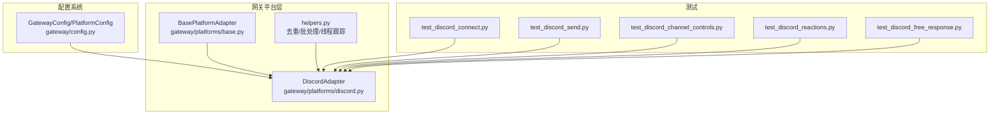
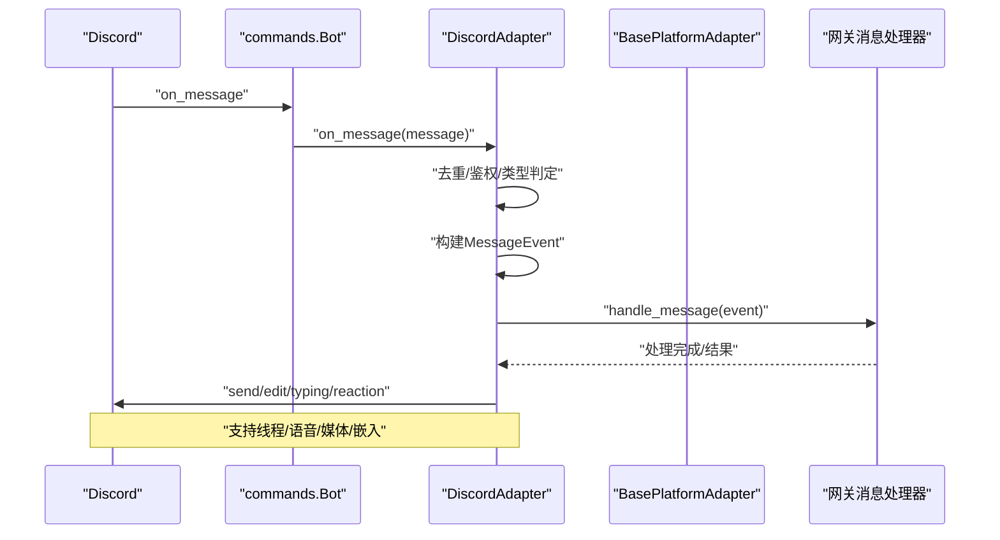
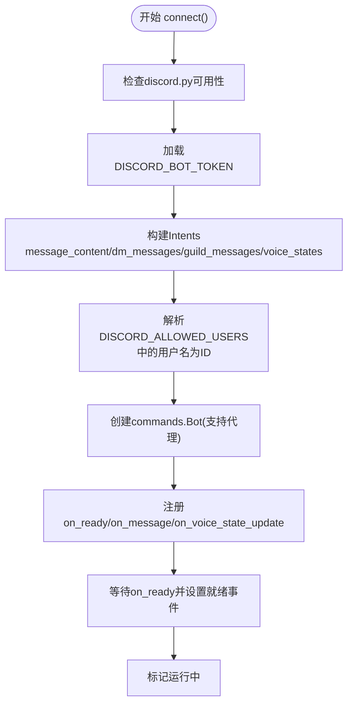
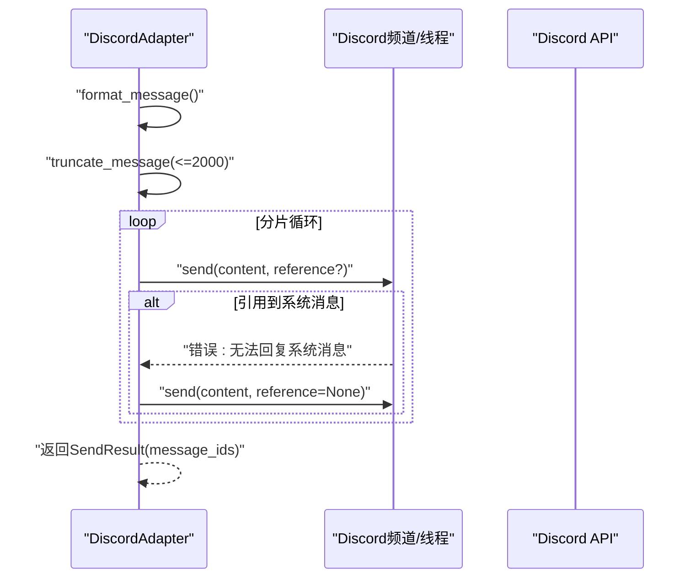
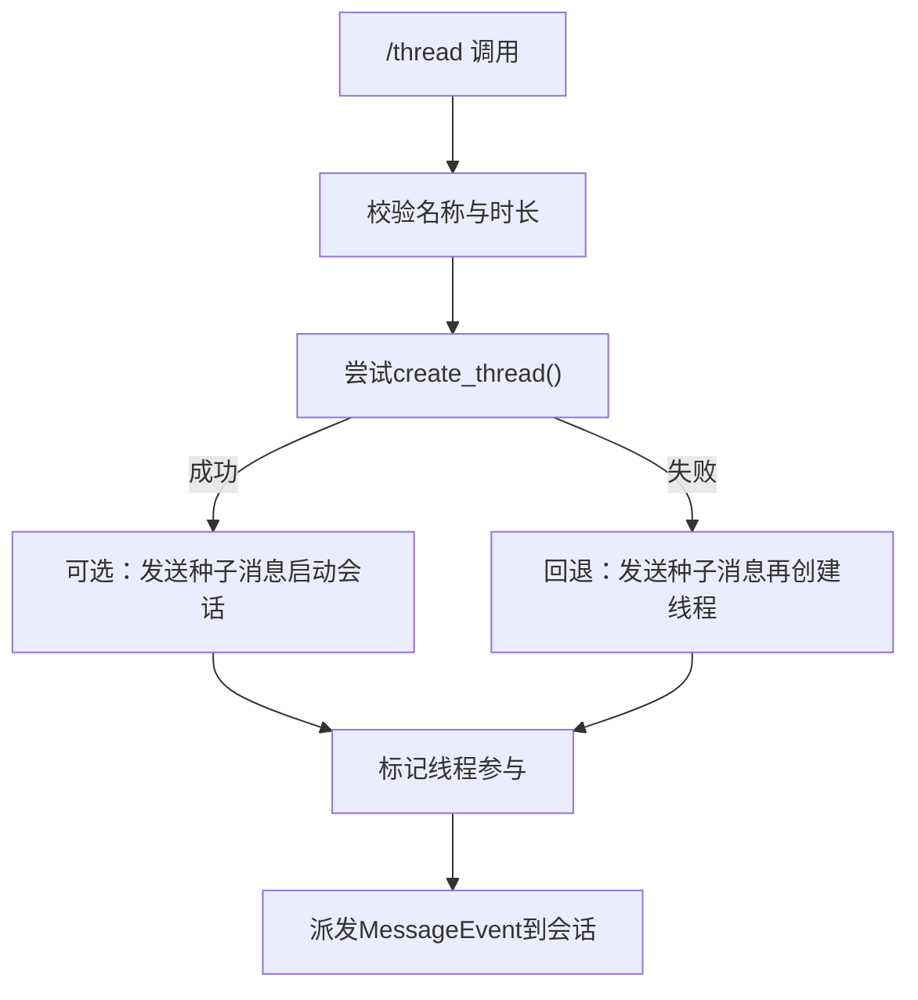
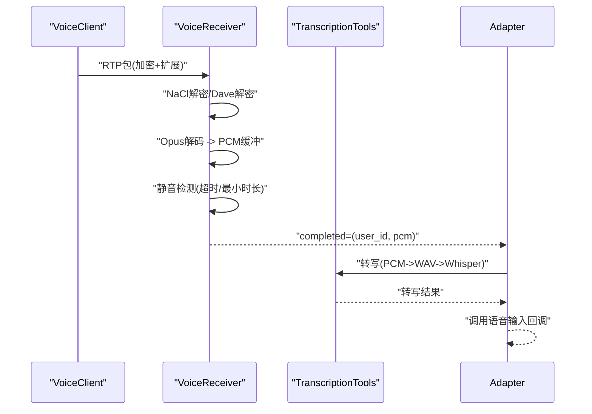
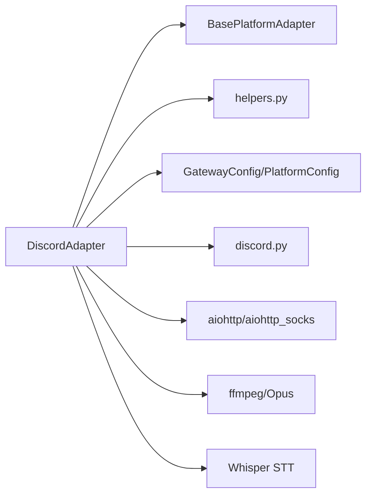

# Discord集成

<cite>
**本文引用的文件**
- [gateway/platforms/discord.py](file://gateway/platforms/discord.py)
- [gateway/platforms/base.py](file://gateway/platforms/base.py)
- [gateway/platforms/helpers.py](file://gateway/platforms/helpers.py)
- [gateway/config.py](file://gateway/config.py)
- [tests/gateway/test_discord_connect.py](file://tests/gateway/test_discord_connect.py)
- [tests/gateway/test_discord_send.py](file://tests/gateway/test_discord_send.py)
- [tests/gateway/test_discord_channel_controls.py](file://tests/gateway/test_discord_channel_controls.py)
- [tests/gateway/test_discord_reactions.py](file://tests/gateway/test_discord_reactions.py)
- [tests/gateway/test_discord_free_response.py](file://tests/gateway/test_discord_free_response.py)
</cite>

## 目录
1. [简介](#简介)
2. [项目结构](#项目结构)
3. [核心组件](#核心组件)
4. [架构总览](#架构总览)
5. [详细组件分析](#详细组件分析)
6. [依赖关系分析](#依赖关系分析)
7. [性能考虑](#性能考虑)
8. [故障排查指南](#故障排查指南)
9. [结论](#结论)
10. [附录](#附录)

## 简介
本文件面向Hermes Agent的Discord平台适配器，系统性阐述其WebSocket连接、事件处理、消息发送与分片、线程与频道管理、权限与许可控制、媒体与嵌入消息支持、语音通道与STT、以及与网关配置系统的集成方式。文档同时覆盖速率限制、重连与去重、延迟加载与大服务器优化策略，并提供配置指南、机器人权限设置与安全最佳实践。

## 项目结构
Discord适配器位于网关平台层，继承通用平台抽象并扩展Discord特有能力：
- 平台适配器：gateway/platforms/discord.py
- 基类与通用工具：gateway/platforms/base.py
- 通用辅助：gateway/platforms/helpers.py
- 网关配置：gateway/config.py
- 测试用例：tests/gateway/test_discord_*.py

图表来源
- [gateway/platforms/discord.py](file://gateway/platforms/discord.py)
- [gateway/platforms/base.py](file://gateway/platforms/base.py)
- [gateway/platforms/helpers.py](file://gateway/platforms/helpers.py)
- [gateway/config.py](file://gateway/config.py)
- [tests/gateway/test_discord_connect.py](file://tests/gateway/test_discord_connect.py)
- [tests/gateway/test_discord_send.py](file://tests/gateway/test_discord_send.py)
- [tests/gateway/test_discord_channel_controls.py](file://tests/gateway/test_discord_channel_controls.py)
- [tests/gateway/test_discord_reactions.py](file://tests/gateway/test_discord_reactions.py)
- [tests/gateway/test_discord_free_response.py](file://tests/gateway/test_discord_free_response.py)

章节来源
- [gateway/platforms/discord.py](file://gateway/platforms/discord.py)
- [gateway/platforms/base.py](file://gateway/platforms/base.py)
- [gateway/platforms/helpers.py](file://gateway/platforms/helpers.py)
- [gateway/config.py](file://gateway/config.py)

## 核心组件
- DiscordAdapter：负责连接、事件接收、消息发送、线程/频道管理、语音通道、反应反馈、去重与批处理等。
- BasePlatformAdapter：定义统一的消息事件模型、发送结果、文本截断与格式化、缓存工具等。
- MessageDeduplicator/ThreadParticipationTracker：跨平台复用的去重与线程参与跟踪。
- GatewayConfig/PlatformConfig：集中式配置加载、环境变量覆盖、平台开关与默认行为。

章节来源
- [gateway/platforms/discord.py](file://gateway/platforms/discord.py)
- [gateway/platforms/base.py](file://gateway/platforms/base.py)
- [gateway/platforms/helpers.py](file://gateway/platforms/helpers.py)
- [gateway/config.py](file://gateway/config.py)

## 架构总览
Discord适配器通过discord.py库建立与Discord的连接，注册事件回调（消息、语音状态、交互命令），在收到消息后构建标准化MessageEvent并交由网关处理；发送侧支持多段消息分片、回复引用、媒体附件、语音消息、TTS播放与语音通道播放。

图表来源
- [gateway/platforms/discord.py](file://gateway/platforms/discord.py)
- [gateway/platforms/base.py](file://gateway/platforms/base.py)

## 详细组件分析

### WebSocket连接与事件处理
- 连接流程：检查依赖、加载令牌、按需请求成员意图、代理配置、创建Bot实例、注册事件、等待就绪。
- 事件注册：on_ready、on_message、on_voice_state_update、slash命令树同步。
- 去重：使用MessageDeduplicator避免RESUME重放导致的重复处理。
- 鉴权：支持DISCORD_ALLOWED_USERS白名单，可解析用户名为ID；支持忽略系统消息与非目标提及。

图表来源
- [gateway/platforms/discord.py](file://gateway/platforms/discord.py)
- [tests/gateway/test_discord_connect.py](file://tests/gateway/test_discord_connect.py)

章节来源
- [gateway/platforms/discord.py](file://gateway/platforms/discord.py)
- [tests/gateway/test_discord_connect.py](file://tests/gateway/test_discord_connect.py)

### 消息发送与分片、回复引用与嵌入
- 发送流程：根据metadata决定发送至线程或父频道；格式化内容；按2000字符阈值分片；支持首块/全部块保留回复引用。
- 回复引用容错：当目标为系统消息时自动回退为无引用发送。
- 编辑消息：对已发送消息进行编辑，超长截断。
- 嵌入与附件：图片/动图/视频/文档本地上传；语音消息原生flag优先，失败则退回文件附件。
- 反馈反应：处理开始/完成/失败的反应反馈（可配置开关）。

图表来源
- [gateway/platforms/discord.py](file://gateway/platforms/discord.py)
- [tests/gateway/test_discord_send.py](file://tests/gateway/test_discord_send.py)

章节来源
- [gateway/platforms/discord.py](file://gateway/platforms/discord.py)
- [tests/gateway/test_discord_send.py](file://tests/gateway/test_discord_send.py)

### 线程与频道管理
- 线程创建：支持从slash命令创建线程，校验自动归档时长，必要时回退为种子消息+线程。
- 线程参与跟踪：持久化记录机器人参与过的线程，后续无需@即可回复。
- 频道提示词与技能绑定：支持按频道/论坛父级解析channel_prompt与channel_skill_bindings。
- 自由响应通道：可在配置中指定免@直接回复的频道列表。

图表来源
- [gateway/platforms/discord.py](file://gateway/platforms/discord.py)
- [tests/gateway/test_discord_channel_controls.py](file://tests/gateway/test_discord_channel_controls.py)

章节来源
- [gateway/platforms/discord.py](file://gateway/platforms/discord.py)
- [tests/gateway/test_discord_channel_controls.py](file://tests/gateway/test_discord_channel_controls.py)

### 权限与许可控制
- 白名单用户：DISCORD_ALLOWED_USERS支持ID或用户名/显示名，首次连接时解析为ID并写回环境。
- 成员意图按需申请：仅当存在非数字用户名时才请求members意图，避免因未启用而无法上线。
- 机器人消息过滤：支持none/mentions/all三种策略，避免误触发。
- 多代理过滤：在多代理共享频道时，若消息提及其他代理但未提及本代理，则忽略该消息。

章节来源
- [gateway/platforms/discord.py](file://gateway/platforms/discord.py)
- [tests/gateway/test_discord_connect.py](file://tests/gateway/test_discord_connect.py)

### 媒体与嵌入消息支持
- 图片/动图/视频/文档：本地文件直传；URL下载后转附件渲染。
- 语音消息：尝试原生flags=8192；失败回退为普通文件。
- URL安全：所有外部下载均进行SSRF防护与安全URL校验。
- 文档缓存：统一的文档缓存目录与清理策略。

章节来源
- [gateway/platforms/discord.py](file://gateway/platforms/discord.py)
- [gateway/platforms/base.py](file://gateway/platforms/base.py)

### 语音通道与STT
- 语音通道：加入/离开/播放音频；播放前暂停语音监听以避免回音。
- 语音监听：基于UDP数据包解密（NaCl/Dave E2EE）、Opus解码、静音检测、PCM转WAV、Whisper转写。
- 保活：定期发送UDP保活包防止路由中断。
- 语音上下文注入：将当前语音频道成员与说话者状态注入系统提示。

图表来源
- [gateway/platforms/discord.py](file://gateway/platforms/discord.py)

章节来源
- [gateway/platforms/discord.py](file://gateway/platforms/discord.py)

### 反馈反应与处理生命周期
- 处理开始：添加“👀”反应。
- 处理完成：移除“👀”，根据成功/失败添加“✅/❌”。

章节来源
- [gateway/platforms/discord.py](file://gateway/platforms/discord.py)
- [tests/gateway/test_discord_reactions.py](file://tests/gateway/test_discord_reactions.py)

### 与网关配置系统集成
- 配置来源：环境变量 > config.yaml > legacy gateway.json > 内置默认。
- 平台开关与令牌：按enabled/token/api_key判断是否连接。
- Discord专属配置：require_mention/free_response_channels/ignored_channels/allowed_channels/no_thread_channels/auto_thread/reactions等映射为环境变量。
- 会话隔离与流式传输：支持按用户隔离、线程内共享等策略，以及流式输出配置。

章节来源
- [gateway/config.py](file://gateway/config.py)
- [gateway/platforms/discord.py](file://gateway/platforms/discord.py)

## 依赖关系分析
- 组件耦合
  - DiscordAdapter强依赖discord.py与discord.ext.commands。
  - 与BasePlatformAdapter共享消息事件模型、发送结果、缓存工具。
  - 与helpers共享去重、线程参与跟踪等通用逻辑。
  - 与GatewayConfig/PlatformConfig共享配置解析与环境变量覆盖。
- 外部依赖
  - discord.py：事件驱动、slash命令树、HTTP请求封装。
  - aiohttp/ProxyConnector：代理支持（SOCKS/HTTP）。
  - ffmpeg/Opus：语音播放与编码。
  - Whisper：语音转文字。

图表来源
- [gateway/platforms/discord.py](file://gateway/platforms/discord.py)
- [gateway/platforms/base.py](file://gateway/platforms/base.py)
- [gateway/platforms/helpers.py](file://gateway/platforms/helpers.py)
- [gateway/config.py](file://gateway/config.py)

章节来源
- [gateway/platforms/discord.py](file://gateway/platforms/discord.py)
- [gateway/platforms/base.py](file://gateway/platforms/base.py)
- [gateway/platforms/helpers.py](file://gateway/platforms/helpers.py)
- [gateway/config.py](file://gateway/config.py)

## 性能考虑
- 文本批处理：快速连续文本事件合并，降低发送频率与API开销。
- 媒体缓存：图片/音频/文档本地缓存，减少重复下载与CDN抖动影响。
- 语音保活：定时UDP保活，避免长时间静默导致的会话中断。
- 语音监听静音检测：仅在有效语音片段超过阈值时提交转写，减少无效调用。
- 大服务器优化：线程参与跟踪持久化，避免每次重启重建状态；频道提示词与技能绑定按需解析。

## 故障排查指南
- 连接失败
  - 检查DISCORD_BOT_TOKEN是否正确且非占位符。
  - 若请求members意图导致无法上线，确认开发者门户已启用相应权限。
  - 使用代理时确保SOCKS/HTTP配置正确，或禁用代理验证网络可达性。
- 重复消息/掉线重连
  - 确认MessageDeduplicator生效；检查RESUME事件重放。
- 回复引用失败
  - 当目标为系统消息时自动回退；检查引用消息是否存在。
- 语音问题
  - 确认Opus库加载成功；检查ffmpeg路径与权限；验证语音通道权限。
- 速率限制与重试
  - 发送侧异常中包含可重试标识时，基础适配器会自动重试；对于非幂等操作（如发送消息）不盲目重试，避免重复投递。

章节来源
- [gateway/platforms/discord.py](file://gateway/platforms/discord.py)
- [tests/gateway/test_discord_send.py](file://tests/gateway/test_discord_send.py)
- [tests/gateway/test_discord_connect.py](file://tests/gateway/test_discord_connect.py)

## 结论
Hermes Agent的Discord适配器在通用平台抽象之上，提供了完善的事件处理、消息分片、线程与频道管理、媒体与嵌入支持、语音通道与STT、以及与网关配置系统的无缝集成。通过去重、批处理、缓存与保活等策略，适配器在保证可靠性的同时兼顾性能与用户体验。建议在生产环境中严格配置机器人权限、代理与速率限制策略，并结合测试用例验证关键路径。

## 附录

### 配置指南与环境变量
- 平台令牌与开关
  - DISCORD_BOT_TOKEN：Discord机器人令牌
  - DISCORD_PROXY：代理URL（SOCKS/HTTP）
- 用户与频道控制
  - DISCORD_ALLOWED_USERS：白名单（ID或用户名/显示名，逗号分隔）
  - DISCORD_FREE_RESPONSE_CHANNELS：免@自由响应频道ID列表
  - DISCORD_IGNORED_CHANNELS：忽略响应的频道ID列表
  - DISCORD_ALLOWED_CHANNELS：允许响应的白名单频道ID列表
  - DISCORD_NO_THREAD_CHANNELS：不在该频道自动建线程
  - DISCORD_AUTO_THREAD：是否在@提及时自动建线程
  - DISCORD_REACTIONS：是否启用反应反馈
- 允许机器人消息策略
  - DISCORD_ALLOW_BOTS：none/mentions/all
- 文本批处理参数
  - HERMES_DISCORD_TEXT_BATCH_DELAY_SECONDS：批处理延迟
  - HERMES_DISCORD_TEXT_BATCH_SPLIT_DELAY_SECONDS：分片触发延迟
- 其他
  - DISCORD_IGNORE_NO_MENTION：兼容旧行为（与多代理共享频道时的@要求）

章节来源
- [gateway/config.py](file://gateway/config.py)
- [gateway/platforms/discord.py](file://gateway/platforms/discord.py)

### 机器人权限设置与安全最佳实践
- 必需权限
  - 消息读取：message_content、dm_messages、guild_messages
  - 语音状态：voice_states
  - 成员意图：仅在需要解析用户名时启用
- 安全建议
  - 仅授予最小权限集合；避免开启不必要的特权。
  - 使用代理时确保DNS绕过（SOCKS场景）。
  - 对外部URL访问进行SSRF保护；仅允许安全域名。
  - 定期轮换令牌；避免硬编码在源码中。

章节来源
- [gateway/platforms/discord.py](file://gateway/platforms/discord.py)
- [gateway/platforms/base.py](file://gateway/platforms/base.py)