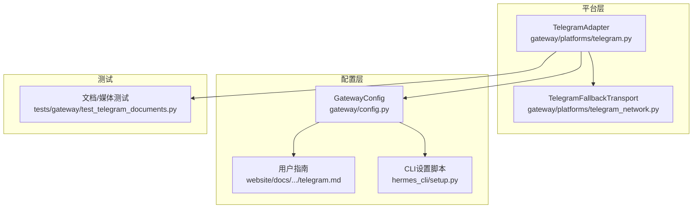
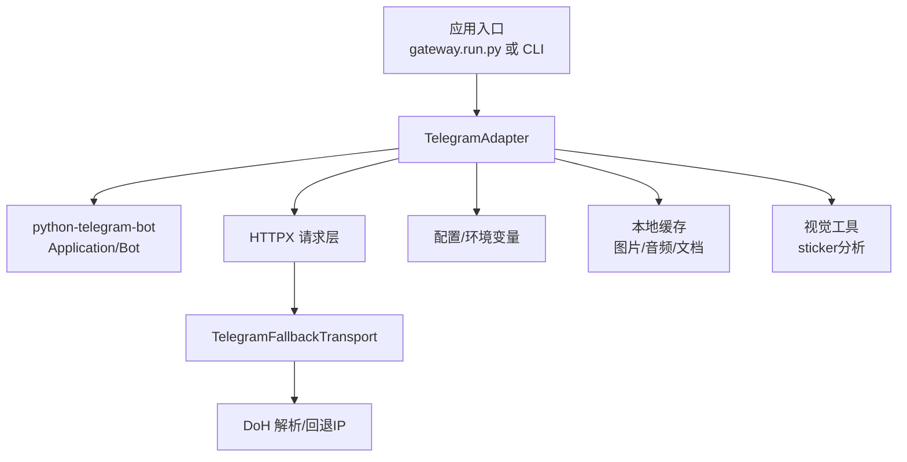
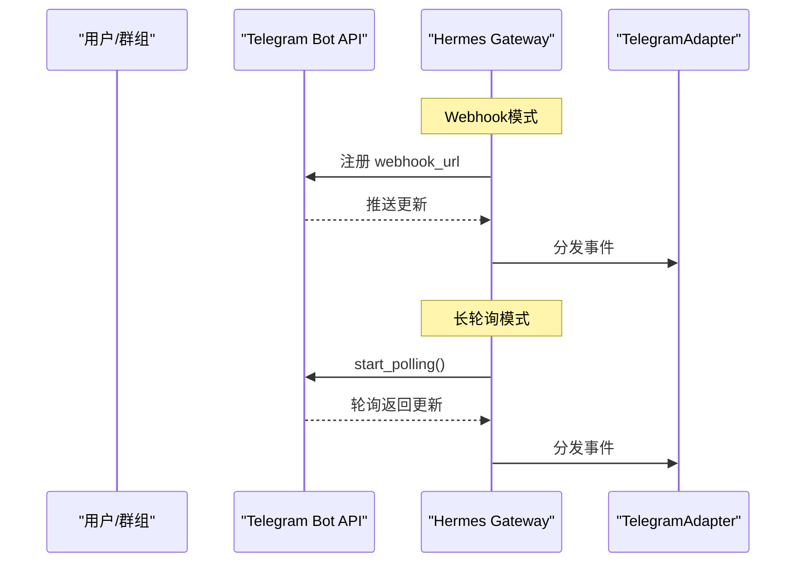
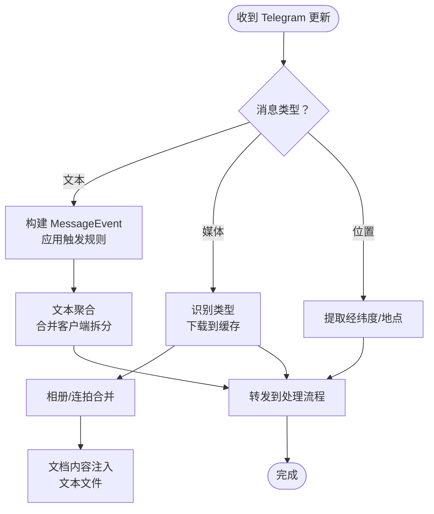
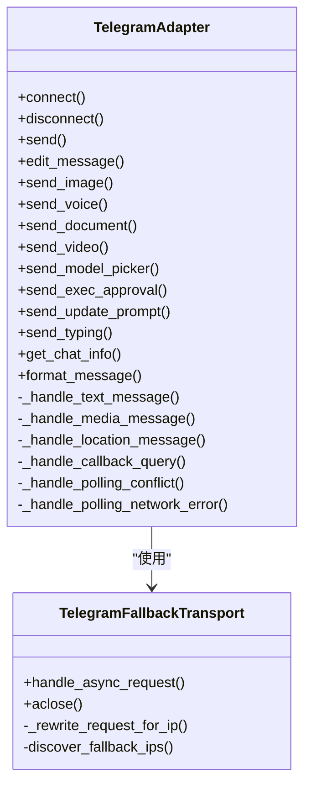

# Telegram集成

<cite>
**本文档引用的文件**
- [gateway/platforms/telegram.py](file://gateway/platforms/telegram.py)
- [gateway/platforms/telegram_network.py](file://gateway/platforms/telegram_network.py)
- [gateway/config.py](file://gateway/config.py)
- [tests/gateway/test_telegram_documents.py](file://tests/gateway/test_telegram_documents.py)
- [website/docs/user-guide/messaging/telegram.md](file://website/docs/user-guide/messaging/telegram.md)
- [hermes_cli/setup.py](file://hermes_cli/setup.py)
</cite>

## 目录
1. [简介](#简介)
2. [项目结构](#项目结构)
3. [核心组件](#核心组件)
4. [架构总览](#架构总览)
5. [详细组件分析](#详细组件分析)
6. [依赖关系分析](#依赖关系分析)
7. [性能考虑](#性能考虑)
8. [故障排除指南](#故障排除指南)
9. [结论](#结论)
10. [附录](#附录)

## 简介
本文件面向Hermes Agent的Telegram平台适配器，系统性阐述其设计与实现，覆盖Bot API集成、Webhook与长轮询两种接入模式、消息处理流程（文本、媒体、位置）、用户认证与权限控制、群组/论坛话题管理、频道订阅、机器人权限配置、Telegram特有能力（Inline模式、键盘按钮、文件大小限制、UTF-16字符编码处理），以及网络代理、防火墙配置、故障排除与性能优化建议。

## 项目结构
Telegram适配器位于网关平台层，核心代码集中在两个文件中：
- 平台适配器：gateway/platforms/telegram.py
- 网络增强（回退传输、DNS解析）：gateway/platforms/telegram_network.py
- 配置桥接与环境变量映射：gateway/config.py
- 文档与CLI配置辅助：website/docs/user-guide/messaging/telegram.md、hermes_cli/setup.py
- 单元测试（含文档处理等场景）：tests/gateway/test_telegram_documents.py

**图表来源**
- [gateway/platforms/telegram.py](file://gateway/platforms/telegram.py)
- [gateway/platforms/telegram_network.py](file://gateway/platforms/telegram_network.py)
- [gateway/config.py](file://gateway/config.py)
- [website/docs/user-guide/messaging/telegram.md](file://website/docs/user-guide/messaging/telegram.md)
- [hermes_cli/setup.py](file://hermes_cli/setup.py)
- [tests/gateway/test_telegram_documents.py](file://tests/gateway/test_telegram_documents.py)

**章节来源**
- [gateway/platforms/telegram.py](file://gateway/platforms/telegram.py)
- [gateway/platforms/telegram_network.py](file://gateway/platforms/telegram_network.py)
- [gateway/config.py](file://gateway/config.py)
- [website/docs/user-guide/messaging/telegram.md](file://website/docs/user-guide/messaging/telegram.md)
- [hermes_cli/setup.py](file://hermes_cli/setup.py)
- [tests/gateway/test_telegram_documents.py](file://tests/gateway/test_telegram_documents.py)

## 核心组件
- TelegramAdapter：平台适配器，负责连接、消息分发、发送、编辑、内联键盘交互、DM话题管理、反应标记、格式化与限流处理。
- TelegramFallbackTransport：基于HTTPX的自定义传输层，支持主域名与备用IP的透明切换，保留TLS SNI，解决特定网络环境下api.telegram.org不可达问题。
- 配置桥接：从环境变量/配置文件注入到运行时，支持Webhook、代理、回复模式、话题过滤、表情反应等。

关键特性
- 接入模式：自动检测环境变量选择Webhook或长轮询；Webhook需公网HTTPS URL与可选密钥校验。
- 消息聚合：对长文本拆分、相册/连拍图片进行缓冲合并，避免重复会话中断。
- 媒体处理：统一缓存策略，支持图片、语音、音频、视频、文档；文档类型识别与大小限制；文本文件内容注入上限。
- 权限与触发：支持@提及、回复机器人、命令、白名单用户、忽略线程、唤醒词正则等。
- 反应标记：在处理开始/完成时设置表情，便于用户感知状态。
- 网络健壮性：内置重连、冲突检测、网络错误指数回退、代理与回退IP支持。

**章节来源**
- [gateway/platforms/telegram.py](file://gateway/platforms/telegram.py)
- [gateway/platforms/telegram_network.py](file://gateway/platforms/telegram_network.py)
- [gateway/config.py](file://gateway/config.py)

## 架构总览
下图展示Telegram适配器与底层库、网络层及配置的关系：

**图表来源**
- [gateway/platforms/telegram.py](file://gateway/platforms/telegram.py)
- [gateway/platforms/telegram_network.py](file://gateway/platforms/telegram_network.py)

## 详细组件分析

### 连接与接入模式（Webhook vs 长轮询）
- Webhook模式
  - 通过环境变量启用：TELEGRAM_WEBHOOK_URL（必需，公网HTTPS）、可选端口与密钥。
  - 启动本地HTTP服务器监听，注册到Telegram，接收推送更新。
  - 适合云平台常驻实例，可被外部请求唤醒。
- 长轮询模式
  - 默认模式，主动向Telegram拉取更新。
  - 自动清理历史webhook，避免冲突。
  - 内置网络错误重连与冲突检测，指数回退并上报致命错误。

**图表来源**
- [gateway/platforms/telegram.py](file://gateway/platforms/telegram.py)

**章节来源**
- [gateway/platforms/telegram.py](file://gateway/platforms/telegram.py)
- [website/docs/user-guide/messaging/telegram.md](file://website/docs/user-guide/messaging/telegram.md)

### 消息处理流程（文本/媒体/位置）
- 文本消息
  - 触发规则：私聊直接处理；群组需满足“免打扰”白名单、@提及、回复机器人、命令、唤醒词等任一条件。
  - 长文本拆分：客户端侧拆分的多段消息会在短时间内合并为单个MessageEvent，避免重复处理。
- 媒体消息
  - 类型识别：贴图、图片、视频、音频、语音、文档等。
  - 缓存策略：下载到本地缓存目录，供后续视觉分析/转写使用；相册/连拍按时间窗口合并为一次事件。
  - 文档处理：扩展名/类型识别、大小限制（20MB）、文本文件内容注入（UTF-8，最大100KB）。
- 位置消息
  - 提取经纬度与可选地点信息，生成可读提示与地图链接。

**图表来源**
- [gateway/platforms/telegram.py](file://gateway/platforms/telegram.py)

**章节来源**
- [gateway/platforms/telegram.py](file://gateway/platforms/telegram.py)
- [tests/gateway/test_telegram_documents.py](file://tests/gateway/test_telegram_documents.py)

### 用户认证、权限与触发控制
- 认证
  - 必须配置机器人令牌（TELEGRAM_BOT_TOKEN），可通过CLI引导创建。
  - 支持用户白名单（TELEGRAM_ALLOWED_USERS），未配置时默认允许所有人。
- 触发控制
  - 私聊：无限制。
  - 群组：可配置免打扰聊天列表、是否要求@提及、忽略特定话题线程、唤醒词正则等。
- 内联按钮与审批
  - 支持交互式内联键盘（模型选择、执行审批、更新提示），回调解析后解除阻塞。

**章节来源**
- [hermes_cli/setup.py](file://hermes_cli/setup.py)
- [gateway/platforms/telegram.py](file://gateway/platforms/telegram.py)
- [gateway/config.py](file://gateway/config.py)

### 群组管理、论坛话题与频道订阅
- DM论坛话题
  - 支持在私聊中创建/识别话题线程，持久化thread_id至配置文件，重启后复用。
  - 支持热加载配置以识别外部创建的话题。
- 群组论坛话题
  - 通过配置绑定特定话题线程到技能，实现按主题路由。
- 频道订阅
  - 通过ChatType识别频道，支持频道消息处理与回复。

**章节来源**
- [gateway/platforms/telegram.py](file://gateway/platforms/telegram.py)

### Telegram特有能力
- Inline模式与内联键盘
  - 支持发送带按钮的消息，回调解析后执行动作（模型切换、执行审批、更新确认）。
- 文件大小限制与类型支持
  - 文档最大20MB；类型通过扩展名/MIME映射判定；不支持类型返回提示。
- UTF-16字符编码处理
  - 发送/编辑消息时使用UTF-16长度计算与截断，确保符合Telegram字符限制。
- MarkdownV2格式转换
  - 将通用Markdown转换为Telegram MarkdownV2，保护代码块/行内代码，转义特殊字符。

**章节来源**
- [gateway/platforms/telegram.py](file://gateway/platforms/telegram.py)

### 网络代理与防火墙配置
- 代理
  - 优先使用Telegram专用代理（TELEGRAM_PROXY），否则回退到通用HTTP/HTTPS代理。
  - 支持http/https/socks5协议。
- 回退IP与DNS
  - 当api.telegram.org不可达时，通过DoH解析获取可用IP，并以透明方式替换TCP连接目标，同时保留TLS SNI。
  - 支持手动配置回退IP列表（TELEGRAM_FALLBACK_IPS）。
- 防火墙
  - Webhook模式需要开放入站端口（默认8443），并确保公网HTTPS可达。
  - 代理模式无需入站端口，但需允许出站访问api.telegram.org。

**章节来源**
- [gateway/platforms/telegram_network.py](file://gateway/platforms/telegram_network.py)
- [gateway/platforms/telegram.py](file://gateway/platforms/telegram.py)
- [website/docs/user-guide/messaging/telegram.md](file://website/docs/user-guide/messaging/telegram.md)

## 依赖关系分析

**图表来源**
- [gateway/platforms/telegram.py](file://gateway/platforms/telegram.py)
- [gateway/platforms/telegram_network.py](file://gateway/platforms/telegram_network.py)

**章节来源**
- [gateway/platforms/telegram.py](file://gateway/platforms/telegram.py)
- [gateway/platforms/telegram_network.py](file://gateway/platforms/telegram_network.py)

## 性能考虑
- 连接池与超时
  - 可调参数：连接池大小、连接/读/写/池超时，降低网络抖动导致的连接池耗尽。
- 文本与媒体聚合
  - 文本拆分合并与相册/连拍合并减少会话中断与重复处理。
- 发送重试与洪水控制
  - 发送失败按错误类型区分重试策略；遇到“请稍后再试”自动等待；超时请求不重试以避免重复。
- 编辑消息的截断与流式处理
  - 编辑超长消息时采用前缀截断并提示，避免一次性截断导致的体验问题。
- 网络健壮性
  - 指数回退重连、冲突检测、网络错误自动恢复，保障长时间运行稳定性。

**章节来源**
- [gateway/platforms/telegram.py](file://gateway/platforms/telegram.py)

## 故障排除指南
常见问题与定位要点
- 无法启动/连接
  - 检查机器人令牌是否正确；确认网络可访问api.telegram.org或已配置代理/回退IP。
  - Webhook模式需公网HTTPS URL与可选密钥；检查端口暴露与防火墙放行。
- 长轮询冲突
  - 多实例或进程抢占导致冲突，系统会自动重试并最终上报致命错误；确保同一令牌仅有一个轮询实例。
- 网络中断
  - 出现网络错误时自动指数回退重连；超过最大尝试次数后标记致命错误并通知重启。
- 文档/媒体处理异常
  - 不支持的文档类型、超大文件、下载失败等均有明确提示；检查文件大小与类型映射。
- 内联按钮无响应
  - 确认回调解析逻辑与用户授权白名单；检查回调数据格式与会话键值。

**章节来源**
- [gateway/platforms/telegram.py](file://gateway/platforms/telegram.py)
- [tests/gateway/test_telegram_documents.py](file://tests/gateway/test_telegram_documents.py)

## 结论
Hermes Agent的Telegram适配器在保证与Telegram Bot API兼容的同时，提供了高可用的接入模式（Webhook/长轮询）、稳健的网络层（代理与回退IP）、完善的媒体处理与消息聚合能力，并通过内联键盘与反应标记提升了用户体验。结合严格的权限控制与触发规则，可在复杂群组环境中稳定运行。

## 附录

### 配置清单与示例
- 令牌与接入模式
  - TELEGRAM_BOT_TOKEN：机器人令牌
  - TELEGRAM_WEBHOOK_URL：公网HTTPS地址（启用Webhook）
  - TELEGRAM_WEBHOOK_PORT：本地监听端口（默认8443）
  - TELEGRAM_WEBHOOK_SECRET：更新校验密钥（推荐）
- 运行行为
  - TELEGRAM_REPLY_TO_MODE：回复模式（off/first/all）
  - TELEGRAM_REQUIRE_MENTION：群组是否要求@提及
  - TELEGRAM_FREE_RESPONSE_CHATS：免打扰群组ID列表
  - TELEGRAM_IGNORED_THREADS：忽略的话题线程ID列表
  - TELEGRAM_MENTION_PATTERNS：唤醒词正则（JSON字符串）
  - TELEGRAM_REACTIONS：启用消息反应标记
- 网络与代理
  - TELEGRAM_PROXY：Telegram专用代理URL
  - TELEGRAM_FALLBACK_IPS：回退IP列表（逗号分隔）
  - HERMES_TELEGRAM_HTTP_*：HTTP连接池与超时参数
- DM论坛话题
  - config.yaml中的telegram.extra.dm_topics：配置私聊话题与图标

**章节来源**
- [gateway/config.py](file://gateway/config.py)
- [website/docs/user-guide/messaging/telegram.md](file://website/docs/user-guide/messaging/telegram.md)
- [hermes_cli/setup.py](file://hermes_cli/setup.py)