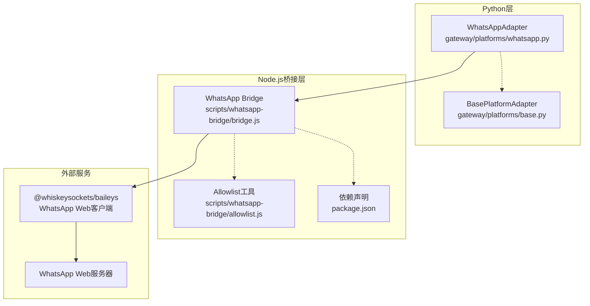
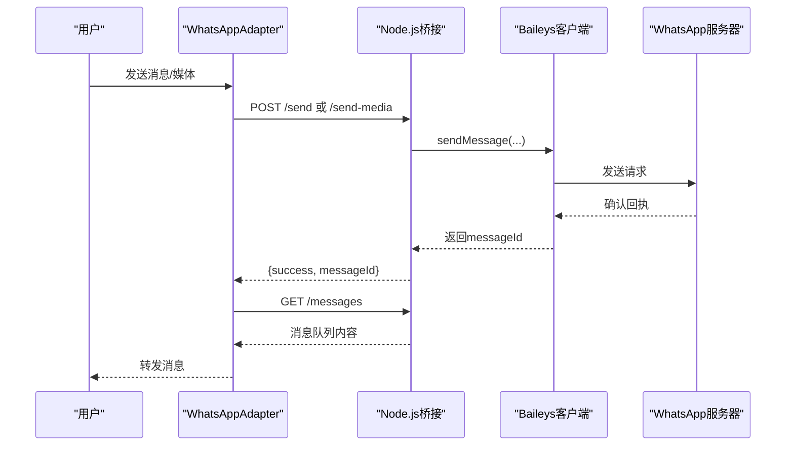
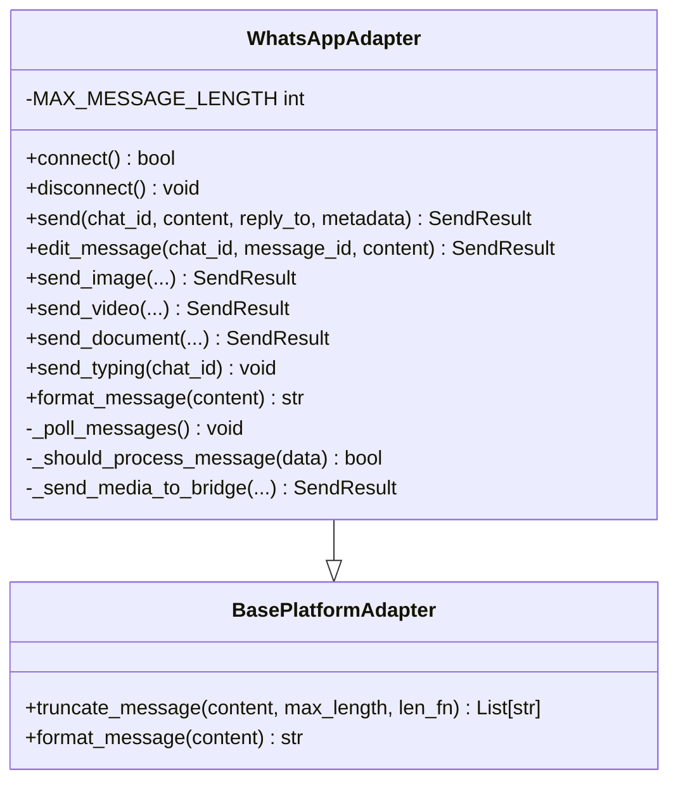
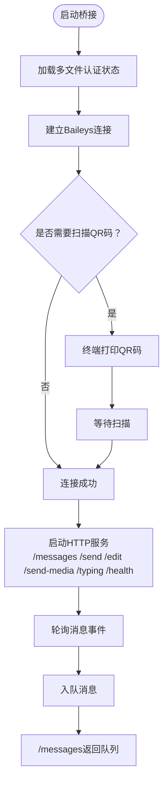
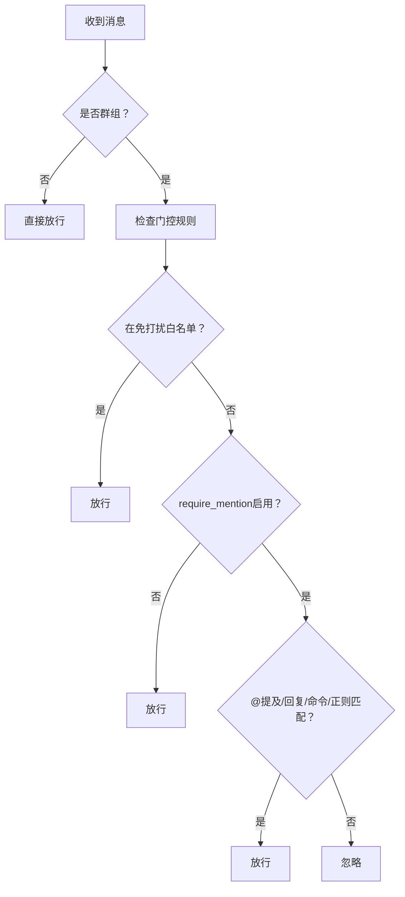
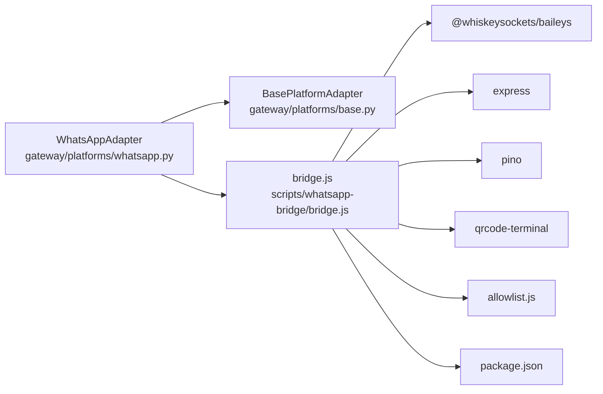

# WhatsApp集成

<cite>
**本文档引用的文件**
- [gateway/platforms/whatsapp.py](file://gateway/platforms/whatsapp.py)
- [scripts/whatsapp-bridge/bridge.js](file://scripts/whatsapp-bridge/bridge.js)
- [scripts/whatsapp-bridge/package.json](file://scripts/whatsapp-bridge/package.json)
- [scripts/whatsapp-bridge/allowlist.js](file://scripts/whatsapp-bridge/allowlist.js)
- [website/docs/user-guide/messaging/whatsapp.md](file://website/docs/user-guide/messaging/whatsapp.md)
- [tests/gateway/test_whatsapp_connect.py](file://tests/gateway/test_whatsapp_connect.py)
- [tests/gateway/test_whatsapp_formatting.py](file://tests/gateway/test_whatsapp_formatting.py)
- [tests/gateway/test_whatsapp_group_gating.py](file://tests/gateway/test_whatsapp_group_gating.py)
- [gateway/platforms/base.py](file://gateway/platforms/base.py)
- [agent/prompt_builder.py](file://agent/prompt_builder.py)
</cite>

## 目录
1. [简介](#简介)
2. [项目结构](#项目结构)
3. [核心组件](#核心组件)
4. [架构总览](#架构总览)
5. [详细组件分析](#详细组件分析)
6. [依赖关系分析](#依赖关系分析)
7. [性能考虑](#性能考虑)
8. [故障排除指南](#故障排除指南)
9. [结论](#结论)
10. [附录](#附录)

## 简介
本文件面向Hermes Agent的WhatsApp集成，系统性阐述基于Node.js桥接的WhatsApp Business API替代方案（非官方Web协议），覆盖消息收发、状态确认、多媒体能力、群组门控与访问控制、错误处理与重连机制、配置与部署建议等。文档同时提供可视化流程图与最佳实践，帮助开发者与运维人员快速落地并稳定运行。

## 项目结构
WhatsApp集成由三层组成：
- Python网关适配器：负责连接、消息分发、格式化、限长拆分、媒体发送、打字指示等
- Node.js桥接进程：通过Baileys模拟WhatsApp Web，提供HTTP接口供Python侧调用
- 配置与测试：用户指南、单元测试与回归测试保障稳定性

**图表来源**
- [gateway/platforms/whatsapp.py:103-149](file://gateway/platforms/whatsapp.py#L103-L149)
- [scripts/whatsapp-bridge/bridge.js:21-29](file://scripts/whatsapp-bridge/bridge.js#L21-L29)
- [scripts/whatsapp-bridge/package.json:10-15](file://scripts/whatsapp-bridge/package.json#L10-L15)

**章节来源**
- [gateway/platforms/whatsapp.py:103-149](file://gateway/platforms/whatsapp.py#L103-L149)
- [scripts/whatsapp-bridge/bridge.js:1-50](file://scripts/whatsapp-bridge/bridge.js#L1-L50)
- [scripts/whatsapp-bridge/package.json:1-17](file://scripts/whatsapp-bridge/package.json#L1-L17)

## 核心组件
- WhatsAppAdapter：Python端适配器，负责启动/停止桥接进程、健康检查、消息轮询、发送/编辑/媒体发送、打字指示、格式转换与限长拆分
- Node.js桥接：独立进程，使用Baileys连接WhatsApp Web，暴露REST接口（/messages、/send、/edit、/send-media、/typing、/health）
- 允许列表工具：解析与展开允许用户标识，支持LID映射与通配符
- 基类平台适配器：提供通用的消息拆分、占位符保护、UTF-16长度计算等基础设施

**章节来源**
- [gateway/platforms/whatsapp.py:103-149](file://gateway/platforms/whatsapp.py#L103-L149)
- [scripts/whatsapp-bridge/bridge.js:363-571](file://scripts/whatsapp-bridge/bridge.js#L363-L571)
- [scripts/whatsapp-bridge/allowlist.js:1-85](file://scripts/whatsapp-bridge/allowlist.js#L1-L85)
- [gateway/platforms/base.py:2034-2165](file://gateway/platforms/base.py#L2034-L2165)

## 架构总览
WhatsApp集成采用“Python适配器 + Node.js桥接”的双进程模式，通过本地HTTP通信完成消息收发与状态同步。桥接进程负责与WhatsApp Web交互，Python适配器负责业务逻辑与平台抽象。

**图表来源**
- [gateway/platforms/whatsapp.py:592-683](file://gateway/platforms/whatsapp.py#L592-L683)
- [scripts/whatsapp-bridge/bridge.js:367-419](file://scripts/whatsapp-bridge/bridge.js#L367-L419)

## 详细组件分析

### WhatsAppAdapter（Python）
- 连接管理：自动检测Node.js、安装依赖、拉起桥接进程、健康检查、端口占用清理、会话持久化
- 消息处理：轮询/长轮询获取消息、去重（最近发送ID）、群组门控（@提及/回复/正则唤醒词/免打扰群白名单）
- 发送与编辑：格式化Markdown为WhatsApp语法、按4096字符拆分、首段带reply_to、后续段落去reply_to
- 多媒体：图片/视频/音频/文档原生发送，支持本地路径与URL缓存
- 打字指示：向桥接发送typing请求
- 错误处理：桥接进程异常标记致命错误、日志文件句柄安全关闭、连接失败路径资源回收

**图表来源**
- [gateway/platforms/whatsapp.py:103-149](file://gateway/platforms/whatsapp.py#L103-L149)
- [gateway/platforms/base.py:2023-2032](file://gateway/platforms/base.py#L2023-L2032)

**章节来源**
- [gateway/platforms/whatsapp.py:274-534](file://gateway/platforms/whatsapp.py#L274-L534)
- [gateway/platforms/whatsapp.py:592-800](file://gateway/platforms/whatsapp.py#L592-L800)

### Node.js桥接（bridge.js）
- 连接与认证：多文件认证状态、浏览器指纹、自动重连（含515重启码）、QR码显示
- 消息轮询：内部消息队列，/messages长轮询返回
- 发送与编辑：/send发送文本，/edit编辑已发消息；/send-media原生发送图片/视频/音频/文档
- 媒体下载：自动下载图片/视频/音频/文档并缓存到本地临时目录
- 允许列表：支持通配符“*”与LID映射，严格过滤未知发送者
- 健康检查：/health返回连接状态、队列长度、运行时长

**图表来源**
- [scripts/whatsapp-bridge/bridge.js:123-180](file://scripts/whatsapp-bridge/bridge.js#L123-L180)
- [scripts/whatsapp-bridge/bridge.js:363-371](file://scripts/whatsapp-bridge/bridge.js#L363-L371)

**章节来源**
- [scripts/whatsapp-bridge/bridge.js:123-180](file://scripts/whatsapp-bridge/bridge.js#L123-L180)
- [scripts/whatsapp-bridge/bridge.js:363-515](file://scripts/whatsapp-bridge/bridge.js#L363-L515)

### 允许列表与群组门控
- 允许列表：支持通配符“*”、逗号分隔的手机号、LID映射文件透明解析
- 群组门控：可配置require_mention、mention_patterns正则唤醒词、free_response_chats免打扰群白名单
- DM始终放行，群聊需满足@提及/回复/命令前缀/正则唤醒词之一

**图表来源**
- [gateway/platforms/whatsapp.py:257-273](file://gateway/platforms/whatsapp.py#L257-L273)
- [scripts/whatsapp-bridge/allowlist.js:66-84](file://scripts/whatsapp-bridge/allowlist.js#L66-L84)

**章节来源**
- [gateway/platforms/whatsapp.py:150-196](file://gateway/platforms/whatsapp.py#L150-L196)
- [gateway/platforms/whatsapp.py:257-273](file://gateway/platforms/whatsapp.py#L257-L273)
- [scripts/whatsapp-bridge/allowlist.js:1-85](file://scripts/whatsapp-bridge/allowlist.js#L1-L85)

### 多媒体与交互能力
- 图片/视频/音频/文档原生发送，支持caption与自定义文件名
- 语音消息：接收侧自动转写（STT），回复侧自动TTS为MP3附件
- 互动按钮/列表：桥接解析buttonsMessage/listMessage并透传至消息事件
- 位置/联系人名片：当前实现聚焦文本与媒体，位置/名片需结合Agent提示词与工具链扩展

**章节来源**
- [gateway/platforms/whatsapp.py:684-783](file://gateway/platforms/whatsapp.py#L684-L783)
- [scripts/whatsapp-bridge/bridge.js:240-311](file://scripts/whatsapp-bridge/bridge.js#L240-L311)
- [website/docs/user-guide/messaging/whatsapp.md:160-174](file://website/docs/user-guide/messaging/whatsapp.md#L160-L174)

### 消息格式化与限长拆分
- Markdown兼容转换：粗体、删除线、标题、链接等转换为WhatsApp语法；代码块与行内代码保持原样
- 限长拆分：默认4096字符/块，保留代码块边界与语言标签，自动追加“(X/Y)”序号
- 首段reply_to，后续段落去除reply_to避免重复引用

**章节来源**
- [gateway/platforms/whatsapp.py:535-591](file://gateway/platforms/whatsapp.py#L535-L591)
- [gateway/platforms/base.py:2034-2165](file://gateway/platforms/base.py#L2034-L2165)
- [tests/gateway/test_whatsapp_formatting.py:69-135](file://tests/gateway/test_whatsapp_formatting.py#L69-L135)

### 客户端提示词与平台特性
- 平台提示词明确指出WhatsApp不渲染markdown，支持原生媒体发送
- Agent可通过MEDIA占位符或图片URL触发原生媒体发送

**章节来源**
- [agent/prompt_builder.py:285-295](file://agent/prompt_builder.py#L285-L295)

## 依赖关系分析

**图表来源**
- [gateway/platforms/whatsapp.py:72-81](file://gateway/platforms/whatsapp.py#L72-L81)
- [scripts/whatsapp-bridge/bridge.js:21-29](file://scripts/whatsapp-bridge/bridge.js#L21-L29)
- [scripts/whatsapp-bridge/package.json:10-15](file://scripts/whatsapp-bridge/package.json#L10-L15)

**章节来源**
- [gateway/platforms/whatsapp.py:72-81](file://gateway/platforms/whatsapp.py#L72-L81)
- [scripts/whatsapp-bridge/bridge.js:21-29](file://scripts/whatsapp-bridge/bridge.js#L21-L29)
- [scripts/whatsapp-bridge/package.json:1-17](file://scripts/whatsapp-bridge/package.json#L1-L17)

## 性能考虑
- 消息拆分：4096字符/块，避免超长导致不可读；多段消息自动编号
- 速率控制：发送多段之间有短延迟，降低被限流风险
- 本地缓存：图片/视频/音频/文档下载后缓存，减少重复传输
- 连接健壮性：桥接进程异常自动标记致命错误并通知；健康检查与重连逻辑
- 资源回收：连接失败路径确保日志文件句柄关闭，避免FD泄漏

[本节为通用指导，无需具体文件引用]

## 故障排除指南
常见问题与解决步骤：
- QR码无法扫描/过期：确保终端宽度足够、使用正确号码、必要时重新生成QR
- 会话未持久化：检查会话目录权限与可写性，容器场景挂载持久卷
- 设备被取消链接：保持设备在线并网络稳定，必要时重新配对
- 桥接崩溃/重连循环：更新Hermes版本并重新配对，以适配WhatsApp协议变更
- 收不到消息：核对允许列表配置（手机号、通配符、LID映射），开启调试日志查看原始事件
- 私有号静默陌生人：在配置中设置“忽略”策略

**章节来源**
- [website/docs/user-guide/messaging/whatsapp.md:204-241](file://website/docs/user-guide/messaging/whatsapp.md#L204-L241)
- [tests/gateway/test_whatsapp_connect.py:148-332](file://tests/gateway/test_whatsapp_connect.py#L148-L332)

## 结论
该WhatsApp集成通过Python适配器与Node.js桥接的解耦设计，在不依赖官方Business API的前提下实现了稳定的双向消息通道。其特性包括：灵活的群组门控、多媒体原生发送、消息限长拆分与格式转换、健壮的错误处理与重连机制。配合严格的访问控制与安全建议，可在生产环境中安全运行。

[本节为总结性内容，无需具体文件引用]

## 附录

### 配置与部署要点
- 启用与模式：在环境变量中设置WHATSAPP_ENABLED与WHATSAPP_MODE（bot/self-chat）
- 允许列表：WHATSAPP_ALLOWED_USERS支持通配符“*”或具体手机号；可结合LID映射
- 回复前缀：通过配置项自定义或禁用（默认包含品牌标识）
- 服务安装：支持用户服务与系统服务安装，确保PATH正确注入

**章节来源**
- [website/docs/user-guide/messaging/whatsapp.md:91-129](file://website/docs/user-guide/messaging/whatsapp.md#L91-L129)
- [website/docs/user-guide/messaging/whatsapp.md:168-173](file://website/docs/user-guide/messaging/whatsapp.md#L168-L173)

### 测试与回归
- 连接流程：覆盖桥接进程生命周期、健康检查、文件句柄关闭、致命错误标记
- 格式化与拆分：验证Markdown转换、限长拆分、首段reply_to行为
- 群组门控：验证require_mention、正则唤醒词、免打扰群白名单、DM放行

**章节来源**
- [tests/gateway/test_whatsapp_connect.py:148-332](file://tests/gateway/test_whatsapp_connect.py#L148-L332)
- [tests/gateway/test_whatsapp_formatting.py:69-235](file://tests/gateway/test_whatsapp_formatting.py#L69-L235)
- [tests/gateway/test_whatsapp_group_gating.py:39-143](file://tests/gateway/test_whatsapp_group_gating.py#L39-L143)