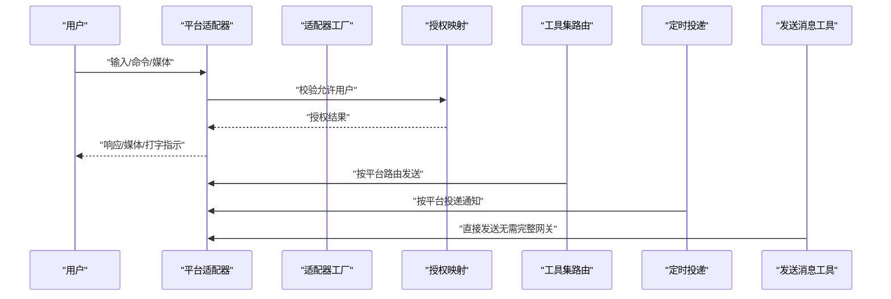
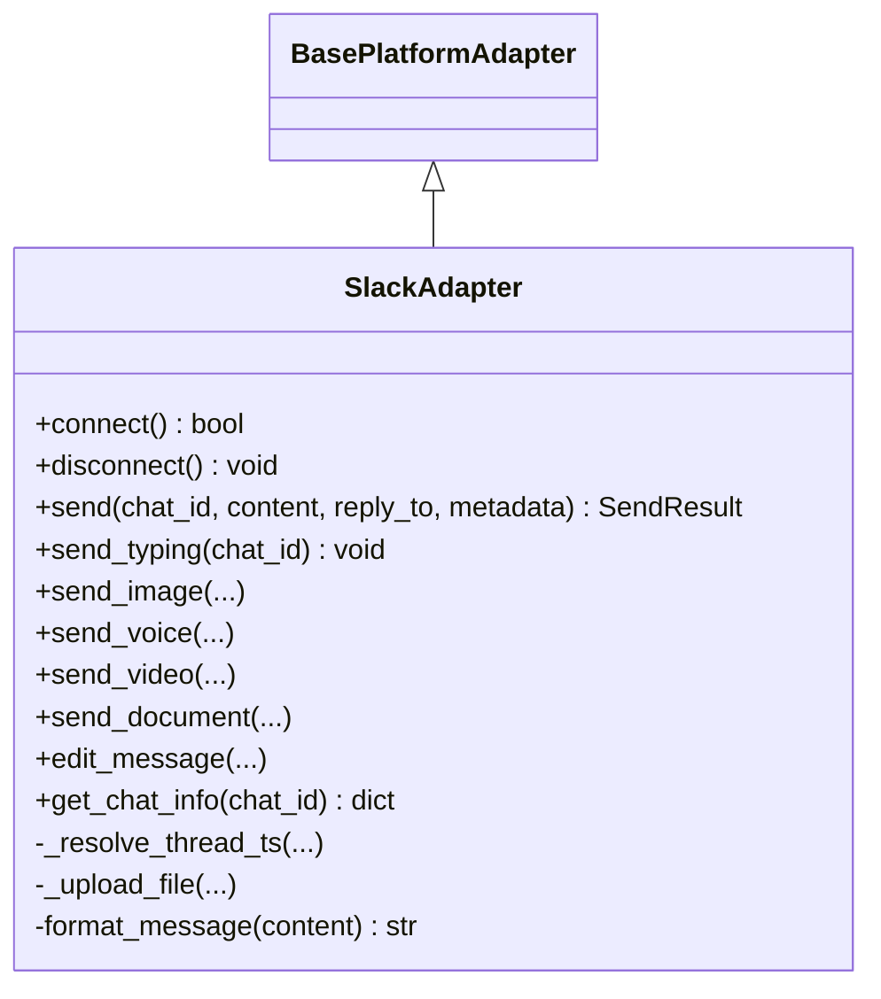
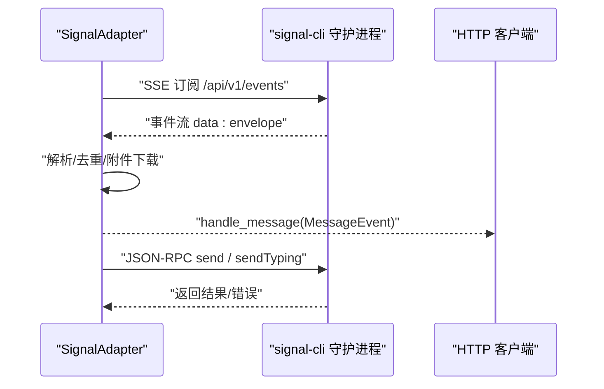
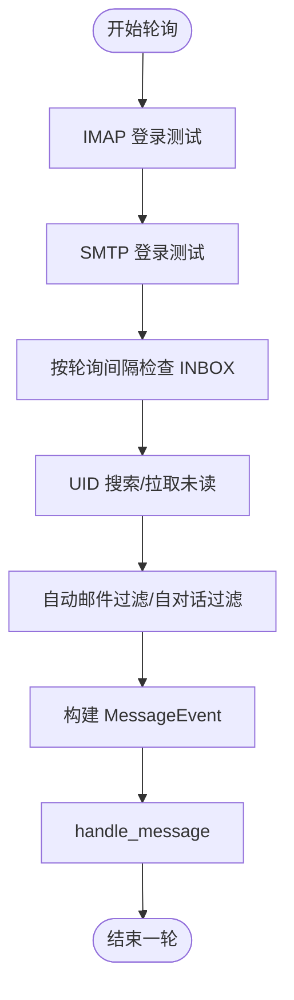
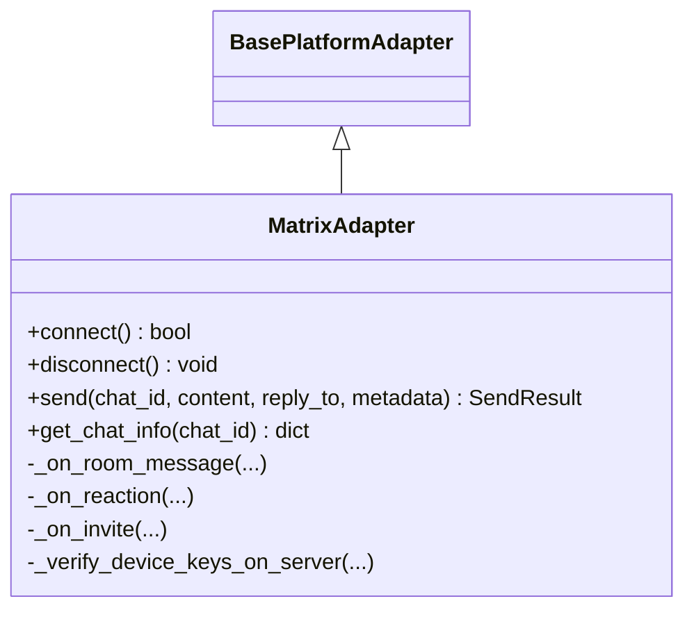
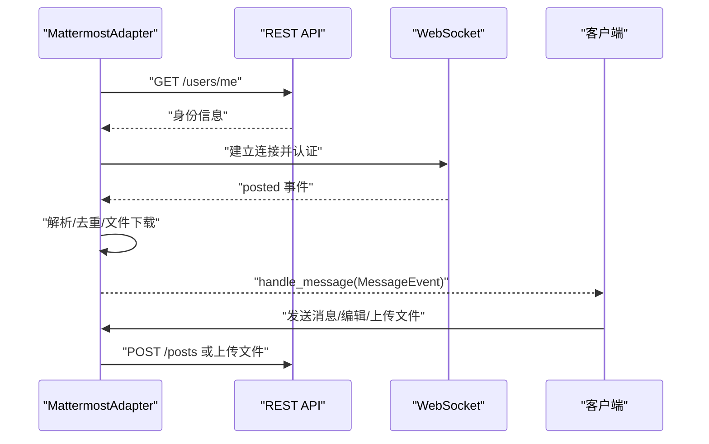
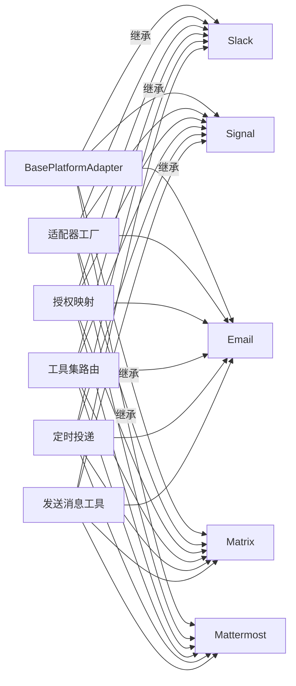

# 其他平台集成

<cite>
**本文档引用的文件**
- [gateway/platforms/ADDING_A_PLATFORM.md](file://gateway/platforms/ADDING_A_PLATFORM.md)
- [gateway/platforms/base.py](file://gateway/platforms/base.py)
- [gateway/platforms/slack.py](file://gateway/platforms/slack.py)
- [gateway/platforms/signal.py](file://gateway/platforms/signal.py)
- [gateway/platforms/email.py](file://gateway/platforms/email.py)
- [gateway/platforms/matrix.py](file://gateway/platforms/matrix.py)
- [gateway/platforms/mattermost.py](file://gateway/platforms/mattermost.py)
</cite>

## 目录
1. [简介](#简介)
2. [项目结构](#项目结构)
3. [核心组件](#核心组件)
4. [架构总览](#架构总览)
5. [详细组件分析](#详细组件分析)
6. [依赖关系分析](#依赖关系分析)
7. [性能考量](#性能考量)
8. [故障排查指南](#故障排查指南)
9. [结论](#结论)
10. [附录](#附录)

## 简介
本文件面向需要在 Hermes Agent 中集成其他消息平台（如 Slack、Signal、Email、Matrix、Mattermost 等）的开发者与运维人员。内容覆盖：
- 平台能力概览与差异对比（消息格式、权限模型、API 限制）
- 平台选择与集成优先级建议
- 安全与合规注意事项
- 新平台适配流程（接口实现、配置管理、测试策略）
- 平台间迁移与最佳实践

## 项目结构
Hermes 的“网关平台”模块位于 gateway/platforms 下，采用统一的适配器基类与标准化的生命周期与消息处理流程。新增平台需遵循“平台适配器 + 配置 + 工厂注册 + 授权映射 + 工具路由 + 文档与测试”的完整清单。

```mermaid
graph TB
subgraph "平台适配层"
Base["BasePlatformAdapter<br/>统一抽象与工具"]
Slack["SlackAdapter"]
Signal["SignalAdapter"]
Email["EmailAdapter"]
Matrix["MatrixAdapter"]
Mattermost["MattermostAdapter"]
end
subgraph "运行时集成"
Factory["适配器工厂<br/>run.py"]
Auth["授权映射<br/>run.py"]
Toolset["工具集路由<br/>toolsets.py"]
Cron["定时投递<br/>scheduler.py"]
SendTool["发送消息工具<br/>send_message_tool.py"]
Status["状态展示<br/>hermes_cli/status.py"]
Setup["安装向导<br/>hermes_cli/gateway.py"]
end
Base --> Slack
Base --> Signal
Base --> Email
Base --> Matrix
Base --> Mattermost
Factory --> Slack
Factory --> Signal
Factory --> Email
Factory --> Matrix
Factory --> Mattermost
Auth --> Slack
Auth --> Signal
Auth --> Email
Auth --> Matrix
Auth --> Mattermost
Toolset --> Slack
Toolset --> Signal
Toolset --> Email
Toolset --> Matrix
Toolset --> Mattermost
Cron --> Slack
Cron --> Signal
Cron --> Email
Cron --> Matrix
Cron --> Mattermost
SendTool --> Slack
SendTool --> Signal
SendTool --> Email
SendTool --> Matrix
SendTool --> Mattermost
Status --> Slack
Status --> Signal
Status --> Email
Status --> Matrix
Status --> Mattermost
Setup --> Slack
Setup --> Signal
Setup --> Email
Setup --> Matrix
Setup --> Mattermost
```

图示来源
- [gateway/platforms/base.py](file://gateway/platforms/base.py)
- [gateway/platforms/slack.py](file://gateway/platforms/slack.py)
- [gateway/platforms/signal.py](file://gateway/platforms/signal.py)
- [gateway/platforms/email.py](file://gateway/platforms/email.py)
- [gateway/platforms/matrix.py](file://gateway/platforms/matrix.py)
- [gateway/platforms/mattermost.py](file://gateway/platforms/mattermost.py)

章节来源
- [gateway/platforms/ADDING_A_PLATFORM.md](file://gateway/platforms/ADDING_A_PLATFORM.md)

## 核心组件
- 基类与通用能力
  - 统一的消息事件模型、发送结果模型、消息类型枚举、去重与合并策略、媒体缓存工具、代理与安全下载、UTF-16 长度计算与截断、SSRF 防护等。
- 平台适配器
  - Slack：Socket Mode、多工作区、线程、Slash 命令、反应与打字指示、Markdown 到 mrkdwn 转换。
  - Signal：HTTP 守护进程 + SSE、JSON-RPC、自对话过滤、附件大小限制、健康检查与重连。
  - Email：IMAP 拉取、SMTP 发送、自动邮件识别与跳过、主题与回复链路、附件缓存。
  - Matrix：mautrix SDK、可选端到端加密、房间类型识别、提及与线程、HTML 渲染、密钥轮换与恢复。
  - Mattermost：REST API + WebSocket、提及/自由响应控制、线程回复模式、文件上传与下载。

章节来源
- [gateway/platforms/base.py](file://gateway/platforms/base.py)
- [gateway/platforms/slack.py](file://gateway/platforms/slack.py)
- [gateway/platforms/signal.py](file://gateway/platforms/signal.py)
- [gateway/platforms/email.py](file://gateway/platforms/email.py)
- [gateway/platforms/matrix.py](file://gateway/platforms/matrix.py)
- [gateway/platforms/mattermost.py](file://gateway/platforms/mattermost.py)

## 架构总览
下图展示了从平台适配器到运行时集成的关键交互路径：适配器负责连接、接收与发送；工厂负责实例化；授权映射决定用户可用性；工具集与定时任务通过平台映射进行消息投递；状态与安装向导提供可观测性与配置入口。

图示来源
- [gateway/platforms/slack.py](file://gateway/platforms/slack.py)
- [gateway/platforms/signal.py](file://gateway/platforms/signal.py)
- [gateway/platforms/email.py](file://gateway/platforms/email.py)
- [gateway/platforms/matrix.py](file://gateway/platforms/matrix.py)
- [gateway/platforms/mattermost.py](file://gateway/platforms/mattermost.py)

## 详细组件分析

### Slack 适配器
- 连接与认证：Socket Mode + 多工作区支持，令牌加载与锁机制。
- 消息处理：@提及、线程、Slash 命令、反应、打字指示（assistant.threads.setStatus 回退到 reaction）。
- 发送与编辑：Markdown → mrkdwn 转换、超长分片、线程回复、广播回复控制。
- 附件：图片/音频/视频/文档上传，URL 下载缓存。
- 性能与稳定性：去重、线程上下文缓存、限流与回退。

图示来源
- [gateway/platforms/base.py](file://gateway/platforms/base.py)
- [gateway/platforms/slack.py](file://gateway/platforms/slack.py)

章节来源
- [gateway/platforms/slack.py](file://gateway/platforms/slack.py)

### Signal 适配器
- 连接与认证：signal-cli HTTP 守护进程，健康检查与 SSE 流。
- 消息处理：SSE 事件解析、@提及渲染、群组白名单、自对话过滤、附件下载缓存。
- 发送与编辑：JSON-RPC 调用、打字指示循环、附件大小限制、错误处理与回退。
- 性能与稳定性：指数退避 + 抖动、空闲检测与强制重连、最近发送时间戳去重。

图示来源
- [gateway/platforms/signal.py](file://gateway/platforms/signal.py)

章节来源
- [gateway/platforms/signal.py](file://gateway/platforms/signal.py)

### Email 适配器
- 连接与认证：IMAP 登录测试、SMTP 登录测试、轮询间隔。
- 消息处理：自动邮件识别与跳过、主题与回复链路、正文提取与 HTML 清理、附件缓存。
- 发送与编辑：SMTP 发送、线程头设置、消息 ID 生成。
- 性能与稳定性：UID 去重集合、内存上限裁剪、线程上下文缓存。

图示来源
- [gateway/platforms/email.py](file://gateway/platforms/email.py)

章节来源
- [gateway/platforms/email.py](file://gateway/platforms/email.py)

### Matrix 适配器
- 连接与认证：mautrix SDK、访问令牌或密码登录、设备 ID 与会话持久化。
- 加解密：可选端到端加密、密钥存储与验证、交叉签名恢复。
- 消息处理：提及/线程/反应、HTML 渲染、DM 房间识别、初始同步与增量同步。
- 性能与稳定性：事件去重、文本批处理、密钥共享重试。

图示来源
- [gateway/platforms/base.py](file://gateway/platforms/base.py)
- [gateway/platforms/matrix.py](file://gateway/platforms/matrix.py)

章节来源
- [gateway/platforms/matrix.py](file://gateway/platforms/matrix.py)

### Mattermost 适配器
- 连接与认证：REST API 获取身份信息，WebSocket 认证与心跳。
- 消息处理：提及/自由响应通道、线程回复、文件下载与本地缓存。
- 发送与编辑：分片发送、文件上传、编辑补丁。
- 性能与稳定性：指数退避 + 抖动重连、永久错误检测停止重连。

图示来源
- [gateway/platforms/mattermost.py](file://gateway/platforms/mattermost.py)

章节来源
- [gateway/platforms/mattermost.py](file://gateway/platforms/mattermost.py)

## 依赖关系分析
- 平台适配器对基类的依赖：统一的事件模型、发送结果、媒体缓存、长度截断、代理与安全下载。
- 运行时集成点：
  - 适配器工厂：根据平台枚举与环境变量实例化具体适配器。
  - 授权映射：平台到允许用户/允许全部开关的映射。
  - 工具集路由：平台到发送工具的映射。
  - 定时投递：平台到投递逻辑的映射。
  - 发送消息工具：平台到独立发送函数的映射。
  - 状态与安装向导：平台到配置项与状态展示的映射。

图示来源
- [gateway/platforms/base.py](file://gateway/platforms/base.py)
- [gateway/platforms/slack.py](file://gateway/platforms/slack.py)
- [gateway/platforms/signal.py](file://gateway/platforms/signal.py)
- [gateway/platforms/email.py](file://gateway/platforms/email.py)
- [gateway/platforms/matrix.py](file://gateway/platforms/matrix.py)
- [gateway/platforms/mattermost.py](file://gateway/platforms/mattermost.py)

章节来源
- [gateway/platforms/ADDING_A_PLATFORM.md](file://gateway/platforms/ADDING_A_PLATFORM.md)

## 性能考量
- 消息截断与分片
  - Slack/Mattermost/Matrix 等平台存在消息长度限制，适配器使用统一的截断工具进行分片发送，并保留上下文。
- 媒体处理
  - 所有平台均支持图片/音频/文档缓存，避免平台 URL 过期导致的二次下载失败。
- 连接稳定性
  - Signal 与 Mattermost 使用指数退避 + 抖动重连；Matrix 支持 E2EE 密钥共享与设备键验证。
- 去重与批处理
  - 基类提供去重与快速文本批处理策略，减少重复与抖动。

章节来源
- [gateway/platforms/base.py](file://gateway/platforms/base.py)
- [gateway/platforms/signal.py](file://gateway/platforms/signal.py)
- [gateway/platforms/mattermost.py](file://gateway/platforms/mattermost.py)
- [gateway/platforms/matrix.py](file://gateway/platforms/matrix.py)

## 故障排查指南
- 常见问题定位
  - 无法连接：检查令牌/URL/网络代理；查看平台日志中的连接失败原因。
  - 无消息响应：确认授权映射与允许用户列表；检查提及/自由响应配置。
  - 媒体发送失败：确认 URL 可达且非内网地址（SSRF 保护）；检查附件大小限制。
  - 重连频繁：Signal 的健康检查与重连参数；Mattermost 的永久错误检测。
- 日志与可观测性
  - 各平台适配器均输出详细日志；状态展示与安装向导提供配置提示。

章节来源
- [gateway/platforms/signal.py](file://gateway/platforms/signal.py)
- [gateway/platforms/mattermost.py](file://gateway/platforms/mattermost.py)
- [gateway/platforms/email.py](file://gateway/platforms/email.py)
- [gateway/platforms/matrix.py](file://gateway/platforms/matrix.py)
- [gateway/platforms/slack.py](file://gateway/platforms/slack.py)

## 结论
Hermes 的平台适配体系以统一基类为核心，辅以完善的运行时集成点与测试规范，使得新增平台的成本可控、风险可降。推荐优先集成具备实时双向通信与丰富媒体能力的平台（如 Slack、Signal、Matrix），再扩展至 Email、Mattermost 等异步/低频场景。

## 附录

### 平台能力与差异对比
- 消息格式
  - Slack：mrkdwn；Signal/Mattermost：标准 Markdown；Matrix：HTML 渲染；Email：纯文本/HTML 清洗。
- 权限模型
  - Slack/Mattermost/Matrix：基于提及/房间成员；Signal：账户与群组白名单；Email：发件人允许列表。
- API 限制
  - Slack：约 40000 字符；Signal：约 8000 字符；Matrix：约 4000 字符；Mattermost：约 4000 字符；Email：约 50000 字符。
- 实时性
  - Slack/Signal/Matrix/Mattermost：实时事件；Email：轮询。

章节来源
- [gateway/platforms/slack.py](file://gateway/platforms/slack.py)
- [gateway/platforms/signal.py](file://gateway/platforms/signal.py)
- [gateway/platforms/email.py](file://gateway/platforms/email.py)
- [gateway/platforms/matrix.py](file://gateway/platforms/matrix.py)
- [gateway/platforms/mattermost.py](file://gateway/platforms/mattermost.py)

### 平台选择与集成优先级建议
- 优先级建议
  - 高：Slack（生态完善、线程与多媒体）、Signal（端到端、SSE）、Matrix（开源生态、E2EE）。
  - 中：Mattermost（企业私有部署）、Email（低频但稳定）。
- 选择依据
  - 实时性需求、安全性要求、部署形态（公有云/私有）、合规与审计。

章节来源
- [gateway/platforms/slack.py](file://gateway/platforms/slack.py)
- [gateway/platforms/signal.py](file://gateway/platforms/signal.py)
- [gateway/platforms/matrix.py](file://gateway/platforms/matrix.py)
- [gateway/platforms/mattermost.py](file://gateway/platforms/mattermost.py)
- [gateway/platforms/email.py](file://gateway/platforms/email.py)

### 安全与合规要点
- SSRF 防护：所有远程下载均进行 URL 安全校验与重定向防护。
- 代理与网络：支持 HTTP/SOCKS 代理与系统代理自动探测。
- E2EE：Matrix 提供端到端加密与密钥轮换支持。
- 数据最小化：日志中敏感标识（电话号码、令牌）会被脱敏处理。

章节来源
- [gateway/platforms/base.py](file://gateway/platforms/base.py)
- [gateway/platforms/matrix.py](file://gateway/platforms/matrix.py)
- [gateway/platforms/signal.py](file://gateway/platforms/signal.py)

### 新平台适配流程（实现清单）
- 必备步骤
  - 实现适配器：继承基类、实现 connect/disconnect/send/send_typing 等方法。
  - 平台枚举与配置：在平台枚举中注册新平台，支持环境变量加载。
  - 适配器工厂：在工厂中注册新平台的构造与依赖检查。
  - 授权映射：在授权映射中加入允许用户/允许全部开关。
  - 会话源：如需额外身份字段，在 SessionSource 中扩展。
  - 系统提示：在提示构建器中加入平台提示。
  - 工具集：在工具集中注册平台工具集与包含关系。
  - 定时投递：在调度器中加入平台映射。
  - 发送消息工具：在工具中加入平台映射与独立发送函数。
  - 状态与安装向导：在状态与安装向导中加入平台配置项。
  - 文档与测试：更新文档索引与测试清单，覆盖关键路径。
- 参考清单
  - 详见“新增平台清单”文档。

章节来源
- [gateway/platforms/ADDING_A_PLATFORM.md](file://gateway/platforms/ADDING_A_PLATFORM.md)

### 平台间迁移与最佳实践
- 迁移策略
  - 逐步切换：先在测试环境启用新平台，保留旧平台一段时间用于回滚。
  - 数据一致性：确保消息 ID/线程上下文在目标平台可复用或重建。
  - 用户通知：提前告知用户迁移计划与影响。
- 最佳实践
  - 统一消息格式转换与媒体缓存策略。
  - 明确授权边界与白名单管理。
  - 建立监控与告警，关注重连与限流指标。

章节来源
- [gateway/platforms/ADDING_A_PLATFORM.md](file://gateway/platforms/ADDING_A_PLATFORM.md)