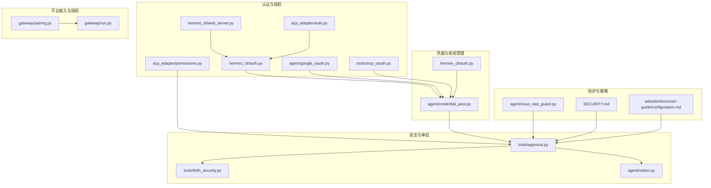
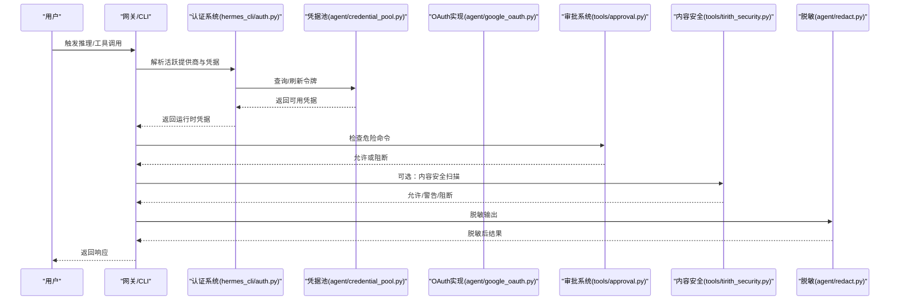
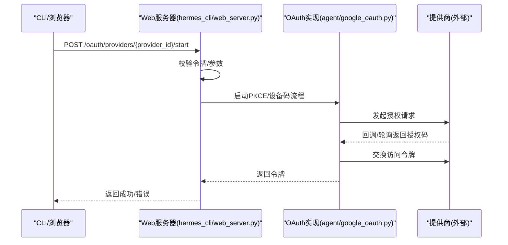
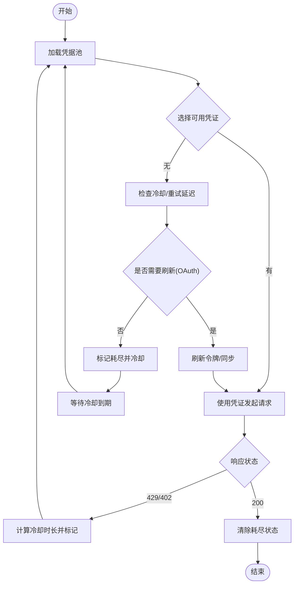
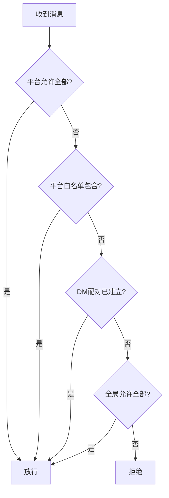
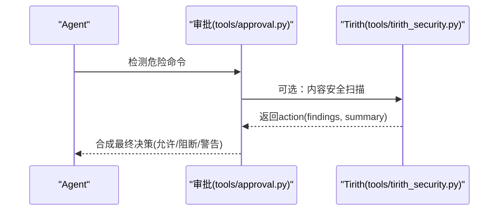
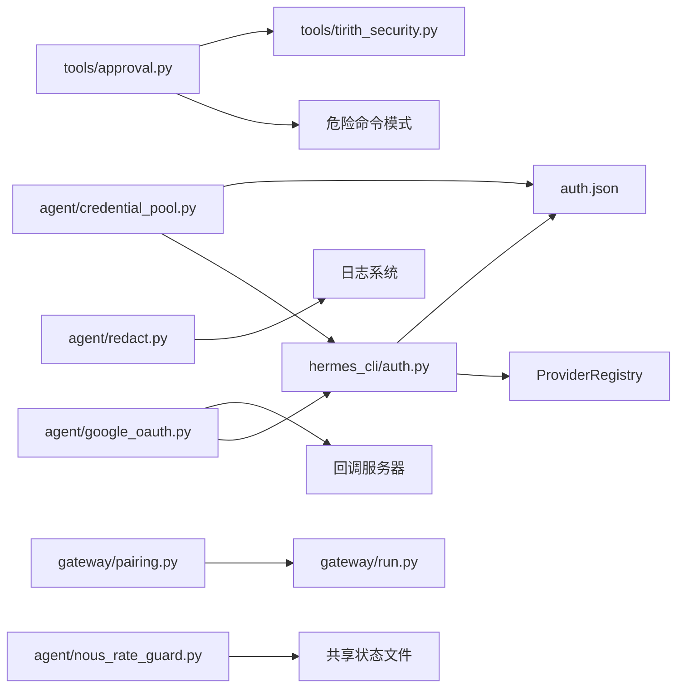

# 安全与权限管理

<cite>
**本文档引用的文件**
- [SECURITY.md](file://SECURITY.md)
- [acp_adapter/auth.py](file://acp_adapter/auth.py)
- [acp_adapter/permissions.py](file://acp_adapter/permissions.py)
- [agent/google_oauth.py](file://agent/google_oauth.py)
- [agent/credential_pool.py](file://agent/credential_pool.py)
- [agent/redact.py](file://agent/redact.py)
- [agent/nous_rate_guard.py](file://agent/nous_rate_guard.py)
- [hermes_cli/auth.py](file://hermes_cli/auth.py)
- [hermes_cli/web_server.py](file://hermes_cli/web_server.py)
- [tools/mcp_oauth.py](file://tools/mcp_oauth.py)
- [tools/approval.py](file://tools/approval.py)
- [tools/tirith_security.py](file://tools/tirith_security.py)
- [gateway/pairing.py](file://gateway/pairing.py)
- [website/docs/user-guide/configuration.md](file://website/docs/user-guide/configuration.md)
- [website/docs/developer-guide/gateway-internals.md](file://website/docs/developer-guide/gateway-internals.md)
- [website/docs/user-guide/messaging/index.md](file://website/docs/user-guide/messaging/index.md)
- [tests/agent/test_credential_pool.py](file://tests/agent/test_credential_pool.py)
- [tests/tools/test_tirith_security.py](file://tests/tools/test_tirith_security.py)
- [tests/agent/test_nous_rate_guard.py](file://tests/agent/test_nous_rate_guard.py)
</cite>

## 目录
1. [简介](#简介)
2. [项目结构](#项目结构)
3. [核心组件](#核心组件)
4. [架构总览](#架构总览)
5. [详细组件分析](#详细组件分析)
6. [依赖关系分析](#依赖关系分析)
7. [性能考虑](#性能考虑)
8. [故障排除指南](#故障排除指南)
9. [结论](#结论)
10. [附录](#附录)

## 简介
本文件面向Hermes Agent平台的安全与权限管理，系统性阐述用户授权机制、API密钥管理、访问控制策略、平台特定权限模型（用户角色、频道权限、机器人权限）、安全最佳实践（OAuth集成、令牌刷新与密钥轮换）、消息过滤与内容审核、隐私保护机制、安全配置指南、威胁模型与防护建议、合规与审计日志、以及DDoS防护、速率限制与异常行为检测等。

## 项目结构
围绕安全与权限的关键模块分布如下：
- 认证与授权：hermes_cli/auth.py、agent/google_oauth.py、tools/mcp_oauth.py、hermes_cli/web_server.py、acp_adapter/auth.py、acp_adapter/permissions.py
- 凭据与密钥管理：agent/credential_pool.py、hermes_cli/auth.py
- 危险命令审批与内容安全：tools/approval.py、tools/tirith_security.py
- 隐私与输出脱敏：agent/redact.py
- 平台接入与授权：gateway/pairing.py、website/docs/developer-guide/gateway-internals.md、website/docs/user-guide/messaging/index.md
- 速率限制与防护：agent/nous_rate_guard.py、tests/agent/test_nous_rate_guard.py
- 配置与策略：website/docs/user-guide/configuration.md
- 合规与策略：SECURITY.md

图表来源
- [hermes_cli/auth.py:107-304](file://hermes_cli/auth.py#L107-L304)
- [agent/credential_pool.py:365-780](file://agent/credential_pool.py#L365-L780)
- [tools/approval.py:1-958](file://tools/approval.py#L1-L958)
- [tools/tirith_security.py:1-685](file://tools/tirith_security.py#L1-L685)
- [agent/redact.py:1-199](file://agent/redact.py#L1-L199)
- [gateway/pairing.py:1-310](file://gateway/pairing.py#L1-L310)
- [agent/nous_rate_guard.py:1-183](file://agent/nous_rate_guard.py#L1-L183)
- [SECURITY.md:1-85](file://SECURITY.md#L1-L85)
- [website/docs/user-guide/configuration.md:1165-1186](file://website/docs/user-guide/configuration.md#L1165-L1186)

章节来源
- [SECURITY.md:1-85](file://SECURITY.md#L1-L85)
- [website/docs/developer-guide/gateway-internals.md:80-109](file://website/docs/developer-guide/gateway-internals.md#L80-L109)
- [website/docs/user-guide/messaging/index.md:173-196](file://website/docs/user-guide/messaging/index.md#L173-L196)

## 核心组件
- 多提供商认证系统：统一注册表、持久化存储、运行时解析与刷新
- OAuth流程实现：PKCE、设备码、回调服务器、令牌轮换与失效处理
- 凭据池：多凭证并行、优先级、冷却与自动刷新
- 危险命令审批：模式匹配、会话态、网关异步审批、永久允许列表
- 内容安全扫描：Tirith子进程扫描、失败开/关策略、自动安装与校验
- 输出脱敏：正则与上下文识别、日志格式器
- 平台接入授权：代码配对、速率限制、锁定与持久化
- 速率限制防护：跨会话状态、重置时间解析、冷却策略
- 配置与合规：安全开关、部署加固、披露流程

章节来源
- [hermes_cli/auth.py:107-304](file://hermes_cli/auth.py#L107-L304)
- [agent/google_oauth.py:1-1049](file://agent/google_oauth.py#L1-L1049)
- [agent/credential_pool.py:365-780](file://agent/credential_pool.py#L365-L780)
- [tools/approval.py:1-958](file://tools/approval.py#L1-L958)
- [tools/tirith_security.py:1-685](file://tools/tirith_security.py#L1-L685)
- [agent/redact.py:1-199](file://agent/redact.py#L1-L199)
- [gateway/pairing.py:1-310](file://gateway/pairing.py#L1-L310)
- [agent/nous_rate_guard.py:1-183](file://agent/nous_rate_guard.py#L1-L183)
- [website/docs/user-guide/configuration.md:1165-1186](file://website/docs/user-guide/configuration.md#L1165-L1186)
- [SECURITY.md:1-85](file://SECURITY.md#L1-L85)

## 架构总览
Hermes的安全体系以“最小信任边界”为核心设计原则，结合多层授权与执行防护：
- 运行时凭据解析：从环境变量、配置与持久化存储中解析当前活跃提供商与令牌
- OAuth与API Key双轨：OAuth支持PKCE与设备码，API Key支持多提供商与自定义端点
- 执行前安全：危险命令检测、内容安全扫描、输出脱敏
- 授权控制：平台级白名单、DM配对、会话态审批
- 速率限制与防护：跨会话共享状态、重置时间解析、失败开/关策略
- 合规与审计：配置开关、部署加固、披露流程

图表来源
- [hermes_cli/auth.py:107-304](file://hermes_cli/auth.py#L107-L304)
- [agent/credential_pool.py:365-780](file://agent/credential_pool.py#L365-L780)
- [agent/google_oauth.py:1-1049](file://agent/google_oauth.py#L1-L1049)
- [tools/approval.py:587-661](file://tools/approval.py#L587-L661)
- [tools/tirith_security.py:614-685](file://tools/tirith_security.py#L614-L685)
- [agent/redact.py:124-187](file://agent/redact.py#L124-L187)

## 详细组件分析

### 用户授权与OAuth集成
- 提供商注册与解析：通过ProviderConfig注册已知提供商，支持OAuth设备码、外部OAuth与API Key三类；运行时按优先级解析活跃提供商
- Google OAuth PKCE：实现Authorization Code + PKCE（S256），本地回调服务器，交叉进程锁，令牌刷新与失效清理
- 设备码与外部OAuth：支持设备码轮询与外部CLI驱动流程，回调等待与超时处理
- 网页端OAuth：Web服务器提供/oauth/providers/{provider_id}/start接口，校验令牌后启动OAuth流程

图表来源
- [hermes_cli/web_server.py:1626-1655](file://hermes_cli/web_server.py#L1626-L1655)
- [agent/google_oauth.py:1-1049](file://agent/google_oauth.py#L1-L1049)
- [hermes_cli/auth.py:107-304](file://hermes_cli/auth.py#L107-L304)

章节来源
- [hermes_cli/auth.py:107-304](file://hermes_cli/auth.py#L107-L304)
- [agent/google_oauth.py:1-1049](file://agent/google_oauth.py#L1-L1049)
- [hermes_cli/web_server.py:1626-1655](file://hermes_cli/web_server.py#L1626-L1655)
- [tools/mcp_oauth.py:340-383](file://tools/mcp_oauth.py#L340-L383)

### API密钥管理与凭据池
- 多凭证并行：同一提供商可配置多个凭证，支持填充优先、轮询、随机、最少使用等策略
- 冷却与过期：基于HTTP状态与提供商返回的重置时间进行冷却，支持秒级重试延迟提取
- 自动刷新：OAuth凭证在过期前自动刷新，失败时标记耗尽并冷却
- 轮换与同步：第三方刷新导致的单次使用令牌轮换，自动同步到本地文件与auth.json

图表来源
- [agent/credential_pool.py:365-780](file://agent/credential_pool.py#L365-L780)
- [hermes_cli/auth.py:714-780](file://hermes_cli/auth.py#L714-L780)

章节来源
- [agent/credential_pool.py:365-780](file://agent/credential_pool.py#L365-L780)
- [hermes_cli/auth.py:714-780](file://hermes_cli/auth.py#L714-L780)
- [tests/agent/test_credential_pool.py:683-700](file://tests/agent/test_credential_pool.py#L683-L700)

### 访问控制策略与平台授权
- 网关授权顺序：平台级允许全部标志、平台白名单、DM配对、全局允许全部、默认拒绝
- DM配对：8字符不混淆字母集、1小时有效期、每平台最多3个待批准、用户级10分钟限流、失败5次锁定1小时
- 会话态与命令拦截：活动会话下消息两级拦截（适配器队列+网关runner），支持/stop、/new、/queue、/status、/approve、/deny等命令直达

图表来源
- [website/docs/developer-guide/gateway-internals.md:90-109](file://website/docs/developer-guide/gateway-internals.md#L90-L109)
- [website/docs/user-guide/messaging/index.md:173-196](file://website/docs/user-guide/messaging/index.md#L173-L196)
- [gateway/pairing.py:1-310](file://gateway/pairing.py#L1-L310)

章节来源
- [website/docs/developer-guide/gateway-internals.md:80-109](file://website/docs/developer-guide/gateway-internals.md#L80-L109)
- [website/docs/user-guide/messaging/index.md:173-196](file://website/docs/user-guide/messaging/index.md#L173-L196)
- [gateway/pairing.py:1-310](file://gateway/pairing.py#L1-L310)

### 危险命令审批与内容安全
- 模式匹配：覆盖删除、权限修改、服务控制、远程脚本注入、Git破坏操作等高危模式
- 会话态审批：支持一次性、会话级、永久允许；网关异步通知与队列；YOLO豁免与配置模式
- 内容安全扫描：Tirith子进程扫描，退出码决定允许/阻断/警告；失败开/关策略；自动安装与校验
- 组合审批：同时呈现Tirith与危险命令检测结果，支持智能审批（辅助LLM风险评估）

图表来源
- [tools/approval.py:587-661](file://tools/approval.py#L587-L661)
- [tools/tirith_security.py:614-685](file://tools/tirith_security.py#L614-L685)

章节来源
- [tools/approval.py:1-958](file://tools/approval.py#L1-L958)
- [tools/tirith_security.py:1-685](file://tools/tirith_security.py#L1-L685)
- [tests/tools/test_tirith_security.py:159-178](file://tests/tools/test_tirith_security.py#L159-L178)

### 输出脱敏与隐私保护
- 正则识别：API Key前缀、Slack令牌、Google API Key、AWS密钥、Stripe密钥、GitHub PAT、数据库连接串、JWT、Telegram Bot Token等
- 环境变量与JSON字段识别：KEY=value与"key":"value"模式
- 日志格式器：统一脱敏输出，避免敏感信息进入日志与对话上下文

章节来源
- [agent/redact.py:1-199](file://agent/redact.py#L1-L199)

### 速率限制与异常行为检测
- 跨会话状态：Nous Portal速率限制状态文件，记录重置时间与记录时间
- 重置时间解析：优先解析x-ratelimit-reset-requests-1h，其次x-ratelimit-reset-requests，最后retry-after
- 异常行为：失败开/关策略，超时与未知退出码处理；Tirith安装失败标记与24小时冷却

章节来源
- [agent/nous_rate_guard.py:1-183](file://agent/nous_rate_guard.py#L1-L183)
- [tests/agent/test_nous_rate_guard.py:115-233](file://tests/agent/test_nous_rate_guard.py#L115-L233)
- [tools/tirith_security.py:1-685](file://tools/tirith_security.py#L1-L685)

### 权限模型与平台特定控制
- 用户角色：Operator（唯一受信任操作者）；平台接入通过白名单、配对或允许全部控制
- 频道权限：平台级白名单、DM配对；默认拒绝未授权用户
- 机器人权限：会话键路由，危险命令审批作为安全边界；MCP服务器通过过滤环境变量与包检查降低供应链风险

章节来源
- [SECURITY.md:18-47](file://SECURITY.md#L18-L47)
- [website/docs/developer-guide/gateway-internals.md:90-109](file://website/docs/developer-guide/gateway-internals.md#L90-L109)
- [SECURITY.md:36-42](file://SECURITY.md#L36-L42)

## 依赖关系分析
- 认证系统依赖凭据池与提供商注册表，OAuth实现依赖回调服务器与令牌存储
- 审批系统依赖危险命令模式库与内容安全扫描；内容安全依赖Tirith二进制与配置
- 平台授权依赖配对存储与网关运行时；速率限制依赖共享状态文件

图表来源
- [hermes_cli/auth.py:107-304](file://hermes_cli/auth.py#L107-L304)
- [agent/credential_pool.py:365-780](file://agent/credential_pool.py#L365-L780)
- [agent/google_oauth.py:1-1049](file://agent/google_oauth.py#L1-L1049)
- [tools/approval.py:1-958](file://tools/approval.py#L1-L958)
- [tools/tirith_security.py:1-685](file://tools/tirith_security.py#L1-L685)
- [agent/redact.py:1-199](file://agent/redact.py#L1-L199)
- [gateway/pairing.py:1-310](file://gateway/pairing.py#L1-L310)
- [agent/nous_rate_guard.py:1-183](file://agent/nous_rate_guard.py#L1-L183)

## 性能考虑
- 凭据池并发：线程锁保护、刷新去重、原子写入，避免竞争与重复网络请求
- OAuth回调：短超时与轮询间隔平衡用户体验与资源占用
- 内容扫描：Tirith自动安装后台线程，启动时不阻塞；超时与失败开/关策略减少等待
- 速率限制：共享状态减少重复429重试放大效应，提升吞吐稳定性

## 故障排除指南
- OAuth失败：检查回调端口占用、浏览器授权流程完成、令牌存储权限（0600）
- 凭据耗尽：查看冷却时间与错误上下文，确认reset_at或retry-after解析
- 审批阻断：检查危险命令模式匹配与Tirith扫描结果，必要时临时关闭智能审批
- 配对失败：检查平台配对状态、速率限制与锁定状态
- 速率限制：核对共享状态文件中的reset_at，确认解析逻辑与默认冷却

章节来源
- [agent/google_oauth.py:1-1049](file://agent/google_oauth.py#L1-L1049)
- [agent/credential_pool.py:365-780](file://agent/credential_pool.py#L365-L780)
- [tools/approval.py:587-661](file://tools/approval.py#L587-L661)
- [gateway/pairing.py:1-310](file://gateway/pairing.py#L1-L310)
- [agent/nous_rate_guard.py:1-183](file://agent/nous_rate_guard.py#L1-L183)

## 结论
Hermes Agent通过“最小信任边界+多层防护”的安全架构，在个人代理场景下实现了强隔离与可控的执行边界。认证与授权、凭据管理、内容安全、输出脱敏、速率限制与异常检测共同构成完整的安全闭环。建议在生产环境中启用所有安全开关、严格限制平台白名单、定期轮换密钥、监控速率限制与异常行为，并遵循合规披露流程。

## 附录
- 安全配置要点：启用secret脱敏、Tirith扫描、容器沙箱、文件权限与网络暴露控制
- 合规与披露：通过GitHub安全通告或邮件提交漏洞，遵循协调披露窗口
- 威胁模型：针对LLM滥用、供应链攻击、凭据泄露、DDoS与速率限制滥用的缓解策略

章节来源
- [website/docs/user-guide/configuration.md:1165-1186](file://website/docs/user-guide/configuration.md#L1165-L1186)
- [SECURITY.md:1-85](file://SECURITY.md#L1-L85)