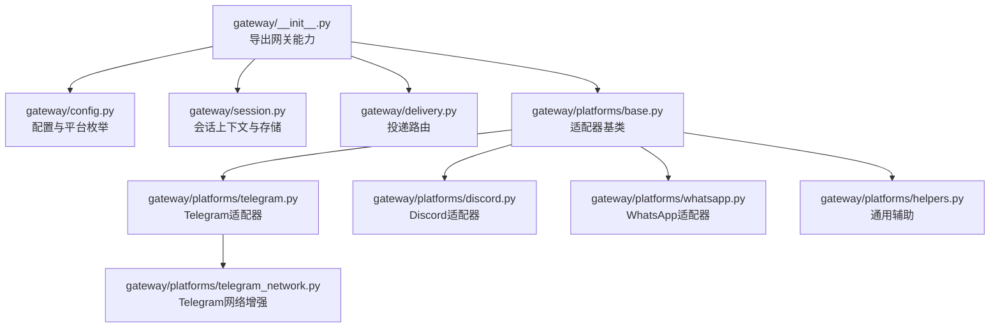
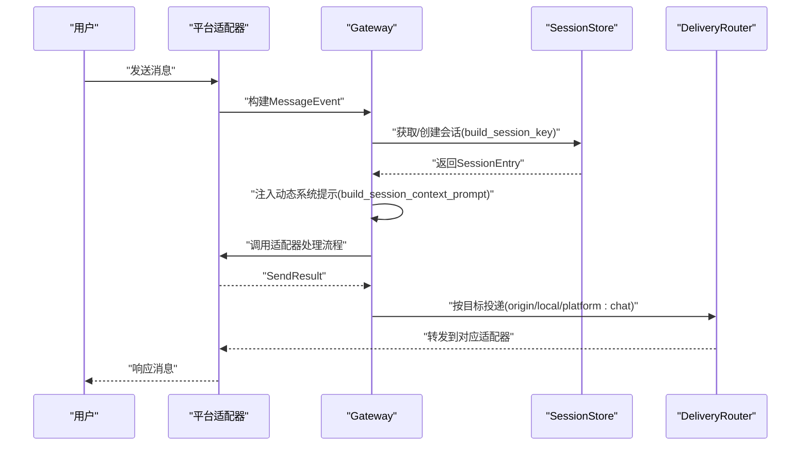
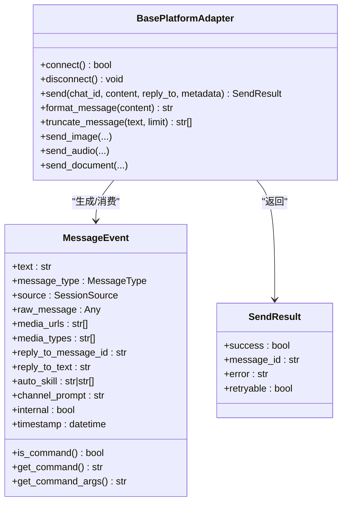
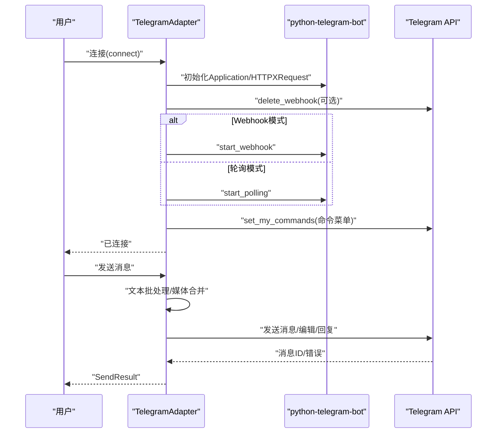
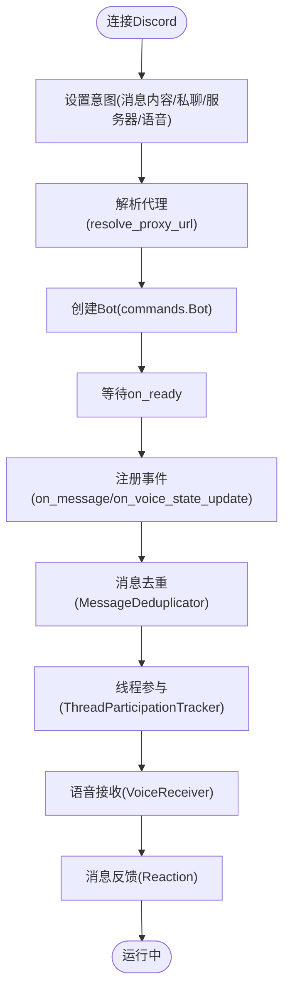
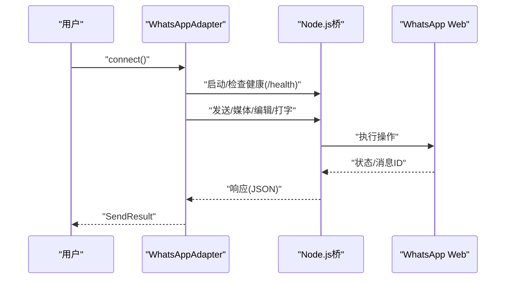
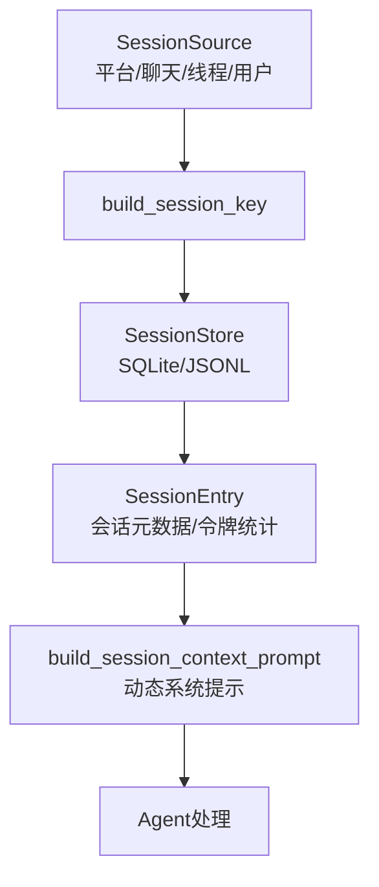
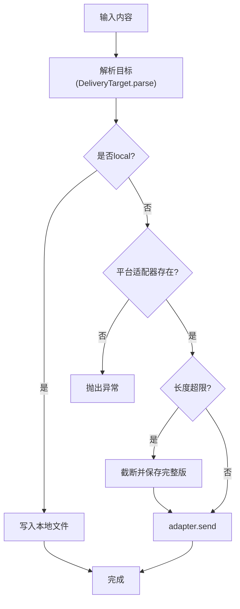
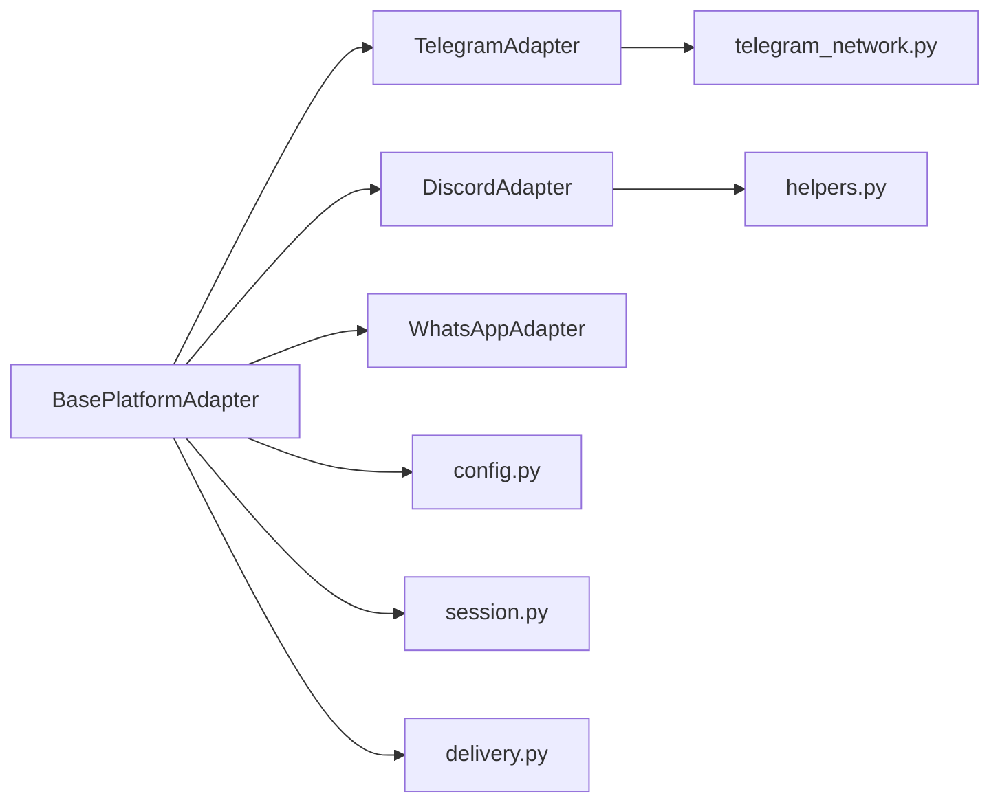

# 平台集成

<cite>
**本文引用的文件**
- [gateway/__init__.py](file://gateway/__init__.py)
- [gateway/config.py](file://gateway/config.py)
- [gateway/session.py](file://gateway/session.py)
- [gateway/delivery.py](file://gateway/delivery.py)
- [gateway/platforms/base.py](file://gateway/platforms/base.py)
- [gateway/platforms/telegram.py](file://gateway/platforms/telegram.py)
- [gateway/platforms/discord.py](file://gateway/platforms/discord.py)
- [gateway/platforms/whatsapp.py](file://gateway/platforms/whatsapp.py)
- [gateway/platforms/telegram_network.py](file://gateway/platforms/telegram_network.py)
- [gateway/platforms/helpers.py](file://gateway/platforms/helpers.py)
</cite>

## 目录
1. [简介](#简介)
2. [项目结构](#项目结构)
3. [核心组件](#核心组件)
4. [架构总览](#架构总览)
5. [详细组件分析](#详细组件分析)
6. [依赖关系分析](#依赖关系分析)
7. [性能考虑](#性能考虑)
8. [故障排除指南](#故障排除指南)
9. [结论](#结论)
10. [附录](#附录)

## 简介
本文件面向Hermes Agent平台集成系统，系统性阐述“网关架构”与“平台适配器模式”，并深入解析Telegram、Discord、WhatsApp等主流平台的集成实现。内容覆盖消息格式、媒体处理、用户认证与权限管理、安全配置、平台间消息同步与状态管理、一致性保障、故障排除与性能优化，以及自定义平台适配器的开发指南。

## 项目结构
Hermes Gateway位于gateway目录，采用“统一网关 + 多平台适配器”的分层架构：
- 网关配置与会话：gateway/config.py、gateway/session.py
- 发送路由：gateway/delivery.py
- 平台适配器基类与具体实现：gateway/platforms/base.py、telegram.py、discord.py、whatsapp.py
- 平台网络增强（Telegram）：gateway/platforms/telegram_network.py
- 通用辅助工具：gateway/platforms/helpers.py
- 网关入口导出：gateway/__init__.py

图表来源
- [gateway/__init__.py:11-35](file://gateway/__init__.py#L11-L35)
- [gateway/config.py:48-70](file://gateway/config.py#L48-L70)
- [gateway/session.py:57-62](file://gateway/session.py#L57-L62)
- [gateway/delivery.py:24-25](file://gateway/delivery.py#L24-L25)
- [gateway/platforms/base.py:1-20](file://gateway/platforms/base.py#L1-L20)
- [gateway/platforms/telegram.py:121-140](file://gateway/platforms/telegram.py#L121-L140)
- [gateway/platforms/discord.py:435-456](file://gateway/platforms/discord.py#L435-L456)
- [gateway/platforms/whatsapp.py:103-131](file://gateway/platforms/whatsapp.py#L103-L131)
- [gateway/platforms/telegram_network.py:52-72](file://gateway/platforms/telegram_network.py#L52-L72)
- [gateway/platforms/helpers.py:22-25](file://gateway/platforms/helpers.py#L22-L25)

章节来源
- [gateway/__init__.py:11-35](file://gateway/__init__.py#L11-L35)
- [gateway/config.py:48-70](file://gateway/config.py#L48-L70)
- [gateway/session.py:57-62](file://gateway/session.py#L57-L62)
- [gateway/delivery.py:24-25](file://gateway/delivery.py#L24-L25)
- [gateway/platforms/base.py:1-20](file://gateway/platforms/base.py#L1-L20)
- [gateway/platforms/telegram.py:121-140](file://gateway/platforms/telegram.py#L121-L140)
- [gateway/platforms/discord.py:435-456](file://gateway/platforms/discord.py#L435-L456)
- [gateway/platforms/whatsapp.py:103-131](file://gateway/platforms/whatsapp.py#L103-L131)
- [gateway/platforms/telegram_network.py:52-72](file://gateway/platforms/telegram_network.py#L52-L72)
- [gateway/platforms/helpers.py:22-25](file://gateway/platforms/helpers.py#L22-L25)

## 核心组件
- 配置与平台枚举：GatewayConfig、Platform、PlatformConfig、HomeChannel、SessionResetPolicy、StreamingConfig
- 会话管理：SessionSource、SessionContext、SessionStore、build_session_key、build_session_context_prompt
- 投递路由：DeliveryTarget、DeliveryRouter
- 适配器基类：BasePlatformAdapter（消息事件模型、媒体缓存、代理与SSRF防护、文本批处理合并等）
- 具体平台适配器：TelegramAdapter、DiscordAdapter、WhatsAppAdapter
- 平台网络增强：TelegramFallbackTransport、DoH发现、粘性回退IP
- 通用辅助：消息去重、文本批聚合、Markdown剥离、线程参与追踪、电话号码脱敏

章节来源
- [gateway/config.py:48-70](file://gateway/config.py#L48-L70)
- [gateway/config.py:143-187](file://gateway/config.py#L143-L187)
- [gateway/config.py:222-421](file://gateway/config.py#L222-L421)
- [gateway/session.py:65-137](file://gateway/session.py#L65-L137)
- [gateway/session.py:141-328](file://gateway/session.py#L141-L328)
- [gateway/session.py:498-771](file://gateway/session.py#L498-L771)
- [gateway/delivery.py:28-104](file://gateway/delivery.py#L28-L104)
- [gateway/delivery.py:107-253](file://gateway/delivery.py#L107-L253)
- [gateway/platforms/base.py:634-796](file://gateway/platforms/base.py#L634-L796)
- [gateway/platforms/helpers.py:25-65](file://gateway/platforms/helpers.py#L25-L65)
- [gateway/platforms/helpers.py:70-153](file://gateway/platforms/helpers.py#L70-L153)
- [gateway/platforms/helpers.py:190-246](file://gateway/platforms/helpers.py#L190-L246)

## 架构总览
Hermes Gateway通过统一的适配器接口对接多平台，所有平台消息在进入Agent前被标准化为MessageEvent；会话上下文动态注入系统提示，确保Agent理解消息来源与可交付渠道；投递路由根据目标字符串解析为DeliveryTarget，再由对应平台适配器发送。

图表来源
- [gateway/platforms/base.py:655-696](file://gateway/platforms/base.py#L655-L696)
- [gateway/session.py:498-771](file://gateway/session.py#L498-L771)
- [gateway/session.py:186-328](file://gateway/session.py#L186-L328)
- [gateway/delivery.py:107-253](file://gateway/delivery.py#L107-L253)

章节来源
- [gateway/platforms/base.py:655-696](file://gateway/platforms/base.py#L655-L696)
- [gateway/session.py:498-771](file://gateway/session.py#L498-L771)
- [gateway/session.py:186-328](file://gateway/session.py#L186-L328)
- [gateway/delivery.py:107-253](file://gateway/delivery.py#L107-L253)

## 详细组件分析

### 适配器基类与通用能力
- 消息事件模型：MessageEvent（文本、类型、来源、媒体、回复上下文、通道提示、内部事件标记）
- 发送结果模型：SendResult（成功/失败/可重试）
- 文本批处理合并：merge_pending_message_event（相册/快速文本聚合）
- 媒体缓存：图片/音频/文档本地缓存、下载重试、SSRF防护、路径清理
- 代理与网络：resolve_proxy_url、proxy_kwargs_for_bot/aiohttp、TelegramFallbackTransport
- 安全：SSRF重定向拦截、URL白名单校验、敏感信息日志脱敏

图表来源
- [gateway/platforms/base.py:634-796](file://gateway/platforms/base.py#L634-L796)
- [gateway/platforms/base.py:655-721](file://gateway/platforms/base.py#L655-L721)

章节来源
- [gateway/platforms/base.py:634-796](file://gateway/platforms/base.py#L634-L796)
- [gateway/platforms/base.py:733-788](file://gateway/platforms/base.py#L733-L788)

### Telegram适配器
- 连接模式：轮询或Webhook；支持自定义base_url、代理、Telegram回退IP传输
- 话题/论坛主题：DM主题映射与持久化
- 文本批处理：媒体组/长文本合并，减少重复响应
- 命令菜单：从命令注册表自动注册
- 错误恢复：冲突/网络错误重连策略
- 格式化：MarkdownV2转义/清理、链接预览控制

图表来源
- [gateway/platforms/telegram.py:538-791](file://gateway/platforms/telegram.py#L538-L791)
- [gateway/platforms/telegram_network.py:52-120](file://gateway/platforms/telegram_network.py#L52-L120)

章节来源
- [gateway/platforms/telegram.py:538-791](file://gateway/platforms/telegram.py#L538-L791)
- [gateway/platforms/telegram_network.py:52-120](file://gateway/platforms/telegram_network.py#L52-L120)

### Discord适配器
- 连接：discord.py，意图配置，代理支持
- 去重：RESUME事件重放去重
- 线程：ThreadParticipationTracker，避免非提及回复
- 语音：VoiceReceiver（NAcleak/DAVE解密、Opus解码、静音检测、PCM转WAV）
- 反馈：消息反应（👀✅❌）
- 命令：Slash命令注册与同步

图表来源
- [gateway/platforms/discord.py:492-728](file://gateway/platforms/discord.py#L492-L728)
- [gateway/platforms/helpers.py:25-65](file://gateway/platforms/helpers.py#L25-L65)
- [gateway/platforms/helpers.py:190-246](file://gateway/platforms/helpers.py#L190-L246)

章节来源
- [gateway/platforms/discord.py:492-728](file://gateway/platforms/discord.py#L492-L728)
- [gateway/platforms/helpers.py:25-65](file://gateway/platforms/helpers.py#L25-L65)
- [gateway/platforms/helpers.py:190-246](file://gateway/platforms/helpers.py#L190-L246)

### WhatsApp适配器（桥接模式）
- 依赖：Node.js子进程桥接（whatsapp-web.js/Baileys/Business API）
- 连接：健康检查、端口占用清理、自动安装依赖、QR/会话日志
- 消息：提及匹配、自由响应群聊、回复前缀、Markdown转换
- 发送：分片发送、媒体直传、编辑、打字指示

图表来源
- [gateway/platforms/whatsapp.py:274-533](file://gateway/platforms/whatsapp.py#L274-L533)

章节来源
- [gateway/platforms/whatsapp.py:274-533](file://gateway/platforms/whatsapp.py#L274-L533)

### 会话与上下文
- 会话键规则：基于平台/聊天类型/聊天ID/线程ID/用户ID（可选隔离）
- 动态系统提示：注入来源、平台可用性、默认投递渠道、可显式投递
- 存储：SQLite优先（SessionDB），回退JSONL；后台过期观察者与内存索引

图表来源
- [gateway/session.py:439-495](file://gateway/session.py#L439-L495)
- [gateway/session.py:498-771](file://gateway/session.py#L498-L771)
- [gateway/session.py:186-328](file://gateway/session.py#L186-L328)

章节来源
- [gateway/session.py:439-495](file://gateway/session.py#L439-L495)
- [gateway/session.py:498-771](file://gateway/session.py#L498-L771)
- [gateway/session.py:186-328](file://gateway/session.py#L186-L328)

### 投递路由
- 目标解析：origin/local/平台/平台:chat_id/平台:chat_id:thread_id
- 本地落盘：按作业ID与时间戳组织输出目录
- 平台投递：超限截断并保存完整版，携带线程ID元数据

图表来源
- [gateway/delivery.py:46-104](file://gateway/delivery.py#L46-L104)
- [gateway/delivery.py:169-252](file://gateway/delivery.py#L169-L252)

章节来源
- [gateway/delivery.py:46-104](file://gateway/delivery.py#L46-L104)
- [gateway/delivery.py:169-252](file://gateway/delivery.py#L169-L252)

## 依赖关系分析
- 组件耦合
  - 适配器依赖基类（统一接口、媒体缓存、代理/SSRF）
  - 会话与投递均依赖配置（平台枚举、重置策略、流式配置）
  - Discord使用helpers中的去重与线程追踪
  - Telegram使用telegram_network进行网络回退
- 外部依赖
  - Telegram：python-telegram-bot、HTTPXRequest（支持自定义base_url与回退IP）
  - Discord：discord.py、opus库、nacl/DAVE（语音）
  - WhatsApp：Node.js桥（whatsapp-web.js/Baileys/Business API）

图表来源
- [gateway/platforms/base.py:1-20](file://gateway/platforms/base.py#L1-L20)
- [gateway/platforms/telegram.py:121-140](file://gateway/platforms/telegram.py#L121-L140)
- [gateway/platforms/discord.py:435-456](file://gateway/platforms/discord.py#L435-L456)
- [gateway/platforms/whatsapp.py:103-131](file://gateway/platforms/whatsapp.py#L103-L131)
- [gateway/platforms/helpers.py:22-25](file://gateway/platforms/helpers.py#L22-L25)
- [gateway/platforms/telegram_network.py:52-72](file://gateway/platforms/telegram_network.py#L52-L72)
- [gateway/config.py:48-70](file://gateway/config.py#L48-L70)
- [gateway/session.py:57-62](file://gateway/session.py#L57-L62)
- [gateway/delivery.py:24-25](file://gateway/delivery.py#L24-L25)

章节来源
- [gateway/platforms/base.py:1-20](file://gateway/platforms/base.py#L1-L20)
- [gateway/platforms/telegram.py:121-140](file://gateway/platforms/telegram.py#L121-L140)
- [gateway/platforms/discord.py:435-456](file://gateway/platforms/discord.py#L435-L456)
- [gateway/platforms/whatsapp.py:103-131](file://gateway/platforms/whatsapp.py#L103-L131)
- [gateway/platforms/helpers.py:22-25](file://gateway/platforms/helpers.py#L22-L25)
- [gateway/platforms/telegram_network.py:52-72](file://gateway/platforms/telegram_network.py#L52-L72)
- [gateway/config.py:48-70](file://gateway/config.py#L48-L70)
- [gateway/session.py:57-62](file://gateway/session.py#L57-L62)
- [gateway/delivery.py:24-25](file://gateway/delivery.py#L24-L25)

## 性能考虑
- 文本批处理：Telegram/Discord的文本批聚合降低重复响应与API调用次数
- 媒体缓存：图片/音频/文档本地缓存，避免平台URL过期与重复下载
- 代理与回退：Telegram回退IP与DoH发现提升网络鲁棒性
- 语音处理：Discord语音接收器按静音阈值批量产出，减少STT开销
- 投递截断：超长输出先截断并保存完整版，避免平台限制导致失败

章节来源
- [gateway/platforms/base.py:733-788](file://gateway/platforms/base.py#L733-L788)
- [gateway/platforms/telegram.py:148-162](file://gateway/platforms/telegram.py#L148-L162)
- [gateway/platforms/discord.py:464-470](file://gateway/platforms/discord.py#L464-L470)
- [gateway/platforms/telegram_network.py:185-226](file://gateway/platforms/telegram_network.py#L185-L226)
- [gateway/delivery.py:239-247](file://gateway/delivery.py#L239-L247)

## 故障排除指南
- Telegram
  - 轮询冲突：多个实例同时轮询会被识别为冲突，需停止旧实例后重启
  - 网络错误：短暂网络中断后指数退避重连，超过最大重试则标记致命错误
  - 回退IP：若系统DNS不可达，自动DoH发现并使用回退IP
- Discord
  - 去重：RESUME事件重放导致重复消息，使用去重器避免重复处理
  - 语音：缺少opus库时禁用播放；NAcleak/DAVE解密失败时降级
- WhatsApp
  - 桥进程：健康检查失败或进程退出，记录日志并触发致命错误通知
  - 依赖：未安装Node.js或依赖安装失败，按提示安装
- 通用
  - SSRF防护：下载媒体时对URL进行安全校验，拒绝内网地址
  - 代理：支持HTTP/SOCKS代理，自动检测macOS系统代理

章节来源
- [gateway/platforms/telegram.py:323-380](file://gateway/platforms/telegram.py#L323-L380)
- [gateway/platforms/telegram.py:256-322](file://gateway/platforms/telegram.py#L256-L322)
- [gateway/platforms/telegram_network.py:185-226](file://gateway/platforms/telegram_network.py#L185-L226)
- [gateway/platforms/discord.py:582-643](file://gateway/platforms/discord.py#L582-L643)
- [gateway/platforms/discord.py:128-159](file://gateway/platforms/discord.py#L128-L159)
- [gateway/platforms/whatsapp.py:469-484](file://gateway/platforms/whatsapp.py#L469-L484)
- [gateway/platforms/base.py:290-305](file://gateway/platforms/base.py#L290-L305)

## 结论
Hermes Gateway以“统一网关 + 适配器模式”实现了跨平台消息接入与投递，结合会话上下文与动态系统提示，使Agent在多平台间保持一致的行为与上下文感知。平台特定能力（Telegram回退IP、Discord语音与去重、WhatsApp桥接）与通用安全/性能机制（SSRF、代理、批处理、缓存）共同构成稳定可靠的集成体系。

## 附录

### 安全配置指南
- API密钥管理
  - 使用环境变量注入各平台Token/API Key，避免硬编码
  - 配置加载时对占位符进行校验，防止空/弱密钥启动
- 授权与权限
  - Telegram/Discord允许用户白名单/用户名解析；WhatsApp支持提及/自由响应配置
  - Discord支持忽略无提及/仅提及/全部机器人消息策略
- 消息过滤
  - 平台侧提及/群聊/频道白名单/忽略列表
  - 会话上下文注入PII脱敏策略（部分平台）
- SSRF与网络
  - 下载媒体前进行URL安全校验，重定向链路二次校验
  - 支持HTTP/SOCKS代理与Telegram回退IP

章节来源
- [gateway/config.py:769-767](file://gateway/config.py#L769-L767)
- [gateway/platforms/telegram.py:174-182](file://gateway/platforms/telegram.py#L174-L182)
- [gateway/platforms/discord.py:605-641](file://gateway/platforms/discord.py#L605-L641)
- [gateway/platforms/whatsapp.py:257-273](file://gateway/platforms/whatsapp.py#L257-L273)
- [gateway/platforms/base.py:290-305](file://gateway/platforms/base.py#L290-L305)
- [gateway/platforms/base.py:148-198](file://gateway/platforms/base.py#L148-L198)

### 平台间消息同步与状态管理
- 会话键：跨平台一致的会话标识，支持DM/群组/线程/用户隔离
- 动态系统提示：注入来源、平台可用性、默认投递渠道
- 投递目标：origin/local/平台/平台:chat_id/平台:chat_id:thread_id
- 一致性保障：消息去重、文本批聚合、媒体缓存、SSRF防护

章节来源
- [gateway/session.py:439-495](file://gateway/session.py#L439-L495)
- [gateway/session.py:186-328](file://gateway/session.py#L186-L328)
- [gateway/delivery.py:46-104](file://gateway/delivery.py#L46-L104)
- [gateway/platforms/helpers.py:25-65](file://gateway/platforms/helpers.py#L25-L65)
- [gateway/platforms/base.py:315-371](file://gateway/platforms/base.py#L315-L371)

### 自定义平台适配器开发指南
- 继承基类：实现connect/disconnect/send/format_message/truncate_message等方法
- 消息事件：构造/消费MessageEvent，处理媒体与回复上下文
- 安全与网络：复用代理/SSRF工具，必要时实现回退传输
- 会话与投递：使用SessionStore与DeliveryRouter，遵循会话键规则与投递目标解析
- 测试与验证：参考平台测试用例，覆盖连接、消息处理、媒体、错误恢复等场景

章节来源
- [gateway/platforms/base.py:634-796](file://gateway/platforms/base.py#L634-L796)
- [gateway/session.py:498-771](file://gateway/session.py#L498-L771)
- [gateway/delivery.py:107-253](file://gateway/delivery.py#L107-L253)
- [gateway/platforms/helpers.py:70-153](file://gateway/platforms/helpers.py#L70-L153)