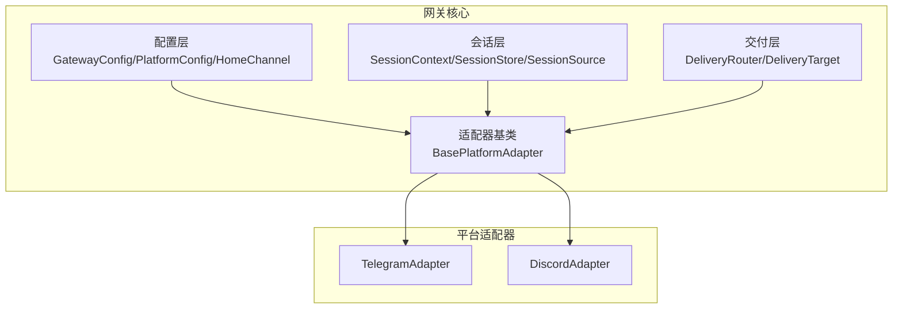
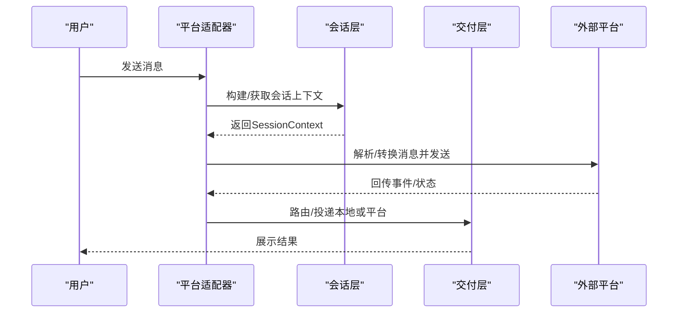
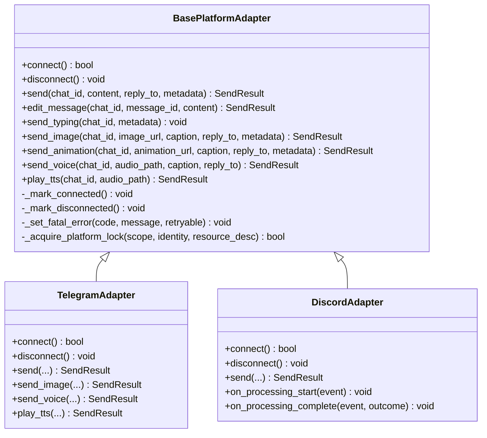
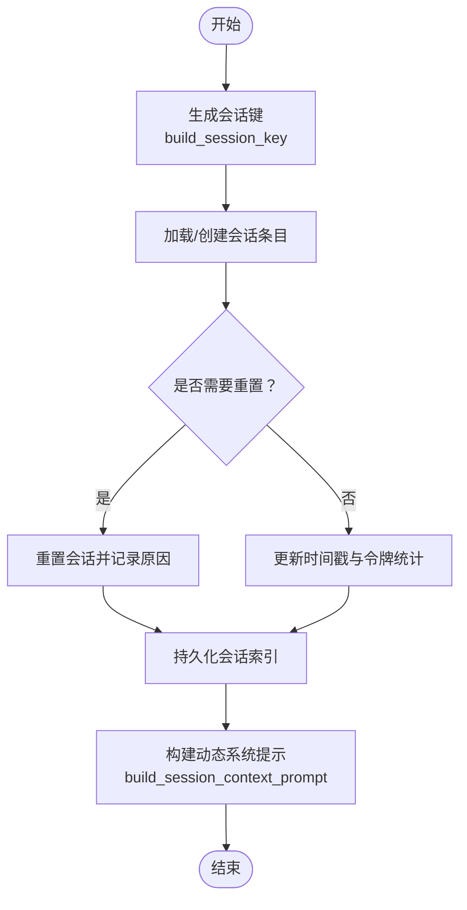
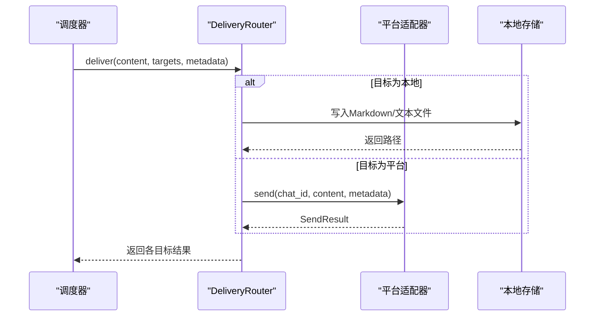
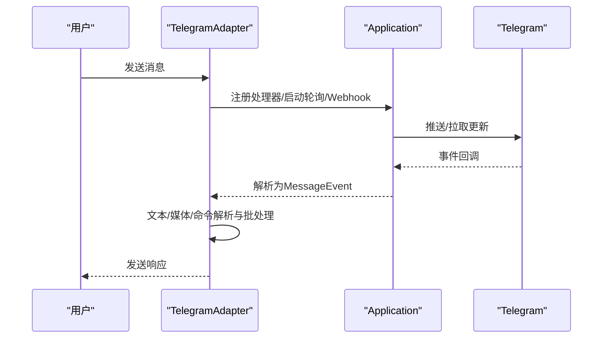
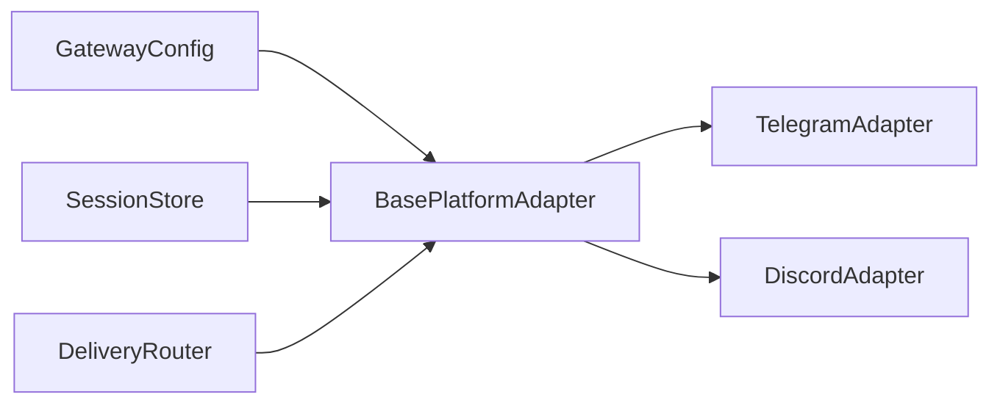

# 网关架构设计

<cite>
**本文档引用的文件**
- [gateway/__init__.py](file://gateway/__init__.py)
- [gateway/platforms/base.py](file://gateway/platforms/base.py)
- [gateway/session.py](file://gateway/session.py)
- [gateway/config.py](file://gateway/config.py)
- [gateway/delivery.py](file://gateway/delivery.py)
- [gateway/platforms/telegram.py](file://gateway/platforms/telegram.py)
- [gateway/platforms/discord.py](file://gateway/platforms/discord.py)
</cite>

## 目录
1. [引言](#引言)
2. [项目结构](#项目结构)
3. [核心组件](#核心组件)
4. [架构总览](#架构总览)
5. [详细组件分析](#详细组件分析)
6. [依赖关系分析](#依赖关系分析)
7. [性能考虑](#性能考虑)
8. [故障排查指南](#故障排查指南)
9. [结论](#结论)
10. [附录](#附录)

## 引言
本文件面向Hermes Agent网关架构设计，系统性阐述其多平台消息集成能力与适配器模式实现。重点覆盖：
- 基于适配器模式的平台解耦设计
- BasePlatformAdapter基类的抽象方法、消息处理流程与错误处理机制
- 会话管理、消息路由与平台间通信的实现细节
- 统一处理不同平台的消息格式、媒体附件与用户认证
- 配置选项、性能优化策略与扩展指南
- 架构图表与组件交互说明

## 项目结构
网关模块位于gateway目录，采用“按功能域分层 + 平台适配器”的组织方式：
- 配置层：GatewayConfig、PlatformConfig、HomeChannel等，负责加载与合并配置
- 会话层：SessionContext、SessionStore、SessionSource等，负责会话生命周期与上下文注入
- 平台适配层：BasePlatformAdapter及其子类（如Telegram、Discord），负责具体平台接入
- 交付层：DeliveryRouter、DeliveryTarget，负责任务输出与消息的路由投递
- 入口导出：gateway/__init__.py统一暴露核心API

**图表来源**
- [gateway/__init__.py:12-35](file://gateway/__init__.py#L12-L35)
- [gateway/config.py:222-421](file://gateway/config.py#L222-L421)
- [gateway/session.py:65-180](file://gateway/session.py#L65-L180)
- [gateway/delivery.py:107-257](file://gateway/delivery.py#L107-L257)
- [gateway/platforms/base.py:844-1200](file://gateway/platforms/base.py#L844-L1200)

**章节来源**
- [gateway/__init__.py:12-35](file://gateway/__init__.py#L12-L35)
- [gateway/config.py:48-70](file://gateway/config.py#L48-L70)

## 核心组件
- 配置管理：GatewayConfig集中管理平台连接、会话重置策略、快速命令、STT开关、会话隔离策略、流式传输等；PlatformConfig封装单平台配置；HomeChannel定义默认投递通道。
- 会话管理：SessionSource描述消息来源；SessionContext动态注入系统提示；SessionStore持久化会话并支持过期与重置策略。
- 适配器基类：BasePlatformAdapter定义统一接口（connect/disconnect/send/edit_message等）与通用能力（媒体缓存、SSRF防护、代理支持、消息批处理等）。
- 交付路由：DeliveryRouter解析目标字符串，将内容投递到本地或各平台适配器；自动截断超长输出并保存全文。

**章节来源**
- [gateway/config.py:100-188](file://gateway/config.py#L100-L188)
- [gateway/session.py:65-180](file://gateway/session.py#L65-L180)
- [gateway/platforms/base.py:844-1200](file://gateway/platforms/base.py#L844-L1200)
- [gateway/delivery.py:28-105](file://gateway/delivery.py#L28-L105)

## 架构总览
网关通过适配器模式屏蔽平台差异，统一对外提供一致的消息收发与会话管理能力。配置层决定连接策略与行为边界；会话层确保跨平台上下文一致性；交付层负责将任务结果与响应消息路由至正确目的地。

**图表来源**
- [gateway/platforms/base.py:1012-1068](file://gateway/platforms/base.py#L1012-L1068)
- [gateway/session.py:186-328](file://gateway/session.py#L186-L328)
- [gateway/delivery.py:127-167](file://gateway/delivery.py#L127-L167)

## 详细组件分析

### BasePlatformAdapter基类设计
- 抽象方法与职责
  - 连接与断开：connect/disconnect负责建立/释放平台连接
  - 消息收发：send/edit_message/send_typing等提供统一接口
  - 媒体支持：send_image/send_animation/send_voice/play_tts等支持平台原生媒体
- 通用能力
  - 媒体缓存：图片/音频/文档本地缓存，避免平台URL过期与跨工具链路
  - 安全与代理：SSRF重定向防护、代理URL解析与aiohttp参数构建
  - 文本处理：UTF-16长度计算、消息截断、Markdown/HTML图像提取
  - 会话批处理：合并快速连续消息、相册/照片组聚合、线程/话题支持
  - 错误与致命错误：运行状态标记、可重试/不可重试错误分类、致命错误回调
- 生命周期与并发
  - 后台任务集合用于处理消息与清理
  - 活跃会话事件表支持中断与取消
  - 平台锁防止同一令牌被多实例占用

**图表来源**
- [gateway/platforms/base.py:844-1200](file://gateway/platforms/base.py#L844-L1200)
- [gateway/platforms/telegram.py:121-800](file://gateway/platforms/telegram.py#L121-L800)
- [gateway/platforms/discord.py:435-790](file://gateway/platforms/discord.py#L435-L790)

**章节来源**
- [gateway/platforms/base.py:844-1200](file://gateway/platforms/base.py#L844-L1200)
- [gateway/platforms/base.py:1012-1068](file://gateway/platforms/base.py#L1012-L1068)

### 会话管理与上下文注入
- SessionSource描述消息来源（平台、聊天类型、线程/话题等），用于路由与上下文注入
- SessionContext在动态系统提示中注入当前会话来源、已连接平台、Home通道与投递选项
- SessionStore负责会话键生成、过期检测、重置策略与SQLite/JSONL双存储回退
- build_session_context_prompt根据平台特性与PII策略生成安全提示

**图表来源**
- [gateway/session.py:439-495](file://gateway/session.py#L439-L495)
- [gateway/session.py:582-662](file://gateway/session.py#L582-L662)
- [gateway/session.py:186-328](file://gateway/session.py#L186-L328)

**章节来源**
- [gateway/session.py:65-180](file://gateway/session.py#L65-L180)
- [gateway/session.py:439-495](file://gateway/session.py#L439-L495)
- [gateway/session.py:582-662](file://gateway/session.py#L582-L662)
- [gateway/session.py:186-328](file://gateway/session.py#L186-L328)

### 消息路由与平台间通信
- DeliveryTarget解析目标字符串（origin/local/平台名/平台:chat_id:thread_id）
- DeliveryRouter根据目标选择本地落盘或平台适配器发送
- 对超长输出进行截断并保存全文，确保平台限制内送达
- 支持线程/话题透传（thread_id）

**图表来源**
- [gateway/delivery.py:127-167](file://gateway/delivery.py#L127-L167)
- [gateway/delivery.py:224-252](file://gateway/delivery.py#L224-L252)

**章节来源**
- [gateway/delivery.py:28-105](file://gateway/delivery.py#L28-L105)
- [gateway/delivery.py:127-167](file://gateway/delivery.py#L127-L167)
- [gateway/delivery.py:224-252](file://gateway/delivery.py#L224-L252)

### 平台适配器实现要点

#### Telegram适配器
- 支持轮询/Webhook两种接入模式，具备自定义base_url、代理与回退IP能力
- 文本/媒体/位置/命令等多类型消息处理，支持DM话题（forum topics）、回复引用策略
- 文本批处理与相册合并，减少平台侧重复渲染
- 多次初始化重试与网络错误自动恢复

**图表来源**
- [gateway/platforms/telegram.py:538-784](file://gateway/platforms/telegram.py#L538-L784)
- [gateway/platforms/telegram.py:644-662](file://gateway/platforms/telegram.py#L644-L662)

**章节来源**
- [gateway/platforms/telegram.py:121-800](file://gateway/platforms/telegram.py#L121-L800)

#### Discord适配器
- 使用discord.py，支持意图配置、语音接收（OPUS解码、DAVE E2EE）、反应反馈
- 文本批处理、线程参与追踪、消息去重、多代理支持
- 提供处理开始/完成的钩子以增强用户体验

**章节来源**
- [gateway/platforms/discord.py:435-790](file://gateway/platforms/discord.py#L435-L790)

## 依赖关系分析
- 组件耦合
  - 适配器基类与平台适配器之间为强抽象弱实现关系，降低平台变更对上层影响
  - 会话层与配置层通过会话键与重置策略耦合，保证跨平台一致性
  - 交付层仅依赖适配器接口，不关心具体平台实现
- 外部依赖
  - 平台库（python-telegram-bot、discord.py）与HTTP客户端（aiohttp、httpx）
  - 本地存储（SQLite/JSONL）与Herms Home目录结构
- 循环依赖
  - 未发现直接循环导入；平台适配器通过相对导入避免循环

**图表来源**
- [gateway/config.py:222-421](file://gateway/config.py#L222-L421)
- [gateway/platforms/base.py:844-1200](file://gateway/platforms/base.py#L844-L1200)
- [gateway/delivery.py:107-257](file://gateway/delivery.py#L107-L257)

**章节来源**
- [gateway/config.py:222-421](file://gateway/config.py#L222-L421)
- [gateway/platforms/base.py:844-1200](file://gateway/platforms/base.py#L844-L1200)
- [gateway/delivery.py:107-257](file://gateway/delivery.py#L107-L257)

## 性能考虑
- 连接池与超时：平台适配器使用较大的连接池与更长的超时，降低网络抖动导致的失败率
- 批处理与去重：文本批处理与消息去重减少平台压力与重复渲染
- 缓存与截断：媒体缓存避免频繁下载；超长输出截断并保存全文，兼顾平台限制与完整性
- 代理与回退：代理与回退IP提升网络稳定性，降低连接失败概率

[本节为通用指导，无需特定文件引用]

## 故障排查指南
- 致命错误与重试
  - 适配器维护致命错误状态与可重试标志，触发后写入运行状态并通知上层
  - Telegram轮询冲突与网络错误具备自动重连与重试策略
- 错误分类
  - 可重试错误（如连接错误）与不可重试错误（如令牌无效）区分处理
- 日志与可观测性
  - 关键路径均输出日志，便于定位问题（连接、解析、发送、截断等）

**章节来源**
- [gateway/platforms/base.py:926-949](file://gateway/platforms/base.py#L926-L949)
- [gateway/platforms/telegram.py:256-380](file://gateway/platforms/telegram.py#L256-L380)

## 结论
Hermes Agent网关通过清晰的适配器模式与分层架构，实现了对多平台消息系统的统一接入与管理。BasePlatformAdapter提供了强大的通用能力与一致的接口契约，结合会话上下文注入与交付路由，既保证了跨平台一致性，又为扩展新平台提供了最小侵入的路径。配置层与会话层进一步增强了可用性与可运维性，适合在复杂多变的生产环境中稳定运行。

## 附录

### 配置选项速览
- 会话重置策略：按日/空闲/两者皆可，支持通知与排除平台
- 会话隔离：群组/线程按用户隔离策略
- 快速命令：快捷指令绕过主循环
- STT开关：是否自动转录语音
- 流式传输：编辑型流式传输与节流参数
- 平台特定：代理、回退IP、Webhook端口与密钥等

**章节来源**
- [gateway/config.py:100-188](file://gateway/config.py#L100-L188)
- [gateway/config.py:222-421](file://gateway/config.py#L222-L421)