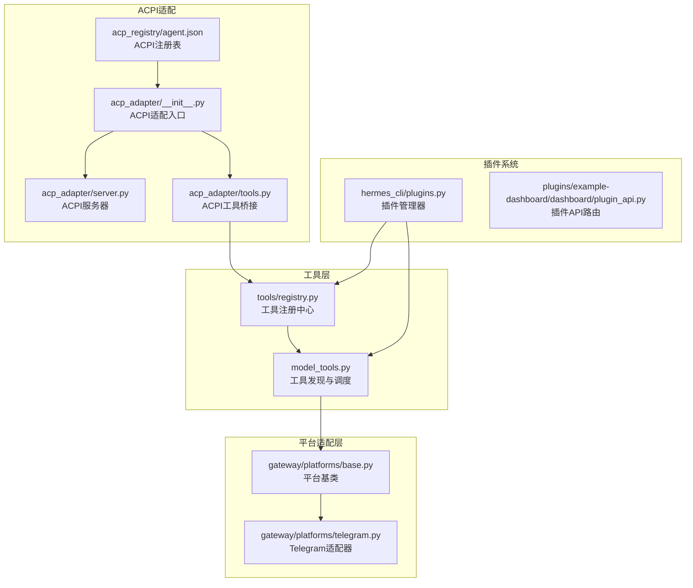
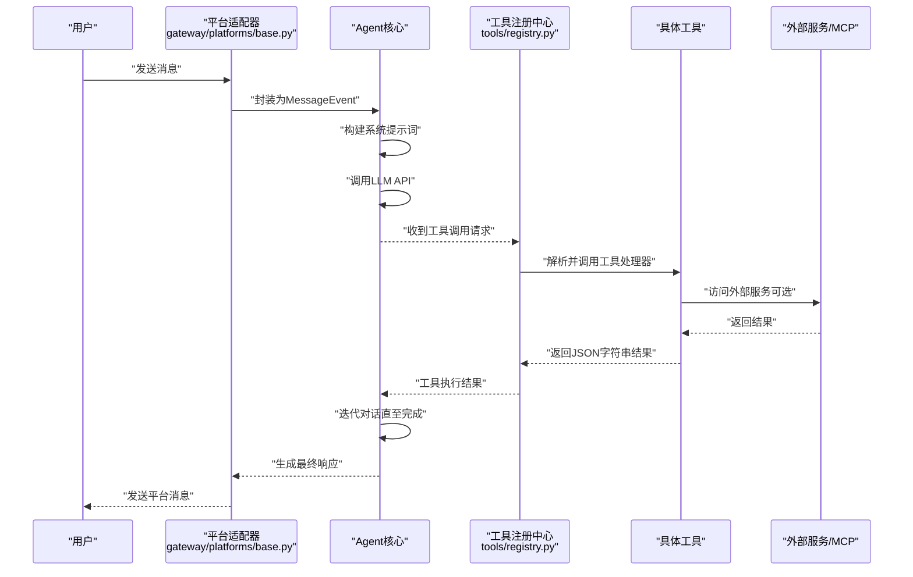
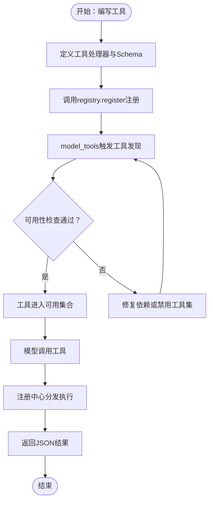
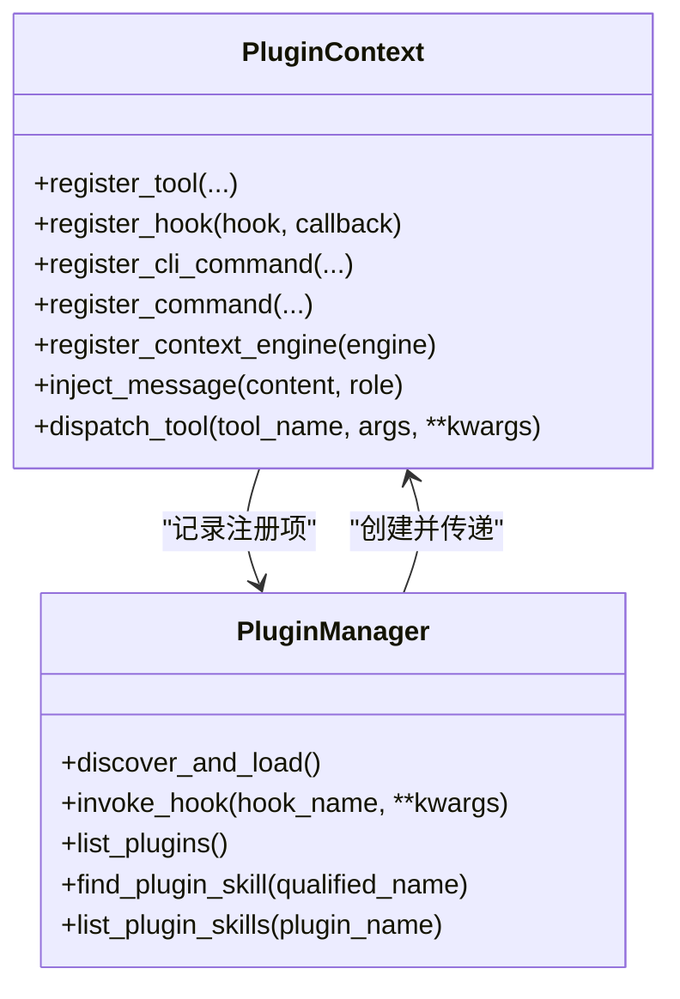
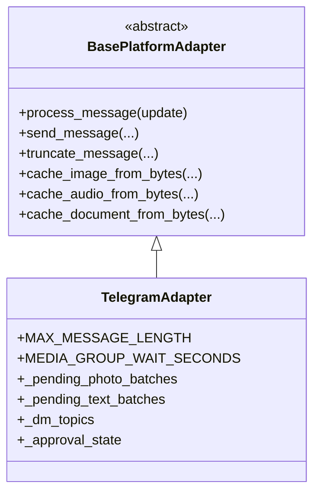

# 功能开发指南

<cite>
**本文档引用的文件**
- [README.md](file://README.md)
- [CONTRIBUTING.md](file://CONTRIBUTING.md)
- [tools/registry.py](file://tools/registry.py)
- [model_tools.py](file://model_tools.py)
- [gateway/platforms/base.py](file://gateway/platforms/base.py)
- [gateway/platforms/telegram.py](file://gateway/platforms/telegram.py)
- [hermes_cli/plugins.py](file://hermes_cli/plugins.py)
- [plugins/example-dashboard/dashboard/plugin_api.py](file://plugins/example-dashboard/dashboard/plugin_api.py)
- [acp_adapter/__init__.py](file://acp_adapter/__init__.py)
- [acp_adapter/server.py](file://acp_adapter/server.py)
- [acp_adapter/tools.py](file://acp_adapter/tools.py)
- [acp_registry/agent.json](file://acp_registry/agent.json)
- [optional-skills/email/agentmail/SKILL.md](file://optional-skills/email/agentmail/SKILL.md)
</cite>

## 目录
1. [简介](#简介)
2. [项目结构](#项目结构)
3. [核心组件](#核心组件)
4. [架构总览](#架构总览)
5. [详细组件分析](#详细组件分析)
6. [依赖关系分析](#依赖关系分析)
7. [性能考量](#性能考量)
8. [故障排查指南](#故障排查指南)
9. [结论](#结论)
10. [附录](#附录)

## 简介
本指南面向Hermes Agent的功能开发者，系统阐述新工具开发流程（注册机制、参数校验与执行逻辑）、技能开发标准（SKILL.md格式、前置条件声明与平台兼容性）、插件系统开发方法（架构理解与扩展点利用）、平台适配器开发流程与集成标准、API设计原则与接口规范、功能测试方法与质量保证流程、版本管理与向后兼容性考虑，以及从需求分析到代码实现再到文档完善的完整开发工作流程。

## 项目结构
Hermes Agent采用模块化分层设计：工具层（tools）通过自注册机制集中管理；模型工具层（model_tools）负责工具发现与调度；平台适配层（gateway/platforms）提供多平台接入；插件系统（hermes_cli/plugins）支持生命周期钩子与扩展能力；ACPI（acp_adapter）提供Agent Communication Protocol适配。



图表来源
- [tools/registry.py:1-483](file://tools/registry.py#L1-L483)
- [model_tools.py:1-200](file://model_tools.py#L1-L200)
- [gateway/platforms/base.py:1-2165](file://gateway/platforms/base.py#L1-L2165)
- [gateway/platforms/telegram.py:1-2915](file://gateway/platforms/telegram.py#L1-L2915)
- [hermes_cli/plugins.py:1-844](file://hermes_cli/plugins.py#L1-L844)
- [plugins/example-dashboard/dashboard/plugin_api.py:1-15](file://plugins/example-dashboard/dashboard/plugin_api.py#L1-L15)
- [acp_adapter/__init__.py:1-2](file://acp_adapter/__init__.py#L1-L2)
- [acp_adapter/server.py](file://acp_adapter/server.py)
- [acp_adapter/tools.py](file://acp_adapter/tools.py)
- [acp_registry/agent.json](file://acp_registry/agent.json)

章节来源
- [README.md:114-182](file://README.md#L114-L182)
- [CONTRIBUTING.md:114-182](file://CONTRIBUTING.md#L114-L182)

## 核心组件
- 工具注册中心（tools/registry.py）
  - 提供工具注册、可用性检查、异步桥接、工具集映射等能力
  - 支持工具集别名、并发安全快照、MCP动态刷新
- 模型工具层（model_tools.py）
  - 触发内置工具发现，聚合工具定义，提供统一调度接口
  - 维护工具集要求与映射，支持MCP与插件工具发现
- 平台适配层（gateway/platforms）
  - 基类定义消息事件、发送结果、媒体缓存、代理配置等通用能力
  - 具体平台（如Telegram）继承基类并实现平台特定逻辑
- 插件系统（hermes_cli/plugins.py）
  - 发现用户/项目/Pip三类插件源，加载插件并调用register(ctx)
  - 提供生命周期钩子（pre_tool_call/post_tool_call等）、工具注册、命令注册、上下文引擎替换等扩展点
- ACPI适配（acp_adapter）
  - 提供ACPI协议适配、工具桥接与注册表集成

章节来源
- [tools/registry.py:100-483](file://tools/registry.py#L100-L483)
- [model_tools.py:128-200](file://model_tools.py#L128-L200)
- [gateway/platforms/base.py:1-2165](file://gateway/platforms/base.py#L1-L2165)
- [hermes_cli/plugins.py:1-844](file://hermes_cli/plugins.py#L1-L844)
- [acp_adapter/__init__.py:1-2](file://acp_adapter/__init__.py#L1-L2)

## 架构总览
Hermes Agent的核心循环中，系统根据当前会话状态构建提示词，调用LLM API；当返回工具调用时，通过工具注册中心进行解析与执行，并将结果回传给模型以迭代生成最终响应。平台适配器负责消息收发与平台特性处理，插件系统在关键生命周期注入策略与能力，ACPI适配器将外部MCP服务无缝纳入工具生态。



图表来源
- [gateway/platforms/base.py:655-721](file://gateway/platforms/base.py#L655-L721)
- [tools/registry.py:292-310](file://tools/registry.py#L292-L310)
- [model_tools.py:196-200](file://model_tools.py#L196-L200)

## 详细组件分析

### 新工具开发流程
- 设计与注册
  - 工具文件在模块级调用注册中心进行注册，声明名称、工具集、Schema、处理器、可用性检查函数等
  - 注册中心支持工具集别名、并发安全、MCP覆盖规则与工具集可用性检查
- 参数验证与执行
  - 工具处理器需返回JSON字符串；注册中心统一捕获异常并标准化错误格式
  - 异步工具通过统一的异步桥接函数运行，避免“事件循环已关闭”问题
- 集成与发现
  - 模型工具层触发内置工具发现，导入所有工具模块以触发注册
  - 支持MCP与插件动态发现，工具集要求与映射在运行时维护



图表来源
- [tools/registry.py:176-228](file://tools/registry.py#L176-L228)
- [model_tools.py:128-147](file://model_tools.py#L128-L147)

章节来源
- [CONTRIBUTING.md:239-300](file://CONTRIBUTING.md#L239-L300)
- [tools/registry.py:100-483](file://tools/registry.py#L100-L483)
- [model_tools.py:128-200](file://model_tools.py#L128-L200)

### 技能开发标准（SKILL.md）
- 文件结构与字段
  - 必填字段：name、description、version、author、license
  - 可选字段：platforms（限制平台）、required_environment_variables（安全设置元数据）、metadata.hermes.tags/related_skills/fallback_for_toolsets/requires_toolsets
- 平台兼容性
  - 通过platforms字段声明支持的OS平台；未声明则默认在所有平台加载
  - 条件激活：通过metadata.hermes的fallback_for_*与requires_*控制技能在不同工具集可用性下的显示与使用
- 安全与前置条件
  - required_environment_variables用于声明加载时需要的安全配置项；缺失不隐藏技能，但会在实际加载时触发安全提示
  - prerequisites.env_vars与commands为遗留字段，仍受支持
- 示例参考
  - optional-skills/email/agentmail/SKILL.md展示了完整的技能文档模板与使用说明

章节来源
- [CONTRIBUTING.md:321-463](file://CONTRIBUTING.md#L321-L463)
- [optional-skills/email/agentmail/SKILL.md:1-126](file://optional-skills/email/agentmail/SKILL.md#L1-L126)

### 插件系统开发方法
- 插件发现与加载
  - 支持用户插件（~/.hermes/plugins/）、项目插件（./.hermes/plugins/，需环境变量启用）、Pip入口点插件
  - 加载时调用插件的register(ctx)函数，传入插件上下文对象
- 扩展点与生命周期
  - 工具注册：PluginContext.register_tool委托至工具注册中心
  - 生命周期钩子：pre_tool_call/post_tool_call/pre_llm_call/post_llm_call等
  - 命令注册：register_cli_command/register_command分别注册终端子命令与会话内斜杠命令
  - 上下文引擎：register_context_engine允许替换内置上下文压缩引擎
  - 消息注入：inject_message可在外部源向会话注入消息
- 安全与隔离
  - 钩子回调被独立try/except包裹，避免单个插件影响核心流程
  - 冲突检测：斜杠命令与内置命令冲突会被拒绝



图表来源
- [hermes_cli/plugins.py:124-391](file://hermes_cli/plugins.py#L124-L391)
- [hermes_cli/plugins.py:396-800](file://hermes_cli/plugins.py#L396-L800)

章节来源
- [hermes_cli/plugins.py:1-844](file://hermes_cli/plugins.py#L1-L844)

### 平台适配器开发流程与集成标准
- 基类能力
  - 消息事件标准化（MessageEvent）、发送结果封装（SendResult）、消息类型枚举、处理结果分类
  - 媒体缓存（图片/音频/文档）、URL安全检查、代理配置解析与构建
  - 文本截断与UTF-16长度计算、批量消息合并、会话键构建
- 具体适配器实现要点
  - 继承基类，实现平台特有的消息接收、发送、媒体处理、命令解析
  - 使用基类提供的缓存与安全工具，确保跨平台一致性
- 集成标准
  - 通过平台配置解析与会话管理集成到网关运行器
  - 在消息路由与生命周期中正确处理平台特性（如线程、回复模式、代理）



图表来源
- [gateway/platforms/base.py:634-797](file://gateway/platforms/base.py#L634-L797)
- [gateway/platforms/telegram.py:121-200](file://gateway/platforms/telegram.py#L121-L200)

章节来源
- [gateway/platforms/base.py:1-2165](file://gateway/platforms/base.py#L1-L2165)
- [gateway/platforms/telegram.py:1-2915](file://gateway/platforms/telegram.py#L1-L2915)

### ACPI适配器开发流程与集成标准
- 适配器职责
  - 将外部MCP服务器的工具暴露为Hermes工具集，实现与内置工具一致的注册与调度
  - 通过ACPI注册表与工具桥接模块实现动态刷新与覆盖规则
- 集成步骤
  - 在配置中声明MCP服务器，触发MCP工具发现
  - 工具桥接模块将MCP工具注册到全局注册中心，遵循MCP覆盖内置工具的规则
  - 通过ACPI注册表维护工具清单与元数据

章节来源
- [acp_adapter/__init__.py:1-2](file://acp_adapter/__init__.py#L1-L2)
- [acp_adapter/server.py](file://acp_adapter/server.py)
- [acp_adapter/tools.py](file://acp_adapter/tools.py)
- [acp_registry/agent.json](file://acp_registry/agent.json)

### API设计原则与接口规范
- 工具接口
  - 处理器必须返回JSON字符串；错误通过统一工具错误包装函数返回
  - Schema遵循OpenAI function格式，包含名称、描述与参数定义
  - 工具集要求通过check_fn声明，注册中心按可用性过滤
- 插件API
  - 插件可通过FastAPI路由提供REST接口（示例：plugins/example-dashboard/dashboard/plugin_api.py）
  - 插件命令与CLI命令需避免与内置命令冲突
- 平台API
  - 平台适配器遵循基类约定的消息事件与发送结果结构，确保跨平台一致性

章节来源
- [tools/registry.py:440-483](file://tools/registry.py#L440-L483)
- [plugins/example-dashboard/dashboard/plugin_api.py:1-15](file://plugins/example-dashboard/dashboard/plugin_api.py#L1-L15)
- [gateway/platforms/base.py:655-731](file://gateway/platforms/base.py#L655-L731)

## 依赖关系分析
- 工具层依赖
  - tools/registry.py为工具注册中心，被model_tools.py与各工具模块依赖
  - model_tools.py负责触发工具发现与提供统一调度接口
- 平台适配依赖
  - 各平台适配器依赖平台基类，复用媒体缓存与安全工具
- 插件系统依赖
  - 插件管理器依赖工具注册中心进行工具注册，依赖平台基类能力进行消息注入
- ACPI适配依赖
  - ACPI工具桥接依赖工具注册中心与ACPI注册表

```mermaid
graph LR
TR["tools/registry.py"] <- --> MT["model_tools.py"]
MT --> TG["gateway/platforms/telegram.py"]
TG --> BP["gateway/platforms/base.py"]
PL["hermes_cli/plugins.py"] --> TR
PL --> MT
AT["acp_adapter/tools.py"] --> TR
AR["acp_registry/agent.json"] --> AT
```

图表来源
- [tools/registry.py:100-120](file://tools/registry.py#L100-L120)
- [model_tools.py:128-147](file://model_tools.py#L128-L147)
- [gateway/platforms/base.py:1-2165](file://gateway/platforms/base.py#L1-L2165)
- [gateway/platforms/telegram.py:1-2915](file://gateway/platforms/telegram.py#L1-L2915)
- [hermes_cli/plugins.py:1-844](file://hermes_cli/plugins.py#L1-L844)
- [acp_adapter/tools.py](file://acp_adapter/tools.py)
- [acp_registry/agent.json](file://acp_registry/agent.json)

章节来源
- [tools/registry.py:100-483](file://tools/registry.py#L100-L483)
- [model_tools.py:128-200](file://model_tools.py#L128-L200)
- [gateway/platforms/base.py:1-2165](file://gateway/platforms/base.py#L1-L2165)
- [hermes_cli/plugins.py:1-844](file://hermes_cli/plugins.py#L1-L844)

## 性能考量
- 异步工具执行
  - 使用统一的异步桥接函数，避免频繁创建/销毁事件循环导致的客户端失效与GC错误
- 工具集可用性检查
  - 注册中心对工具集检查函数进行缓存与异常兜底，减少重复检查开销
- 媒体缓存与重试
  - 图片/音频/文档缓存提供重试与过期清理，降低网络抖动对用户体验的影响
- 跨平台兼容
  - 平台适配器针对不同平台的差异（如代理、编码、进程管理）提供统一抽象，减少分支判断成本

## 故障排查指南
- 工具执行失败
  - 检查工具处理器是否返回JSON字符串；查看注册中心的异常捕获日志
  - 确认工具集可用性检查是否通过
- 插件问题
  - 查看插件管理器的日志输出，确认插件加载状态与错误信息
  - 检查生命周期钩子回调是否抛出异常（已被独立捕获，不影响主流程）
- 平台适配问题
  - 使用平台基类提供的URL安全检查与代理配置工具，排查SSRF与网络可达性
  - 检查媒体缓存目录权限与磁盘空间

章节来源
- [tools/registry.py:292-310](file://tools/registry.py#L292-L310)
- [hermes_cli/plugins.py:632-667](file://hermes_cli/plugins.py#L632-L667)
- [gateway/platforms/base.py:290-305](file://gateway/platforms/base.py#L290-L305)

## 结论
Hermes Agent通过自注册工具体系、平台适配器抽象、插件生命周期钩子与ACPI适配器，构建了高度可扩展的功能开发框架。开发者应遵循工具注册与Schema设计规范、技能文档标准、插件扩展点与平台适配器集成标准，结合统一的异步桥接与可用性检查机制，确保功能在多平台、多环境下稳定运行。

## 附录
- 开发工作流程建议
  - 需求分析：明确功能边界与平台兼容性要求
  - 设计阶段：确定工具Schema与参数校验规则，设计插件扩展点或平台适配器接口
  - 实现阶段：实现工具处理器与注册、插件register(ctx)、平台适配器方法
  - 测试阶段：单元测试、端到端测试与跨平台验证
  - 文档完善：更新SKILL.md、插件API文档与平台适配器说明
  - 版本管理：遵循语义化版本与向后兼容性约束，发布变更日志