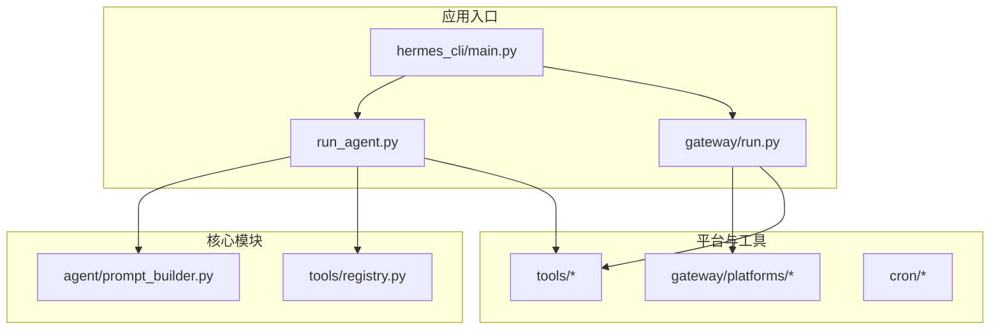
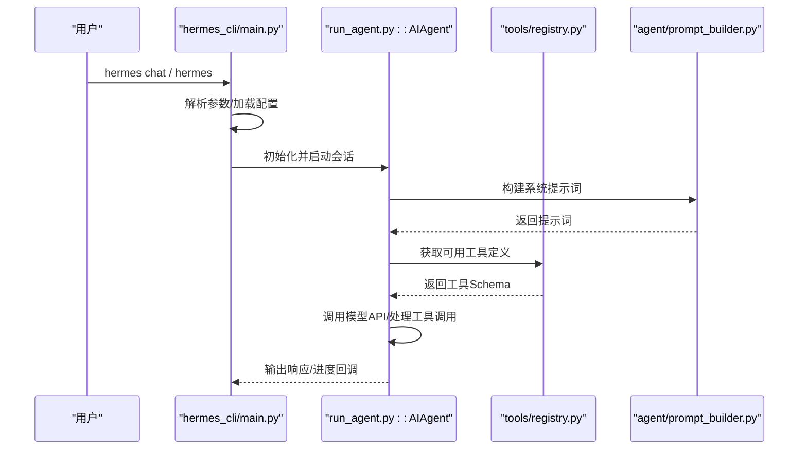
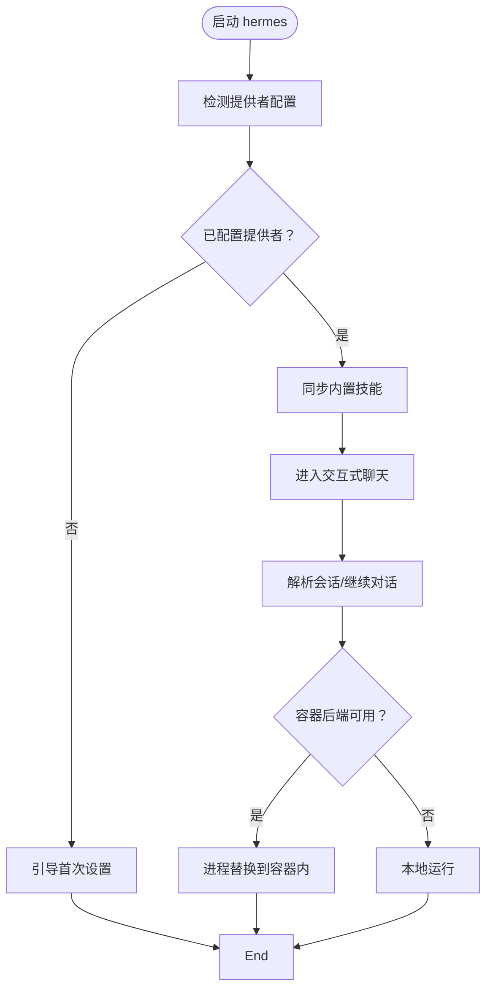
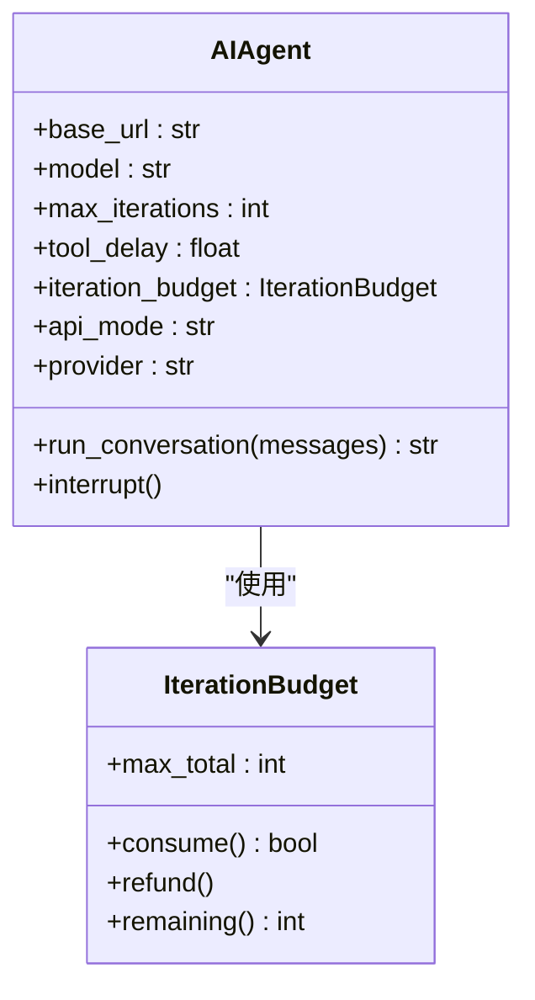
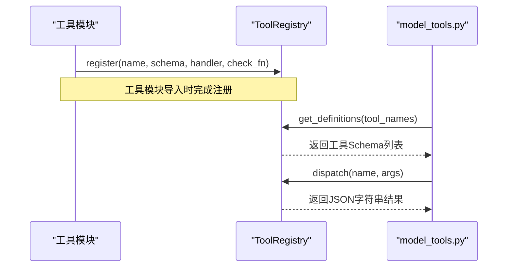
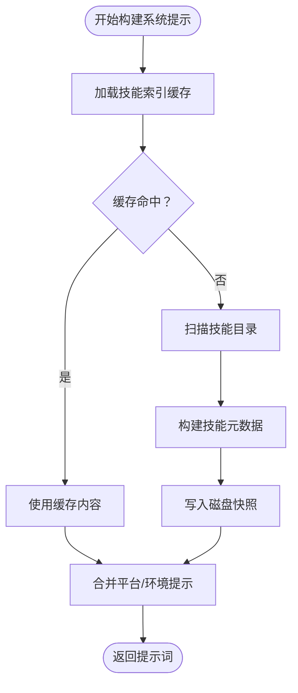
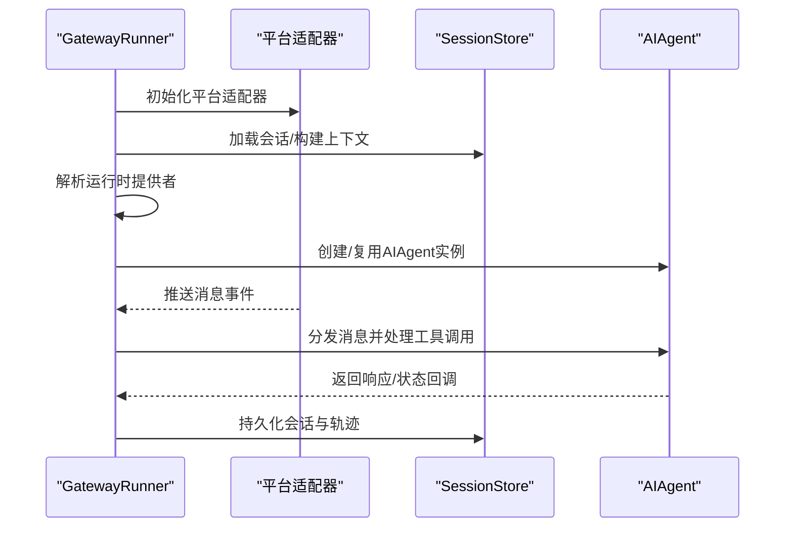
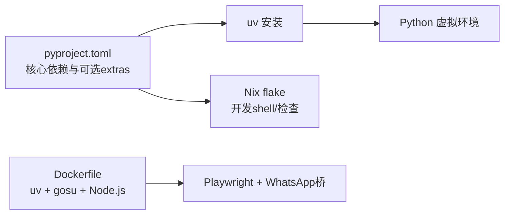

# 开发者指南

<cite>
**本文档引用的文件**
- [README.md](file://README.md)
- [CONTRIBUTING.md](file://CONTRIBUTING.md)
- [pyproject.toml](file://pyproject.toml)
- [requirements.txt](file://requirements.txt)
- [Dockerfile](file://Dockerfile)
- [flake.nix](file://flake.nix)
- [hermes_cli/main.py](file://hermes_cli/main.py)
- [run_agent.py](file://run_agent.py)
- [tools/registry.py](file://tools/registry.py)
- [agent/prompt_builder.py](file://agent/prompt_builder.py)
- [gateway/run.py](file://gateway/run.py)
- [scripts/install.sh](file://scripts/install.sh)
</cite>

## 目录
1. [简介](#简介)
2. [项目结构](#项目结构)
3. [核心组件](#核心组件)
4. [架构总览](#架构总览)
5. [详细组件分析](#详细组件分析)
6. [依赖分析](#依赖分析)
7. [性能考虑](#性能考虑)
8. [故障排查指南](#故障排查指南)
9. [结论](#结论)
10. [附录](#附录)

## 简介
本指南面向希望为 Hermes Agent 贡献代码的开发者，覆盖开发环境搭建、项目结构、代码贡献流程、测试策略、调试与性能优化、构建与打包、编码规范与文档标准，以及新功能开发的完整流程与最佳实践。Hermes Agent 是一个具备自学习能力的智能体，支持多平台消息网关、技能系统、工具体系与上下文压缩等特性。

## 项目结构
仓库采用模块化分层组织，核心目录与职责概览如下：
- agent：智能体内部逻辑（提示词构建、上下文压缩、记忆管理、模型元数据等）
- hermes_cli：命令行入口与交互式 TUI、配置管理、设置向导、皮肤引擎等
- tools：工具注册与发现、终端工具、文件操作、网络工具、代码执行、会话搜索等
- gateway：消息网关运行器与各平台适配器（Telegram、Discord、Slack、WhatsApp、Signal、邮件等）
- cron：定时任务调度
- acp_adapter：ACP 协议适配器
- plugins：可插拔内存与上下文引擎
- skills/optional-skills：内置与官方可选技能
- tests：全量测试套件
- scripts：安装脚本与桥接脚本
- web/website：前端与文档站点源码

**图表来源**
- [hermes_cli/main.py:1-120](file://hermes_cli/main.py#L1-L120)
- [run_agent.py:1-120](file://run_agent.py#L1-L120)
- [agent/prompt_builder.py:1-120](file://agent/prompt_builder.py#L1-L120)
- [tools/registry.py:1-120](file://tools/registry.py#L1-L120)
- [gateway/run.py:1-120](file://gateway/run.py#L1-L120)

**章节来源**
- [README.md:114-182](file://README.md#L114-L182)

## 核心组件
- 命令行入口与交互：hermes_cli/main.py 提供 CLI 子命令解析、配置加载、日志初始化、容器路由、会话浏览与启动交互式聊天。
- 智能体运行器：run_agent.py 定义 AIAgent 类，负责对话循环、工具调用、错误处理、消息历史管理、上下文压缩与轨迹保存。
- 工具注册中心：tools/registry.py 实现自注册工具机制，集中管理工具模式、处理器、可用性检查与并发安全。
- 提示词构建：agent/prompt_builder.py 组装系统提示词，注入身份、平台提示、技能索引、上下文文件与环境提示，并缓存技能索引以提升性能。
- 网关运行器：gateway/run.py 管理平台生命周期、消息路由、会话存储、交付路由、重启与恢复、危险命令审批与语音模式持久化等。

**章节来源**
- [hermes_cli/main.py:1-200](file://hermes_cli/main.py#L1-L200)
- [run_agent.py:535-780](file://run_agent.py#L535-L780)
- [tools/registry.py:100-200](file://tools/registry.py#L100-L200)
- [agent/prompt_builder.py:583-800](file://agent/prompt_builder.py#L583-L800)
- [gateway/run.py:554-720](file://gateway/run.py#L554-L720)

## 架构总览
Hermes Agent 的核心运行时由“命令行入口 → 智能体运行器 → 工具注册中心”构成；消息网关则独立于 CLI，通过平台适配器接入不同通信渠道。提示词构建模块在运行前组装系统提示，技能索引与条件激活规则决定工具与技能的可见性。

**图表来源**
- [hermes_cli/main.py:676-784](file://hermes_cli/main.py#L676-L784)
- [run_agent.py:535-780](file://run_agent.py#L535-L780)
- [tools/registry.py:258-286](file://tools/registry.py#L258-L286)
- [agent/prompt_builder.py:583-800](file://agent/prompt_builder.py#L583-L800)

## 详细组件分析

### 命令行入口与会话管理
- 功能要点
  - 参数解析与子命令分派
  - 首次运行引导与提供者检测
  - 容器后端探测与进程替换
  - 会话浏览与恢复
  - 环境变量与配置桥接
- 关键路径
  - 首次运行检查与引导：[has_any_provider_configured:194-292](file://hermes_cli/main.py#L194-L292)
  - 会话浏览与选择：[session_browse_picker:295-527](file://hermes_cli/main.py#L295-L527)
  - 容器后端探测与 exec：[_exec_in_container:561-647](file://hermes_cli/main.py#L561-L647)
  - CLI 启动与参数透传：[cmd_chat:676-784](file://hermes_cli/main.py#L676-L784)

**图表来源**
- [hermes_cli/main.py:194-292](file://hermes_cli/main.py#L194-L292)
- [hermes_cli/main.py:295-527](file://hermes_cli/main.py#L295-L527)
- [hermes_cli/main.py:561-647](file://hermes_cli/main.py#L561-L647)
- [hermes_cli/main.py:676-784](file://hermes_cli/main.py#L676-L784)

**章节来源**
- [hermes_cli/main.py:1-200](file://hermes_cli/main.py#L1-L200)
- [hermes_cli/main.py:295-527](file://hermes_cli/main.py#L295-L527)
- [hermes_cli/main.py:561-784](file://hermes_cli/main.py#L561-L784)

### 智能体运行器与工具调用
- 功能要点
  - 迭代预算控制与中断机制
  - 并发工具批处理与路径隔离
  - 文本与代理输出净化（surrogate、ASCII）
  - 大结果落盘与超大输出处理
  - API 模式自动推断与提供商路由
- 关键路径
  - AIAgent 初始化与 API 模式推断：[AIAgent.__init__:552-794](file://run_agent.py#L552-L794)
  - 工具批处理并发判定：[_should_parallelize_tool_batch:267-308](file://run_agent.py#L267-L308)
  - 文本净化与非 ASCII 清理：[_sanitize_surrogates/_sanitize_messages_non_ascii:345-503](file://run_agent.py#L345-L503)
  - 安全 stdio 包装：[_install_safe_stdio/_SafeWriter:162-168](file://run_agent.py#L162-L168)

**图表来源**
- [run_agent.py:535-794](file://run_agent.py#L535-L794)
- [run_agent.py:170-212](file://run_agent.py#L170-L212)

**章节来源**
- [run_agent.py:535-794](file://run_agent.py#L535-L794)
- [run_agent.py:267-308](file://run_agent.py#L267-L308)
- [run_agent.py:345-503](file://run_agent.py#L345-L503)
- [run_agent.py:162-168](file://run_agent.py#L162-L168)

### 工具注册中心与自注册机制
- 功能要点
  - 工具文件在导入时注册自身
  - 注册表线程安全快照读取
  - 工具集可用性检查与别名映射
  - 工具 Schema 生成与错误格式化
- 关键路径
  - 注册表类与注册接口：[ToolRegistry.register:176-228](file://tools/registry.py#L176-L228)
  - 工具 Schema 获取：[get_definitions:258-286](file://tools/registry.py#L258-L286)
  - 工具分发与异常捕获：[dispatch:292-310](file://tools/registry.py#L292-L310)

**图表来源**
- [tools/registry.py:176-228](file://tools/registry.py#L176-L228)
- [tools/registry.py:258-310](file://tools/registry.py#L258-L310)

**章节来源**
- [tools/registry.py:100-200](file://tools/registry.py#L100-L200)
- [tools/registry.py:258-310](file://tools/registry.py#L258-L310)

### 提示词构建与技能索引
- 功能要点
  - 技能索引缓存（进程内LRU + 磁盘快照）
  - 条件激活规则（requires/fallback）
  - 上下文文件威胁扫描与隐藏字符过滤
  - 平台提示与环境提示注入
- 关键路径
  - 技能索引构建与缓存：[build_skills_system_prompt:583-800](file://agent/prompt_builder.py#L583-L800)
  - 条件激活判定：[_skill_should_show:552-580](file://agent/prompt_builder.py#L552-L580)
  - 上下文文件扫描与阻断：[_scan_context_content:55-73](file://agent/prompt_builder.py#L55-L73)

**图表来源**
- [agent/prompt_builder.py:583-800](file://agent/prompt_builder.py#L583-L800)
- [agent/prompt_builder.py:55-73](file://agent/prompt_builder.py#L55-L73)

**章节来源**
- [agent/prompt_builder.py:552-580](file://agent/prompt_builder.py#L552-L580)
- [agent/prompt_builder.py:583-800](file://agent/prompt_builder.py#L583-L800)
- [agent/prompt_builder.py:55-73](file://agent/prompt_builder.py#L55-L73)

### 网关运行器与平台适配
- 功能要点
  - 平台生命周期管理与重连
  - 会话存储与上下文提示构建
  - 危险命令审批与语音模式持久化
  - 运行时提供者解析与 AIAgent 缓存
- 关键路径
  - 网关运行器主类：[GatewayRunner:554-720](file://gateway/run.py#L554-L720)
  - 运行时提供者解析：[_resolve_runtime_agent_kwargs:335-357](file://gateway/run.py#L335-L357)
  - 会话模型覆盖与缓存：[agent_cache:620-628](file://gateway/run.py#L620-L628)

**图表来源**
- [gateway/run.py:554-720](file://gateway/run.py#L554-L720)
- [gateway/run.py:335-357](file://gateway/run.py#L335-L357)
- [gateway/run.py:620-628](file://gateway/run.py#L620-L628)

**章节来源**
- [gateway/run.py:554-720](file://gateway/run.py#L554-L720)
- [gateway/run.py:335-357](file://gateway/run.py#L335-L357)
- [gateway/run.py:620-628](file://gateway/run.py#L620-L628)

## 依赖分析
- 语言与包管理
  - Python 3.11+，使用 uv 作为快速包管理器
  - 依赖声明集中在 pyproject.toml，requirements.txt 仅作便捷维护
- 可选依赖与平台
  - 可选 extras 覆盖消息网关、定时任务、CLI 菜单、开发工具、TTS、语音、MCP、ACP、矩阵、钉钉、飞书、Web、RL 等
  - Nix flake 提供跨平台开发环境与检查
- 容器与打包
  - Dockerfile 使用 uv 与 gosu，预装 Node.js、Playwright 与 WhatsApp 桥接依赖
  - 入口脚本确保非缓冲输出与数据卷挂载

**图表来源**
- [pyproject.toml:13-115](file://pyproject.toml#L13-L115)
- [requirements.txt:1-37](file://requirements.txt#L1-L37)
- [flake.nix:1-36](file://flake.nix#L1-L36)
- [Dockerfile:1-47](file://Dockerfile#L1-L47)

**章节来源**
- [pyproject.toml:13-115](file://pyproject.toml#L13-L115)
- [requirements.txt:1-37](file://requirements.txt#L1-L37)
- [flake.nix:1-36](file://flake.nix#L1-L36)
- [Dockerfile:1-47](file://Dockerfile#L1-L47)

## 性能考虑
- 工具并发与路径隔离
  - 批量工具调用并发判定基于工具集合、路径范围与只读工具白名单
  - 文件相关工具按路径范围去重，避免并发冲突
- 提示词与技能索引缓存
  - 技能索引采用 LRU + 磁盘快照，减少文件系统扫描开销
- 文本净化与非 ASCII 回退
  - 对代理输出进行 surrogates 与非 ASCII 字符清理，避免序列化失败与编码问题
- 日志与 I/O 安全
  - stdout/stderr 包装防止管道断开导致崩溃，保障服务化运行稳定性

**章节来源**
- [run_agent.py:267-308](file://run_agent.py#L267-L308)
- [run_agent.py:345-503](file://run_agent.py#L345-L503)
- [agent/prompt_builder.py:428-497](file://agent/prompt_builder.py#L428-L497)
- [run_agent.py:162-168](file://run_agent.py#L162-L168)

## 故障排查指南
- 常见问题定位
  - 首次运行无提供者配置：检查 .env 与配置桥接，确认 OPENROUTER_API_KEY、OPENAI_API_KEY、ANTHROPIC_API_KEY 等是否正确
  - 容器后端不可见：检查 sudo 权限或用户命名空间访问限制
  - 平台证书问题：确保 SSL_CERT_FILE 设置或 certifi 可用
  - 危险命令与审批：启用 HERMES_EXEC_ASK，配合审批流程
- 诊断命令
  - hermes doctor：检查配置与依赖
  - hermes setup：交互式配置向导
  - hermes gateway status/start/stop：网关状态与生命周期管理

**章节来源**
- [hermes_cli/main.py:194-292](file://hermes_cli/main.py#L194-L292)
- [gateway/run.py:36-73](file://gateway/run.py#L36-L73)
- [README.md:42-63](file://README.md#L42-L63)

## 结论
Hermes Agent 通过清晰的模块划分与自注册工具机制，实现了高度可扩展的智能体框架。开发者应优先遵循贡献规范、测试策略与安全准则，在 CLI、网关与工具层面协同推进。建议在本地使用 uv 与 Nix 构建环境，结合 Docker 快速验证跨平台行为，并利用缓存与并发策略优化性能。

## 附录

### 开发环境搭建
- 快速安装
  - 使用安装脚本一键安装：[scripts/install.sh:1-120](file://scripts/install.sh#L1-L120)
  - 支持 Linux、macOS、Android/Termux，自动检测 uv、Python、Git、Node.js、系统包
- 本地开发
  - 使用 uv 创建虚拟环境并安装所有依赖与可选 extras
  - 可选：安装 Node.js 用于浏览器工具与 WhatsApp 桥接
  - 可选：克隆 tinker-atropos 子模块用于 RL 训练集成

**章节来源**
- [scripts/install.sh:1-120](file://scripts/install.sh#L1-L120)
- [README.md:146-160](file://README.md#L146-L160)

### 代码贡献流程
- 分支命名与提交信息
  - 分支命名：fix/、feat/、docs/、test/、refactor/
  - Conventional Commits 规范，包含类型(scope)描述
- 提交流程
  - 运行 pytest tests/ -v，确保通过
  - 在 hermes 与网关场景中手动验证变更
  - 保持 PR 聚焦单一逻辑改动
- 代码风格
  - PEP 8，注释仅解释非显而易见的意图
  - 错误处理：捕获具体异常，记录日志并保留堆栈
  - 跨平台兼容：避免 Unix 特有 API，使用 pathlib 与编码容错

**章节来源**
- [CONTRIBUTING.md:584-637](file://CONTRIBUTING.md#L584-L637)
- [CONTRIBUTING.md:230-236](file://CONTRIBUTING.md#L230-L236)

### 测试策略
- 测试运行
  - pytest tests/ -v，跳过需要外部服务的集成测试
  - 可选：pytest -m integration -v 运行集成测试
- 覆盖范围
  - CLI、网关、工具、技能、智能体核心循环、消息平台适配、定时任务、插件等

**章节来源**
- [pyproject.toml:131-137](file://pyproject.toml#L131-L137)

### 构建与打包
- 项目打包
  - setuptools 构建后端，py_modules 与 packages.find.include 明确导出模块
  - scripts hermes、hermes-agent、hermes-acp 入口
- 容器镜像
  - Dockerfile 使用 uv 与 gosu，预装 Node.js、Playwright、WhatsApp 桥
  - 非 root 用户运行，数据卷挂载 /opt/data，PYTHONUNBUFFERED=1

**章节来源**
- [pyproject.toml:122-129](file://pyproject.toml#L122-L129)
- [Dockerfile:1-47](file://Dockerfile#L1-L47)

### 编码规范与文档标准
- 命名约定
  - 模块与类：小写下划线命名
  - 函数与变量：小写下划线命名
  - 常量：全大写
- 文档标准
  - README 与 CONTRIBUTING 提供贡献指南与架构说明
  - 工具与技能需提供 SKILL.md 或工具注释与 Schema
  - 重要变更需更新文档与示例

**章节来源**
- [CONTRIBUTING.md:230-236](file://CONTRIBUTING.md#L230-L236)
- [README.md:87-108](file://README.md#L87-L108)

### 新功能开发流程与最佳实践
- 新工具
  - 自注册：在工具文件末尾调用 registry.register，提供 schema、handler、check_fn
  - 引入 model_tools 导入链：在 model_tools 的 _modules 列表中加入模块路径
  - 如需新工具集，更新 toolsets.py 与平台预设
- 新技能
  - 在 skills/ 或 optional-skills/ 下创建分类目录与 SKILL.md
  - 使用条件激活 metadata.hermes：requires_toolsets/fallback_for_toolsets
  - 通过 hermes skills config 控制启用/禁用
- 新平台适配
  - 在 gateway/platforms/ 下新增适配器，实现统一接口
  - 更新 gateway/config.py 与平台枚举
- 网关与 CLI 协同
  - 网关侧通过 SessionStore 与 DeliveryRouter 管理会话与交付
  - CLI 侧通过 hermes_cli.gateway 与 hermes_cli.commands 协调命令与回调

**章节来源**
- [CONTRIBUTING.md:239-300](file://CONTRIBUTING.md#L239-L300)
- [CONTRIBUTING.md:302-463](file://CONTRIBUTING.md#L302-L463)
- [CONTRIBUTING.md:466-513](file://CONTRIBUTING.md#L466-L513)
- [gateway/run.py:554-720](file://gateway/run.py#L554-L720)

### 开发工具与调试
- IDE 配置
  - 使用 Python 3.11+ 与 uv 虚拟环境
  - 在 VS Code 中启用 Python 解释器指向 venv/bin/python
- 调试器
  - dev 可选依赖包含 debugpy，可在 IDE 中启用远程调试
- 性能分析
  - 使用 pytest-xdist 并行测试
  - 在工具与提示词构建处添加日志，观察缓存命中与路径扫描
- 容器与跨平台
  - 使用 Dockerfile 构建镜像，验证非 root 运行与数据卷
  - 使用 Nix flake 在不同系统上复现一致环境

**章节来源**
- [pyproject.toml:42-42](file://pyproject.toml#L42-L42)
- [Dockerfile:1-47](file://Dockerfile#L1-L47)
- [flake.nix:1-36](file://flake.nix#L1-L36)