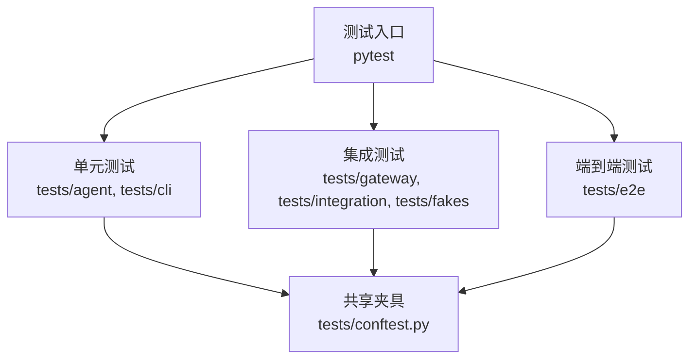
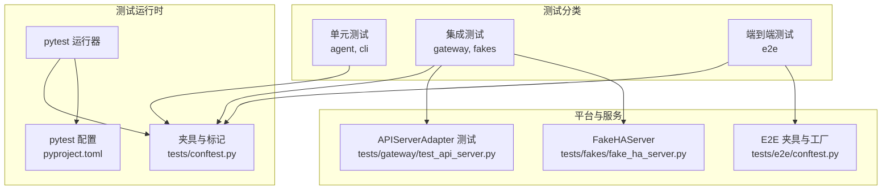
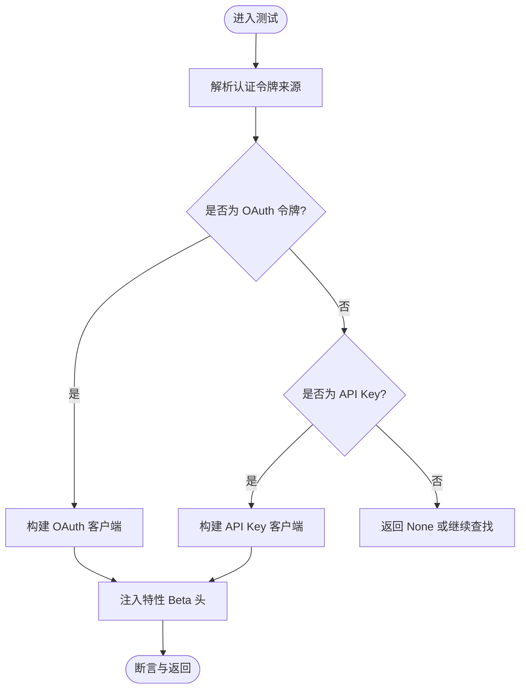
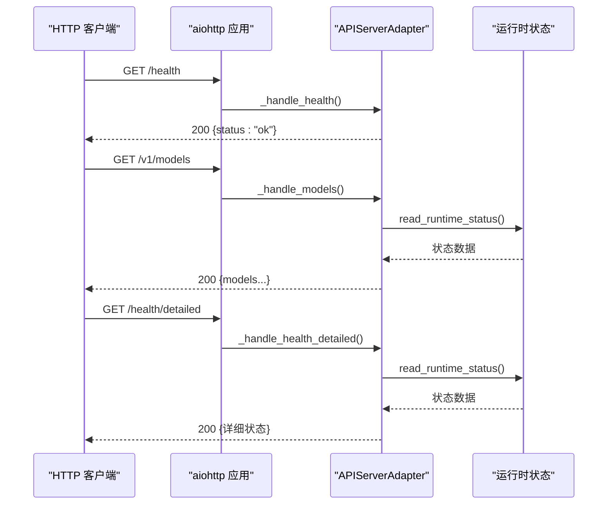
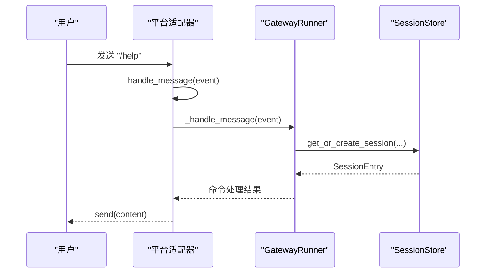
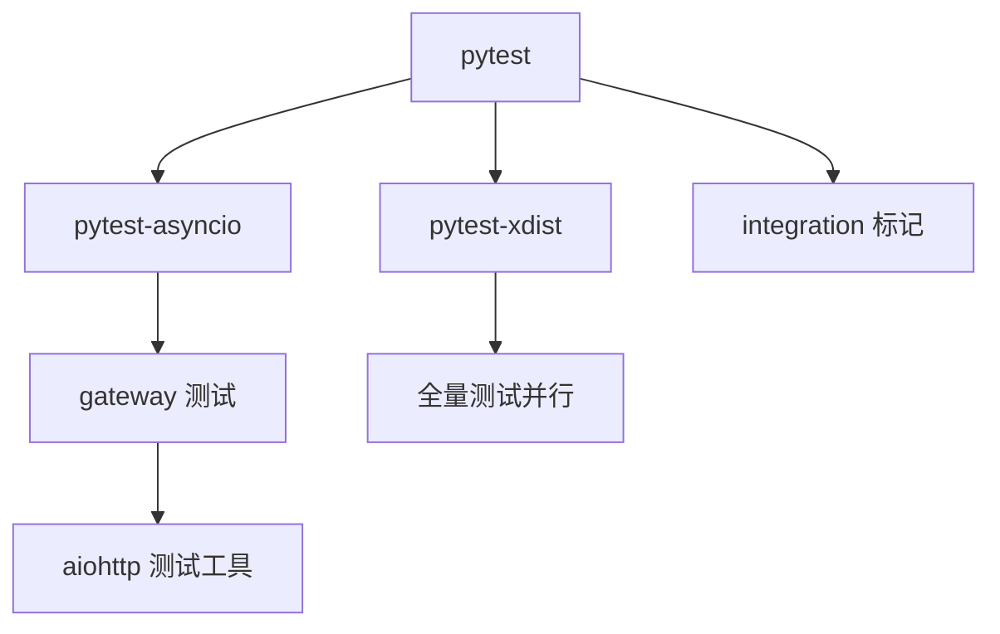

# 测试策略

<cite>
**本文引用的文件**
- [tests/conftest.py](file://tests/conftest.py)
- [pyproject.toml](file://pyproject.toml)
- [README.md](file://README.md)
- [tests/agent/test_anthropic_adapter.py](file://tests/agent/test_anthropic_adapter.py)
- [tests/gateway/test_api_server.py](file://tests/gateway/test_api_server.py)
- [tests/e2e/conftest.py](file://tests/e2e/conftest.py)
- [tests/e2e/test_platform_commands.py](file://tests/e2e/test_platform_commands.py)
- [tests/fakes/fake_ha_server.py](file://tests/fakes/fake_ha_server.py)
- [tests/integration/test_batch_runner.py](file://tests/integration/test_batch_runner.py)
</cite>

## 目录
1. [引言](#引言)
2. [项目结构](#项目结构)
3. [核心组件](#核心组件)
4. [架构总览](#架构总览)
5. [详细组件分析](#详细组件分析)
6. [依赖分析](#依赖分析)
7. [性能考虑](#性能考虑)
8. [故障排查指南](#故障排查指南)
9. [结论](#结论)
10. [附录](#附录)

## 引言
本测试策略文档面向 Hermes Agent 的开发与维护团队，旨在建立系统化、可执行的测试体系，覆盖单元测试、集成测试与端到端（E2E）测试，明确测试运行方式、编写规范、覆盖率与质量标准，并提供测试环境配置、数据准备与清理流程，以及常见场景与调试技巧，帮助开发者高效产出高质量测试代码。

## 项目结构
测试目录采用按功能域分层组织的方式，主要分为：
- tests/agent：针对 agent 子系统的适配器与工具模块进行单元测试
- tests/gateway：针对网关平台适配器与服务端接口进行测试
- tests/cli：针对 CLI 命令行行为与交互进行测试
- tests/e2e：端到端测试，覆盖跨平台消息流与命令处理
- tests/fakes：用于集成测试的本地假服务（如 Home Assistant）
- tests/integration：需要外部资源或真实环境的集成测试脚本
- tests/run_agent、tests/tools 等：针对运行时与工具集的专项测试

pytest 配置位于根目录，通过 pyproject.toml 指定默认测试路径、标记与并行执行参数；全局共享夹具与隔离策略由 tests/conftest.py 提供。

图表来源
- [pyproject.toml:131-137](file://pyproject.toml#L131-L137)
- [tests/conftest.py:1-122](file://tests/conftest.py#L1-122)

章节来源
- [pyproject.toml:131-137](file://pyproject.toml#L131-L137)
- [tests/conftest.py:1-122](file://tests/conftest.py#L1-122)

## 核心组件
- 全局夹具与隔离
  - 自动隔离用户主目录与会话环境变量，避免测试写入真实配置与缓存
  - 统一事件循环管理，兼容同步/异步测试
  - 默认单测超时保护，防止阻塞导致测试套件停滞
- 测试运行配置
  - 默认排除“integration”标记的测试，可通过命令行显式启用
  - 支持并行执行（n auto），提升测试吞吐
- 平台与消息流测试支持
  - E2E 测试提供 Telegram/Discord/Slack 适配器与运行器的模拟工厂
  - 网关 API 服务器测试使用 aiohttp 测试客户端与中间件

章节来源
- [tests/conftest.py:19-43](file://tests/conftest.py#L19-L43)
- [tests/conftest.py:77-122](file://tests/conftest.py#L77-L122)
- [pyproject.toml:131-137](file://pyproject.toml#L131-L137)

## 架构总览
下图展示了测试运行的整体架构与关键组件交互：

图表来源
- [tests/conftest.py:1-122](file://tests/conftest.py#L1-122)
- [pyproject.toml:131-137](file://pyproject.toml#L131-L137)
- [tests/gateway/test_api_server.py:1-200](file://tests/gateway/test_api_server.py#L1-L200)
- [tests/fakes/fake_ha_server.py:1-200](file://tests/fakes/fake_ha_server.py#L1-L200)
- [tests/e2e/conftest.py:1-267](file://tests/e2e/conftest.py#L1-L267)

## 详细组件分析

### 单元测试：Anthropic 适配器
- 覆盖范围
  - 认证令牌解析与刷新逻辑
  - 客户端构建与请求头注入
  - 凭据读取与有效期校验
- 关键测试点
  - OAuth 令牌识别与优先级
  - API Key 与自定义 BaseURL 的处理
  - Claude Code 凭据文件读取与写入
  - 刷新流程与失败回退
- 断言与模拟
  - 使用 patch 替换 SDK 初始化与网络调用
  - 使用临时目录与环境变量隔离
- 示例参考
  - [tests/agent/test_anthropic_adapter.py:34-217](file://tests/agent/test_anthropic_adapter.py#L34-L217)
  - [tests/agent/test_anthropic_adapter.py:269-386](file://tests/agent/test_anthropic_adapter.py#L269-L386)

图表来源
- [tests/agent/test_anthropic_adapter.py:58-117](file://tests/agent/test_anthropic_adapter.py#L58-L117)
- [tests/agent/test_anthropic_adapter.py:180-267](file://tests/agent/test_anthropic_adapter.py#L180-L267)

章节来源
- [tests/agent/test_anthropic_adapter.py:1-200](file://tests/agent/test_anthropic_adapter.py#L1-L200)
- [tests/agent/test_anthropic_adapter.py:200-399](file://tests/agent/test_anthropic_adapter.py#L200-L399)

### 集成测试：网关 API 服务器
- 覆盖范围
  - /health 与 /health/detailed 健康检查
  - /v1/models 模型列表与鉴权
  - /v1/chat/completions 与 /v1/responses 请求/响应链
  - CORS 与安全响应头
- 测试方法
  - 使用 aiohttp.TestClient/TestServer 构造应用实例
  - 通过夹具创建适配器与路由
  - 使用 patch 注入运行时状态
- 示例参考
  - [tests/gateway/test_api_server.py:248-399](file://tests/gateway/test_api_server.py#L248-L399)

图表来源
- [tests/gateway/test_api_server.py:217-331](file://tests/gateway/test_api_server.py#L217-L331)

章节来源
- [tests/gateway/test_api_server.py:1-200](file://tests/gateway/test_api_server.py#L1-L200)
- [tests/gateway/test_api_server.py:200-399](file://tests/gateway/test_api_server.py#L200-L399)

### 端到端测试：平台命令
- 覆盖范围
  - Telegram/Discord/Slack 三平台命令处理流水线
  - 会话生命周期与状态变更
  - 授权与发送失败的容错
- 测试方法
  - 使用 e2e 夹具构造消息事件与运行器
  - 通过 AsyncMock 捕获 adapter.send 调用
  - 参数化平台以复用测试逻辑
- 示例参考
  - [tests/e2e/test_platform_commands.py:22-191](file://tests/e2e/test_platform_commands.py#L22-L191)
  - [tests/e2e/conftest.py:206-267](file://tests/e2e/conftest.py#L206-L267)

图表来源
- [tests/e2e/test_platform_commands.py:25-48](file://tests/e2e/test_platform_commands.py#L25-L48)
- [tests/e2e/conftest.py:156-204](file://tests/e2e/conftest.py#L156-L204)

章节来源
- [tests/e2e/test_platform_commands.py:1-191](file://tests/e2e/test_platform_commands.py#L1-L191)
- [tests/e2e/conftest.py:1-267](file://tests/e2e/conftest.py#L1-L267)

### 集成测试：Home Assistant 假服务
- 覆盖范围
  - WebSocket 认证握手与事件推送
  - REST 端点：获取实体状态、调用服务、持久通知
- 测试方法
  - 使用 aiohttp.web 构建最小化服务端
  - 通过队列模拟事件推送
  - 支持拒绝认证与强制 500 错误
- 示例参考
  - [tests/fakes/fake_ha_server.py:77-143](file://tests/fakes/fake_ha_server.py#L77-L143)

章节来源
- [tests/fakes/fake_ha_server.py:1-200](file://tests/fakes/fake_ha_server.py#L1-L200)

### 集成测试：批处理运行器
- 覆盖范围
  - 小规模数据集验证输出结构
  - 检查点、统计文件与批次文件生成
- 测试方法
  - 创建 JSONL 数据集与清理输出目录
  - 手动验证输出目录与文件存在性
- 示例参考
  - [tests/integration/test_batch_runner.py:17-91](file://tests/integration/test_batch_runner.py#L17-L91)

章节来源
- [tests/integration/test_batch_runner.py:1-133](file://tests/integration/test_batch_runner.py#L1-L133)

## 依赖分析
- 测试运行器与配置
  - pytest 与 pytest-asyncio：支持异步测试与并发
  - pytest-xdist：并行执行
  - 标记 integration：用于区分需外部依赖的测试
- 平台与网络
  - aiohttp 及其测试工具：用于网关 API 服务器与假服务
  - 平台库（telegram/discord/slack）在 E2E 中以 Mock 形式注入，避免真实依赖
- 工具与辅助
  - unittest.mock：广泛用于替换外部依赖与注入行为
  - pytest.mark.asyncio：标注异步测试用例

图表来源
- [pyproject.toml:42-43](file://pyproject.toml#L42-L43)
- [tests/gateway/test_api_server.py:20-33](file://tests/gateway/test_api_server.py#L20-L33)
- [tests/e2e/conftest.py:26-122](file://tests/e2e/conftest.py#L26-L122)

章节来源
- [pyproject.toml:39-64](file://pyproject.toml#L39-L64)
- [tests/gateway/test_api_server.py:1-23](file://tests/gateway/test_api_server.py#L1-L23)
- [tests/e2e/conftest.py:1-26](file://tests/e2e/conftest.py#L1-L26)

## 性能考虑
- 并行执行
  - 使用 -n auto 启用自动并行，提升整体吞吐
- 超时控制
  - 单测默认 30 秒超时，避免长时间阻塞
- I/O 与网络
  - 优先使用 aiohttp.TestServer 与 AsyncMock，减少真实网络调用
  - 对外部 API 的测试建议使用标记 integration 并在 CI 中单独运行

## 故障排查指南
- 常见问题
  - 测试卡住或超时：检查是否存在未关闭的事件循环或未完成的异步任务
  - 平台库缺失导致导入失败：E2E 夹具已内置 Mock，确认是否正确注入
  - 真实 API 密钥泄漏风险：全局夹具会删除 OPENROUTER_API_KEY 等环境变量，确保测试不依赖真实密钥
- 调试技巧
  - 使用 -v 输出详细日志
  - 使用 -k 过滤测试名称，快速定位问题
  - 在需要时添加 print 或使用 pytest 的 -s 输出
  - 对异步测试，确保正确使用 pytest.mark.asyncio 与 await

章节来源
- [tests/conftest.py:19-43](file://tests/conftest.py#L19-L43)
- [tests/conftest.py:77-122](file://tests/conftest.py#L77-L122)
- [pyproject.toml:131-137](file://pyproject.toml#L131-L137)

## 结论
通过统一的夹具与隔离策略、清晰的测试分类与运行配置，Hermes Agent 的测试体系能够稳定地覆盖从单元到端到端的关键路径。建议在日常开发中遵循本文的编写指南与质量标准，结合覆盖率与性能考量，持续完善测试矩阵，保障系统在多平台与复杂场景下的可靠性。

## 附录

### 测试运行方法与常用命令
- 运行全部测试（默认排除 integration）
  - python -m pytest tests/ -v
- 并行运行
  - python -m pytest tests/ -v -n auto
- 运行特定标记（如 integration）
  - python -m pytest tests/ -v -m integration
- 排除某类测试
  - python -m pytest tests/ -v -m "not integration"
- 查看覆盖率（如使用 pytest-cov）
  - python -m pytest tests/ --cov=. --cov-report=term-missing

章节来源
- [README.md:144-154](file://README.md#L144-L154)
- [pyproject.toml:131-137](file://pyproject.toml#L131-L137)

### 测试编写指南
- 测试用例设计
  - 每个函数/类聚焦单一职责，用例覆盖正常、边界与异常路径
  - 使用参数化测试复用相同逻辑的不同输入
- 断言方法
  - 优先断言最终行为与副作用（如 SessionStore 的调用次数）
  - 对异步逻辑使用 await 与 pytest.mark.asyncio
- 模拟对象使用
  - 使用 patch 替换外部依赖（SDK、网络、文件系统）
  - 使用 AsyncMock 模拟异步发送与回调
- 数据准备与清理
  - 使用 tmp_path 提供临时目录
  - 使用 monkeypatch 设置/恢复环境变量
  - 对于批处理等集成测试，提供显式的清理函数

章节来源
- [tests/agent/test_anthropic_adapter.py:119-165](file://tests/agent/test_anthropic_adapter.py#L119-L165)
- [tests/gateway/test_api_server.py:206-241](file://tests/gateway/test_api_server.py#L206-L241)
- [tests/e2e/test_platform_commands.py:176-191](file://tests/e2e/test_platform_commands.py#L176-L191)

### 测试覆盖率与质量标准
- 覆盖率目标（建议）
  - 关键模块（agent、gateway、cli）行覆盖率不低于 80%
  - 分支覆盖率不低于 70%
- 质量标准
  - 每个公共函数至少有一个正向与一个反向测试
  - 异步路径必须标注 @pytest.mark.asyncio 并显式 await
  - 集成测试使用标记 integration，并在 CI 中单独运行
  - 禁止在测试中直接访问真实外部服务，必要时使用假服务或 Mock

章节来源
- [pyproject.toml:133-136](file://pyproject.toml#L133-L136)
- [tests/fakes/fake_ha_server.py:1-200](file://tests/fakes/fake_ha_server.py#L1-L200)