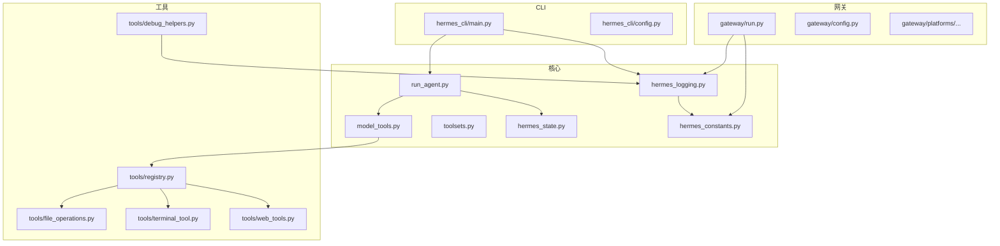
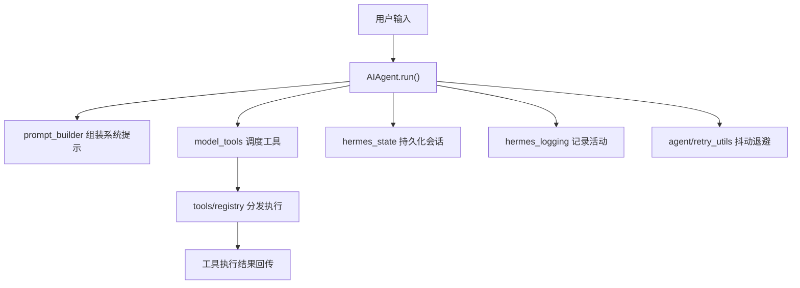
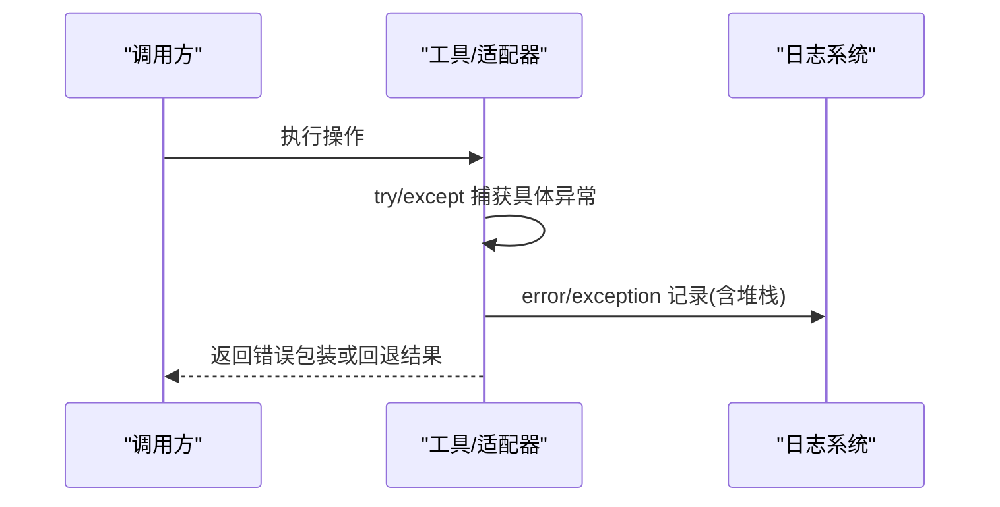
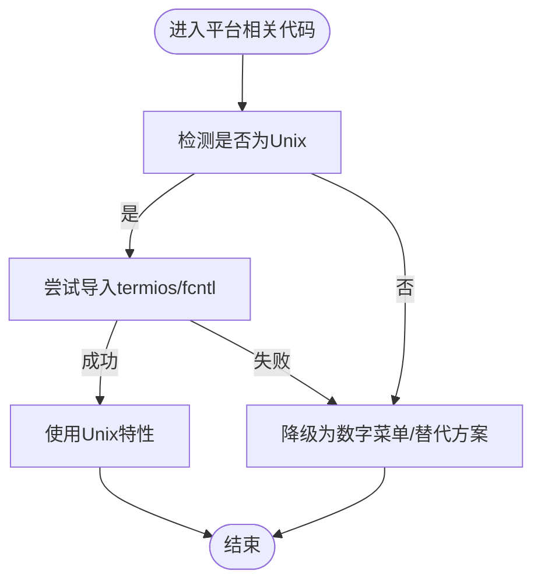
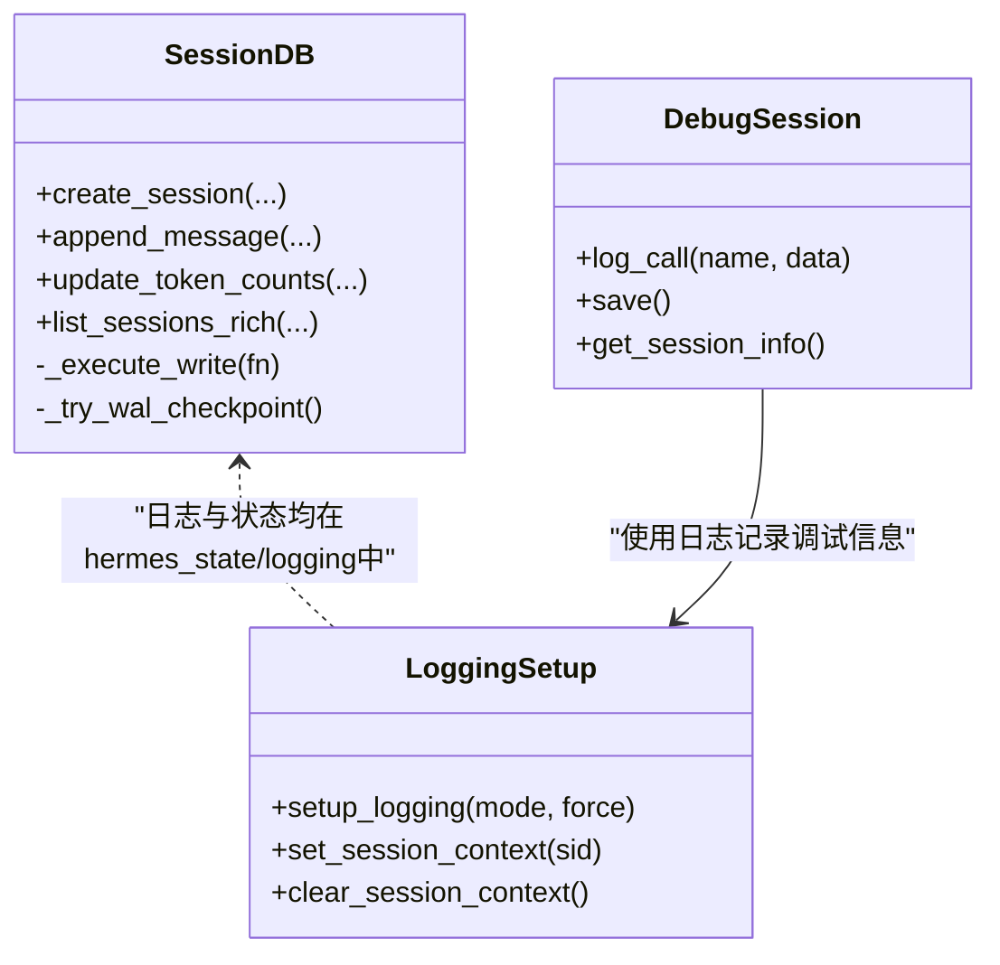
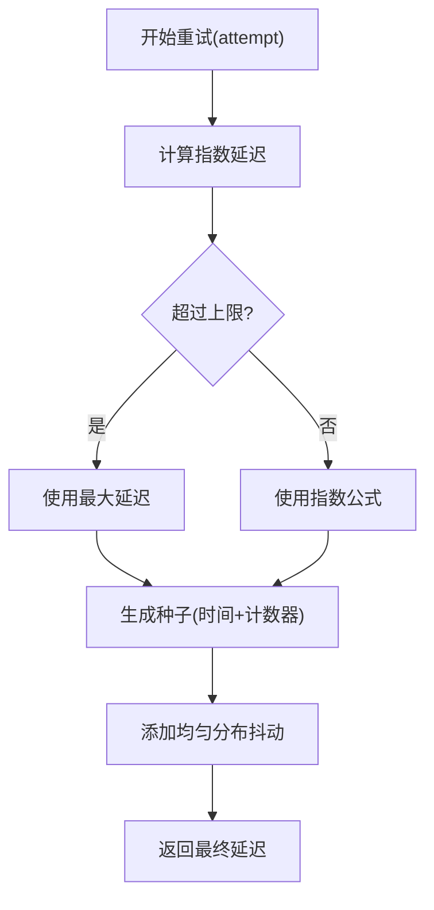
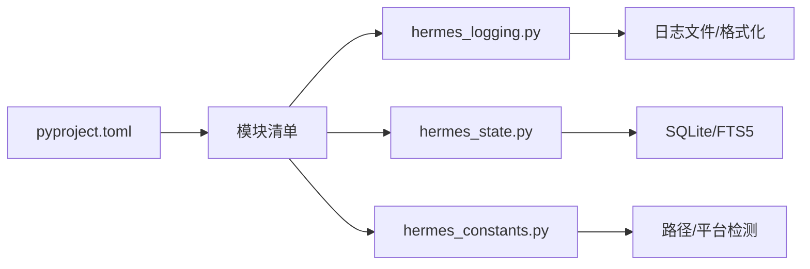

# 编码规范

<cite>
**本文引用的文件**
- [CONTRIBUTING.md](file://CONTRIBUTING.md)
- [README.md](file://README.md)
- [pyproject.toml](file://pyproject.toml)
- [hermes_constants.py](file://hermes_constants.py)
- [hermes_logging.py](file://hermes_logging.py)
- [hermes_state.py](file://hermes_state.py)
- [agent/retry_utils.py](file://agent/retry_utils.py)
- [tools/debug_helpers.py](file://tools/debug_helpers.py)
- [acp_adapter/entry.py](file://acp_adapter/entry.py)
- [acp_adapter/server.py](file://acp_adapter/server.py)
- [acp_adapter/permissions.py](file://acp_adapter/permissions.py)
- [acp_adapter/events.py](file://acp_adapter/events.py)
</cite>

## 目录
1. [引言](#引言)
2. [项目结构](#项目结构)
3. [核心组件](#核心组件)
4. [架构总览](#架构总览)
5. [详细组件分析](#详细组件分析)
6. [依赖分析](#依赖分析)
7. [性能考量](#性能考量)
8. [故障排查指南](#故障排查指南)
9. [结论](#结论)
10. [附录](#附录)

## 引言
本指南面向Hermes Agent贡献者与维护者，系统化制定编码规范与最佳实践。内容基于仓库现有贡献指南、日志与状态管理实现、重试工具与调试辅助等关键模块，结合PEP 8与项目实际约束，形成可执行、可落地的工程标准。

## 项目结构
Hermes Agent采用按功能域分层的模块化组织：核心运行时（run_agent、model_tools）、CLI入口（hermes_cli）、工具集（tools）、网关（gateway）、技能（skills）等。项目通过集中式常量与日志模块提供跨模块一致的基础设施能力。

图表来源
- [pyproject.toml:117-123](file://pyproject.toml#L117-L123)
- [hermes_state.py:1-16](file://hermes_state.py#L1-L16)
- [hermes_logging.py:1-25](file://hermes_logging.py#L1-L25)
- [hermes_constants.py:1-11](file://hermes_constants.py#L1-L11)

章节来源
- [pyproject.toml:117-123](file://pyproject.toml#L117-L123)
- [README.md:114-182](file://README.md#L114-L182)

## 核心组件
- 常量与环境：统一路径解析、平台检测、网络偏好等，确保跨平台一致性与可移植性。
- 日志系统：集中初始化、会话上下文注入、组件路由、轮转与脱敏格式化。
- 状态存储：SQLite + FTS5，支持并发写入优化与模式迁移。
- 重试工具：抖动退避，避免并发风暴。
- 调试辅助：按工具维度启用调试日志，自动落盘并输出会话信息。

章节来源
- [hermes_constants.py:11-112](file://hermes_constants.py#L11-L112)
- [hermes_logging.py:156-261](file://hermes_logging.py#L156-L261)
- [hermes_state.py:115-161](file://hermes_state.py#L115-L161)
- [agent/retry_utils.py:19-58](file://agent/retry_utils.py#L19-L58)
- [tools/debug_helpers.py:36-106](file://tools/debug_helpers.py#L36-L106)

## 架构总览
Hermes Agent遵循“自注册工具 + 工具集编排 + 会话持久化”的核心模式。CLI与网关共享同一套日志与状态基础设施；工具通过注册表统一调度；状态库以WAL模式支撑多进程并发写入。

图表来源
- [README.md:200-227](file://README.md#L200-L227)
- [hermes_state.py:115-161](file://hermes_state.py#L115-L161)
- [hermes_logging.py:156-261](file://hermes_logging.py#L156-L261)
- [agent/retry_utils.py:19-58](file://agent/retry_utils.py#L19-L58)

## 详细组件分析

### PEP 8与项目例外
- 遵循PEP 8风格，但不强制严格行长度限制。
- 注释仅在解释非显而易见的设计意图、权衡取舍或第三方API差异时使用。
- 错误处理优先捕获具体异常，并在日志中附带堆栈信息以便诊断。
- 跨平台开发严禁假设Unix特性，需对Windows与类Unix差异进行条件分支与降级处理。

章节来源
- [CONTRIBUTING.md:230-236](file://CONTRIBUTING.md#L230-L236)

### 注释与文档字符串规范
- 函数/方法/类应提供清晰的文档字符串，说明用途、参数、返回值与异常。
- 对于复杂逻辑或跨平台差异，应在注释中阐明原因与替代方案。
- 文档字符串示例可参考工具模块中的典型实现（如工具注册与处理器定义）。

章节来源
- [CONTRIBUTING.md:239-287](file://CONTRIBUTING.md#L239-L287)

### 错误处理标准
- 捕获具体异常类型，避免宽泛的except。
- 使用logger.warning()/logger.error()记录错误，对未预期异常启用exc_info=True。
- 在工具与适配器中，对外部连接失败、权限请求超时等场景提供可操作的短消息与回退策略。

图表来源
- [acp_adapter/permissions.py:60-66](file://acp_adapter/permissions.py#L60-L66)
- [acp_adapter/events.py:37-41](file://acp_adapter/events.py#L37-L41)
- [hermes_logging.py:156-261](file://hermes_logging.py#L156-L261)

章节来源
- [CONTRIBUTING.md:234-235](file://CONTRIBUTING.md#L234-L235)
- [acp_adapter/permissions.py:60-66](file://acp_adapter/permissions.py#L60-L66)
- [acp_adapter/events.py:37-41](file://acp_adapter/events.py#L37-L41)

### 跨平台兼容性要求
- Unix专属特性（termios/fcntl）必须在导入与使用处同时捕获ImportError与NotImplementedError，并提供Windows等价或降级菜单。
- 文件读取需处理不同编码（如Windows cp1252），在UnicodeDecodeError时回退到latin-1。
- 进程管理差异：在非Windows平台设置会话ID与进程组，Windows平台需跳过相关信号处理。
- 路径拼接统一使用pathlib.Path，避免硬编码分隔符。
- 安装脚本在shell命令变更时同步更新对应PowerShell实现。

图表来源
- [CONTRIBUTING.md:516-554](file://CONTRIBUTING.md#L516-L554)

章节来源
- [CONTRIBUTING.md:516-554](file://CONTRIBUTING.md#L516-L554)

### 代码组织与模块设计
- 导入顺序：标准库 → 第三方 → 项目内模块；每组内部按字母序排列。
- 函数设计：单一职责、短小精悍；必要时拆分为私有辅助函数。
- 类结构：明确构造与析构流程，资源释放与异常安全；在需要时实现上下文协议。
- 自注册工具：每个工具文件在导入时完成注册，model_tools统一触发发现。

章节来源
- [CONTRIBUTING.md:239-299](file://CONTRIBUTING.md#L239-L299)

### 命名约定与常量定义
- 变量与函数：使用下划线命名法（snake_case），描述性强且简洁。
- 常量：使用全大写加下划线（UPPER_CASE），放置于模块顶层。
- 类名：使用帕斯卡命名法（PascalCase）。
- 模块与包：使用简短、全小写的标识符，避免下划线与连字符。

章节来源
- [CONTRIBUTING.md:230-236](file://CONTRIBUTING.md#L230-L236)

### 文档字符串与API维护
- 模块顶部提供简要说明与用途。
- 公开API（函数/类/方法）提供完整签名、参数说明、返回值与异常。
- 对外部依赖（如第三方SDK）的差异点在文档字符串中明确标注。

章节来源
- [CONTRIBUTING.md:239-287](file://CONTRIBUTING.md#L239-L287)

### 日志系统与会话上下文
- 初始化：setup_logging()幂等，支持按模式创建组件专用日志文件。
- 会话标签：通过记录工厂注入session_tag，便于跨线程与子进程关联。
- 脱敏：所有Handler使用RedactingFormatter，避免敏感信息落盘。
- 组件路由：使用ComponentFilter将网关事件定向至gateway.log。

图表来源
- [hermes_state.py:115-161](file://hermes_state.py#L115-L161)
- [hermes_logging.py:156-261](file://hermes_logging.py#L156-L261)
- [tools/debug_helpers.py:36-106](file://tools/debug_helpers.py#L36-L106)

章节来源
- [hermes_logging.py:156-261](file://hermes_logging.py#L156-L261)
- [hermes_state.py:115-161](file://hermes_state.py#L115-L161)
- [tools/debug_helpers.py:36-106](file://tools/debug_helpers.py#L36-L106)

### 重试与抖动退避
- 采用去相关抖动退避，指数增长延迟叠加随机抖动，防止并发重试风暴。
- 提供可配置的基础延迟、最大延迟与抖动比例。

图表来源
- [agent/retry_utils.py:19-58](file://agent/retry_utils.py#L19-L58)

章节来源
- [agent/retry_utils.py:19-58](file://agent/retry_utils.py#L19-L58)

### ACP适配器错误处理与日志
- 启动阶段统一设置根日志级别与第三方噪声抑制。
- 权限请求超时与失败记录warning；事件发送失败记录debug并附带堆栈。
- 服务端连接与会话生命周期记录INFO/WARNING，异常记录exception。

章节来源
- [acp_adapter/entry.py:24-39](file://acp_adapter/entry.py#L24-L39)
- [acp_adapter/permissions.py:60-66](file://acp_adapter/permissions.py#L60-L66)
- [acp_adapter/events.py:37-41](file://acp_adapter/events.py#L37-L41)
- [acp_adapter/server.py:147-179](file://acp_adapter/server.py#L147-L179)

## 依赖分析
- 包与入口：pyproject.toml声明了核心脚本入口与打包范围，确保CLI与运行时模块可被正确识别。
- 日志与状态：hermes_logging与hermes_state作为基础设施模块被广泛依赖。
- 平台检测：hermes_constants提供is_wsl、is_container等平台判定，贯穿各模块。

图表来源
- [pyproject.toml:117-123](file://pyproject.toml#L117-L123)
- [hermes_logging.py:1-25](file://hermes_logging.py#L1-L25)
- [hermes_state.py:1-16](file://hermes_state.py#L1-L16)
- [hermes_constants.py:1-11](file://hermes_constants.py#L1-L11)

章节来源
- [pyproject.toml:117-123](file://pyproject.toml#L117-L123)

## 性能考量
- 写入竞争：SessionDB采用短超时+应用层抖动重试，降低锁竞争导致的UI冻结。
- 日志轮转：使用受管RotatingFileHandler，保障多用户共享日志文件权限。
- 网络偏好：在IPv6不可达环境下优先IPv4，减少DNS解析阻塞。

章节来源
- [hermes_state.py:123-137](file://hermes_state.py#L123-L137)
- [hermes_logging.py:299-330](file://hermes_logging.py#L299-L330)
- [hermes_constants.py:249-295](file://hermes_constants.py#L249-L295)

## 故障排查指南
- 启动与环境
  - 确认Python版本与依赖安装符合requirements与pyproject。
  - 检查HERMES_HOME与相关目录权限，确保日志与数据可写。
- 日志定位
  - 使用setup_verbose_logging开启控制台DEBUG输出，结合会话ID过滤。
  - 关注gateway.log与errors.log，快速定位组件与严重问题。
- 平台差异
  - Unix特性缺失时，确认降级菜单与替代实现是否生效。
  - 文件编码问题时，尝试latin-1回退或转换为UTF-8。
- 工具调试
  - 通过tools/debug_helpers启用工具级调试日志，保存JSON会话并上报。

章节来源
- [hermes_logging.py:263-293](file://hermes_logging.py#L263-L293)
- [tools/debug_helpers.py:36-106](file://tools/debug_helpers.py#L36-L106)
- [CONTRIBUTING.md:516-554](file://CONTRIBUTING.md#L516-L554)

## 结论
本规范以PEP 8为基础，结合Hermes Agent的实际工程需求，明确了注释、错误处理、跨平台兼容、代码组织与命名约定等关键标准。配合日志、状态与重试等基础设施，有助于提升代码质量、可维护性与跨平台稳定性。

## 附录
- 快速检查清单
  - 是否遵循PEP 8（除行长度外）
  - 注释是否解释非显而易见的设计意图
  - 是否捕获具体异常并记录日志
  - 是否处理Unix特性缺失与Windows差异
  - 是否使用pathlib而非字符串拼接
  - 是否提供完整的文档字符串
  - 是否使用调试辅助与日志上下文